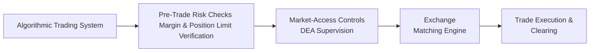

## 24.8 Algorithmic & High-Frequency Order Entry Controls

Algorithmic trading has taken the financial world by storm—especially in the derivatives markets, where precision and speed can make an enormous difference. Whether you’ve watched a Hollywood movie about a supercomputer slinging millions of shares or had a friend mention “algos” at a weekend barbecue, the concept can sound both exciting and, well, a bit intimidating. But trust me, once you see behind the curtain, it becomes clearer how these systems aim to achieve consistent, disciplined execution at scale.  
   
At the heart of this realm lies the fact that many large institutions, proprietary trading firms, and even smaller market participants now use highly automated, pre-programmed instructions to place orders at speeds measured in milliseconds. Over time, these algorithms have grown increasingly sophisticated. In options trading—where they may coordinate hundreds of strikes, expirations, or even multiple underlying instruments—an algorithm can juggle tasks like real-time volatility scans and delta hedging faster than a human can blink.

Still, because the stakes are high, regulators require robust safeguard mechanisms to ensure that an out-of-control algorithm or unscrupulous actor doesn’t disrupt the entire marketplace. The new Canadian Investment Regulatory Organization (CIRO) has made it crystal clear: if you provide direct electronic access (DEA) to clients, or operate an algorithmic trading system internally, then you must have proper risk controls, kill switches, and oversight. Essentially, everyone needs a seatbelt, an airbag, and a well-trained driver before hitting the digital highway.

Below, we’ll explore how algorithms and high-frequency trading (HFT) systems manage option orders, navigate compliance with CIRO guidelines, and generally keep pace with a world that moves at lightning speed. We’ll also examine how kill switches help us avoid “fat-finger” fiascos and discuss potential hazards like spoofing and layering. Let’s dig in, shall we?

  
Understanding Algorithmic Trading in Options  
--------------------------------------------

Algorithmic trading, or “algo trading,” is the use of computer programs to make trading decisions based on pre-defined rules. Picture a scenario: you’re a portfolio manager who holds a large position in energy futures, and you also want to manage directional exposure using call or put options. Rather than manually adjusting your orders each time the price changes, you can write code that will automatically “refresh” your quotes, hedge your positions, or close out trades when your risk threshold is reached.  

While it might sound super high-tech, many of these systems boil down to advanced rule-based decision trees that evaluate real-time market data. They look at factors like implied volatility, the underlying’s spot price, time until expiry, or even broader signals such as macroeconomic data or predicted central bank announcements. Because options can have many moving parts (multiple strikes, expirations, and underlying correlations), an algorithm can process changes systematically and quickly scale across a vast range of positions.

  
High-Frequency Trading: A Rapid-Fire Subset  
-------------------------------------------

High-frequency trading (HFT) is a more specialized type of algorithmic trading. It tries to capture profit opportunities on short timescales—sometimes only a few milliseconds. Remember that hilarious moment in a finance documentary when the narrator basically says, “They make pennies per trade, but they can do it a million times a day”? That’s HFT in a nutshell.  

Because HFT players often focus on tight arbitrage opportunities, they’ll constantly update quotes in the order book to reflect the best possible bid or ask price. If they can detect even a small mispricing between an option and its underlying asset, or between one exchange and another, they’ll pounce with incredible speed. Yes, they often collocate their servers in data centers that are literally steps away from the exchange’s matching engine—anything to shave off microseconds of latency.

  
Regulatory Framework for Algorithmic and High-Frequency Trading  
---------------------------------------------------------------

In Canada, the self-regulatory environment is evolving around these practices. Before January 1, 2023, the Investment Industry Regulatory Organization of Canada (IIROC) and the Mutual Fund Dealers Association of Canada (MFDA) existed as separate entities. As of June 1, 2023, they were amalgamated into the Canadian Investment Regulatory Organization (CIRO). Today, CIRO is in charge of overseeing investment dealers, mutual fund dealers, and market integrity on equity, FX, and derivative marketplaces. This means that if you’re using algorithms to trade options, you must adhere to CIRO’s regulations (including robust risk management systems and pre-trade controls).

There is also the Bourse de Montréal (the Bourse), which handles exchange-traded derivatives in Canada. The Bourse, in conjunction with CIRO, publishes bulletins that outline the “Electronic Trading Eligibility Requirements” for participants. These bulletins often align with global best practices, including those recommended by U.S. regulators like the Commodity Futures Trading Commission (CFTC) and the Securities and Exchange Commission (SEC).  

The gist is: whether you’re offering direct electronic access to clients or using proprietary algorithms, you need to have a strong system in place to catch potential manipulation (like spoofing and layering), limit your exposure, and comply with market rules.  

  
Pre-Trade Risk Controls  
-----------------------

Think of pre-trade risk controls as your first line of defense. They ensure that any order an algorithm tries to place will not violate margin or position limit requirements. This is especially important in options trading because if you accidentally buy or write an enormous number of contracts, you could get hammered by margin calls or find yourself in a capital-consuming fiasco.

Imagine being that nervous junior trader (I’ve been there, trust me) who sets the “notional value multiplier” incorrectly and ends up placing an order ten times bigger than intended. Yikes. In a manual setting, maybe you catch it in time. But in an automated setting, this misconfiguration can lead to thousands of unwanted positions in mere seconds.  

To guard against that, pre-trade checks might include a real-time assessment of open positions, margin thresholds, and the maximum allowable size for each product. If the requested order would push your account beyond those limits, the system automatically rejects it.  

Typical Pre-Trade Risk Checks:
• Margin Availability: Confirms sufficient cash or margin to support the trade.  
• Position Limits: Verifies you’re not exceeding the exchange-regulated or internally set limit for a particular underlying or set of instruments.  
• Price Validation: Ensures the limit price isn’t absurdly away from the current market price (e.g., a limit price that’s 200% above the last traded price).  
• Self-Trade Prevention: Blocks the possibility of your own orders matching against each other, which reduces manipulative or erroneous trades on the same books.  

These checks can live on servers at the broker-dealer level, or partially co-located in the exchange’s data center for minimal latency. Either way, any robust algo trading setup in Canada must address these pre-trade checks before hitting “go.”

  
Kill Switches (Fat-Finger Controls) and Real-World Consequences  
---------------------------------------------------------------

Even the best-designed algorithms can run amok—because software bugs happen, or we humans forget to update a parameter, right? A kill switch, sometimes also referred to as a “fat-finger control,” is basically the “big red button” that halts all trading activity if something abnormal is detected.  

Remember that day I was at a trading firm in downtown Toronto and we had a bug that resized quotes in a disproportionate manner? The moment the system detected we were drastically deviating from normal quoting behavior, it triggered the kill switch. Bam. All pending orders, cancelled. Sure, it’s nerve-racking to see your entire order book vanish in seconds, but that’s way better than discovering that you’ve lost half your capital because an algorithm tried to buy an unlimited quantity.  

Common triggers for kill switches include:
• Rapid sequence of trades that deviate significantly from typical volumes.  
• Order acknowledgments not matching the expected confirmations.  
• Connectivity disruptions leading to partial fill or repeated attempts.  

Brokers and dealers providing direct electronic access to clients must also maintain kill switch functionality that can quickly isolate or shut down specific user IDs. The intention is to prevent a single user with a runaway algo from wreaking havoc on the entire system.

  
The Role of Market-Access Controls  
----------------------------------

Market-access controls refer to procedures enforced by a broker-dealer or direct electronic access provider to ensure that trades flowing into an exchange comply with regulatory and risk constraints. Think of it as a final checkpoint (like airport security) that says, “Yes, you’re clear to board the flight.”  

These controls can be especially important if you let external clients use your direct market access (DMA) or automated system. CIRO requires that a dealer employing DEA must supervise all client algorithms. The dealer is responsible for ensuring:
• The client’s orders won’t create manipulative or unfair trading conditions.  
• The client is abiding by the capital and margin requirements.  
• Tools are in place to detect suspicious activity, such as spoofing or layering.  

If a suspicious activity spike is detected—like repeated order cancellation patterns consistent with spoofing—the system should flag it or shut it down automatically. Because advanced machine-learning solutions can track typical patterns of an algo and highlight anomalies, the best systems combine real-time data analytics with compliance logic that’s updated as market rules evolve.

  
Monitoring Spoofing, Layering, and Other Manipulative Tactics  
-------------------------------------------------------------

Regulatory authorities pay keen attention to manipulative practices. Spoofing involves placing an order with no real intention of executing it, solely to move the market or mislead other participants. An HFT or algo can place—and then rapidly cancel—these “fake” orders to trick everyone into thinking there’s strong buying or selling interest.

Layering is a similar tactic where multiple fake orders are placed at different levels in the order book, creating an illusion of momentum. It’s like saying, “Look how many orders are stacked to buy this option! It must be going up.” Then, unsuspecting participants might respond, and you can pounce by taking the other side.  

In Canada, the Bourse de Montréal and CIRO have stepped up real-time surveillance. They analyze order flows, cancellations, and cross-market activity to detect these patterns. If they see you placing suspicious orders and cancelling them immediately, that’s a potential red flag. Expect a follow-up, an investigation, or in serious cases, fines and sanctions.  

  
Illustrating the Electronic Order Flow  
--------------------------------------

Below is a simple visual diagram of how an automated order might flow from an algo to an exchange’s matching engine. This is a Mermaid diagram illustrating the steps:

1. The algorithmic trading system prepares the order based on its rules.  
2. The order passes through pre-trade risk checks.  
3. The market-access controls of the broker or direct electronic access provider verify it.  
4. The order reaches the exchange’s matching engine.  
5. If successfully matched, the trade is executed, and details flow to the clearinghouse.  

This pipeline underscores how an order must pass multiple checkpoints (some automated, some supervised) before it interacts with the official market.  

  
Practical Examples of Algo Trading in Options  
---------------------------------------------

Let’s talk about a real-world scenario: you’re operating a covered call writing strategy. Your portfolio holds shares of Company ABC, and your system says, “Every time implied volatility for the front-month calls in ABC spikes above a certain level, write calls for a 2% premium of the underlying.” That can be turned into an algorithmic rule. The algo monitors IV in real time and automatically places limit orders for the calls, adjusting for the share price.  

Suddenly, the underlying stock price jumps 4% in a single session, and implied volatility does a roller-coaster ride. The algo can seamlessly update its order parameters without any human intervention. Without automation, you might have missed the window to capitalize on the higher premiums.  

However, imagine there’s a glitch. Instead of writing calls at your desired premium, the program interprets a mispriced data feed and tries to write calls at 70% of the recommended price. That’s disastrous. If your kill switch or pre-trade control sees a massive drop in the limit price, it can reject or pause those orders until you figure out what’s going on.

  
Adapting to Rule Changes and Technology Updates  
----------------------------------------------

Algorithms thrive on stable market conditions, but we all know that rules and technology evolve. Exchanges may introduce new functionalities such as implied pricing algorithms, or new option products with unique settlement. Regulators might change position limits or tweak the margin guidelines.  

Firms engaged in algo and HFT trading must therefore remain agile. The second any new rule or product feature is announced, someone in the compliance or tech team needs to confirm that the code is updated accordingly. For example, if the Bourse modifies the way a certain futures option is margined, your pre-trade risk checks must be recalibrated. If you fail to handle it properly, you’re essentially driving at night with no headlights.  

One critical update in Canada was the transition from CDOR (Canadian Dollar Offered Rate) to CORRA (Canadian Overnight Repo Rate Average) for certain interest rate derivatives. While that primarily affects swaps and futures, it can indirectly influence certain option-based strategies that rely on interest rate curves for pricing. Algos that factor in interest rate inputs need to adjust quickly.

  
Best Practices and Pitfalls to Avoid  
------------------------------------

• Over-Reliance on Historical Data: An algo might be trained on historical relationships between an underlying stock and its implied volatility. But markets evolve, and a once-reliable correlation can break. Always keep your models updated and diversify your triggers.  
• Inadequate Testing Environment: Don’t deploy new algorithms without rigorous testing in a sandbox environment. Include stress-test scenarios where the algo sees extreme price moves or high volatility.  
• Skipping Manual Overrides: Sure, we love automation, but we’re also human. Maintain an emergency override mechanism for times when the market goes haywire—take, for instance, major announcements from global central banks.  
• Insufficient Communication Between Trading and Compliance: Sometimes the tech folks write the code, but compliance or risk managers are left in the dark. Ensure everyone is aligned on the algorithm’s goals and risk thresholds.  
• Latency Race: Competing in HFT can become a game of who’s faster, leading to expensive investments in data center collocation or specialized hardware. Make sure the cost is justified by the potential returns and that your compliance is bulletproof.  

  
References and Additional Resources  
-----------------------------------

• CIRO: For official guidelines on direct electronic access and electronic trading controls. (Visit [https://www.ciro.ca](https://www.ciro.ca))  
• Bourse de Montréal Bulletins: Check the Bourse’s website for notices regarding new electronic trading functionalities, recognized algorithms, and surveillance updates.  
• CFTC and SEC Publications: The U.S. Commodity Futures Trading Commission and the Securities and Exchange Commission provide valuable insights into HFT rules, market structure analyses, and best practices.  
• Open-Source Tools and Frameworks: Many traders and quants rely on Python-based libraries for backtesting (e.g., QuantLib or Zipline). Still, remember that you’ll need add-ons or modules specifically tailored to handle complex options logic.  

  
Final Thoughts  
-------------

In the hypercompetitive world of derivatives, it’s no surprise that institutions range from small specialized hedge funds to giant banks, all jostling for the best execution or the slightest edge in the options market. Algorithmic and high-frequency trading can be a game-changer for speed and efficiency, but it also introduces new risks—technical errors, manipulative tactics, or unexpected blowouts—that must be carefully managed.  

From a regulatory perspective, we can see that CIRO is primed to keep an even closer watch: they demand that your systems have robust pre-trade checks, kill switch functionality, and consistent oversight to detect manipulative behavior. The Bourse de Montréal stands alongside them, pushing for transparent, liquid, and orderly markets.  

And if you ever feel unsettled by the idea of an all-powerful robot trading on your behalf, remember that behind every algorithm sits a human developer or manager who designs it, monitors it, and ensures it stays on a prudent path. In a sense, your knowledge of these controls is the best “insurance policy” to keep your trading healthy—whether you’re a small investor or a global bank.  

Now that we’ve explored how these systems and controls work, you’ll have a better grip on the big question: “Are the machines in charge, or are we?” The answer lies somewhere in between. Armed with robust risk controls, well-thought-out kill switches, and vigilant oversight, we can leverage algorithmic and high-frequency trading without losing sight of prudent risk management.

  
## Sample Exam Questions: Algorithmic & High-Frequency Order Entry Controls



### Which of the following best describes “algorithmic trading” in the derivatives market?

- [ ] Using only telephone orders routed through a human broker.
- [x] Employing automated, pre-programmed instructions to execute trades.
- [ ] Trading exclusively during the final minutes before market close.
- [ ] Manual order entry under the direct supervision of a compliance officer.

> **Explanation:** Algorithmic trading automates trade decisions and execution based on predefined rules or market signals.  

### What is the primary purpose of a kill switch in an algorithmic trading system?

- [ ] To provide faster market data.
- [ ] To reduce margin requirements on complex option spreads.
- [x] To quickly halt trading if abnormal or runaway activity is detected.
- [ ] To generate additional liquidity rebates.

> **Explanation:** A kill switch is a safety mechanism that cancels all pending orders and halts trading to prevent catastrophic losses from runaway or erroneous trading.  

### Under current CIRO rules, which entity is responsible for supervising the risk controls of a client’s direct electronic access (DEA) algorithmic trading system?

- [x] The dealer providing DEA.
- [ ] The exchange’s listing committee.
- [ ] The client’s third-party risk vendor.
- [ ] The global central bank.

> **Explanation:** CIRO requires that dealers offering DEA must oversee and ensure that clients’ orders comply with all applicable market risk and margin requirements.  

### Which of the following trade practices is considered manipulative and subject to regulatory scrutiny?

- [ ] Submitting market orders at the bid or ask.
- [ ] Buying a protective put for risk management.
- [x] Spoofing or layering (placing orders with no intent to fill, then cancelling to move the market).
- [ ] Hedging a covered call position using index futures.

> **Explanation:** Spoofing and layering artificially inflate or deflate perceived demand, which is illegal and actively monitored by regulators.  

### Why are pre-trade risk controls particularly important in options trading?

- [x] Options have multiple strikes, expirations, and high leverage, increasing the potential for large unintended exposures.
- [ ] Options don’t require margin or collateral.
- [ ] Options are always traded manually on the exchange floor.
- [ ] Options positions usually have negligible market impact.

> **Explanation:** The complexity and leverage embedded in options necessitate robust controls to ensure margin and position limits are not breached due to erroneous or overly aggressive orders.  

### Which components do pre-trade checks commonly verify?

- [ ] Only the client’s geographic region.
- [ ] The color scheme of the trading platform.
- [x] Margin availability, position limits, and price validations.
- [ ] Historical volatility patterns only.

> **Explanation:** Pre-trade checks typically assess account margin capacity, position limits imposed by the exchange or firm, and limit-order prices to reduce erroneous trades.  

### What immediate action does a kill switch take when triggered?

- [x] Cancels all open orders and halts new order submissions.
- [ ] Opens a margin line of credit to cover potential losses.
- [ ] Schedules risk reviews for the following trading session.
- [ ] Increases order size to offset losing trades.

> **Explanation:** Once a kill switch is triggered, it immediately withdraws all active orders and stops new ones from entering the market until the issue is resolved.  

### Why might a high-frequency trading firm invest heavily in collocation near the exchange?

- [ ] To improve staff morale by providing nicer office spaces.
- [x] To reduce network latency and enhance speed of order execution.
- [ ] To comply with SEC requirements for physical proximity.
- [ ] To fulfill a Bourse de Montréal rule about mandatory data center usage.

> **Explanation:** Collocation allows HFT firms to place their servers physically closer to exchange matching engines, minimizing the time for data to travel.  

### What does layering achieve for a manipulative trader?

- [x] Creates the illusion of substantial buying or selling pressure to move the market in their favor.
- [ ] Prevents the execution of all orders on a specific ticker symbol.
- [ ] Institutionalizes a new market-making mechanism.
- [ ] Ensures perfect compliance with Bourse margin rules.

> **Explanation:** Layering is used to deceptively display large limit orders at various price levels with no intent of execution, falsely signaling strong demand or supply.  

### True or False: Spoofing is considered a benign market practice that regulators generally ignore.

- [ ] True
- [x] False

> **Explanation:** Spoofing is illegal under CIRO, the Bourse de Montréal, and most global regulatory frameworks. It is actively monitored and penalized.  


