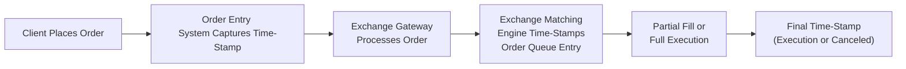

## 24.9 Time-Stamps & Regulatory Reporting Requirements

Let's talk about something that might seem a tad technical on the surface—time-stamps and regulatory reporting for listed option orders—but is actually super important for ensuring orderly, fair, and transparent markets. I've met a few traders who once shrugged off time-stamps as minor, administrative details. Then they realized that missing or inaccurate time-stamp data can lead not only to compliance headaches but also to potential disputes over trade execution priority and audit trails. Basically, time-stamps and reliable regulatory reporting are the best friends you never realized you needed in option trading.

Below, we’ll unravel why in the Canadian marketplace (with references to global practices for comparison), having precise time-stamps and robust reporting is so vital. We’ll also dip into the concept of how this data is used by CIRO—Canada’s national self-regulatory body—to ensure there's no market abuse and that trades are properly monitored from the moment they hit the trading system to final settlement.

---

### Why Time-Stamps Matter

You know that friend who’s always late or never quite in sync with the rest of your group? Well, imagine if that friend was your trading system’s clock. In the world of options trading—where a fraction of a second can mean the difference between a profitable trade and a losing one—having accurate timing data is imperative. In Canada (and worldwide, really), every step of an order’s lifecycle must be precisely recorded:

• The moment the order hits the system (order receipt).  
• Any modifications, cancellations, or partial fills.  
• Final execution or cancellation time.

#### Facilitating Fair Market Access
Time-stamps help determine who placed an order first. Exchanges match orders on a price-time priority basis, meaning the first valid order at a given price typically gets filled first. If your time-stamp is off—or if your entire system's clocks are unsynchronized—some traders might enjoy an unfair advantage.

#### Compliance and Dispute Resolution
Let’s say a client complains that their order was executed at the wrong price or that it never made it to the market on time. Time-stamp records make it possible to reconstruct the event second by second (or millisecond by millisecond in many cases), demonstrating precisely when the order arrived and what happened. Without consistent, accurately synchronized time-stamps, you can’t confidently resolve disputes.

#### Regulatory Audits and Oversight
Regulators like CIRO need to reconstruct market events to investigate possible manipulation, insider trading, or just to confirm that everything's operating fairly. If your records are inconsistent, you could run into trouble during an audit. Plus, high-profile events (like flash crashes or single-day anomalies) often lead regulators to demand precise trade data to analyze exactly what happened.

---

### Clock Synchronization Standards

Even though you might think, “Our phones automatically set their clocks—why not just rely on that?” well, sophisticated trading systems require something more precise. Canadian regulators, in line with global best practices, demand that all trading terminals, servers, and backup systems align their clocks to a recognized time standard, often Coordinated Universal Time (UTC) plus an offset. 

#### NTP Protocols and Millisecond Accuracy
Firms typically employ the Network Time Protocol (NTP) or more advanced time servers connected to GPS signals to ensure sub-millisecond accuracy. That consistency level is crucial for environments like high-frequency trading centers. And it’s not just about the servers—every point in your trade chain, from the front-end order management system at the branch level to the exchange’s matching engine, must be diligently synchronized. A mismatch of even a few milliseconds in timestamped logs can lead to big problems during a regulatory review.

#### Common Pitfalls
• Failing to update time synchronization software, leading to drift over time.  
• Running older hardware that can’t handle the required time precision.  
• Overlooking test environments or failover systems—if you switch to your backup system at a critical moment and that system’s clock is mismatched, you’ll have a gap in your records.

---

### Order Lifecycle and Time-Stamp Capture

To visualize how time-stamps occur at each significant order event, let’s take a quick look at a simplified flow diagram:

• Client Places Order: The moment the client hits that “Buy” or “Sell” button, the official start of your record.  
• Order Entry System Captures Time-Stamp: This might be your firm’s internal system that notes, “We received the order at 09:30:05.001 EDT.”  
• Exchange Gateway Processes Order: The order is sent to the exchange gateway—another time-stamp is recorded when the order is accepted.  
• Exchange Matching Engine Time-Stamps Order Queue Entry: Once at the matching engine, it’s queued up with a definitive exchange time-stamp that determines its position in the queue.  
• Partial Fill or Full Execution: If it’s a partial fill, you’ll see multiple time-stamps for each portion filled. The entire order’s history (including the partially filled volumes) is crucial.  
• Final Time-Stamp (Execution or Canceled): Ultimately, the order either trades completely or gets canceled. That final time-stamp closes out the record.

These records collectively form the order’s lifecycle, tracking it from initial acceptance to conclusion. If you’re in a compliance or back-office role, you might actually see logs with 5, 10, or even 15 different time-stamps for a single complex order.

---

### Regulatory Reporting Obligations in Canada

Canadian regulatory reporting for listed options is shaped largely by CIRO rules (CIRO is the consolidated self-regulatory organization that replaced the former IIROC and MFDA as of 2023). The overarching principle is: “If you have a significant activity in the market, the regulator wants to know enough about it to confirm it’s legitimate, fairly traded, and poses no systemic risk.” 

#### CIRO Transaction Reporting
All orders, including listed options, must be reported to the marketplace and to the clearing corporation (e.g., Canadian Derivatives Clearing Corporation (CDCC)) in near real-time. Additionally, your firm must keep an internal record that includes:

• Client Identifier (CID).  
• Account type or classification (e.g., retail, institutional, proprietary).  
• The time-stamps (receipt, any modifications, cancellations, and executions).  
• Quantity and price data.  
• Whether the order is opening or closing a position.

If your trades exceed certain volume or notional thresholds, you might have more robust reporting obligations—like completing Large Open Position Reports to the Bourse de Montréal. Such reporting ensures that no single participant is covertly building a position that could disrupt the market.

#### CSA and SEDAR+
While the Canadian Securities Administrators (CSA) coordinates provincial securities regulation, they also rely on robust electronic reporting frameworks. SEDAR+ is a system for electronically filed documents, mostly for issuers. However, certain filings related to commodity pools or structured products can show how derivatives are used. It’s not the same as trade-by-trade reporting, but it forms part of the overall transparency matrix.

#### Scope of Oversight and Flagged Orders
CIRO, along with the Bourse de Montréal, monitors suspicious orders or trades that might indicate manipulative strategies or front-running. Suppose an order is repeatedly canceled at the last moment or always appears in a way that artificially influences prices (spoofing). The time-stamps and order details feed into the regulators’ systems, automatically scanning for patterns. If an order triggers suspicion, regulators can request more detailed logs from your firm, including internal memos or communications that might show an intent to manipulate prices.

---

### The Role of Client Identifiers

A key piece of the puzzle is the Client Identifier (CID). Picture the scenario: a day-trader enters a bunch of different orders across multiple accounts. Without a unique ID, it might be difficult for regulators to figure out that these orders are actually from the same underlying client. The ability to track the beneficial owner of a transaction is crucial to prevent or detect market abuse.

In the past, some traders tried to spread orders among different accounts, maybe in multiple jurisdictions, to hide a single, large position. Today, in Canada, if you open an account or place trades, your personal or corporate entity details are associated with each order. This “flag” is not publicly displayed (for obvious privacy reasons), but it’s embedded in the data reported to regulators so they can keep a watchful eye all the way from order placement to settlement.

---

### Large Option Positions and Market Abuse

You might be wondering what all of this has to do with cracking down on market abuse. Let me illustrate with an example:

Suppose a client is building a huge position in a Canadian equity option—maybe they’re amassing a ton of long calls right before a rumored takeover announcement. If the market is unaware of the client’s identity or the true scope of the position, the client could suddenly exercise or sell these options, potentially causing major dislocations. Conversely, if CIRO and exchange surveillance systems see time-stamped data for every order—plus the client’s ID—they can quickly identify that “Hey, this person’s building a way bigger position than normal.” This kind of real-time and post-trade monitoring can deter insider trading, cornering, or other manipulative activities.

---

### Best Practices for Maintaining Accurate Time-Stamps

1. **Use Reliable Time Sources**: Implement NTP or GPS atomic clock sources.  
2. **Frequent Testing**: Regularly compare your system’s logged times against an external reference.  
3. **System Patches**: Keep your operating systems and time-sync software updated.  
4. **Monitor for Drift**: Implement daily or hourly checks to ensure clocks haven’t drifted.  
5. **Redundancy**: If one clock source fails, have a fallback.  
6. **Document Everything**: Maintain logs of your sync processes and keep them updated for at least the regulatory minimum retention period, which can be several years.

Failing to uphold these standards isn’t just a technical glitch— it can lead to significant monetary and reputational penalties. Plus, inaccurate time-stamps could inadvertently cast suspicion on your firm if an investigation arises.

---

### Pitfalls and Potential Consequences

• **Trade Allocation Disputes**: If time-stamps are inconsistent, how do you know which client’s trade was legitimately filled first?  
• **Regulatory Fines**: Repeated or serious failures to maintain an audit trail can trigger fines from CIRO.  
• **Reputation Damage**: One time-stamp scandal or negative headline can tarnish a firm’s otherwise solid image.  
• **Client Complaints**: The client might suspect you found them a bad fill if your logs can’t confirm the timeline.  
• **Litigation Risk**: In some extreme cases, lacking consistent time-stamps can escalate from a compliance matter to legal battles.

---

### A Quick Personal Anecdote

Years ago—long before CIRO’s robust digital systems were in place—I worked with a team that sometimes used manual booking for a portion of orders. (Yes, people really did that occasionally.) One day, we found ourselves in a real jam when a high-value client insisted their order had been placed earlier than our system’s record showed. Our timestamp was off by about three minutes because the local workstation clock had drifted! Three minutes might not sound like much in everyday life, but it’s an eternity when you’re placing a large order. After that fiasco, we made sure every terminal was synced every hour—like clockwork (pun intended). Anyway, we ended up smoothing things over with the client, but it was a stressful experience that could have been entirely avoided with better time-sync protocols.

---

### Additional Tools and Resources

• **CIRO Website (https://www.ciro.ca)**: For the most current rules, guidelines, and bulletins on regulatory reporting and best practices for maintaining audit trails.  
• **Bourse de Montréal Technical Guides**: The Bourse often publishes frameworks on how to handle time-stamps for electronic trades, including recommended testing and fallback systems.  
• **SEDAR+**: Although mostly for issuer filings, it can contain broader corporate data relevant to derivative product issuance.  
• **“Canadian Securities Exam: Fast-Track Study Guide” by W. Sean Cleary et al.**: Offers a deeper dive into compliance and recordkeeping topics that complement your DFOL studies.  
• **Open-Source Tools for Time-Sync**: Tools like Chrony and NTPsec are widely used to maintain accurate server times across networks.  

---

### Putting It All Together

Time-stamps are more than just digital scribbles on a ledger. They form the foundation of an orderly market, ensuring that trades are executed in a fair, transparent manner—particularly in options trading, where speed and timing are everything. Coupled with rigorous reporting requirements, the time-stamp data gives regulators full visibility into who’s trading what, at what time, and in what volumes.

Nowadays, in an era of algorithmic trading and lightning-fast transactions, if your systems can’t keep up, you risk more than just missed trading opportunities—you risk compliance missteps and potential legal ramifications. Understanding and adhering to Canadian staples—like capturing each client’s unique identifier (CID) and ensuring that orders above set thresholds are flagged—helps maintain a healthy marketplace. Ultimately, these processes aren’t stifling. They facilitate that comfortable sense of trust necessary for derivatives markets to work.

No matter the size of your trading operation—whether you’re a floor broker with decades of experience or a start-up fintech platform offering app-based options trades—precise time-stamps and thorough regulatory reporting remain the bedrock of your daily tasks. For those studying for the Derivatives Fundamentals and Options Licensing Course (DFOL), mastering these details now ensures you’ll be well prepared to design or operate within a compliant trading infrastructure.

---

## Sample Exam Questions: Time-Stamps & Regulatory Reporting Requirements



### Which best describes the main reason regulators require timestamped order tracking?

- [x] To ensure fair trade allocation and maintain robust audit trails  
- [ ] To simplify data interfaces for market makers  
- [ ] To reduce the need for cross-border regulation  
- [ ] To eliminate the possibility of trade errors entirely  

> **Explanation:** Regulators need timestamped data to determine which orders arrived first, to reconstruct trade events, and to investigate anomalies or disputes. This ensures fair allocation and a transparent marketplace.

### What is a key benefit of clock synchronization across all trading systems?

- [x] Guarantees that order times are consistent for audit and dispute resolution  
- [ ] Removes the need for reporting large orders  
- [ ] Prevents all forms of market abuse automatically  
- [ ] Increases system latency to give traders more time to react  

> **Explanation:** Clock synchronization ensures consistent timestamps, which is crucial for fair trade allocation and clear audit trails. It does not replace other regulatory controls.

### In Canadian markets, what is a primary function of the Client Identifier (CID)?

- [ ] To publish the client’s personal details on market data feeds  
- [ ] To allow anonymous trading with no accountability  
- [x] To link trades to the beneficial owner and enable regulatory oversight  
- [ ] To ensure clients remain private even to regulators  

> **Explanation:** The CID lets regulators see which specific client is placing orders, aiding in the detection of market abuse or large position accumulation.

### Which of the following is typically part of a firm’s strategy to maintain accurate and compliant time-stamps?

- [x] Employing Network Time Protocol (NTP) servers and monitoring for clock drift  
- [ ] Disabling all updates to preserve original system settings  
- [ ] Mandating manual logs of trade times in a paper ledger  
- [ ] Using random time intervals for clock updates  

> **Explanation:** Having robust systems to maintain precise clock synchronization is essential. Relying on manual logs or ignoring updates often introduces major inaccuracies.

### Why might an order be flagged and reported for additional regulator review?

- [x] It exceeds volume thresholds or shows suspicious behavior  
- [ ] It is for clients over 65 years old  
- [ ] It’s a market order rather than a limit order  
- [ ] It’s executed on an American exchange  

> **Explanation:** Large or suspicious orders must be flagged for potential manipulative strategies or to ensure no single entity is accumulating a position that might disrupt the market.

### Which entity is primarily responsible for clearing Canadian listed option trades?

- [x] The Canadian Derivatives Clearing Corporation (CDCC)  
- [ ] CIPF  
- [ ] The Toronto Stock Exchange (TSX)  
- [ ] The British Columbia Securities Commission  

> **Explanation:** The CDCC clears derivatives (including options) in Canada, providing the critical function of ensuring both sides of a trade can meet their obligations.

### When might regulators request a detailed timeline of order events?

- [x] During an investigation of potential insider trading or market manipulation  
- [ ] At the start of each new trading day  
- [ ] Only if a firm stops using NTP servers  
- [ ] Right before final settlement of all trades  

> **Explanation:** Regulators often need detailed logs during compliance audits, when investigating suspicious trading patterns, or after major market events.

### What is one consequence of failing to maintain consistent time-stamps?

- [x] Potential regulatory fines or sanctions  
- [ ] Lower commissions for clients  
- [ ] Elimination of auditing requirements  
- [ ] Reduced firm profitability but no regulatory impact  

> **Explanation:** Inaccurate or inconsistent time records can lead to fines, reputational damage, and possible suspension of trading privileges by regulators.

### Which regulator took over from the former IIROC and MFDA bodies in 2023?

- [x] CIRO  
- [ ] CSA  
- [ ] SEC  
- [ ] FINRA  

> **Explanation:** The Canadian Investment Regulatory Organization (CIRO) is the new self-regulatory body formed by amalgamating IIROC and the MFDA in 2023.

### True or False: Time-stamps alone eliminate all risks of market manipulation.

- [x] False  
- [ ] True  

> **Explanation:** Time-stamps are a critical tool to track and reconstruct trades, but they do not, by themselves, eliminate all forms of manipulation or abuse. Comprehensive surveillance and reporting processes are still required.


