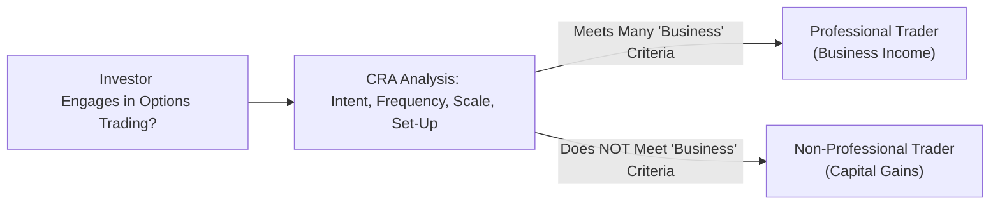

## 25.1 Professional vs. Non-Professional Option Traders

Picture this moment: you’re casually scrolling through your brokerage statements, sipping your morning coffee (or tea, if that’s more your style), when you suddenly realize that tax season is around the corner. You’ve been dabbling in options, maybe selling a few covered calls here or there, and perhaps you made a few more trades than you initially planned—hey, the market was exciting, right? Now you wonder: am I a “professional” trader in the eyes of the Canada Revenue Agency (CRA), or just a “non-professional” retail investor? And, by the way, how does that classification affect how much tax I owe?

This is exactly what we aim to clear up in this section. The distinction is really important, and, trust me, you don’t want a nasty surprise from the tax authorities. Let’s break down the logic behind the rules, the relevant Canadian regulations, and how you can determine whether your gains and losses are classified as business income (fully taxable) or capital gains (often more favorable, as typically only 50% is taxable).

-----------------------------------------
## Understanding the Basics

When we talk about “professional” vs. “non-professional” option traders, we’re essentially discussing two different tax treatments. In Canada, the CRA looks at several factors to figure out how you, the taxpayer, should classify your profits and losses from options (and indeed from other securities or commodities trading). Some key items include:

• Your intent behind trades.  
• The frequency or scale of your trading.  
• Whether you have an organized setup (e.g., an office, staff, a system, or routine).  
• Whether you rely on that income for your livelihood.  
• Your overall level of trading knowledge and sophistication.  

If you’re considered a professional trader, you typically report your gains (and losses) as business income. This means that 100% of your net profits are subject to income tax. But it also means that some business expenses could be deducted (e.g., your trading platform fees, home office costs, and so on).

If you’re treated as a non-professional—often referred to as a retail investor—options gains or losses are generally treated as capital gains or losses (unless there are special circumstances that dictate otherwise). Capital gains are, of course, taxed more lightly in Canada: effectively only 50% of the gain is recognized in your taxable income. This can be a significant advantage if your trades are profitable. But that also means you can’t deduct quite as many expenses against that income.

So which category should you pick? Let’s talk about how the CRA decides.

-----------------------------------------
## CRA Classification Criteria

The CRA often references common-law principles and specific guidance in its interpretation bulletins to determine whether an individual’s trading activity constitutes a business. One resource you can check out is CRA Folio S3-F9-C1, “Income from Business or Property,” which covers some aspects of securities transactions.

Below are some major factors:

1. **Trading Frequency**: Do you trade every day, or do you just do a few trades a month? If you’re constantly buying and selling—as if it’s your day job—this might tilt you toward professional trader status.

2. **Holding Periods**: Professionals often hold positions for very brief timeframes, maybe minutes, hours, or a few days, whereas retail traders might hold positions for weeks or months.

3. **Dependence on Trading Income**: If your trades fund your lifestyle (rent, groceries, daily expenses), and you rely heavily on them—well, that’s a big sign of professional activity according to the CRA.

4. **Level of Organization**: Do you have an actual workspace dedicated to trading? Are you running specialized trading software, employing staff, or systematically advertising your “services”? If yes, then it leans more professional.

5. **Business-Like Structures**: This includes having a corporation set up for trading, paying for data feeds, algorithmic trading software, or other major investments to facilitate your trades.

6. **Background and Expertise**: If you’re a recognized capital markets “guru,” or you have advanced certifications (e.g., Chartered Financial Analyst (CFA) or extensive derivatives training), it might indicate that you operate similarly to a commercial enterprise.

There’s no single bullet that decides classification; it’s all about how these factors come together. If you combine a short holding period, frequent trades, substantial reliance on trading income, and advanced technical knowledge, you’re more likely to be seen as professional by the CRA.

Here’s a quick diagram to illustrate the classification approach at a high level:

This is just a simplified visual. Real life is often a bit more nuanced, with lots of grey areas.

-----------------------------------------
## Tax Treatment: Business Income vs. Capital Gains

### Business Income
If you’re considered a professional, your net profits are taxed at your full marginal rate, just like any other business income. So, 100% is included in taxable income. The good news is that business expenses—which might include a portion of your rent (if you have a home office), subscription costs for advanced data feeds, or fees for subscription-based charting services—could be deductible. Some professional traders can also write off computer equipment, allocated overhead, and more.

However, going the business-income route also means that if you rack up losses, those losses are classified as business losses, which can be advantageous in some cases because business losses can offset other forms of income. So if you’re unlucky in your trades but happen to have other forms of revenue, you might operate at an overall loss for tax purposes, effectively lowering your entire taxable income.

But caution: consistently declaring business losses when the CRA thinks your trades are mainly personal or capital in nature can lead to a dispute. The CRA might come back and say, “Uh, no. We believe you’re a retail investor, so these losses are capital losses, and you cannot offset your day job earnings with them.” That can be a painfully expensive conversation.

### Capital Gains
On the other hand, if you’re a non-professional or retail investor, any gains you realize from buying and selling options generally get taxed as capital gains—meaning only 50% of that gain is included in your taxable income. If you’re consistently profitable, that’s obviously a major plus. But you can’t claim the same breadth of deductions as you could if you were considered a business. Typically, you don’t get to deduct “business” expenses like your day-trading software or your internet bill specifically for trading.

But again, if your trades take a nosedive, you have capital losses. These capital losses generally can offset other capital gains, but they can’t be used to offset regular income (beyond some specific scenarios, such as the allowable business investment losses (ABIL) concept, but that’s usually for different scenarios involving shares in small business corporations, and not typical for day-to-day derivative trades).

-----------------------------------------
## Real-World Scenarios

• **Case 1: The Occasional Trader**  
  Let’s say you’re an engineer who trades a handful of options each month, mainly writing covered calls on blue-chip stocks in your RRSP or TFSA (though note that in certain registered accounts you have restrictions on certain derivatives strategies). You typically hold positions for weeks or even months. Your annual net gains from these trades are more like a side bonus than your main source of income. In that circumstance, you’re pretty safely in the “non-professional” bucket.

• **Case 2: The Intensive Day Trader**  
  Now, let’s consider someone who logs into a real-time trading platform each morning. They buy and sell call and put options multiple times a day, scalping small movements. They rely on these profits to pay the bills, and they’ve set up an entire home office with advanced multi-monitor setups, perhaps employing a small staff or trading signals group. That’s a pattern the CRA might label “professional.” Gains are business income, 100% taxable, but also come with the potential to deduct a range of expenses.

• **Case 3: The Transition**  
  Sometimes folks start gently—just a few trades as a hobby—then they gradually go heavier, until they’re basically full-time active traders. The classification can change over time. Maybe from 2019 to 2022 you were a mild-mannered retail investor, but in 2023 you shifted to daily trades, advanced strategies (like short straddles, iron condors, short gamma positions), and you rely on those proceeds. The CRA may consider that 2023 onward is professional trading. Pay attention to the turning points in your activity.  

In all examples, keep your records meticulously, from trade logs to expense receipts, so you can prove your classification if the CRA ever comes knocking.

-----------------------------------------
## Recordkeeping and Documentation

You might be thinking, “Ugh, more paperwork. Is it really that important?” Yes, it is. If the CRA decides to conduct a detailed audit, the difference between you walking away with a sigh of relief or a big tax bill may hinge on whether you have a clear paper (or digital) trail.  

Here’s what you should keep:

• **Brokerage Summaries**: Monthly or yearly statements summarizing all buys, sells, and dispositions of options and related securities.   
• **Trade Confirmations**: Every single trade confirmation can help show your holding periods.  
• **Expense Receipts**: If you plan to claim expenses because you consider yourself a professional, be sure to store receipts (office supplies, subscription platforms, data feeds, hardware, etc.).  
• **Diary of Intent**: Keep track of your strategy or approach. If you have some notes about your trades—why you opened them, how long you planned to hold them, etc.—this might support your classification in a borderline situation.  
• **Tax Documentation**: T5008 slips from your broker can show proceeds of dispositions. Make sure you cross-verify with your own records.

It can help to download an open-source tax software, like Open Tax Solver, for preliminary calculations to see the difference between capital gains and business income treatments, though I’d strongly recommend professional advice if the numbers start getting big.

-----------------------------------------
## Potential Pitfalls and Common Mistakes

1. **Overlooking Shifting Status**: Sometimes you start as a retail investor, but your activity scale morphs. Keep track of any changes so you can update your classification if necessary.
2. **Claiming Everyone Is a ‘Business’**: Some folks see the ability to deduct expenses and think, “Hey, that’s great,” not realizing that if the CRA reclassifies them, they might be subject to interest and penalties.  
3. **Assuming Capital Gains Status Even If You’re Full-Time**: If you’re literally day-trading strapped to your desk every single day, the CRA might balk at your classification as an “occasional” investor.
4. **Neglecting Proper Audit Trail**: If you’re claiming business expenses, are you sure you have the receipts? And does your usage reflect a genuine business purpose?  

-----------------------------------------
## Leverage, Options, and the CRA

Some folks shy away from labeling themselves as pros because they’re not “licensed,” or they don’t have a big client base. The CRA, however, looks beyond “licensing.” If your overall activity is professional in nature, that’s what counts. Especially with options—a leveraged product—there’s potential for significant gains or losses in very short periods. This can sometimes be a red flag that triggers closer scrutiny.

Also, in Canada, remember that there’s a brand-new environment for investment dealers and regulatory oversight known as the Canadian Investment Regulatory Organization (CIRO), which replaced the former IIROC and MFDA structures (these defunct predecessor SROs are purely historical references now). While your classification as a professional or non-professional trader is primarily a tax matter (rather than purely a regulatory one), keep in mind that the overarching environment is changing. If your trading is done via a Canadian broker, they’ll also watch for compliance with CIRO guidelines regarding margin, risk management, and so forth.

-----------------------------------------
## Additional Resources for Further Exploration

1. **CRA Website**:  
   • https://www.canada.ca/en/services/taxes.html  
   The official hub for all matters tax-related in Canada, from deadlines to filing instructions.

2. **CRA Folio S3-F9-C1**: “Income from Business or Property”  
   • This can be found in the CRA’s online folios and interpretation bulletins. Contains guidance on what constitutes a business.

3. **Income Tax Act (Canada)**  
   • Specifically, sections dealing with capital property transactions and business income. If you want to get into the nitty-gritty legislative details.

4. **CIRO Website**:  
   • https://www.ciro.ca  
   Though the classification for tax is a CRA matter, it’s still helpful to see how your trades might fit into the overall regulatory perspective in Canada.

5. **Open Source Tools**:  
   • Open Tax Solver (https://opentaxsolver.sourceforge.net) for basic calculations. Be mindful, though, that professional help is invaluable if your situation is complex.

6. **“Canadian Securities Regulation” by Anisman**  
   • A more advanced read for those who want to dive deeper into the interplay between securities regulation and how it might shape your approach to trading.

7. **Professional Tax Advisors**  
   • Quite frankly, if your volume is high, or if you’re gambling with large sums, pick up the phone and chat with a tax accountant or a securities lawyer. It could save you a lot of headaches.

-----------------------------------------
## Best Practices and Final Takeaways

• **Be Honest**: Don’t try to “game” the system. If you’re truly a day trader, it doesn’t help to label yourself as a retail investor just to get a lower tax rate if the CRA can easily see that you’re trading full-time.

• **Keep Good Records**: Maintain a consistent log of trades, expenses, and your rationale. This helps clarify your intent and classification.

• **Review Each Tax Season**: Your classification can shift year over year. Always review your trading activities at the end of the year and see whether anything changed drastically.

• **Consult Professionals**: If you’re on the fence—maybe your trades are borderline or you’re experiencing some special complexity, like short-selling, advanced options strategies (strangles, straddles, etc.), or cross-border trades—it’s wise to consult a tax specialist.

• **Prepare for a CRA Reassessment**: If the CRA challenges your classification, you’ll need a robust audit trail. Show them you’re consistent with how you present your trades, that you have utilized the correct forms, and that you’ve documented your activities in alignment with your declared classification.  

At the end of the day, the professional vs. non-professional distinction isn’t always cut and dry—but you can certainly steer your classification in the right direction with proper recordkeeping, clarity of intent, and an honest assessment of how integral trading is to your livelihood and routines.  

Oh, and let’s not forget the intangible factor: peace of mind. Getting a handle on your classification early can save you from sweaty-palmed calls with tax authorities. After all, while options themselves can be nerve-racking enough, we don’t want to add more drama to that list if we can help it!

-----------------------------------------
## Sample Exam Questions: Canadian Option Trader Classification and Tax Treatment



### Which factor is most likely to classify an options trader as “professional” rather than “non-professional” in Canada?

- [ ] Holding a margin account.  
- [ ] Using only long call and put options.  
- [ ] Investing strictly in registered accounts (RRSP, TFSA).  
- [x] Relying on trading gains to cover living expenses.  

> **Explanation:** While multiple factors are considered, reliance on trading gains to cover day-to-day living expenses is a strong indicator that your activities resemble a business enterprise, making the CRA more inclined to classify you as a professional trader.

### What is one key difference between business income treatment and capital gains treatment of options trading profits?

- [ ] Only business income is allowed in registered accounts.  
- [x] Business income is fully taxable, while only 50% of capital gains are taxable.  
- [ ] Capital gains are taxed at a flat rate, whereas business income is taxed progressively.  
- [ ] There is no difference in how they are taxed.  

> **Explanation:** Business income is taxed at your marginal tax rate on 100% of the net profits, while capital gains include only 50% of the net gain in your taxable income.

### Which of the following expenses can generally be deducted as a professional trader but not as a non-professional investor?

- [ ] Brokerage fees.  
- [x] The cost of acquiring advanced data feeds and trading software.  
- [ ] The capital cost of purchasing shares.  
- [ ] GST/HST on everyday personal items.  

> **Explanation:** A professional trader (business income classification) can typically deduct a broader range of trading-related expenses. Non-professional (capital gains) investors can’t deduct many of these costs.

### What document or resource should a Canadian taxpayer consult for official guidance on how to classify securities transactions as business or property income?

- [x] CRA Folio S3-F9-C1 (“Income from Business or Property”).  
- [ ] Canadian Investor Protection Fund (CIPF) website.  
- [ ] Amazon bestsellers list for personal finance books.  
- [ ] Provincial securities regulator bulletins.  

> **Explanation:** CRA Folio S3-F9-C1 is a key resource offering guidance on whether an activity is carried out for business or personal investment.  

### Which best describes a “mixed” scenario where a trader’s classification might shift over time?

- [ ] A trader who never changes the style of trading or frequency.  
- [x] A trader who begins as a hobby investor but later trades daily using advanced setups.  
- [ ] A trader who focuses mostly on cryptocurrencies for a single year.  
- [ ] A trader who only invests through an employer’s pension plan.  

> **Explanation:** When someone begins trading casually but eventually shifts to intensive, business-like trading, the CRA may view the first part of the timeline differently than the latter part.

### One advantage of being classified as a professional options trader is:

- [ ] Only 50% of profits are taxed.  
- [ ] No recordkeeping requirements.  
- [ ] All gains can be deferred indefinitely.  
- [x] More expenses may be deducted against business income.  

> **Explanation:** Professional traders can typically claim a wider range of trading-related expenses. However, 100% of the business income is taxed, so the net benefit depends on one’s circumstances.

### What is a common recordkeeping best practice for options traders, whether professional or non-professional?

- [x] Maintaining an audit trail with trade confirms, brokerage summaries, and expense receipts.  
- [ ] Storing no more than three months of transaction data.  
- [ ] Mixing business and personal expenses in a single receipt file.  
- [ ] Relying solely on memory for trade details.  

> **Explanation:** Keep comprehensive records of all orders, statements, and associated expenses to substantiate your claims if the CRA audits you.

### If an investor has short holding periods and trades options multiple times a day, which CRA classification factor is strongly triggered?

- [ ] Intent to hedge long-term positions.  
- [ ] Exclusive capital gains treatment.  
- [x] Frequency and scale of trading.  
- [ ] Passive investing.  

> **Explanation:** High-frequency trading increases the likelihood that the CRA sees you as operating in a business-like manner, potentially leading to a professional classification.

### In which scenario could a Canadian taxpayer’s capital losses from option trading generally offset other regular income?

- [ ] Always, if the losses exceed $5,000.  
- [x] Rarely, because capital losses can typically only offset capital gains.  
- [ ] Only if the taxpayer files a T3012 form.  
- [ ] If the taxpayer invests exclusively in GICs.  

> **Explanation:** Capital losses usually only offset capital gains, not other forms of income. Business losses, on the other hand, can offset most sources of income.

### Under capital gains treatment, what portion of an individual’s net gains is generally included in taxable income in Canada?

- [x] 50%  
- [ ] 25%  
- [ ] 75%  
- [ ] 100%  

> **Explanation:** Only 50% of capital gains are included in taxable income in Canada, a principal advantage over being classified as a professional (business income) trader.  


