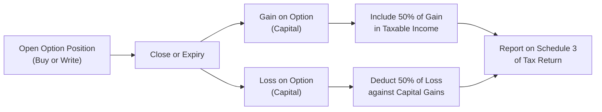

## 25.2 Federal Tax Consequences for Non-Professional Traders

Have you ever had that moment, you know, the one where you’re staring at your trading statement thinking, “Wow, that option trade really paid off—now what do I do with the taxes?” If so, you’re in the right place. In this section, we’ll examine the federal tax consequences of listed options trading for non-professional (or retail) traders in Canada. While that might sound like a snoozefest, it’s actually an essential topic if you ever hope to keep the proper share of your returns. Many folks assume that if they’re “casual traders,” they can easily handle these issues come tax time. But disclaimers notwithstanding, it’s a tad more complicated—especially once you consider capital gains treatment, Adjusted Cost Base (ACB) adjustments, superficial loss rules, and so on.

Before we get started, let’s make one thing clear: this content is purely educational. You should absolutely, 100%, consult with a qualified tax professional. Canadian tax law changes fairly often and is subject to new legislation, Canada Revenue Agency (CRA) guidelines, and case law, and we definitely don’t want you to rely solely on my personal tidbits of insight here.

That said, let’s jump into the essentials.

---

### The Nature of Listed Option Trading for Non-Professional Investors

When it comes to filing taxes on profits (and potential losses) from your options trades, one of the first big questions is determining the nature of your trading activity. Are you a day-trading machine who hunts intraday scalps in the options market? Or are you a long-term investor occasionally dabbling in options to enhance portfolio returns? The CRA typically looks at certain factors—like frequency of trades, holding periods, and your stated investment objectives—to figure out whether your gains or losses are on income account (fully taxable) or capital account (partially taxable).

Most so-called “non-professional” or “retail” investors are considered to be trading on “capital account.” In super plain English, this means that if your primary motive for holding listed options is capital appreciation (or hedging of existing stocks in your portfolio), then you’re likely dealing in capital property. Consequently, when these options generate gains, only half of the net gain is taxable. Likewise, if you experience a net loss, only half of that net loss is recognized and can offset your other capital gains.

If you were recognized as a professional trader in the eyes of the CRA or if your trading pattern is more akin to a security dealer, you might be taxed fully on your gains as business income. That’s a drastically different outcome, so be mindful of how your overall activities align with CRA’s guidelines.

---

### Capital Gains Treatment: The 50% Inclusion Rate

The bread-and-butter of capital tax rules in Canada is that only 50% of your net capital gains are subject to tax. This concept applies to listed options, so assume you’re in the group whose trading is indeed on capital account. Here’s a typical scenario: you buy a call option on a Canadian company’s stock at a $2 premium. Sometime later—maybe a few weeks—you close out your position by selling that same call for $3. Congrats, that’s $1 of profit per contract. Under capital gains treatment, only 50% of that $1 is added to your taxable income. The other 50% is effectively tax-free.

On the flip side, let’s say you ended up selling the option at $1 instead (for a loss). Then, you’d have a capital loss of $1 per contract, of which 50% is recognized as a net capital loss for the year. That 50% can offset other taxable capital gains. If you don’t have enough capital gains this year, you can carry the net capital loss back three years or forward indefinitely, subject to the CRA’s rules.

---

### Writing Covered Calls and Adjusted Cost Base (ACB) Adjustments

Let’s talk about covered calls—one of the most common option strategies for investors who already hold shares. In a covered call, you write (sell) an option on a stock you own. If the call is exercised by the buyer, you have to deliver your shares at the agreed strike price. The total proceeds from your stock sale may end up being impacted by the option premium you received.

• If the option expires worthless:  
  You generally get to keep the option premium as a capital gain in the year it expires.  
• If the option is bought back (i.e., you close the position by purchasing the call option you originally wrote):  
  Any net proceeds or net cost resulting from that buyback is recognized as a capital gain or loss in the year you transact.  
• If the option is exercised:  
  The premium you initially received typically reduces the ACB of the underlying shares you deliver. This effectively means you might face a slightly bigger capital gain on the sale of the shares, given that the ACB is lower.

Here’s an example. Suppose your stock’s original ACB is $50 per share. You write a covered call for $2 per share. If the call eventually gets exercised at $55, your net cost base for the shares is now $48 ($50 original minus $2 for the premium you collected). So your capital gain per share becomes $55 – $48 = $7, and 50% of that $7 is taxable. Of course, real life might be more complicated (commissions, partial fills, etc.), so be meticulous in tracking your numbers.

---

### Non-Deductible Expenses for Non-Professional Traders

One pitfall that catches many non-professional traders off guard is the limitation on what expenses they can deduct. If your trading constitutes capital property, your associated expenses must relate directly to the acquisition or disposition of that property. Generally, the main expense you can deduct is your transaction costs (like brokerage commissions). But you typically add commissions on purchases to the ACB of your position, and you subtract commissions from the proceeds of disposition. That’s it.

A non-professional trader may not deduct other business-like expenses (things such as a home office, data feeds, or subscription services) from capital gains if these do not relate specifically to the cost base or the proceeds. Mind you, if your trading were deemed a business, you might deduct these things. But that’s a different classification and has a whole other host of considerations (and possibly, you’d lose the capital gains tax advantage!). So if you suspect you’re crossing over into “trading as a business,” it’s time for another conversation with your tax pro.

---

### The Superficial Loss Rules

Canada’s superficial loss rules are intended to stop folks from artificially creating capital losses without really changing their positions. If you sell an option or the underlying shares at a loss, and then you or an “affiliated entity” (like your spouse, a corporation you control, or a trust) repurchases the same or identical property within 30 days before or after the sale, your entire loss might be denied (or at least deferred). The rules can be sneaky, and you should be aware of them when you do trades around year-end or when you’re strategically trying to capture losses.

The same principle extends to futures, shares, and other “identical properties.” So, for instance, if you sold a call option at a loss and quickly bought another call option having nearly the same terms (same underlying, strike, and expiration), you might inadvertently trigger the superficial loss. This could defer your capital loss until you ultimately dispose of the reacquired property.

It’s crucial to be mindful of this if, say, your call option isn’t working out, you close it—then a few days later, you realize, “Oh, I still like this strategy,” and you get right back in. That might lead to a scenario where your capital loss is disallowed for the time being. If you want the details, check out the relevant section in the Canadian Income Tax Act addressing superficial losses or read official guidance from the CRA T4037 “Capital Gains” publication.

---

### Keeping Detailed Records for Optimal Compliance

I’ll confess: I used to be that person rummaging through random receipts every April, trying to remember every single trade. Not the best approach. The CRA can demand detailed records at any time, especially if your return is selected for review or audit. The more thorough your trading logs are, the easier your life becomes. Some people keep spreadsheets that include:

• Date of the transaction  
• Type of option (call or put)  
• Strike price  
• Number of contracts  
• Premium received or paid  
• Brokerage commissions  
• Whether the option was exercised, expired, or bought back  
• Adjusted Cost Base of underlying shares (when applicable)

That might sound like a lot, but you’ll thank yourself (or your accountant will thank you) down the road. You can also check if your brokerage offers an export feature or monthly statement summary that breaks down your trades, but just confirm that it has all the info you need to comply with Canadian tax rules. Some broker statements are more thorough than others, especially if the broker is primarily geared toward U.S. clients or if it lumps all your trades together.

---

### Practical Example: Buying a Call for Capital Appreciation

Let’s walk through a simple scenario. Suppose you purchased a call option on a large Canadian bank (we’ll call it “Bank ABC”) at a premium of $3 per contract. The total cost was $3 × 100 shares = $300, plus a commission of $10. Then, let’s say six weeks later, you sold the call for $5 per contract, or $500 total, minus a $10 commission. Here’s a breakdown of how the capital gain is calculated:

• Total cost at entry = $300 (premium) + $10 (commission) = $310  
• Proceeds from sale = $500 (premium received) – $10 (commission) = $490  
• Net gain = $490 – $310 = $180  

Since it’s a capital gain for a non-professional investor, you only include 50% of $180 in your taxable income, so $90. That $90 gets added to your other taxable income in that year, and you pay tax at your marginal tax rate on that $90. This is obviously a simplified example, but hopefully it illustrates how to track the cost base and your proceeds from the disposition.

---

### When Things Get More Complex: A Flowchart

Below is a quick mermaid diagram that might help you visualize, in a super general way, the tax treatment steps for your option transaction outcomes if you’re a non-professional trader. Don’t forget that your own situation may vary.

This diagram is a broad overview. In real life, you’d consider ACB adjustments for underlying shares, superficial loss rules, and so forth. But conceptually, this is how it flows.

---

### Dealing with Expired or Bought-Back Options

Some new option traders get confused about how to handle positions that don’t lead to an exercise. If you purchased an option and it expires worthless, your cost (premium + commission) is your capital loss. If you wrote (or sold) an option and later bought it back for a higher price (realizing a net loss) or lower price (realizing a net gain), that difference is also recognized as a capital gain or loss.

For instance, you might write a put option for $1.50. Later, you buy it back for $0.50, netting $1 in profit per contract. That $1 is recognized as a capital gain; only half is taxable. If instead, you buy it back for $2.00, you have a $0.50 per-contract capital loss (again, half is recognized for tax purposes).

---

### Additional Resources and References

1. **CRA Guide T4037 “Capital Gains”**: This is the big one. It walks you through the CRA’s official stance on capital property, superficial losses, and how to correctly fill out Schedule 3 of your T1 tax return.  
2. **Canadian Income Tax Act**: The legislative blueprint for all the rules we’re discussing. Check sections pertaining to “capital gains,” especially section 38 (which sets out the 50% inclusion rate).  
3. **CIRO**: While not your direct tax resource, the Canadian Investment Regulatory Organization occasionally publishes notices clarifying position limits, margin, and (historically) references to how certain derivative strategies might be regulated. Visit https://www.ciro.ca for updates you might need to consider.  
4. **Legal Commentary**: National law firms like Borden Ladner Gervais (BLG) or Osler often publish free bulletins on their websites that delve deeper into superficial loss traps and other advanced scenarios.  
5. **CPA Canada**: Offers various courses on personal and small business taxes (https://www.cpacanada.ca/) and sometimes covers specialized topics like derivatives and capital lists. If you ever want to dive deeper, it’s worth a look.

---

### Best Practices

• **Keep personal logs of trades**. Relying only on your broker’s statements might miss certain details like average cost or breakdown of commissions.  
• **Review your T-slips**. If your broker issues T5008 or other forms, ensure you reconcile them with your own records, as T-slip data typically only captures gross proceeds, not necessarily the cost base.  
• **Watch out for superficial losses**. If you suspect your subsequent trade might be considered an “identical property,” wait out the 30-day period or adjust your strategy.  
• **When in doubt, consult a professional**. Especially if you scale up your trading activity, it might shift from capital to business income classification. You don’t want that to catch you by surprise after the fact.  
• **Stay updated**. Tax legislation changes all the time. Even if you read the entire Income Tax Act now, next year might bring brand-new rules or clarifications.

---

### Common Pitfalls and Challenges

- **Mixing up Income vs. Capital**: If your trades look more like an active business, the CRA may argue your gains are 100% taxable as business income.  
- **Not Adjusting ACB Correctly**: Especially with covered calls. It’s surprisingly easy to forget to deduct the premiums if the call is exercised, leading to an incorrect cost base.  
- **Ignoring Commissions**: Commissions should be factored into your capital gains or losses.  
- **Misapplication of Superficial Loss Rules**: It might be unintentional, but the CRA is well aware that many taxpayers inadvertently reacquire identical property inside that 30-day window.  
- **Sloppy Recordkeeping**: If you get audited, the CRA can recharacterize or do its own calculations, sometimes leading to less favorable results.

---

### A Personal Anecdote

Let me share a quick story: A few years back, I had a friend (let’s call him Dave) who wrote a bunch of covered calls on a tech stock he’d held for years. He collected juicy premiums each month. The calls never got exercised, and he happily pocketed the money. But come tax time, Dave’s statements showed dozens of trades with no mention of the “ACB adjustments,” because, well, none of those calls had been exercised. Dave initially panicked, thinking he had messed up. But after reading up on the rules, he realized that for expired options, the net premiums are simply capital gains in the current year, and none of them impacted the ACB of his shares. The confusion nearly made him file an incorrect tax return. Lesson learned: keep track, read, and confirm how each scenario plays out, because writing calls can have very different tax treatments depending on the final outcome of the contract.

---

### Conclusion

If you’re a non-professional, Canadian-based trader dabbling in listed options, the good news is that most of your option trades will likely be on capital account—meaning only 50% of your net gain is taxable. And if you suffer losses, 50% of those losses can help offset other capital gains. But be alert to superficial loss rules, ensure you handle ACB adjustments for covered calls properly, and maintain thorough records. It’s also worth emphasizing that while the fundamentals haven’t changed drastically over the years, the CRA’s administrative interpretations and new legislative updates can shift the details in subtle but important ways.

At the end of the day, you want to maximize your after-tax returns. To that end, a little bit of knowledge goes a long way—plus, you can always lean on official CRA publications, your accountant, or specialized courses offered by CPA Canada if you want to dive even deeper. Good luck, and remember that the best strategy is always one that takes a complete view of your financial picture, from trading goals to tax planning to risk management.  

---

## Sample Exam Questions: Federal Tax Consequences for Non-Professional Traders



### When is an option trade most likely considered on capital account for a non-professional trader?

- [x] When the investor’s primary motive for holding the option is capital appreciation.
- [ ] When the investor actively trades options daily for a living.
- [ ] When the investor sells options exclusively for their income stream.
- [ ] When the investor’s trades are classified as business income by the CRA.

> **Explanation:** Most casual or retail investors who buy and sell options for potential capital gains, rather than for a regular business-like income, are generally considered to hold these options on capital account.

### Which statement is generally true about the tax treatment of capital gains in Canada?

- [ ] All capital gains are fully taxable.
- [x] Only 50% of net capital gains is included in taxable income.
- [ ] There is no tax on capital gains at any time.
- [ ] Capital gains from options are exempt from taxes if the holding period is under six months.

> **Explanation:** Under Canada’s current tax rules, 50% of a capital gain is included in taxable income.

### How does covered call writing typically affect Adjusted Cost Base (ACB) if the call is exercised?

- [ ] It doesn't affect ACB at all.
- [ ] It increases the ACB of the underlying shares.
- [x] It reduces the ACB of the underlying shares by the option premium received.
- [ ] It immediately eliminates the ACB upon exercise.

> **Explanation:** If a covered call is exercised, the option premium received is deducted from the ACB of the underlying stock.  

### Which of the following expenses is generally deductible from capital gains for non-professional traders?

- [ ] Home office rent
- [ ] Subscription to advanced charting software
- [x] Brokerage commissions
- [ ] All of the above

> **Explanation:** For non-professional traders on capital account, only expenses directly related to acquiring or disposing of capital property—such as brokerage commissions—are generally allowed.

### What happens when you buy back an option that you originally wrote for a net profit?

- [x] You realize a capital gain, 50% of which is taxable.
- [ ] You always realize a fully taxable gain.
- [ ] You cannot realize a gain in this scenario.
- [ ] You must defer the gain until the end of the tax year.

> **Explanation:** If you buy back an option at a lower cost than you received when writing it, you have a capital gain for the difference, 50% of which is taxable.

### Under the superficial loss rules, if you sell an option at a loss and reacquire an identical option contract within 30 days:

- [x] Your capital loss may be denied or deferred until you dispose of the reacquired property.
- [ ] You can claim 100% of the loss immediately as a deduction.
- [ ] You can treat it as an ordinary expense.
- [ ] The CRA automatically treats it as a business loss.

> **Explanation:** The superficial loss rules disallow or defer a capital loss if an identical property is reacquired within 30 days before or after the sale date.

### Which of the following forms is most relevant for reporting capital gains and losses on a Canadian tax return?

- [x] Schedule 3 of the T1 return.
- [ ] T2059.
- [ ] Schedule 1 of the T2 return.
- [ ] T2200.

> **Explanation:** Capital gains and losses for individuals are normally reported on Schedule 3 of the T1 personal income tax return.

### A person who overtrades options daily and relies on them for a primary source of income might be classified by the CRA as:

- [ ] A non-professional trader on capital account.
- [x] Operating more like a business, with income account treatment.
- [ ] Ineligible to file taxes for these trades.
- [ ] Automatically exempt from capital gains taxation.

> **Explanation:** If the activity resembles a business (frequent trades, extensive knowledge, reliance on profits for living expenses), the CRA might reclassify the income as business income, which is fully taxable.

### If a written option expires worthless, how is the premium (minus costs) typically taxed for a non-professional trader?

- [x] As a capital gain in the year it expires.
- [ ] As a fully taxed employment income.
- [ ] It must be deferred until the underlying stock is sold.
- [ ] It is tax-exempt under CRA rules.

> **Explanation:** For casual investors on capital account, the premium from an expired written option is treated as a capital gain.

### A non-professional trader purchased a call option for $200 plus $10 commission and later sold it for $300 minus $10 commission. What is the net capital gain?

- [x] $80
- [ ] $100
- [ ] $200
- [ ] $300

> **Explanation:** The cost base is $210 ($200 premium + $10 commission). The proceeds are $290 ($300 premium – $10 commission). Net gain is $290 – $210 = $80, of which 50% ($40) is included in taxable income.


