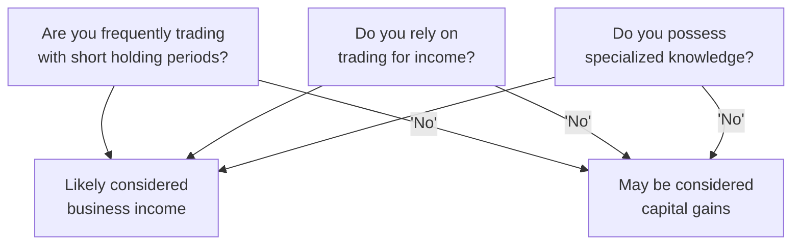

## 25.3 Federal Tax Consequences for Professional Traders

When you’re trading listed options in Canada, one of the trickiest parts has nothing to do with strike prices, margin calls, or volatility: it's how the Canada Revenue Agency (CRA) decides to tax your profits. In many cases, individuals who trade options are able to treat the proceeds as capital gains. But if you’re trading heavily and the CRA deems that your day-to-day transactions look more like a “business” activity, you might be in for a surprise. Under that business classification, 100% of your profits (not the 50% you see with capital gains) become taxable as business income. Yikes. Still, it’s not all doom and gloom: you can deduct a broader range of related costs and, under certain conditions, use your losses to offset various types of income. So let’s explore how this classification process works, what the CRA is looking for, how to maximize your deductions if you’re left holding that “business” label, and a bunch of other neat goodies.

This section is particularly relevant if you’re actively trading or you’re worried about blurring the lines between “investing” and “running a trading business.” While it’s important to be precise, remember this is not official tax or legal advice—so maybe don’t just read this, run off, and file a brand-new T2 corporate return. Always check with a qualified accountant or a tax lawyer if you aren’t sure about your personal situation. But in the meantime, let’s unpack the essential ideas.

### Business Income vs. Capital Gains: The Big Divide

Why does it matter if your options trading is viewed as a business or not? Well, the immediate answer is money. Specifically, how much you get to keep after paying taxes:

• Capital gains are normally taxed at 50% of your net gain. This means if you buy an option for CAD 1,000 and sell it later for CAD 3,000, your gain of CAD 2,000 is chopped in half for tax purposes. The “taxable gain” is CAD 1,000 in that scenario.  
• Business income, on the other hand, is fully taxable. If you have CAD 2,000 in net profits (revenues minus expenses) from your option trades, you’re taxed on the entire CAD 2,000.  

In general, being labeled a capital-gains investor is more beneficial: less tax on each profitable trade. However, once you start meeting certain business-like criteria—short holding periods, specialized knowledge, very high trade frequency, or dependence on those trading profits to pay everyday bills—the CRA might say, “Hold on, friend, that’s a business.” If that classification sticks, you must report your gains as business income.

#### A Personal Anecdote

Here’s a true story I heard from a friend (well, “a friend of a friend,” but still). He started diving into daily and even hourly trades on energy futures options. He was going crazy with it—like 20 trades a day—and, within a few months, it basically looked like his full-time job. For a while, he assumed all his gains were capital in nature, and he paid taxes accordingly (meaning he claimed the 50% capital gains inclusion). A year later, the CRA flags his file for review. After investigating, they said, “Nope, you’re basically a day-trading business.” So he owed back taxes and interest on the difference. Not fun. The point is, if your trading looks “business-like,” it’s worth clarifying your classification right away to avoid that dreaded letter from the CRA.

### Signs That You Might Be Running a Trading Business

The CRA uses several factors to determine if your options trading is a business. It’s not a black-and-white formula; it’s more of a “weight of evidence” approach. Here are the common considerations:

• Frequency of Trades: High volume, short holding periods, and constant turnover can look much more like a business than a long-term investment strategy.  
• Specialized Knowledge: If you’re a market professional, a derivatives whiz, or someone who obviously keeps up with advanced trading theories, you’re more likely to be labeled a business.  
• Intention to Make a Profit: Wait, doesn’t everyone intend to make a profit? Sure—but the difference is whether your trading is structured as an ongoing, profit-driven activity rather than a sporadic or hobby investment.  
• Reliance on Trading Income: If you pay your mortgage and your grocery bills with your trading profits, that’s a massive clue you might be carrying on a business.  
• Advertising or Promotion: Some folks register a brand name for their trading or publicly promote themselves as a trader-for-hire or consultant. That definitely edges you closer toward a business classification.  

Check out the CRA’s “Income Tax Folio S4-F16-C1, Carrying on Business in Canada” for a deeper look. It outlines the general criteria used to figure out if an activity is business-like. It’s a must-read for serious traders concerned about classification.

### The Tax Bite: Business Income Is Fully Taxable

If your activities are classified as business income instead of capital gains, 100% of your net profits get taxed at your marginal tax rate. Let’s say your net business income is CAD 50,000 in a given year, and you’re operating as a sole proprietor. That entire amount will appear on your personal tax return and be taxed at whatever marginal rate applies in your province or territory. This can be fairly steep if you’re in a higher bracket.

Here’s the flip side, though: you typically have more freedom to write off certain expenses as legitimate business deductions. And let’s face it, trading can be an expensive hobby anyway, so if you’re not in the capital gains zone, you might as well extract the maximum advantage.

### Common Deductions

For recognized trading businesses, you can potentially deduct a broad range of ordinary and necessary expenses, including:

• Home Office Costs: A portion of your rent or mortgage interest, utilities, home insurance, and property taxes if you meet the CRA’s home office criteria (like using a dedicated space for trading).  
• Research Tools and Subscriptions: Maybe you pay for advanced market data, specialized charting software, or streaming real-time quotes. As a business, these costs are usually deductible.  
• Professional Fees: This includes accounting fees, legal consultations, subscription to financial or legal journals, and possibly membership in professional bodies like CPA Canada or the CFA Institute if directly related to your trading.  
• Internet and Phone Bills: If these are integral to your business. Typically, you’d prorate a portion based on the percentage used for business versus personal.  
• Interest on Loans: If you borrowed money specifically to finance your trading positions, the interest could be deductible.  
• Vehicle Expenses: This can be trickier because you need to justify how your vehicle is used for the trading business (e.g., going to investor conferences).  

As always, “reasonable” is the key test: you can’t deduct that lavish trip to Maui if you spent 30 seconds checking the markets on your phone poolside.

### Loss Offsets: A Silver Lining

One perk of being labeled as a trading business is that your losses become business losses, which offers greater flexibility for offsetting other types of income. For instance:

• If you’re trading plus working a day job, you can apply those business losses from trading to reduce your employment income for tax purposes (again, subject to specific rules).  
• If you accumulate a net loss in one year, you can potentially carry that non-capital loss backward or forward (under the CRA’s guidelines) to offset your income in other years.  

This can be a saving grace if you suffer a big drawdown in your trading account, especially if your intention is to continue as a business and recover in future years.

### Considering GST/HST Obligations

Most financial services, including the actual buying and selling of financial instruments, are exempt from GST/HST in Canada. However, if you’re offering additional services—like you’re a trading coach, or you package your strategy into a subscription-based newsletter—these types of commercial activities might attract GST/HST if your annual revenue from those sales and services exceeds the registration threshold (commonly CAD 30,000 in taxable sales over four consecutive calendar quarters). If all you do is trade your own account, you usually don’t need to worry about charging GST/HST on your trades. But it becomes more complicated if your “trading business” has peripheral revenue sources, so keep that in mind.

### Common Pitfalls and CRA Audits

One of the biggest pitfalls is ignoring these criteria and treating everything as capital gains while your trading patterns scream “business.” If the CRA audits and deems that you owe back taxes, they’ll also tack on interest and possibly penalties. Plus, you can lose any advantage you might’ve had from offsetting expenses or leveraging business losses elsewhere. So let’s emphasize it again: if you’re unsure, speak to a professional accountant or tax adviser. The cost of a quick consultation might be way cheaper than the headache of a CRA reassessment.

### Visualizing the Classification Process

Below is a simple Mermaid.js flowchart that shows a conceptual path to deciding whether your trading might be considered business income or capital gains. The final say, of course, remains with the CRA, but this can give you an at-a-glance sense of the logic:

Note that the real process is more nuanced; any single factor doesn’t necessarily guarantee business classification, but multiple factors together increase the likelihood.

### Practical Example

Let’s test out a hypothetical. Suppose your name is Jenna, and you live in Toronto. During the year, you buy and sell Canadian equity options every day, usually holding positions for just a few hours. You’re skilled in technical analysis, you’ve read every last word of the advanced derivatives documentation from the Bourse de Montréal, and you basically treat trading like your 9-to-5 job. Over the course of the year, you generate a net profit of CAD 40,000—all from these short-term option trades.

If you try to classify these gains as capital, the CRA might disagree because your trading is frequent, you hold positions for extremely short periods, and you rely on the income for your monthly bills. The CRA would likely classify your activities as a business, and you’d face tax on the full CAD 40,000 as business income. Fortunately, you can then deduct:

• CAD 3,500 for data feed subscriptions.  
• CAD 2,000 for half your home office costs (assuming you only claim half, to reflect personal usage).  
• CAD 1,000 for your portion of internet and phone.  
• CAD 1,500 for legal and accounting fees.  

So your net income for tax might drop to CAD 32,000. Forecast your annual net tax liability based on that figure, and plan your quarterly installments accordingly, if required.

### The “Business-Like” Criteria

While we’ve discussed the broad strokes, the CRA—and tax courts, in some litigated cases—will look at detailed records to see if your strategy is more “investing” (i.e., expecting capital appreciation) or more “trading” (i.e., engaged in a commercial activity). These are some formal questions they might consider:

• What’s the duration of your option holds?  
• Do you actively track market movements all day and adjust positions frequently?  
• Do you have specialized knowledge, like advanced derivative modeling or algorithmic trading?  
• How do you fund your trades? Borrowed money?  
• Are you promoting services to others in exchange for compensation?  
• Are you official in any capacity, like registering a business name, generating invoices, or claiming to be a “professional trader” publicly?

Answer “yes” to enough of those, and you’re more likely a business for tax purposes.

### Potential Benefits of Professional Classification

It might feel like “professional trader” status is a negative, but there can be positives:

• You can deduct a more significant portion of expenses.  
• You can offset broader types of income with your trading losses.  
• You might have a simpler time justifying certain trading tools and education as direct business expenses.  

Of course, that 100% inclusion rate for your profits can sting, but effectively harnessing business deductions might reduce your overall taxable income if you keep meticulous records.

### Dealing with CRA Requests

Sometimes you might feel like your classification is borderline. Maybe you do trade somewhat actively, but you also hold some positions for months. In these grey areas, the CRA could request more info or question your reporting method. Be ready to provide:

• Trading logs showing buy and sell dates, holding periods, and the number of trades.  
• Bank and brokerage statements.  
• Evidence of how you learned these strategies (did you take specialized courses or read advanced texts?).  
• Proof of other income sources or reasons you’re not reliant on trading for your main living.  

It may sound daunting, but good recordkeeping is your best friend in these situations. A mismatch between your tax returns and your actual activity is a big red flag for audits.

### Glossary Recap

Business Income  
: Fully taxable income earned from an activity carried out for profit or intended to produce profit. For an active options trader, this means 100% of net gains is subject to income tax.  

Deductible Expenses  
: Costs deemed necessary for earning business income, like home office costs, data subscriptions, and relevant professional fees.  

GST/HST (Goods and Services Tax / Harmonized Sales Tax)  
: A value-added tax in Canada for most goods and services. Usually, the buying and selling of options is exempt, but other commercial activities (e.g., consulting fees) may require you to collect and remit GST/HST if you exceed the threshold.  

Short Holding Period  
: Positions that are opened and closed within a brief timeframe frequently indicate a profit-driven, business-like approach.  

Specialized Knowledge  
: Advanced trading or derivative expertise to systematically profit from the markets, which can tilt the classification toward business.  

Audit Risk  
: The likelihood of your tax return being examined for inaccuracies. If you misclassify your trading income, that risk goes up.  

Back Taxes  
: Taxes owed from a prior period once a reassessment shows you underreported or misapplied a tax rule.  

Interest and Penalties  
: Additional charges from the CRA on any late or insufficient payments, plus possible penalties for negligence or deliberate misreporting.

### Strategies to Remain Compliant

• Keep Good Records: Document your trades, track your holding periods, keep spreadsheets or specialized accounting software.  
• Consult Professionals: This can’t be stressed enough. Even the simplest option trades can have complicated tax consequences when done in large volume.  
• Stay Updated: CIRO (the Canadian Investment Regulatory Organization) is Canada’s new self-regulator overseeing investment dealers. Although CIRO itself doesn’t control how the CRA taxes you, staying on top of updated CIRO rules and bulletins can keep your overall compliance approach clean.  
• Don’t Skimp on Receipts: If you’re going to claim business-expense deductions, keep every relevant receipt or invoice. The CRA will want to see evidence if it asks why you’re claiming those professional fees or that portion of your utility bill.

### References and Further Exploration

• CRA “Income Tax Folio S4-F16-C1” – A crucial read on what defines carrying on a business in Canada.  
• CPA Canada – Offers guidance on best practices in bookkeeping and understanding the intricacies of business vs. investment.  
• Chartered Financial Analyst (CFA) Institute – For those looking to deepen their capital markets knowledge.  
• KPMG “Doing Business in Canada” Guides – Helpful resources for new businesses and how they can stay in compliance with local rules.  
• “Taxation of Business Organizations in Canada” by Robert Couzin – A more advanced text if you really want to dive deep into corporate structures, partnerships, and other forms of business.  

And remember: rules, thresholds, and interpretations can shift over time. Keeping an eye on official guidance is just as important as that watchlist for your next options position.

---

## Sample Exam Questions: Federal Tax Consequences for Professional Traders



### Which of the following factors often leads the CRA to classify option trading as a business rather than as capital gains?

- [ ] Holding options long-term for dividend capture  
- [x] Trading frequently with very short holding periods  
- [ ] Trading only through a Registered Retirement Savings Plan (RRSP)  
- [ ] Using a simple buy-and-hold strategy  

> **Explanation:** Frequent trades and short holding periods typically indicate a business-like approach, unlike buy-and-hold investing, which suggests capital gains treatment.

### If you’re classified as a professional trader with business income in Canada, what percentage of your net trading profit is taxable?

- [ ] 0%  
- [ ] 50%  
- [x] 100%  
- [ ] 75%  

> **Explanation:** Business income is fully taxable, meaning all your net profit is included in your taxable income, as opposed to only 50% for capital gains.

### What is one advantage of having your trading income classified as business income in Canada?

- [ ] You never have to pay any taxes  
- [ ] You can claim capital gains reserves  
- [x] You can potentially offset trading losses against other sources of income  
- [ ] You cannot deduct operating expenses  

> **Explanation:** If your trading income is classified as business income, you can deduct expenses and, more importantly, use any losses to offset other income sources.

### Which of the following best describes a “Short Holding Period”?

- [ ] Maintaining an option position for at least six months  
- [ ] Holding common shares for a full year  
- [x] Opening and closing a position within minutes, hours, or just a few days  
- [ ] Reinvesting quarterly dividends in the same stock  

> **Explanation:** Short holding periods reflect an active, frequent trading pattern. This typically signals a business activity from the CRA’s perspective.

### Which of the following would likely be exempt from GST/HST in a Canadian trading business scenario?

- [x] Buying and selling listed options on your own account  
- [ ] Offering paid webinars on options trading strategies  
- [x] Managing only personal, self-directed trades with no outside services offered  
- [ ] Collecting monthly fees from others to manage their trade signals  

> **Explanation:** Most financial instruments and services when trading for your own account are exempt from GST/HST. However, if you charge for consulting or educational services, GST/HST may apply if you cross the threshold.

### How might you benefit from being treated as a business if you incur a large trading loss?

- [ ] You can avoid reporting it on your tax return  
- [ ] You have to capitalize the loss over several years  
- [x] You could use the business loss to offset other types of income  
- [ ] You can reclassify it as a long-term capital loss  

> **Explanation:** Business losses can typically be applied against other forms of income, offering broader relief than a capital loss, which can only offset capital gains.

### Which of these expenses could be deductible when classified as a trading business?

- [x] Data subscription for real-time market feeds  
- [ ] Family vacation to a tropical resort  
- [x] Accounting fees for preparing business financial statements  
- [ ] That brand-new fishing boat, unless it’s clearly used for business marketing  

> **Explanation:** Reasonable, business-related expenses—like data feeds and accounting fees—can be deducted. Luxury expenses without a clear business purpose would not be deductible.

### What is the main purpose of keeping detailed trade logs and records if CRA questions your classification?

- [ ] To prove you never intended to make a profit  
- [ ] To show your personal net worth  
- [x] To provide evidence of your trading strategy and holding periods  
- [ ] To claim a home office expense automatically  

> **Explanation:** Detailed records help demonstrate the true nature of your activities (e.g., frequency, short holding periods) and make it clearer whether you’re running a business or investing casually.

### Which of the following scenarios is most likely to trigger an audit from the CRA?

- [ ] Occasional claim of minor capital gains  
- [ ] Holding positions for months and rarely trading  
- [x] Frequent short-term trades reported as capital gains year after year  
- [ ] Filing taxes on time with no discrepancies  

> **Explanation:** If your pattern of frequent short-term trades is consistently reported as capital gains despite indicators that you might be running a business, the CRA could investigate further.

### True or False: The CRA only looks at one single factor—your background knowledge—when assessing whether you’re a professional trader.

- [x] False  
- [ ] True  

> **Explanation:** The CRA uses multiple factors (holding period, frequency, reliance on income, etc.) to determine if someone is carrying on a business. Specialized knowledge is just one piece of the puzzle.


