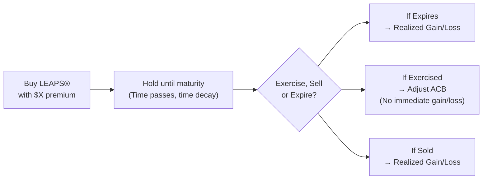

## 25.4 Tax Consequences for LEAPS® Investors

Long-Term Equity Anticipation Securities (LEAPS®) are a special category of options that can have maturities extending up to around three years. You might be thinking, “Well, so what’s the big deal?” Actually, the longer horizon introduces a few unique twists when it comes to tracking premiums, time value decay, and ultimately how to classify gains or losses for Canadian tax purposes. We’ll walk through these tax implications in more detail, and we’ll also toss in a few personal reflections—sometimes you don’t realize how important a meticulously kept trade confirmation can be until you’re hunting through your filing cabinet at 11:59 p.m. on April 30!

Before we jump in, let me just say: Although we’re going to talk about taxes, interpret the following as general information only. Canadian income tax law is wonderful (and complicated). Always consult a qualified tax professional or accountant for specific advice. With that out of the way, let’s see how LEAPS® fit into the bigger picture of listed options in Canada.

---

## LEAPS® at a Glance

A LEAPS® is basically a standard option contract, but with a longer expiration—often 12, 18, or sometimes up to 36 months out. Because it extends over a longer period, there’s more time for the underlying asset to move in your favor (or unfortunately against you). Many non-professional investors like to hold LEAPS® to position themselves for longer-term trends. It’s sort of like “buying time.” And when you do that, you’re dealing with more potential for capital appreciation—and, of course, additional layers of complexity come tax time.

### Capital vs. Business Income

The first big question: Are gains (or losses) from LEAPS® taxed as capital gains or as business income? Canadian law doesn’t automatically categorize all option activities as capital or all as business. Instead, it hinges on your personal circumstances—like your investment pattern, frequency of trading, and overall intention.

• If you’re a non-professional investor (maybe you have a day job unrelated to finance, and you pick up a few LEAPS® on the side to ride a nice bull or bear market thesis), you may argue that your intentions are for long-term investing. That typically points toward capital treatment.  
• If you’re an active trader or a financial professional, or if you’re writing (selling) many LEAPS® contracts as part of an ongoing, profit-driven (trading) enterprise, expect the Canada Revenue Agency (CRA) to argue business-income treatment.

Why does it matter? Because capital gains get only 50% of the profit taxed (the inclusion rate), while 100% of business income is taxable. For losses, capital losses can only be applied against capital gains. Meanwhile, business losses can reduce overall income. It’s sort of a double-edged sword, so it’s good to know which side you’re on.

By the way, I remember a friend who used LEAPS® to hedge the risk of a concentrated stock position from her employee stock options. She rarely traded, held for a year, and her accountant was fairly confident the CRA would view that as capital in nature. So it’s always helpful to keep a record of your rationale for each trade.

---

## When LEAPS® Are Exercised

Imagine you bought a LEAPS® call option on a Canadian mining company. You hold it for over a year, and eventually, you exercise it to acquire the underlying shares. Usually, from a tax perspective, the premium you paid for the LEAPS® gets added to your adjusted cost base (ACB) of those newly purchased shares. So your ACB isn’t just the strike price you paid at exercise—it’s the strike price plus the premium. That means you won’t realize an immediate gain or loss at exercise; it’s deferred until you finally sell the underlying shares later on.  

Here’s a quick example:

• You buy 1 LEAPS® call for $400 (the total premium) with a strike of $50.  
• A year and a half later, you exercise the LEAPS®. You pay the strike price: $5,000 for 100 shares.  
• Your adjusted cost base for the 100 shares now becomes $5,400 in total ($5,000 strike price + $400 premium).  

If you sell these shares a few months down the road at $70 per share, your proceeds on that sale would be $7,000 (100 × $70), and you’d have a capital gain of $1,600 ($7,000 – $5,400). Keep in mind that only 50% of that is taxable if it’s indeed treated as a capital gain. If it’s business income, that’s a different story—then 100% is taxable.

---

## When LEAPS® Are Written (Sold)

At first glance, writing a LEAPS® might look pretty lucrative, because you collect a higher premium than you would for a shorter-dated option—there’s more time value embedded in a LEAPS®. But you do need to consider how that premium is reported for tax. If the LEAPS® eventually expires worthless, the entire premium is usually recognized as a capital gain in the year it expires (assuming you’re not in the business of trading). If the LEAPS® is exercised, that premium you initially collected is folded into the proceeds (for a written call) or factored into the cost of shares you’re forced to buy (for a written put).  

For example:

• You write (sell) a LEAPS® call, collect a $550 premium, and deposit it in your account.  
• If that contract expires worthless in two years, you recognize a capital gain of $550 in that tax year (again, presuming capital treatment).  
• If the LEAPS® is exercised against you (the holder exercises their right), and you end up having to deliver shares at the strike price, that initial $550 premium reduces your net cost or effectively increases the proceeds on those shares.  

In other words, for a call writer, your actual proceeds of disposition become Strike Price × Number of Shares + Premium. Meanwhile, for a put writer, your cost base for shares you end up buying includes the premium you initially collected, netting off the final cost to you.

---

## Time Value Decay Over Long Periods

One interesting quirk of LEAPS® is the “Theta” effect—time value decay drawn out over months or years. If you close your LEAPS® position before maturity, the difference between your original premium and the price at which you buy or sell to close is realized as a gain or loss on the transaction date. Because LEAPS® can last a couple of years, you might see a significant shift in time value—even if the underlying share price is basically stuck in the same place.  

You won’t specifically itemize “time value decay” on your tax return. It’s just part of your overall gain or loss upon closing, or part of your final outcome at expiry or exercise. Still, tracking that value is helpful not only for your own strategy but also to verify your transaction details—and to confirm that the premium you’re reporting matches your broker confirmations. In my own experience, the devil truly is in the details.  

---

## Closing or Rolling LEAPS®

Rolling is basically closing out a near-term option and then simultaneously opening a new position, either at a different strike, or out in time, or both. In the LEAPS® world, you might decide to roll your contract if, say, you’ve gained some profit but still want longer exposure. Alternatively, you might want to roll if you’re down and anticipating a better entry point or a different strike.

Whenever you close a position—by buying back your short LEAPS®, or by selling your long LEAPS®—you realize a gain or loss for tax purposes then and there. Sure, you might open a brand-new LEAPS® contract in the same stock a millisecond later, but that’s a separate position from the CRA’s perspective. So always keep track of the cost or proceeds on the contract you’re closing. The date of the trade matters, because that’s the date you realize your gain or loss (not the settlement date).  

---

## Year-End Positioning and Recordkeeping

Because LEAPS® can span multiple tax years, it’s super important to keep year-end statements, trade tickets, and broker confirmations. When you do your taxes, you’ll need to figure out which positions remain open (still outstanding) versus which were closed during the year. The simplest approach is to keep a spreadsheet or some form of record that includes:

• The date you initiated the option trade (buy or write).  
• The premium received or paid.  
• The strike and expiration date.  
• The date and transaction details if you closed or rolled the position.  
• The exercise transaction details if it happened (including how that modifies the ACB of your underlying shares).  
• Confirmations from your broker (or electronic statements) to back up each relevant transaction.

I once found myself rummaging through digital statements from three different brokerage platforms, trying to piece together my open LEAPS® positions from the prior year. This was not a highlight of my life. Lesson learned: keep it organized daily or weekly when the trades happen—especially if you’re dealing with multiple accounts or multiple underlyings.  

---

## Regulatory Considerations and Useful Resources

As of 2025, the Canadian Investment Regulatory Organization (CIRO) oversees much of what used to be under IIROC and the MFDA. If you’re dealing in exchange-traded options, especially LEAPS®, you might want to check Bourse de Montréal’s listing of long-dated options contracts. The Bourse’s official website also posts relevant contract specifications and regulatory circulars. If you need clarity or want more examples of how margin might be applied, or how other traders operate with these instruments, that’s a good starting point.  

From a strict tax standpoint, you’ll want to look at the CRA’s “IT-479R: Transactions in Securities,” which helps define whether your overall activities are on capital account or business income account. Also, the CFA Institute’s research or CIRO bulletins often highlight best practices for documenting your systematic or occasional trades in LEAPS®.  

If you’re a “quant-minded” investor, or just curious, you could check out open-source Python libraries like QuantLib for scenario analysis, especially for time decay. Running a hypothetical scenario can help you see how rolling from one LEAPS® to another might change your overall profit or loss—and eventually your tax picture.  

---

## Practical Example: A Timeline of a LEAPS® Call

Sometimes it helps to see it laid out visually. Here’s a quick flowchart summarizing the key stages of buying (and potentially exercising) a LEAPS® call. We’ll note where a taxable event occurs.

• Stage A: You pay a premium (e.g., $X). No immediate gain or loss—just an outflow.  
• Stage B: Time passes. The option’s market price may fluctuate. No tax event yet.  
• Stage C: Decision point near expiration (or whenever you choose to close out).  

   - If the LEAPS® expires worthless, that’s a realized capital loss for the premium you originally paid.  
   - If you exercise the LEAPS® to buy shares at the strike price, that premium you paid becomes part of your ACB for those shares (so no immediate gain/loss recognized here).  
   - If you close or sell the LEAPS® prior to expiration, you recognize a gain or loss at that moment (the difference between what you paid and what you received for the option).  

---

## Hedging vs. Speculation

People use LEAPS® for various strategies—like a long-term bullish view on a stock or index, or a hedge against an existing stock holding. From a Canadian tax standpoint, the hedged or speculative notion can lead to interesting outcomes if the CRA decides that your LEAPS® is truly part of a hedge for a large share position you already own. In certain cases, a “superficial loss” or “tax straddle” concept might come into play, especially if you’re offsetting a big capital gain. That said, the general principle remains: if it’s a hedge that’s integral to your investment approach, the LEAPS® is often treated in the same manner as the underlying position. But you’d do well to get professional tax advice here, because these rules can get complicated in a hurry.

---

## Best Practices to Keep in Mind

1. Maintain Thorough Documentation: Keep broker trade confirmations (electronic or physical) and year-end statements. Note any relevant adjustments to your ACB if you wind up exercising.  
2. Track Rolling Strategies Carefully: Each time you close or roll a LEAPS® is a disposal event. Mark down your realized gain or loss.  
3. Distinguish Between Capital vs. Business Income: If you suspect the CRA might see you as a frequent trader or “trader in securities,” weigh the tax implications carefully.  
4. Review “IT-479R: Transactions in Securities”: This CRA interpretation bulletin helps you figure out where you stand.  
5. Check Bourse de Montréal Contract Specs: For clarity on which LEAPS® are offered, margining requirements, and official rules.  
6. Consult a Professional: Especially for positions crossing multiple tax years, or if you’re uncertain about how your trades might be classified.

---

## Additional Resources

• Bourse de Montréal’s Official Website:  
  → https://www.m-x.ca (Check “Products and Services” for long-dated options)

• CRA Interpretation Bulletin “IT-479R—Transactions in Securities”:  
  → https://www.canada.ca (Search “IT-479R” in the CRA website to see guidance)

• CIRO (Canadian Investment Regulatory Organization):  
  → https://www.ciro.ca (Any bulletins or notices related to derivatives markets, margin, and compliance)

• CFA Institute Publications on Derivatives (Research & Tools):  
  → https://www.cfainstitute.org

• QuantLib for Python:  
  → https://www.quantlib.org (Open-source library for pricing LEAPS® and modeling hypothetical scenarios)

---

## Conclusion

You might be surprised how easy it is to overlook the tax specifics of LEAPS®. I can’t count how many times folks have asked, “Is a LEAPS® any different from a short-term option, really?” The short answer is: from a structural standpoint, not so much—but the longer time horizon means your positions can span multiple tax years, and that can complicate recordkeeping. Also, the bigger premiums (whether you’re buying or writing) can lead to bigger recognized gains or losses, which means you definitely want to know how the CRA sees it.

If you keep your documents organized and know how your option activities fit into the capital vs. business income puzzle, you’ll be in decent shape by tax time. As usual, if you want a second opinion, it’s not a bad idea to ask a licensed accountant or tax specialist. With that, we wrap up this discussion on the “Tax Consequences for LEAPS® Investors.” May your leaps into the world of LEAPS® be profitable—and free of any frantic last-minute hunts for old brokerage statements!

---

## Sample Exam Questions: Tax Implications of LEAPS® Trading



### Which statement best describes how a LEAPS® call option premium is handled if it is exercised?
- [ ] It is recognized as a capital gain at the time of exercise.
- [ ] It is recognized as a capital loss at the time of exercise.
- [x] It becomes part of the adjusted cost base of the underlying shares.
- [ ] It is recognized immediately as business income.

> **Explanation:** When a LEAPS® call option is exercised, the premium is incorporated into the ACB of the underlying shares. No immediate gain or loss is realized at exercise under normal capital treatment.

---

### What is the primary reason that LEAPS® can complicate year-end tax reporting?
- [x] They can cross multiple tax years, requiring detailed tracking of open and closed positions.
- [ ] LEAPS® gains are always business income, which complicates the process.
- [ ] LEAPS® are taxed at 75% for capital gains, unlike standard options.
- [ ] LEAPS® are not considered derivatives in Canada.

> **Explanation:** Because LEAPS® often extend beyond one calendar year, investors must keep track of positions that might remain open for a long time, making recordkeeping more complex.

---

### If you write a LEAPS® put and it is exercised against you, how is the premium generally treated?
- [ ] Treated as an immediate capital gain upon exercise.
- [x] Treated as a reduction in the cost base of the shares you must purchase.
- [ ] Treated as business income and taxed at full rates.
- [ ] Treated as a complete offset to the strike price.

> **Explanation:** For a written put, the premium you receive is typically folded into your overall cost for the shares, effectively reducing the cost base.

---

### When factoring in the time value decay (Theta) in LEAPS®, which of the following is correct from a tax standpoint?
- [x] Time value decay is not separately reported; it is embedded in your eventual gain or loss.
- [ ] The CRA requires an annual statement on time value decay accruals.
- [ ] Time value decay leads to a fully taxable income event at year-end.
- [ ] Time value decay is reported as a business loss regardless of your trading activity level.

> **Explanation:** While Theta influences the option's price, it isn’t separately reported on Canadian tax returns. Gains or losses from time decay are just reflected in your ultimate profit or loss on the option.

---

### What happens if a LEAPS® you purchased expires worthless?
- [ ] You pay an additional penalty tax to the CRA.
- [ ] You recognize business income.
- [ ] No gain or loss is recognized.
- [x] You realize a capital loss equal to the premium paid (under capital treatment).

> **Explanation:** If a LEAPS® expires worthless, a capital loss normally arises (assuming you’re not classified as a trader in the business sense). The loss equals the premium you initially paid, plus any related transaction costs.

---

### If you close your LEAPS® position by selling the option before expiration, when is the tax event recognized?
- [x] On the date you dispose of the option.
- [ ] On the settlement date, which usually occurs a few days later.
- [ ] Only at year-end.
- [ ] An immediate partial recognition occurs annually.

> **Explanation:** In Canada, gains or losses on securities are realized on the trade date, not the settlement date. The closing transaction triggers the final tax event.

---

### Which CRA interpretation bulletin provides guidance on capital vs. business income for securities transactions, including options?
- [ ] IT-234R: Commodity Futures and Trading
- [ ] IT-567: Options and Warranties
- [x] IT-479R: Transactions in Securities
- [ ] IT-959R: Foreign Exchange Gains and Losses

> **Explanation:** IT-479R is the interpretation bulletin dealing with securities transactions, which can help investors determine if their trades should be treated on capital or business grounds.

---

### If you are considered a “trader in securities” by the CRA, how would long-term LEAPS® profits typically be taxed?
- [ ] As capital gains at the 50% inclusion rate.
- [x] As full business income, with 100% of gains taxable.
- [ ] As tax-free dividends.
- [ ] As trust income.

> **Explanation:** Traders in securities usually have their profits (including LEAPS®) taxed as business income, which does not benefit from the 50% capital gains inclusion rate.

---

### You write a LEAPS® call for $600 premium on stock XYZ. A year later, it expires worthless. Assuming capital treatment, what is the result?
- [ ] A realized capital loss of $600
- [x] A realized capital gain of $600
- [ ] A deferred gain until the shares are sold
- [ ] No tax recognition is required

> **Explanation:** If the call you wrote expires worthless, the premium you received is recognized as a capital gain in that tax year.

---

### True or False: When exercising a LEAPS® call, you incur an immediate capital gain equal to the difference between the strike price and the market value of the shares.
- [ ] True
- [x] False

> **Explanation:** Exercising a LEAPS® call does not immediately trigger a capital gain or loss. Instead, the premium is folded into your ACB for the shares. You only realize a gain or loss when you eventually sell those shares.


