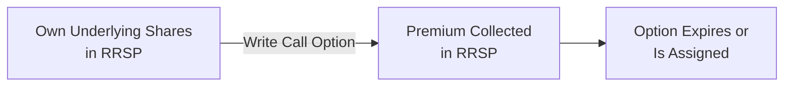
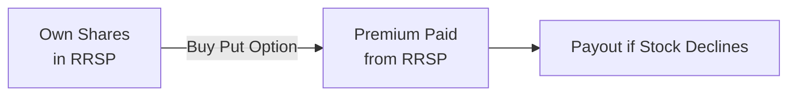

## 25.5 Allowable Use of Exchange-Traded Options in RRSPs, RRIFs, and RESPs

Picture this: You’re sitting at your kitchen table, scrolling through your investment account, and you notice that options strategies—like writing covered calls—might help you boost returns or reduce risk. But is it okay to do that inside a Registered Retirement Savings Plan (RRSP), a Registered Retirement Income Fund (RRIF), or even a Registered Education Savings Plan (RESP)? Let’s chat about it in plain language and see how these Canadian tax-advantaged accounts handle exchange-traded options, which strategies are typically permitted, and what practical considerations you should keep in mind.

Before diving into the nitty-gritty, it’s important to remember that while these accounts offer some incredible tax benefits (such as tax-deferral for RRSPs/RRIFs or tax-free growth inside an RESP), they also come with strict rules. You can’t just buy or sell any derivative you like. The Canada Revenue Agency (CRA) and your plan documents have lots to say about what is allowed or disallowed. Ready? Let’s go.

--------------------------------------------------------------------------------

### Why Registered Accounts Matter for Options

RRSPs, RRIFs, and RESPs are designed to encourage Canadians to save—whether for retirement or education. By allowing postponement (or partial exclusion) of taxes on investment income, these registered plans can really enhance long-term compounding. When you add exchange-traded options to the mix, you have the potential to:

• Generate additional income (e.g., from writing covered calls).  
• Hedge downside risk (e.g., by purchasing protective puts).  
• Express a particular market view with potentially less capital than owning the underlying asset outright.

However, we need to be mindful of the rules. If an option strategy is considered high risk or if it can create unlimited losses, it might not be permissible in a registered account.

--------------------------------------------------------------------------------

### Common Permissible Strategies

There is no universal rule that says “all options are allowed” or “all options are disallowed.” Instead, the CRA generally looks at the level of risk, the nature of the instrument, and how the plan beneficiary might have exposure to unlimited liability, which is a big no-no in these accounts. Generally:

• **Covered Calls**: Allowed.  
• **Protective Puts**: Often allowed, especially if you already own the underlying.  
• **Naked Options** (uncovered calls or puts without sufficient collateral): Typically disallowed.

Let’s explore covered calls in more detail, because they’re the classic example of a permissible strategy.

--------------------------------------------------------------------------------

### Covered Calls: The Staple Option Strategy for Registered Accounts

A “covered call” is when you own the underlying shares and then write (sell) a call option on those shares. Since you hold the underlying stock, your potential liability if the call is assigned is “covered.” This can generate extra income in the form of premiums.

Here’s a simple example. Let’s say you own 100 shares of a Canadian bank inside your RRSP. You believe the share price will remain relatively stable or grow slowly over the next few months. You write one call option contract (each contract typically covers 100 shares) at a certain strike price, collecting a premium in your RRSP. If the stock price stays below the strike, the option may expire worthless, and you keep the premium. If the stock price exceeds the strike, you could be assigned, meaning your shares are ‘called away,’ but your maximum loss is the shares themselves—something you already own. So the plan never gets into a scenario with unlimited downside.

Below is a simple diagram showing the payoff structure of a covered call inside an RRSP:

In this diagram, you start by having shares (A), write a call option, and receive a premium (B). Finally, you wait until the option expires or is assigned (C). Because you own the underlying asset, the upside is capped but the strategy is considered relatively low risk.

--------------------------------------------------------------------------------

### Protective Puts or Married Puts

A protective put is when you own shares of a company and buy a put option on the same shares to protect against downside risk. If the stock price falls, the put can offset some or all of the losses. This strategy is often permitted because it *reduces* risk, which is consistent with the safe, conservative approach for RRSPs, RRIFs, or RESPs. There is no scenario where the plan is exposed to unlimited risk. Instead, the plan is paying an option premium to mitigate potential losses in the underlying shares.

--------------------------------------------------------------------------------

### The No-Go: Naked Options

Now, imagine you sell a naked call on a stock you *don’t* own inside your RRSP. If that stock price skyrockets, you’re on the hook for unlimited potential losses. Because RRSPs, RRIFs, and RESPs are tax-advantaged vehicles meant for stable investment growth, CRA and plan trustees shy away from letting you place your entire account at potentially unlimited risk. You may also run afoul of the “no borrowing” principle; by effectively creating a short position, you are bringing in risk akin to margin or leveraging. This is almost always disallowed in these accounts.

Similarly, a naked put would be disallowed if it subjects the plan to obligations that exceed its cash balance. Some brokerages do offer cash-secured puts as an alternative strategy in RRSPs or RRIFs when you have sufficient cash. But you must confirm with your brokerage—and possibly your plan documentation—to ensure you’re not in violation of the trust agreement.

--------------------------------------------------------------------------------

### Tax Treatment Inside RRSPs and RRIFs

One of the beauties of an RRSP or a RRIF is tax deferral. Inside these accounts:

1. **No Immediate Taxes on Gains**: If you make a killing on a covered call strategy, you don’t pay tax right away. You only pay tax later, when you withdraw funds from the RRSP or RRIF.  
2. **Ordinary Income on Withdrawals**: Eventually, everything inside the RRSP/RRIF—whether it was interest, dividends, or capital gains—gets taxed as ordinary income upon withdrawal. This is a key difference from non-registered accounts, where gains might be taxed at more favorable capital gains rates.  
3. **No Annual Reporting of Gains/Losses**: You do not fill out a Schedule 3 or a capital gains and losses form for the trades inside these plans each year. The gain or loss is effectively “invisible” until you take money out of your plan.

If you convert your RRSP to a RRIF—usually no later than age 71—you can keep certain options strategies in the RRIF as well, though you must start taking minimum annual withdrawals, which become taxable income.

--------------------------------------------------------------------------------

### Tax Treatment Inside RESPs

An RESP is designed to help parents, grandparents, or other contributors save for a child’s education. Here’s a quick highlight:

• **Tax-Deferred Growth**: Investments can grow tax-free within the plan, and the child (beneficiary) usually pays tax on the growth or grants portion when withdrawn.  
• **Typically Lower Tax Rate**: If the beneficiary is a student with little or no income, the effective tax on the withdrawal might be minimal.  
• **Permitted Options**: Similar to an RRSP or RRIF, covered calls or protective puts *may* be allowed. Again, because an RESP is also a trust arrangement, you can’t typically engage in high-risk trades that might threaten the entire plan.  
• **Government Grants**: The Canada Education Savings Grant (CESG) and other provincial grants can significantly boost contributions. You definitely don’t want to risk losing these benefits by conducting disallowed trades that might disqualify your RESP from its registered status.

--------------------------------------------------------------------------------

### Checking Brokerage and Plan Trust Agreements

Different brokerages have different interpretations of the CRA’s rules. Some allow more flexibility if you demonstrate you have the capital or the underlying shares in the account. Others may be more restrictive. It’s best to talk to your brokerage or plan sponsor to see whether certain strategies pass muster. Always confirm before you attempt a trade. Mistakes can come with heavy consequences, including penalty taxes or the plan losing its registered status, which basically undoes all the tax benefits. You definitely don’t want that!

--------------------------------------------------------------------------------

### The Role of CIRO

As of 2023, the Canadian Investment Regulatory Organization (CIRO) is the single self-regulatory organization overseeing investment dealers and mutual fund dealers, replacing the former IIROC and MFDA. CIRO sets rules on margin, short selling, and derivatives usage, as well as the capital requirements for firms and registrants. For specific guidelines on how to handle options in registered accounts, your firm’s compliance department will coordinate with CIRO’s official bulletins, ensuring the rules are followed. Check out the official CIRO website at [https://www.ciro.ca](https://www.ciro.ca) for more information.

--------------------------------------------------------------------------------

### Practical Example

Let’s do a small real-life example. Suppose your RRSP has 500 shares of Company ABC, a Canadian blue-chip stock. You decide to write two covered calls—since each option contract typically covers 100 shares— to generate premium income. Your brokerage confirms that covered calls are allowed. You pick a strike price above the current market price to leave yourself some upside potential.

• **Premium Collected**: Let’s say you collect a total of CAD 200 for each call contract, for a total of CAD 400. This premium is deposited right into your RRSP, boosting your tax-deferred retirement savings.  
• **Outcome A**: The stock never crosses the strike price by expiration, and the calls expire worthless. You keep your 500 shares plus CAD 400 of premium.  
• **Outcome B**: The stock surges above the strike, and you’re assigned. You’re forced to sell 200 shares at the strike price, but you keep the premium. If your shares have gained in value up to the strike, that’s still a net positive for you. The only downside is you might have to part ways with 200 shares. But there’s no scenario where you face unlimited losses.

No matter which outcome happens, you don’t pay any tax this year on the option premiums or on the capital gains inside the RRSP. Tax only becomes relevant when you withdraw from the RRSP, at which point the proceeds are taxed as ordinary income at your marginal rate.

--------------------------------------------------------------------------------

### Potential Pitfalls

• **Believing All Options Strategies Are Allowed**: They aren’t. Be sure to read your plan documents or confirm with your brokerage first.  
• **Forgetting About Withdrawal Tax**: Even though you skip immediate taxes, eventually you pay tax on RRSP/RRIF withdrawals at your full marginal rate.  
• **Ignoring the RESP Time Horizon**: An RESP typically won’t stay open for decades after the beneficiary finishes school. If you’re nearing the end of the plan’s life, an overly complicated or risky options strategy might not align with your timeline.  
• **Misconception About Losses**: Losses inside an RRSP or RRIF aren’t tax-deductible to you personally. If you blow up your account with a defective options trade, you can’t claim a capital loss on your personal tax return. The loss simply reduces the plan value.

--------------------------------------------------------------------------------

### Glossary Recap

• **RRSP (Registered Retirement Savings Plan)**: A tax-deferred savings plan for individuals.  
• **RRIF (Registered Retirement Income Fund)**: An extension of the RRSP to provide income in retirement.  
• **RESP (Registered Education Savings Plan)**: An educational savings account benefiting from government grants and tax-deferred growth.  
• **Covered Call**: Writing a call option while holding the underlying shares.  
• **Protective Put**: Buying a put option to hedge downside risk on owned shares.  
• **Penalty Taxes**: Extra taxes that may apply if the plan engages in prohibited investments.  
• **Tax Deferral**: Growth in the plan isn’t taxed until withdrawal.

--------------------------------------------------------------------------------

### Doing Your Due Diligence

Anyone who’s considering an options strategy in a registered plan should make sure to:

1. **Verify Permissibility**: Speak with your brokerage or trustee to confirm the strategy meets the trust agreement and CRA guidelines.  
2. **Assess Your Risk Tolerance**: Even covered calls have risks. Make sure it suits your investment objectives and timeline.  
3. **Stay Informed**: CRA interpretations can evolve. Periodically check the CRA Registered Plans Directorate guidelines (and Section 204 of the Income Tax Act) to see if the rules have changed.  
4. **Consult Professionals**: For complicated concerns, ask a qualified tax advisor or financial planner, especially if you’re not sure how a particular strategy might impact your long-term goals.

--------------------------------------------------------------------------------

### Additional Resources

• **CRA Registered Plans Directorate**: Official source for permissible investments in RRSPs, RRIFs, and RESPs.  
• **Income Tax Act (Section 204)**: The legal framework for compliance on registered investments.  
• **CIRO**: [https://www.ciro.ca](https://www.ciro.ca) – Updated margin and derivatives guidance.  
• **“Tax Planning for You and Your Family” by KPMG**: Comprehensive annual tax guide.  
• **CSI (Canadian Securities Institute)**: Offers courses on taxation, derivatives, and financial planning that delve deeper into rules and strategies.  
• **Plan Trust Agreements**: Your plan’s official documents often clarify the scope of permissible trades.

--------------------------------------------------------------------------------

### Conclusion

In a nutshell, exchange-traded options *can* have a place in an RRSP, RRIF, or RESP—particularly if the strategy is seen as low-risk, like a covered call or a protective put. The big watchword here is caution: avoid strategies like naked options that introduce unlimited risk, because you can easily get into trouble with both your brokerage and the CRA. Keep your trades aligned with your retirement or educational savings goals, stay on top of the rules, and it can be a neat way to enhance returns or limit downside within your tax-sheltered accounts.

Remember: The overarching reason Canada offers these registered plans is to encourage responsible long-term saving and investing. Options might provide an interesting way to amplify or protect those savings—but only if they’re done with a solid understanding of the constraints and the trade-offs. Good luck, and make sure to do your homework or consult a professional if you’re unsure.

--------------------------------------------------------------------------------

## Sample Exam Questions: Canadian Registered Accounts & Options Strategies



### Which of the following statement(s) best describe why covered calls are generally allowed in RRSPs, RRIFs, or RESPs?

- [x] Covered calls are considered low-risk because the writer holds the underlying shares.
- [ ] Covered calls are always risk-free in any portfolio context.
- [ ] Covered calls are prohibited under CRA rules for all registered plans.
- [ ] Covered calls offer unlimited profit potential aligned with plan growth.

> **Explanation:** Covered calls are usually permitted because they are a low-risk strategy; the option is covered by shares already held, thus limiting potential downside. They aren’t risk-free, but they’re not prohibited by default in registered accounts.

### What is the tax treatment of capital gains realized inside an RRSP?

- [x] Gains are not taxed until funds are withdrawn, at which point they are taxed as ordinary income.
- [ ] Gains are taxed every year as capital gains at 50% inclusion rate.
- [ ] Gains are taxed only if the RRSP invests in foreign securities.
- [ ] Gains in an RRSP are tax-free forever.

> **Explanation:** Gains (interest, dividends, capital gains) inside an RRSP are tax-deferred. They only become taxable upon withdrawal, and they’re taxed as ordinary income regardless of their original nature.

### Which of the following is generally considered impermissible in an RRSP, RRIF, or RESP?

- [ ] Covered call writing where the stock is held in the plan.
- [ ] Purchasing a put option on a stock you own.
- [x] Writing a naked call option with unlimited liability.
- [ ] Buying a call option on securities you’d like to own later.

> **Explanation:** Most plan trustees and CRA guidelines prohibit high-risk strategies like writing naked calls because they expose the account to unlimited potential losses. Low-risk or hedged strategies are typically allowed.

### When might you pay taxes on gains from exchange-traded options held inside an RRSP?

- [ ] In the year the gains are realized.
- [ ] Only if you trade frequently.
- [ ] Never, they are completely tax-free.
- [x] When you withdraw the funds from the RRSP, generally taxed as ordinary income.

> **Explanation:** Gains in an RRSP are tax-deferred until withdrawn, at which point they are taxed as ordinary income according to your marginal tax rate.

### In which scenario could an RESP beneficiary pay minimal tax on withdrawal?

- [x] If they are a full-time student with little to no income, withdrawals may be taxed at a lower bracket.
- [ ] If they have maximum earned income during the school year.
- [ ] If they opt to withdraw before enrolling in any educational program.
- [ ] If they have no tuition receipts.

> **Explanation:** A beneficiary with little to no income is likely in a low tax bracket, so the educational assistance payment (which includes the investment growth portion) can be taxed at a lower rate.

### What is a potential risk of holding a concentrated position and writing covered calls within an RRSP?

- [x] If you are assigned, you may have to sell your underlying shares and lose out on further price appreciation.
- [ ] You never face any risk with covered calls.
- [ ] You pay an immediate capital gains tax upon assignment.
- [ ] Covered calls are always disallowed.

> **Explanation:** While covered calls can provide premium income, you might have to sell your underlying shares if you’re assigned. You don’t pay immediate capital gains tax inside the RRSP, but you could lose future stock upside.

### Which of the following documents offers official guidance on the investment options permissible within registered plans?

- [ ] Official CBOT (Chicago Board of Trade) bulletins.
- [ ] U.S. SEC guidelines.
- [x] The CRA’s Registered Plans Directorate guidelines.
- [ ] FINRA updates.

> **Explanation:** The CRA’s Registered Plans Directorate provides official guidance on permissible (and impermissible) investments within Canadian registered accounts. U.S. regulatory bodies have no jurisdiction over Canadian RRSPs, RRIFs, or RESPs.

### What role does CIRO play in the context of options trading in registered accounts?

- [x] CIRO sets and enforces rules on derivatives trading, margin, and overall compliance for investment dealers in Canada.
- [ ] CIRO is now defunct and replaced by IIROC and MFDA.
- [ ] CIRO only governs banking activities, not investments.
- [ ] CIRO is a private forum for advanced options traders.

> **Explanation:** CIRO is Canada’s self-regulatory organization overseeing investment dealers and mutual fund dealers, including rules for derivatives and margin trading in registered accounts.

### Which statement best describes the difference between RRIFs and RRSPs when using exchange-traded options?

- [ ] An RRSP and RRIF are identical; there’s no difference in regulations.
- [x] RRIFs require periodic withdrawals, so strategies must account for a mandatory drawdown schedule.
- [ ] RRIF holdings are taxed annually when options expire.
- [ ] RRIFs permit naked calls while RRSPs do not.

> **Explanation:** RRIFs require minimum annual withdrawals after a certain age, which influences the time horizon and liquidity needs for strategies, even though both RRSP and RRIF accounts follow similar tax deferral rules.

### True or False: Losses in a registered account can be used to offset capital gains outside the account.

- [x] False
- [ ] True

> **Explanation:** Any losses inside a registered account (RRSP, RRIF, RESP) are contained within the plan and cannot be used as a capital loss to offset gains or reduce taxable income outside the plan.


