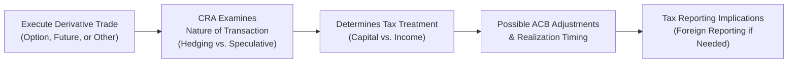
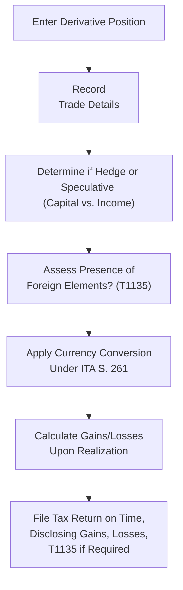

## 25.6 Recent CRA Interpretations on Derivatives

There’s no denying it: taxes can get complicated—especially when we start talking about derivative products like options, swaps, or forward agreements. And you know what’s interesting? The Canada Revenue Agency (CRA) loves to keep everyone on their toes by issuing new clarifications or “technical interpretations” for our increasingly innovative financial products. In this section, we’ll zero in on how the CRA has been updating its guidance on derivatives, especially as new structures and underlying interests pop up.

Many folks approach me and say, “So, are my derivative gains capital or income, and when do I have to report them?” The short answer: it depends on the CRA’s interpretation—plus a whole bunch of factors like your intent, your trading pattern, the nature of the product, and even whether the underlying is foreign. That’s exactly what we’ll talk about here. Along the way, I’ll slip in a personal anecdote or two and highlight best practices to help you steer clear of unplanned tax pitfalls.

---

### Why the CRA’s Interpretations Matter

Imagine you’ve purchased an option on a new cryptocurrency-linked ETF. You hold it for a few weeks, and it expires worthless. Are you able to claim a capital loss or is it considered ordinary income because you’re in the “business” of trading? The difference is huge for your final tax liability. The CRA regularly issues interpretation bulletins and technical interpretations that define (and occasionally redefine) when a derivative transaction counts as a hedge, how to calculate adjusted cost base (ACB), or whether something is realized income.

Over the years, the CRA’s line of sight has expanded to include mini-options (with a smaller share multiplier), short-term weekly options, and options on exotic assets (like crypto or foreign indices). Keeping up with all these details can be headache-inducing, but it’s crucial—especially if you’re trading at volume or dealing in specialized products.

---

### Growing Range of Derivative Products and Tax Considerations

New derivative products seem to pop up every time we blink—weekly equity options, mini-options for more cost-effective hedging or speculation, and even cryptocurrency-linked ETFs that issue options. This expanding menu has spurred fresh CRA guidance on:

• How to determine when a gain or loss is “realized.”  
• Whether the derivative is considered Canadian property or foreign property (potential T1135 implications).  
• How foreign currency translation requirements apply under section 261 of the Income Tax Act.  
• The difference between a “hedge” transaction (tied to a capital asset) and a transaction that might be purely speculative.  

From personal experience, I recall purchasing a few mini-options early on, thinking they were just like normal options, only smaller. Then, a friend mentioned, “Hey, you might want to check if the CRA sees these differently.” It turns out the underlying mechanics are similar, but you definitely want to be mindful of any updated bulletins clarifying how to treat partial-lot exposure. When in doubt, check official CRA resources—or consult a tax pro.

---

### Navigating the Hedge vs. Speculation Conundrum

One of the trickiest areas in derivative taxation is whether a transaction qualifies as a hedge or as speculative. If it’s a hedge, any resulting gain or loss might be considered a capital gain or loss (assuming the asset you’re hedging is on capital account). But if the trade is speculative or part of an active trading strategy, the gain or loss might be treated as business income (or business loss).

The CRA is constantly clarifying these boundaries. For instance, if you hold a portfolio of Canadian energy stocks as a long-term investment and then buy put options to protect against downside risk, that’s arguably a classic hedge. The CRA typically looks at your intention, the relationship between the derivative and the underlying, and the degree of consistency in your approach. So if you’re flipping in and out of that put every week, they might start to wonder if your real motive is short-term speculation.

---

### Realization Events and Tax Timing

Another big question is: “When do I realize a gain or loss?” Typically, for standard listed options, the realization event happens when you close out your option position—by selling, exercising, or letting it expire. However, the CRA sometimes refines how it treats partial closeouts, spreads, or rolling transactions.

• **Exercise of Options**: If the option is exercised, the cost of the underlying security is adjusted.  
• **Expiration of Options**: If the option expires worthless, you realize the entire gain or loss immediately at that point.  
• **Overlapping Contracts**: Rolling from one expiring contract to a new one might create nuance in how your ACB is calculated, especially if the underlying interest remains the same but the contract maturity changes.  

The CRA’s technical interpretations can shift the point in time when you need to crystallize your gain or loss. That timing can affect not only your tax liability for a given year but also your ability to apply losses against other gains.  

---

### Emerging Products: Short-Term Weekly Options, Mini-Options, and Crypto-Linked ETFs

Innovations like short-term weekly options, mini-options, and crypto-linked ETF options have been prompting new clarifications from the CRA. Let’s look at a few highlights:

**Short-Term Weekly Options**:  
• Pros: Tighter time frames may allow more frequent trading opportunities and targeted hedges around specific events (like earnings announcements).  
• Tax Implication: Because trades happen quickly, the frequency might lead the CRA to classify repeated short-term trades as business income rather than capital gains.  

**Mini-Options**:  
• Pros: Let’s say you don’t have 100 shares to cover a call or put. Mini-options might instead cover only 10 shares, giving more flexibility to smaller traders.  
• Tax Implication: Generally not treated any differently from standard options. But the CRA has been asked to clarify if partial-lot coverage triggers any unique adjustments to ACB. As of the latest publicly available bulletins, they apply the same general approach—but always watch for updates.  

**Options on Cryptocurrency-Linked ETFs**:  
• Pros: Access to crypto indirectly via ETFs, with the added convenience of an exchange-traded option.  
• Tax Implication: Because the crypto under-the-hood can be volatile, the CRA looks carefully at how these gains or losses are reported. There can be foreign currency elements, plus the possibility that some of these ETFs themselves hold futures on offshore exchanges. If the crypto ETF is structured as a Canadian trust, you might still face unusual T1135 or cross-border reporting obligations if the underlying itself is foreign property.  

---

### At a Glance: CRA Monitoring & Interpretations

Below is a simple flowchart that illustrates how a typical derivative transaction might intersect with CRA scrutiny.

• **Step A**: You enter the derivative trade.  
• **Step B**: The CRA (or your accountant, on behalf of the CRA’s guidelines) reviews your transaction’s purpose.  
• **Step C**: Based on the purpose, the outcome might be capital gain/loss or business income/loss.  
• **Step D**: Realization event and ACB adjustments are applied at the time of closing, expiry, or exercise.  
• **Step E**: You finalize your T1 (if you’re an individual) or T2 (if you’re a corporation), factoring in any foreign reporting obligations.  

---

### Foreign Reporting Obligations: T1135 and Section 261

Speaking of foreign obligations, let me share a short anecdote. A colleague once forgot they had a U.S.-listed option that soared in value. When tax season rolled around, they neglected to convert the proceeds properly and didn’t file a T1135, thinking “Hey, it’s just an option.” Well, guess what: the CRA can issue penalties for failing to file the T1135 if your total foreign holdings exceed $100,000 in cost base. Even if the position is closed during the year, you may still have to disclose it. So, it’s good practice to track the cost base in Canadian dollars right from the start of the trade.  

**Section 261** of the Income Tax Act requires that all amounts be computed in Canadian dollars for tax purposes, whether your gains or losses are realized in USD, EUR, or any other currency. If your underlying is a U.S. stock, or your option is listed on the Chicago Board Options Exchange (CBOE), you’ll have to keep an eye on the exchange rate for the day of purchase and the day of sale (or expiry).  

---

### Cross-Border Considerations

Let’s say you’re Canadian, trading options on U.S.-listed underlying. In addition to T1135, you may also have cross-border withholding taxes on dividends if you’re assigned or if you hold an underlying share. If you’re actively writing calls or puts on a U.S. stock, be mindful of:

• **Treaty Benefits**: The Canada-U.S. Tax Treaty outlines certain relief from double taxation.  
• **IRS Impact**: If you’re physically located in Canada and you’re a Canadian resident, typically you report to the CRA. But the IRS may still require certain forms if you have a U.S. brokerage.  
• **Currency Conversion**: Gains or losses must be calculated in Canadian dollars, which can create additional complexities if the CAD/USD exchange rate fluctuates significantly.  

Foreign-based derivatives can lead to complicated layering. The CRA might provide fresh guidance if new structures, like options on foreign indexes but settled in Canadian dollars, become more prevalent.

---

### Technical Interpretations and Interpretations Bulletins

The CRA issues **Interpretation Bulletins** to clarify general rules and **Technical Interpretations** to respond to specific taxpayer inquiries. Both can significantly influence your tax reporting:

1. **Interpretation Bulletins**: Public documents that explain how the CRA interprets specific provisions of the Income Tax Act. They’re typically broad in scope.  
2. **Technical Interpretations**: Tailored guidance (available through CRA releases) detailing the CRA’s stance on specific, and often novel, fact patterns.  

If you’re a more advanced trader, or if you manage a fund that invests heavily in derivatives, you’ll want to follow these bulletins closely. Subscribing to the CRA’s “What’s New” section or stakeholder newsletters is a great strategy. Also, the **Canadian Tax Foundation** publishes materials where tax practitioners dissect new CRA statements in plain language.

---

### Adjusted Cost Base (ACB) Challenges

Let’s say you’re actively rolling your option positions. For instance, you sell a covered call on RBC stock with an expiry in October, then a week before expiry you buy that call back and sell another covered call with a November expiry. Do you simply carry over the ACB from one position to the next? Possibly so—but in some cases, you may need to carefully recalculate your ACB based on the net proceeds from each trade. The CRA wants to ensure you don’t double count or inadvertently claim a superficial loss if the position is repurchased within a superficial loss window (30 days before or after selling at a loss, while reacquiring “the same or identical property”).

Also, keep in mind that the cost base of the underlying might be impacted if the option is exercised. A short call that’s exercised means you sell your underlying shares. That’s a separate transaction with your own cost base, so yes, it can get a bit labyrinthine. 

---

### Hedging with Options on Corporate Investments

If you run a business and hold certain positions as part of your corporate treasury strategy, the CRA might interpret your derivatives differently. A hedge on an underlying business asset could be seen as capital in nature, but repeated short-term derivatives dealing in a corporate account might push the boundary into business income territory. For example, if your corporation invests in short-term weekly oil options for speculation and does so systematically, the CRA could treat those gains (or losses) as business income.  

---

### Practical Example

It can be helpful to illustrate with a hypothetical scenario:

1. **Underlying Position**: 500 shares of a Canadian bank stock (acquired for $60/share).  
2. **Strategy**: You write covered calls every four weeks (short-term, near-the-money) to generate premium income. Over a six-month period, you enter and exit nearly 10 such trades.  
3. **Result**: The calls expire worthless half the time, so you collect that premium. The other half, you buy them back or they’re exercised. Over six months, the underlying is never sold, but you realize net gains from the option premiums.  

**Key Tax Considerations**:  
• Is the covered call truly a hedge (capital) or a frequent stream of business income?  
• Each premium you receive is offset when you buy back an option, so you need to track your net gain/loss.  
• If the call is exercised, you sell part (or all) of your shares at the strike price, potentially creating a capital gain or loss on the shares themselves.  

The CRA might examine the scale and frequency of your activity and look at your overall usage of derivatives to see if you’re “in the business” of trading. If so, guess what? Your net gains might be categorized as business income rather than capital.  

---

### Cryptocurrency-Linked Options: A Closer Look

Cryptocurrency is hot, but also subject to extra tax scrutiny. If you’re trading options on a Canadian-listed ETF that holds Bitcoin futures, you might wonder, “Aren’t these just standard exchange-traded options?” Often, yes—but the CRA could look at:

• **Nature of the underlying**: Crypto is intangible and highly speculative.  
• **Use of foreign futures**: Some crypto ETFs gain exposure via futures on the Chicago Mercantile Exchange (CME). Even though you’re dealing with a Canadian ETF, part of the structure might involve foreign derivatives.  
• **Currency fluctuations**: Gains or losses might be heavily influenced by movements in USD Bitcoin futures prices.  

In short, the CRA’s stance is typically that standard derivative rules apply, but they remain open to issuing new interpretations if, say, a product includes a unique redemption feature or invests through a foreign subsidiary. This can impact your recognized gains or the categorization of capital vs. income.

---

### Common Pitfalls and Best Practices

• **Pitfall #1**: Failing to realize that frequent short-term options trading can be deemed a business rather than a capital activity.  
• **Pitfall #2**: Ignoring T1135 foreign reporting obligations for U.S.-listed options or foreign underlying assets, especially if the total cost base surpasses $100,000.  
• **Pitfall #3**: Not converting the proceeds of foreign trades to Canadian dollars correctly under section 261.  
• **Pitfall #4**: Overlooking the timing of your realization event. Rolling an option early might crystallize a gain or loss earlier than anticipated.  

**Best Practices**:  
1. **Maintain Detailed Records**: Keep track of every option purchase or sale date, the strike, the premium, the exchange rate, and any subsequent buy-to-close or exercise transaction.  
2. **Subscribe to CRA “What’s New”**: Stay on top of new bulletins or interpretations, especially regarding new derivative products.  
3. **Use Specialized Tax Software**: Many open-source and commercial programs allow you to track foreign exchange translations automatically.  
4. **Consult a Tax Professional**: If you find yourself in gray-area territory, get a ruling or at least a professional opinion based on the CRA’s latest guidance.  
5. **Monitor Department of Finance**: Keep an eye on draft legislation that might significantly alter derivative taxation.  

---

### Staying Compliant: A Mermaid Diagram

Let’s visualize a compliance workflow using a second diagram to underscore essential steps for derivative traders:

Following a clear process reduces the risk of an “oops” moment in tax season.  

---

### Monitoring Ongoing CRA Updates

The CRA isn’t shy about issuing new compliance updates or clarifications. For instance, they might release a new interpretation to address:

• The treatment of new “exotic” derivative features (like barrier options or binary options).  
• Additional guidance for ESG (Environmental, Social, and Governance) derivatives.  
• Evolving forms of cryptocurrency or digital asset exposures.  

Keeping tabs on these ensures you’re aware of the rules before you file taxes. Also, watch for changes to risk disclosure and margin expansions from the Canadian Investment Regulatory Organization (CIRO) if you’re trading through a CIRO member firm. Although such regulatory changes don’t directly alter the Income Tax Act, they’re often accompanied by interpretive updates that can indirectly affect your tax situation.

---

### Additional Resources

1. **CRA Website (What’s New)**:  
   • https://www.canada.ca/en/revenue-agency.html  
   • Updated listings of bulletins and interpretation releases.

2. **Department of Finance Canada**:  
   • https://www.canada.ca/en/department-finance.html  
   • Draft legislation, news releases, potential changes in derivative taxation.

3. **Canadian Investor Protection Fund (CIPF)**:  
   • https://www.cipf.ca  
   • Although focused on insolvency protection, occasionally addresses regulatory changes relevant to derivatives.

4. **CIRO**:  
   • https://www.ciro.ca  
   • National self-regulatory organization that can issue best practices for derivatives trading at CIRO dealer firms.

5. **Canadian Tax Foundation**:  
   • https://www.ctf.ca  
   • In-depth articles and analyses on derivative taxation and new CRA interpretations.

6. **IRS (for Cross-Border and U.S. Underlyings)**:  
   • https://www.irs.gov  
   • Parallel guidance on how the U.S. might treat derivative transactions if you have cross-border exposure.

7. **Journals and Blogs**:  
   • Many accounting and tax law firms offer detailed blogs summarizing new CRA announcements.

---

### Concluding Thoughts

Maybe it’s just me, but there’s something oddly fascinating about how a small nuance in a CRA bulletin can change your entire approach to trading. If you’re serious about derivatives, you need to be equally serious about staying on top of the CRA’s dynamic positions on what’s capital vs. income, how foreign totalling is done, and when you trigger a realization event. Take it from someone who’s had to backtrack more than once to straighten out messy trades: this stuff is not to be taken lightly.

In a nutshell, the CRA’s latest interpretations on derivatives reflect how quickly this space evolves—new underlying assets, new contract sizes, new settlement features. The best advice? Keep thorough records, ask questions, and follow official updates. Many a portfolio has been tripped up by a simple oversight in the tax realm, so if you don’t want the tax man knocking, do your homework. That way, you can focus on what you love—trading—without the nuisance of unanticipated tax surprises.

---

## Sample Exam Questions: Recent CRA Interpretations on Derivatives



### Which statement best explains why the CRA frequently issues new interpretation bulletins on derivatives?

- [ ] Because the CRA wants to discourage retail investors from trading options.
- [ ] Because the CRA aims to standardize derivative settlement cycles.
- [ ] Because the federal government is required to release new bulletins every month.
- [x] Because derivative products and structures rapidly evolve, requiring updated guidance.

> **Explanation:** The CRA continually releases updated guidance (interpretation bulletins) to address new developments in derivative products, from weekly options to crypto-linked ETFs, ensuring taxes are applied correctly.

### A Canadian crypto-linked ETF uses futures on a U.S. exchange as its underlying. Which step does the CRA require?

- [ ] Report the entire transaction as exempt from tax.
- [x] Convert all figures from USD to CAD under ITA section 261.
- [ ] File no foreign reporting, since an ETF is a Canadian product.
- [ ] Treat all gains only as capital gains without further documentation.

> **Explanation:** Under section 261 of the Income Tax Act, amounts must be calculated in Canadian dollars. If the underlying trades in USD, the CRA requires currency conversion for both cost base and proceeds.

### What aspect may trigger T1135 foreign reporting obligations for Canadian taxpayers trading derivatives?

- [ ] Merely opening a margin account at a Canadian brokerage.
- [ ] Holding a single share of a Canadian blue-chip company.
- [x] Exceeding $100,000 in total cost base for foreign property at any point in the year.
- [ ] Reporting a net capital gain of $100,000 on Canadian derivatives.

> **Explanation:** The T1135 form must be filed if the total cost of foreign property exceeds $100,000 CAD at any time during the year. This can include foreign-listed options if the cost base alone or combined with other foreign property hits the threshold.

### A short-term weekly option is most likely to be considered business income if:

- [x] The taxpayer frequently trades these options, reflecting a speculative pattern.
- [ ] It is written on a Canadian-listed stock.
- [ ] It expires worthless, and the underlying is never held.
- [ ] The option premium is small.

> **Explanation:** Frequent, short-term option transactions are often viewed by the CRA as business income rather than capital gains, reflecting a speculative or “day-trading” approach.

### When an option expires worthless, this triggers:

- [x] A realization event under Canadian tax rules.
- [ ] No gain or loss and no need to report anything.
- [ ] A reading out of all open positions for ACB adjustments.
- [ ] A requirement to send a letter to the CRA explaining the transaction.

> **Explanation:** If your option expires worthless, that moment is considered a realization event—the entire loss (or gain) is recognized.

### How does the CRA typically distinguish between a hedge transaction and speculation?

- [ ] By the name of the broker used for the trade.
- [x] By analyzing the relationship to an underlying asset and the taxpayer’s intent.
- [ ] By whether or not the trade is profitable.
- [ ] By requiring special documentation each time.

> **Explanation:** The CRA looks at the link between the derivative and the underlying capital asset. If it’s genuinely used to offset risk on a capital asset, it can be considered a hedge, potentially resulting in capital gains or losses.

### In a covered call scenario, which event may lead to a capital gain on the underlying?

- [ ] Selling the call option out-of-the-money.
- [x] Having the option exercised, forcing the sale of the underlying shares.
- [ ] Rolling over the call to a longer expiry.
- [ ] Letting the call expire worthless.

> **Explanation:** If a covered call is exercised, the shares are effectively sold at the strike price, creating a capital gain or loss on the underlying shares.

### Why has the CRA shown particular interest in cryptocurrency-linked ETF options?

- [ ] Because these products are illegal under Canadian law.
- [ ] Because they are always exempt from tax.
- [x] Because they often involve foreign futures and volatile underlying assets, raising nuances in tax treatment.
- [ ] Because they never expire.

> **Explanation:** Cryptocurrency-linked ETF options can involve offshore futures and large price swings. This can complicate how gains, losses, or currency conversions are reported.

### Which is a best practice for Canadian taxpayers trading options with underlying U.S. stocks?

- [ ] Skip recordkeeping during the year and rely on memory when filing.
- [x] Track every transaction in Canadian dollars and stay alert to T1135 requirements.
- [ ] Only record transactions if a net loss occurs.
- [ ] Rely solely on the broker’s monthly statement for currency conversions.

> **Explanation:** It’s essential to convert all trades to CAD under ITA section 261 and to watch for T1135 thresholds. Relying solely on month-end statements without proper conversion can lead to inaccuracies.

### True or False: Rolling an option position to a new expiry can create a separate realization event for tax purposes.

- [x] True
- [ ] False

> **Explanation:** Closing out one option and opening another (rolling) typically crystallizes any gain or loss on the first position, becoming a realization event from a tax standpoint.


