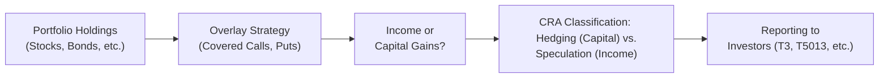

## 25.7 Tax Implications of Derivative Overlays in Balanced/Equity Portfolios

Derivative overlays can feel a bit like a secret sauce sprinkled on top of a traditional portfolio to modify its flavor—i.e., its risk-return profile—without changing the underlying long-term positions. Instead of directly selling a position (which might generate realized capital gains or losses), a portfolio manager might overlay a call-writing strategy or put hedges to shape the portfolio outcome. Now, you might be thinking: “Um, is that complicated for taxes?” Well, yeah, it often is, especially here in Canada where the Canada Revenue Agency (CRA) looks at the character of gains and losses in a pretty nuanced way. So let’s look at how derivative overlays can affect the timing of gains, the classification between capital and income, and how all that plays out in a balanced or equity-heavy investment portfolio.

### Why Derivative Overlays Matter for Taxes
Imagine you’ve got a balanced portfolio—some stocks, some bonds, maybe a bit of cash—for a total long-term strategy. You’ve been happily collecting dividends and interest and occasionally rebalancing. But then you decide to add an overlay of covered calls to generate income from your equity positions. Whether the CRA will treat this added income as capital gains (more favorable rate) or ordinary income (less favorable) depends on a variety of factors, including how frequently you trade options and whether the strategy is clearly a hedge or something more akin to speculation.

Tax classification becomes even murkier if you’re using puts as a protective hedge or overlaying equity futures to manage market exposure. If the overlay transactions start looking like a short-term speculation program—or at least something that isn’t purely hedging—those profits and losses can become taxed as ordinary income. That can shift an investor’s entire after-tax return profile, something especially relevant for high-net-worth clients or for institutional managers running multi-million-dollar funds.

### Hedging vs. Speculation: The CRA’s Perspective
The CRA generally separates derivatives usage into two broad categories:

• Hedging: When a derivative is closely tied to an underlying position to reduce that position’s inherent risk.  
• Speculation: When a derivative is used independently of an existing holding, often aiming (even if indirectly) to profit from short-term price movements.

For example, writing calls on a stock you already own may be considered a hedge if it’s truly used to protect or manage the risk of that position or to generate incremental income in a way that aligns with the portfolio’s long-term objectives. But if you’re systematically writing calls—constantly rolling them over short-term and actively trading them for quick profits—it may be interpreted as a speculative strategy, particularly if your trading volume is high and there’s no real offsetting risk in the underlying position.

Hedging typically leads to capital gains or losses, matching the underlying security’s tax treatment, whereas speculation often leads to income gains or losses. However, there’s no easy checklist that says “Yes, absolutely capital gains here!” or “No, that’s pure income!” The CRA and courts rely heavily on the facts and the specific circumstances, including your intention and your normal course of business.

### Business Income vs. Capital Gains in Overlay Strategies
It seems to me that one of the big questions in derivative overlays is this: “Are these trades a normal part of your investment business, or are they incidental to a long-term investing approach?” If you’re a portfolio manager, you might say, “Well, my clients hold these assets long term. The calls we write or the puts we buy are simply tools to smooth out their returns.” That might be a strong case for a hedging classification, implying capital gains and capital losses. But if the CRA sees that you’ve been churning option contracts daily, or the stated strategy in your fund’s prospectus is to actively trade options for short-term profits, they may argue the derivative overlay is more a trading business—hence the gains might be taxed as business income.

Keep in mind that business income is fully taxable, while only half of capital gains are included in taxable income. Over multiple years, that difference can be huge. Simple note? Some managers might actually prefer to treat certain losses as business losses to offset other income. But that might come with the downside that future gains are recognized as business income rather than capital. So your strategic tax classification can cut both ways.

### Timing Effects: When Are Gains or Losses Recognized?
Another twist with derivative overlays is that the timing of gains or losses might not line up perfectly with the underlying portfolio’s performance. A call option might expire worthless, generating an immediate premium gain in the current tax year. Meanwhile, the underlying stock might not be sold for another decade. In a pure buy-and-hold situation, you’d have no realized capital gain until you sold the stock. But the call premiums keep coming in each month or quarter if you repeat the overlay strategy frequently. That can create a steady stream of incremental income recognized on your tax return.

On the flip side, if you use protective puts to hedge against market downturns, you might incur short-term losses if the puts expire worthless because the market soared instead. That’s a “good” outcome for the portfolio’s value but can complicate your tax filing. Are those put premiums capital losses or business losses? It depends—once again—on hedging vs. speculation. And if the CRA decides your puts are purely speculative, those short-term losses might be treated as income losses. So you can see how derivative overlays generate a swirl of potential mismatch between your capital appreciation and your recognized derivative-related income or losses.

### Reporting to Investors and Performance Statements
If you’re managing a balanced mutual fund or private pooled fund, you probably send out performance statements to investors on an annual or quarterly basis. These statements break down distributions by type—capital gains, dividends, interest, etc. With derivative overlays, you might have realized short-term gains or losses from the options that have to be reported separately from the portfolio’s core distributions. Investors receiving these statements then incorporate the distribution details in their own tax returns.

So, for instance, your T3 or T5013 reporting slip might show two separate lines for capital gains distributions and income distributions. The net gains/losses from the overlay will be combined into whichever category best suits their classification under CRA rules. If it’s hedging, you might see them in “capital gains”; if speculation, they might pop up under “other income.” An unhedged overlay (like writing naked calls not specifically tied to a long equity position) might be reported differently than a call overwriting strategy that references the underlying shares the fund holds.

### Personal Anecdote: A Friend’s Call Overwriting Conundrum
I once chatted with a friend named Lisa, who managed a small balanced fund. She layered on call overwriting strategies to generate incremental income from her large-cap Canadian equity holdings. Because she rolled these calls systematically every 30 days, she started racking up monthly option premiums—and was understandably delighted at the results, especially in flat or slightly bull markets. But at tax time, she realized she had a constant drumbeat of short-term gains (fairly straightforward to track operationally!) that were considered business income by the CRA, given the frequency and short holding periods. She had to advise her unitholders that these distributions would appear as ordinary income. It was an eye-opener for many of them, especially those expecting good old capital gains tax rates. 

### A Visual Overview of Overlay Taxation Components

In the figure above, the big question mark sits at how the CRA treats the overlay strategy. If it’s recognized as hedging, you go one direction—capital gains or capital losses. If it’s speculation, you pivot the other way—fully taxed business income or losses. This flows through your performance statements, eventually hitting each investor’s tax forms.

### Potential Pitfalls and Best Practices
• Keep detailed documentation: If you’re presenting your calls as a hedge, you want to demonstrate how each option is tied to an underlying asset, reducing the portfolio’s net risk.  
• Consider the scale and frequency of trades: Writing one or two calls per quarter for each equity holding might look more “hedge-like” than rolling dozens of short-dated options every month.  
• Align with the fund’s stated investment objectives: A prospectus or offering memorandum that states “primary objective is hedging” will give you a stronger chance of capital treatment.  
• Consult a tax professional: It's no secret—Canadian tax law can be tricky. Professional advice can help you navigate the line between capital and business income.  

### Classification and the Balanced Portfolio Context
For managers of balanced funds, one reason to overlay derivatives is to reduce overall volatility. Another is to capture incremental gains without selling underlying assets that have a low cost base. If you’re simply using covered calls on a portion of the equity sleeve, you can often structure that as a hedge—especially if the calls are out-of-the-money and basically there to skim a bit of extra premium. Meanwhile, your bond allocation remains unaffected from a direct tax standpoint, except if you also decide to use interest rate futures. In that case, you open a new can of worms on classifying bond derivatives, which can also fall under hedging or speculation definitions depending on the context.

### When a Loss Can Be a Good Thing
Let’s say your overlay was designed to hedge against a dip in equity markets. Perhaps you bought index put options that turned out worthless because the market soared. You “lost” the premium, but your stocks rose, so the net result is positive. From a tax standpoint, you realize that premium loss at expiry. In a pure hedge scenario, that loss might be categorized as a capital loss, netting out some capital gains from that position if you sold the stocks. But if it’s deemed to be speculation, you might instead get an income loss, which could offset other sources of income. That might be beneficial if you have other income or gains to offset. So ironically, one of the key questions is: “Would you prefer these losses to be capital or business?” Because if the overlay strategy is consistent across your trades, you’ll face the same classification with your net gains—which might be even more significant than the losses in the long run.

### References and Resources
• Guidance on Derivatives Use by Investment Funds (Canadian Securities Administrators, see csa-acvm.ca)  
• Investment Dealers under CIRO oversight (visit ciro.ca for bulletins and regulatory updates)  
• SSRN (Social Science Research Network) for academic research on derivative overlay strategies  
• For advanced portfolio analytics in R, explore the “PerformanceAnalytics” package; in Python, consider “PyPortfolioOpt”  
• For more detail on how business vs. capital classification might play out in your trades, refer to the earlier sections in this chapter (25.2 Federal Tax Consequences for Non-Professional Traders and 25.3 Federal Tax Consequences for Professional Traders) and consult with a tax professional  

### Putting It All Together
Derivative overlays can significantly enhance or protect a balanced or equity portfolio, but the tax side can get pretty intricate. The CRA’s ultimate question always boils down to your purpose and method: Is the derivative specifically a hedge meant to offset risk in your legitimate holdings, or is it part of a frequent trading pattern that looks more like a profit-seeking speculation? The difference can result in a dramatically different tax bill.

Moreover, the classification can sometimes be more nuanced in practice, especially if you’re a registered advisor under CIRO (formerly IIROC or MFDA, now amalgamated). While the new CIRO’s role is more about regulatory oversight than tax classification, your operational structure—and the statements you provide to clients—will help shape the narrative around whether your derivative overlays are hedges or speculative trades. 

Anyway, I hope this helps demystify some of the complexities. Once you get the hang of it, derivative overlays can be an elegant strategy, but it’s super important to maintain records showing exactly how each transaction fits into your broader investment objectives. That way, if the CRA ever taps you on the shoulder, you’ll be ready to demonstrate the nature of those trades. And hopefully, you can keep your “secret sauce” working smoothly without unexpected tax surprises.

---

## Sample Exam Questions: Canadian Tax Implications of Derivative Overlays



### Which of the following best describes a derivative overlay in a balanced portfolio?

- [x] A strategy that layers derivative instruments on top of existing holdings to manage or enhance returns without changing the core investments.
- [ ] A method of completely replacing a portfolio’s underlying assets with derivatives.
- [ ] An arrangement where investors discard all long-term positions in favor of short-term speculative bets.
- [ ] A strategy solely focused on rolling forward currency futures to hedge FX risk.

> **Explanation:** A derivative overlay involves the use of options, futures, or other derivatives on top of an existing portfolio to modify risk and returns. It doesn’t replace core holdings.

### When writing covered calls on a portfolio’s existing equity positions, which tax classification is more commonly considered if the strategy is consistent with long-term investing objectives?

- [x] A hedge that yields capital gains or losses.
- [ ] Speculative trading that produces income gains.
- [ ] A bond-like position that yields interest income.
- [ ] A direct short sale with unlimited potential loss.

> **Explanation:** Covered calls often qualify as a hedge if they align with a long-term investment setup, therefore typically resulting in capital gains or losses.

### Frequent short-term trading of calls and puts within an overlay strategy is most likely to be viewed by the CRA as:

- [ ] A purely capital strategy.
- [x] Speculative in nature, resulting in business income or losses.
- [ ] Always tax-exempt.
- [ ] Automatically disallowed under Canadian securities regulations.

> **Explanation:** The CRA often deems frequent, short-term derivative activity to be speculative, taxable as business income rather than capital gains.

### Which of the following factors most strongly suggests that an options transaction qualifies as a hedge under CRA guidelines?

- [ ] It involves trading highly volatile exotic options.
- [x] It demonstrably offsets risk in the underlying securities within the portfolio.
- [ ] It is conducted purely in a registered account to avoid taxes.
- [ ] It’s performed by an advisor who was formerly regulated by IIROC but is now under CIRO.

> **Explanation:** The defining characteristic of a hedge is the explicit reduction or offset of risk in an existing position. Active regulation by CIRO is unrelated to the hedge classification itself.

### In a balanced fund employing a derivative overlay, how might call premium income typically be reported if the overlay is deemed speculative?

- [x] As fully taxable business income in the current tax year.
- [ ] As tax-deferred capital gains only upon sale of the underlying.
- [ ] As tax-exempt income if rolled more than twice a year.
- [ ] As foreign dividend income subject to withholding tax.

> **Explanation:** Speculative derivative gains are generally classified as business income, recognized in the year of the transaction or expiry.

### Why might a portfolio manager prefer to have certain derivative losses treated as business losses rather than capital losses?

- [x] Because business losses can offset other types of income more broadly.
- [ ] Because capital losses are always disallowed by the CRA.
- [ ] Because losses are never realized in derivative transactions.
- [ ] Because business losses cannot be carried forward or backward.

> **Explanation:** Business losses can offset other business income in a broader manner, whereas capital losses typically only offset capital gains.

### Under which circumstances might the use of protective puts lead to a recognized capital loss in a hedged scenario?

- [x] If the puts expire worthless but are clearly tied to the risk of the underlying equity position.
- [ ] If the puts increase in value and are exercised.
- [ ] If the portfolio manager sells the puts at a profit before expiry.
- [ ] If the puts are not reported separately on a performance statement.

> **Explanation:** When properly documented as hedges, expired worthless puts typically generate capital losses that can offset associated capital gains.

### If a balanced fund’s overlay strategy is repeated systematically each month with short expiries, generating consistent short-term gains, how might the CRA view these transactions?

- [ ] As a straightforward hedge fully aligned with the underlying long positions.
- [x] As speculative trading subject to full income taxation.
- [ ] As exempt from tax under the CRA’s derivatives carve-out.
- [ ] As a permanent deferral of capital gains.

> **Explanation:** Frequent and systematic short-term derivative trading is commonly classified as speculation, leading to business income tax treatment.

### Which of the following statements is true regarding reporting derivative overlay gains and losses to investors in a mutual fund?

- [x] The fund may show separate line items for capital gains distributions and income distributions based on the CRA classification.
- [ ] The fund is not required to disclose derivative gains and losses if they are under a certain threshold.
- [ ] The fund rolls derivative gains into bond interest for lower tax rates.
- [ ] The CRA disallows any distributions of short-term gains from derivative overlays.

> **Explanation:** Investment funds generally break down distributions into appropriate categories, such as capital gains or income, based on how the gains are classified.

### For Canadian investors, derivative overlays on a balanced portfolio are often complicated for tax purposes. Is the following statement true or false? “A derivative overlay can change the timing and character of recognizable gains, depending on whether the CRA classifies it as hedging or speculation.”

- [x] True
- [ ] False

> **Explanation:** Derivative overlays can potentially alter both timing and character of gains. Classification as either hedging or speculation heavily influences whether they’re treated as capital or income and when those gains and losses are recognized.


