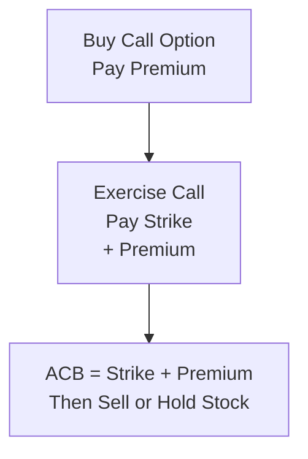

## 25.8 Tracking Adjusted Cost Base (ACB) in Complex Strategies

It’s safe to say that keeping tabs on one’s Adjusted Cost Base (ACB) can feel more complicated than cooking up your grandmother's secret stew—there’s a lot of small, subtle ingredients that go into the pot. Things get even trickier when you’re juggling multiple derivatives strategies. In Canada, if your ACB isn’t properly tracked, your tax filing could suffer the dreaded consequences: misrepresented gains or losses, nasty letters from the Canada Revenue Agency (CRA), and potential interest or penalties. No one wants that headache.

Nevertheless, organizing all these details doesn’t have to be an existential crisis. Let’s walk through how ACB gets tracked in different scenarios—like short puts, call exercises, or rolling strategies—and explore how to keep your records accurate and (relatively) stress-free. We’ll touch on real-life examples, discuss some potential pitfalls, and check out official references that can help you stay on top of your tax game.

Remember: This is an educational discussion and shouldn’t be taken as professional tax advice. If you find yourself in a complicated tax situation, it’s best to reach out to a qualified tax professional or consult the CRA’s official guidance.

---

## Why ACB Matters for Derivative Transactions

If you’re new to the concept, ACB represents the amount you've effectively “paid” to acquire a security or derivative. It includes not just the purchase price, but also any additional costs or adjustments—like option premiums or commissions. When you finally sell the security or close the position, your capital gains or losses are calculated as:

Capital Gain (or Loss) = Proceeds of Disposition – Adjusted Cost Base – Any Transaction Costs

An accurate ACB is critical. Understate your ACB, and you might pay more capital gains tax than necessary. Overstate it, and you risk underpaying taxes, subjecting yourself to potential penalties. Especially in derivatives dealing—where calls and puts can shift from “just a premium” to “now we own shares” or “now we delivered shares”—it’s essential to keep track of every step of the way.

---

## A Quick Refresher: Calls, Puts, and the ACB Foundation

Before diving into the complexities, let’s recall how calls and puts work, and how they typically affect your cost base:

• Long Call: If you buy a call option, you pay a premium. If you later exercise the call to buy the underlying shares, the cost of that premium is usually added to the purchase price of the shares. This sum becomes your ACB.

• Short Put: If you write (or sell) a put option, you collect a premium. If the put is later assigned, meaning you have to buy the underlying shares, your effective purchase price of the shares is the strike price minus the premium received. This reduced amount is the ACB for those shares.

• Rolling an Option: Sometimes you’ll close out your existing option and simultaneously open a new one with a different expiry or strike. The net premium paid or received in the rollover should be tracked carefully, so you can properly update your ACB (or the ultimate gain/loss on the option transaction).

It may sound straightforward in theory, but in practice, you know, it can spiral into confusion if you’re opening and closing positions multiple times or if you have numerous tranches of the same underlying in different accounts or across different tax years.

---

## Common Complexities in ACB Calculation

### Multiple Tranches of the Same Underlying

This one can trip up even the most diligent trader. Let’s say you owned 100 shares of XYZ Inc. from last year, but then you acquired another 100 shares this year when a short put was assigned. Now you have 200 shares total but with two different sets of circumstances for cost base. The CRA generally requires you to use the “average cost” method: you combine the two purchase amounts (including any premium adjustments) and divide by the total number of shares. Make sure you factor in the premium effect wherever applicable.

### Exercised Calls and the ACB Bump

When you exercise a long call, your cost for the underlying shares is not just the call’s strike price. Instead, it’s strike price + premium paid + commissions. You might also need to handle partial exercises, where only some contracts are exercised, or multiple calls with different strikes. Keep each scenario separate in your records.

### Assigned Short Puts and the ACB Discount

If you got assigned on a short put, your net cost is the strike price minus the premium you received. Adding commissions or fees as needed, that net figure becomes your ACB. If you had multiple short puts at different times, be sure to manage them individually, then average them if they’re all in the same underlying. 

### Rolling Options

Rolling an option means simultaneously closing one position and opening another (e.g., buying to close a short put, then writing a new short put with a further-out expiry). The net gain or loss from closing the old contract must be accounted for. Then, the new option’s premium must be factored in separately. If you eventually end up with shares because of that new short put, you’ll need to incorporate all relevant premiums from the entire chain of transactions.

### Tracking with Software vs. Manual Entry

Some folks prefer spreadsheet mania, and that’s totally fine. But from personal experience—where I forgot to record a rolled option’s net credit back in the day—it can get stressful and prone to mistakes. Automation can help. Tools like TurboTax Canada Premier or specialized services like Ajusto can track the cost base automatically, aggregating data from your brokerage statements. Additionally, some third-party investment accounting software can handle advanced derivative reporting—just remember to occasionally verify the data. If your account is large or you’re frequently rolling positions, investing in a robust platform might pay off.

---

## Practical Examples and Scenarios

Below are a few hypothetical scenarios that illustrate how ACB is transferred, adjusted, and reported.

### Example 1: Exercising a Long Call

• You purchase 1 XYZ Jan 50 Call for C$2.00 (total cost = C$200, ignoring commissions for simplicity).  
• As expiry nears, XYZ is trading at C$60, so you exercise the call.  
• You pay the strike price: 100 shares × C$50 = C$5,000.  
• Your total cost for these 100 shares = C$5,000 + C$200 premium = C$5,200. That’s your ACB.  
• Later, if you sell shares for C$6,500, your capital gain is C$6,500 – C$5,200 = C$1,300 (minus commissions). 

### Example 2: Assigned on a Short Put

• You write 1 XYZ Mar 45 Put for C$2.50 (you receive a credit of C$250).  
• The stock dips below C$45 at expiry, and you’re assigned.  
• You have to buy 100 shares at C$45 = C$4,500.  
• But don’t forget the put premium: your net cost = C$4,500 – C$250 = C$4,250.  
• This is your ACB for those 100 shares. If you later sell the shares at C$5,000, your capital gain is C$5,000 – C$4,250 = C$750 (less commissions).

### Example 3: Rolling an Option

• You short 1 ABC Jun 40 Put and receive C$100 in premium.  
• ABC’s price starts drifting around. As expiry nears, you buy to close that put at C$50 (so you have a realized gain of C$50).  
• Simultaneously, you write another put for the following month (Jul 40 Put) and receive C$80 in premium.  
• If the Jul put later expires worthless, your net gain from the entire sequence is C$50 (from closing the first put) + C$80 (from writing the second put) = C$130 (less fees).  
• None of these options ended up assigned. Your realized gain is simply C$130. No shares are added to or removed from your portfolio. However, if that second put eventually had been assigned, that would introduce a different layer of ACB calculation.

### Example 4: Multiple Tranches of the Same Shares

• In 2023, you buy 100 shares of QRS at C$30 each = C$3,000.  
• In 2024, a short put (strike C$28) on QRS is assigned after you earned a premium of C$1.00 (C$100 total). The effective cost for these 100 shares is C$2,700 (C$2,800 – C$100).  
• Now you own 200 shares, for a total outlay of C$3,000 + C$2,700 = C$5,700.  
• Your average ACB per share is C$5,700 / 200 = C$28.50.  
• When you sell, the gain/loss is based on this average cost of C$28.50, not just “some shares at C$30 or others at C$28 net.” This can be easy to forget when you’re flipping shares quickly or dealing with multiple accounts.

---

## Visualizing ACB Adjustments

Sometimes a picture helps. The diagram below is a simplified flow of how a call premium folds into the purchase price when exercised.

If that long call eventually becomes an open share position, your premium can’t be forgotten—add it to the share’s cost base. Similarly, though not shown in this diagram, if you wrote a put and got assigned, your premium would reduce the share’s cost.

---

## CRA Guidance and Official References

It’s one thing to understand the basics, but how do you ensure you’re on solid ground with the CRA? Here are a few references:

• CRA T4037 – “Capital Gains”: This guide covers how to calculate capital gains and losses, including ACB fundamentals. Keep an eye out for the sections on options.  
• Provincial Securities Regulators: Bodies like the Ontario Securities Commission occasionally post investor bulletins on cost-base calculations.  
• “Finance and Taxation of Derivatives in Canada” (Thomson Reuters): An excellent deep-dive for advanced scenarios.  
• Specialized Software: TurboTax Canada (Premier version) often has dedicated sections for investments and options. Ajusto, a third-party ACB tracker, integrates with some brokerages to automate your records.

These references provide you with the official or semi-official stance on how to handle complex derivative transactions. The main thing is: record everything carefully, keep consistent and organized statements, and if you’re in doubt, consult with a qualified tax professional.  

---

## Best Practices to Avoid ACB Headaches

• Document Every Transaction: Whether it’s a simple call purchase or a multi-legged strategy, note the key info—trade date, strike, expiry, premium, commissions, assignment details.  
• Maintain Spreadsheets or Software: Manual or automated, choose whichever method you’re likely to stick with. Tools like Google Sheets or Excel can do wonders for smaller portfolios. For larger, complex portfolios, specialized accounting software can reduce mistakes.  
• Match Rolling Transactions to Final Outcomes: If you roll an option three times and end up assigned, your cost base might be shaped by several premiums. Don’t lose track of the earlier steps.  
• Confirm End-of-Year Statements: Some brokerages provide a year-end summary. Compare this with your personal logs. Discrepancies are often found where corporate actions (stock splits, mergers) or complicated derivative trades were involved.  
• Pay Attention to Tax Year Boundaries: If your position spans multiple calendar years, it might complicate your tax reporting. Partial closes, “wash sales,” or transitional periods can cause confusion.  
• Consider Professional Guidance: If you frequently trade or have complicated strategies, an experienced tax advisor can help you sidestep major pitfalls.

---

## Potential Pitfalls and Penalties

Errors in your ACB might result in:

• Underpayment of Taxes: If you overstate your cost base, you’ll pay too little in taxes. The CRA might correct your return and assess interest or penalties.  
• Overpayment of Taxes: If you understate your cost base, you’re essentially giving the government an interest-free loan. You might never recover that money if you fail to file an adjustment.  
• Increased Risk of Audit: Repeated or large mismatches between your broker statements and your tax returns can be a red flag.

Given the faster pace and higher volume of options trading, mistakes can occasionally sneak in, especially with short-term trades or rolling strategies. Proactive recordkeeping helps you stay one step ahead.

---

## Real-World Anecdote: The “Forgotten Premium”

I recall a friend—let’s call him Dave—who was rightly proud of his mechanical approach to rolling short puts on his favorite Canadian tech stock. Dave set up a routine to roll the option near expiry if the position was out-of-the-money. However, after about six months of repeating this, he realized he had no clue which premiums related to which trades. While Dave’s net result was profitable, his tax forms looked like alphabet soup. He spent hours reconstructing the timeline and adding up the partial trades, some assigned, some expired worthless, and some rolled. If Dave had maintained a simple spreadsheet for each position from the get-go, he’d have saved a boatload of time (and stress).

The moral: Even the smartest strategies flounder if you don’t keep detailed, organized records.

---

## Using Technology to Automate ACB Tracking

• Online Brokerage Feeds: Many institutions let you download transaction history in .CSV files. This can automatically fill in your spreadsheet. Don’t forget to confirm the data is correct.  
• ACB Calculation Software: Ajusto is a well-known platform that integrates with certain Canadian brokerages. It attempts to handle trickier calculations like rolling and partial assignments.  
• Tax-Filing Applications: TurboTax Canada (Premier), UFile, and similar programs often prompt you for details about derivatives trades. Make sure you input everything accurately, including whether an option was exercised, assigned, or expired worthless.

Even with fancy software, manual verification is key. Occasionally, transaction data might be mislabeled (especially with short options). So periodically glance at your statements to ensure everything matches the real story.

---

## CIRO Considerations and Regulatory Updates

The Canadian Investment Regulatory Organization (CIRO) oversees investment dealers, fosters market integrity, and provides guidance on best practices. If you recall, the Mutual Fund Dealers Association (MFDA) and the Investment Industry Regulatory Organization of Canada (IIROC) merged to become CIRO, which is now the principal SRO. While CIRO itself doesn’t directly audit your ACB, it does require dealers to maintain robust recordkeeping and supervisory infrastructure. If you’re working with a CIRO-regulated dealer, they might be able to provide better statements and transaction records that help with your year-end tax reporting.

---

## Conclusion

Tracking ACB often goes overlooked among newer derivatives traders. Yet it is an essential component of proper tax compliance and accurate profit/loss measurement. You might be thrilled about nailing a sweet winning trade; however, if you can’t properly document your ACB, that victory might come back to haunt you come tax time.

Let’s recap the main points:

• ACB is your cost foundation, and it includes premiums paid or received plus commissions and fees.  
• Exercising a long call usually adds the premium to your share purchase cost.  
• A short put assignment effectively reduces your share purchase cost by the premium received.  
• Rolling transactions (closing one option and opening another) require careful tracking of net premiums gained or lost across the entire chain of trades.  
• Tools and best practices can ease documentation—if you set them up early and keep them consistent.  
• Mistakes in ACB can lead to either underpayment or overpayment of taxes, both of which can carry consequences.

The next time you trade an option, make a note of your premium and precisely how it changes your carrying cost. It’s one of those small tasks that—like brushing your teeth—saves a world of hurt in the long run.

---

## Additional Resources

• Canada Revenue Agency (CRA) – T4037 “Capital Gains”: https://www.canada.ca  
• CIRO Official Website: https://www.ciro.ca  
• Ontario Securities Commission: https://www.osc.ca  
• TurboTax Canada (Premier Version): https://turbotax.intuit.ca  
• Ajusto (Third-Party ACB Tracker): [Search “Ajusto Canada ACB tracking” online]  
• “Finance and Taxation of Derivatives in Canada” (Thomson Reuters)

Remember, guidelines and software capabilities evolve. Always ensure you’re using the most up-to-date resources, especially as tax codes and regulatory frameworks adapt over time.

---

## Sample Exam Questions: Tracking Adjusted Cost Base (ACB) in Complex Strategies



### Which of the following best describes how ACB is generally affected when a long call option is exercised to purchase shares?

- [ ] The premium paid is subtracted from the strike price to form the new ACB.  
- [x] The premium paid is added to the strike price to form the new ACB.  
- [ ] The premium has no bearing on the ACB.  
- [ ] The premium only affects the ACB if the option expires worthless.  

> **Explanation:** When a long call is exercised, the cost of the premium is added to the exercise price to form the ACB of the newly acquired shares.

### How does receiving premium income from writing a put option adjust your cost base if that put option is later assigned?

- [ ] It has no effect on the cost base.  
- [ ] It is ignored if the put was initially written out-of-the-money.  
- [x] The premium received reduces your final purchase price of the shares.  
- [ ] The premium received is added to the final purchase price of the shares.  

> **Explanation:** When a short put is assigned, you must buy the shares at the strike price, but your net cost is the strike price minus the premium received. That becomes the ACB for the shares.

### Which of the following statements about rolling an option is correct?

- [ ] Rolling an option has no impact on ACB since no shares are acquired.  
- [x] You need to track premiums paid or received in the rollout transactions, as they will affect the final realized gains or losses if shares are eventually acquired.  
- [ ] Rolling an option eliminates prior premiums from cost-base calculations.  
- [ ] Rolling an option only matters if the option is deep in-the-money.  

> **Explanation:** Rolling involves closing an existing contract and opening a new one. The net premiums (paid or received) must be recorded because they might eventually affect the ACB if assignment occurs or factor into your realized profit/loss.

### Why is it particularly important to keep separate records of multiple tranches of the same stock purchased at different times?

- [ ] Because each tranche must be sold separately for tax reasons.  
- [x] Because the CRA generally requires an average-cost basis, and you need to track each purchase price accurately to update that average.  
- [ ] Because no capital gains taxes apply to the first 100 shares.  
- [ ] Because older shares are taxed differently from newer shares.  

> **Explanation:** The CRA mandates that investors use an average cost for identical securities. Accurately tracking each tranche’s purchase cost ensures you correctly calculate your overall ACB.

### What is a key advantage of using specialized ACB tracking software over manual spreadsheets?

- [ ] It automatically eliminates capital gains if you roll an option.  
- [ ] It prevents you from making losing trades.  
- [x] It helps reduce human error by automating data imports and calculations.  
- [ ] It is mandatory under CRA regulations.  

> **Explanation:** While not mandatory, specialized software can import data directly from brokerage statements and automate calculations, lowering the risk of mistakes.

### When a call option expires worthless, how does this typically affect the ACB for shares you already own?

- [ ] It increases the ACB by the premium paid for the call.  
- [ ] It decreases the ACB by the premium paid for the call.  
- [ ] It has no effect on the ACB if you do not own shares.  
- [x] It has no effect on the ACB if you already own the shares and did not exercise the option.  

> **Explanation:** If a call option expires worthless and you already hold the underlying shares in a separate transaction, the call premium does not adjust the existing ACB of those shares. The loss on the expired option is a separate capital loss event.

### In which scenario could an investor risk underpaying taxes?

- [ ] Overstating one’s ACB, leading to lower reported capital gains.  
- [x] Overstating one’s ACB, leading to lower reported capital gains or higher reported capital losses.  
- [ ] Understating one’s ACB, leading to higher reported capital gains.  
- [ ] Properly maintaining accurate ACB records.  

> **Explanation:** When you accidentally make your ACB too big, you’re effectively reporting smaller or even negative gains, potentially leading to underpayment of taxes.

### What is one recommended resource by the CRA for understanding capital gains and ACB?

- [ ] T1 General Tax Return form.  
- [ ] Provincial Securities Commission bulletins.  
- [x] T4037 “Capital Gains” guide.  
- [ ] T5013 “Partnership Return” form.  

> **Explanation:** The T4037 “Capital Gains” guide is the CRA’s primary document explaining capital gains, ACB adjustments, and other tax details related to disposing of capital property.

### Which statement best summarizes the effect of rolling options on ACB?

- [x] Rolling can complicate the ACB tracking process, especially if the new contract is eventually assigned, requiring all premiums to be accounted for.  
- [ ] Rolling closes the original option without creating any additional recordkeeping steps.  
- [ ] Rolling only affects the ACB if both old and new contracts are exercised.  
- [ ] Rolling automatically consolidates all premiums into one final figure.  

> **Explanation:** Rolling is an ongoing process that may involve multiple premiums. If at the end of the sequence shares are assigned, you have to include all those premiums in your calculation.

### True or False: If you are assigned on a short put, the premium received is considered a separate capital gain event, unrelated to the ACB of the acquired shares.

- [ ] True  
- [x] False  

> **Explanation:** The premium from a short put that is assigned directly reduces your purchase price of the shares. Therefore, it becomes part of the ACB calculation (i.e., strike price minus premium).


