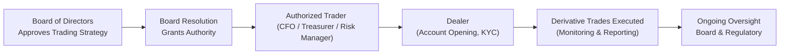

## 26.1 Opening Corporate Option Accounts

Sometimes, when people think about options trading, they imagine fast-paced equity traders or hedge fund managers. But corporations – from small manufacturing firms to giant multinational conglomerates – also use options for various reasons, such as hedging foreign exchange exposure or locking in raw material prices. In this section, we’ll focus on how corporations (legally formed entities) open and maintain option accounts in compliance with CIRO regulations and associated Canadian securities laws.

Many of us have encountered a scenario where a corporation sees significant foreign currency exposure or commodity price risk and decides it’s time to explore options strategies. Perhaps you’ve heard a CFO mention, “We should lock in these fuel prices” or “Let’s hedge our U.S. dollar revenues.” The process of opening an institutional or corporate option account is more intricate than opening an account for an individual, but it’s all about structure. Let’s walk through the full process.

## Introduction

Opening a corporate option account involves four main pillars:  
• Verifying the corporation’s legal existence and authority  
• Identifying individuals authorized to trade options  
• Ensuring there’s an internal governance structure for risk oversight  
• Conducting a thorough Know Your Client (KYC) process in line with CIRO and CSA requirements  

If any of these pillars are weak, the account opening can stall or cause bigger headaches down the road, including unauthorized trades or compliance breaches. So, setting it up properly from day one is crucial.

## Key Documents for Corporate Option Accounts

A typical corporate client must supply various documents to prove they are who they say they are and that the individuals handling trading activities are fully authorized by the board of directors or senior management. This is not just a matter of formality – these documents protect both the dealer and the corporation from unauthorized or mistaken transactions.

• Board Resolution or Authorization Document – This is the heart of the process. The board resolution confirms (1) the corporation’s intention to open an options trading account, and (2) the specific names of approved signatories or “authorized traders.” It’s how the board of directors formally says, “We’re okay with Jane, our CFO, and Bob, our Risk Manager, placing trades.”

• Corporate Entity Documents – These typically consist of the articles of incorporation, by-laws, and any amendments that establish the corporation’s legal existence. A quick check by the dealer can confirm that the business is a valid, operating entity. The correct legal name on these documents must exactly match what appears on the corporate seal (if used) and all account forms.  

• Proof of Legal Existence – Photocopies of a current certificate of good standing or equivalent provincial/territorial documentation can provide further confirmation that the corporation remains in compliance with corporate filing requirements.  

• Signing Authority Documentation – Sometimes, corporations use a separate Authorization of Officers or an official letter from the corporate secretary to show who can sign or execute transactions. Make sure these align with the board resolution.  

• Possibly Additional Governance or Risk Policy – In larger corporations, there may be a formal risk management policy that outlines what types of derivatives trades the company is permitted to use. Reviewing it provides the dealer with great insight into the corporation’s overall approach to risk.

## KYC for Corporate Entities

In a retail setting, you probably fill out a personal KYC form with your name, address, investment experience, and so forth. But for a corporation, the KYC process is a bit different. According to CIRO and CSA requirements, dealers must gather information to understand:

• The corporation’s financial health – including audited financial statements, net worth, and liquidity.  
• Creditworthiness – whether the corporation has the means to meet potential margin calls.  
• Organizational structure – who owns the corporation (public shareholders, private equity, family business, etc.) and how decisions are made.  

As you might guess, bigger or more complex corporations often submit detailed financial statements, annual reports, and additional data that might not be asked of a simpler organization. The principle is the same: the dealer needs enough information to do a proper risk assessment and ensure the corporate client truly understands the risks in trading derivatives.

## Understanding Corporate Structure and Roles

Even if you’re doing your best to gather the right documents, it’s important to get a sense of how the corporation’s internal governance works. Typically, there is a corporate compliance officer or a designated risk manager who monitors derivatives trading. Larger companies might have an entire treasury department dedicated to managing currency exposures or hedging commodity prices.

In my experience, I once worked with a medium-sized agricultural exporter that had no formal “treasury” team. Instead, the CFO wore multiple hats, including the person who placed commodity hedges and oversaw risk. It meant that for their option trading account, everything started with the CFO’s board-authorized instructions. In some organizations, the CFO delegates the day-to-day to a treasury analyst or external consultant, but legally, you need to verify such delegation is recognized in the board resolution.

Below is a quick flowchart to help visualize the typical process:

The arrows represent the chain of approval, culminating in ongoing monitoring to ensure accountability.

## Setting up the Derivatives Mandate

This is where things get interesting – a corporation’s derivatives mandate typically goes beyond “buy calls” and “sell puts.” It may specify:

• Instruments Allowed – only exchange-traded options? Or also OTC derivatives?  
• Hedging Only (No Speculation) – many corporations limit derivatives use to bona fide hedging, meaning they’re offsetting some existing financial risk (like foreign exchange, interest rates, or commodity prices).  
• Trading Limits – not only dollar amounts, but also which counterparties can be used.  
• Approvals Required – does the corporate compliance officer or CFO have to sign off on each new options position above a certain threshold?

To keep it simple, the dealer should request a copy of the relevant derivatives mandate (or an outline of it) so everyone is on the same page.

## Risk Management and Margin Requirements

Corporations sometimes forget that with certain options strategies – such as writing uncovered calls – possible losses can exceed the premium collected. Risk managers keep an eye on margin usage, expense lines, and compliance with internal (and regulatory) risk tolerances.

### Margin Basics

Margin is the collateral (cash, securities, etc.) the corporation must deposit to cover potential losses. For example, if a company sells a call option, the margin will typically include a portion of the underlying’s value plus the premium received. In KaTeX:


\text{Initial Margin} = \text{Premium Received} \;+\; \max \Bigl( \text{X\%} \times \text{Underlying Price} \times \text{Contract Size},\; \text{Minimum Margin Requirement} \Bigr).


The exact margin rules depend on CIRO guidelines and the Bourse de Montréal (for Canadian listed options). If the corporation only buys calls or puts, margin is typically just the premium itself because the maximum loss is capped at that premium.

### Creditworthiness Assessments

It’s also standard practice for the dealer (the investment firm) to perform a credit check on the corporation. Let’s be honest: if the corporation goes bankrupt, it can’t meet margin calls. Occasionally, a corporation may supply letters of credit or third-party guarantees to bolster its ability to trade larger volumes or riskier strategies. The key is that any arrangement must comply with CIRO’s capital and margin requirements.

## Communication Protocols

Corporate structures often mean more than one person is involved in deciding trades. Some trades require immediate action (especially if there’s a sudden currency shift or raw material price spike), but still, you want a documented chain of approval. Best practices suggest:

• Setting up a daily log to capture major trades, with signoffs from the authorized trader and perhaps a compliance officer.  
• Establishing an email or platform-based method for quick signoff if needed, so that urgent trades aren’t held up unnecessarily.  
• Keeping the board or a designated subcommittee informed on a monthly or quarterly basis about open positions, potential exposures, and realized gains/losses.  

## Additional Guidance and Best Practices

If you’re responsible for opening a corporate account or serve as a corporate officer overseeing derivatives trading, here are some pointers:

• Always double-check the legal name and the signatories. A mismatch can lead to major compliance issues or trade settlement failures.  
• Make sure the board resolution is not outdated. Sometimes boards pass resolutions with an expiration date or with reference to a specific derivative strategy that may no longer be relevant.  
• Encourage robust internal policies – So, even if the CFO changes or the risk manager goes on vacation, the corporation can still manage hedges properly.  
• Engage with legal counsel for complex derivative strategies – If they’re more exotic options (like barrier or digital options), or if trades involve cross-currency exposures, it might require additional legal scrutiny.

## Real-World Examples

Imagine a Canadian retail chain that sources goods from the U.S. Because the chain wants to lock in currency rates, they set up a corporate option account. The board resolution clearly states that only the CFO and the Treasurer can place trades. The CFO signs a corporate resolution, the authorized trader is the Treasurer, and the compliance officer is the Director of Finance, who reviews daily positions. The chain often buys USD calls (for example, CAD puts) to protect against a rising USD. With each trade, the Treasurer logs the date and notional amount in an internal system, while the compliance officer reviews them weekly.

Alternatively, a commodities-focused corporation might buy put options on crude oil to protect against price declines on its oil production. In that scenario, margin requirements might be smaller because they’re just purchasing the puts, but the dealer still checks the financial statements to ensure the corporation has the liquidity to pay the premiums for these puts on a recurring basis.

## Common Pitfalls

• Failing to update reseller or signatory documents when the CFO or authorized trader changes.  
• Overlooking that the board resolution was intended for a single transaction or has become invalid over time.  
• Inadequate internal controls that allow well-meaning staff to trade beyond approved limits.  
• Confusion between hedging and speculation, thus opening the door to trades that might inadvertently increase the corporate’s net exposure if not carefully analyzed.  
• Underestimating margin calls – especially when writing options in volatile markets or dealing with leveraged exposures.  

## Conclusion

Opening a corporate option account can be smoother than you think, provided you check off the major steps: verifying corporate documents, clarifying the derivatives mandate, ensuring risk management processes are in place, and properly identifying authorized traders. The most important takeaway is the alignment between the corporation’s board-approved strategy and the dealer’s KYC obligations. When that happens, the corporation can confidently implement hedging (or other strategies) without dealing with unwelcome compliance or legal surprises.  

For specific resources and deeper dives, consider these references:  
• CIRO official website: <https://www.ciro.ca> (for the latest regulatory guidelines)  
• CSA’s National Instrument 31-103 Registration Requirements, Exemptions, and Ongoing Registrant Obligations: <https://www.securities-administrators.ca>  
• OSFI Guidelines on corporate governance: <https://www.osfi-bsif.gc.ca>  
• “Corporate Risk: Strategies and Management” by G. Donaldson (a thorough academic text)  
• ISDA publications: <https://www.isda.org> for standardized documentation and best practices  

If, at times, this process feels intimidating or burdensome, remember that robust documentation and clear lines of authority help protect both the institution and dealer. And in my opinion, having an up-to-date board resolution and an engaged risk manager goes a long way toward responsible corporate derivatives usage.

---

## Sample Exam Questions: Opening Corporate Option Accounts



### Which key corporate document confirms who may open and manage an options account on behalf of the corporation?

- [ ] Articles of Incorporation
- [ ] Corporate By-laws
- [x] Board Resolution
- [ ] Annual Financial Statements  

> **Explanation:** A board resolution specifically designates authorized signatories and grants them the power to open and operate an options trading account.

### Which of the following best describes a primary regulatory concern when opening corporate options accounts?

- [ ] Ensuring the CFO owns majority shares
- [ ] Making sure the dealer has enough insured capital
- [x] Verifying the corporation’s legal existence and authorized signatories
- [ ] Obtaining personal credit checks of all board directors

> **Explanation:** One major concern is ensuring the corporation’s validity and identifying parties with trading authority through a board resolution, along with ensuring proper compliance with CIRO rules.

### If a Canadian corporation only purchases exchange-traded put options to hedge its inventory, which statement is most accurate regarding margin requirements?

- [x] The margin requirement will usually only be the premium paid.
- [ ] Margin is always waived for corporate accounts.
- [ ] The margin requirement is automatically waived if the trade is a hedge.
- [ ] The corporation must post at least 50% of the underlying value in margin.

> **Explanation:** Buying options typically requires payment of the option premium upfront, and no additional margin is generally needed because the maximum loss is capped at that premium.

### What is the main advantage of including a Derivatives Mandate in corporate governance policies?

- [ ] It allows corporate employees to trade without board oversight.
- [x] It clearly sets approved instruments, limits, and hedging purposes.
- [ ] It removes the need for a corporate compliance officer.
- [ ] It exempts the corporation from margin calls.

> **Explanation:** A formal derivatives mandate clarifies the scope (instruments, limits, objectives) and streamlines oversight and compliance.

### Which entity is responsible for ensuring that a corporation meets existing capital and margin requirements under CIRO rules?

- [ ] The local Chamber of Commerce
- [x] The dealer (investment firm) that opens the account
- [ ] Provincial legislature
- [ ] CSA internal enforcement unit

> **Explanation:** The dealer must verify that the corporate client meets the necessary margin and capital calls, consistent with CIRO’s guidelines.

### In the event that the CFO resigns and is replaced, which documentation step is typically required to maintain proper authorization for corporate option trading?

- [ ] No update needed if the CFO had a personal guarantee.
- [ ] Submission of a brand-new set of articles of incorporation.
- [ ] A formal notice from the CSA.
- [x] An updated board resolution specifying the new authorized trader.

> **Explanation:** Corporations should issue an updated board resolution or similar document to clarify changes in authorized signatories.

### Why might a corporate compliance officer be especially involved in derivatives trading decisions?

- [ ] Because the compliance officer underwrites all corporate insurance policies
- [ ] Because they are responsible for selecting new bank relationships
- [x] Because they oversee adherence to internal risk parameters and regulatory obligations
- [ ] Because they typically replace the CFO once the CFO retires

> **Explanation:** The compliance officer ensures that trades follow established risk limits, strategies, and external requirements.

### What is a primary reason a dealer needs access to a corporation’s financial statements?

- [x] To assess the corporation’s creditworthiness and ability to meet margin calls
- [ ] To confirm the CFO’s annual salary
- [ ] To verify the authenticity of the corporate seal
- [ ] To ensure the board of directors is fairly compensated

> **Explanation:** The dealer must check the corporation’s financial stability to ensure it can handle potential losses and margin obligations for derivative transactions.

### A large corporation’s Board of Directors issues a resolution that states, “We authorize all currency options trading for hedging.” Which is the best next step before granting trading permissions?

- [ ] Grant immediate and unlimited trading access, no further checks needed
- [x] Confirm the designated individuals, review risk parameters, and verify their KYC info
- [ ] Require the CFO personally to fund a margin deposit from personal funds
- [ ] File a statement with the local municipality

> **Explanation:** Even with a board resolution, the dealer still needs to confirm the authorized individuals, ensure they comply with KYC requirements, and understand the corporation’s specific risk limits.

### True or False: Institutions in Canada can rely entirely on an internal email from the CFO as sufficient authorization to open a corporate options account.

- [x] True
- [ ] False

> **Explanation:** While this might seem surprising, in practice, a simple internal email is not enough unless it references or is accompanied by an official, valid board resolution or other legally recognized corporate directive. That said, if the email attaches the board resolution granting that CFO explicit authorization, then it may be valid. Always check for documentary compliance.


