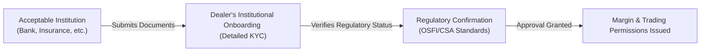

## 26.2 Opening Option Accounts for Acceptable Institutions

It’s funny how everyone thinks dealing with big financial institutions is just a breeze—like, oh, they’re a bank or an insurance firm, everything’s done in the blink of an eye. But in reality, opening an option account for an “acceptable institution,” such as a bank, insurance company, or other high-credit-quality entity, can be a long process requiring thorough documentation and regulatory checks. I remember sitting in on my very first account-opening call with a major wholesale bank (and I was pretty nervous, let me tell you), thinking that their “big name” alone automatically made them bulletproof. Well, sure, they were solid, but there were still regulatory statuses to confirm, sign-offs to get from the CFO, and a ton of margin arrangement details to finalize.

Anyway, let’s unravel this step-by-step. We’ll talk about what “acceptable institutions” are, the documentation you need to handle, how you verify all that juicy regulatory info, and how you align their often massive derivatives appetite with margin requirements and capital guidelines. We’ll toss in a few real-life scenarios and a simple flow diagram to illustrate how the account-opening process might look.

Before we dive in, let’s remember that in Canada, the new self-regulatory organization is CIRO, which replaced both IIROC and the MFDA as of January 1, 2023. This means you’ll see references to CIRO guidelines here, as well as the Office of the Superintendent of Financial Institutions (OSFI) for capital rules, and the Canadian Securities Administrators (CSA) for broader securities regulations. If you’re curious, you can always hop over to their official websites (like https://www.ciro.ca for CIRO) to get the latest updates on any new rule changes.

Acceptable institutions, in a nutshell, typically follow powerful internal risk controls and are subject to a high level of external regulatory oversight. Because of this, many aspects of a “regular” client account opening—such as verifying creditworthiness—are streamlined or replaced by confirming that the institution is recognized under relevant banking or insurance legislation.

  
Understanding Acceptable Institutions

When we talk about “acceptable institutions,” we’re really talking about entities that regulators trust to manage risks in a robust manner. Examples:

• Banks and deposit-taking institutions regulated under the Bank Act.  
• Insurance companies governed by insurance regulations (federally or provincially).  
• Broker-dealers to the extent they meet specific capital and oversight thresholds, often verified through CIRO membership and OSFI capital standards.  

Why do we care if an institution is “acceptable”? It’s about counterparty risk. When you trade options—or any derivative—there’s a chance the other side won’t fulfill its obligations. If you’re a bank or a dealership, you want to ensure that your large counterparties can actually meet their responsibilities, even in times of turmoil. Acceptable institutions carry the benefit of strong capital requirements and frequent stress tests imposed by OSFI or provincial regulators. Essentially, the idea is that these folks, by definition, shouldn’t easily default—at least not in normal market conditions.  

  
Regulatory Status and Documentation

So, first step: confirm you’re dealing with a legitimate, regulated entity. That means requesting proof of regulatory status.

• Banks or deposit-taking institutions might provide a charter or proof of OSFI recognition.  
• Insurance companies often reference their license granted by the appropriate insurance regulatory body.  
• Broker-dealers demonstrate their recognition or membership with CIRO if they’re in Canada or, in cross-border scenarios, other recognized regulators.  

In practice, I’ve seen compliance folks ask for an official regulator certificate or a link to a publicly searchable OSFI registry. You also want something verifying the senior officers or authorized signatories who can actually open an options account on behalf of that institution. That might include a board resolution or a letter of authorization from the CFO.  

If the institution is a foreign entity, you might request a notarized translation of their license or a legal opinion from an approved law firm. This may sound extreme, but it’s pretty standard—especially with large multinational banks operating across different jurisdictions.  

  
KYC in an Institutional Context

Now, for retail investors, we’re used to hearing about KYC as understanding the investor’s net worth, trading experience, and risk tolerance. But for big institutional accounts, KYC focuses on verifying:

• The institution’s legal authority to trade derivatives (options included).  
• The regulatory environment they operate under.  
• The capital or liquidity that supports their trading activities.  

You’re not digging into personal addresses or marital status, obviously. Instead, you’re considering the institution’s net capital and whether they can handle big losses. You want to confirm the existence (and identity) of their specialized derivatives desk. Let’s say they have an entire team dedicated to options trading—makes sense, right? That team might have advanced knowledge, but your firm still needs to confirm who’s authorized to place trades, how margin calls will be handled, and how trades are monitored internally.  

I recall a scenario where a mid-sized bank had a derivatives desk with just two senior traders. They had all the fancy portfolio analytics in-house, but we still required them to fill out the standard account docs and demonstrate adequate capital buffers. The entire process went smoothly once we got the final sign-off from their controlling officer.  

  
Aligning with the Institution’s Risk Policies

Banks and insurers typically have formal risk policies on how they manage market risk, credit risk, and operational risk. Your job, as the derivatives dealer, is to ensure that your own internal procedures align with your client’s rules. This might include:

• Checking whether they have any restrictions on the types of options or the product classes they’re allowed to trade (e.g., equity index options only, or also single-stock options, or maybe even weekly expiries, etc.).  
• Making sure your post-trade reports flow into their internal accounting systems easily, so they can do daily reconciliations and risk monitoring.  
• Setting up pre-trade risk controls, such as automated alerts if the institution’s open positions exceed a certain notional limit.  

Sometimes institutional clients have a maximum daily VaR (Value at Risk) that they’re allowed to run. If your trading platform can help them track it in real time, that’s a huge plus. You’ll typically coordinate with the institution’s front office or middle office staff to set up these dashboards.  

  
Margin Requirements and Potential Waivers

Here’s where it gets fun. Generally, margin obligations exist to protect the dealer from the customer’s inability to meet potential losses. But if your customer is a big, capitalized bank, shouldn’t that eliminate margin requirements?

In many jurisdictions, yes, margin requirements might be substantially discounted or even waived for an acceptable institution. Under certain CIRO guidelines, however, you may still need to collect margin if you suspect the institution does not maintain adequate liquidity or capital. Usually, you rely on OSFI’s oversight for banks and insurers. But your internal credit department might want a line limit or some margin arrangement anyway. A good practice is clarifying up front:

• Will the institution post collateral (cash, T-bills, etc.)?  
• What triggers a margin call?  
• Is there a maximum internal line (e.g., $50 million notional on equity index options) beyond which the institution must provide further documentation?  

Historically, many big dealers rely on an internal credit line assessment for each institutional client. So, while the formal margin might be set to $0 for a Tier 1 bank, their trading capacity is capped by whatever credit limit your firm is willing to expose. If trades expand beyond that, a margin deposit might be triggered.  

  
Counterparty Risk Mitigation

Even for an institutional client that’s well capitalized, you don’t want to be caught off guard by a sudden meltdown in the markets. If you’re dealing with extremely high notional volumes, you might formalize an ISDA Master Agreement with them. The International Swaps and Derivatives Association (ISDA, https://www.isda.org) provides standard templates that define what happens if either party defaults, how collateral is posted, how netting arrangements work, and so on.

This contract usually sits on top of your exchange-traded transactions. Technically, ISDA was developed for OTC derivatives, but big institutions often prefer the consistent legal frameworks across all derivatives relationships. It’s a bit like having a well-defined “plan B” if something goes wrong.  

  
Process Flow Diagram

Below is a simple visual representation of the process for opening an option account with an acceptable institution. It’s a simplistic view, but it captures the main checkpoints people usually have to address:

• Step 1: The institution submits the core docs: regulatory certificates, authorized signatories, board approval, etc.  
• Step 2: The dealer’s onboarding team digs into the KYC detail, verifying regulatory status, checking capital and liquidity.  
• Step 3: The dealer obtains final sign-off, ensuring everything meets OSFI/CSA standards.  
• Step 4: The institution’s trading desk is granted margin/credit lines, and they can begin trading.  

  
Practical Example: Bank ABC

Imagine Bank ABC is a recognized institution under Canada’s Bank Act. They have $100 billion in assets, are well within OSFI capital guidelines, and have a specialized derivatives desk that wants to buy and sell index options on behalf of the bank’s proprietary trading arm. As soon as they approach your firm to open an options account, you request:

• A certificate of compliance from OSFI (or an acceptable alternative).  
• The contact info for the derivatives desk leads.  
• A letter from the CFO (or an equivalent officer) authorizing them to open an options account.  
• If you plan on offering them future expansions—like cross-currency options or advanced volatility strategies—discussions about margin or collateral might pop up.  

Your back office runs a quick due diligence check, verifying that Bank ABC is indeed recognized by OSFI and is in good standing with no outstanding regulatory sanctions. At that point, your credit department sets a line limit for Bank ABC of, say, $750 million notional for exchange-traded equity derivatives. If Bank ABC’s open positions go beyond that, you’d reevaluate or ask for collateral. Because they are “acceptable,” the margin is set at zero for standard index options, provided they maintain good standing. The accounts are opened, and the bank can proceed to trade.

  
Handling Potential Capital Shortfalls or Rapid Market Swings

Sometimes people assume, “Oh, they’re a big institution; we’ll never have a problem with margin calls.” But we’ve seen major financial institutions overwhelmed by unexpected market turmoil (remember 2008?). Even acceptable institutions need to reassure the dealer that, in crazy market events, they’ll be ready and able to post collateral or close positions. Usually, you’ll see:

• A promise in the client agreement that they will meet potential margin calls on an intraday or next-day basis if their positions blow up.  
• Disclosure about the bank’s or insurer’s internal contingency liquidity lines—like fallback lines from parent companies or the central bank.  

Although these scenarios are rare, preparing for them is just good risk management.  

  
References and Additional Resources

• CIRO: https://www.ciro.ca  
  Check for guidelines on institutional accounts and margin relief programs specific to large regulated entities.  
• OSFI: https://www.osfi-bsif.gc.ca  
  Oversees banks and insurers in Canada, setting capital and liquidity requirements.  
• ISDA Master Agreement: https://www.isda.org  
  Offers standardized legal documentation for all kinds of derivatives (including exchange-traded relationships with big institutional clients).  
• Bank for International Settlements (BIS): https://www.bis.org  
  Provides global frameworks and guidance for central banks and regulators on managing counterparty risk.  

Feel free to browse these resources if you want more extensive details about how all these regulations dovetail. They don’t exactly read like a weekend novel, but hey, it’s crucial stuff.

  
Common Pitfalls and Best Practices

Pitfalls:  
• Not verifying who exactly has trading authority. Especially in larger institutions, there might be multiple departments claiming sign-off power. You need clarity.  
• Overlooking changes in the institution’s capital status over time. Just because they were flush with capital last year doesn’t mean everything’s the same now. Checking OSFI updates is wise.  
• Failing to incorporate the institution’s internal risk policies. If you let them trade a product class they’re not internally approved for, it could cause a big compliance headache.  

Best Practices:  
• Maintain an open line of communication between your firm’s compliance department and the institution’s compliance/risk management team.  
• Periodically check OSFI or provincial regulator bulletins to ensure your acceptable institution remains in good standing.  
• Keep robust documentation. If you waive margin or reduce it to $0, track the justification in your files.  

  
A Quick Personal Reflection

I still remember the day a huge insurance firm’s CFO asked me for clarifications on margin calls for a large index options portfolio they wanted to run. The conversation quickly revealed that, although the CFO was extremely savvy in insurance underwriting, she was less up to speed on the intricacies of how margin calls on an exchange work. We had a half-hour chat going over things like marking-to-market, potential intraday calls, and net option value. By the end, we realized a daily phone call or automated alert from the back office would help them stay on top of their positions. That small nudge set a positive tone for the entire relationship.

So, yeah—opening an option account for an “acceptable institution” might sometimes feel less stressful than for an individual day trader, but there are complexities. The final takeaway: good communication, thorough documentation, and alignment with regulatory guidelines remain your best friends.

  
Conclusion

Opening option accounts for acceptable institutions might sound straightforward at first, but it requires a blend of checking regulatory status, verifying internal risk controls, aligning with capital and liquidity frameworks, and setting a robust margin or credit line structure. The entire process rests on robust KYC methodologies adapted to the scale of an institutional partner. By thoroughly understanding both the regulatory environment and the institution’s internal mandates, you’ll pave the way for a stable, enduring (and maybe even fun) partnership in the derivatives marketplace.

Now that you understand some nuances of opening option accounts for acceptable institutions, you might want to explore other sections of this chapter, including how these rules differ for specific types of institutional clients (like pension funds, trust companies, or hedge funds) and the advanced documentation involved (like multi-layer sign-offs or the use of external prime brokers). Keep mastering these aspects, and you’ll see how all the pieces fit in the ever-evolving puzzle of institutional options trading.

  
## Sample Exam Questions: Opening Option Accounts for Acceptable Institutions



### Which of the following is considered an “acceptable institution” for options account opening under CIRO guidelines?

- [ ] A high-net-worth individual with significant liquid assets
- [x] A chartered bank regulated under the Bank Act
- [ ] A small private company with minimal regulatory oversight
- [ ] An unregulated startup with private funding

> **Explanation:** An acceptable institution is typically a bank, insurance company, or similarly regulated entity subject to rigorous oversight by OSFI or similar regulatory bodies.  

### What is the primary purpose of verifying the regulatory status of an acceptable institution prior to opening an options account?

- [x] To confirm the entity’s creditworthiness and reduce counterparty risk
- [ ] To ensure they have previously traded equity options
- [ ] To match them with smaller retail investors for liquidity
- [ ] To bypass Know Your Client (KYC) requirements altogether

> **Explanation:** Verifying regulatory status confirms that the entity is subject to capital and liquidity requirements, reducing the broker’s exposure to counterparty risk.  

### Which document often formalizes the relationship between a dealer and an acceptable institution for exchange-traded derivatives?

- [ ] The Common Equity Offering Agreement
- [x] The ISDA Master Agreement
- [ ] The Insider Trading Disclosure Statement
- [ ] The Prospectus Supplement

> **Explanation:** While the ISDA Master Agreement is traditionally used for OTC derivatives, some institutions may use it as an overarching contract for risk management across multiple derivative products, including exchange-traded options.  

### In a scenario where a Canadian insurance company wants to open an options account, which regulator’s prudential standards typically ensure they hold adequate capital?

- [ ] CIRO
- [ ] The CSA
- [x] OSFI
- [ ] The Bank for International Settlements (BIS)

> **Explanation:** OSFI sets and monitors capital and prudential standards for federally regulated financial institutions in Canada, including insurance companies.  

### What could trigger a margin deposit request even if an acceptable institution is granted zero initial margin?

- [x] Breaching an internally assigned credit limit
- [ ] Having fewer than 10 years’ experience with derivatives
- [ ] Declaring a small quarterly dividend
- [ ] Trading a single call option contract

> **Explanation:** Even if the initial margin is set to zero, the dealer will usually have a maximum notional limit or credit line. Exceeding that limit or encountering market losses can trigger a margin call.  

### Which of the following best describes the dealer’s KYC obligation when opening an options account for a large bank?

- [x] Verify the bank’s authority to trade, capital standing, and authorized signers
- [ ] Ask for the personal employment details of every employee at the bank
- [ ] Require proof of the bank’s compliance with prospectus exemptions
- [ ] Obtain the bank’s marketing materials for retail clients

> **Explanation:** Institutional KYC focuses on the client’s legal right to trade derivatives, their capital adequacy and risk management policies, plus confirming who can execute trades on their behalf.  

### What is one advantage of having an insurance company’s specialized derivatives desk coordinate directly with a dealer’s risk management department?

- [ ] It eliminates the possibility of margin calls
- [x] It streamlines daily position reconciliation and ensures risk limits are not breached
- [ ] It replaces all OSFI capital guidelines
- [ ] It allows the insurance company to bypass trading rules at the exchange

> **Explanation:** A close connection between the institution’s specialized desk and the dealer’s risk management helps manage real-time exposures, daily reconciliations, and ensures trades stay within agreed-upon risk boundaries.  

### How might an acceptable institution’s internal risk policy affect the scope of option trading allowed in its newly opened account?

- [x] It may limit the types of contracts they can trade based on internal restrictions (e.g., only index options)
- [ ] It automatically grants them margin-free trading for all derivative products
- [ ] It prevents them from trading any options that have less than one year to expiry
- [ ] It forces them to re-register with CIRO before each new trade

> **Explanation:** Some institutions set specific limitations based on their internal policies, possibly restricting them to certain product classes, maturities, or strategies to manage overall risk.  

### Why might an acceptable institution have to post collateral despite high liquidity and abundant assets?

- [x] In case of erratic market moves or if they exceed prearranged credit limits
- [ ] To increase their total trading costs and discourage high-volume trading
- [ ] Because CIRO mandates collateral equal to 200% of their notional exposure
- [ ] They are required to hold capital at a separate bank

> **Explanation:** Despite strong liquidity, institutions might be required to post collateral when market conditions deteriorate or when they exceed established credit boundaries.  

### True or False: CIRO rules automatically exempt acceptable institutions from margin responsibilities under any scenario.

- [ ] True
- [x] False

> **Explanation:** While margin requirements may be waived or minimized in many cases, if there is a concern about an acceptable institution’s capital or if internal credit thresholds are exceeded, margin calls can still be enforced.  


