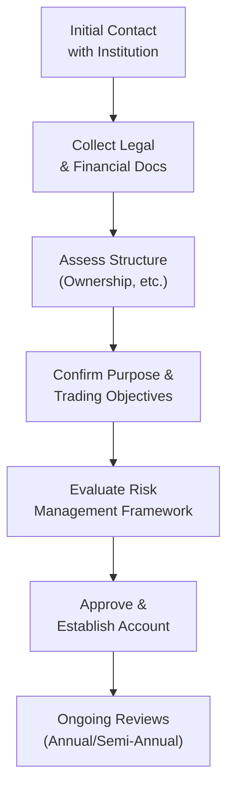

## 26.3 Know Your Client (KYC) Rule for Institutional Clients

So let’s talk about the Know Your Client (KYC) rule for institutional clients—one of my favorite subjects when it comes to offering derivatives trading services. If you’ve ever worked in a compliance department, you know exactly how detailed this can get. But don’t worry, I’ll walk you through this in (hopefully) plain language.

KYC for institutional clients doesn’t always resemble the retail-focused process many of us learned at the outset of our careers. With retail clients, we typically worry about things like personal identity, net worth, trading experience, and risk tolerance. For institutions, yeah, some of that also applies—but with a twist. We need to ensure the institution is legally formed, properly managed, and operating in line with all relevant Canadian regulations. And, we have to figure out whether they truly understand the derivative products they’re about to trade—plus whether they have strong risk management processes in place.

Below, I’ll break down the key elements of an effective KYC program for institutional clients in the Canadian market, keeping in mind current CIRO rules (as of 2025). We’ll also talk about reconciling these requirements with the anti-money laundering (AML) and anti-terrorist financing (ATF) obligations that remain front-and-center for any financial intermediary. By the time you’re done reading, I hope you’ll feel confident in setting up or supervising institutional KYC programs.

Remember, as of January 1, 2023, the Mutual Fund Dealers Association of Canada (MFDA) and the Investment Industry Regulatory Organization of Canada (IIROC) amalgamated into the Canadian Investment Regulatory Organization (CIRO). So, if you see references to MFDA or IIROC documentation, it’s strictly historical. Today, CIRO is your go-to for official guidelines on matters like KYC. And if you’re looking for investor protection coverage info, check out the Canadian Investor Protection Fund (CIPF)—that’s the single fund that emerged from the merger of the Fund’s predecessor organizations.

---

### The Foundations of Institutional KYC

The fundamental question that drives KYC for institutional clients is basically: “Who are you, and how do you ensure you’re operating prudently?” While that might sound a bit simplistic, it really captures the essence. For institutional accounts, we care about multiple layers:

• Legal capacity and registration status.  
• Ownership structure (if relevant, e.g., for a private corporation or partnership).  
• Primary lines of business.  
• Financial position and liquidity situation.  
• Organizational risk management and governance policies.  

You might be thinking: “Wait, that’s a lot to keep track of.” Indeed, it’s quite thorough. But it’s how dealers protect themselves and the markets from unscrupulous or risky activities. Let’s look at each layer in more detail:

#### Legal Capacity and Registration

Check whether the institution is duly incorporated or constituted. This means verifying the existence of the entity via official registries or obtaining a certificate of incorporation. If it’s a pension plan, confirm the plan is recognized under applicable pension legislation. If it’s a Crown corporation, ensure it has the statutory powers to enter derivatives transactions. And if it’s a charity or foundation, confirm it can legally engage in derivatives trades.  

In addition, the institution may need to be registered or recognized by another regulator (like the Office of the Superintendent of Financial Institutions, or a provincial securities commission). Confirm that the institution is in good standing and can lawfully conduct the type of transaction it’s seeking to execute.  

#### Ownership Structure

For large, publicly traded companies or well-known government entities, you typically won’t go searching for beneficial owners in the same way you would with a small private corporation or partnership. But if you’re dealing with a smaller corporate structure, a hedge fund, or a specialized investment vehicle, you need to identify the controlling parties.  

This, of course, ties directly into the AML/ATF obligations. FINTRAC (the Financial Transactions and Reports Analysis Centre of Canada) expects dealers to know the individual(s) who ultimately control the funds. Even if it’s a big institutional setup, a risk-based approach might still require additional due diligence if something about the structure raises red flags.

#### Primary Lines of Business and Trading Purpose

You’ll hear dealers ask: “Are you transacting for hedging, speculation, or something else?” If, for example, a large manufacturing company trades futures on raw materials to hedge commodity price risk, the dealer must ensure that these trades are consistent with the stated business purpose. If it’s a bank or a large pension plan, they might have a broad mandate—everything from currency swaps to credit default swaps. Confirming whether their lines of business support these transactions is vital.

#### Financial Position and Liquidity

We’re dealing with derivatives, which can be super risky. You know that, I know that. One of the worst feelings in the world is discovering that your institutional client lacked liquidity to meet margin calls or respond to adverse price moves. For that reason, an assessment of the institution’s balance sheet, liquidity sources, and net worth remains central to KYC.  

Dealers often request financial statements—audited, if possible—and key ratios like debt-to-equity, liquidity coverage ratios, or credit ratings from recognized agencies. If the institution is known to have stable and high net worth, that might simplify the ongoing review. But if it’s living on a shoestring of leveraged financing, that’s a different story.

#### Organizational Risk Management and Governance

Now we get to the heart of whether an institution can handle derivatives. Does the institution have a risk management framework? Are there committees or boards overseeing derivatives policies? How about designated signatories with clear authority to trade? The stronger the governance, the more comfortable you’ll feel about the client’s capacity to manage complex or even vanilla derivatives.  

This is also where you’d ask about restrictions: “Are you allowed to trade exotic options, leveraged swaps, or high-volume futures?” Many institutions have internal rules or regulatory constraints. By verifying these aspects, you avoid nasty surprises (for instance, an unauthorized corporate officer booking trades behind the CFO’s back).

---

### Reviewing Institutional KYC Over Time

Institutional KYC isn’t a one-shot deal. Regulations (including Canada’s National Instrument 31-103, Registration Requirements, Exemptions and Ongoing Registrant Obligations) generally require ongoing monitoring. For large, sophisticated institutions, this might mean at least an annual or semi-annual update. Why? Because big institutions can pivot quickly—launching new product lines, acquiring other businesses, or incurring significant liabilities that might change their risk tolerance in just a matter of months.  

In practice, some dealers schedule formal reviews—complete with updated financial statements and conversation about changes in risk governance. These reviews help keep the lines of communication open. They also remind the institution that derivatives trading is rarely a simple “set it and forget it” arrangement.

---

### AML/ATF Considerations

Even though we’re talking about established firms, AML and ATF concerns still apply. You might say, “But this is a Fortune 500 corporation—do we really suspect them of money laundering?” Usually not. But a risk-based approach means you still need to conduct baseline steps:

• Identify the institution’s location and confirm they operate in jurisdictions not subject to sanctions.  
• If it’s a regulated financial entity, you might lighten the AML checks, relying on the fact that the institution already meets robust compliance standards.  
• For smaller or privately held firms, you might request more thorough beneficial ownership information.

Canada’s FINTRAC is your friend here: their website (https://www.fintrac-canafe.gc.ca) details recommended practices and red flags. Plus, as new or updated guidance emerges (especially concerning politically exposed persons or restricted foreign jurisdictions), your risk-based approach might need a refresh.

---

### Example: Bank Treasury vs. Hedge Fund

Let’s consider two common institutional clients:

• A Tier-1 Canadian Bank’s Treasury Department. It’s obviously regulated to the hilt by OSFI (Office of the Superintendent of Financial Institutions) in Canada. The bank will have robust capital and liquidity requirements, advanced risk-management committees, and specialized teams to handle derivatives. So your KYC approach might be fairly streamlined—confirming the bank’s legal authority and referencing OSFI’s oversight generally suffices.

• A Small Hedge Fund in a foreign jurisdiction. Even if the hedge fund has a decent track record, you have to verify its structure. Who manages it? Is it licensed in that jurisdiction? How stable is its capital? Does it have any regulatory sanctions? If the hedge fund is set up in a higher-risk or secrecy-oriented jurisdiction, you’d want to apply more scrutiny. Items like an offering memorandum, financial audits, or third-party references can help you confirm legitimacy.

---

### Practical Governance and Documentation Checks

Dealers should request official documents—articles of incorporation, partnership agreements, resolutions from the board of directors, or proof of authorization to trade derivatives. Sometimes you’ll see a corporate entity produce a board resolution that specifically designates certain officers to sign off on derivatives contracts. That’s a best practice: it ensures that you’re dealing with authorized individuals and reduces the risk of trades that exceed internal mandates.

If the institution has a segregated or specialized derivatives department, you also want to see how it’s integrated into the broader governance structure. Is there a Chief Risk Officer who sets trade limits? Are trades automatically reported to an oversight committee? Understanding these internal workflows can help you tailor your product offerings.

---

### Risk Management Framework Essentials

In an institutional KYC context, verifying the risk management framework is everything. A typical risk management framework includes:

• Policies and procedures: Clear guidelines that define which derivatives can be traded, maximum exposures, and required approvals.  
• Quantitative definition of risk tolerances: Some institutions use Value-at-Risk (VaR) measures, while others prefer scenario analysis.  
• Reporting lines: The person or committee who monitors positions and margin usage.  
• Escalation protocol: Steps to follow if a position goes outside risk limits or if market conditions become extraordinarily volatile.  

I once worked with a mid-sized energy producer that was deeply exposed to commodity price fluctuations. They had a robust risk management framework—weekly updates on hedge cover, daily marking-to-market of positions, and pre-set triggers for manual reviews. They saved themselves from big hits more than once just by following their own rules. Seeing that in action was a real eye-opener for me on how crucial these frameworks are.

---

### Steps in the KYC Process: A Visual Overview

Below is a simple Mermaid diagram that shows a typical institutional KYC process flow. Note that every dealer tailors their own approach, but this outlines the basics:

At a high level:

• Start with an initial conversation.  
• Gather relevant documents.  
• Understand the client’s structure.  
• Confirm trading objectives (hedge, speculate, or otherwise).  
• Evaluate risk processes.  
• Approve the account under your firm’s policies.  
• Schedule ongoing reviews at least annually but possibly more frequently for complex accounts.

---

### Keep an Eye on Evolving Regulations

CIRO issues regulatory notices from time to time, clarifying responsibilities for institutional KYC. The Canadian Securities Administrators (CSA) also updates rules, like National Instrument 31-103, which lumps KYC, know-your-product (KYP), and suitability obligations together. In addition, keep watch for:

• International guidelines from the International Swaps and Derivatives Association (ISDA) on documentation and margin.  
• Potential changes in margin rules or clearing mandates if the institution trades certain OTC derivatives that become subject to clearing requirements.  
• Evolving AML sanctions lists or watchlists that might affect the institution’s ability to trade.

It’s crucial for compliance teams to keep a close eye on these updates. And if you’re offering cross-border services, you need a handle on issues like U.S. Commodity Futures Trading Commission (CFTC) rules and any potential extraterritorial effect of other jurisdictions’ laws.

---

### Case Study: Canadian Pension Plan Implementation

Imagine you’re onboarding a newly formed provincial pension plan. They approach you for interest rate swaps to manage the duration risk of their portfolio. Here’s how you might proceed:

• Verify that the pension plan is enabled under provincial pension legislation and is recognized as an institutional investor.  
• Confirm the plan’s governance structure: Is there an investment committee or external asset manager with the authority to trade derivatives?  
• Request the plan’s statement of investment policies and procedures (SIPP). The SIPP usually outlines how derivatives can be used, any limitations, and risk constraints.  
• Obtain financial statements, plus evidence of stable funding or statutory backing.  
• Understand how the plan’s internal risk management systems track swap exposures relative to their obligations.  
• Ensure sign-off from the plan’s authorized representatives.  

Then, if everything checks out and the plan’s risk profile aligns with your firm’s acceptance criteria, you finalize the account. You can see how thorough the process is. This same approach—scaled up or down—applies to other institutions, from corporate treasuries to global banks.

---

### Common Pitfalls and How to Avoid Them

Failing to Verify Authorized Signatories:  
Sometimes, someone appears with a fancy title, and you assume they’re legit. But if that person never received board-level authorization to trade derivatives, you could be in hot water. Always confirm the corporate authority.  

Ignoring Red Flags on Ownership or Location:  
“Huh, this hedge fund is in a high-risk jurisdiction with opaque disclosure rules. So what?” This might be a giant red flag for AML. Possibly it’s legitimate, but you’d better do your homework.  

Not Updating KYC for Evolving Business Lines:  
An institution that was purely an importing business might branch out into cross-border financing or derivatives-based speculation. If you haven’t updated your KYC, you could be offering them products that no longer suit their new reality.

---

### Resources and References

• CIRO: Canada’s new, consolidated self-regulatory organization. See https://www.ciro.ca for the latest on compliance bulletins.  
• CSA: Check National Instrument 31-103 for specifics on Canadian KYC and suitability obligations.  
• FINTRAC: The official Canadian government agency (https://www.fintrac-canafe.gc.ca) for AML/ATF guidelines.  
• ISDA: If you’re dealing with swaps and other structured products, ISDA documentation and protocols are must-reads (https://www.isda.org).  
• CIPF: The Canadian Investor Protection Fund (https://www.cipf.ca) for how client assets are protected if a firm becomes insolvent.

---

### Final Thoughts

KYC for institutional clients is about truly “knowing” the entity on multiple levels. Yeah, it can be a bit tedious at times, especially handling all the paperwork and dealing with large organizational structures. But remember that corners cut on KYC often lead to compliance headaches—or worse—down the line. The ultimate goal is to ensure your financial institution (and the market at large) is protected from undue risk, fraud, and compliance issues.  

If you ever feel overwhelmed, just remember: each layer of verification—legal, financial, governance, risk management—is like a protective filter ensuring you’re not dealing with someone who could inadvertently (or intentionally) disrupt your firm or the market.  

And, of course, each year brings new rules, new guidance, and new ways of thinking about risk. So stay curious, stay flexible, and keep that compliance manual handy. The KYC process for institutions may be complex, but it’s also your best friend when it comes to building stable, long-term client relationships in the derivatives world.

---

## Sample Exam Questions: KYC for Institutional Clients in Derivatives Trading



### Which of the following best describes the importance of verifying an institution’s legal authority to trade derivatives?

- [ ] It helps the institution avoid any tax obligations.
- [x] It ensures the entity is allowed to trade derivatives according to its charter, bylaws, or enabling legislation.
- [ ] It creates a mandatory exemption from margin requirements.
- [ ] It eliminates the need for annual account reviews.

> **Explanation:** Confirming an institution’s legal authority to trade derivatives is central to KYC. If an entity lacks the legal capacity, the dealer can’t open the account safely.

### What is a primary reason for dealers to request financial statements from institutional clients?

- [x] To assess the client’s liquidity and ability to meet potential margin calls.
- [ ] To ensure the client can offer the lowest possible fees on trades.
- [ ] To eliminate the need for annual KYC updates.
- [ ] To comply with FINTRAC’s rules on beneficial ownership disclosure only.

> **Explanation:** Financial statements are typically used to evaluate an institution’s net worth, liquidity profile, and overall capacity to handle the risks associated with derivatives trades.

### Which statement most accurately reflects a “risk-based approach” to AML/ATF for institutional clients?

- [ ] All institutional clients are treated identically, regardless of risk level.
- [x] Higher-risk institutions undergo more extensive checks, while lower-risk entities (like major banks) may face simplified reviews.
- [ ] Institutional clients are exempt from AML/ATF procedures entirely.
- [ ] AML procedures are not required if the institution is publicly listed.

> **Explanation:** Under a risk-based approach, dealers apply more vigorous checks to clients from high-risk sectors or jurisdictions and more streamlined checks for well-regulated entities.

### During the KYC process for a small private hedge fund with unclear ownership, what is a key question a dealer should ask?

- [x] “Who are the beneficial owners or controlling persons behind the hedge fund?”
- [ ] “How can you guarantee the fund will double its money this year?”
- [ ] “Which automotive brand do you use for business travel?”
- [ ] “Is your fund incorporated in Canada, and can you confirm you have no board members?”

> **Explanation:** Dealers must identify ultimate beneficial owners to mitigate AML/ATF exposure, particularly if the fund’s ownership is not transparent.

### How often should large institutions’ KYC information generally be reviewed by dealers?

- [x] Annually or semi-annually, depending on the institution’s complexity and the dealer’s policies.
- [ ] Just once at account opening, with no further follow-up.
- [x] More frequently if critical changes occur (e.g., new business lines, major acquisitions).
- [ ] Strictly every five years, following universal standards.

> **Explanation:** Large or complex institutions can change their operations quickly, so best practices suggest an annual or semi-annual review, with additional reviews if material changes occur in the interim.

### Which of the following statements best describes the role of a board resolution in institutional KYC?

- [x] It can specifically designate authorized officers to enter into derivatives transactions on behalf of the institution.
- [ ] It automatically voids all transactions over a certain notional amount.
- [ ] It increases the client’s margin requirements for futures trades.
- [ ] It eliminates the need for any risk management framework.

> **Explanation:** A board resolution is a formal document that outlines who has the authority to act on the institution’s behalf, which is crucial for verifying signatories.

### Why is understanding the client’s risk management framework critical in institutional KYC?

- [x] Because it demonstrates how the client monitors, measures, and limits exposures in derivative transactions.
- [ ] Because it reveals the exact profit the institution will generate from each trade.
- [x] Because it ensures the trades are authorized within the client’s internal governance policies.
- [ ] Because it lowers the fees charged for high-volume trades.

> **Explanation:** A client’s risk management framework indicates its capacity to handle market volatility, margin calls, and evolving exposures—essential for KYC and suitability.

### What is the primary goal of verifying whether an institutional client is using derivatives for hedging or speculation?

- [x] To ensure the trading strategy aligns with the institution’s stated risk profile.
- [ ] To guarantee the client never incurs a loss.
- [ ] To reduce the number of required compliance checkpoints.
- [ ] To confirm the client has no formal governance structure.

> **Explanation:** Determining the reason behind a derivative transaction (hedging vs. speculation) helps you evaluate if the product suits the client’s objectives, thus aligning with overall KYC and suitability obligations.

### When dealing with a government entity as an institutional client, which step is typically reduced or simplified?

- [x] The AML/ATF checks, given it’s a recognized public body with well-known governance.
- [ ] The requirement to verify funds are not coming from a high-risk geography.
- [ ] The need to confirm legal authority altogether.
- [ ] The frequency of KYC reviews, which is strictly prohibited by law.

> **Explanation:** Recognized government entities typically pose lower AML risks, so dealers often streamline that part of the process.

### True or False: An institution’s KYC data may remain static over time, eliminating the need for periodic reviews.

- [ ] True
- [x] False

> **Explanation:** Business operations, financial conditions, and market exposures may change rapidly, so periodic KYC reviews remain essential for institutional clients.


