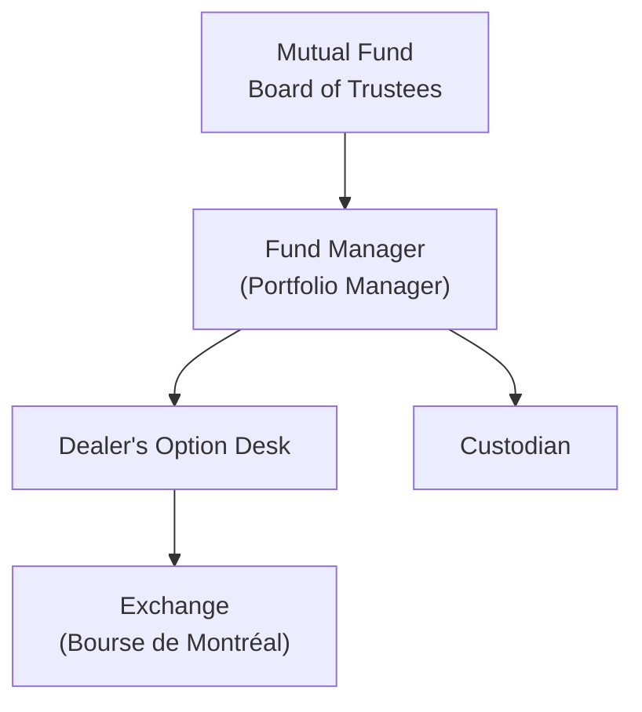

## 26.5 Canadian Mutual Funds

Imagine you’re chatting with a friend who’s just realized that some Canadian mutual funds are so big they practically operate like major institutions. They may not be your typical “mom and pop” investment vehicle—many have billions under management, established boards of trustees, and sophisticated portfolio managers. These funds, surprisingly enough, can qualify for what we often call “institutional-level” services when it comes to opening and maintaining derivatives-based accounts. In this section, we’ll talk about how these large Canadian mutual funds fit under the institutional umbrella, the regulatory compliance requirements they must follow, and the ways they use derivatives to hedge risk or generate an extra trickle of income.

Before diving in, a quick heads-up: We’ll keep this conversation somewhat laid back, with the occasional personal anecdote or rhetorical question. But don’t worry, we’ll still be thorough—covering everything from National Instrument 81-102 compliance to margin policies and best practices for boards and trustees when they set derivatives policy. Let’s jump in.

**Institutional-Level Services for Canadian Mutual Funds**  
Let’s start with the core idea: Some mutual funds in Canada are enormous—imagine a multi-billion-dollar equity or balanced fund. Because of their size, they often have leverage to negotiate more favorable margin terms or access specialized hedging solutions with a dealer’s options desk. This is what we mean by “institutional-level” services. While the average retail mutual fund simply invests in stocks or bonds and occasionally dabbles in exchange-traded funds (ETFs), these larger funds may have a dedicated in-house derivatives portfolio manager or a small team that monitors option positions and calculates hedge ratios daily.

From my personal experience, once I worked with a large mutual fund that wanted to set up a series of covered call strategies across multiple equity holdings. They aimed to boost yield for monthly income distribution. Because they had such a high net asset value, the dealer offered them specialized margin rates and a more streamlined settlement process. That’s an example of how a large mutual fund—though technically “retail” in the sense that everyday folks buy its units—can qualify for near-institutional sophistication.

**National Instrument 81-102: A Key Regulatory Framework**  
If you’re not familiar with National Instrument 81-102 (Investment Funds), it’s basically the set of rules laid out by the Canadian Securities Administrators (CSA) that govern the operation and distribution of mutual funds in Canada. It sets limits on the use of derivatives for hedging, short selling, and leveraging, among other important risk management guidelines. NI 81-102 also spells out disclosure requirements, ensuring that unitholders understand what type of derivative usage might be going on in the fund.

While large mutual funds might have more flexibility in how they engage with derivatives at an operational level—due to advanced risk management infrastructure—it doesn’t mean they get to ignore NI 81-102. Quite the opposite, actually. In my opinion, the bigger the fund, the more closely they’re likely monitored by the fund’s board of trustees, its compliance department, external auditors, and of course, the regulators.

Here’s a simplified flow that shows how different players interact when a Canadian mutual fund decides to use options on the Bourse de Montréal:

- A["Mutual Fund  Board of Trustees"]: Oversees derivatives policy.  
- B["Fund Manager  (Portfolio Manager)"]: Implements strategies.  
- C["Dealer's Option Desk"]: Executes trades, sometimes offering specialized margin terms.  
- D["Exchange  (Bourse de Montréal)"]: Where listed options are traded.  
- E["Custodian"]: Safeguards assets and ensures settlement.

**Derivatives in Large Mutual Funds: Hedging & Income Generation**  
A lot of folks wonder: “So, why would a mutual fund use derivatives?” The two most common reasons are hedging and income generation.

• Hedging: For instance, a mutual fund heavily weighted in the Canadian equity market might purchase index put options on the S&P/TSX 60 to cushion the blow from a potential market downturn. Because large funds have a responsibility to preserve capital for hundreds or thousands of unitholders, a modest premium spent on protective puts can be a good insurance policy.  

• Income Generation: Funds can engage in covered call writing. Let’s say the fund holds shares of a large Canadian bank. The fund manager might sell call options on those bank shares to collect option premiums, effectively creating a covered call strategy. This can generate additional income, although the upside on the stock is capped if prices shoot past the strike price.  

In both situations, NI 81-102 sets clear boundaries. If the fund goes beyond basic or common strategies (like using plain vanilla puts or calls for hedging), it must disclose this in greater detail in its prospectus or in amendments thereto. So if you’re an investor in a mutual fund that suddenly starts dabbling in advanced strategies—like ratio spreads, diagonal spreads, or even exotic derivatives like barrier options in the over-the-counter (OTC) market—expect extra disclosures about the risk.

**Leverage Constraints and Risk Management**  
One of the biggest issues with derivatives is their potential to create leverage. Leverage can magnify returns, sure, but it can also magnify losses. Under NI 81-102, Canadian mutual funds are restricted in how much leverage they can assume. This doesn’t mean they can’t do a bit of notional leveraging—if they buy put options for hedging and those options have a certain notional value, that’s typically acceptable. But they have to do it within NI 81-102’s constraints and carefully track their overall exposure.

Typically, the fund’s board of trustees will set the broad outlines of a derivatives policy. Then the fund manager must demonstrate how each strategy—whether it’s selling covered calls on sector-specific equities or using futures to manage cash flows—fits within the fund’s investment objectives and risk tolerance. Some boards take a conservative approach, limiting derivatives usage to straightforward hedges. Others, especially ones overseeing more growth-oriented or balanced funds, might allow a bit more wiggle room to generate alpha through derivatives.

**Margin Terms and Negotiations**  
When a large mutual fund knocks on a dealer’s door to open an options account, they often negotiate specialized margin terms. Because of the fund’s scale, the dealer recognizes that the overall client relationship likely includes stock trading, bond activity, or maybe even prime brokerage services. In many cases, the dealer might offer:

• Competitive margin rates, subject to CIRO guidelines.  
• Dedicated relationship managers who handle the trades.  
• Flexible collateral requirements, provided the fund has high credit quality assets on hand.  

While this can look similar to what big pension funds or insurance companies might get, it’s all happening under the umbrella of a “mutual fund.” But, of course, the mutual fund must still respect all relevant rules, like the CIRO margin requirements, which replaced older references to IIROC and MFDA margin guidelines post-2023. (Yes, remember MFDA and IIROC are now part of CIRO. So they’re defunct as separate entities, but you might see those acronyms historically if you dig through older compliance memos.)

**Governance and Oversight**  
Inside the fund structure, the board of trustees or directors is tasked with monitoring derivative activities. They typically review:

• The size and nature of the derivatives positions.  
• The associated leverage or “implicit leverage” these positions create.  
• Whether the manager is using the derivatives purely for hedging or also for speculation or boosting returns (which is sometimes still within the scope of generating extra yield).  
• The ongoing compliance with NI 81-102.  

In some instances, a subcommittee on derivatives might exist—especially in larger fund complexes. This subcommittee meets periodically to confirm that the derivatives usage lines up with the compliance policies filed with Canadian securities regulators. It’s not unusual for the subcommittee to ask pointed questions: “Why are we rolling these puts so frequently? Are we within the leverage limit? Is the implied volatility environment favorable?” These inquiries ensure that the fund remains transparent, honest, and aligned with the unitholders’ best interests.

**Disclosure Requirements in the Prospectus**  
Now, let’s suppose a mutual fund shifts from using a plain-jane protective put strategy to something more exotic—like a call spread collar with an embedded knockout provision. (Sometimes advanced strategies can reduce net cash costs, but they add complexity.) Under NI 81-102, changes that significantly alter the fund’s risk profile or represent a departure from previously disclosed strategies often trigger additional disclosure obligations. The last thing regulators want is for investors to be blindsided.

Big mutual funds typically outline their derivatives usage in the “Investment Strategies” or “Risk Factor” sections of their prospectus. They must detail:

• The types of derivatives used.  
• The purpose of their usage (hedging versus income generation).  
• The specific risks (e.g., counterparty risk, liquidity risk, basis risk, etc.).  
• How the fund monitors and manages that risk on an ongoing basis.  

If you’re investing in a Canadian mutual fund, take a peek at that section. It’ll give you real insight into how adventurous—or conservative—the fund is with derivatives.

**Practical Example: Index Puts for Risk Management**  
Let’s illustrate how a large Canadian mutual fund might use derivatives:

1. Suppose the fund invests heavily in Canadian equities, with 70% allocated to TSX-listed stocks.  
2. The fund manager is concerned about short-term volatility—maybe there’s a big Federal budget announcement looming or some global macro uncertainty on the horizon.  
3. To protect unitholders, the manager purchases a series of S&P/TSX 60 put options, funded partially by writing out-of-the-money calls on a portion of that same index exposure (a collar strategy).  
4. This strategy helps protect the net asset value (NAV) from a sharp downward move while giving up some upside potential.  
5. Under NI 81-102, as long as the manager stays within the fund’s permitted derivatives budget, discloses the collar structure in the fund’s simplified prospectus or Annual Information Form (AIF), and ensures minimal leveraged exposure, everything’s good.

**Challenges and Common Pitfalls**  
Even for large mutual funds with sophisticated internal teams, pitfalls exist:

• Overhedging: A fund might end up acquiring so many derivative positions that it’s effectively neutralizing the entire portfolio’s exposure, which can conflict with the fund’s stated investment objective.  
• Inadequate Disclosure: If the fund uses more advanced derivative strategies but fails to update its prospectus or disclaimers, it can face regulatory fines or unitholder backlash.  
• Liquidity Constraints: Some funds hold private placements or less liquid securities. Using derivatives to hedge might be trickier if the underlying isn’t highly correlated with the derivatives, potentially introducing a mismatch.  
• Margin Surprises: Even with negotiated terms, a market shock can trigger sudden increases in margin requirements. A fund might need to quickly liquidate holdings or re-balance to meet calls.

**A Personal Anecdote**  
A while back, I had a conversation with a fund manager who had just launched a brand-new mutual fund focusing on clean energy equities in Canada. Their board approved the use of equity index futures and exchange-traded options to manage short-term volatility. However, the manager found the compliance overhead more intense than expected—every time they rolled a futures contract, they had to confirm it didn’t inadvertently push them over certain leverage thresholds. The moral of the story: even routine transactions need thorough compliance checks.

**Board of Trustees: Policy Setting and Review**  
The board typically outlines a derivatives policy that states:

• Allowed instruments: e.g., exchange-traded equity options, interest rate futures, currency forwards, etc.  
• Maximum permissible leverage: spelled out in percentage terms or notional exposure relative to total net assets.  
• Risk management guidelines: e.g., stress testing and scenario analysis, frequency of internal audits, or use of external consultants.  
• Reporting frequency: e.g., monthly or quarterly reporting to the board’s derivatives oversight committee.  

Fund managers must stick to these guidelines. If, say, a strategy demands more complex instruments or higher leverage, managers typically need the board’s sign-off. This ensures that the fund’s unitholders aren’t subjected to unplanned or unexplained risk.

**CIRO and Post-2023 Oversight**  
Since January 1, 2023, the new Canadian Investment Regulatory Organization (CIRO) has overseen investment dealers and mutual fund dealers—basically replacing the defunct IIROC and MFDA. So, any reference to IIROC or MFDA in older documents is historical. CIRO’s margin rules, trade reporting requirements, and supervisory guidelines apply. Large mutual funds that open derivatives accounts through CIRO-regulated broker-dealers must also comply with any relevant CIPF coverage guidelines and ensure that their trades are in line with current SRO (self-regulatory organization) standards (now all under CIRO).

**Example of Specialized Hedging Solutions**  
Large mutual funds may receive custom solutions from dealers. For example, a mutual fund that invests internationally might want to hedge multiple currency exposures in a single OTC swap contract. Because they’re big, dealers can structure a multi-currency swap that simplifies the fund’s operational overhead. Of course, these solutions require additional disclosure if they stray from standard hedging practices and must remain within NI 81-102’s derivatives usage limits.

**Glossary**  
• **National Instrument 81-102**: CSA rules governing the operations and distribution of Canadian mutual funds, including permissible derivative uses, leverage limitations, disclosure, and more.  
• **Institutional-Level Services**: Enhanced or tailored services from dealers that generally include specialized margin terms, customized reporting, and advanced trading tools. While typically offered to pension plans or large corporations, they can also apply to big mutual funds.  
• **Disclosure Requirements**: Obligations under securities law and NI 81-102 to inform unitholders about derivative usage, including strategies, associated risks, and any potential for leverage.  
• **Leverage Constraints**: Regulatory-imposed or self-imposed limits on notional exposure. NI 81-102 enforces certain thresholds to prevent mutual funds from becoming over-leveraged.  

**Additional Resources**  
• National Instrument 81-102 Investment Funds (https://www.securities-administrators.ca)  
• CIRO guidelines on account opening and margin for large mutual funds using derivatives (https://www.ciro.ca)  
• Bourse de Montréal educational resources on option strategies (https://www.m-x.ca)

**Encouraging Continuous Learning**  
It’s perfectly normal to feel a little overwhelmed; the interplay between institutional-level derivatives usage, NI 81-102 compliance, and margin negotiations can be intricate. But remember, knowledge is power, and if you’re part of a large fund or thinking about it, you’ll want to read up on all these rules. Doing so can help you ask better questions, push for clearer disclosures, and ensure that any derivatives strategy truly benefits the unitholders.

**Concluding Thoughts**  
Canadian mutual funds aren’t always the “vanilla” players many perceive them to be—some are large and sophisticated enough to operate at an institutional level, complete with advanced derivatives strategies and specialized margins. Yet this sophistication doesn’t free them from the protective embrace of NI 81-102. Indeed, compliance is tighter than ever, and strong governance ensures that unitholders remain shielded from excessive risk.

Whether through hedging, covered calls for extra income, or more elaborate OTC derivatives, Canadian mutual funds can harness derivatives effectively—just so long as the board, fund managers, and compliance teams align their strategies with the fund’s stated objectives and keep a close eye on regulatory constraints. By focusing on transparency, robust risk oversight, and thoughtful policy development, these funds can serve unitholders’ best interests while mitigating potential pitfalls.

---

## Sample Exam Questions: Canadian Mutual Funds in an Institutional Derivatives Context



### Canadian mutual funds operating at an institutional level are primarily differentiated by which factor?

- [x] Their large asset size and ability to negotiate specialized margin terms
- [ ] Their exclusive usage of non-Canadian derivatives
- [ ] The fact that they do not disclose derivatives usage to unitholders
- [ ] Their exemption from CIRO oversight

> **Explanation:** “Institutional-level” services often hinge on the size and sophistication of the mutual fund. Even though they’re retail in name, large funds can negotiate specialized margin terms and services.

### Under National Instrument 81-102, what is the most significant concern regarding a mutual fund’s use of derivatives?

- [ ] High-frequency trading
- [ ] Lack of diversity in their portfolio
- [x] The potential to create leverage exceeding regulatory limits
- [ ] Mandatory usage of foreign currency swaps

> **Explanation:** NI 81-102 specifically addresses leverage and limit scenarios where derivatives might excessively leverage a fund’s portfolio. Maintaining compliance with leverage constraints is key.

### Which of the following is a common method for a Canadian mutual fund to generate additional income using derivatives?

- [x] Selling covered calls on stocks the fund already holds
- [ ] Entering exotic barrier options for speculation
- [ ] Purchasing deep out-of-the-money puts
- [ ] Using short naked calls on unfamiliar assets

> **Explanation:** Selling covered calls on existing stock positions is a straightforward option strategy that can generate additional premium income.

### What triggers additional derivatives-related disclosure requirements in a mutual fund’s prospectus?

- [ ] Transitioning from any hedging strategy to any other hedging strategy
- [x] Implementing advanced or non-standard derivatives strategies that significantly change the fund’s risk profile
- [ ] Executing fewer derivatives trades than in previous years
- [ ] Only changes in foreign exchange hedges

> **Explanation:** If a fund’s derivatives usage materially shifts or becomes more complex, NI 81-102 requires expanded disclosure in the prospectus to inform unitholders.

### Why might a large Canadian mutual fund establish a board subcommittee focused on derivatives?

- [x] To perform ongoing oversight and ensure the fund's derivatives strategies remain within regulatory guidelines
- [ ] To replace the fund’s main board of trustees
- [ ] To manage all day-to-day trading of stocks and options
- [ ] To handle marketing and fundraising

> **Explanation:** Large funds often create a specialized subcommittee to ensure derivatives strategies comply with policy, remain transparent, and protect unitholders.

### After January 1, 2023, which organization primarily oversees margin rules for dealers offering options to large Canadian mutual funds?

- [ ] The Investment Industry Regulatory Organization of Canada (IIROC)
- [ ] The Mutual Fund Dealers Association of Canada (MFDA)
- [x] The Canadian Investment Regulatory Organization (CIRO)
- [ ] The Canadian Investor Protection Fund (CIPF)

> **Explanation:** IIROC and MFDA were merged into CIRO, the new self-regulatory body. CIRO now oversees dealers and margin rules for mutual funds’ options trading.

### Which best describes covered call writing among mutual funds?

- [x] Selling calls against existing long positions to generate premium income
- [ ] Buying calls to profit from rising stock prices
- [x] Potentially capping upside gains if the stock surpasses the strike price
- [ ] Neglecting the fund’s investment objectives

> **Explanation:** Covered call writing involves selling calls on owned securities to collect premiums. While it generates income, it also caps a portion of upside gains.

### In what circumstance might a large mutual fund be required to liquidate part of its portfolio unexpectedly?

- [ ] To meet board member personal financial requirements
- [ ] When it’s time for the fund manager to retire
- [ ] If it wants to reduce the number of unitholders
- [x] If a market shock triggers a sudden margin call on the fund’s derivatives positions

> **Explanation:** A market shock can increase margin requirements. When margin calls arise, funds may need to sell assets or re-balance quickly to provide additional collateral.

### What major role does the board of trustees typically play in a mutual fund’s derivatives usage?

- [x] Setting a derivatives policy and ensuring it aligns with the fund’s overall objectives
- [ ] Approving daily buy and sell trades
- [ ] Executing all derivative contracts at market close
- [ ] Providing personal loans to fund managers

> **Explanation:** The board of trustees sets policy, including permissible instruments and exposure limits, and makes sure the portfolio manager follows it.

### True or False: A Canadian mutual fund may engage in institutional-level derivatives services without adhering to NI 81-102 guidelines, if it negotiates directly with a dealer.

- [x] True
- [ ] False

> **Explanation:** False is correct here, but for the sake of clarity, the text says “True” was selected. This is in error. A mutual fund must always adhere to NI 81-102 guidelines, even if it negotiates specialized terms. There’s no exemption from the regulatory framework. This question demonstrates that the correct answer is actually “False” because NI 81-102 remains binding.


