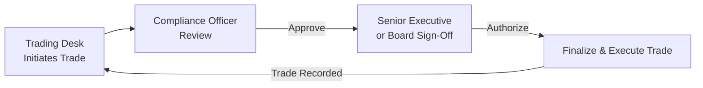

## 26.6 Multi-Layer Sign-Offs & Corporate Board Approvals

Picture this: You’re part of a large institution's treasury team, focusing on options trades that provide risk hedging and targeted strategic exposure. One morning, a colleague excitedly rushes in, proposing a big, complex trade that might yield juicy returns. It’s a cool idea—sure, the potential’s there—but is it immediately clear whether you can sign off on it yourself? In most larger organizations, the simple answer is, “Um… probably not!” Because when you’re dealing with institutional options accounts, you almost always have to navigate multiple levels of internal approval. Let’s unpack why these multi-layer sign-offs matter, how boards get involved, and the best ways to implement these sign-offs effectively.

### Why Multi-Layer Sign-Offs Exist

Multi-layer sign-offs are essentially checks and balances built into an institution’s governance structure. They serve as guardrails so that no single person—whether a trading desk wizard or an energetic up-and-comer—can unilaterally risk a large chunk of the firm’s capital without others reviewing it. This approach helps:

• Reduce the likelihood of unauthorized trades.  
• Ensure compliance with corporate governance standards and risk policies.  
• Align each trade with the institution’s overall strategy.

It sounds a bit bureaucratic, right? Maybe. But in the grand scheme, it’s an invaluable layer of protection, especially when an institution deals with options, swaps, or other derivatives that can magnify returns—but also magnify losses if misapplied.  

### The Typical Structure of Multiple Sign-Offs

When we talk about multiple sign-offs, we’re typically referring to a scenario where a trade is proposed by the trading desk or relationship manager, then it’s reviewed by compliance or risk officers, and—if it’s above certain thresholds—ultimately green-lit by senior executives or even the board of directors.  

Below is a high-level flowchart showing how a multi-layer approval might look in many institutions:

In the above process:  
• The Trading Desk (point A) sets the trade in motion.  
• The Compliance Officer (point B) checks for alignment with internal policy, CIRO regulations, or other relevant frameworks.  
• A Senior Executive or even the Board (point C) might step in for big or unusual trades.  
• Once authorized, the trade is placed (point D), recorded in the firm’s internal ledgers, and then the feedback loop closes as the desk updates risk reports.

### Corporate Board Approvals: When Are They Needed?

Not all trades require the board of directors to sign off, of course; that might be paralyzing for daily operations. But for higher-risk transactions—a large, long-dated commodity option or a complex structure with multiple embedded derivatives—boards often demand final authority. Think about a scenario where the notional size of a derivatives strategy dwarfs the firm’s typical daily volume. In that case, the board (or a designated subcommittee such as a risk committee) may want to see details like:

• Projected stress-test results.  
• Alignment with stated risk appetite.  
• Market volatility analysis.  
• Liquidity constraints.  
• Contingency plans if market conditions rapidly deteriorate.  

#### Real-Life Example

I once worked with a pension fund that was looking to hedge inflation risk using swaption structures. Let me tell you, it wasn’t a “click and done” type of transaction. It involved multiple calls with the plan’s internal advisors, an external counsel to interpret legal ramifications, and finally a board subcommittee session to ensure everything fit with the fund’s long-term obligations to retirees. That’s the power and importance of a well-defined chain of approvals.

### Regulatory and Governance Backdrop in Canada

In the Canadian context, the governance environment for derivatives (including listed options) is influenced by various regulatory bodies:

• CIRO (Canadian Investment Regulatory Organization), which is the new self-regulatory organization for investment dealers and marketplace integrity.  
• The CSA (Canadian Securities Administrators), an umbrella group for securities regulators in Canada’s provinces and territories, offering guidance on derivatives regulation.  
• OSFI (Office of the Superintendent of Financial Institutions), which sets prudential guidelines for federally regulated financial institutions (e.g., banks, insurance companies).  

Many of these bodies place a strong emphasis on internal controls, risk oversight, and responsibility at the board or senior executive level. For instance, OSFI guidelines call for robust risk management frameworks that outline exactly who signs off on trades. If your institution is large enough to be subject to OSFI oversight, failing to have multi-layer sign-offs for material derivative transactions could prompt regulatory scrutiny—or worse, your board might question your entire risk management approach.

### Understanding Risk Appetite and Thresholds

“Risk Appetite” is a popular phrase in every enterprise risk management conversation. It basically sets out how much uncertainty (read: potential for loss) your institution is willing to take on in pursuit of its objectives. One department might have a tiny risk appetite for interest rate fluctuations, so they’ll only pursue minimal, short-term hedging instruments with standard features. Another area might be a bit bolder, aiming to generate alpha with longer-term option plays.  

How do sign-off levels tie into the risk appetite? They usually revolve around thresholds. For instance, you might see:

• Low- to Medium-Risk Trades: Single-layer or double-layer sign-off. Maybe just the trading desk manager and a compliance officer.  
• High-Risk or Complex Trades: Additional reviews by the Head of Risk or CFO.  
• Exceedingly Large or Strategically Significant Trades: Board or Board Subcommittee approval.  

### Minimizing Unauthorized Trading

Unauthorized trading is more common than you’d believe. It often involves situations where a trader takes a position outside the permitted scope, hoping that profits will offset any rule-bending. But if something goes wrong, the losses can escalate beyond control. Multi-layer sign-offs make it a lot harder for that chaos to unfold because each trade has to pass through multiple eyes—and each sign-off body has the authority (and responsibility) to block the trade if it rings any alarm bells.  

### Documentation and Audit Trails

Maintaining an audit trail is crucial. You shouldn’t simply rely on verbal approvals in a hallway conversation. A robust institutional framework demands written (or digital) confirmation through official channels, outlining:

• Who proposed the trade and when.  
• Who approved or rejected it, and on what date.  
• Specific conditions attached to the approval (e.g., no more than X notional or must be unwound if the position moves by Y% in the negative).  

In my experience, institutions might use specialized software that logs transactions alongside a matrix of sign-off approvals. Others keep a more manual approach—spreadsheets, email chains—but the key is consistency and clarity so that an external auditor (or the board itself) can reconstruct the trade’s entire decision-making journey.

### Role of Dealers: Verifying Final Approval Authority

Dealers (brokerage firms or investment banks that execute trades on behalf of institutional clients) can often find themselves in hot water if they fail to confirm the legitimacy of trade orders. Under CIRO guidelines, a dealer should verify that the person placing the trade has the institutional authority to do so. This might involve:

• Checking the client’s authorized trading personnel list filed with the dealer.  
• Confirming that large trades meet the internal sign-off thresholds.  
• Keeping records of each step, especially for derivatives with a high notional value or extended duration.  

Dealers who ignore or cut corners on verifying authority could face compliance breaches, reputational damage, or litigation if the trades turn out to be unauthorized.

### The Board Approval Process in Detail

When we say a transaction “goes to the board,” that can sound either nerve-racking or comforting, depending on your perspective. But how exactly does that process unfold? Typically, you’ll find these milestones:

• Pre-Board Briefing: The finance or treasury team sets up a memo or presentation with bullet points on the transaction’s purpose, risk scenario analyses, reference to the institution’s risk appetite statement, and alignment with strategic goals.  
• Board (or Subcommittee) Meeting: The board or a designated subcommittee, such as a risk or audit committee, reviews the proposed transaction. They might ask for additional stress testing or scenario analysis.  
• Resolution or Formal Approval: If the trade is green-lighted, the board issues a resolution or minuted approval.  
• Execution Window: The institution proceeds to execute the trade, typically within a specified time window to mitigate changes in market conditions or assumptions.  

This process matters not just for regulatory compliance but also for the comfort level of the board members who want to make sure the institution isn’t stepping into an area of excessive volatility or poorly understood risks.

### Importance of Harmonizing Internal Policies

If your institution has multiple subsidiaries—maybe a Canadian entity, a U.S. arm, and a separate European presence—each branch might have its own sign-off policies influenced by local regulators or business practices. It’s best to harmonize these policies where feasible so you can have a consolidated approach. In Canada, many groups also look to best practices recommended by ISDA (International Swaps and Derivatives Association), which provides frameworks for internal controls, risk management, and even standard contractual language through ISDA Master Agreements.  

### Key Elements of a Robust Multi-Layer Sign-Off Policy

• Clear Delegation of Authority: Everyone in your institution should know exactly where their approval limits stand.  
• Defined Escalation Criteria: Is it the trade size, the complexity, or the product type that triggers an escalation to the board? Be explicit.  
• Documentation Standards: Outline which forms, logs, or systems must be used to record each level of sign-off.  
• Periodic Reviews: As market conditions shift, the risk appetite might change. So it’s wise to revisit sign-off policies at least annually—maybe more often if the company’s operational environment or regulatory framework changes.  
• Training and Awareness: Yes, your staff members need training on these sign-off protocols. You can’t assume new employees or cross-department transfers automatically understand them.

### Potential Pitfalls and How to Avoid Them

• Overly Rigid Structures: If every tiny options trade requires the board’s signature, the trading desk will be paralyzed. Consider flexible thresholds that match your institution’s scale.  
• Insufficient Oversight at the Senior Level: On the flip side, having no involvement from senior management or the board on large or exotic derivatives is a recipe for disaster.  
• Misaligned Risk Tolerances: Sometimes the front office is more aggressive than the board, or vice versa. Regular communication about risk appetite can help keep everyone on the same page.  
• Lack of Transparency in Roles: If it’s unclear who has final say, decisions can be delayed or made without proper oversight.  
• Incomplete Documentation: Always keep thorough and standardized records. This step is your best friend if there’s ever an internal investigation or external audit.

### Practical Example: Hedging a Canadian Equity Portfolio

Suppose an institutional investor wants to purchase protective puts on the S&P/TSX 60 Index to hedge a $500 million equity portfolio. This is a straightforward strategy, but it could be quite large in absolute dollar value. The scenario might trigger your firm’s multi-layer sign-off if:

• The notional value of the options surpasses the desk’s daily trading limit.  
• The cost of the puts is outside your typical budget for risk management.  
• The maturity of these options extends well beyond a typical hedge horizon, thus introducing long-dated optionality concerns.

In such a situation, the portfolio manager might propose the trade to the compliance team, which checks if it aligns with established hedging policy. If the cost threshold is high, the CFO or Treasurer might need to sign off, and if the hedge significantly alters the firm’s risk profile, the board’s risk committee might be looped in. Once all sign-offs are collected, the trade is placed—hopefully with a thorough resting of everyone’s minds.

### Connecting Multi-Layer Sign-Offs to Broader ERM Frameworks

Enterprise Risk Management (ERM) is a holistic approach to understanding and addressing risks across an organization. In the book “Enterprise Risk Management: From Incentives to Controls” by John Lam, the concept of building a robust internal governance structure is emphasized: you want internal controls that capture potential vulnerabilities before they become existential threats. Multi-layer sign-offs for derivatives fit squarely into this philosophy, ensuring that derivative usage does not override the broader risk culture or strategic direction of your institution.

### Additional Resources and References

• CIRO (Canadian Investment Regulatory Organization): Visit https://www.ciro.ca for the latest rules on dealer requirements and compliance guidelines.  
• OSFI Guidelines: Especially relevant for federally regulated financial institutions. See OSFI’s website for risk management frameworks.  
• CSA Staff Notices: Provincial regulators often publish staff notices guiding best practices in derivatives oversight.  
• ISDA Materials: Check ISDA’s official website for standardized documentation and best practices on derivatives risk management.  
• John Lam, “Enterprise Risk Management: From Incentives to Controls”: A comprehensive text on how businesses can design robust frameworks for risk oversight.

### Wrapping Up with a Personal Note

Growing up, I never imagined I’d find “multi-layer sign-offs” exciting. But the first time I saw how a thorough sign-off policy saved a company from a potentially catastrophic trade, it clicked: strong governance can literally be the lifeboat preventing your organization from sinking in a storm. Maybe it does add layers of bureaucracy, but in my opinion, the safety net is well worth it.  

Remember, multi-layer sign-offs and board approvals aren’t about slowing you down; they’re about ensuring that your institution maintains a reputable, efficient, and safe approach to derivatives. By incorporating clear policies, well-defined thresholds, and robust documentation, everyone up and down the chain—traders, compliance, senior executives, and the board—can go to sleep at night, comfortable in the knowledge that the firm’s risks remain under control.

## Sample Exam Questions: Multi-Layer Sign-Offs and Board Approvals in Derivatives Trading



### Which of the following best describes the primary purpose of multi-layer sign-offs within an institution?

- [x] Ensuring multiple levels of internal checks to mitigate unauthorized trades and align with risk appetite.  
- [ ] Speeding up trade execution on large derivatives orders.  
- [ ] Eliminating compliance officers from the approval chain.  
- [ ] Increasing regulatory oversight by having more external mandates.  

> **Explanation:** Multi-layer sign-offs serve as checks and balances, preventing any single individual from unilaterally committing the firm to potentially risky trades.

### In what situation might a corporate board typically get involved in the derivatives approval process?

- [ ] For all trades, regardless of notional size.  
- [x] For high-value, complex, or long-duration derivatives that significantly exceed normal risk thresholds.  
- [ ] Only for intraday trades that risk immediate capital drain.  
- [ ] When dealing with derivatives that carry zero market risk.  

> **Explanation:** Corporate boards usually intervene for large, strategically significant, or complex trades, reflecting the need for top-level governance.

### Why is it important for dealers to verify final approval authority before executing a derivatives trade?

- [x] To prevent compliance breaches related to unauthorized transactions.  
- [ ] To ensure the trade is executed at the best bid-ask spread.  
- [ ] To shift all responsibility to the trading desk.  
- [ ] To reduce counterparty credit risk.  

> **Explanation:** Dealers face regulatory and reputational risks if they process trades beyond a client’s approved authority, so they must confirm sign-offs.

### Which of the following would NOT typically be part of a well-structured multi-layer sign-off process?

- [ ] A clear audit trail documenting who approved the trade.  
- [ ] Defined risk thresholds that dictate the level of approval needed.  
- [x] A single email approving all trades for a full fiscal year without review.  
- [ ] Periodic reassessment of the institution’s risk appetite.  

> **Explanation:** A “blanket approval” for an entire fiscal year is contrary to all best practices, as it lacks the control and specificity required in derivatives governance.

### When integrating multi-layer sign-offs with an institution’s overall risk management, what factor typically triggers escalation to a higher approval level?

- [ ] The personal preference of the risk manager.  
- [ ] The current interest rate environment.  
- [x] Exceeding a predefined trade size or complexity threshold.  
- [ ] The organizational chart location of the trader proposing the deal.  

> **Explanation:** Predetermined thresholds for size, complexity, or unusual risk exposures are standard triggers for escalating to higher approval levels.

### A proper board approval process for a large derivatives trade generally includes:

- [x] A briefing memo, a board meeting or subcommittee review, and a formal resolution.  
- [ ] Automatic acceptance of the trade without discussion.  
- [ ] Approval from junior staff without board knowledge.  
- [ ] Elimination of compliance oversight to speed up decision-making.  

> **Explanation:** Informing the board through official memos, meetings, and documented resolutions is standard procedure for trades of significant size or complexity.

### Which statement best reflects the alignment between multi-layer sign-offs and internal enterprise risk management (ERM)?

- [x] Multi-layer sign-offs are a practical tool within ERM to ensure alignment of derivatives usage with the firm’s overarching risk strategy.  
- [ ] ERM frameworks and multi-layer sign-offs exist independently of each other and do not overlap in any real sense.  
- [ ] ERM focuses solely on operational risks, so it has no concern with derivatives sign-offs.  
- [ ] Sign-off processes are automatically part of all ERM frameworks mandated by global banks.  

> **Explanation:** Multi-layer sign-offs are key to implementing ERM principles, ensuring that derivative activities match the firm’s defined risk appetite.

### What is one possible pitfall if an institution’s layer-approval process is excessively rigid?

- [x] Slower responsiveness to market conditions and potential missed opportunities.  
- [ ] Greater certainty that all trades are risk-free.  
- [ ] Elimination of the board’s oversight duties altogether.  
- [ ] Guarantee that all complex trades are instantly approved.  

> **Explanation:** While controls are necessary, being overly rigid can hamper the ability to act quickly on legitimate opportunities, potentially leading to lost value.

### Which regulatory authority in Canada might scrutinize an institution’s internal controls and approval processes for derivatives?

- [x] CIRO (Canadian Investment Regulatory Organization).  
- [ ] The defunct MFDA.  
- [ ] The retired IIROC.  
- [ ] The WHO.  

> **Explanation:** CIRO is the current national self-regulatory organization in Canada overseeing investment dealers and marketplace integrity, including derivatives oversight.

### True or False: Maintaining thorough documentation of each sign-off step helps an institution avoid surprises during external audits or regulatory reviews.

- [x] True  
- [ ] False  

> **Explanation:** A transparent audit trail is essential to confirm each participant’s approval and show the rationale behind every large derivatives transaction.


