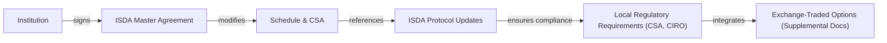

## 26.7 Additional Documentation (ISDA Protocol for Institutions)

Have you ever gone to sign a contract and felt that wave of worry that you might be missing a key detail? It’s a bit like signing an apartment lease for the first time: your head spins with clauses, conditions, and the dreaded fine print. Well, the same can happen in the world of derivatives, only the stakes are usually much higher. In institutional options trading, the International Swaps and Derivatives Association (ISDA) Master Agreement is the go-to legal framework to keep everything buttoned up. So let’s talk about that moment when you realize, “Wow, I should really understand what I’m signing,” and dig into the essential aspects of ISDA documentation for institutions.

ISDA Master Agreement and Its Relevance  
The ISDA Master Agreement is pretty much the gold standard for governing over-the-counter (OTC) derivatives. Created by the International Swaps and Derivatives Association, this contract structure covers everything from risk management to how we handle potential defaults. Think of it as your one-stop shop for all transaction terms, netting provisions, and definitions, so you don’t have to rewrite the wheel each time you trade a new OTC derivative. In Canada, large institutions—pension funds, insurance companies, and so on—often rely on this master agreement not only for their swaps or forward contracts but may also reference it when dealing with exchange-traded derivatives, like listed options, to keep documentation consistent.

The Role of the Schedule and the Credit Support Annex (CSA)  
If the ISDA Master Agreement is the framework, the Schedule modifies that framework to suit the parties’ specific needs. It’s a bit like adding special paint colors and wallpapers to your brand-new house: the structure (i.e., the Master Agreement) remains consistent, but the Schedule customizes it. Among the crucial add-ons is the Credit Support Annex (CSA). Why? Because the CSA spells out exactly how collateral is managed between you (the institution) and your counterparty. It answers questions about how margin calls work, which assets can be posted as collateral, and what triggers a margin call. A well-structured CSA can reduce credit risk dramatically, so paying close attention here is essential.

Incorporating Exchange-Traded Options under ISDA  
Institutions don’t just limit themselves to OTC trades. They often also participate in the listed options market on recognized derivatives exchanges. So, you might wonder: “If my listed trades are already governed by exchange rules—do I even need the ISDA for that?” Often, the answer is yes. The Master Agreement can incorporate references to exchange-traded options to ensure that the same protocols for settlement, margin, default events, and so on apply uniformly across all your derivative transactions. This helps minimize confusion if a default or an operational hiccup arises. That said, many clearinghouses and self-regulatory organizations like CIRO (the Canadian Investment Regulatory Organization) do require separate forms or streamlined documentation for exchange-traded options. But large institutions typically like the synergy of having everything in one legal framework for clarity.

ISDA Protocols and Why They Matter  
Market regulations and best practices never stand still—they evolve, kind of like the smartphone you upgrade every year (or two). This is where ISDA Protocols come in. Protocols are standard amendments or supplements that automatically update your existing Master Agreement language to keep pace with rule changes or new market realities. For instance, we saw protocols dealing with new clearing mandates under National Instrument 94-101 (Mandatory Central Counterparty Clearing of Derivatives) or fallback provisions for benchmark transitions (like the shift from LIBOR to risk-free rates). Rather than drafting an entirely new agreement from scratch, you can “sign on” to the relevant protocol and update the necessary sections quickly and uniformly. If you’re an institution trading on multiple desks with multiple dealers, that keeps things streamlined—no messy renegotiations in each relationship.

Key Fallback Provisions for Benchmark Transitions  
You’ve probably noticed all the buzz around benchmark changes in the Canadian market—CDOR is phasing out, and CORRA (Canadian Overnight Repo Rate Average) is stepping in as a replacement. Protocols typically include fallback language describing what happens if your reference rate disappears. For instance, if you’re using the ISDA Master Agreement to govern interest rate derivatives, you need to specify how the new rate is calculated and how the economics of your trades remain as close as possible to the original deal. Without robust fallback provisions, you might find yourself locked in frantic negotiations if your reference rate unexpectedly vanishes.

Local Legal Requirements and Enforceability  
Here in Canada, we have a mosaic of legal frameworks. Certain provinces follow common law, others like Québec rely on the Civil Code, and together they all must comply with federal regulations and guidelines from the CSA (Canadian Securities Administrators). If your institution is in Québec, for example, you might need to ensure that your ISDA’s netting provisions and default clauses align with Québec’s civil law. The good news is that the standard ISDA Master Agreement has become widely recognized in Canadian courts. Of course, it’s still wise to consult your legal counsel to confirm that your ISDA meets the statutory definitions, local rules, and any specialized clearing requirements.  

Canadian Clearing Requirements  
For many types of derivatives, Canadian regulators require central clearing. This is spelled out in documents like National Instrument 94-101. Central clearing introduces a clearinghouse that sits in the middle—acting as the buyer to every seller and the seller to every buyer. Although it might sound like more bureaucracy, it can significantly reduce counterparty risk. The key: verifying that your Master Agreement (and any relevant protocols) align with the clearing mandates. In some cases, your trades must funnel through a recognized clearing agency, or you might have to submit additional risk data to comply with mandatory reporting. This is where the ISDA Protocols come to the rescue again, ensuring your agreement automatically changes if new clearing obligations appear.

Default Management and Termination Events  
Events of default (EODs) and termination events can be complicated—nobody likes to dwell on the possibility of a breakdown in the relationship, but it’s essential to plan for it. Under the Master Agreement, EOD definitions typically include events like failure to pay, breach of agreement, bankruptcy, and other specific triggers. The CSA spells out how collateral is handled when an event of default occurs. Meanwhile, the ISDA Schedule might define additional triggers. For exchange-traded options, the default procedures might fall back on exchange rules or clearinghouse procedures—especially if the institution’s margin is maintained by the clearing broker. Ensuring you have an integrated approach helps avoid contradictory or overlapping provisions, which can lead to messy legal disputes.

Practical Tools and References  
You might be curious: “Where do we find these protocols, or see sample wording?” ISDA hosts an entire protocol library on their website (https://www.isda.org/protocols). You’ll also find open-source libraries, such as some Python-based tools for interest rate derivatives (e.g., QuantLib on GitHub), that help you model the impacts of fallback changes. To keep up with Canadian-specific regulations, watch for notices from the CSA (Canadian Securities Administrators) and from CIRO (https://www.ciro.ca). CSA Staff Notices can guide you on new clearing mandates, reporting requirements, and best practices. 

Case Study: Benchmark Transition Under the ISDA 2020 IBOR Fallbacks Protocol  
Imagine you’re the manager of an institutional portfolio containing Canadian dollar interest rate swaps pegged to CDOR. The regulators announce that CDOR is slated for cessation, and your deals are set to mature well after the discontinuation date. Suddenly, you might worry about “What rate do we pay or receive if CDOR stops being published?” By adhering to the ISDA 2020 IBOR Fallbacks Protocol, your Master Agreement automatically updates to incorporate fallback language referencing CORRA plus a spread adjustment. This ensures continuity. So, you won’t need frantic phone calls with each counterparty. The updated language is standardized across the industry. That’s the beauty of the protocol approach: consistent, universal changes that reduce the risk of disputes.

Diagram: ISDA Documentation Overview for an Institution

In this diagram, you can see how an institution typically signs the ISDA Master Agreement, customizes it with the Schedule and CSA, and remains up to date with market changes or legal amendments through ISDA Protocols. That central structure then interacts with local Canadian regulatory demands—like mandatory clearing or fallback provisions—and can connect to supplemental exchange-traded documentation.

Best Practices for Institutional Documentation  
• Use the CSA: Always define margin requirements explicitly in the CSA. Minimizing credit exposure is vital for big players with large trading volumes.  
• Stay Current with Protocols: Regularly check for new protocols to ensure your documentation is aligned with the latest regs—fallback, clearing, or otherwise.  
• Coordinate with Clearing: If mandatory clearing applies to your product, confirm everything lines up between your clearing agreements and your Master Agreement.  
• Consult Legal: Don’t assume the “standard” approach is always best. Local law or your institution’s risk tolerances might require customizations.  
• Keep Good Records: Effective recordkeeping helps demonstrate to CIRO that your compliance is airtight and your risk management is robust.

A Personal Note on Negotiations  
I’ll confess: the first time I tried to negotiate an ISDA Master Agreement, I felt overwhelmed. The document was a few hundred pages long, chock-full of cross-references. But with each iteration, I realized that the complexity was actually my friend. Every single clause was designed to anticipate problems before they arise. By clarifying credit support terms and fallback provisions, you reduce surprises later. Once you’ve done it a few times, you see the big picture: the ISDA Master Agreement is a safety net for both parties.

Conclusion  
Setting up and maintaining an institutional options account is no small task. Whether you’re dealing with an exchange-traded environment or plunging into custom OTC derivatives, ensuring all your documentation is consistent and legally enforceable is critical. In Canada, combining the ISDA Master Agreement (with the relevant Schedules, CSAs, and Protocols) plus local clearing and reporting mandates can feel like a puzzle. But once those pieces are in place, you get a framework that’s both robust and flexible. As the market changes—new fallback provisions, changes to clearing rules, or amendments to local securities regulation—ISDA Protocols have your back. It’s a living, breathing document ecosystem that supports institutions in managing risk.

Keep your eye on regulatory updates, use official resources like the CSA Staff Notices, consult with CIRO for new guidelines, and check ISDA’s protocol library periodically. This way, your documentation will stay fresh and relevant in an ever-shifting market landscape. And who knows? You might actually come to appreciate those thick, intimidating contract binders in the end.

---

## Sample Exam Questions: Additional Documentation (ISDA Protocol for Institutions)



### Under which primary legal framework are OTC derivatives transactions typically governed?

- [x] The ISDA Master Agreement  
- [ ] The Bourse de Montréal Rulebook  
- [ ] The CIRO Operations Manual  
- [ ] A standard futures contract specification  

> **Explanation:** The ISDA Master Agreement is the standard legal framework that governs OTC derivatives, setting out terms and conditions that apply across individual transactions.  

### Which part of the ISDA Master Agreement outlines the specific collateral arrangements for an institution?

- [ ] The Schedule to the Master Agreement  
- [x] The Credit Support Annex (CSA)  
- [ ] A fallback annex  
- [ ] The Confirmations  

> **Explanation:** The Credit Support Annex (CSA) is an addendum that addresses collateral requirements, margin management, and other credit support measures.  

### When regulators introduce new clearing mandates in Canada, how can institutions most efficiently update their ISDA-based documentation?

- [x] By adhering to or signing on to the relevant ISDA Protocol  
- [ ] By negotiating entirely new master agreements each time  
- [ ] By relying solely on CIRO’s instructions  
- [ ] By filing a request with the Canadian Securities Administrators  

> **Explanation:** ISDA Protocols are designed to provide a standardized, efficient means of updating documentation in response to evolving regulations and market practices.  

### Why might an institutional user incorporate exchange-traded options language into their ISDA Master Agreement?

- [x] To maintain consistency across both OTC and listed derivatives transactions  
- [ ] To avoid posting collateral on listed options trades  
- [ ] To supersede local exchange rules on settlement  
- [ ] To eliminate the need for separate margin requirements  

> **Explanation:** Institutions often embed references to exchange-traded options within the ISDA Master Agreement for consistent treatment of settlement procedures, defaults, and margin across all derivatives.  

### Which of the following statements about fallback provisions is correct?

- [x] They specify how contracts will be recalculated if a reference rate ceases  
- [ ] They are only applicable if both parties sign new confirmations  
- [ ] They have been eliminated by CIRO regulations  
- [ ] They are primarily relevant for equity options  

> **Explanation:** Fallback provisions are critical in interest rate, credit, or other reference-based derivatives. They define how the contract continues if a reference benchmark becomes unavailable.  

### Which entity is responsible for creating most standard industry protocols to handle regulatory updates in the derivatives market?

- [x] International Swaps and Derivatives Association (ISDA)  
- [ ] Canadian Securities Administrators (CSA)  
- [ ] Canadian Investment Regulatory Organization (CIRO)  
- [ ] The Bank of Canada  

> **Explanation:** ISDA creates most industry protocols, streamlining how market participants update their documentation in response to market or regulatory changes.  

### In the context of the ISDA Master Agreement, what is the primary function of the Schedule?

- [x] To customize Master Agreement provisions for specific counterparty needs  
- [ ] To define credit support arrangements and eligible collateral  
- [ ] To provide fallback language for reference rate discontinuation  
- [ ] To enumerate local clearinghouse rules  

> **Explanation:** The Schedule tailors the ISDA Master Agreement with additional or modified terms that reflect the unique relationship between two counterparties.  

### What is one key reason Canadian institutions must confirm the enforceability of netting provisions?

- [x] Provincial legal systems can differ, and Québec relies on Civil Code  
- [ ] Netting is disallowed under National Instrument 94-101  
- [ ] CIRO fully guarantees netting agreements without documentation  
- [ ] Federal law supersedes all netting provisions  

> **Explanation:** Different legal frameworks in Canada (especially the Québec Civil Code) can affect how netting clauses are interpreted and enforced, so institutions must ensure compliance.  

### Which document primarily sets out the terms for margin requirements, default triggers, and other credit risk measures in an OTC derivatives relationship?

- [ ] Core Terms Annex  
- [ ] Market Data Annex  
- [x] Credit Support Annex (CSA)  
- [ ] Underlying Master Agreement  

> **Explanation:** The CSA details how and when margin is posted, the assets acceptable as collateral, and how credit risk is managed if an event of default occurs.  

### True or False: The ISDA Master Agreement may be modified by protocols to reflect regulatory changes without requiring a complete rewrite of each section.

- [x] True  
- [ ] False  

> **Explanation:** ISDA Protocols enable standardized amendments to the Master Agreement so counterparties don’t have to renegotiate every contract in response to regulatory or market changes.  


