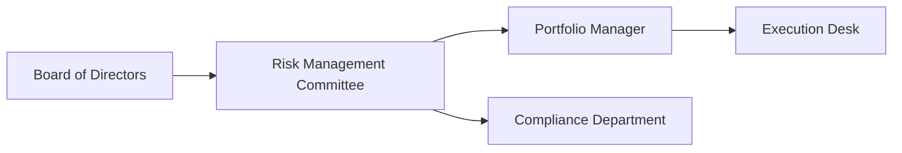

## 26.8 Asset Managers and Pension Plans: Derivatives Governance

Sometimes I think back to my first experience working with a mid-sized pension fund—it was eye-opening to see just how deeply they relied on derivatives to reduce market risk and ensure they could meet their long-term obligations. At first, I was honestly a bit overwhelmed by all the committees, policies, and official approvals required. But you know what? Over time, I realized that this robust process is crucial: it’s what keeps these large institutions responsible, transparent, and aligned with their core mission.

In this section, we’ll explore why derivatives matter so much to asset managers and pension plans. We’ll dig into the governance structures that keep these big organizations functioning, the approval processes and risk controls needed, and how compliance with Canadian regulations—especially CAPSA (Canadian Association of Pension Supervisory Authorities) and CIRO (Canadian Investment Regulatory Organization)—shapes the day-to-day approach to derivatives. By the end, you’ll (hopefully!) feel more confident about how to ensure proper derivatives governance when opening or maintaining institutional options accounts.

---

### Why Derivatives Are Used by Asset Managers and Pension Plans

Asset managers—managing large pools of capital for clients—and pension plans—tasked with safeguarding the future income of plan beneficiaries—routinely use derivatives like futures, forwards, swaps, and options. Here are some primary reasons why:

• Long-Term Liability Management: Pension plans are particularly focused on matching or hedging their liabilities, which can be decades down the road. Think about individuals retiring at 65 and living well into their 80s or 90s. A plan may hold interest rate derivatives to immunize or partially hedge the risk of interest rate fluctuations that affect the value of the plan’s fixed income portfolio and, consequently, the plan’s ability to meet its liabilities.

• Risk Mitigation: Asset managers often use equity index puts, currency forwards, or interest rate options to reduce or transfer downside risks. Rather than selling off positions during volatile times, they might strategically use derivatives for protection or to lock in certain portfolio characteristics.

• Portfolio Efficiency: Sometimes it’s cheaper or faster to gain or reduce exposure using derivatives than by buying or selling the underlying securities. Futures or index-based options can be used to adjust portfolio allocations quickly, reducing operational friction.

• Tactical Opportunities: Larger plans may do more than strictly hedge. They sometimes use options to enhance returns (like writing covered calls to earn premium income) or to gain exposure to a new market quickly.

---

### Governance Structures and Committees

Let’s just say these organizations don’t usually wing it. Asset managers and pension plans tend to have layered governance frameworks ensuring prudent oversight. A typical governance structure might look like this:

• Board of Directors: Sets the overall mission, risk appetite, and high-level objectives. For a pension plan, it might be a Board of Trustees that has a fiduciary duty to plan members.  
• Risk Management Committee: Oversees the organizational risk profile, including how derivatives exposures align with the investment policy statement (IPS).  
• Portfolio Manager: Responsible for tactical and strategic decisions within the mandates laid out by the IPS.  
• Execution Desk: Takes the instructions from the portfolio manager, executes trades on exchanges or through approved counterparties, and ensures that trade documentation is accurate.  
• Compliance Department: Monitors transactions and ensures the portfolio adheres to relevant regulations, guidelines such as CAPSA for pension plans, and internal governance rules.

This structure is designed to provide checks and balances. For instance, the portfolio manager can’t just do whatever they want—the risk committee will be on top of it, and compliance is always looking out for breaches in policy or regulatory missteps. In many Canadian pension plans, there’s also a dedicated “Investment Committee” or a subcommittee focusing specifically on derivatives oversight.

---

### Role of the Investment Policy Statement (IPS)

At the heart of any Canadian pension plan or large-scale asset manager is the Investment Policy Statement (IPS). If you’ve never seen one, the IPS is essentially the strategic blueprint that outlines how the portfolio is managed:

• Mandate and Objectives: For a pension plan, the primary objective might be ensuring there are enough assets to meet future pension obligations, taking into account acceptable levels of risk.  
• Asset Allocation Guidelines: The IPS specifies target allocations—e.g., 40% fixed income, 40% equities, 20% alternative investments—and permissible ranges around those targets.  
• Derivatives Usage: Here’s where it gets interesting. The IPS should explicitly note whether derivatives are allowed, under what purposes (hedging, return enhancement), and the frameworks for measuring and managing derivatives-related risks. Many IPS documents also detail maximum notional exposure or guidelines for writing uncovered options.  
• Approval and Compliance Processes: The IPS often references committees and steps for derivatives authorization.  

When opening an institutional options account, the dealer must confirm that the IPS permits the proposed derivatives strategies. This ensures that the plan or asset manager isn’t violating its own rules—or the regulations.

---

### Complying with CAPSA: Canadian Pension Plans and Derivatives Rules

Pension plans in Canada operate under a web of federal and provincial pension legislation, but one consistent thread is the guidance from the Canadian Association of Pension Supervisory Authorities (CAPSA). If you manage a pension plan, or you’re supporting one, CAPSA guidelines are pretty critical.

In a nutshell, CAPSA wants plans to use derivatives prudently. That means:

• Documented Policies: There should be a clear policy on the roles, responsibilities, and controls involved in using derivatives.  
• Risk Identification and Measurement: The plan must be able to identify the types of risks a derivative introduces (market risk, counterparty risk, liquidity risk, etc.) and measure them in a consistent way.  
• Reporting and Transparency: CAPSA expects that use of derivatives is regularly reviewed and disclosed to the relevant stakeholders. This often means plan members or trustees should have a line of sight into how derivatives could impact plan solvency.  

For more direct references to the latest guidelines, you can pop over to [CAPSA’s official site](https://www.capsa-acor.org).

---

### Steps to Opening an Institutional Options Account

So, let’s say you’re a dealer or advisor trying to get an institutional client set up with an options account. Here’s a broad outline of the steps:

1. Review the Client’s IPS: Confirm the derivatives strategies they intend to use are indeed permitted. Check any mention of covered calls, index put options, or currency hedging.  
2. Verify Corporate/Pension Documentation: Collect the relevant corporate documents, trustee resolutions, or pension plan governance documents. For example, you’ll want proof that the individuals signing off on the account truly have the authority to do so.  
3. Complete the CIRO Dealer Documentation: Post-amalgamation, the new self-regulatory organization is CIRO (since 2023). Make sure your forms, disclosures, risk statements, and know-your-client (KYC) details are up to date.  
4. Assess Risk Tolerance and Appropriateness: Even large pension plans have risk boundaries. The dealer must ascertain if the client truly grasps the complexities—like margin calls for short options or the potential for unlimited losses in certain strategies.  
5. Obtain Approvals from Internal Committees: The client (i.e., the asset manager or pension plan) will likely need sign-off from their internal committees. Don’t be surprised if new derivative strategies require a nod from the Risk Committee, the CFO, or even the Board.  
6. Set Up Reporting Mechanisms: Because institutional accounts can generate large or frequent trades, dealers often set up real-time or near real-time reporting feeds. This ensures compliance and helps with internal oversight.  
7. Ongoing Review and Compliance: Opening the account is just the first step. Maintaining compliance means ongoing scenario analyses, margin checks, beneficial ownership updates, and more.

---

### Risk Management, Scenario Analysis, and Stress Testing

We often talk about “scenario analysis” and “stress testing,” but what do those terms really mean in practice?

• Scenario Analysis: The institution simulates different market conditions—like a sudden interest rate hike or an equity market downturn—and measures how the derivatives positions would affect the portfolio. For example, if a pension plan is short put spreads on an equity index, scenario analysis shows potential losses in a market crash.  
• Stress Testing: This is like scenario analysis on steroids—extreme events well beyond normal market moves. What if interest rates spiked 500 basis points in a short period? Or if currency markets gapped overnight? Stress tests help highlight tail risks.  

These analyses ensure that the institution’s derivatives strategy does not put it at undue risk relative to its capital or obligations. They’re also a core requirement under many regulatory frameworks, including the guidelines set out by CAPSA for pension plans.

---

### The Importance of Beneficial Ownership Disclosure

Here’s a topic that sometimes gets overlooked: “beneficial ownership disclosure.” When dealing with large institutions, it can be tricky to identify who truly owns the assets—especially if you’ve got multiple feeder funds or complicated corporate structures. However, both regulators and the internal governance folks want transparency:

• Regulatory Requirements: CIRO and the CSA (Canadian Securities Administrators) push for clarity on beneficial ownership. This helps uncover potential conflicts of interest and ensures no hidden entity is controlling large positions without being recognized.  
• Internal Governance: Asset managers themselves may need to track beneficial owners to confirm compliance with guidelines, or to ensure they’re not inadvertently investing on behalf of sanctioned entities.  

If you’re setting up an institutional options account, expect the compliance vetting process to require details about the end-clients or beneficial owners, especially if the structure is complex.

---

### Real-World Examples and Case Studies

Let me share a quick anecdote: a large Canadian pension plan I worked with discovered that their use of equity index puts, combined with certain currency hedges, inadvertently created an unintended correlation risk. Scenario testing revealed that in a severe equity downturn, the currency hedge would reduce their potential gains on the foreign fixed-income side. Only by running multi-scenario simulations and consulting the investment committee did they decide to adjust the hedge ratio. The moral of the story? Even well-intentioned hedge strategies can interact in surprising ways.

Another example: an asset manager launched a new covered call strategy that was permissible under the IPS but forgot to coordinate with the compliance department. Because the calls were being written on interlisted stocks, they triggered additional position reporting requirements with the Bourse de Montréal. Failures in oversight can (and do) happen if the lines of communication aren’t solid.

---

### Best Practices and Common Pitfalls

• Ensure Ongoing Education: With so many new derivatives products in the market—like ESG-linked derivatives or more exotic equity-linked notes—it’s easy for staff to fall behind. Regular training is a must.  
• Keep an Eye on Margin Requirements: Complex strategies can lead to large margin expansions, especially in volatile markets. This is one area that can trip up even seasoned portfolio managers.  
• Document Everything: That old adage “If it’s not documented, it didn’t happen” is truer than ever. Keep a robust paper (or digital) trail of approvals, risk assessments, or changes to mandates.  
• Align with Corporate Governance: Ultimately, derivatives usage should serve the larger objective of the plan or asset manager, not the other way around.  
• Anticipate Regulatory Changes: The fact that MFDA and IIROC merged into CIRO demonstrates how quickly the regulatory landscape can shift. Keep up to date on new rules or guidelines by visiting [CIRO’s website](https://www.ciro.ca).

---

### Example Table: Potential Derivative Strategies for Pension Plans

Below is a simple table that shows a few ways pension plans might use derivatives. This is strictly illustrative, but it should give you a sense of how derivatives map to objectives:

| Strategy                     | Objective                        | Example Instrument      | Potential Risk        |
|-----------------------------|----------------------------------|-------------------------|-----------------------|
| Interest Rate Swaps         | Match/eliminate interest rate gap| Plain vanilla swap      | Counterparty risk     |
| Equity Index Put Options    | Hedge downside equity risk       | Listed put on S&P/TSX   | Premium expense       |
| Covered Call Writing        | Enhance income                   | Call options on existing equity holdings | Missed upside if exercised |
| Currency Forwards           | Hedge FX exposure                | CAD/USD forward         | Opportunity cost if currency moves favorably |

---

### Additional Resources

If you want to dive deeper, here are some recommended references:

• [CAPSA Guidelines](https://www.capsa-acor.org) – Official resource for pension supervisory authorities in Canada.  
• [CIRO](https://www.ciro.ca) – Canada’s self-regulatory organization for investment dealers and market oversight, offering risk management best practices.  
• “Portfolio Management Formulas” by L. Evensky – A useful guide for advanced portfolio construction techniques, including how to incorporate options at an institutional level.  
• Open-Source Risk Project – Provides free libraries for risk analytics that can be adapted for institutional derivatives scenario analysis.  

---

### Conclusion

Asset managers and pension plans harness options and other derivatives to fulfill a wide range of objectives—from mitigating interest rate risk on long-term liabilities to generating incremental income. But with these opportunities come important responsibilities. A robust governance framework (including an IPS, internal committees, and thorough documentation), adherence to CAPSA and CIRO guidance, and diligent oversight of beneficial ownership, scenario testing, and stress exposures are all essential.

The next time you see a news headline about a major pension plan adjusting its hedge ratio after interest rate volatility, remember there’s probably a complex slew of committees and processes behind that decision. Ultimately, that’s what governance is all about: staying prudent and accountable so that these giant institutions, entrusted with people’s retirements, remain stable and sustainable for the decades to come.

---

## Sample Exam Questions: Derivatives Governance for Asset Managers and Pension Plans



### Which document typically outlines whether a pension plan or asset manager can use derivatives?

- [ ] The prospectus
- [ ] The markets use a listing agreement
- [x] The Investment Policy Statement (IPS)
- [ ] The Articles of Incorporation

> **Explanation:** The IPS details permissible strategies, including derivatives usage, aligned with the institution’s objectives and constraints.

### Which of the following entities coordinates provincial pension regulators in Canada?

- [ ] The World Bank
- [ ] CIPF
- [ ] CIRO
- [x] CAPSA

> **Explanation:** CAPSA (Canadian Association of Pension Supervisory Authorities) is the coordinating body that provides guidelines and best practices for pension oversight in Canada.

### A pension plan is writing covered calls on a portion of its equity holdings. Which committees or departments are most likely responsible for approving or monitoring this strategy?

- [ ] Only the Execution Desk and CFO
- [x] The Risk Management Committee and Compliance Department
- [ ] Beneficial Ownership Committee alone
- [ ] None, as covered calls are always allowed automatically

> **Explanation:** In most governance structures, the Risk Management Committee and Compliance Department oversee and approve derivatives strategies.

### Scenario analysis and stress testing in the context of institutional derivatives usage are important because:

- [ ] They are required by law in every country worldwide
- [ ] They simplify beneficial ownership disclosure
- [x] They help quantify potential losses under different market conditions
- [ ] They entirely eliminate counterparty risk

> **Explanation:** Scenario analyses and stress tests simulate a range of market conditions, revealing how a derivatives portfolio might behave, which is essential for prudent risk management.

### Which of the following is NOT a common objective for a pension plan using derivatives?

- [ ] Interest rate risk reduction
- [x] Speculative day-trading aimed at large one-day gains
- [ ] Currency hedging
- [ ] Equity downside protection

> **Explanation:** Pension plans typically deploy derivatives for risk management and hedging, not for speculative day trading.

### When an asset manager uses a currency forward to hedge an overseas bond position, which risk remains even after the hedge?

- [ ] Credit risk disappears entirely
- [x] Counterparty risk if the forward’s counterparty defaults
- [ ] No risk remains since the currency forward eliminates all risk
- [ ] Unlimited downside risk on the bond

> **Explanation:** Even with a currency hedge in place, there is still the risk that the counterparty providing the forward can default or fail to fulfill the agreement.

### Under CIRO’s guidelines, which of the following steps is essential when opening an institutional options account?

- [ ] Submitting only a one-page risk disclosure statement
- [ ] Eliminating the need for a KYC process if the client is a pension fund
- [x] Verifying that the proposed strategies are allowed in the client’s IPS
- [ ] Only obtaining a signature from a single account officer

> **Explanation:** Failure to verify the client’s IPS or other guiding documents can lead to breaches of internal policy and regulatory guidelines.

### Why might a pension plan prefer to use index put options rather than simply selling equities to reduce risk?

- [x] They can maintain their portfolio positions while limiting downside
- [ ] Index puts are always cheaper than selling equities
- [ ] CIRO requires them to use only puts
- [ ] Puts generate guaranteed extra returns

> **Explanation:** Puts provide downside protection without forcing the plan to liquidate potentially valuable equity holdings, preserving long-term upside potential.

### Which best describes beneficial ownership disclosure for large institutional derivatives accounts?

- [ ] It’s never required if the client is a publicly traded company
- [ ] It only matters in foreign jurisdictions
- [ ] It’s purely optional and left to the client’s discretion
- [x] It’s a regulatory requirement to identify and disclose actual controlling parties

> **Explanation:** Regulators insist on transparency regarding beneficial ownership to prevent hidden control or potential conflicts.

### True or False: CAPSA Guidelines explicitly require pension plans to run scenario analyses for derivative exposures.

- [x] True
- [ ] False

> **Explanation:** CAPSA expects prudent, transparent derivatives usage, which includes conducting regular scenario analyses to evaluate potential portfolio risks.


