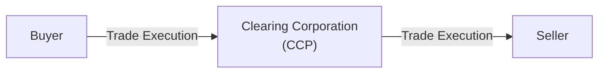
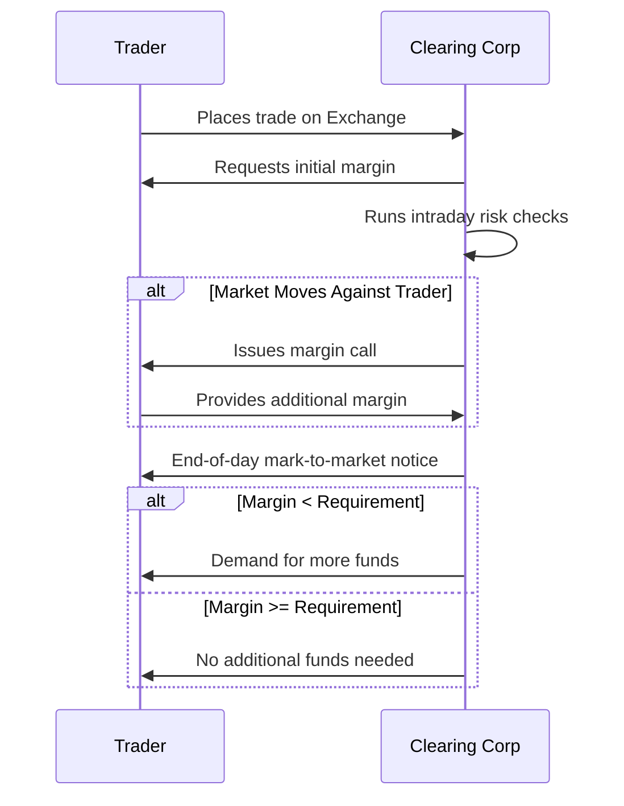

## 27.1 What Is a Clearing Corporation?

Have you ever traded something—say, baseball cards—where two of you swapped cards, but maybe you weren’t entirely sure if the other side would come through? It’s a little nerve-racking, right? Well, when we talk about big-money derivatives like listed options, we can’t rely on trust alone to make things certain. That’s where a clearing corporation swoops in like a superhero to guarantee trades, keep things fair, and manage risk. Sounds helpful, doesn’t it?

A clearing corporation is a specialized financial institution that acts as the buyer to every seller and the seller to every buyer in exchange-traded transactions (like listed options). This role is called being the central counterparty (CCP). In other words, the clearing corporation stands in between trades, guaranteeing that each party fulfills its side of the contract. People sometimes call it the “plumbing” of financial markets because it handles all the behind-the-scenes movement of collateral, settlement, and margin requirements.

Below, we’ll explore what clearing corporations do, why they’re so vital, and how they protect the stability of the market. I’ve come to see them as the quiet traffic directors of the trading ecosystem: rarely noticed by casual investors, but absolutely critical for ensuring everything flows smoothly.

---

### Why Clearing Corporations Matter

Clearing corporations exist for one big reason: risk reduction. By becoming the sole legal counterparty for both the buyer and seller, a clearing corporation takes on the counterparty credit risk. If one side of the transaction fails to pay up or defaults, the clearing corporation steps in and makes sure the other side is protected.

Imagine you and your friend Tim want to trade an option contract. If Tim suddenly disappears just before settlement—or can’t pay—then you’re left hanging. But if there’s a clearing corporation in the middle, it’ll provide the resources to make good on Tim’s obligations, once Tim has posted appropriate margin. That’s why clearing corporations set (and enforce) margin requirements; your friend Tim must deposit enough collateral to cover potential losses.

You might be asking, “Doesn’t that expose the clearing corporation to a huge amount of risk?” Absolutely. That’s why clearing corporations wield powerful risk management frameworks, daily mark-to-market settlements, margin calls, position limits, and robust membership criteria to ensure that no single trader can blow up the system.

---

### The Core Functions of a Clearing Corporation

Clearing corporations wear multiple hats, so to speak. Here’s a breakdown:

• Guarantee Performance  
  The clearing corporation becomes the legal counterparty for every trade. This interposition is known as “novation.” Once a trade is accepted for clearing, the original contract between buyer and seller morphs into two new contracts: one between the buyer and the clearing corporation, and another between the seller and the clearing corporation. This structure provides a level of certainty in the marketplace that fosters confidence and liquidity.

• Manage Counterparty Credit Risk  
  The clearing corporation collects margin (initial margin, variation margin, etc.) from each participant. If you’re long an option, you can think of margin like a security deposit you post to show you can meet potential obligations. Because everything is marked to market daily, the clearing corporation can require more margin (known as a margin call) if the position moves against you. This process helps limit the buildup of large unpaid obligations.

• Enforce Daily Mark-to-Market  
  Mark-to-market is the daily adjustment of open positions to reflect current market prices. Profits are credited to winning positions, and losses are debited from losing positions. The clearing corporation ensures that any shortfall is met by participants’ margin deposits. This helps avoid the danger of letting losses accumulate for a long time.

• Ensure Orderly Settlement   
  Once an option contract is exercised—or expires—the clearing corporation coordinates the process of settlement: transferring cash and/or the underlying securities, ensuring everything is completed smoothly and on time.

• Implement Risk Checks and Position Limits  
  The clearing corporation keeps an eye on positions to make sure no single participant accumulates an outsize risk that could threaten the entire market. Position limits, daily settlement price processes, and “stress tests” of potential extreme market moves all help keep systemic risk in check.

• Default Management Procedures  
  If a member defaults on its obligations (like failing to meet a margin call), the clearing corporation follows a strict protocol of closing out or transferring positions, tapping default funds, and using capital buffers to minimize knock-on effects.

---

### Settling Options: A Step-by-Step Overview

Because all these risk management processes can sound a bit abstract, let’s walk through a simple, hypothetical example of an options trade and see how a clearing corporation ensures everything is handled properly:

1. Trade Execution: Suppose you buy 10 call option contracts on ABC stock from a seller on the Bourse de Montréal. The trade is matched and confirmed on the exchange.

2. Novation: The clearing corporation steps in. The seller now has a contract with the clearing corporation, and you have a contract with the clearing corporation.

3. Initial Margin: The clearing corporation calculates how much margin the seller must post and also sets margin for you if you’re writing an option or have obligations in other positions. This margin is to cover potential losses in case the market goes against you or the seller.

4. Daily Mark-to-Market: As days pass, the option’s value fluctuates. If your position is gaining in value, the seller’s account might need to top up its margin. Conversely, if you’re losing on the position, your account might be debited. These debits and credits happen automatically at the clearing corporation level.

5. Expiration/Exercise: If the option expires worthless, the clearing corporation cancels the contracts and returns any remaining margin. If you exercise the option (assuming it’s in-the-money), the clearing corporation ensures the seller delivers the underlying shares (or cash, if it’s cash-settled).

6. Final Settlement: After everything is squared away, the contracts are closed, profits or losses are realized, and margin is released back to the traders.

This chain of events is repeated countless times a day across global exchanges and clearinghouses, ensuring that every single trade has the same robust backing.

---

### Visualization: The Clearing Corporation in Action

Below is a simplified Mermaid diagram to show how a clearing corporation stands between buyer and seller in listed options trading.

• The buyer executes a trade to purchase options.  
• The clearing corporation steps in as the buyer’s counterparty.  
• Simultaneously, the clearing corporation becomes the seller’s counterparty.  
• The buyer and seller never directly face each other after this point.

---

### How Does the Clearing Corporation Mitigate Risk?

Remember, the clearing corporation’s biggest job is controlling credit risk and making sure no single participant can derail the market. Some of the tools it uses include:

• Capital and Membership Requirements  
  Clearing corporations typically allow only well-capitalized, vetted firms to become clearing members. This helps ensure that members have enough buffer to fulfill obligations if some unforeseen event occurs.

• Intraday Margin Calls  
  If the market is unusually volatile, the clearing corporation might issue an intraday margin call—meaning they don’t wait until the end of the day to request additional funds. Talk about efficient risk management!

• Stress Testing  
  Clearing organizations regularly run stress tests to see how participants’ portfolios would hold up under extreme market moves. If a clearing member’s portfolio appears too risky, the clearing corporation can demand additional margin or even limit the positions they can take.

• Risk Mutualization  
  There is often a “default fund” that all clearing members contribute to. If a member defaults and their margin isn’t enough to cover the loss, the clearing corporation can draw on this default fund to protect the rest of the market.

In Canada, the Canadian Derivatives Clearing Corporation (CDCC) is the main recognized clearing corporation for derivatives such as options and futures listed on the Bourse de Montréal. The CDCC enforces robust rules, capital requirements, and margin methodologies (like SPAN® or proprietary margin systems) to protect the whole market. CIRO sets the overall regulatory framework, but the clearing corporation is laser-focused on the settlement side, ensuring every contract is properly collateralized and risk is kept under control.

---

### Margin, Mark-to-Market, and Daily Settlement

It might be helpful to see how margin, mark-to-market, and daily settlement interact. Below is a very simplified chart showing how each piece connects:

| Process             | Timing         | Purpose                                                  |
|---------------------|---------------|----------------------------------------------------------|
| Initial Margin      | At Trade Entry | Ensures each side has “skin in the game” to meet obligations. |
| Variation Margin    | Daily / Intraday (as needed) | Adjusts for changes in the market value of positions.       |
| Mark-to-Market      | Daily Close    | Reprices positions to reflect current market quotes.          |
| Settlement          | At Expiration or Exercise | Facilitates final transfer of cash or underlying assets.        |

Notice how these steps weave together to ensure stability. Every day, trades are marked to market. If your margin account dips below a certain threshold because your positions are losing value, you have to top it up. If you can’t, the clearing corporation will close out your position to stop the losses from escalating.

I remember an earlier part of my own career, watching a colleague get margin-called at lunchtime because a sudden market shift hammered his short options position. It felt a bit alarming—like, “Wow, these margin guys don’t wait, do they?” And that’s precisely the point: the clearing corporation says, “We can’t let losses keep growing. Pay up now or we close your trade.” That quick response is what allows them to keep a lid on potential chaos.

---

### Common Pitfalls and Best Practices

• Underestimating Margin Requirements  
  A frequent beginner’s mistake is to assume margin only matters at close of business. Actually, major moves can trigger intraday calls, which can come as a rude shock if you don’t have spare cash or assets ready. Best practice: keep a buffer in your trading account to handle volatile swings.

• Overleveraging  
  Because options can be highly leveraged, it’s easy to get carried away with large positions, especially if you’re expecting a quick payoff. But the clearing corporation is not a fan of massive positions that are under-margined, and they will forcibly reduce your position if you run out of margin. Best practice: scale your positions in line with your risk tolerance.

• Not Paying Attention to Intraday Pricing  
  If you rely solely on end-of-day pricing, you could be blindsided by a midday margin call during a sudden market spike or crash. Best practice: let technology help you track intraday changes or set up automated alerts through your brokerage.

• Failing to Understand Default Procedures  
  If your counterparty defaults, you might be thinking, “Well, that’s the clearing corporation’s problem, not mine.” True, but if the default is large, the clearing corporation might tap the default fund or take other extraordinary measures that reverberate through the market. Best practice: read your clearing agreements and keep an eye on big market-moving news that can lead to defaults (like bankruptcies or major earnings shortfalls).

---

### A Glimpse into the Global Picture

Although we’re focusing on Canadian derivatives and the role of the Canadian Derivatives Clearing Corporation (CDCC), we should note that near-identical principles apply worldwide. In the United States, the Options Clearing Corporation (OCC) plays a similar role. In Europe, entities such as LCH or Eurex Clearing provide these services. Generally, the frameworks all revolve around the core idea: eliminate or drastically reduce counterparty risk by requiring robust margins and daily settlements.

---

### Regulatory Perspectives

In Canada, the Canadian Investment Regulatory Organization (CIRO) is the recognized self-regulatory organization that oversees investment dealers and fosters market integrity. It has guidelines ensuring that firms dealing in derivatives, including those clearing derivatives, meet capital requirements and follow best practices. The clearing corporation, though, has its own set of responsibilities focused on settlement and default management.

Canadian Securities Administrators (CSA) have also introduced mandatory clearing requirements for certain over-the-counter (OTC) derivatives under National Instrument 94-101. Although that’s a separate area from listed options, the principle remains the same: central clearing reduces systemic risk.

If you’re feeling adventurous, check out open-source tools like [QuantLib](https://www.quantlib.org). These libraries let you play around with margin models, interest rates, and price simulations to see how clearing corporations might evaluate risk in different market scenarios.

---

### Real-World Case Study

Let’s consider a real-world scenario reminiscent of the market turmoil in 2008. Back then, there was massive volatility in equity and credit markets. Many counterparties (especially in OTC derivatives) started to doubt the creditworthiness of the firms on the other side of their trades. Some major players defaulted or were on the brink.

However, in the exchange-traded options world, clearing corporations remained robust. The daily mark-to-market process forced participants to settle up each day. Firms that were in trouble had to come up with margin quickly or see their positions closed out. That immediate forced settlement prevented losses from spiraling out of control and, in many cases, saved the broader market from further contagion.

---

### Additional Mermaid Diagram: Risk Management Process

Here’s another quick visualization of how the clearing corporation ensures risk supervision over a typical trading day:

In this simplified sequence, you can see the interplay of margin calls, risk checks, and daily settlement that keep potential losses from snowballing.

---

### Key Terms in a Nutshell

Below is a reminder of the important terminology:

• Central Counterparty (CCP): The clearing entity that becomes the buyer to every seller and seller to every buyer.  
• Mark-to-Market: Daily revaluation of positions at current market prices for settlement and margin purposes.  
• Margin: Collateral (cash or securities) posted to cover potential losses.  
• Credit Risk: The risk of counterparty default. A clearing corporation mitigates this by collecting margin and mutualizing risk through default funds.  
• Settlement: The actual exchange of cash or underlying assets at expiry or exercise.  
• Open Interest: The total number of outstanding option or futures contracts.  
• Position Limit: The maximum number of contracts a single entity can hold.  
• Daily Settlement Price: The official closing or settlement price used by the clearing corporation to mark positions to market.

---

### References and Further Reading

If you want to explore these concepts in more depth, here are some excellent resources:

• [Canadian Derivatives Clearing Corporation (CDCC)](https://www.cdcc.ca/): Official website for clearing rules, margin methodologies, and membership requirements in Canada.  
• [Bourse de Montréal](https://www.m-x.ca/): Information on listed options, futures, and clearing processes in Canada.  
• [CIRO](https://www.ciro.ca): Canada’s self-regulatory organization for investment dealers and marketplace integrity.  
• [CSA National Instrument 94-101](https://www.securities-administrators.ca/): Covers mandatory central counterparty clearing of derivatives.  
• John Hull, “Options, Futures, and Other Derivatives”: A globally recognized text for a thorough grounding in derivatives.  
• [QuantLib](https://www.quantlib.org): Open-source risk simulation and pricing library.  
• [OCC (Options Clearing Corporation)](https://www.theocc.com/): U.S. counterpart for clearing listed equity options.

---

### Encouragement for Further Learning

The more comfortable you get with the notion of a clearing corporation, the more you’ll appreciate how crucial it is for the health of financial markets. I often compare them to referees in sports: they ensure fair play, enforce rules, and keep the players safe—only here, the players are traders and financial institutions.

Before you proceed to more advanced topics like the intricacies of margin calculations or clearing for over-the-counter derivatives, it’s good to have a solid grasp of the fundamental mission and mechanics of clearing corporations. They stand guard between you and your counterparty, making sure everything gets done fairly and on schedule. That’s a pretty big deal.

---

## Sample Exam Questions: Clearing Corporations in Listed Options Trading



### Which entity stands as the buyer to every seller and the seller to every buyer in a listed options trade?

- [ ] Investment Dealer
- [ ] CIRO
- [x] Clearing Corporation (CCP)
- [ ] Bourse de Montréal

> **Explanation:** A clearing corporation (often referred to as a CCP) acts as a central counterparty, guaranteeing both sides of the transaction.

### What is one primary advantage of daily mark-to-market settlement?

- [x] It prevents large losses from accumulating by settling profits and losses daily.
- [ ] It doubles the profit potential for the trader.
- [ ] It allows traders to hold positions without posting margin.
- [ ] It eliminates all credit risk for the trader.

> **Explanation:** Daily mark-to-market means each position is credited or debited daily, limiting the build-up of unpaid obligations.

### Which of the following best describes “margin”?

- [ ] A government fee levied on derivatives
- [x] Collateral posted by the trader to cover potential losses
- [ ] A penalty fee imposed by the exchange for late settlement
- [ ] The difference between the bid and ask price

> **Explanation:** Margin is the collateral (cash or securities) required to cover potential losses. The clearing corporation collects this to mitigate credit risk.

### If a participant fails to meet a margin call, what is the typical protocol?

- [x] The clearing corporation can close out or liquidate the participant’s positions.
- [ ] The clearing corporation ignores it until the next trading session.
- [ ] The participant automatically receives extra time to pay.
- [ ] The market halts until the participant posts required margin.

> **Explanation:** Clearing corporations typically close or liquidate positions if margin calls remain unmet. This helps prevent further losses.

### Which Canadian entity is recognized as the primary clearing corporation for derivatives listed on the Bourse de Montréal?

- [ ] OCC (Options Clearing Corporation)
- [ ] LCH
- [x] CDCC (Canadian Derivatives Clearing Corporation)
- [ ] CME Clearing

> **Explanation:** The CDCC acts as the clearinghouse for Canadian exchange-traded options and futures, including those on the Bourse de Montréal.

### Which of the following is TRUE about intraday margin calls?

- [x] They may occur if the market experiences sudden volatility.
- [ ] They never happen since margin calls are strictly end-of-day.
- [ ] They are prohibited by CIRO regulations.
- [ ] They only occur on expiration day.

> **Explanation:** Clearing corporations can issue margin calls if a participant’s position suffers steep intraday losses, ensuring risk is contained.

### What tool do clearing corporations use to assess the potential impact of extreme market moves on member portfolios?

- [x] Stress testing
- [ ] Insider trading analysis
- [ ] MACD (Moving Average Convergence Divergence)
- [ ] Random walk forecasting

> **Explanation:** Stress tests simulate extreme market conditions to ensure clearing members’ positions won’t endanger the entire system.

### If you are buying a call option, which party does the clearing corporation contract with on the other side?

- [ ] No one, since the buyer trades directly with the seller
- [ ] CIRO
- [x] The option writer (seller), but only through the clearing corporation
- [ ] The Bourse de Montréal

> **Explanation:** After novation, the clearing corporation is the immediate counterparty, effectively interposing itself between buyer and seller.

### Which of the following statements regarding daily settlement prices is accurate?

- [x] They are used by the clearing corporation to calculate mark-to-market adjustments.
- [ ] They have no relevance to the settlement of positions.
- [ ] They are set arbitrarily by the highest-volume trader.
- [ ] They are only calculated once a month.

> **Explanation:** The daily settlement price is the official price used to mark positions to market, ensuring margin requirements are met accurately.

### True or False: One of the key roles of a clearing corporation is to guarantee trade performance in the event one party defaults.

- [x] True
- [ ] False

> **Explanation:** By interposing itself in every trade, the clearing corporation assumes responsibility for settlement if one side defaults.


