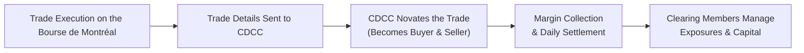

## 27.2 Canadian Derivatives Clearing Corporation (CDCC)

Have you ever wondered what really happens behind the scenes after you buy or sell an option on the Bourse de Montréal? I know I did the first time I clicked the “buy” button for a few call options. I remember thinking: “Okay, so my broker just confirmed the trade, but who actually makes sure everything is properly settled and guaranteed?” Well, that is precisely where the Canadian Derivatives Clearing Corporation (CDCC) steps into the spotlight, performing what is arguably one of the most critical roles in Canada’s derivatives market infrastructure.

Understanding how the CDCC works can really boost your confidence when navigating the world of derivatives. Because seriously, who wants to trade if they’re worried the other side of the trade might fail to deliver or pay up? The CDCC neutralizes that fear by acting as the central clearing counterparty (CCP) for Canada’s listed options and futures, transforming each transaction into a secure, guaranteed contract. Let’s explore what that looks like in practice.

  
### The Role of the CDCC in Canada’s Derivatives Market

The CDCC is a subsidiary of the Montréal Exchange (commonly referred to as the Bourse de Montréal). It clears, settles, and guarantees trades for exchange-listed derivatives in Canada. This includes stock options, equity index options, and options on futures contracts, as well as the range of futures products offered at the Bourse. By standing in between the buyer and seller, the CDCC effectively becomes the buyer to every seller and the seller to every buyer. So if you purchase a call option on the S&P/TSX 60 Index, from your perspective the CDCC takes on the seller’s obligations, and from the seller’s perspective the CDCC takes on the buyer’s obligations. This legal mechanism is what we call “novation,” and it’s a key factor in reducing counterparty risk.

Central clearing fosters a sense of reliability. Rather than having to worry about which counterparty is on the other side of the trade, you know the CDCC is stepping in with robust risk management procedures that include margin requirements, daily settlement, and a default fund backed by all clearing members. As a CCP, the CDCC is governed by rules approved by the Canadian Securities Administrators (CSA) and supervised by the Canadian Investment Regulatory Organization (CIRO). This oversight ensures adequate capital, margin standards, and regulatory compliance are always in place.

  
### Core Responsibilities of the CDCC

• Clearing and Settlement: The CDCC oversees the daily recording, matching, confirmation, and settlement of trades. After a trade is matched on the exchange, the details flow automatically to the CDCC’s clearing system.  
• Risk Management: By collecting margin from both buyers and sellers (through the clearing members), the CDCC focuses on mitigating default risk. It employs sophisticated models to assess volatility, historical price movement, and the nature of the underlying assets.  
• Trade Guaranty: Once a trade is “accepted for clearing,” the CDCC guarantees performance of both sides. This means, for example, if one party defaults, the CDCC steps in to fulfill the contract, cushioning the broader market from the shock.  
• Default Management: The CDCC runs daily settlement processes to measure gains and losses on open positions. If a clearing member cannot meet a margin call, there are well-defined procedures around liquidation of positions, use of the default fund, and eventual resolution.  
• Regulatory Compliance: The CDCC must adhere to stringent rules under CSA Staff Notices and National Instruments that govern clearing agencies. The organization submits routine reports to, and is periodically examined by, regulatory bodies such as CIRO.

  
### How the Clearing Process Works

“Clearing” basically means ensuring that every executed trade is recorded, matched, and financially covered on a daily basis (or even intraday) so there’s no question about it being properly settled in the end. Here’s a simplified flowchart to make it a bit clearer:

Imagine you just wrote a put option on a popular Canadian mining stock. The Bourse matches your order with a buyer’s order. Next, the matched trade details flow through to the CDCC, which then “stands” between the two parties, effectively rewriting the contract. From that point forward, your obligations are to the CDCC, and the buyer’s claims are on the CDCC. Both parties will have margin obligations that they maintain with their respective clearing firm (if you’re trading through a broker, the broker is typically connected to a clearing member who interfaces directly with the CDCC).

  
### Margin Requirements: The Backbone of Robust Risk Management

If I can share a personal story—when I first encountered margin calls, I thought it was the broker’s way of scolding me for losing money. It felt a bit humiliating. But then I realized margin requirements aren’t about scolding, they’re about ensuring stability for everyone in the market.

The CDCC sets margin rules for each contract type, factoring in current and historical volatility, correlations (for strategies involving multiple positions), and the inherent risk profile of the underlying asset. Clearing members pass along these requirements to individual customers (like you and me), sometimes with additional “house” requirements to cushion any potential risk further.

Some key points about CDCC’s margin process:  
• Real-time Risk Assessment: Large price swings can trigger intraday margin calls. For example, if the underlying index for your open positions plunges by 5% unexpectedly, your broker might ping you with a margin call.  
• Margin Offsetting: If you hold correlated positions that offset each other’s risk (like certain spread strategies), your overall margin requirement might be reduced.  
• Continuous Model Improvement: The CDCC uses data-driven risk models that are periodically updated. If market volatility spikes (for instance, during a financial crisis), margin requirements can quickly be readjusted to reflect heightened risk.

  
### Default Management: Maintaining Market Integrity Even in Crisis

One of the biggest nightmares in financial markets is a default, where a clearing member fails to meet its obligations. The CDCC’s daily settlement process tracks gains and losses on positions. If a participant (through their clearing member) posts insufficient margin or cannot settle their obligations on time, the CDCC has clear protocols:

• Immediate Liquidation: The CDCC can close out or transfer the defaulting member’s positions to limit losses.  
• Use of the Default Fund: Each clearing member contributes proportionately to this fund. If the defaulting member’s margin is not enough to cover all losses, the CDCC dips into the default fund to make up the shortfall.  
• Additional Assessments: In catastrophic situations, the CDCC may require additional contributions from non-defaulting members, though the goal is always to avoid systemic risk through stringent membership requirements and robust margin practices.

These layers of protection are vital. It’s a bit like building a fortress—margin is the first defensive wall, while the default fund is a second, more substantial barrier. And behind it all is the unwavering commitment of the CDCC to fulfill trades under all but the most extreme conditions.

  
### Membership Criteria: Who Gets to Clear?

Clearing membership with the CDCC is a privilege granted to entities like banks, broker-dealers, and large financial institutions that meet specific capital and operational standards. If you’re reading about these standards, you’ll see references to “capital adequacy”—the requirement that clearing members hold sufficient capital so they won’t fold under market stress. The CDCC sets these rules, often in coordination with CIRO guidelines, and all clearing members must meet them continuously.

A clearing member has the following obligations, among others:  
• Posting Initial and Variation Margins: As trades come in, clearing members deposit initial margin and manage ongoing variation margins.  
• Contributing to the Default Fund: Each member must pay into the collective pool that covers defaults.  
• Meeting Reporting and Collateral Standards: The CDCC requires members to provide collateral in acceptable forms (e.g., cash or government securities) and to submit regulatory and risk reports on an ongoing basis.  
• Undergoing Continuous Monitoring: Stress tests, internal audits, and external regulatory examinations are all part of the membership environment.

  
### Stress Testing: Preparing for the Unthinkable

A big part of the CDCC’s job is saying “Okay, what if we had a perfect storm scenario?” Stress testing is essentially a set of hypothetical or historical “what if” exercises to see whether margin levels, default funds, and capital reserves are strong enough to handle extraordinary events. These events might include:

• Sudden price gap on an index due to political turmoil or an unexpected interest rate decision by the Bank of Canada.  
• Extreme volatility in commodity-based futures, especially in markets impacted by global events (like energy shocks or supply chain bottlenecks).  
• A systemic cascade, where multiple firms face liquidity constraints simultaneously.

The CDCC will tweak scenarios—sometimes applying even bigger moves than historically recorded—to confirm there’s enough buffer in the system. If a stress test reveals vulnerabilities, margin methodologies and members’ default fund contributions can be adjusted.

  
### Balancing Efficiency and Security

One of the fascinating tensions at a clearing corporation is the balance between market efficiency and security. On one side, you want margin requirements and membership criteria to be stringent enough that defaults are minimized. On the other side, you don’t want to tighten rules so much that trading becomes prohibitively expensive due to high capital or margin demands. The CDCC meticulously calibrates this balance. It consults with industry participants, uses quantitative risk models, and remains in communication with regulators that look at the broader stability of the Canadian financial system. If those margin requirements become too lax, the entire system could be exposed to enormous risk. If they become too strict, trading volume might shrivel, undermining market liquidity.

  
### Alignment with Regulatory Oversight

The CDCC operates in accordance with CSA Staff Notices and National Instruments governing clearing and settlement, such as National Instrument 24-102, which sets standards for recognized clearing agencies in Canada. It also cooperates with CIRO bulletins and guidelines around capital requirements for clearing members—ensuring that each member’s finances stay robust enough to handle potential losses.

At a broader level, the Bank of Canada’s financial policy reviews often examine CCPs like the CDCC because they play a crucial role in maintaining the stability of the financial system. Whenever you read about “systemic risk,” you can think about the important backstop function a CCP provides in the event of severe disruptions.

  
### Practical Considerations for Traders and Investors

If you’re trading exchange-traded derivatives in Canada, you might not directly interact with the CDCC from a day-to-day perspective, but its presence impacts everything from how your margin is calculated to how safely you can assume the other side of your trade is managed. Here are some practical takeaways:

• Margin Calls Don’t Come from Nowhere: They reflect real-time risk calculations that feed into the CDCC’s system. So, if your broker calls or emails about a margin shortfall, that chain reaction likely started with the CDCC’s assessment of changes in market conditions.  
• Settlement Certainty: Because of the CDCC, you don’t have to worry personally about whether the guy on the other side of your futures contract can pay up. That risk is centralized at the CCP.  
• Default Fund & Shared Risk: If a massive default occurs, the financial burden is shared among the clearing members, not singled out onto one participant. This collective approach promotes confidence among market participants.

  
### A Real-World Scenario

Let’s say you’re bullish on a particular transportation stock and decide to buy five call option contracts (each contract typically covering 100 shares) at a $5 premium, so your total premium outlay is $2,500. Those calls are written by a market participant who has sold them to you. Once the trade is matched at the Bourse de Montréal, the seller’s obligations and your rights are transferred to the CDCC.

Now, if the stock price skyrockets—maybe because the company announced a new e-commerce partnership—and your calls move deeply in-the-money, you’re making a hefty gain. But from the vantage point of the option seller, they’re facing a potential big loss. They’ll need to keep posting variation margin daily to the CDCC (through their clearing member) as the value of your call rises. If they fail to post margin on time, the CDCC has the authority to liquidate or transfer their open positions, using the margin or, in worst-case scenarios, the default fund. You remain protected through it all because of the clearing process.

  
### Why CDCC Matters for Market Confidence

The entire derivatives ecosystem thrives on trust. The knowledge that all trades are guaranteed by a financially sound, well-regulated central clearing counterparty encourages active participation from professional and retail traders alike. Without a clearinghouse, bilateral counterparty deals would carry far higher default risks, which in turn might scare away many participants or cause them to trade only with well-known, established counterparties. That restricts market liquidity and stifles growth. So, the CDCC’s existence is like a strong foundational pillar. You might not see it at first glance, but everything rests upon it.

  
### Glossary

Clearing Member  
A trading member (often a large financial institution or broker-dealer) that has direct access to the CDCC’s clearing services. Clearing members must meet financial and operational standards set by the CDCC.

Default Fund  
A collective pool of resources from all clearing members. If a member defaults and their posted margin is insufficient to cover losses, the CDCC can draw on the default fund to fulfill obligations.

Capital Adequacy  
The requirement for clearing members to maintain sufficient equity and liquid capital. These standards help ensure that they can meet any margin calls or unexpected losses without collapsing.

Stress Testing  
A series of simulations that consider extreme market moves. By applying hypothetical shocks, the CDCC can evaluate whether current margin levels and the default fund would be sufficient under crisis conditions.

  
### Additional Resources

There are many ways to dig deeper into the CDCC’s mandate and risk framework. If you’re curious, check out:  
• The CDCC’s official website: [www.cdcc.ca](https://www.cdcc.ca). It contains the latest margin calculators, clearing manuals, and operational guidelines.  
• CSA Staff Notices and National Instruments: You can find them on Canadian Securities Administrators’ official sites. Key instruments, like NI 24-102, define the standards for recognized clearing agencies.  
• CIRO website: [CIRO.ca](https://www.ciro.ca). CIRO bulletins often detail risk-based capital requirements, margin guidelines, and other regulatory updates relevant to the clearing ecosystem.  
• Bank of Canada’s Financial System Review: Offers insights into systemic risk and the significance of CCPs in safeguarding Canada’s financial infrastructure.  
• Open-Source Financial Tools: Platforms like QuantLib provide an open-source collection of tools for pricing and risk management. Exploring these can clarify how margin models or risk simulations might be coded in practice.

  
### Final Thoughts

Maybe you had no clue who facilitated and guaranteed your derivatives trades, or maybe you suspected it was “some clearinghouse somewhere.” Either way, I hope it’s now a bit more transparent. The CDCC is at the heart of Canada’s listed derivatives market, providing the safety net that allows traders—from novices to major financial institutions—to operate under standardized rules and robust protection mechanisms.

Without a well-functioning central clearing institution like the CDCC, the entire derivatives market would be far less liquid and far riskier—it would feel like trying to walk on a tightrope without any protective net below. Now that you know that net is woven with margin requirements, default funds, and strict oversight, you can proceed with greater confidence and, perhaps, a deeper respect for the hidden machinery that keeps our derivative markets humming.

  
## Sample Exam Questions: Canadian Derivatives Clearing Corporation (CDCC)



### Which entity acts as the central clearing counterparty for exchange-traded derivatives in Canada?  
- [ ] The Toronto Stock Exchange (TSX)  
- [x] The Canadian Derivatives Clearing Corporation (CDCC)  
- [ ] The Bank of Canada  
- [ ] The Ontario Securities Commission  

> **Explanation:** The CDCC is responsible for clearing, settling, and guaranteeing listed derivative trades in Canada.

### How does the CDCC mitigate counterparty risk in derivatives trades?  
- [ ] By allowing bilateral negotiation between buyers and sellers  
- [x] By novating all trades and requiring margin from clearing members  
- [ ] By eliminating margin requirements for certain high-volume traders  
- [ ] By relying solely on historical price data without stress testing  

> **Explanation:** The CDCC occupies the buyer-to-every-seller and seller-to-every-buyer role and mandates margin to handle potential losses.

### What is the primary purpose of the CDCC’s default fund?  
- [ ] Encouraging broker competition  
- [x] Providing a financial backstop if a clearing member defaults  
- [ ] Reducing regulatory reporting burdens  
- [ ] Funding technology upgrades for Canadian exchanges  

> **Explanation:** The default fund helps cover any shortfalls if a defaulting member’s margin is insufficient.

### Which regulatory body currently supervises the CDCC with respect to its rules and standards?  
- [ ] The Investment Industry Regulatory Organization of Canada (IIROC)  
- [ ] The Mutual Fund Dealers Association of Canada (MFDA)  
- [x] The Canadian Investment Regulatory Organization (CIRO)  
- [ ] The Office of the Superintendent of Financial Institutions (OSFI)  

> **Explanation:** CIRO is Canada’s current self-regulatory organization, overseeing members and market integrity post-2023 amalgamation.

### Which factor is NOT typically considered when the CDCC sets margin requirements?  
- [ ] Historical price volatility  
- [ ] Correlation between multiple positions  
- [ ] The member’s capital adequacy  
- [x] Investors’ personal financial goals  

> **Explanation:** While personal goals are relevant in suitability analysis, margin requirements rely on market and risk data, not individual targets.

### What is “novation” in the context of the CDCC’s clearing process?  
- [x] The process by which the CDCC legally becomes the buyer to every seller and vice versa  
- [ ] A special penalty fee for margin shortfalls  
- [ ] A form of direct registration of securities  
- [ ] An alternative to standard margin calculations  

> **Explanation:** Novation replaces the original contract between buyer and seller with two new contracts where the CDCC steps in as counterparty to both sides.

### Which best describes the CDCC’s approach to stress testing?  
- [x] Conducting simulations of extreme market conditions to measure margin adequacy  
- [ ] Avoiding any hypothetical scenarios to focus on historical events  
- [ ] Calculating margin only once a month  
- [ ] Outsourcing all risk analysis to external auditors  

> **Explanation:** Stress testing models extreme conditions to ensure margin and default fund coverage remain sufficient.

### If a clearing member defaults on its obligations, which of the following steps might the CDCC take first?  
- [x] Liquidate or transfer the defaulting member’s open positions  
- [ ] Return all of the member’s margin deposit immediately  
- [ ] Penalize all remaining clearing members equally  
- [ ] Halt trading permanently on the Bourse de Montréal  

> **Explanation:** The first line of defense is to liquidate or transfer positions to minimize losses.

### Which organization sets the overarching regulatory framework that the CDCC follows for clearing and settlement?  
- [ ] Investment firms’ internal compliance offices  
- [ ] Global rating agencies  
- [x] The Canadian Securities Administrators (CSA)  
- [ ] The Federal Reserve Board  

> **Explanation:** The CSA is responsible for establishing the national regulatory framework that recognized clearing agencies such as the CDCC must adhere to.

### True or False: The margin requirements and capital adequacy rules set by the CDCC are designed to discourage trading by making it more expensive.  
- [x] False  
- [ ] True  

> **Explanation:** Margin and capital rules theoretically add costs, but their aim is market stability and risk reduction, not discouraging trading. By promoting safety, these rules can actually encourage broader participation.


