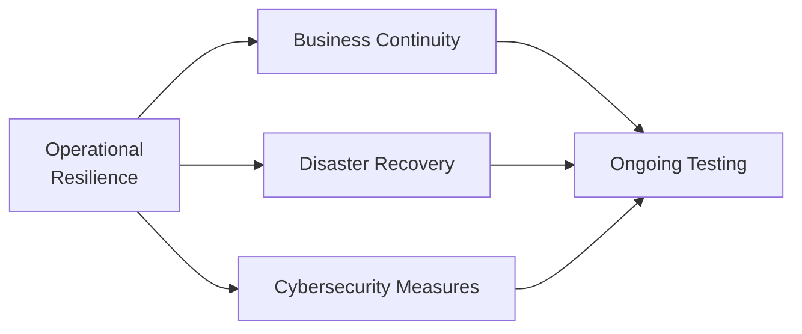

## 27.5 Operational Resilience & Cybersecurity in Clearing

It’s easy to look at a clearing corporation and think: “Well, that’s got to be some high-tech fortress where everything runs like a clock, no matter what.” I remember once chatting with a clearing specialist who said, half-jokingly, “We’re only as good as our last stress test!” And believe me, that’s the kind of statement that can keep a person wide awake at night. Let’s explore why operational resilience and cybersecurity matter so deeply in the clearing space and, honestly, how it impacts all of us in the derivatives marketplace.

Clearing corporations operate at the epicenter of financial transactions, ensuring trades settle properly and that the entire market continues to function—even when there’s a crisis. Maintaining resilience involves everything from top-notch cybersecurity to well-oiled business continuity plans. Below, we’ll walk through the core ideas you need to know if you’re to fully grasp operational resilience and cybersecurity in clearing. We’ll also check in on some real-world examples, test out a bit of theory with diagrams, and touch on the relevant Canadian regulatory framework (especially focusing on CIRO) that upholds these essential standards.

A quick note on references: You’ll see mention of the National Institute of Standards and Technology (NIST) Cybersecurity Framework (www.nist.gov), plus guidelines from the International Organization of Securities Commissions (IOSCO). We’ll also highlight how the Canadian Investor Protection Fund (CIPF) helps protect investors, while the Canadian Investment Regulatory Organization (CIRO) ensures regulated dealers and clearinghouses abide by certain best practices. These frameworks exist for good reasons: to help everyone in finance sleep a little easier at night.

  
Building a Resilient Culture  
----------------------------

If you’ve ever tried to juggle too many tasks at once, you know that success depends on good coordination. Operational resilience in a clearing corporation is similar: it’s about orchestrating people, processes, and technology so that, even if something goes sideways, critical functions keep running. Market participants expect the clearing corporation to handle all trades seamlessly—even when volumes surge under extreme market volatility or when technology hiccups happen out of the blue.

High-level resilience strategies often include the following elements:  
• Redundant systems spread across multiple data centers.  
• Automated failover capabilities that switch over without manual intervention.  
• Frequent scenario planning, sometimes involving “worst-case scenario” drills.  

I once witnessed a routine test for a clearing firm’s failover site. The data center in the primary location was intentionally brought offline, and traffic was redirected to the backup center in a different city. The entire transition took about 25 seconds, which—by real-time systems standards—felt like an eternity. Yet, there were no major disruptions. Watching it happen gave me a newfound appreciation for the behind-the-scenes magic that ensures your trades still clear smoothly, even on a chaotic market day.

  
Cybersecurity Frameworks: Tools and Tactics  
-------------------------------------------

Cybersecurity in a clearing environment is about as critical as a seat belt in a car: you might not think about it every second, but you sure want it in place if there’s an accident. Clearing corporations handle massive volumes of sensitive data, from trade details to margin requirements. They also store personal information about clients, brokers, and other stakeholders. A breach not only risks financial loss but could compromise market integrity and trust.  

Clearinghouses operate under guidelines from CIRO, the Canadian Securities Administrators (CSA), and international bodies like IOSCO, which have all ramped up their expectations for cyber preparedness. One might hear about the “Five Functions” from the NIST Cybersecurity Framework—Identify, Protect, Detect, Respond, and Recover. These functions serve as a blueprint that many clearing corporations adapt into their daily operations:

• Identify: Pinpoint critical assets, data flows, and vulnerabilities.  
• Protect: Implement firewalls, encryption, multi-factor authentication, and staff training.  
• Detect: Run continuous system monitoring, intrusion detection alerts, and automated red flags.  
• Respond: Have a documented incident response plan that mobilizes quickly in a crisis.  
• Recover: Outline clear steps to restore systems and data, and note any improvements for the future.  

I recall a friend working in cybersecurity who said, “The worst time to discover you’re vulnerable is when you’re under attack.” Cleary, to keep from being blindsided, penetration testing (or “pen testing”) is standard protocol. It involves simulating real cyberattacks by “ethical hackers” to see if the clearing corporation’s defenses hold up. If weak spots are found, they’re patched ASAP.  

  
Disaster Recovery & Business Continuity  
---------------------------------------

Let’s talk about the scenario we all hope never happens: a system meltdown right at the worst possible moment. Imagine a sustained power outage, a compliance crisis, or a large-scale cyberattack. That’s where a Business Continuity Plan (BCP) comes in. It’s a set of predetermined steps to ensure mission-critical processes stay active while normal operations get restored behind the scenes.

Disaster Recovery (DR) goes hand in hand with BCP. You might think of BCP as the overall blueprint for continuing business, while DR focuses specifically on restoring IT infrastructure and data. For example, if the clearing platform’s primary database crashes, the DR plan might involve spinning up a backup in a separate, secure data center within seconds.  

Frequent testing of BCP and DR is essential. Some clearing firms hold full-scale drills a few times each year. They’ll unplug a critical server or even simulate a widespread hacking scenario to see how quickly they can pivot to backups, isolate the threat, and restore normal operations. The key is minimal downtime. In derivatives, every second counts, so DR/BCP must be both well-rehearsed and robust.

  
Diagram: Overview of an Operational Resilience Approach  
-------------------------------------------------------

Below is a simple Mermaid diagram illustrating core areas of operational resilience: business continuity, disaster recovery, and cybersecurity. It also highlights how continuous testing acts as the glue that keeps everything together.

The diagram might look simplistic, but it underscores how each pillar—continuity, recovery, security—needs to be continually tested to ensure the entire framework remains strong.

  
Regulatory Expectations and Compliance  
--------------------------------------

If you’ve checked out Canadian financial regulations, you know they’re not exactly shy about setting standards. Clearing corporations need to meet resilience and cybersecurity requirements laid out by multiple bodies:

• CIRO expects clearinghouses and market intermediaries to maintain adequate systems and controls to manage operational risks.  
• The CSA regularly issues Staff Notices or guidance to clarify best practices and accountability measures for technology governance.  
• Global standard-setters like IOSCO have guidelines tailored for Financial Market Infrastructures (FMIs), including clearing corporations.  

In practice, these regulations revolve around guaranteeing that even if something big goes wrong—like a data center meltdown—market participants can still rely on the clearinghouse to protect margin collateral, finalize trades, and communicate reliably with brokers and traders. These are not “nice to haves”; they’re firm obligations.  

The Bank of Canada and other central banks also pay close attention to clearinghouses that handle systemically critical payments or securities. In fact, the 2008 financial crisis taught everyone that if one major piece of infrastructure stumbles, it can ripple through global markets. With that in mind, resilience metrics—like the maximum allowable downtime or the speed of data backup replication—are carefully monitored and tested.

  
Common Pitfalls and Leading Practices  
-------------------------------------

Clearing corporations operate in an ever-evolving risk landscape. Let’s identify a few pitfalls and some strategies to combat them.

• Overreliance on Legacy Systems: Some clearinghouses have built up their infrastructure piecemeal over decades. That can mean layers of outdated software that complicate upgrades. Leading practice? Conduct regular audits and schedule phased modernization.  

• Lack of Employee Training: Cyber threats often exploit human error—things like phishing emails or unintentional data handling mistakes. Top-tier clearing firms invest in ongoing staff education, from basic cybersecurity hygiene to specialized training for system administrators.  

• Complacency in Testing: Sometimes, after passing a big test, organizations get lax. But security is never a one-and-done. Frequent tests, unannounced drills, and real-time monitoring keep everyone on their toes.  

• Insufficient Vendor Oversight: Clearing corporations rely on numerous third-party vendors for software, data feeds, and more. Each vendor relationship presents a potential risk. Effective due diligence and ongoing monitoring of service-level agreements (SLAs) can prevent nasty surprises.  

• Not Enough Real-Time Insight: You can’t fix what you can’t see. Real-time threat monitoring or anomaly detection tools help identify suspicious activities early. The earliest detection can mean the difference between quick containment and a disastrous breach.

  
Case Scenarios and Lessons Learned  
----------------------------------

Let’s consider a hypothetical scenario—some might say it’s reminiscent of real events. Suppose a large clearing corporation is targeted by a coordinated cyberattack during a day of intense market volatility. The systems slow to a crawl as denial-of-service attempts flood the network, but the backup infrastructure kicks in, diverting traffic through a secure secondary hub. Simultaneously, staff follow their incident response plan, scanning for a data breach and confirming that intrusion detection measures thwarted any deeper entry.

In the end, trades remain unaffected, though the clearinghouse’s main site experiences a short outage. Because they had incident response and business continuity plans sufficiently tested, the problem was contained.

The lesson? Preparedness. Every clearing organization should assume that at some point, there will be a targeted attack. Building robust redundancies and establishing an organizational culture of “assume breach” can significantly limit damage.  

  
Glossary and Definitions  
------------------------

Business Continuity Plan (BCP):  
A formalized set of protocols ensuring that critical operations and workflows continue in the event of a disruptive incident, such as a power outage, natural disaster, or cyberattack.

Cyber Risk:  
The potential harm arising from malicious cyber activities—ranging from data breaches to complete operational disruption.  

Penetration Testing:  
An authorized, simulated cyberattack performed to identify vulnerabilities in software, networks, or physical operations—allowing the organization to fortify weak areas.  

Resilience Metrics:  
Quantifiable indicators (like Recovery Time Objectives and Recovery Point Objectives) that measure how quickly a clearing corporation can return systems to normal following an incident, and how much data can be restored.

  
Practical Tips & Best Practices  
-------------------------------

• Maintain an Information Security Policy: Outline roles, responsibilities, and acceptable use guidelines clearly. This document should be living—updated every time new threats emerge or new systems are deployed.  

• Adopt a Tiered Data Backup Strategy: Storing backup data in multiple, geographically separated facilities helps mitigate local disasters.  

• Use “Defense-in-Depth” Cybersecurity: Layer your defenses so that if one fails (think perimeter firewalls), others (system-level encryption, network segmentation) will still stand a chance of stopping an intruder.  

• Engage in Cross-Industry Collaboration: Sometimes, it helps to share intelligence. Entities like the Financial Services Information Sharing and Analysis Center (FS-ISAC) or direct dialogues with local regulators can keep you informed about emerging threats.  

• Align with International Standards: Beyond NIST, keep an eye on standards like ISO 27001 for information security management, as well as IOSCO’s Guidance on Cyber Resilience for Financial Market Infrastructures.  

  
Additional Resources  
--------------------

• CIRO: https://www.ciro.ca  
• CSA Notices: https://www.securities-administrators.ca  
• NIST Cybersecurity Framework: https://www.nist.gov/cyberframework  
• IOSCO Principles for Financial Market Infrastructures: https://www.iosco.org  
• Bank of Canada Publications on Remarkable Market Events: https://www.bankofcanada.ca  

  
Concluding Thoughts  
-------------------

Anyway, at the end of the day, clearing corporations sit at the heart of the financial ecosystem, bridging trades between buyers and sellers in a complex derivatives market. A meltdown in clearing could send shockwaves through the entire system—so “robustness” isn’t a buzzword, it’s a fundamental requirement. From building advanced cybersecurity measures to testing business continuity plans on a regular basis, clearinghouses must be prepared for anything.

I’ve heard colleagues say that the true measure of resiliency is not how you work on a normal day, but how you respond to the day everything goes wrong. Staying on guard through continuous testing, strong culture, and a willingness to learn from near-misses fosters a clearing environment that can handle just about any storm. It’s a tall order, but it’s also what upholds our collective trust in these crucial financial pillars.

As you continue your journey through derivatives trading, keep in mind that every strategy or hedge depends on the clearinghouse functioning properly. Without operational resilience and cybersecurity, the best-laid derivative strategies might mean nothing. So, hold onto your seat belts and keep an eye on those well-practiced, well-rehearsed, behind-the-scenes guardians of market stability.

  
## Sample Exam Questions: Operational Resilience & Cybersecurity in Clearing



### A clearing corporation’s ability to avoid major disruptions during a critical system failure is primarily referred to as:

- [ ] Business continuity plan
- [ ] Cyber risk
- [x] Operational resilience
- [ ] Penetration testing

> **Explanation:** Operational resilience encompasses all the measures, policies, and strategies that allow a clearing corporation to continue functioning despite crises or external shocks.

### Which of the following best describes penetration testing within a clearing corporation’s security framework?

- [ ] It is an informal review of software licenses.
- [ ] It involves scanning for outdated software patches without further action.
- [x] It is a sanctioned, simulated attack on a system to find and address vulnerabilities.
- [ ] It is mandatory server downtime arranged twice a year.

> **Explanation:** Penetration testing simulates a cyberattack by authorized professionals to discover vulnerabilities, which can then be fixed before actual malicious activity occurs.

### Which of the following is considered a key component of a Business Continuity Plan (BCP) for clearing corporations?

- [ ] Annual employee performance reviews
- [ ] Stock option distribution programs
- [x] Contingency procedures ensuring critical services continue during disasters
- [ ] Weekly marketing campaigns

> **Explanation:** BCP ensures essential functions of an organization remain operational during emergency or disaster scenarios, focusing on mission-critical services like trade settlement.

### In the NIST Cybersecurity Framework, which of the following functions focuses on restoring normal operations after a cyber incident?

- [ ] Protect
- [ ] Detect
- [ ] Identify
- [x] Recover

> **Explanation:** The “Recover” function of the NIST Framework describes processes that restore systems to normal operation and incorporate lessons learned to improve security posture.

### Which statement best summarizes the relationship between business continuity and disaster recovery?

- [x] Business continuity aims to keep critical operations running; disaster recovery focuses on restoring technology and data.
- [ ] Disaster recovery is the overall plan, while business continuity is a small subset only for data.
- [ ] They both refer to identical processes but use different terminologies.
- [ ] Business continuity only deals with physical disasters, while disaster recovery deals with everything else.

> **Explanation:** BCP strategies ensure normal functioning of essential operations, whereas DR focuses specifically on restoring data, applications, and infrastructure after a disruptive event.

### Which Canadian regulatory organization currently oversees investment dealers and ensures technology governance for market infrastructures?

- [x] CIRO
- [ ] IIROC (in present tense)
- [ ] MFDA
- [ ] CIPF

> **Explanation:** CIRO is the current self-regulatory organization in Canada (post-2023). IIROC and MFDA exist only historically and are no longer separate entities.

### What is one potential downside of layering multiple cybersecurity solutions (i.e., a “defense-in-depth” approach)?

- [x] Complex systems can become harder to manage, requiring thorough coordination and oversight.
- [ ] There is no downtime requirement for redundancy in such scenarios.
- [ ] It fully eliminates the need for business continuity planning.
- [ ] Cyber criminals generally avoid attacking complex systems.

> **Explanation:** While multiple layers of defense can increase security, it also raises management complexity, demanding rigorous oversight and integration to avoid gaps.

### “Resilience metrics” in a clearing corporation typically measure:

- [ ] The ratio of equity to debt for regulatory capital purposes.
- [x] Key performance indicators on how quickly systems and data can be recovered.
- [ ] Software licensing costs for cybersecurity vendors.
- [ ] Employee retention and turnover rates in the IT department.

> **Explanation:** Resilience metrics refer to measurable indicators (downtime, recovery speed, data loss) that determine the institution’s ability to handle unexpected disruptions.

### Why is vendor oversight critical to a clearing corporation’s cybersecurity stance?

- [ ] Vendors usually provide unlimited cybersecurity insurance coverage.
- [ ] It allows the corporation to outsource all risk management tasks.
- [ ] Most vendors self-regulate without external guidelines.
- [x] Third-party vendors can introduce vulnerabilities if not closely monitored and managed.

> **Explanation:** Vendors’ systems and practices can affect the clearing corporation’s broader security environment, making proper oversight essential to mitigating external threats.

### A robust operational resilience plan usually includes:

- [x] Redundant data centers, ongoing penetration testing, and well-documented BCP/DR plans
- [ ] Only advanced intrusion detection systems, ignoring physical site protections
- [ ] Mandatory zero internet access for all staff
- [ ] Yearly audits with no follow-up or improvement measures

> **Explanation:** Comprehensive resilience involves redundancy, continuous testing, and established recovery plans to ensure uninterrupted clearing and settlement services.


