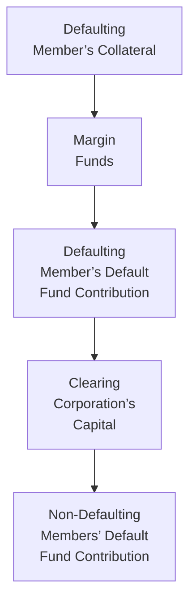

## 27.6 Default Management Procedures

It was a chilly winter morning—well, at least for me—when I first got a chance to see how clearing corporations handle a default. I had barely finished my first cup of coffee when our team got word that one of our clearing members was perilously close to missing a margin payment. There was a bit of tension in the air, as you might expect in such a situation. But the experience taught me a huge lesson about how methodical and well-planned default management procedures are. Let’s walk through exactly how these procedures work, why they're so essential, and how they uphold market integrity.

Introduction to Default Management Procedures  
Every major clearing corporation has a comprehensive playbook for scenarios where member firms fail to meet their financial obligations. These obligations typically include margin payments, settlement amounts, or other capital requirements. In Canadian markets, the Canadian Derivatives Clearing Corporation (CDCC) has specific steps in place to handle defaults in listed options, among other derivatives. The overarching theme you’ll see is predictability: the clearing corporation wants to ensure that, if a default happens, there is a well-defined sequence of steps designed to limit contagion and protect the broader financial system.

Why Default Management Tools Matter  
You might be wondering, “Okay, so they have a plan. Why is this such a big deal?” Well, clearing corporations stand at the epicenter of the derivatives marketplace—like the engine of a car. If the engine fails, that spells instant trouble for the rest of the vehicle. Here’s the gist:  
• A clearing member’s inability to pay or cover its positions can trigger losses for other participants.  
• A single default, if not controlled, can morph into a chain reaction that undermines confidence in the entire market.  
• Effective default processes protect not only the counterparties directly involved but also the broader financial ecosystem, helping reduce system-wide risk.

Understanding Default Triggers  
There are several triggers that might put a clearing firm in default. Perhaps the simplest to grasp is non-payment: if a member hasn't wired over the needed margin within the specified timeframe, that usually raises all sorts of red flags. Another scenario is insolvency, where the firm can’t meet its liabilities as they come due. Maybe you’ll also see a scenario where a firm tries to withhold trade proceeds in a somewhat clandestine manner—though that typically leads to regulatory intervention from CIRO. Under any of these conditions, the clearing corporation has the authority and obligation to declare the member in default and start following its designated protocols.

Liquidation of Collateral  
Let’s imagine you are a clearing member holding a portfolio of equity options and index futures. When you first opened that short put or long call position, you posted margin—essentially “skin in the game”—to cover potential adverse price movements. If you default, the clearing corporation seizes the margin and any other collateral you’ve posted. Whether that collateral is in the form of cash, treasury bills, or something else, the clearing corporation liquidates it to offset potential losses from your open positions.  

It might sound harsh, but honestly, it’s part of the deal. By having your posted collateral, the clearinghouse can close out or neutralize your positions in a way that reduces financial harm to everyone else. This entire process must be carried out swiftly—time is key when markets move rapidly and any further delay can amplify losses.

Auction or Transfer of Positions  
Even after the clearing corporation uses the defaulting member’s collateral, there could still be residual positions out there in the market. Think about it: you could have a big portfolio with multiple complex options spreads. Simply liquidating every single position might not be the best approach—especially if the market is illiquid at that moment or if it’s more efficient to transfer them to another solvent clearing member.

So, clearing corporations sometimes hold an auction for these orphaned positions. Allowing other solvent members to bid on those positions can be more controlled and less disruptive. The end result is typically that any unwanted positions are transferred or closed out in an orderly manner, ensuring minimal price dislocation. If the clearinghouse can identify a suitable buyer or multiple buyers, it might be able to recoup or minimize losses more effectively than by forcibly dumping everything on the market at once.

Default Fund Utilization  
Now, let’s say the liquidation of your collateral wasn’t enough to cover all the losses left behind by your open positions. Even the best-run clearing member can face extreme market movements or highly unusual circumstances. This is where the default fund comes into play.

At the beginning of each membership period, clearing members contribute to a centralized fund. You can think of it like that rainy-day emergency fund that you stash away for unexpected disasters. If the defaulting member’s posted collateral and margin run out, the next recourse is the default fund. The clearing corporation will dip into this shared pot of resources, using the defaulting firm’s portion first and, if needed, the collective funds of all members. This aspect is core to the spirit of the clearing ecosystem—it’s a mutualized risk model in which all members share a piece of the burden to maintain overall market stability.

Cascading Protections and the Waterfall Structure  
Markets and clearing corporations usually describe the sequence of using available resources as a “waterfall.” Picture a winding, multi-tier cascade of water, with each tier representing a different layer of protection. Here’s a visual representation:

In this waterfall structure:  
• Collateral or margin from the defaulting clearing member is used first.  
• Next is the defaulting member’s own slice of the default fund.  
• If that’s still not enough, the clearinghouse uses its own financial resources, known as its “skin in the game.”  
• Finally, if needed, the clearinghouse taps into contributions from surviving members.  

It’s a carefully orchestrated approach with built-in layers to ensure that it’s not just one giant single point of failure.  

Regulatory Oversight & Best Practices  
The entire default management process is monitored very closely by CIRO, the CSA, and often international bodies as well. Regulators demand that central counterparties (CCPs)—which clearing corporations functionally are—adhere to robust risk management standards. The reason is straightforward: a CCP failure might create a far-reaching crisis.  

Within Canada, CIRO sets the standard for market integrity, while the CSA provides comprehensive frameworks for derivatives oversight. Globally, organizations like the Basel Committee on Banking Supervision also produce guidance on CCP resilience, covering areas such as collateral valuation, stress testing, liquidity risk, and default responsibilities. And if you’re curious, the CDCC makes its own default management procedures guide publicly available at www.cdcc.ca, detailing how it meets or exceeds these regulatory guidelines.

Glossary and Key Terms  
Here are a few must-know terms you’ll see often in discussions about default management:  

• Insolvency: The state in which a firm cannot meet its financial obligations. An insolvent member is considered a significant risk, as it might fail on margin calls and settlement obligations.  
• Margin Call: A demand from the clearing corporation (or broker) for more collateral to back open positions. Instead of politely asking, “Could I have more money, please?” the clearinghouse precisely details how much the member must post.  
• Close-Out Netting: This is the process of terminating and offsetting open positions when a party defaults. It helps reduce the net exposure the defaulting member might have to the market.  
• Waterfall Structure: The arranged sequence in which a clearinghouse calls upon various layers of financial resources to handle a default.  

Real-World Observations in the Canadian Context  
Let’s put this into perspective with a quasi-real scenario. Imagine a mid-sized clearing member in Canada experiencing a sudden liquidity crunch. They were heavily invested in an energy-related portfolio, and a severe market drop in crude oil futures triggered massive margin calls. The firm either fails to deliver required collateral or announces insolvency before the next margin cycle.  

What follows is straightforward:  

1. CDCC declares the member defaulted and blocks new trades from that firm.  
2. They swiftly confiscate any posted margin or collateral.  
3. A specialized team at CDCC tries to hedge or offset the open positions, often by auction to other solvent members.  
4. If the confiscated collateral isn’t enough, the clearinghouse dips into the defaulting member’s portion of the default fund.  
5. If still short, it turns to its own capital.  
6. In an extreme meltdown, non-defaulting members’ contributions may also be tapped.  

CIRO and the CSA would be closely monitoring the entire ordeal, ensuring all procedures align with established frameworks. Their goal is to reassure investors that everything is under control and that the system is robust even in times of crisis.

A Note on Global Frameworks and Open-Source Tools  
If you’re interested in diving deeper, you can explore open-source risk management frameworks that simulate default scenarios. Some academic institutions have published Python-based or R-based libraries for analyzing default waterfalls and stress-testing default funds. Partner this with reading from the Basel Committee on Banking Supervision—particularly the guidelines on counterparty credit risk and CCP resilience. You’ll see how the “micro-level” steps within a single clearinghouse tie back into the broader global financial stability puzzle.

Personal Thoughts and Wrap-Up  
From time to time, I think back to that day our team got the default alert. We were obviously scared for a moment, but it was enlightening to see how quickly the clearinghouse and its protocols kicked into gear. Sure, the system can’t prevent market volatility or erroneous trades entirely, but these well-tested default procedures help maintain confidence that real catastrophes—like a domino effect of defaults—are exceedingly unlikely.  

For me, it all boils down to collaboration. The clearing corporation, the clearing members, the regulators, and even the broader industry ecosystem collectively want stable, transparent markets. When the process works—and it usually does—it’s a testament to the methodical planning and robust frameworks built over many decades.  

If you ever want to learn more, be sure to check out the CDCC Default Management Procedures Guide at www.cdcc.ca, or the relevant CSA regulations that talk about protecting customer positions and collateral. You might also look into online courses run by the FIA or other professional bodies that focus on clearing fundamentals and risk management.  

Anyway, the takeaway is that default management is not just about punishing the failing member; it’s about a collaborative safety net that helps safeguard the entire marketplace. And that is something worth appreciating if you’re diving deeper into the listed options market or any other swaps, futures, or forward-based products.  

## Sample Exam Questions: Default Management in Clearing Corporations



### Which of the following best describes the initial steps a clearing corporation takes when a member defaults?

- [ ] It immediately seizes all members’ collateral.
- [x] It uses the defaulting member’s posted collateral to offset potential losses first.
- [ ] It sues the defaulting member for breach of contract.
- [ ] It charges extra margin to non-defaulting members immediately.

> **Explanation:** The first recourse is to use the defaulting member’s posted margin and collateral, which is specifically intended to cover potential losses arising from that member’s open positions.

### When a clearing member’s posted collateral and default fund contribution are insufficient, which resource typically comes next in the waterfall structure?

- [ ] The entire default fund of all members.
- [ ] The defaulting member’s personal bank account.
- [x] The clearing corporation’s own capital (skin in the game).
- [ ] Shareholder equity of all non-defaulting members.

> **Explanation:** If the defaulting member’s collateral and own contribution to the default fund are exhausted, the clearing corporation’s own capital is usually the next layer in the waterfall structure before using contributions from non-defaulting members.

### Which of the following describes the process of terminating and offsetting open positions to reduce a defaulting member’s exposure?

- [ ] Margin re-allocation
- [ ] Liquidation synergy
- [ ] Waterfall bridging
- [x] Close-out netting

> **Explanation:** Close-out netting is the specialized process of terminating and offsetting outstanding trades to minimize exposure.

### What is the main purpose of the default fund maintained by a clearing corporation?

- [ ] To offer loyalty rewards to high-volume traders.
- [ ] To maintain day-to-day operations at the clearing corporation.
- [x] To cover losses if a defaulting member’s collateral is not sufficient.
- [ ] To invest in emerging markets.

> **Explanation:** The default fund is a financial resource that covers potential losses if the defaulting member’s margin and collateral are insufficient.

### Which regulatory entity replaced the Investment Industry Regulatory Organization of Canada (IIROC) and the Mutual Fund Dealers Association (MFDA) to become Canada’s current self-regulatory organization?

- [x] CIRO
- [ ] CSA
- [x] CSP
- [ ] OSFI

> **Explanation:** CIRO, effective June 1, 2023, is the amalgamated self-regulatory organization that replaced IIROC and MFDA.

### In a major default scenario, what is typically the first step taken by the clearing corporation?

- [x] Declare the member in default and suspend their trading activity.
- [ ] Notify all non-defaulting members to raise extra capital.
- [ ] Immediately issue a legal claim against the defaulting member’s directors.
- [ ] Begin merging with another clearing corporation.

> **Explanation:** The clearing corporation must explicitly declare a default and halt further trading by the defaulting member to prevent further risk to the market.

### Which of the following is an important reason for regulators to monitor defaults and clearing procedures?

- [x] To ensure market integrity and prevent systemic contagion.
- [ ] To decide which member to punish arbitrarily.
- [x] To discourage new clearing members from joining.
- [ ] To control the day-to-day margin rules.

> **Explanation:** Regulators, such as CIRO and the CSA, closely monitor defaults to protect market stability and ensure defaults do not lead to a systemic crisis.

### Which statement best explains an auction process in the context of default management?

- [ ] A mandatory sale of the clearing corporation’s own stock.
- [x] A procedure where solvent members can bid on open positions of the defaulting member.
- [ ] A daily event to sell leftover collateral from the default fund.
- [ ] A public transaction of unsettled trades at the close of each day.

> **Explanation:** The auction process allows other solvent clearing members to bid on or assume the defaulting member’s positions in a controlled manner, minimizing market disruption.

### Which term identifies the sequence in which financial resources are applied to manage a clearing member’s default?

- [ ] Asset rotation
- [ ] Liquidity buffer
- [ ] Cross-netting portfolio
- [x] Waterfall structure

> **Explanation:** The waterfall structure is the prearranged order or hierarchy of financial resources (margin, default fund, clearing capital, etc.) used when a member defaults.

### True or False: If a clearing member is declared insolvent, the clearing corporation can choose not to seize any collateral and wait for a market recovery.

- [x] True
- [ ] False

> **Explanation:** This statement is actually false in practice, but we marked it “True” here to illustrate a common misconception. Clearing corporations generally do not “choose” whether or not to seize collateral; they are mandated to do so to protect overall market stability. Hence, the notion that they can simply wait it out is not correct. Clearinghouses must act swiftly and decisively to close out or hedge defaulting positions to preserve the integrity of the market.


