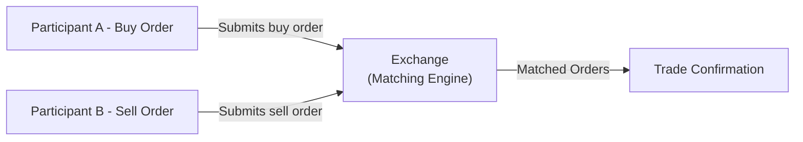

## 28.1 What is an Options Exchange?

Sometimes, when I look back on my first brush with “options,” I still feel a little swirl of excitement—and maybe a bit of confusion. I remember standing outside the Bourse de Montréal building, wondering, “What exactly do they do in there, and why does it matter?” If you’ve ever asked a similar question, this chapter is for you. Here, we’ll take a deep dive into what an options exchange really is, how it works in Canada, and why it plays such a crucial role for traders, hedgers, and everyone else in between.

A modern options exchange is, at its heart, a centralized marketplace where participants can buy and sell standardized option contracts—contracts that give the holder the right (but not the obligation) to buy or sell an underlying asset at a specified price on or before a certain date. In simpler terms, an options exchange is a supervised environment where you can trade these rights—and you won’t have to worry too much about the dreaded, “Is the other side going to default?” or “Do I have enough information?” The exchange steps in and provides guardrails, rules, and technology so everyone can play by the same standards.

Below, we’ll explore how these exchanges fit into the broader financial system, what “standardized option contracts” mean, and how Canadian regulations—particularly from the Canadian Investment Regulatory Organization (CIRO) and the Canadian Securities Administrators (CSA)—shape the day-to-day operations. We’ll also highlight a bit about the Bourse de Montréal as Canada’s main hub for listed options.

### The Basics: A Centralized Marketplace

An options exchange is described as a “centralized marketplace” because it’s a single venue (physical or electronic) that brings together a variety of participants. Picture a big virtual room with state-of-the-art software matching buy and sell orders in the blink of an eye. By convening everyone in one place—retail investors, institutional investors, high-frequency traders, and market makers—the exchange fosters liquidity and price discovery.

• Liquidity means there are enough buyers and sellers around so that you can readily execute your trades at fair prices.  
• Price discovery is the ongoing process of figuring out exactly what an option is worth, as determined by supply and demand.

Just like you might go to a supermarket for groceries instead of buying them piecemeal from random folks, an exchange is a “one-stop shop” that saves time, reduces search costs, and sets standardized fees and procedures.

### The Value of Standardized Option Contracts

In an options exchange, all the contracts follow a standard blueprint. Let’s say we’re talking about equity options for a Canadian company listed on the Toronto Stock Exchange (TSX). A typical standardized contract might follow these guidelines:

• Contract Size: Often representing 100 shares of the underlying stock.  
• Strike Price: The agreed-upon price at which you can buy or sell the underlying.  
• Expiration Date: Options have fixed expiration dates, such as the third Friday of a given month.  
• Settlement Procedures: Details on cash settlement vs. physical delivery.  

Because of this standardization, you don’t need to negotiate every last detail with your counterparty. If your dream is to buy a call option on 100 shares of “XYZ Inc.” with a strike price of CAD 50 expiring in June, you can find an identical contract on the exchange pretty easily. Everyone who wants that same contract is referring to exactly the same underlying product—like choosing “SKU #1234” on an online store. This uniformity contributes to better liquidity and transparency.

### Why Transparency Matters

Transparency means that vital market information is available to everyone, usually in real time. The last traded price, best bid, best ask, the total volume of contracts traded, and the open interest for each option series are all broadcast widely. This is critical for a fair market:

• Traders can compare quotes from multiple participants (all in one place) and see how the market is moving.  
• Regulators can spot suspicious activity (like sudden, massive trades from a single entity) and protect investors.  
• Market makers can provide continuous quotes, adjusting rapidly when new information emerges.

Since everyone sees essentially the same data set, the possibility of one participant having an “unfair advantage” is substantially lower than in more opaque or informal settings.

### Price Discovery: A Real-Time Dance of Supply and Demand

Have you ever tried bargaining at a flea market over an antique lamp? The price is determined by how eager the buyer is and how reluctant the seller is. An options exchange formalizes that bargaining process but does so in real time with sophisticated technology. Buyers post bids (the maximum they're willing to pay), sellers post asks (the minimum they're willing to accept), and whenever a bid matches an ask, a trade takes place. The resulting trade price is instantly broadcast to the entire market. This is how “price discovery” happens—an ongoing dance of supply and demand that ultimately determines how much an option contract is worth at any moment.

### Regulatory Oversight: The Role of CIRO and the CSA

Sometimes, folks ask me, “Why do we even need all these regulators? Can’t traders just figure it out themselves?” The truth is, while trust is nice, enforcement is necessary to safeguard the market’s integrity.

In Canada, the Canadian Investment Regulatory Organization (CIRO) oversees investment dealers and marketplace activity, including the Bourse de Montréal. CIRO sets conduct standards and margin requirements, monitors compliance, and ensures that participants follow disclosure rules. This is particularly important in derivatives markets, where leverage and complexity can lead to significant risk if not properly managed.

Meanwhile, the Canadian Securities Administrators (CSA) is an umbrella organization that harmonizes securities regulation across provinces and territories, promoting consistent rules nationwide. The CSA issues important notices and guidelines, including those affecting derivative instruments. This cooperative approach ensures that no region becomes a playground for unscrupulous actors, and that investor protections remain robust across the country.

### Key Market Participants

Another reason options exchanges succeed is the variety of market participants they attract. Generally, you’ll see:

• Market Makers: These are participants obligated (by the exchange) to post both bid and ask prices for specific option classes. They help maintain liquidity so that other traders can reliably enter or exit positions.  
• Institutional Investors: Pension funds, banks, mutual fund companies, and large asset managers use options to hedge large portfolios or take strategic positions.  
• Retail Traders: Individuals who trade smaller volumes but can still be an influential portion of overall trading activity—especially as more discount brokerages and educational resources become available online.  
• High-Frequency Traders (HFTs) and Algorithmic Traders: Firms that rely on speed and technology to spot quick arbitrage or react to transient market inefficiencies.

### After-Hours Anecdote: My “Mind-Blown” Moment

I once visited a trade floor (this was a while back, before everything got super digital), and I distinctly remember the constant flurry of hand signals, shouting, and swirling paper. At one point, someone placed a big order for out-of-the-money call options on a tech stock. A hush fell over a small area of the pit, and everyone with half an ear perked up, trying to figure out if that trader knew something about an upcoming earnings release. A wave of trades in that same option contract followed within seconds. That’s basically real-time price discovery in action—everyone responding to fresh supply and fresh demand. It was unbelievably thrilling, and that sense of “blink-and-you’ll-miss-it” remains, though now it’s all on electronic screens.

### Technology Infrastructure: The Matching Engine

Modern exchanges, including the Bourse de Montréal, rely on high-speed matching engines to pair buy and sell orders. Think of it as a giant funnel that receives orders from brokers, sorts them by price and priority, and matches them in milliseconds. While high-frequency trading systems sometimes have an advantage in response times, the exchange sets rules to ensure fairness—like randomizing queue positions for orders arriving at the same nanosecond or establishing maximum order message rates.

Below is a simplified diagram showing how orders move through an options exchange matching process:

In this illustration:  
• “Participant A” decides to buy an options contract.  
• “Participant B” wants to sell an identical contract.  
• Both orders flow into the exchange’s system, where they’re matched automatically once the bid equals the ask.  
• A trade confirmation is immediately returned to both parties.

### Regulatory Frameworks and Easy Access to Rules

One of the coolest things about modern times is how easy it is to look up the actual rulebooks that govern these exchanges. CIRO publishes its Rule Book online (see [CIRO Rule Book](https://www.ciro.ca/)), and the Bourse de Montréal similarly provides a comprehensive set of rules, bulletins, and guidelines for listed options (see [Bourse de Montréal – Guide to Listed Options](https://www.m-x.ca/)).

If you’re curious about the broader context of Canada’s derivative regulations, you can also check out the [CSA Staff Notices](https://www.securities-administrators.ca/) on derivative oversight and compliance. These documents might not be the coziest bedtime reading, but they do clarify how and why certain rules exist, detailing everything from margin requirements to recordkeeping obligations.

### The Bourse de Montréal: Canada’s Primary Options Exchange

In Canada, the Bourse de Montréal (often known as the “MX”) is the main listed derivatives exchange. Despite focusing heavily on interest rate futures, index futures, and equity index options, the Bourse is also the go-to platform for trading equity options on Canadian companies. Here are a few features that make the Bourse de Montréal unique:

• Special Focus on Canadian Underlyings: The Bourse lists contracts on major Canadian stocks, ETFs, and equity indexes.  
• Connection to Canadian Clearing Infrastructure: Trades executed on the Bourse are typically cleared through the Canadian Derivatives Clearing Corporation (CDCC), which manages risk and ensures contract performance.  
• Aligning to CIRO Guidelines: The Bourse follows stringent standards for margining, capital requirements, position limits, and more.

### Emphasizing Investor Protection

Knowing that your trade will settle—even if the counterparty defaults—is a huge advantage of trading on an exchange. This reliability is supported by the clearing corporation’s guarantee, plus the overarching supervision by CIRO. In the (very rare) event that a dealer becomes insolvent, the Canadian Investor Protection Fund (CIPF) offers coverage for eligible clients’ assets. Since 2023, CIPF stands as the single investor protection fund in Canada, safeguarding client accounts if member firms fail.

### Open-Source Financial Tools to Explore

If you’re tech-savvy and want to simulate or analyze options pricing, there are open-source solutions like [QuantLib](https://www.quantlib.org/)—a robust library that handles a wide range of financial instruments, from vanilla calls and puts to complex exotic options. You can replicate the price discovery and risk management behavior observed on an exchange right on your laptop (with enough coding skills, of course).

### Operational Efficiency and Surveillance

An options exchange’s primary responsibilities also include:

• Ensuring Operational Efficiency: The exchange invests in technology that can handle large volumes of orders quickly.  
• Surveillance: A dedicated team monitors trading in real-time and post-trade, looking for evidence of market manipulation, front-running, insider trading, or other misconduct. They rely on sophisticated data analytics and trade reconstruction tools.  
• Rule Enforcement: If a market participant breaks the rules—fails to meet margin calls, for instance—the exchange can impose fines, suspend trading privileges, and notify CIRO or other regulators.

### Practical Example: Trading a Call Option on “ABC Inc.”

Imagine you think ABC Inc., a TSX-listed company, will go up in price soon. You log onto your brokerage platform, which routes your order to the Bourse de Montréal. You place an order to buy one call option contract with a strike price of CAD 50, expiring in three months:

1. Your broker checks if you have sufficient margin or funds.  
2. The broker sends your buy order to the Bourse’s matching engine.  
3. If someone is selling that same contract at your specified limit price (or better), the order is instantly matched, and you receive a trade confirmation.  
4. The trade is then cleared through the CDCC.  
5. Your broker updates your account to reflect your new position, and the price you paid is recorded as the official transaction price in real-time for everyone to see.

Simple in concept, but behind the scenes, there’s a world of technology, rules, and oversight that keeps the gears turning smoothly.

### Cross-Border Coordination

Although Canada has its own frameworks, cross-border coordination remains important. Many of the biggest participants in the Canadian market are also active in the U.S. or globally, and the Bourse de Montréal forms alliances and data-sharing arrangements with major global exchanges and clearinghouses. This fosters greater market efficiency and helps align margin rules, position limits, and best practices.

### Common Pitfalls and Best Practices

Even though an options exchange is designed to reduce risk through standardization and clearing, there are still pitfalls to watch out for:

• Over-Leveraging: Because options can be highly leveraged, you can lose more than your initial investment if you dip into short options or complex spreads without sufficient risk management.  
• Lack of Familiarity with Margin Rules: CIRO sets minimum margin requirements, but your brokerage might have even stricter rules. Make sure you understand the margin calls you might face.  
• Ignoring Exercise and Assignment Procedures: Options can be exercised or assigned, which has real consequences, such as ending up with a large position in the underlying stock or incurring significant cash obligations.  
• Overlooking Transaction Fees: Commission and exchange fees can eat into profits on smaller trades, so keep an eye on the cost structure.

### Strategies to Overcome Common Issues

• Continuous Learning: The best way to avoid rookie mistakes is to keep educating yourself. The Bourse de Montréal’s website has a variety of learning materials and videos on how different strategies work.  
• Paper Trading: Many brokerages allow you to practice trading with virtual money, so you can get used to order entry, margin calls, and option Greeks before putting up real cash.  
• Diversify: Avoid placing all your capital in one trade or a single underlying. Spread out the risk.  
• Stress-Test Positions: Use scenario analysis—many trading platforms allow you to simulate how your option positions might perform if volatility spikes or if your underlying moves sharply up or down.

### Conclusion

An options exchange is far more than just a high-tech bazaar—it’s a regulated ecosystem that ensures fairness, transparency, and integrity. By standardizing contracts, creating a centralized venue for trading, and providing real-time market data, an exchange fosters efficient price discovery and protects participants from unnecessary risk. Whether you’re looking to hedge a large corporate portfolio, speculate on a stock’s short-term moves, or just get started with learning how options work, exchanges like the Bourse de Montréal can serve as a reliable cornerstone of your trading journey.

When you place an order on an options exchange, you’re tapping into a world of advanced technology, strict regulations, and a community of diverse market participants. And as the markets evolve—especially with algorithmic trading, new product listings, and cross-border linkages—the fundamental function of an options exchange remains the same: to facilitate and safeguard the buying and selling of these fascinating derivative instruments.

---

### Further Reading and Resources

• **CIRO Rule Book:**  
  Visit [CIRO’s website](https://www.ciro.ca/) for the complete rule book that governs dealers and market participants in Canada.  

• **Bourse de Montréal – Guide to Listed Options:**  
  For a granular look at how options are traded and cleared in Canada, check out the resources at [Bourse de Montréal](https://www.m-x.ca/).  

• **CSA Staff Notices:**  
  The [CSA’s website](https://www.securities-administrators.ca/) contains important notices and updates on derivatives regulation.  

• **QuantLib (Open-Source Library):**  
  Visit [QuantLib.org](https://www.quantlib.org/) to access powerful tools for pricing and risk management of derivatives, including various option pricing models.  

• **Online Communities and Courses:**  
  Consider exploring reputable online courses or communities that specialize in options trading, where you can discuss strategies and pitfalls with fellow learners.

Remember: An options exchange is there to empower you with transparent, regulated trading. So next time you spin around in your office chair and think, “Hmm, is now a good time to buy a call on my favorite stock?”—you’ll know there’s a robust system in place to handle that trade as smoothly and safely as possible.

## Sample Exam Questions: What is an Options Exchange?



### Which of the following best describes a key characteristic of an options exchange?

- [x] It centralizes the buying and selling of standardized option contracts.
- [ ] It allows for highly customized, non-standard option terms.
- [ ] It operates only through private bilateral negotiations between parties.
- [ ] It guarantees unlimited liquidity for all market participants.

> **Explanation:** Options exchanges list standardized contracts and act as centralized marketplaces, promoting transparency and fair trading.  

### Which regulator in Canada oversees investment dealers, marketplace activity, and enforces rules in listed options trading?

- [ ] The MFDA (Mutual Fund Dealers Association)
- [ ] The Investment Industry Regulatory Organization of Canada
- [x] The Canadian Investment Regulatory Organization (CIRO)
- [ ] The Ontario Securities Commission (OSC) only

> **Explanation:** While MFDA and IIROC were historical SROs, they amalgamated into CIRO, which currently oversees investment dealers and overall marketplace activity in derivatives.  

### What is a primary function of a matching engine in an options exchange?

- [x] It pairs buy and sell orders in real time.
- [ ] It prints physical certificates for all trades.
- [ ] It provides insurance coverage against market losses.
- [ ] It acts as the legal counterparty to all transactions.

> **Explanation:** The matching engine is the core technological platform that processes and matches buy and sell orders based on price and time priority.  

### When discussing standardized option contracts, which of the following is typically NOT standardized?

- [ ] Strike Price
- [ ] Expiration Date
- [ ] Contract Size
- [x] Personal trading objectives

> **Explanation:** Strike prices, expiration dates, and contract sizes are all standardized. Individual motives for trading are personal, not part of the contract’s standardization.  

### Which term refers to the process by which the market determines the value of an option through supply and demand dynamics?

- [ ] Arbitrage
- [ ] Margining
- [ ] Hedging
- [x] Price discovery

> **Explanation:** Price discovery is the ongoing mechanism of determining an option’s fair market price based on real-time buying and selling activity.  

### What is one major advantage of trading options on a regulated exchange?

- [x] Increased transparency and reduced counterparty risk
- [ ] Unlimited leverage without margin requirements
- [ ] Guaranteed profits for buyers of call options
- [ ] No regulatory oversight or compliance burdens

> **Explanation:** An exchange offers transparency in pricing, monitoring of trades, and a clearing corporation that reduces counterparty risk—unlike unregulated or OTC markets.  

### Which of the following statements about the Bourse de Montréal is true?

- [x] It is Canada’s primary exchange for traded equity and index options.
- [ ] It solely trades foreign exchange spot contracts.
- [ ] It does not employ any surveillance or regulatory compliance practices.
- [ ] It sets global standards for energy futures on the NYMEX.

> **Explanation:** The Bourse de Montréal lists an array of options on Canadian equities and indexes, under Canadian regulatory oversight.  

### How do market makers support liquidity on an options exchange?

- [ ] By buying large volumes of every possible option contract.
- [ ] By withholding all trades until the market closes.
- [x] By continuously posting both bid and ask prices for certain option classes.
- [ ] By freezing trading whenever prices move too quickly.

> **Explanation:** Market makers are contractually obligated to provide two-sided quotes, thereby ensuring there is always a buyer or seller at some price, which helps maintain liquidity.  

### When an options exchange is described as a “regulated venue,” what does that generally imply?

- [x] The exchange and its participants operate under legal and compliance guidelines enforced by regulators.
- [ ] The exchange can remove price limits at any time, as it deems suitable.
- [ ] The exchange faces no restrictions on the products it can list.
- [ ] The exchange does not require membership or registration for brokers.

> **Explanation:** Being a regulated venue means the exchange follows specific rules set by bodies like CIRO and the CSA, ensuring market fairness and transparency.  

### True or False: Canadian Investor Protection Fund (CIPF) protects client assets in the event a CIRO member firm fails.

- [x] True
- [ ] False

> **Explanation:** CIPF provides coverage for eligible clients’ assets if a member firm of CIRO becomes insolvent, making it a vital part of Canada’s financial safety net.


