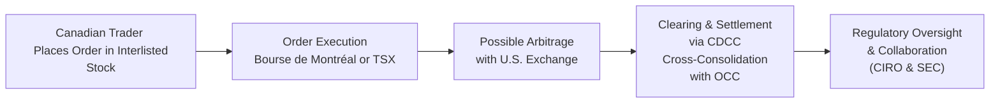

## 28.10 Cross-Border Coordination with U.S. Exchanges

Have you ever grabbed coffee with a friend who invests in U.S. stocks just so you could both talk about that weird moment when suddenly your Canadian brokerage flags a margin call—only because your stock is listed in both Canada and the U.S.? I once sat down with a colleague who used to joke: “I can’t even keep track of my positions in one currency—how in the world do people do this in two?” That question, in a nutshell, underscores the intricacies of cross-border coordination between Canadian and U.S. exchanges.

Cross-border coordination is a big deal (seriously). If a company’s stock is interlisted—like so many Canadian resource or banking stocks that are also traded on the NYSE or NASDAQ—then its options might be listed in both places, too. This arrangement opens up a world of possibilities for traders but also demands a level of regulatory and operational harmony that is pretty remarkable. Below, we’ll tackle key aspects of how Canada’s regulatory environment and U.S. markets collaborate so that traders (like you and me) can move smoothly between the two markets.

### Why Cross-Border Coordination Matters

The listed options markets in Canada and the U.S. are closely intertwined. When underlying stocks are trading on both sides of the border, the options often see correlated price movements. An investor in Toronto might capitalize on a small price discrepancy against the U.S. listing on the Chicago Board Options Exchange (CBOE). As you can imagine, if these markets weren’t well-coordinated, we’d see far more chaos—massive arbitrage opportunities, conflicting margin calls, or even corporate actions that get adjusted at different times.

Cross-border coordination rests on these foundational elements:

• Harmonizing trading hours to reduce gaps in liquidity.  
• Streamlining clearing to ensure timely settlement and reduce settlement risk.  
• Monitoring position limits consistently, so nobody can skirt the rules in one market while being constrained in the other.  
• Cooperating on corporate action adjustments—for instance, if a stock undergoes a split or there’s a special dividend.  

Honestly, it’s almost like choreographing a complex dance. One move in one market has to flow seamlessly into the next, or we’d see breakdowns in price discovery, compliance, and risk management.

### Interlisted Stocks and Dual-Listed Options

An interlisted stock is basically the same company’s shares trading on multiple exchanges. Think of a Canadian mining giant that lists on the Toronto Stock Exchange (TSX) and also on the NYSE. Where do the options trade? Both in Canada (on the Bourse de Montréal) and in the U.S. (on the appropriate U.S. options exchanges), a phenomenon called “dual-listed options.”

For example, let’s say Company X is a popular gold miner from northern Ontario, but it also has an ADR (American Depositary Receipt) traded on the NYSE. Meanwhile, Bourse de Montréal lists a series of calls and puts on the Canadian shares, and the CBOE might list calls and puts on the ADR. In theory, that’s two separate options classes referencing fairly similar underlying assets.

In practice, though, the price correlation is super high. A savvy trader might watch for price crazy enough to create an arbitrage opportunity—buying calls on one side of the border and shorting them on the other if the premium difference is suddenly out of whack. Without cross-border coordination, we could see big waves of capital chasing these discrepancies, which can destabilize the markets a bit. But thanks to robust communication between Canadian regulators (through CIRO) and U.S. regulators (the SEC, FINRA), plus the collaboration of the clearinghouses, these markets often move in lockstep.

### Regulatory Cooperation: CIRO, SEC, and FINRA

If you’ve been around the block in Canadian capital markets, you know that as of January 1, 2023, the previous SROs (IIROC and MFDA) legally amalgamated into the Canadian Investment Regulatory Organization (CIRO). Now in 2025, CIRO stands as the national self-regulator for investment dealers, mutual fund dealers, and marketplace integrity. Meanwhile, south of the border, public companies, broker-dealers, and securities professionals register with the U.S. Securities and Exchange Commission (SEC) and are subject to oversight by the Financial Industry Regulatory Authority (FINRA).

Why is that relevant? Well, if a Canadian broker grants a client direct market access to U.S. stocks and options, that broker has to comply with both Canadian rules under CIRO guidelines and the relevant U.S. rules overseen by the SEC and FINRA. For instance, if a big jump in the stock’s price triggers a cross-border margin call, the broker might need to verify that the margin calculations meet both sets of standards. If there’s suspicious trading activity (e.g., sudden shorting leading up to a major earnings release), the regulators might collaborate on an insider trading investigation. 

This cooperation is essential to catch cross-border manipulations. Insider leaks have no respect for physical borders, so if a tipster in Vancouver shares privileged info with a friend in New York, the two regulatory bodies will share data to track down anomalies and enforce the law.

### Harmonizing Trading Hours and Clearing Timelines

One nuanced challenge is aligning trading hours. The TSX and Bourse de Montréal typically align fairly well with New York markets, but occasionally there are differences, like Canadian holidays that don’t match U.S. holidays. If you’re looking to do a cross-listed arbitrage on a day that’s a statutory holiday in Canada, the Canadian trading might be closed. Meanwhile, the U.S. might be open, which can distort the perceived “true” price in the short term.

Furthermore, clearing is crucial here. In Canada, the Canadian Derivatives Clearing Corporation (CDCC) clears listed options, while in the U.S., The Options Clearing Corporation (OCC) does the job. These clearinghouses talk to each other—well, not literally like you and I chat—but they have established lines of communication and standard protocols to manage risk. If a position in Canada is offset by a position in the U.S., a large institution must ensure each side’s clearing entity is aware of how that offset is recognized (if at all) for margin.

### Position Limits, Margin Requirements, and Corporate Actions

Another area that demands cross-border synergy is the setting of position limits and margin requirements. Imagine we have an option class in Canada that allows a maximum of 25,000 contracts net on a large bank’s stock. Meanwhile, in the U.S., that same underlying might have a different limit. Suppose the U.S. exchange or the OCC sets a 30,000-contract limit. If you’re a big player, do you just take the larger limit in the U.S.? Actually, no—if you’re recognized as the same beneficial owner, or if your trades are recognized as being part of a single global position, you’ll generally have to comply with the stricter of the two sets of rules if you want to avoid trouble. That’s where the regulators’ cross-border data sharing can come into play.

Margin differences can also get tricky. Canada and the U.S. both rely on risk-based approaches, especially for derivatives that can have outsize leverage. But how they compute margin haircuts or recognize offsetting hedges might vary slightly. If you’re a retail trader dabbling in cross-border strategies, it’s wise to read up on both sets of rules—Canadian margin guidelines under CIRO and the margin rules enforced by FINRA in the States.

Finally, corporate actions can affect open options positions. If a stock does a stock split, changes its shares outstanding, or issues rights, the Bourse de Montréal and the U.S. options exchanges typically coordinate on contract adjustment bulletins. You don’t want an adjustment taking effect in one country a day earlier than in the other. That would be chaos.

### Minimizing Arbitrage Distortions

Arbitrage is all about capturing price differentials for essentially the same instrument. Cross-border coordination, in part, aims to narrow or mitigate these distortions, making sure that if the price difference arises, it’s quickly corrected by the markets themselves, not exploited because of inconsistent rules or mismatched corporate actions. Yes, there is still plenty of legitimate arbitrage: Hedge funds or prop shops that tie up capital in order to net a fraction-of-a-cent difference do so on a daily basis. But that difference is typically ephemeral. If it lingers, it’s usually an indication that something’s out of whack—like a big corporate event that’s recognized in an imbalanced way.

### The Role of Mutual Recognition Agreements

One particularly handy tool in cross-border coordination is the Mutual Recognition Agreement (MRA). An MRA means that two regulatory bodies—say, the SEC and certain provincial regulators in Canada, or CIRO—decide that each other’s oversight frameworks are robust enough to trust. In practice, this can allow a firm registered in one jurisdiction to operate in another with fewer duplicative steps, as long as it meets certain baseline standards. It also can help with cross-border investigative assistance.

There’s a broader principle here: If regulators trust each other, it’s easier for them to share information and keep a watchful eye on potential manipulation, wash trading, or any other anomaly. If they don’t trust each other, then each side tries to impose its own rules, potentially leading to conflicting processes.

### Differences in Trading Conventions

Anyone who’s traded in the U.S. instantly notices certain differences compared to Canada. For starters, the U.S. exchanges for options—such as CBOE, Nasdaq PHLX (PHLX), NYSE American, or others—list an often mind-boggling range of expiration cycles, sometimes weekly, daily, or even more exotic. The Bourse de Montréal also has weekly options, but the pattern and listing cycles can differ. The U.S. is big on decimalized quotes, while Canada also decimalizes (though that might not be a major difference anymore). Still, you might find subtle variances in the tick sizes between the two markets.

Also, as a cross-border participant, you have to watch for currency. If your portfolio is in Canadian dollars, you might need to hedge currency risk if you’re trading U.S.-denominated options. The big question is: “Which margin rules do I follow—my local broker’s or the exchange’s?” Usually, your local broker is obligated to follow the stricter of the two sets in order to remain in compliance with all relevant regulations.

### International Clearing Links and Settlement

When we talk about big institutions or global banks, they often rely on specialized clearing links. A Canadian subsidiary might clear domestically through CDCC for local positions but also maintain a direct clearing membership with OCC for U.S. options. Or they might have a cross-margining arrangement that recognizes certain hedges or net positions. These linkages reduce duplication but make the entire system so interconnected that robust oversight is critical.

If something goes wrong in one clearinghouse, the ripples could be felt elsewhere. That’s why you might find the folks at the Bank of Canada and the Federal Reserve paying close attention to these cross-border linkages during times of market stress. The global financial crisis taught us that risk can travel at lightning speed across national borders.

### A Quick Visual Overview of Cross-Border Coordination

Here’s a simple Mermaid diagram to illustrate how a cross-border order might be processed and cleared:

- A: The Canadian trader or broker enters an order.  
- B: The order executes locally on the Bourse (for options) or TSX (for stock).  
- C: If an arbitrage or offset is identified, a related transaction might occur on a U.S. exchange.  
- D: Clearing in Canada is done by CDCC, which coordinates with the OCC if there’s a U.S. leg to the trade.  
- E: Throughout the process, CIRO and the SEC are in communication to ensure compliance and share data if something looks fishy.

### A Brief Table Comparing Margin Requirements

Below is an illustrative table showing hypothetical margin differences between Canada and the U.S. for a single equity option. Assume the underlying price for the stock is CAD 100 (or USD 75 with a certain exchange rate). These numbers are purely for example:

| Criteria                          | Canada (CIRO Guidelines)               | U.S. (FINRA Thresholds)                          |
|-----------------------------------|----------------------------------------|--------------------------------------------------|
| Reg-T Margin for Long Options     | 100% of Premium                        | 100% of Premium                                 |
| Naked Call Margin Calculation     | Premium + % of Underlying (  up to 20%)  | Premium + % of Underlying (  typically 20-30%) |
| Covered Call Margin (in a Margin Acct)   | Stock Positions Must Meet CIRO   Equity Margin + Option Premium  | Allowed, but must comply with   Reg-T or House Rules  |
| Minimum Equity Requirement        | May differ depending on the   broker’s risk model, but must   meet CIRO minimums  | Typically $2,000 (USD)   but can be higher at the firm level |

Keep in mind that each broker can set higher “house” standards, so it’s wise to verify in your actual client agreement or broker policy manual—especially if you’re a day trader or you scale up your positions quickly.

### Potential Pitfalls and Best Practices

• Inconsistent Currency Conversions: You might be using a Canadian-dollar trading account, and the underlying is priced in USD. That can lead to some head-banging moments if your broker frequently adjusts your margin due to FX fluctuations.  

• Different Market Holidays: If you rely on active monitoring or auto-liquidation triggers, watch out for days when one market is closed and the other is open (Canadian Thanksgiving vs. U.S. Columbus Day, for instance).  

• Reporting Requirements and Tax Implications: If you realize gains in the U.S., or if you hold certain derivative positions at year-end, you might face different reporting flows for the Canada Revenue Agency (CRA) vs. the IRS. Double-check with a cross-border tax specialist or consult advanced reading on the subject of cross-border tax.  

• Corporate Action Timings: If you see a stock split notice in New York but haven’t seen it in Canada yet, it might just be a matter of the notice crossing the wires. Don’t panic. Usually, the Bourse de Montréal’s adjustments come soon thereafter. But if there’s a mismatch, talk to your broker right away.

### Real-World Example: A Hypothetical Bank Stock

Let’s say a major Canadian bank, call it Maple Bank, is interlisted on TSX and NYSE. The underlying is priced at CAD 80 in Toronto, which roughly translates to USD 60 in New York. The Bourse de Montréal lists standard and weekly options on Maple Bank. The NYSE has the listing (with multiple U.S. options exchanges offering calls and puts). Suddenly, Maple Bank announces a surprise dividend increase plus a share buyback. The Canadian and U.S. option markets react quickly. If you’re an investor with positions in both CAD and USD accounts, you’ll see immediate changes in your options’ extrinsic and intrinsic values.

Behind the scenes, a lot of cross-border phone calls, emails, or data feed confirmations might be happening between the Bourse and various U.S. entities: how to adjust position limits, verifying that short ITM calls might be immediately exercised to capture the dividend, etc. All that behind-the-scenes coordination ensures a consistent and fair market for all participants.

### Encouraging Continuous Learning

Cross-border coordination isn’t static. It evolves as markets continue to innovate—whether it’s new product listings, new technologies, or updated regulations. So if you find this topic fascinating, that’s great news; you’re never done learning. Here are a few resources to keep you in the loop:

• CIRO Guidance on Cross-Border Activities and Compliance:  
  <https://www.ciro.ca/>  

• SEC Website for U.S. Regulatory Guidelines, including cross-border broker-dealer registration:  
  <https://www.sec.gov/>  

• FINRA’s Oversight and Informational Resources:  
  <https://www.finra.org/>  

• “International Cross-Listing of Stocks: The Case of Canada and the United States,” an academic piece on cross-border listing benefits and complexities (several versions are publicly available in academic journals or online).  

• For clearing specifics, see the websites of the Canadian Derivatives Clearing Corporation (CDCC) and The Options Clearing Corporation (OCC).

### Wrapping It Up

It’s always exciting—and maybe a bit nerve-wracking—to trade in two regulatory arenas simultaneously. But it can also be rewarding, given the extra liquidity and potential for more diverse strategy combinations with interlisted and dual-listed options. The key is to remember that cross-border coordination, while complex, mostly works in our favor. It ensures we trade in a market environment that’s fair, efficient, and well-monitored. 

That said, never get complacent. Always pay attention to margin notices, watch out for currency differences, and keep an eye on corporate actions. Doing so will help you make the most of the dynamic relationship between Canadian and U.S. options markets.

---

## Sample Exam Questions: Cross-Border Coordination with U.S. Exchanges



### Which of the following best describes a “dual-listed option”?

- [ ] An option listed only on U.S. exchanges.  
- [ ] An option that can be traded in both Canada and Europe.  
- [x] An option on the same underlying security that is listed on exchanges across different jurisdictions (e.g., Canada and the U.S.).  
- [ ] A futures contract traded in multiple currencies.  

> **Explanation:** Dual-listed options refer to the same underlying security’s options being listed on multiple exchanges across different jurisdictions, typically allowing traders to trade them in more than one country.

### Which regulatory bodies are primarily responsible for overseeing cross-border stock and options trading between Canada and the U.S.?

- [x] CIRO in Canada and the SEC/FINRA in the U.S.  
- [ ] The U.S. Federal Reserve and the Bank of Canada.  
- [ ] The World Bank and the IMF.  
- [ ] The Bank for International Settlements (BIS).  

> **Explanation:** CIRO (in Canada) sets and enforces rules for Canadian investment dealers and mutual fund dealers, while the SEC and FINRA oversee securities trading in the U.S. This trio coordinates closely for cross-border activity regulation.

### What is the primary benefit of a Mutual Recognition Agreement (MRA) between Canadian and U.S. regulators?

- [x] It simplifies compliance and fosters trust between regulators in each jurisdiction.  
- [ ] It completely removes the need for all regulatory oversight.  
- [ ] It eliminates currency exchange fees for cross-border trades.  
- [ ] It bans arbitrage activities in dual-listed securities.  

> **Explanation:** An MRA helps each regulator recognize the other’s operational standards, enabling cross-border firms to operate more seamlessly without duplicative regulations.

### One key reason for harmonizing corporate action adjustments across Canadian and U.S. options exchanges is to:

- [ ] Make it more difficult for Canadian investors to trade in the U.S.  
- [ ] Avoid the use of weekly options in Canada.  
- [x] Ensure consistent treatment of option contracts following stock splits, dividends, or rights issues.  
- [ ] Restrict margin trading globally.  

> **Explanation:** Harmonized adjustments prevent confusion and arbitrage resulting from differing corporate action treatment between the two jurisdictions, helping maintain an orderly market.

### Arbitrage opportunities between Canadian and U.S. listed options on the same underlying typically arise due to:

- [ ] Exactly matched contract specifications and margin rules.  
- [x] Small price discrepancies or timing differences in corporate announcements or market hours.  
- [ ] Prolonged market closures in both countries.  
- [ ] Zonal restrictions imposed by each country’s regulators.  

> **Explanation:** Cross-border arbitrage thrives on price or timing differences. When a small discrepancy arises (e.g., due to corporate announcements), sophisticated traders will move to capture risk-free profit.

### Which of the following represents a potential challenge for a cross-border trader?

- [x] Managing currency conversions and margin requirements that differ across markets.  
- [ ] Trading the same position only in one currency.  
- [ ] Having unlimited position limits in both jurisdictions.  
- [ ] Eliminating the need for clearing by using a local broker.  

> **Explanation:** Cross-border traders must navigate different currencies, margin calculation methods, and sometimes different position limit rules.

### When a Canadian holiday doesn't coincide with a U.S. holiday, what potential issue might arise in cross-border trading?

- [x] A mismatch in trading days and potential arbitrage opportunities as one market is open while the other is closed.  
- [ ] The suspension of clearing by CDCC and OCC.  
- [ ] The complete delisting of options on the Canadian side.  
- [ ] The mandatory termination of all cross-border positions.  

> **Explanation:** When one market is closed, price discovery or hedging in the other market might still occur, temporarily creating anomalies or arbitrage conditions.

### In cross-border options trading, which clearinghouses coordinate the settlement of Canadian and U.S. options, respectively?

- [ ] CRA and IRS  
- [x] CDCC in Canada and OCC in the U.S.  
- [ ] CIRO and SEC  
- [ ] TSX and NYSE  

> **Explanation:** The Canadian Derivatives Clearing Corporation (CDCC) handles clearing for Canadian listed derivatives, whereas The Options Clearing Corporation (OCC) does so in the U.S., often collaborating for cross-border positions.

### An interlisted stock is:

- [ ] A stock traded in multiple currencies but only on one exchange.  
- [x] A stock traded on more than one exchange, often in multiple countries.  
- [ ] A currency pair traded on FOREX markets.  
- [ ] An equity that is banned from trading outside its home country.  

> **Explanation:** Interlisted stocks are typically traded on more than one exchange; for example, many Canadian companies also list on U.S. exchanges (NYSE or NASDAQ).

### True or False: Cross-border coordination between the Canadian and U.S. markets completely eliminates all arbitrage opportunities.

- [ ] True  
- [x] False  

> **Explanation:** While effective coordination can reduce or narrow crosses in pricing, complete elimination of arbitrage is practically impossible. Small price and timing discrepancies will always exist as markets react to news and exchange rate shifts.


