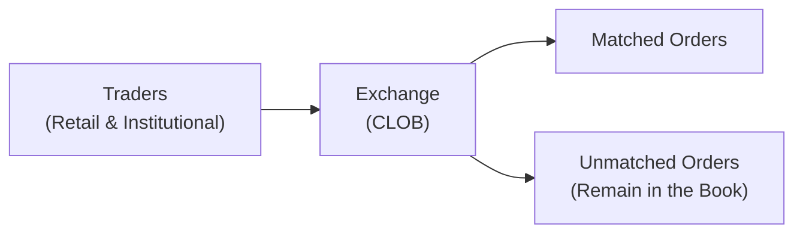

## 28.2 Providing a Trading Forum

Have you ever found yourself thinking, “Gosh, I’d really like to trade options, but where on Earth do I do that?” Well, you’re not alone. The concept of a centralized “trading forum”—where buyers, sellers, high-frequency traders, retail investors, and more all meet to exchange securities—is at the very heart of listed options trading. This forum is largely provided by an organized exchange, which ensures transparent price formation, orderly markets, and adherence to regulatory guidelines. Let’s walk through how this forum is set up, why it matters, and how everyone from small private investors to massive institutional players relies on it.

  
### The Heart of a Trading Forum

An options exchange is basically the designated host for the financial party. Imagine there’s a giant digital marketplace—some might picture an old-school trading pit, but, in reality, everything is now mostly electronic. It’s here that all the action happens. Traders submit orders; the exchange’s matching engine lines them up, checks who’s willing to buy or sell at which price, and executes transactions based on priority rules and real-time data. 

Now, some folks might say, “Isn’t that basically an online marketplace?” Yes, indeed. But it’s got extra layers of oversight and safety nets to ensure integrity. Exchanges work under the watchful eye of regulators like CIRO (the Canadian Investment Regulatory Organization). They have strict guidelines on everything from margin requirements to short-sale restrictions to best execution obligations. Essentially, an exchange’s role is to create a fair and transparent meeting place for all participants.

  
### Central Limit Order Books in Action

At the core of listed options trading is the Central Limit Order Book (CLOB). Think of the CLOB as this giant digital bulletin board that sorts all the buy and sell orders by price. Suppose you decide to buy a call option on your favorite stock—your order flows into the exchange’s CLOB, which lines up your bid against any existing offers. If your bid matches someone else’s offer, ping! The trade is instantly executed.

It’s a bit like an auction house. Everyone can see what price is being proposed, and the highest buyer meets the lowest seller. This system promotes transparency. You can look at the quotes (bids and asks) and instantly see how many contracts are available at which prices. No special deals behind the curtain; everything is out in the open.

Anecdotally, the first time I traded options (back in the day), I was amazed by how many order updates remained visible in the marketplace. Just watching that order book can feel like a mesmerizing dance of numbers. Maybe that sounds dorky, but if you’ve ever stared at a live order screen, you’ll get what I mean.  

#### Mermaid Diagram: Basic CLOB Interaction

**Explanation:**  
• Traders from all walks of life submit their orders (various prices, quantities) to the exchange.  
• The exchange’s matching engine constantly evaluates orders, executing them when a match can be found (i.e., where the price of a buy order meets the price of a sell order).  
• Any unexecuted portion of an order generally remains on the CLOB at the stated price until it’s filled or canceled.

  
### Participants and Market Liquidity

Now, who exactly shows up in this marketplace? Quite a cast of characters:

• Retail Investors: These are individuals trading from home or through online brokerage accounts. They might be hedging a portfolio or simply speculating on short-term price movements.  
• Institutional Traders: Think of hedge funds, pension plans, or mutual funds. They might use derivatives for risk management or alpha generation strategies.  
• High-Frequency Trading (HFT) Firms: They place super-fast trades, often capturing fractional price differences. They’re like the “speed demons” of the market.  
• Market Makers: Entities registered with the exchange to provide continuous quotes, ensuring there’s always a bid/ask for certain option series.  

Why does having all these folks matter? Simple: liquidity. The more participants, the tighter the spreads (i.e., the difference between buying and selling prices). That’s good for everybody. More liquidity means you can get in and out of positions at fair prices without causing big price swings.

  
### Regulatory Framework and Market Integrity

Exchanges, especially in Canada, aren’t free-for-alls. Everything is governed by the rules set by CIRO, the consolidated self-regulatory body that oversees investment dealers and marketplace activity. As of 2025, CIRO ensures that:

• Each registrant has enough capital to meet obligations.  
• Trading and sales practices abide by best execution guidelines—meaning you, as a client, should get the absolute best possible fill under prevailing market conditions.  
• Short selling rules are followed. If you’re selling an option or shorting an underlying security, you must comply with margin requirements and locate the shares.  

So, let’s say you place an order to short an option on the Bourse de Montréal. Your broker has to route it properly, ensure margin checks are passed, and confirm any locate requirements (for underlying short sales, if applicable) are satisfied. The exchange itself also enforces market-wide rules—for instance, forcing cancellations of erroneous trades to maintain market integrity.

  
### Margin Requirements and Risk Controls

“Margin” is probably one of the biggest concerns for folks who trade derivatives. When you sell an option (effectively going “short”), the exchange requires that you post collateral to cover potential losses if the market goes against you. The specifics are spelled out in both the exchange’s rules and CIRO guidance.

Now, margin requirements aren’t just random. They’re a buffer for the worst unexpected market moves. Canada has historically followed a prudent approach to margin. Additionally, the Bourse de Montréal has guidelines for futures margin, and for listed options, you’ll see either strategy-based margin requirements or portfolio margining for more sophisticated accounts. 

All of these margin rules tie into the function of the clearing corporation—like the Canadian Derivatives Clearing Corporation (CDCC). The clearinghouse ensures that for every buyer, there’s a seller, and vice versa, guaranteeing trade settlement if either party defaults. The exchange, the clearinghouse, and the regulators all cooperate to keep risk in check.

  
### Execution Priorities: Price-Time, Size-Time, and Beyond

Once your order is in that big digital stack, how does it get filled? Exchanges use certain execution priority rules, such as:

• Price-Time Priority: The best-priced order goes first. If multiple orders share the same price, the earliest entered gets priority.  
• Size-Time Priority: Some markets might prioritize large-sized orders at a given price.  

To keep it fair, any upgrades in price typically jump to the front of the queue. This encourages continuous improvement of quotes, something that fosters narrower bid-ask spreads. In a sense, the exchange is creating a little competition among buyers and sellers to see who’s willing to make a better market.

  
### Technology Infrastructure

It’s nearly impossible to talk about providing a trading forum without discussing technology. Modern exchanges are built on robust electronic systems. These systems:

• Handle order routing: Your trading platform (through your broker) sends the order to the exchange’s matching engine.  
• Handle market data dissemination: The exchange blasts out real-time quotes and trades. Many third-party vendors and data feeders ingest that information. The Bourse de Montréal publishes a variety of market data feeds (https://www.m-x.ca/mark_feeds_en.php) that participants and vendors can subscribe to.  
• Provide order entry controls: There are limits on how quickly or how large orders can be placed, especially for risk management.  

This structure is especially critical for HFT. High-frequency traders rely on lightning-fast data to place trades in microseconds. Now, we can debate the pros and cons of HFT, but it undoubtedly adds to the overall liquidity and volume in the options market. The important thing for the exchange is to maintain a level playing field, making sure no one gets unfair access to the market data or speed advantage beyond what’s offered by co-location or other paid exchange services.

  
### Short Selling and Other Strategies

Short selling is interesting because it’s not just about selling something you don’t own in the equities market; with listed options, short selling can also mean writing (or selling) an option contract when you don’t hold the underlying. To do this, you typically need:

• Adequate margin in your account.  
• Permissions and approvals from your broker.  
• Knowledge of the risk. Writing a naked call, for instance, can result in theoretically unlimited losses if the underlying’s price soars.  

Exchanges enforce these rules because they want to avoid a scenario where someone sells a bunch of calls and can’t cover the associated capital requirement. That would threaten not only that trader but undermine market stability.  

  
### Best Execution Requirements

One more crucial responsibility that flows into how a trading forum operates: best execution. Brokers are obligated—by CIRO rules and other regulatory frameworks—to seek the best possible result for their clients. That means they might route the order to a specific exchange, a dark pool, or some symmetrical order matching venue if they believe it’ll get you the best price, the quickest fill, or the least market impact. 

That said, when you’re trading listed options in Canada, the Bourse de Montréal is the primary (and often only) venue. So there may not be as many competing marketplaces as there are in, say, U.S. equities. Still, brokers are expected to handle your order with care, ensuring you don’t get a raw deal.

  
### Monitoring and Surveillance

Exchanges don’t just offer the forum; they also police it. Using sophisticated surveillance technology, they monitor:

• Unusual trading patterns that could signal market manipulation or insider trading.  
• Potential quote stuffing by HFT firms.  
• Compliance with position limits—for instance, ensuring a single entity doesn’t hold more than the allowed number of open contracts in a given option.  

They coordinate with regulators (including CIRO) to investigate suspicious trades or other red flags. This ensures the market remains fair and transparent.

  
### Real-World Case Study: Market Volatility and Exchange Resilience

Think back to major market events, like the 2020 market turbulence around global events. Exchanges had to handle unprecedented order flow volumes. Some retail brokers paused certain trades or changed margin requirements to manage risk, but the exchange itself continued matching trades as orders poured in. That’s the power of a robust marketplace: it stands tall even when volatility surges—provided everyone’s trades are properly margined and regulated.

A friend of mine who trades volatility strategies told me how hectic it got during that period—he had to track circuit-breakers, keep an eye on exchange alerts, and watch for increased margin demands. Yet, trades continued to clear. That resilience is one of the main reasons we have a centralized, regulated forum in the first place.

  
### Additional Resources

If you’re enthusiastic about diving deeper:  
• [CIRO Trading Conduct Rules](https://www.ciro.ca/) – The official rulebook that outlines how trading activities must be conducted in Canada.  
• [Market Data Feeds from the Bourse de Montréal](https://www.m-x.ca/mark_feeds_en.php) – A direct source of information if you want to see how quotes and trades flow in real time.  
• “Options, Futures and Other Derivatives” by John C. Hull – It’s a classic textbook if you want a deeper theoretical and practical understanding of derivatives, including how they trade on exchanges.  

You might also look to open-source financial data libraries (like certain Python or R packages) to simulate or analyze historical trading forum data. Tools such as “quantstrat” in R or “Backtrader” in Python can be helpful for learning about how orders might behave in a simulated environment.

  
### Reflecting on the Exchange’s Role

At the end of the day, providing a trading forum is about creating a fair, transparent environment in which participants from all corners of the market can interact. Exchanges—particularly in Canada—play an indispensable role in monitoring trades, ensuring compliance with margin rules, enabling short selling (with guardrails), and upholding best execution. In a world of near-instant electronic trades and massive HFT operations, we rely on the exchange’s structure to keep everything organized and above board.  

As you continue your journey in derivatives, remember that you’re leveraging a system meticulously designed to balance freedom of trading with the safety of the marketplace. The next time you put in an order to buy or sell an option, picture that big CLOB on the exchange side—click, click, your order’s in line, waiting for a match. That’s how the magic happens, day in and day out.

  
## Sample Exam Questions: Providing a Trading Forum



### Which entity is primarily responsible for creating a transparent environment where listed options can be traded?  
- [x] A recognized Exchange  
- [ ] A group of private market makers acting off-exchange  
- [ ] An unregulated social media platform  
- [ ] A private equity consortium  

> **Explanation:** Regulated exchanges handle order flow, establish matching engines and rules, and ensure transparency and fairness.

### What is the main function of a Central Limit Order Book (CLOB) in options trading?  
- [ ] Grant preferential treatment to large traders  
- [x] Aggregate orders and match them based on price/time priority  
- [ ] Ensure all orders are executed at the same price  
- [ ] Stop trading during volatile conditions  

> **Explanation:** A CLOB brings together all buy and sell orders in one place and prioritizes them according to price/time rules, promoting transparency in trade execution.

### Which of the following participant types likely provides the fastest trades in a modern electronic exchange forum?  
- [ ] Traditional pension fund manager  
- [x] High-Frequency Trading (HFT) firm  
- [ ] Retail investor using phone orders  
- [ ] Exchange floor brokers  

> **Explanation:** HFT firms specialize in algorithmic trading executed at extremely high speeds, often in microseconds.

### Why do exchanges impose minimum margin requirements for certain options positions?  
- [ ] To encourage smaller traders to participate  
- [x] To minimize counterparty risk and prevent systemic defaults  
- [ ] To inflate exchange profits through higher fees  
- [ ] To eliminate short selling strategies  

> **Explanation:** Margin acts as collateral designed to protect counterparties (and the clearinghouse) from default risks if the market moves against the trader’s position.

### Best execution means:  
- [ ] Placing the order on the largest exchange, regardless of price  
- [ ] Always matching the national best bid and offer  
- [x] Routing the order in a way that achieves the most advantageous outcome for the client  
- [ ] Pricing an order based on the average of all quotes available  

> **Explanation:** Under regulatory standards, brokers must strive to ensure clients receive the best possible price and overall execution conditions.

### An advantage of having multiple participant types (retail, institutional, HFT) in an options exchange forum is:  
- [x] Enhanced liquidity and narrower bid-ask spreads  
- [ ] Longer settlement times  
- [ ] Reduced order matching speed  
- [ ] Lack of regulatory oversight  

> **Explanation:** Greater diversity in trading participants typically leads to deeper liquidity and tighter spreads, benefiting all traders.

### If your limit order doesn’t fully execute immediately, the unfilled portion typically:  
- [ ] Is canceled automatically  
- [x] Remains on the exchange’s order book until filled or canceled  
- [ ] Goes to a hidden dark pool  
- [ ] Is matched at the next day’s opening  

> **Explanation:** Any unfilled portion stands on the CLOB, ready to be matched with an opposing order, unless you place specific instructions otherwise.

### One key role of an exchange’s trading surveillance system is to:  
- [ ] Guarantee all trades are profitable  
- [ ] Calculate individual trader’s future tax liabilities  
- [x] Detect and prevent market manipulation or suspicious activities  
- [ ] Provide free market data to all participants  

> **Explanation:** Exchanges use monitoring tools to identify suspicious patterns (e.g., potential front-running, price manipulation) and preserve market integrity.

### Short selling in the context of listed options can refer to:  
- [x] Writing an option contract without holding the underlying asset  
- [ ] Purchasing additional shares for your portfolio  
- [ ] Selling a security at a price lower than yesterday’s close  
- [ ] Prohibiting any speculations on price declines  

> **Explanation:** When you write a call option without owning the underlying, it’s effectively creating a short exposure, requiring margin coverage.

### True or False: The exchange ensures that all participants receive unfair access to market data and trade execution.  
- [x] True  
- [ ] False  

> **Explanation:** This is intentionally a bit tricky. The statement says participants receive “unfair access,” which is incorrect. Exchanges strive to provide fair (not unfair) and equitable access. The correct answer is “True” only if you recognize the statement is ironically worded—but in practice, the real principle is that participants should get fair and equal access.  


