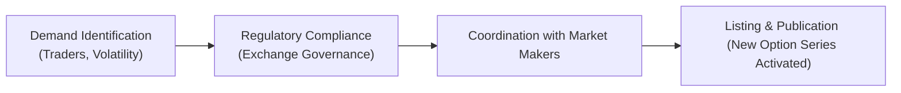

## 28.4 Adding and Deleting Option Series

Sometimes, you might look at a list of options on a particular stock or index, and the range of strike prices or expiration dates seems downright massive—almost endless. Then, two weeks later, you notice even more strike prices have appeared, or some series mysteriously disappeared. Why does that happen? Well, in this section, we’re going to talk about how and why stock and index option exchanges in Canada (and worldwide) add new option series and why they sometimes remove them. It’s not magic—it’s the result of a well-defined process, influenced by market demand, liquidity considerations, regulatory rules, and a desire for an orderly marketplace.

Before we dive in, let’s clarify how SRO oversight works: as of 2023, the Canadian Investment Regulatory Organization (CIRO) is the primary national self-regulatory body overseeing both investment dealers and mutual fund dealers in Canada. If you remember hearing about IIROC or MFDA in the past, those were the predecessor SROs that merged to form CIRO. Today, Bourse de Montréal (referred to simply as “the Bourse” by many) lists and trades standardized options on Canadian stocks and indexes and works with the Regulatory Division within the Bourse, alongside CIRO, to ensure that new option series—and those on their way out—are handled appropriately and consistently.

––––––––––––––––––––––––––––––––––––––––––

### Understanding the Concept of an Option Series

An option "series" is one precise combination of:
• Underlying security (e.g., a stock or an ETF).  
• Strike price (the price at which the underlying can be bought or sold).  
• Option type (call or put).  
• Expiration date (the day the option ceases to exist).  

An option “class,” by contrast, refers to all the calls and puts for a single underlying security. Within that class, each unique strike–expiration combination is an “option series.” For instance, a call option on the hypothetical company Maple Leaf Tech Inc. with a strike price of CAD 50 expiring in December 2025 is a separate series from the identical call but expiring in January 2026.  

If you trade options, you’re constantly choosing between these different series—maybe you want a near-the-money strike with just a month to go, or you prefer a far out-of-the-money put that expires in six months.

––––––––––––––––––––––––––––––––––––––––––

### When and Why New Option Series Are Added

When an exchange lists a new option class (i.e., the underlying itself is newly eligible for options), it has to decide which expiration dates and strike prices to start with. But even after an option class has been around for years, the exchange might introduce new strike prices or new expirations, known collectively as new “series.”  

There can be several triggers:

• Demand from traders or market makers.  
• Changes in the underlying’s price or volatility.  
• Corporate actions such as stock splits, mergers, or special dividends.  
• Regulatory or operational guidelines requiring more granular or more frequent strike increments.  

You might be thinking: “But how do they know when we want a new strike price?” Exchanges generally look at metrics like trading volume, open interest, and how close existing strikes are to the underlying market price. If a stock has just rallied, say from CAD 52 to CAD 70, new at-the-money strike prices in the high 60s or 70s might be warranted. Alternatively, if the stock’s volatility is skyrocketing—imagine earnings announcements or major news—traders might request additional near-the-money or far out-of-the-money strikes to handle the increased demand for hedging or speculation.

––––––––––––––––––––––––––––––––––––––––––

### Criteria for Adding a New Option Series

Each exchange has a set of policies that detail how they add new series. The Bourse de Montréal, for example, outlines many of these guidelines in its Rules and Policies, often supplemented by Regulatory Division Notices. Although every exchange has its nuances, the criteria typically include:

• **Market Demand and Requests**: Sometimes, a large institutional client or multiple traders will inform their broker or the exchange that they need certain strikes for hedging or speculation. If enough demand is confirmed, the exchange may list those strikes.  
• **Gentle Nudges from Market Makers**: Market makers constantly monitor supply and demand. If they see a gap in coverage—like no available calls around a certain strike—they might suggest a new series.  
• **Underlying Price Volatility**: Exchanges keep an eye on implied volatility. During periods of high volatility, smaller increments between strikes might be justified so traders can precisely hedge or speculate.  
• **Exchange and Regulatory Guidelines**: Exchanges operate under rules mandated in part by CIRO bulletins. In the past, we referenced IIROC bulletins; today, CIRO bulletins and Bourse de Montréal notices specify how new strikes or expiries are introduced and how to maintain fair access for all participants.  
• **Corporate Events**: If a stock is about to undergo a spin-off or a big corporate restructuring, or it’s about to distribute a special dividend, the exchange might add series around the key event dates to accommodate hedging demand.  

When these criteria are met, the exchange doesn’t just flip a switch—it will coordinate with market makers, key brokerage firms, and clearing entities to ensure that everyone can handle the new listing.  

––––––––––––––––––––––––––––––––––––––––––

### Coordination with Market Makers

Remember, market makers stand ready to buy or sell at quoted prices to maintain a liquid market. When a new option series is added, the exchange typically notifies the relevant market makers. Those market makers then prepare to provide quotes (both bids and offers) as soon as possible so that actual trading can commence immediately and, hopefully, with minimal friction.

In many respects, a new option series might start off with somewhat wider bid-ask spreads or lower volume if it’s an obscure strike. Over time, those spreads might narrow, especially if the new strike becomes popular and sees enough trades. The partnership between the exchange and market makers is essential—nobody wants to see a new option series with no quotes or unreasonably wide spreads that turn off potential traders.

––––––––––––––––––––––––––––––––––––––––––

### Regulatory Requirements for Timely Publication

Regulatory expectations also influence how quickly an exchange must communicate the addition of new series. There is a concept called “timely publication”—the notion that all market participants should learn about the availability of new series at roughly the same time. This prevents information asymmetry, where only a privileged few know that certain strikes or expirations exist.  

In Canada, the Bourse de Montréal and CIRO coordinate bulletins to inform member firms, brokerage platforms, and the broader market any time new option series are introduced. These updates are also typically disseminated through official channels such as the Bourse’s website (https://www.m-x.ca/) and in various vendor data feeds.

Here’s a quick, high-level flowchart, showing a simplified version of how new option series get added:

Typically, these steps happen very quickly—often within a day or two after the exchange decides that new strikes or expirations are needed.

––––––––––––––––––––––––––––––––––––––––––

### Adjusting Strikes Around Earnings and Corporate Actions

It’s not unusual for an exchange to roll out new strikes ahead of major announcements—like an earnings release for a high-flying tech company or a routine but still significant event for a large bank. In these cases, implied volatility can spike, and demand for options at more precise or far-out strikes might soar.  

Additionally, if a company implements a stock split or issues a special dividend, the existing strikes must often be “adjusted” or “rewritten,” and new series might be introduced to reflect the new prices. If you once watched your CAD 100 call on a stock transform into multiple calls at some new ratio after a stock split, that’s exactly the kind of behind-the-scenes process we’re talking about. For more details, check out Bourse de Montréal’s circulars or Corporate Action Notices. They contain the official explanation of how strike prices and contract multipliers are adjusted.

––––––––––––––––––––––––––––––––––––––––––

### How Option Series Are Deleted or Expire

Now, how about deletion? An option series can “go away” for several reasons:

1. **Natural Expiration**: The simplest explanation is that options have an expiration date. Once that date passes, the series ceases to exist (though open positions may face exercise or assignment if they’re in-the-money at expiration).  
2. **Lack of Volume or Open Interest**: Exchanges may decide to formally delist certain strike–expiration combinations that remain completely inactive for a set period. This doesn’t happen all the time, but if an option sees zero volume across multiple trading sessions, whatever open interest remains is minimal or nonexistent, and no new trades seem likely, the exchange might choose not to keep listing it.  
3. **Corporate Action-Related Consolidation**: Sometimes, after a merger or acquisition, the underlying stock no longer exists or is replaced by shares of a new entity. In these cases, the old option series might be adjusted or removed entirely.  

Keep in mind that “deletion” usually refers to the exchange deciding not to list new contracts for that same series in subsequent cycles, rather than evaporating open positions. If somebody is already holding that option, it will still exist until the day it expires or is exercised. But no new trades (or maybe no new opening trades) might be allowed in that particular strike, effectively rendering it unavailable to new participants.

––––––––––––––––––––––––––––––––––––––––––

### Pitfalls and Best Practices for Traders

For the average trader or institutional desk, the addition or removal of option series can introduce certain pitfalls:

• **Liquidity Issues**: New series might not have robust liquidity at first. A wide bid-ask spread can impact a trader’s ability to get in or out at a fair price.  
• **Corporate Actions**: If you’re analyzing an option chain, watch out for major corporate actions. That CAD 50 strike might suddenly be adjusted to CAD 45.50 if there’s a special dividend or spin-off.  
• **Managing Complex Strategies**: If you’re building multi-leg strategies—say, a spread that includes a newly listed call strike—it’s possible your leg might not fill quickly if liquidity is still building.  
• **Regulatory Updates**: Always remain aware of new bulletins from CIRO or the Bourse. Those bulletins often detail changes in margin requirements, listing standards, or new series expansions.  

Anyway, most platforms do a pretty good job labeling newly introduced strikes, so if you’re scanning an option chain for a particular underlying, you’ll quickly see which strikes just came online.

––––––––––––––––––––––––––––––––––––––––––

### Real-World Example: Introducing New Strikes for a Canadian Bank

Let’s say Maple Royal Bank (MRB) is trading at CAD 100. Over the next few weeks, the stock rallies to CAD 118 after releasing stunning quarterly results. Traders start clamoring for calls with strike prices around CAD 120 or CAD 125, anticipating further upside.  

1. **Demand**: Brokerage firms and institutional desks send requests or mention their needs to the Bourse or they place quotes for out-of-the-money calls that don’t exist yet.  
2. **Exchange Deliberation**: The Bourse checks its guidelines. The underlying is quite liquid (it’s a major Canadian bank), and implied volatility is climbing. The Bourse sees a strong rationale to add new calls at CAD 120, 125, and maybe 130 for the next few expiration months.  
3. **Market Maker Coordination**: The Bourse sends out a notice telling market makers that new series will be introduced next Monday. The market makers set up their quoting models to ensure that on Monday morning, they can offer or bid on these new MRB calls.  
4. **Listing and Publication**: On Monday morning, the official data feed updates. Trading screens show new series, and market makers post initial quotes.  
5. **Ongoing Activity**: If the underlying continues to push upwards, these new calls might see strong volume and open interest. If the demand fizzles, they might remain lightly traded, possibly leading to wider spreads.  

Market participants get official bulletins about these new strikes, ensuring a level playing field. Over time, the new calls might become popular enough to remain in the chain for several months until they eventually expire.

––––––––––––––––––––––––––––––––––––––––––

### Tools and Resources for Monitoring Option Series

If you’re looking to stay on top of newly added series or potential delistings, you have several resources:

• **Bourse de Montréal’s Website (https://www.m-x.ca/)**: Check regulatory notices and bulletins.  
• **CIRO (https://www.ciro.ca)**: Keep an eye on updates and bulletins that might affect the listing or delisting of certain series.  
• **Option Data Analytics Platforms**: Tools like ORATS (https://orats.com/) and various Volatility Lab services provide insights on newly listed strikes, changes in implied volatility, and open interest.  
• **Brokerage Platforms**: Most brokers have an “Alerts” section for newly added series, especially if they detect unusual volume or a jump in implied volatility.

Staying informed helps you avoid confusion or missed trading opportunities when new option series appear.  

––––––––––––––––––––––––––––––––––––––––––

### Personal Anecdote: The Mystery of the Missing Strikes

Let me share a quick personal story: one summer, I was messing around with a mid-cap energy stock’s option chain. After some big news about new drilling sites, the stock’s implied volatility soared. Within a week, the exchange introduced additional calls above the new market price. Great—perfect for a bullish call spread I had in mind. But about a month later, the hype totally vanished, volume dried up, and I noticed that some of the newly introduced strikes were essentially ghost towns. By the next quarter’s listing cycle, those out-of-the-money calls were nowhere to be seen—just gone, not even in the chain. That’s a perfect illustration of how options might be introduced to meet an immediate need but then quietly taken off the board if there’s zero follow-through.

––––––––––––––––––––––––––––––––––––––––––

### Glossary

• **Option Series**: A specific type of option with the same underlying, strike, expiration date, and right (call or put).  
• **Strike Price**: The predetermined price at which the option holder can buy (call) or sell (put) the underlying.  
• **Expiration Date**: The last day the option contract is valid. After this date, the contract ceases to exist.  
• **Open Interest**: The total number of outstanding option contracts that haven’t been liquidated or exercised.  
• **Implied Volatility**: The market’s expectation of how much the underlying’s price might fluctuate over a certain period.  
• **Market Makers**: Firms or individuals obligated to provide buy and sell orders for a security, thus ensuring liquidity and orderliness in the market.

––––––––––––––––––––––––––––––––––––––––––

### References and Additional Resources

• **Bourse de Montréal Regulatory Division Notices**:  
  – https://www.m-x.ca/ (Look for “Circulars” and “Regulatory Division Notices” linked in the main navigation.)  
• **CIRO Bulletins**:  
  – https://www.ciro.ca/ (The new comprehensive self-regulatory organization’s website for bulletins and market integrity notices.)  
• **ORATS**:  
  – https://orats.com/ (Advanced data analytics platform that can track implied volatility, open interest, and newly added strikes.)  
• **Volatility Lab Tools**:  
  – Various brokerage or third-party sites (some open source, some subscription-based) that let you graph and monitor changes in implied volatility.  
• **Corporate Actions**:  
  – For official guidelines on how corporate actions affect options, see the Bourse’s relevant notices or “Corporate Action” resource pages, which outline how strike prices are adjusted.

––––––––––––––––––––––––––––––––––––––––––

### Concluding Thoughts

Adding and deleting option series is all about keeping the market healthy, liquid, and relevant. As underlying prices move, or as demand emerges for unique hedge or speculation positions, new strikes and expirations pop up. Meanwhile, old or unneeded series quietly fade away, especially once their expiration date has passed or if nobody is trading them anymore. From a trader’s perspective, it’s incredibly helpful to stay on top of these changes: it opens doors to fresh trade ideas, tightens your hedging capabilities, and gives you a clear sense of where the market’s interest lies.

So the next time you scan an option chain and see a brand-new set of strikes, don’t be alarmed. It’s just the exchange reacting to shifting market conditions, trying to give you (and everyone else!) the tools needed to navigate the market effectively.

––––––––––––––––––––––––––––––––––––––––––

## Sample Exam Questions: Adding and Deleting Option Series



### Which of the following is part of the standard definition of an option “series”?

- [ ] The underlying and the delta of the option
- [x] The underlying, the strike, the option type, and the expiration date
- [ ] The daily volume and implied volatility
- [ ] The option’s intrinsic value alone

> **Explanation:** An option series is specifically defined by its underlying, strike price, expiration date, and whether it is a call or put.

### Which key factor often triggers the listing of new option series on a heavily traded stock?

- [ ] A sudden decrease in open interest
- [ ] A momentary dip in implied volatility
- [ ] A general decline in overall daily volume
- [x] A sharp change in the underlying’s price or demand from major traders

> **Explanation:** Markets commonly add new option series when demand for hedging or speculation increases, often driven by sharp price movements or heightened volatility.

### What mechanism do exchanges typically use to ensure fairness when new option series are introduced?

- [x] Timely public bulletins or notices to all market participants
- [ ] Sending private emails to select institutional traders
- [ ] Only updating market makers via a private data feed
- [ ] Requiring all brokerages to request new series individually

> **Explanation:** Exchanges and regulators aim for equal access to information. Timely bulletins or notifications ensure all participants learn of the new series simultaneously.

### Which of the following is a reason an option series might be removed from the listed chain?

- [ ] The underlying stock splits 2-for-1
- [x] The option series has been entirely inactive with no open interest
- [ ] There is too much liquidity being offered by market makers
- [ ] Implied volatility remains unchanged over several weeks

> **Explanation:** Lack of volume and open interest can lead an exchange to delist a dormant option series. A stock split, on the other hand, usually triggers an adjustment of strikes rather than outright removal.

### When a company has a highly anticipated earnings announcement forthcoming, an exchange may:

- [ ] Refuse to list any new series until after the announcement
- [x] Add new strike prices to accommodate higher implied volatility
- [ ] Permanently reduce the number of existing strikes
- [ ] Temporarily halt trading until the event has passed

> **Explanation:** Anticipating a demand surge for options, exchanges often add new strikes around significant corporate events like earnings releases.

### Which regulatory organization currently oversees exchanges and investment dealers in Canada?

- [ ] IIROC (the Investment Industry Regulatory Organization of Canada)
- [ ] MFDA (the Mutual Fund Dealers Association)
- [x] CIRO (the Canadian Investment Regulatory Organization)
- [ ] CIPF (the Canadian Investor Protection Fund)

> **Explanation:** IIROC and MFDA were the predecessor organizations that amalgamated into CIRO. CIPF protects investor assets but does not regulate exchanges.

### What is a primary reason for coordinating with market makers when introducing a new option series?

- [ ] To restrict trading to top hedge funds only
- [x] To ensure new series have immediate liquidity and quote availability
- [ ] To guarantee artificially wide bid-ask spreads
- [ ] To permit only short-selling transactions on new series

> **Explanation:** Market makers are crucial providers of liquidity. Coordination ensures these new contracts start trading without severe liquidity problems.

### How do corporate actions like stock splits often affect existing option series?

- [x] They result in adjustments to terms such as strike prices and contract sizes
- [ ] They cause immediate delisting of all option series
- [ ] They have no impact on existing option series
- [ ] They prevent new option listings for at least 30 days

> **Explanation:** Major events like stock splits or special dividends typically lead to adjusted strike prices or contract sizes to preserve the economic value of open positions.

### According to the article, which of the following best describes “timely publication” of listing changes?

- [x] Releasing information on new or deleted series at the same time to all market participants
- [ ] Maintaining secrecy around new strikes for 24 hours to prevent front-running
- [ ] Publishing bulletins only after a 7-day implementation period
- [ ] Sending confidential memos to retail traders only

> **Explanation:** “Timely publication” means that new information—such as the addition or removal of an option series—is made available to everyone simultaneously.

### True or False: Once an option series is delisted due to inactivity, any existing open positions are immediately canceled.

- [ ] False
- [x] True

> **Explanation:** Tricky question. Actually, this statement is false in most contexts. Even when a series is removed from active listing, existing open positions usually remain valid until they expire or are closed. The series is simply no longer available for new opening transactions. So, the correct answer is that the statement is false.  


