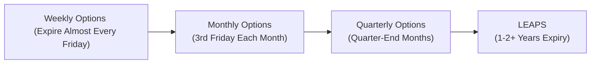

## 28.5 Expiration Cycles on the Bourse

Have you ever been so focused on finding the perfect options strategy that you, um, forgot the actual expiration date was around the corner? Well, I’ve made that mistake once (okay, maybe twice). Let’s talk about how the Bourse de Montréal handles expiration cycles so that you’re never caught off guard again. By the end of this section, you’ll understand exactly how options expiration is structured—covering monthly expirations, weekly expirations, quarterly cycles, and even LEAPS (Long-Term Equity AnticiPation Securities). And I promise, no frantic last-minute scrambles!

### Understanding Expiration Cycles
An expiration cycle is simply the schedule determining when an options contract stops trading and either expires worthless or is exercised/assigned. On the Bourse de Montréal (often referred to as “the Bourse”), these cycles follow a pattern similar to many global derivatives exchanges:

• Standard monthly expirations typically fall on the third Friday of each month.  
• Weekly options often expire every Friday (unless a holiday shifts the schedule).  
• Quarterly options align with quarter-end months for institutional rebalancing.  
• LEAPS provide long-dated expirations, often up to two years or more in the future.

Your approach to trading options will often hinge on these cycles. For instance, shorter-dated weekly options may be a better fit for you if you want to capture time decay quickly or implement short-term speculation. Longer-dated LEAPS might be more attractive if you’re looking at strategic hedges or directional bets that span six, twelve, or even twenty-four months.

Before diving into the details, let’s check out a quick visual overview of these expiration cycles:

This schematic shows how each type of option might fit into your broader trading calendar. 

### Monthly Options
Monthly expirations form the backbone of listed options on the Bourse. These are typically referred to as “standard” options and expire on the third Friday of each month. One quick note: even though "the third Friday" is the official day, the last trading day typically ends the day before if the actual third Friday is a holiday. Always consult the Bourse’s official trading calendar at [Bourse de Montréal](https://m-x.ca/) to confirm the precise cutoff times.

• Time Value Impact: As you inch closer to the third Friday, you’re also racing against time decay. Options lose value more swiftly in their final weeks, especially the last few days before expiration. If you’re holding short positions, this accelerated decay can be appealing. If you’re long options, though, it may be a source of frustration—or a reason to roll over your position.  
• Liquidity Considerations: Monthly options tend to have the greatest liquidity compared to weekly or longer-dated contracts. This suggest you may see tighter bid-ask spreads, making them cost-effective for many typical hedging or speculative strategies.

### Weekly Options
Do you ever want to take a stand on the market for just a few days? Enter weekly options! These often expire every Friday (excluding the monthly cycle’s third-Friday standard). The Bourse’s listing of weekly options caters to short-term traders who thrive on micro moves or react to near-term news events—like earnings announcements, economic data releases, or last-minute portfolio adjustments.

• Rapid Time Decay: It’s common knowledge that time decay accelerates as an option approaches expiration. Weekly options, with their very short lifespan, serve up that time decay on a silver platter—ripe for harvest if you’re fond of short premium strategies.  
• Frequent Roll-Overs: The short window to expiration can be both a blessing and a curse. Yes, you can adjust fast, but you’ll also need to roll or close positions frequently to manage assignments and keep your risk profile in check.  
• CIRO Notices and Margin: Weekly options may come with unique margin rules adopted by the Canadian Investment Regulatory Organization (CIRO). The short cycle can pose distinct risk-management issues, so check out current CIRO guidelines to ensure compliance.

### Quarterly Options
Quarterly expiration cycles are usually popular among institutional investors—like pension funds and insurance companies—who manage large portfolios and want their rebalancing points to coincide with the end of fiscal quarters. The Bourse might also list “End-of-Quarter” options that expire on the last business day of March, June, September, and December.

• Institutional Rebalancing: Many big players realign positions at quarter-end. Holding or writing quarterly options can align your strategy with these large flows.  
• Liquidity Variation: Volume in quarterly options can sometimes be lower than monthly options until we approach the actual quarter-end (then it might spike). So if you’re venturing into quarterly expiration, keep an eye on open interest and the potential for wider bid-ask spreads if you try to exit or alter your position prematurely.  

### LEAPS (Long-Term Equity AnticiPation Securities)
If you’re a fan of thinking way ahead, LEAPS might be your new best friend. With expirations that can extend one to two years or even longer, LEAPS are a favorite for investors who want to adopt a longer-term position without the day-to-day churn of short-dated contracts.

• Long-Dated Time Value: Because LEAPS capture a wide time horizon, the portion of time value in these premiums is generally higher than in short-dated options.  
• Strategies and Hedging: One might buy LEAPS calls for a long-term bullish stance on a stock or an index. Or you might purchase LEAPS puts as a portfolio hedge. In either scenario, LEAPS let you implement extended time strategies with a fraction of the capital outlay compared to buying the underlying outright.  
• Rolling Forward: Especially if you’re near the end of one LEAPS cycle and still want to maintain your position, you might consider a roll-forward to another long-dated series.  

### The Official Trading Calendar
“It’s Friday—do you know where your options are?” Actually, that question is probably best answered by the Bourse de Montréal’s official trading calendar, which is available at [m-x.ca](https://m-x.ca/). This calendar details:

• The precise final trading date for each option class.  
• Any holiday disruptions that shift the normal schedule.  
• The final settlement times (which can be different for physically vs. cash-settled contracts).

Always, always check the calendar. I can’t tell you how many times someone asked, “Wait, why can’t I trade tomorrow?” only to realize a holiday changed the last trading day. 

### Assignment and Settlement
Once an option hits expiration, in-the-money contracts may be assigned if you’re short, and automatically exercised if you’re long—subject to the Bourse’s rules (and your broker’s policy). Understanding how assignment risk fits in with expiration cycles helps you avoid rude surprises.

• Early Assignment: For short calls on stocks that pay dividends, early assignment can sometimes occur right before the ex-dividend date. Watching quarterly cycles for big dividend payers is crucial because it’s more likely to happen there.  
• Cash vs. Physical Settlement: In some index options, settlement might be cash-based, and in equity options, settlement is typically physical. Monthly and weekly cycles have similar settlement rules, but it’s always wise to confirm the contract specifications.

### Implications for Time Value and Price Decay
No matter which expiration cycle you choose, time value is your constant companion—and eventual nemesis if you’re a long option holder. Here’s a quick refresher:

• Time Value Diminishes Quickly: Short-dated options, like weekly ones, will see their time value evaporate at a faster pace than monthly or quarterly options. Meanwhile, LEAPS have more time value because, well, you’ve got a lot more time.  
• Gamma and Vega: Closer to expiration, an option’s gamma (rate of change of delta) becomes more pronounced, while vega (sensitivity to implied volatility) might reprice quickly on any volatility shifts.  

### Rolling Over Positions
If you’re approaching expiration and still want to keep your strategy alive, rolling over is a go-to tactic:

• Close Current Options: You’d typically buy-to-close if you’re short the option, or sell-to-close if you’re long.  
• Reopen a New Position: Choose a new contract with a later expiration (and possibly a different strike if your outlook changed).  
• Adjusting Strikes or Type: With each new cycle, you can reevaluate your delta exposure, gamma risk, and time horizon.  

Remember that rolling over isn’t free. You’ll be paying close attention to the cost of opening the new position, potential differences in implied volatility, and any commissions involved.

### Regulatory Considerations
The Canadian Investment Regulatory Organization (CIRO) publishes margin and risk guidelines that affect short-term and long-term options. Weekly options, for instance, can carry unique margin implications because of their short cycle and heightened gamma risk. Be aware that:

• Firms must follow CIRO’s margin rules for both short and long positions.  
• The Bourse might have additional capital requirements or special procedures for market makers who quote across multiple expiration points.  
• CIPF (Canadian Investor Protection Fund) coverage applies to client investment accounts if a member firm fails, but that doesn’t spare you from market losses.  

### Practical Examples
You might have a portfolio of Canadian bank stocks, and you want to hedge downside risk for the upcoming month. You could buy monthly put options expiring on the next third Friday. If, however, you anticipate a major interest rate announcement next week, you might prefer purchasing weekly puts to capture the immediate volatility. Another scenario: an institutional manager sees that a quarter-end is approaching, anticipating large index rebalancing flows. They could sell or buy quarterly index options to ride the wave of that predictable institutional volume.

Let’s illustrate a potential scenario:  

• You hold 1,000 shares of ABC Corp, currently trading at CA$50.  
• You’re worried about a short-term drop due to an upcoming earnings release, two weeks away.  
• You decide to buy weekly puts expiring in two weeks—maybe an at-the-money strike at CA$50.  
• Because weekly puts have a short lifespan, you pay a modest time premium, but you’re also going to see that option decay quickly if the drop doesn’t happen soon.  
• If the stock plummets to CA$45 before expiration, your put could buffer your losses. On the other hand, if the stock remains steady at CA$50, your put’s time value fizzles out.

### Personal Reflection
I remember the first time I chose weekly options: I was super excited because of the lower premium. But I grossly underestimated how fast the time value melted. By the time the big market event occurred, my option’s premium had mostly evaporated. Live and learn! Paying attention to expiration cycles, volatility patterns, and time decay is huge. 

### Common Pitfalls
• Forgetting that “Third Friday” might land on a holiday—leading to a final trading day on Thursday.  
• Failing to roll your position in time, resulting in unwanted assignment or forced liquidation.  
• Overlooking the effect of ex-dividend dates in early assignment scenarios.  
• Taking on more weekly option exposure than your margin or risk tolerance can handle.  

### Tips and Best Practices
• Always consult the Bourse’s calendar and cross-reference with any CIRO bulletins.  
• Decide if a monthly, weekly, quarterly, or LEAPS expiration aligns better with your time horizon.  
• Monitor implied volatility trends—short-dated options pricing can shift drastically around major news or earnings announcements.  
• If your strategy is based on short gamma, keep extra margin cushion, especially for rapidly approaching expirations.  
• Use roll-over strategies prudently: weigh transaction costs against the potential benefits of continuing the trade.  

### References and Further Reading
• [Bourse de Montréal Expiration Calendars](https://m-x.ca/) – Official site for updates, holiday schedules, and last trading dates.  
• CIRO (Canadian Investment Regulatory Organization) – [https://www.ciro.ca](https://www.ciro.ca) for margin notices and guidelines.  
• Thomsett, Michael. “The Complete Guide to Option Strategies.” – A thorough resource for understanding how expiration affects option valuations and risk profiles.  
• For open-source charting tools to track options pricing, consider using [QuantLib](https://www.quantlib.org/) for advanced modeling.  

### Conclusion
At first glance, expiration cycles can seem like a mundane detail in the grand scheme of derivatives trading. Yet, the day (and even the hour) your option expires can make or break your entire trade. Whether you gravitate toward weekly options for agile positions, rely on monthly expirations for liquidity, or use LEAPS for long-term strategic plays, it all revolves around a single pivotal moment: expiration. Stay organized, keep an eye on the Bourse’s official calendar, and double-check your positions. By mastering these cycles, you’ll be in a much better position to harness time decay, manage roll-overs, and avoid any nasty surprises.

----

## Sample Exam Questions: Expiration Cycles on the Bourse



### Which standard expiry date is most commonly used for monthly options on the Bourse de Montréal?

- [ ] First Friday of the month
- [ ] Second Monday of the month
- [x] Third Friday of the month
- [ ] Last Friday of the month

> **Explanation:** Standard Canadian (and many other global) listed options typically expire on the third Friday each month. Always confirm any holiday adjustments on the Bourse’s official calendar.

### How do weekly options primarily differ from monthly options?

- [ ] They have higher margin requirements.
- [x] They typically expire every Friday, rather than on the third Friday of each month.
- [ ] They lack any time value.
- [ ] They are only available in OTC markets.

> **Explanation:** Weekly options expire much more frequently (almost every Friday), providing a short-term vehicle compared to standard monthly expirations.

### When might an early assignment be most likely?

- [ ] Right after a contract’s listing date.
- [ ] Immediately after a quarterly earnings release.
- [x] Just prior to an ex-dividend date for the underlying stock.
- [ ] Only on the last trading day of the contract.

> **Explanation:** Short call positions on dividend-paying stocks face a greater likelihood of early assignment just before an ex-dividend date, as some holders of long calls aim to capture that dividend.

### What is one potential benefit of choosing LEAPS over short-term options?

- [ ] LEAPS have zero time value.
- [ ] LEAPS settle daily rather than monthly.
- [x] LEAPS allow traders to hold a long-term position with a single contract, often one or two years out.
- [ ] LEAPS are never exposed to assignment risk.

> **Explanation:** LEAPS (Long-Term Equity AnticiPation Securities) let you maintain a position for a year or longer, reducing the need to frequently roll over your contract.

### Why do many institutional investors prefer quarterly expirations?

- [ ] Because quarterly options never expire worthless.
- [x] Because they align with quarter-end rebalancing cycles for large portfolios.
- [ ] Because they are significantly cheaper than monthly options.
- [ ] Because regulations prohibit monthly option use by institutions.

> **Explanation:** Quarterly options are popular among institutions that align hedging and portfolio rebalancing with quarter-end schedules.

### What is the primary advantage of rolling over an option position before expiration?

- [x] It extends your exposure to the market while avoiding unwanted exercise or assignment.
- [ ] It guarantees zero cost.
- [ ] It eliminates any capital gains tax on the closing transaction.
- [ ] It’s only required for call options, not puts.

> **Explanation:** Rolling over a position helps traders maintain their strategy beyond the current expiration without incurring the potential obligations of assignment.

### Which regulatory body oversees margin requirements and market integrity for listed options in Canada?

- [ ] The MFDA (Mutual Fund Dealers Association), which is still active for all dealers.
- [ ] IIROC, which remains responsible for derivatives trading.
- [x] CIRO (Canadian Investment Regulatory Organization).
- [ ] Only provincial commissions without national coordination.

> **Explanation:** As of January 1, 2023, the MFDA and IIROC amalgamated into CIRO. It’s Canada’s sole self-regulatory body for investment and mutual fund dealers, also overseeing market integrity for derivatives.

### Which options contract type typically features the greatest time value portion in its premium?

- [ ] Weekly options
- [ ] Monthly options
- [ ] Quarterly options
- [x] LEAPS

> **Explanation:** LEAPS can span one to two years or more, conversely holding a higher time value component than shorter-term options.

### What is a key challenge when trading quarterly options compared to monthly options?

- [x] Lower liquidity until approaching the quarter-end.
- [ ] Prohibitive commissions.
- [ ] Mandatory early assignment for any profitable position.
- [ ] No official calendar to track expiration.

> **Explanation:** Quarterly expirations often have lower trading volume, which can make it harder to enter or exit positions efficiently until quarter-end activity picks up.

### True or False: The time value of an option’s premium tends to decay more rapidly as expiration approaches.

- [x] True
- [ ] False

> **Explanation:** It’s well-documented that an option’s time value decays at a quicker rate in the final weeks and days before expiration.


