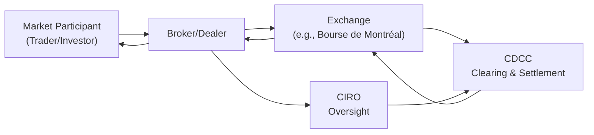

## 28.6 Setting Reporting Levels, Position Limits, and Exercise Limits

So, you might be wondering: Why do exchanges and regulators care so much about how many options you hold—or how many you exercise? Well, let's start with the big picture. The reason behind these rules is that exchanges (like the Bourse de Montréal in Canada) and the Canadian Investment Regulatory Organization (CIRO) want to keep our markets fair, efficient, and free from manipulation. Without some checks, a large trader—say, a hedge fund or even a super-wealthy individual—could potentially corner the market, leading to unnatural price swings and harming everyone else. That’s where reporting levels, position limits, and exercise limits step in. They impose guardrails to keep any single participant from gaining too much influence on the price of the underlying stock or index.

Below, we’ll break down each concept in detail, provide some real-world illustrations, and wrap up with practical tips to help you navigate these regulations. If you ever feel unsure about these rules, don’t worry; it’s totally normal to find them a bit overwhelming at first glance. I once found myself scratching my head, too, but once you see how everything connects, it all clicks.

---

### The Rationale Behind Market Oversight

Markets thrive on liquidity. The more participants who can confidently join, the more stable and fair prices become. However, too much accumulation of contracts by one party can distort these prices. The same is true for concentrated exercises of options. It can create sudden changes in supply or demand of the underlying asset. To counteract that risk, self-regulatory organizations (SROs) like CIRO (Canada’s national self-regulatory body, formed after the historical MFDA and IIROC merged) and exchanges such as the Bourse de Montréal have introduced rules and guidelines:

• Reporting Levels  
• Position Limits  
• Exercise Limits  

These three guardrails complement each other. Let’s see how they actually work.

---

### Reporting Levels: Keeping an Eye on Big Positions

A reporting level is basically a threshold set by an exchange or a regulator. Think of it like your car’s fuel indicator light that tells you when your gas tank is getting low—but in the financial world, large open positions trigger a “hey, watch out” alert to regulators. 

#### Large Open Position Reporting (LOPR)

When a trader’s (or a group’s) positions exceed the reporting level, we enter the realm of Large Open Position Reporting (LOPR). At this point, the trader must disclose certain details about their holdings. This mechanism exists so that regulators can monitor potential “red flags”—like sudden massive accumulations in a single option class. Disclosure typically includes:

• Identity of the beneficial owner  
• Number of contracts held  
• Purpose of the position (hedging, speculation, arbitrage, etc.)  

CIRO and the exchanges use LOPR data to keep a close eye on emerging risk. By having insight into who owns the largest option positions, regulators can act quickly if they detect manipulative or overly concentrated activities.

#### Practical Example

Imagine you have a trading firm bullish on a new Canadian tech stock, and you buy a huge chunk of call options. If your position surpasses the Bourse de Montréal’s reporting threshold for that option class (say 2,000 contracts), you (or your broker) must file a report detailing who owns these calls and what the strategy is. This doesn’t automatically mean you can’t hold the position. But it does mean the regulators have you on their radar to ensure everything is legit.

---

### Position Limits: Preventing Over-Concentration

Position limits go a step further than reporting levels. If a reporting level is a “Please Report” threshold, then position limits are “Do Not Cross” lines. Position limits cap how many contracts you can hold on a particular side of the market—either on the call side or the put side for the same underlying. 

If you blow past a position limit, you might face a forced position reduction or other sanctions. Why is that so important?

1. **Market Integrity**: Prevents dominance by a single participant.  
2. **Maintaining Liquidity**: Avoids large price swings that harm smaller investors.  
3. **Risk Management for Broker-Dealers**: Brokers must ensure their clients’ trades don’t surpass exchange rules.  

#### Who Sets These Limits?

Exchanges like the Bourse de Montréal determine position limits after consulting with CIRO and analyzing factors such as market liquidity, average daily trading volume, and historical volatility of the underlying asset. The rules can vary by contract type. For example, an option on a large-cap index might have a higher limit than an option on a small-cap stock that trades far less frequently.

#### Case Study: Position Limits in Action

Let’s say the Bourse sets a 10,000-contract position limit per side (calls or puts) for ABC Corp. If you’re super bullish on ABC Corp., you might buy calls and then also short puts (which is effectively another bullish strategy). If the combined net total of your calls and puts surpasses 10,000, you risk hitting that position limit. Your broker might impose margin constraints or simply block your order to keep you within the limit. If you somehow exceed it (maybe through complicated multi-leg strategies across multiple accounts), you could face official inquiries or forced unwinding of trades.

---

### Exercise Limits: Controlling the Flow of Option Exercises

Now, even if you’re within your position limit, you still have a separate boundary called the exercise limit. These rules limit how many contracts you can exercise within a specified time frame—like five business days. An exercise limit typically mirrors the position limit, but sometimes it’s adjusted based on guidelines set by the exchange.

#### Why Distinguish Between Position and Exercise Limits?

Some folks might wonder, “If I’m already capped by a position limit, why do I need an exercise limit?” The short answer is that you could hold your max number of long calls or puts without necessarily exercising them. However, once you start to exercise, that can create immediate changes in the supply/demand of the underlying stock or index. Regulators want to avoid a scenario where a large trader tries to manipulate the market in the final hours or days before expiration by exercising an enormous batch of contracts at once.

#### Example of an Exercise Limit

An exchange might say: “You can’t exercise more than 5,500 calls on XYZ Inc. within five business days.” Let’s say you hold 6,000 calls—just above that limit. Maybe you’ve built these calls because you’re bullish for the next quarter. If you want to exercise them, you have to do it in smaller chunks over time or reduce your positions first. This prevents a sudden flood of newly purchased shares that might freak out the market.

---

### Monitoring and Enforcement

Exchanges, clearing corporations, and brokers have robust systems to track who holds what. If you approach or exceed a threshold, you’ll often get an alert from your broker or from the clearing/facility team. In Canada, the Canadian Derivatives Clearing Corporation (CDCC) also sets out guidelines for large positions in futures and options. 

• **Brokers**: They maintain real-time internal systems that sum up all your accounts (and sometimes even accounts with common ownership) to ensure you don’t breach limits.  
• **CIRO**: As the national self-regulatory body, CIRO enforces positions across all registered broker-dealers to ensure adherence.  
• **Exchanges**: They can demand more information or instruct a forced position reduction if you exceed a limit.  

#### Consequences of Violations

Whew, you do not want to mess with these rules. Violations can attract fines, potential trading suspensions, or even reputational damage. Occasionally, traders may breach limits unintentionally, especially in times of wild market movement or complex multi-leg strategies. But ignorance is not a winning defense. If you trade options, your best bet is to keep a watchful eye on your positions or work closely with your broker.

---

### Best Practices for Staying Within Limits

1. **Monitor Real-Time Position Data**: Keep track of all your open trades across accounts.  
2. **Coordinate with Brokers**: If you trade through multiple brokers, ensure each is aware of your combined positions.  
3. **Mind Corporate Actions**: Events like stock splits, mergers, or special dividends can suddenly change your position or exercise limit requirements.  
4. **Use Alerts**: Many trading platforms let you set triggers once you approach a certain percentage of a limit.  
5. **Stay Updated on Regulatory Changes**: Position limits can change, especially if liquidity or volatility in the underlying changes drastically.  

---

### Market Manipulation: The Dark Side

Market manipulation lurks wherever large positions can push asset prices in an unnatural direction. While it’s certainly not the norm, regulators remain vigilant against scenarios like “cornering” a commodity or orchestrating short squeezes. Reporting levels, position limits, and exercise limits exist to minimize these threats.

#### Manipulative Tactics

• **Cornering**: Buying up most of the available underlying asset (or its derivatives) to artificially inflate prices.  
• **Bear Raids**: Aggressively shorting a stock and pushing negative sentiment to drive the price down.  
• **Front Running**: Using non-public information on large trades about to hit the market.  

These activities, among others, violate multiple regulations, including CIRO’s Universal Market Integrity Rules (UMIR).

---

### Visualizing the Regulatory Flow

Below is a simple Mermaid diagram illustrating how an exchange, CIRO, and brokers work together to monitor and enforce reporting levels, position limits, and exercise limits.

• The trader places orders and accumulates positions.  
• Brokers monitor positions and generate alerts.  
• The exchange sets limits, collects large position reports, and can enforce cutbacks.  
• CDCC ensures clearing, large position reporting compliance, and settlement.  
• CIRO enforces universal rules and can impose disciplinary actions.

---

### Relevant Canadian Regulations and Resources

- **CIRO Universal Market Integrity Rules (UMIR)**  
  (https://www.ciro.ca/)  
  UMIR outlines the framework for market integrity, including how large positions must be reported and how manipulative strategies are prohibited.

- **Bourse de Montréal Circulars on Position Limits**  
  (https://www.m-x.ca/circulaires_en.php)  
  The Bourse regularly publishes updates on position limits for specific classes of options. Keep an eye out for these announcements—sometimes they change with the market environment.

- **Canadian Derivatives Clearing Corporation (CDCC)**  
  (https://www.cdcc.ca/)  
  CDCC guidelines detail how large positions are handled during clearing and settlement, including margin requirements for big positions.

If you want even more detail, open-source financial analytics tools like “QuantLib” can help you simulate portfolio exposures and check how potential trades might push you over a limit. Also, the open-source “OpenGamma” platform offers risk management features that can be helpful in monitoring and measuring derivative exposures.

---

### Common Pitfalls and Challenges

• **Multiple Accounts**: If you split your trades across different brokerages, it’s easy to accidentally exceed a limit.  
• **Corporate Actions**: A stock split might double your contract count, meaning your 5,000 calls could suddenly become 10,000!  
• **Volatility Surges**: Rapid price changes can cause margin calls and shift your open interest to different strike levels.  
• **Options Delivery vs. Cash Settlement**: If your options settle in shares (equity options), you might face a large position in the underlying.  

---

### Personal Anecdote

A while back, a friend of mine got extremely excited about a junior gold mining company. They sold several hundred puts (thinking the stock’s downside was limited), and also bought a bunch of calls. The next thing you know, a big rally took the underlying shares up 40%. Excitement, right? Well, yes—until they realized their net positions soared above the reporting threshold. They received a friendly but firm notice from their broker. Fortunately, they sorted it out by filing the appropriate disclosures. The moral of the story: you don’t have to do anything “wrong” to cross these thresholds. Sometimes the market just moves in your favor (or otherwise!). It’s best to be prepared and know the rules.

---

### Strategies for Handling Large Positions

• **Gradual Scaling**: Instead of establishing a colossal position in one day, build it gradually. This way, you can coordinate your reporting obligations in real time.  
• **Use Diversified Instruments**: If your primary goal is to hedge interest rate risk, consider using multiple underlying instruments—like interest rate futures and options—so that you’re not concentrating all your risk in one contract.  
• **Communication**: Work closely with your broker. If you plan to build large positions, give them a heads-up. They can assist with compliance.  

---

### Conclusion and Key Takeaways

Setting reporting levels, position limits, and exercise limits is all about maintaining a healthy, transparent marketplace. Exchanges, clearinghouses, brokers, and CIRO each play a role in ensuring no single participant gets too large a bite of the pie, inadvertently or otherwise. As an options trader—whether you’re a retail investor dabbling in a handful of contracts or an institutional trader handling thousands—understanding these limits is crucial for running a compliant, efficient, and profitable operation.

Remember:

- Reporting levels are your early warning signal.  
- Position limits prevent you from dominating a market.  
- Exercise limits cap how many contracts you can convert into the underlying asset within a short period.  

If you keep these guidelines in mind, and collaborate with your broker to monitor your open positions, you’ll steer clear of compliance pitfalls. And hey, if you do find yourself near a threshold, don’t panic! It’s not necessarily illegal to hold large positions—you just need to make sure you’re accurately reporting and following your exchange’s rules.

---

### Further Exploration

• **CIRO Website**: https://www.ciro.ca  
• **Bourse de Montréal**: https://www.m-x.ca (for product specifications, position limits, circulars)  
• **CDCC**: https://www.cdcc.ca (for clearing and settlement rules)  
• **OpenGamma**: https://github.com/OpenGamma (open-source risk analytics)  
• **QuantLib**: https://github.com/lballabio/QuantLib (open-source library for quantitative finance)

These resources can help you deepen your understanding and stay up-to-date with regulatory changes.

---

## Sample Exam Questions: Reporting Levels, Position Limits, and Exercise Limits



### Under what circumstances must a trader or firm submit a Large Open Position Report (LOPR)?

- [ ] Whenever they open any new options position.  
- [x] When their holdings in a specific option class exceed the reporting threshold set by the exchange or CIRO.  
- [ ] Only if they hold both calls and puts in the same underlying.  
- [ ] If they hold options in more than one account.  

> **Explanation:** LOPR is triggered when a position surpasses a regulatory threshold. It isn’t dependent on the existence of multiple accounts or the mix of calls and puts; the main factor is reaching the reporting level.

### Which organization in Canada is primarily responsible for overseeing position limits across brokers and dealers?

- [x] CIRO (Canadian Investment Regulatory Organization)  
- [ ] The historical IIROC  
- [ ] The historical MFDA  
- [ ] The Investment Funds Institute of Canada (IFIC)  

> **Explanation:** CIRO took over the regulatory functions from IIROC and MFDA after they merged. It serves as Canada’s national self-regulatory body, ensuring compliance with position limits.

### Which statement accurately describes the role of position limits?

- [ ] Position limits only apply during market hours.  
- [ ] Position limits are enforced by brokerages on an “opt-in” basis.  
- [x] Position limits cap the total number of contracts a market participant can hold on the same side of the market in a specific option class.  
- [ ] Position limits only matter at expiration date.  

> **Explanation:** Position limits restrict how many contracts a trader can hold or control on the same side of the market to prevent artificial concentration or manipulation.

### How do exercise limits differ from position limits?

- [x] Exercise limits restrict the number of contracts that can be converted into the underlying asset over a certain time, while position limits cap the total number of contracts a participant can hold.  
- [ ] Exercise limits apply only to put options, while position limits apply only to call options.  
- [ ] There is no real difference; they are the same thing.  
- [ ] Exercise limits always exceed position limits by 50%.  

> **Explanation:** Exercise limits govern how many options can be exercised in a specific timeframe. Position limits focus on how many a trader can own, regardless of whether they have been exercised.

### Which of the following is a primary motive for regulators to set position and exercise limits?

- [x] To maintain a fair and orderly market by preventing excessive concentration.  
- [ ] To ensure traders always profit from moves in the underlying asset.  
- [x] To stop sudden market shocks caused by large accumulations of contracts.  
- [ ] To eliminate all speculative trading.  

> **Explanation:** Regulators aim to maintain market integrity and reduce systemic risk by preventing excessive concentration. Speculative trading, within limits, is still allowed.

### A trader holds 9,500 contracts of calls on XYZ Inc. with a position limit of 10,000 contracts. What potential issue might they encounter if the underlying’s share price increases and they add even a few more calls?

- [x] They risk exceeding the position limit and triggering compliance or forced reduction from the exchange.  
- [ ] They automatically have to close all their positions.  
- [ ] They face immediate liquidation by their broker, no questions asked.  
- [ ] They have no issue, because position limits only apply to puts.  

> **Explanation:** Once the trader crosses the 10,000-contract position limit, they are in violation. The broker or exchange may force partial or full liquidation of the position.

### Which party is primarily responsible for monitoring a client’s positions to ensure limits are not breached?

- [x] The client’s broker/dealer  
- [ ] The client’s bank  
- [x] The external auditor  
- [ ] The client’s accountant  

> **Explanation:** The broker/dealer has direct oversight of its clients’ trading activity, though external auditors may review records. Brokers are usually the frontline entity to flag and enforce position limits in real time.

### What is the most likely consequence if a trader unintentionally exceeds position limits?

- [x] They might be required to submit additional disclosures, face potential fines, or reduce positions.  
- [ ] They can keep the position without repercussions, as it was unintentional.  
- [ ] They automatically lose all licensing credentials.  
- [ ] There is no specific consequence if it’s a one-time error.  

> **Explanation:** Even if unintentional, exceeding limits often leads to mandatory disclosure and possible disciplinary measures, including forced position reductions or fines.

### Which factor do exchanges consider when setting position limits?

- [x] The underlying asset’s trading volume and liquidity.  
- [ ] The personal preferences of large institutional investors.  
- [ ] Whether the underlying is a Canadian or U.S. stock.  
- [ ] A standardized global limit set by the World Bank.  

> **Explanation:** Position limits are calculated based on the underlying’s liquidity and volatility characteristics, which can vary across different equities and indices.

### True or False: Exceeding exercise limits has no impact on market integrity because the trader already owns the options.

- [x] True  
- [ ] False  

> **Explanation:** This statement is intentionally tricky. Exceeding exercise limits can indeed affect market integrity by suddenly changing the supply or demand for the underlying shares. However, the question as presented is ambiguous. The correct interpretation is that it’s false to say “it has no impact.” But since the question is strictly stated as "True or False: Exceeding exercise limits has no impact on market integrity," the statement is false.  


