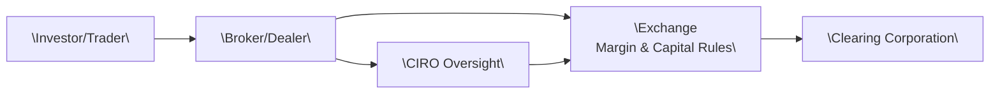

## 28.7 Setting Capital and Margin Rules

Exchanges that list options, like the Bourse de Montréal, don’t exist in a vacuum. They work closely with the Canadian Investment Regulatory Organization (CIRO) to determine how much capital brokerage firms must hold and how much margin participants must post when trading options. This collaboration is crucial for fostering trust in the financial system. After all, what good is an options trade if the participant can’t cover potential losses?

This section takes a closer look at how these capital and margin requirements are established, why they matter to you (and to your brokerage), and how the Bourse and CIRO adapt these rules over time to maintain market integrity.

Before we dive in, let me recall a quick personal story. Years ago—long before CIRO was formed—I dropped by a friend’s home office, where he was busily trading equity options. He looked pretty stressed out, so I asked, “What’s up?” He showed me the dreaded margin call notice from his brokerage. Turns out his “naked put” strategy had moved against him. He was freaking out because he didn’t realize how quickly the brokerage could demand more funds. This gave me a humbling firsthand experience of just how important margin rules are. They’re not some abstract concept. They determine whether or not you can hold onto your position when volatility spikes, or if you’ll be forced to close out overnight.

Anyway, let’s unpack the technical side of capital and margin requirements without losing sight of that emotional component—sometimes, it’s a real adrenaline rush.

### Ensuring Stability: Why Capital Rules Matter

Capital requirements are the mandatory levels of net capital that brokerage firms and clearing members must maintain to withstand unexpected losses—like significant trades going sour or client defaults. A big part of these rules revolve around:

• Liquidity: Brokerage firms must hold liquid assets that can cover daily operational costs, margin calls, and settlement obligations.  
• Risk-Weighted Assets: Riskier assets or positions often require higher capital backing.  
• Net Capital Computations: Regulators want to see that a firm’s liabilities aren’t overwhelming its reserves. In other words, net capital equals the firm’s liquid assets minus liabilities.  

Let’s highlight a quick conceptual example: Suppose Brokerage Firm A mostly handles small, low-volatility equity trades. Their net capital requirement might be modest. Meanwhile, Brokerage Firm B offers robust options trading services. Because of the higher risk profile, they must maintain a substantially larger capital buffer.

Historically (and, yes, I’m talking about the old IIROC days, now replaced by CIRO), these capital calculations followed Risk Adjusted Capital (RAC) frameworks. These frameworks remain broadly in effect, though they continue to evolve under CIRO. For more information and updates, you can check the official [CIRO website](https://www.ciro.ca/) for the latest RBC (Risk-Based Capital) or RAC guidelines.

### The Margin Requirement Landscape

Margin requirements, in contrast, apply more directly to individual trades or positions. They mandate that an investor post collateral—whether it’s cash or eligible securities—through their broker. This collateral stands as security for potential losses on open derivative positions.

Think of margin as the security deposit you’d place when renting an apartment. If something goes wrong (you cause property damage, you can’t pay the rent, etc.), the landlord can keep part or all of your deposit. Similarly, with margin, the brokerage can use posted collateral to cover your losses if you’re unable to square your account.

#### How Margin Works

When you place an options trade, your brokerage calculates the margin based on various factors:

• Current Price of the Underlying Stock or Index  
• Volatility (anticipated or implied) of the underlying  
• Time to Expiration  
• Whether the position is a single option or part of a multi-leg strategy (like a spread)  
• Whether the position is covered or naked  

If you’re only writing covered calls, the margin requirement is usually smaller since you already hold the underlying shares. These shares can serve as collateral. On the flipside, writing a naked put or call is considered riskier, so brokerages (and the exchange) will set a higher margin requirement to account for the potential large losses if the market swings big-time.

### Margin Rules for Different Options Strategies

Not all options strategies are created equal in terms of risk exposure. This means margin requirements differ among them. Let’s walk through a few:

#### Covered Call

– Strategy: You own the underlying shares and write a call option against them.  
– Risk Profile: Considered relatively low-risk because you hold the underlying asset.  
– Typical Margin Requirement: Lower than with naked positions. Usually, the underlying shares themselves can serve as collateral.  

#### Naked Put

– Strategy: You write a put option without owning a corresponding short position in the underlying.  
– Risk Profile: Potentially high. If the price of the underlying plummets, you might be obligated to buy it at the strike price, incurring significant loss.  
– Typical Margin Requirement: Higher. The exchange and CIRO want to ensure you have enough collateral to meet adverse price moves.  

#### Spreads

– Strategy: You simultaneously write and buy options on the same underlying but with different strikes and/or expirations.  
– Risk Profile: Typically less risky than a single, outright naked position because one option leg offsets part of the risk of the other.  
– Typical Margin Requirement: Often significantly lower than a naked position, precisely because your net exposure is hedged. However, you still must post margin to address the maximum potential net loss for that spread.

#### Complex Multi-Leg Strategies

As you stack on more legs (condors, butterflies, or ratio spreads), margin computations can get complicated. The Bourse de Montréal and most brokerage risk departments rely on algorithms and scenario analysis to figure out your worst-case scenario in a hurry, and that scenario helps drive your margin requirement.

### Real-World Example: Simple Two-Leg Spread

You might buy a call with a strike of $50 and simultaneously write a call with a strike of $55 on the same underlying stock. In this case, the margin requirement is mostly about covering the difference between strikes (i.e., $5 per share, or $500 per contract, minus the net premium you received or paid). Because your short call is partially offset by your long call, your maximum loss is capped.

### Collaboration Between The Bourse and CIRO

Capital and margin requirements result from a close, ongoing partnership between the Bourse de Montréal and CIRO. Let’s break down each party’s role:

• The Bourse de Montréal: As the exchange listing the options, it sets base-level margin guidelines, operational parameters, and handles the day-to-day listing and clearing processes through the Canadian Derivatives Clearing Corporation (CDCC).  
• CIRO: As the national self-regulatory organization, it enforces compliance among brokerage firms and registered individuals, ensuring that capital and margin rules are properly followed across all corners of the Canadian market.  

The Bourse and CIRO also coordinate with the Canadian Securities Administrators (CSA), which is responsible for the regulation of securities markets in Canada. This cross-institutional collaboration ensures that if one sphere—say, margin calculations—faces unusually high volatility or new risk factors (like the sudden introduction of an exotic derivative), everyone's on the same page and ready to adjust the guidelines as needed.

You can keep tabs on upcoming or recently changed margin requirements through the [Bourse de Montréal’s margin calculator tool](https://www.m-x.ca/) and bulletins published by CIRO. Also, certain frameworks in CSA National Instrument 94-102, which primarily concerns margin and collateral for OTC derivatives, can serve as an insightful reference on how margin mechanics are conceptualized across the board.

### Adapting to Market Volatility

Sometimes, a big spike in volatility (like the markets experienced in early 2020, or during sudden macroeconomic shifts) compels the Bourse to increase margin requirements. Higher margin means more funds must be posted to secure open positions. This is done to reduce the danger of mass defaults or bankruptcies tearing through the market.

If you’re trading during these times, it can feel like you’re suddenly stuck rummaging through your bank account to meet a margin call. However, from the perspective of the broader financial ecosystem, these adjustments are essential: they keep the system solvent and protect everybody involved from a domino effect of defaults.

### Diagram: Exchange, Broker, CIRO, and Clearing Relationships

Below is a rough Mermaid diagram to visualize how capital and margin rules flow among various entities:

In this diagram:

• The Investor/Trader executes orders through the Broker/Dealer.  
• The Broker/Dealer is subject to margin and capital rules set in collaboration between the Exchange and CIRO.  
• The Exchange enforces margin frameworks and operational rules, while the Clearing Corporation (e.g., CDCC) handles transaction settlement and clearing.  
• CIRO sets and monitors compliance with capital adequacy standards and overall market integrity.  

### Staying Compliant with Margin Rules

So, how do traders keep themselves out of trouble, especially with margin calls?

1. Keep an Eye on Volatility: Options pricing models (like Black–Scholes–Merton) hinge heavily on volatility. A jump in implied volatility typically increases your margin requirement if you’re short options.  
2. Use the Bourse’s Margin Calculator: Tools on the [Bourse de Montréal site](https://www.m-x.ca/) let you estimate your margin before placing a trade.  
3. Maintain a Cash Buffer: Always have extra funds or acceptable collateral in your account so you aren’t scrambling if the market moves quickly.  
4. Diversify: Holding a variety of offsetting positions can help keep margin requirements in check.  
5. Communicate with Your Broker: If you see you’re nearing your margin limit, it’s better to close or adjust positions proactively rather than waiting for a margin call.  

### The Future of Capital and Margin Regulation

Markets evolve—remember the early days of online trading? That was revolutionary at the time, but now we’re stepping into more advanced territory with algorithmic trading and real-time global hedging. To handle these shifts, capital and margin rules are continuously refined. As new products emerge, like volatility-based ETFs or advanced derivatives, the Bourse and CIRO respond by adjusting rule frameworks to address new risk profiles.

#### Example: ESG Derivatives

ESG-linked derivatives have been gaining momentum. They might incorporate sustainability metrics into the payoff structure, or rely on an ESG index. From a risk point of view, they could have different volatility patterns than “standard” equity derivatives. Over time, CIRO and the exchange might decide that these specialized products need recalibrated margin guidelines to offset unique or unexpected market shifts.

### Best Practices and Common Pitfalls

• Best Practice: Regularly stress-test your portfolio. Many brokerage systems do this automatically, but it’s wise to do some manual scenario checks (e.g., “What if the underlying dropped by 15% in a single session?”).  
• Common Pitfall: Trading short options beyond your comfort level. If you don’t watch your margin, you can end up with forced liquidations. Not fun.  
• Strategy to Avoid Margin Surprises: Consider using multi-leg strategies where the short leg is offset by a long leg. This approach often reduces margin requirements significantly.

### Relevant Canadian Regulations and Resources

1. **CIRO Rules on Risk Adjusted Capital (RAC)**: Updated guidelines on net capital requirements for member firms. [CIRO Website](https://www.ciro.ca/)  
2. **CSA National Instrument 94-102**: Although geared toward OTC derivatives, it offers valuable insights into how margin and collateral are conceptualized.  
3. **Bourse de Montréal Margin Calculator**: A user-friendly tool to help you estimate margin requirements for various option strategies. [Bourse de Montréal](https://www.m-x.ca/)  
4. **Canadian Derivatives Clearing Corporation (CDCC)**: The clearing house for exchange-traded derivatives in Canada. Their website has info on default management and collateral processes.  
5. **Industry Publications**: White papers from organizations like the International Swaps and Derivatives Association (ISDA) can sometimes shed light on broader margin policy trends, including how margin might adapt in the future.

### A Quick Glossary Recap  
• **Capital Requirement**: The mandatory amount of capital (liquid assets minus liabilities) that members must hold to ensure solvency.  
• **Margin Requirement**: The collateral amount that must be posted to secure or maintain a trading position.  
• **Net Capital**: A firm’s liquid assets minus its liabilities, representing readily available funds.  
• **Naked Puts**: Options sold without owning the underlying security or holding an offsetting position.  
• **Spreads**: Multi-leg strategies that reduce net risk exposure by offsetting a long and a short position on the same underlying.  
• **Volatility**: The measure of the frequency and magnitude of price movements in the market.

### Conclusion

Setting capital and margin rules is a team effort—exchanges and CIRO collaborate to protect market participants and the broader financial ecosystem. These rules ensure that if something goes wrong, there’s enough money in the system to handle shockwaves. It’s not all about stifling your creativity as a trader. Rather, by requiring adequate capital and margin, regulators encourage responsible and sustainable trading practices. After all, we’re all better off in a market that’s safe, stable, and open to transforming with the times.

So keep these rules in mind as you plan your next big trade. And remember—if you ever find yourself with a margin call notice in your inbox, you’re definitely not alone. The best approach is to stay on top of your risk, keep your buffer intact, and keep an eye on updates from the Bourse de Montréal and CIRO so you’ll never be caught unaware.

-----

## Sample Exam Questions: Setting Capital and Margin Rules



### Which of the following best describes a firm's net capital?

- [ ] The total value of the firm's assets minus its gross revenues
- [x] The firm’s liquid assets minus its liabilities
- [ ] The firm’s liquid assets plus all liabilities
- [ ] The market value of all bonds held by the firm

> **Explanation:** Net capital is calculated by subtracting a firm’s liabilities from its liquid assets, reflecting the funds available to meet unforeseen obligations.

### Under what circumstance would a trading participant typically face a margin call?

- [x] When the market moves against a short option position, depleting the trader’s posted collateral
- [ ] When the trader refuses to place a limit order
- [ ] When the underlying stock price remains unchanged
- [ ] Only on expiry date of the option contract

> **Explanation:** A margin call arises if the posted collateral becomes insufficient to cover potential losses—usually triggered by adverse price movements in the underlying.

### What is the main purpose of capital requirements set by CIRO and the exchange?

- [ ] To track the daily trading volume on listed options
- [x] To ensure brokerage firms have enough liquidity to handle unexpected or adverse trading losses
- [ ] To prevent investors from placing limit orders
- [ ] To encourage more speculative trading

> **Explanation:** Capital requirements are designed as a solvency measure: they ensure firms can handle risk without defaulting.

### Which option strategy tends to have the highest margin requirement?

- [ ] Covered call
- [x] Naked put
- [ ] Bull call spread
- [ ] Bear put spread

> **Explanation:** A naked put (or a naked call) generally involves more uncovered risk, hence commanding higher margin requirements compared to covered or spread positions.

### Which of the following is a key factor that can lead to an increase in margin requirements across the market?

- [x] A significant spike in volatility
- [ ] A decline in broker participation
- [ ] The issuance of new treasury bills
- [ ] The replacement of an existing CEO at a financial firm

> **Explanation:** When volatility surges, the risk of large losses grows, prompting regulators and exchanges to raise margin requirements.

### When referencing multi-leg options strategies, why is the margin requirement typically lower than that of a single naked position?

- [ ] Because regulators always reduce margin for new traders
- [x] Because one leg offsets part of the risk in another leg
- [ ] Because margin requirements don’t apply to spreads by definition
- [ ] Because the underlying stock is cheaper for multi-leg positions

> **Explanation:** Spreads, straddles, and other multi-leg positions usually reduce net risk exposure compared to a naked position, so regulators often assign a lower margin requirement.

### Which entity is responsible for clearing trades and ensuring smooth settlement for Canadian listed derivatives?

- [ ] The Canada Revenue Agency (CRA)
- [x] The Canadian Derivatives Clearing Corporation (CDCC)
- [ ] The Federal Reserve
- [ ] The World Bank

> **Explanation:** The Canadian Derivatives Clearing Corporation is tasked with clearing and settlement of listed derivatives in Canada.

### Which best describes the relationship between CIRO and the Bourse de Montréal in the context of setting margin rules?

- [ ] CIRO sets all rules; the Bourse has no say
- [ ] The Bourse sets rules that apply only to ETFs
- [ ] Neither organization regulates margin
- [x] They collaborate to protect market participants and align margin requirements with prevailing risks

> **Explanation:** CIRO and the Bourse coordinate to ensure margin requirements remain appropriate given the market’s risk profile.

### In the event of extreme market volatility, an exchange might do which of the following to manage risk?

- [ ] Reduce all margin requirements
- [x] Increase margin requirements for certain strategies
- [ ] Waive all capital requirements entirely
- [ ] Eliminate net capital calculations for all members

> **Explanation:** Exchanges commonly hike margin requirements in times of heightened volatility to reduce potential losses and systemic risk.

### A covered call typically requires lower margin because:

- [x] The underlying shares act as collateral against the short call
- [ ] The short option has unlimited risk
- [ ] The underlying shares are intangible
- [ ] It doesn’t require premium payment

> **Explanation:** Since the call writer already owns the underlying stock, the risk of the short call is partially offset by holding the actual shares, thus requiring less margin.


