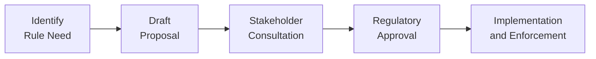

## 28.8 Developing and Administering Rules Governing the Marketplace and Approved Participants Dealing in Options

Have you ever walked into a busy marketplace and wondered how everything manages to stay so organized? If you hang around an exchange for listed options, you might ask the same question. How do all these traders, brokers, and giant financial institutions follow the same script and not cause chaos? Well, the answer lies in the rules—and trust me, those rules aren’t formed overnight. They’re crafted, reviewed, amended, and then enforced by both the exchange (like the Bourse de Montréal) and the Canadian Investment Regulatory Organization (CIRO) to keep everything humming along. 

Below, we’ll chat about how these rules come into existence, why they matter, and what happens if someone decides they’d rather take a shortcut. I’ll sprinkle in a few anecdotes, talk about personal experiences, and try to keep it real—because, let’s face it, regulatory stuff can sound boring unless we make it more human. So let’s dive in and see how the house keeps order!

## The Foundation of Market Integrity

In the world of options, the ability to trust that everyone follows the same playbook is everything. When I first explored options trading, I admit I was anxious about the potential for mischief. Could big players manipulate the market? Could someone trade without enough capital backing their position? The good news is that robust rules minimize these risks. Exchanges, in close coordination with CIRO, lay down the law to:

• Maintain Fairness: Everyone—whether you’re a large institution or a small retail trader—should have the same level playing field.  
• Protect Participants: Solid rules ensure that participants don’t blow themselves up financially and drag others down with them.  
• Uphold Market Integrity: If traders sense manipulation or shady practices, liquidity drains and the market suffers.  
• Encourage Transparency: Timely trade reporting, consistent margin requirements, and clear dispute-resolution procedures all reinforce trust.

## Collaboration with CIRO: Driving Regulatory Harmony

Here in Canada, CIRO is the national self-regulatory body that oversees investment dealers, mutual fund dealers, and market integrity for equity and debt marketplaces. It’s also pivotal in the world of derivatives oversight. Historically, you might’ve heard of IIROC or the MFDA, but as of January 1, 2023, they merged to form CIRO. So, if you see references to IIROC or MFDA, just remember they’re defunct predecessor SROs.

From the vantage point of listed options trading, the exchange (such as the Bourse de Montréal) doesn’t go it alone. CIRO helps define membership requirements, financial adequacy tests, compliance protocols—you name it. This synergy means that if you become an Approved Participant (AP), you’ve demonstrated the resilience to handle the risks of trading and a willingness to play by the rules.

## Being an Approved Participant (AP)

“Approved Participant” can sound mighty official, right? Well, it’s because it is. Exchanges want to ensure that anyone accessing the marketplace directly meets specific criteria. This operation is akin to wanting reliable neighbors: you want them to be responsible, capitalized, and committed to healthy community living.  

APs often must:  

• Show Financial Adequacy: Minimum capital thresholds and liquidity standards.  
• Demonstrate Compliance Readiness: Adequate internal controls and tech systems for risk management.  
• Maintain Ethical and Professional Standards: Adherence to codes of conduct, best execution guidelines, and robust dispute resolution processes.  

Think of it like passing a test to get your driver’s license. The roads are busy, and trust me, you don’t want unlicensed folks behind the wheel of a 16-wheeler. Similarly, these membership rules deter unqualified or unethical participants from messing with market stability. 

## Rule Development: From Concept to Codification

In my early days of studying derivatives, I used to imagine that some universal set of market rules just fell from the sky. Eventually, I realized it’s a meticulous, people-driven process. Typically, it looks a bit like this:

• Identifying a Need: Maybe there’s a new type of strategy (like weekly options) or a brand-new product (like an ESG-linked derivative) that requires new guidelines.  
• Drafting and Consultation: The exchange’s compliance teams, CIRO, and committees of industry professionals hammer out the details.  
• Public and Stakeholder Feedback: Once a draft is ready, relevant stakeholders (including smaller brokerages, large banks, and even the public) provide comments.  
• Final Approval by Regulators: Provincial securities commissions (e.g., the Autorité des marchés financiers in Québec) review and approve final rule changes.  
• Implementation and Enforcement: Approved rules are then integrated into the exchange or marketplace’s official rulebook.

Below is a diagram illustrating this rule amendment journey:

Notice how everyone gets a seat at the table at some point in the pipeline. This ensures rules are balanced, effective, and reflective of real-world trading conditions.

## Administering the Rulebook: Ongoing Compliance

Let’s say you’ve been admitted as an AP, you have your capital in place, everything is in motion. Fantastic. But that’s not the end of the story. Exchanges, working hand in hand with their regulatory partners, also watch participants’ behavior. This domain includes:

• Compliance Monitoring: Dedicated staff within each Approved Participant track trader behavior, margin requirements, and internal risk flags.  
• Best Execution Obligations: If you’re a broker, you must seek the most favorable terms for your clients, taking into account price, speed, and likelihood of execution.  
• Conflicts of Interest Management: If a brokerage trades for its own book (proprietary trading) and also offers client services, the lines can get blurred. Rules require transparency, ethical walls, or other mitigating controls.  
• Trade Reporting: Timely trade reporting fosters transparency and ensures the entire marketplace has access to the latest data to price options fairly.

## Enforcement Measures: Consequences for Breaking the Rules

One time, I was talking to a friend who worked in compliance. They said they felt a bit like a teacher who had to give detentions all day. They’d spend half their time explaining the rules and the other half handing out punishments. Fortunately, major infractions of exchange rules are quite rare, but it does happen. When it does, the tool kit might include:

• Monetary Penalties: Fines can scale up dramatically if a participant repeatedly crosses the line or commits severe infractions.  
• Suspensions: If a participant’s behavior threatens market integrity, a temporary suspension might be the answer.  
• Revocation of Membership: The nuclear option—boot-off access to the marketplace entirely. This penalty is reserved for the worst-case scenarios or repeated blatant infractions.

## Conflict of Interest

Conflicts of interest crop up when a personal or financial interest stands at odds with professional responsibilities. For example, a brokerage might stand to gain from routing client trades to a particular counterparty if it also has a stake in that counterparty. One golden rule in such cases is disclosure: letting clients know about potential conflicts, adopting best execution policies, and creating “firewalls” (physical and organizational) between different departments.

## Dispute Resolution

I often see novice traders get anxious about what happens if something goes awry—like if there’s a big discrepancy in a fill price or an alleged software glitch. Exchanges and CIRO have dispute resolution frameworks in place. Sometimes the process involves:

• Reviewing the Trading Records: Time-stamps, order logs, price quotes, and relevant communication.  
• Arbitration or Mediation: A neutral third party might help facilitate an agreement if the dispute can’t be resolved between parties.  
• Appeals: If a participant or individual disagrees with a lower-level decision, many exchanges allow for an appeals process within their regulatory structure.

## Technology, Algorithmic Trading, and Rule Adjustments

Algorithmic logic is rewriting how we see trading. With billions of dollars swishing around in nanoseconds, small changes in the rulebook can have giant impacts on liquidity, volatility, and order dynamics. The exchange, in coordination with CIRO, might impose specific requirements on:

• Latency Controls and Throttles: Ensures that the submission of orders doesn’t overwhelm the exchange’s systems.  
• Pre-Trade Risk Checks: Automated checks to make sure an order from a particular strategy or account has enough capital behind it.  
• Cancel-on-Disconnect: If a trader’s link to the exchange is severed, some rules require the system to automatically cancel open orders to prevent erroneous trades.

## Public Consultation and Stakeholder Engagement

What if you disagree with a proposed rule before it’s finalized? Well, you generally have an opportunity to weigh in. My buddy from a smaller brokerage recently told me how they submitted a formal comment letter on proposed short-selling restrictions in certain listed options. While they weren’t sure if it would sway the final outcome, they appreciated the chance to be heard. This inclusive approach fosters a sense of community and a living, breathing rulebook that never completely sleeps.

## Real-World Case Study: A Changing Landscape

A recent example (fictitious scenario for illustration) might be the proliferation of ESG (Environmental, Social, Governance) derivatives. As soon as the industry realized that more banks and asset managers wanted ways to hedge or speculate on ESG-specific metrics, the Bourse de Montréal prepped an “ESG Options Chapter” in its Rulebook. Here’s how it could’ve unfolded:

• Identification: Sensing new demand, the exchange flagged the need for ESG-specific listing requirements.  
• Collaboration: CIRO compliance staff weighed in, mindful of how to measure ESG metrics with consistency.  
• Consultation: Stakeholders, including large asset managers and environmental advocacy groups, offered feedback.  
• Regulatory Approval: The final set of standards—covering everything from underlying disclosure to marketing—sailed through provincial regulators.  
• Launch: APs could then list and trade these ESG derivatives under the new rules, confident the products had a well-defined framework.

## Common Pitfalls and Areas of Confusion

Despite the well-documented rules, participants sometimes run afoul due to misinterpretation or operational lapses. Here are a few pitfalls:

• Insufficient Internal Controls: Even if the rule says “thou shalt have a robust risk management system,” that’s not always enough.  
• Over-Looking Margin Calls: Options can be extremely volatile, and some participants do not properly anticipate margin requirements.  
• Incomplete Best Execution Policies: If you’re routing options orders but ignoring better quotes on another market, that’s a compliance headache.  
• Delayed Trade Reporting: If trades don’t get reported on time, it can distort market data, leading to possible fines or regulatory action.

## Building a Robust Compliance Culture

A single rulebook only goes so far. It’s the people—traders, compliance officers, risk managers—who bring these rules to life. A robust compliance culture includes:

• Frequent Training: On everything from new exchange rules to ethical guidelines and conflict-of-interest best practices.  
• Technology Investments: For real-time risk monitoring, to ensure margin calculations, and keep track of algorithmic trades.  
• Whistleblower Mechanisms: If employees feel pressured to break rules, they should have a safe, confidential way to escalate concerns.  
• Regular Engagement with Regulators: Some brokers voluntarily meet with CIRO or the exchange to stay updated on proposed changes or interpretive guidance.

## Ties to Broader Regulatory Frameworks in Canada

Exchanges aren’t the only players. Provincial securities commissions—like the Ontario Securities Commission (OSC), the Autorité des marchés financiers (AMF) in Québec, or the British Columbia Securities Commission (BCSC)—also shape the environment. The Canadian Securities Administrators (CSA) tries to harmonize many aspects of securities regulations across these provinces, including derivatives. Coordinated rules help reduce confusion and friction in cross-border trading within Canada.

For official references:

• Bourse de Montréal Rulebook: https://www.m-x.ca/reglements_en.php  
• CIRO Membership Requirements: https://www.ciro.ca/  
• CSA Consultation Papers on Derivatives: https://www.securities-administrators.ca/  

## Using Open-Source Financial Tools and Frameworks

You might be curious if there’s an open-source angle to all this. Yes, absolutely—on the risk modeling and compliance side. Firms sometimes leverage open-source libraries, like QuantLib, to model risk exposures or run stress tests on large options portfolios. Although not specifically mandated by the exchange or CIRO, adopting well-tested open tools can reduce operational risk and help participants ensure they remain on the right side of margin calls and stress scenarios.

## Keeping Pace with Continuous Change

Rules for exchanges and their participants are always evolving. And that’s a good thing, even if it feels like moving goalposts for compliance staff. I remember when weekly options started gaining traction—nobody was sure how margin rules should adapt to these short-dated instruments. Over time, tweaks were made, participants adapted, and now weekly options are just part of the menu. So, if you’re stepping into this world—whether as a back-office specialist, a front-line trader, or an academic—it pays to keep learning.

## A Final Word: Shared Responsibility

In many ways, the hallmark of a healthy derivatives market is how well it self-regulates alongside official oversight. Exchanges want to preserve integrity (and their own reputations), CIRO wants investors protected, and participants generally prefer stable markets where they can do business. So, if you’re part of this ecosystem, you have a stake in nurturing a rule-driven environment that fosters innovation while safeguarding investors.

Anyway, these guidelines, procedures, and enforcement measures exist so that you can trade options with confidence and peace of mind. If that offers you any reassurance, it means the entire system is doing its job. 

---

## Sample Exam Questions: Rules Development and Compliance in Options Trading



### Which entity collaborates with the Bourse de Montréal to set and enforce membership requirements for Approved Participants (APs)?

- [ ] The Mutual Fund Dealers Association of Canada (MFDA)
- [x] The Canadian Investment Regulatory Organization (CIRO)
- [ ] The U.S. Securities and Exchange Commission (SEC)
- [ ] The Bank for International Settlements (BIS)

> **Explanation:** As of January 1, 2023, the MFDA and IIROC merged to form CIRO. CIRO oversees investment dealers and ensures that Approved Participants comply with all relevant rules and standards.

### When a proposed rule change is drafted by an exchange, which step typically occurs before it is submitted to provincial securities commissions for approval?

- [x] Stakeholder or public consultation
- [ ] Immediate finalization without input
- [ ] Suspension of any conflicting trades
- [ ] Expedited membership approval

> **Explanation:** The exchange normally releases the proposed rule change for stakeholder review. Feedback is then considered, and only after refining the proposal does it move on to the provincial regulators for final approval.

### To mitigate conflicts of interest when a dealer provides both proprietary trading and client execution, which key measure is typically employed?

- [x] Ethical walls or Chinese walls to separate different business functions
- [ ] Encouragement of commingled trading desks
- [ ] Complete elimination of proprietary trading
- [ ] Outsourcing proprietary trading to third parties only

> **Explanation:** Firms commonly institute a physical or functional separation (ethical walls) between the trading desk handling client orders and the proprietary trading desk. This prevents undue influence or misuse of client information.

### What is the primary purpose of a dispute resolution process at an options exchange?

- [ ] To discourage participants from trading volatile products
- [x] To provide a structured way to resolve grievances or allegations of unfair treatment
- [ ] To force the losing party to exit the marketplace
- [ ] To manage margin requirements on short-sale positions

> **Explanation:** Dispute resolution frameworks exist to handle issues such as alleged mispricing, technology errors, or order-handling disputes. They offer a fair way to settle disagreements.

### Which best describes the final step in the rule amendment process at a Canadian exchange?

- [ ] Implementation by informal consensus among APs
- [x] Formal approval from the appropriate securities commission
- [ ] Automatic enforcement after a 30-day grace period
- [ ] Optional second round of internal desk commentary

> **Explanation:** Once the exchange finishes drafting and reviewing a rule, the final impetus comes from provincial securities commissions, which must formally approve or disapprove of changes.

### What enforcement action might an exchange take against a member persistently violating marketplace rules?

- [x] Imposition of fines, suspensions, or membership revocation
- [ ] Issuance of a thorough but non-binding warning
- [ ] Automatic blockade of all other members’ trading
- [ ] Mandated conduction of public trade seminars

> **Explanation:** Exchanges possess a range of enforcement outcomes, including fines for lesser infractions and revocation of privileges for serious or repeated rule violations.

### Why must Approved Participants maintain a compliance department or dedicated compliance staff?

- [ ] To increase the complexity of back-office operations
- [ ] To ensure only low-volume clients are accepted
- [x] To monitor adherence to exchange rules and risk policies
- [ ] To minimize the public’s trust in market activities

> **Explanation:** Compliance departments keep tabs on trading behavior, ensure alignment with exchange rules, and help prevent conflict-of-interest or undue risks within the firm.

### What is a fundamental reason for requiring timely trade reporting in an options market?

- [x] To ensure transparency and accurate price discovery
- [ ] To discourage large block trades
- [ ] To inflate trading volumes artificially
- [ ] To promote extended settlement cycles

> **Explanation:** Transparency is crucial in options trading. If trades are reported promptly, the entire marketplace can incorporate accurate pricing into its valuation and risk models.

### Which statement about the role of technology in marketplace rule administration is correct?

- [ ] Algorithmic trading is universally outlawed by Canadian exchanges
- [ ] Exchanges rely only on manual audits for risk checks
- [x] Pre-trade risk checks and cancel-on-disconnect features help manage algorithmic trading
- [ ] Traders engaging in algorithmic strategies are exempt from membership requirements

> **Explanation:** With the growth of automated trading, pre-trade risk checks and similar controls ensure that an exchange remains stable and free of erroneous or “runaway” orders.

### True or False: CIRO often publishes membership requirement updates that affect how quickly new Approved Participants can begin trading.

- [x] True
- [ ] False

> **Explanation:** CIRO regularly updates membership and financial adequacy criteria, potentially altering the timeline for new firms seeking exchange membership.


