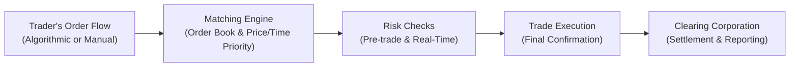

## 28.9 Recent Technology Upgrades & Matching Engines

So if you’re anything like me, the first time you heard about “matching engines,” you probably did a double-take and said, “Huh, that sounds like something from an automotive manual!” But matching engines are at the heart of how modern derivatives exchanges work. They’re basically those ultra-fast computer systems that connect your buy and sell orders on the exchange, ensuring trades happen quickly, fairly, and reliably. Over the past decade, these engines have undergone some impressive makeovers—new technology upgrades, better throughput, and improved latency have turbocharged trading performance around the globe.

But let’s not get ahead of ourselves. Below, we’ll step through the fundamentals of matching engines, highlight the latest major technology upgrades at leading exchanges (including the Bourse de Montréal), and explore how these developments impact liquidity, market fairness, and risk management. We’ll also look at how Canadian Investment Regulatory Organization (CIRO) guidelines oversee electronic trading—especially with fast-paced algorithmic and high-frequency traders (HFTs). Along the way, I’ll share little anecdotes and analogies that helped me get a handle on these concepts, plus we’ll toss in diagrams so you can visualize exactly how it all comes together.

### The Role of the Matching Engine

A matching engine is the software (and supporting hardware) that processes all incoming orders for an exchange. These engines queue, match (or “cross”), and execute trades based on rules like price/time priority. Whenever you enter a buy order at a certain price, the matching engine tries to find a corresponding sell order at the same or better price. If it finds one, well, that’s a match, and your trade is executed. If no matching orders are available, your order hangs out in the order book until a suitable match arrives or you cancel it.

In derivatives markets—especially options markets—this process must handle high volumes of complicated orders: calls, puts, multi-leg strategies, all sorts of spread and combination orders. Throw in high-frequency and algorithmic trading, and the number of orders can balloon into the hundreds of thousands per second. Without robust technology, order execution would slow to a crawl, messing with your ability to hedge exposure or capitalize on short-lived price discrepancies. Fortunately, modern matching engines are built to tackle these challenges head-on.

### Technology Upgrades and Performance Metrics

So, what does “upgrading” a matching engine entail, and why does it matter for you and me? Exchanges commonly focus on these features:

• Faster Throughput  
• Lower Latency  
• Scalability  
• Resilience and Redundancy  
• Advanced Risk Management  

These might sound like buzzwords. But each of these capabilities is critical—especially in times of high volatility (remember the markets in March 2020, anyone?). If an engine processes more trades per second with less lag, that means a better chance of getting your order filled at the desired price. It’s also essential from a risk management perspective: you don’t want your trades stuck in a queue while the market moves against you.

#### Faster Throughput

Throughput refers to the rate at which a system processes transactions—think of it like the maximum volume of water a pipe can handle. When markets heat up, volumes surge. If the matching engine can’t handle all those orders, delays or even system outages may occur. That’s the last thing any trader wants. Modern exchanges use supercharged hardware (fast processors, specialized network cards) and sophisticated software optimizations to push throughput ever higher.

#### Lower Latency

Latency is about speed and timing—the delay between when you place an order and when the system acknowledges or executes it. It’s comparable to snapping your fingers and then hearing the echo a second (or millisecond) later. The lower that latency, the more “real-time” your trades become. High-frequency traders, in particular, rely on minimal latency to quickly detect price movements and execute trades ahead of slower participants. Exchanges often brag about single-digit microsecond speeds, effectively turning trading into a race where every nanosecond counts.

Truth: Even if you’re a retail trader who doesn’t rely on sub-millisecond executions, lower latency typically leads to more accurate pricing and more consistent fills. It also fosters tighter spreads because institutions engaged in market making can quickly update their quotes in response to evolving conditions.

### Colocation: Bringing Your Servers Closer

One of the biggest game-changers is the rise of colocation services. Exchanges provide server racks in their data centers so that market participants can install their trading hardware just steps away from the matching engine. The idea is to reduce network delays caused by geographical distance. If you’re running an algorithmic strategy from, say, Vancouver, you might experience a few extra milliseconds traveling to an exchange in Montréal. By colocating your servers in the exchange’s facility (or a partner data center close by), you cut that latency significantly.

There’s a lot of debate around colocation—some folks argue it offers an unfair speed advantage to deep-pocketed market participants. But many regulators, including CIRO here in Canada, have put guidelines in place to ensure colocation is offered on fair and non-discriminatory terms. As technology evolves, colocation remains an integral part of the high-frequency trading landscape.

### Advanced Risk Management Modules

It’s not just about speed. Exchanges also use technology upgrades to bolster risk management. Modern matching engines typically include:

• Pre-Trade Risk Checks: Before an order even hits the order book, it goes through checks to confirm the trader’s capital, margin requirements, credit limits, and other compliance or risk constraints.  
• Real-Time Margining: Some systems continuously update margin requirements throughout the trading day as positions change or volatility shifts.  
• Auto-Cancellation: If the system detects erroneous or “fat-finger” orders (like an options order priced at $1,000 when the underlying last traded at $50), it can automatically reject or cancel them.  

For instance, the Bourse de Montréal (often abbreviated as “the Bourse” or “MX”) has integrated advanced risk controls that are aligned with CIRO guidelines for derivatives market integrity. The moment your order is flagged as a potential risk, it may be halted or canceled, protecting both you and other participants from big losses or mistrades.

### Cybersecurity: Protecting Sensitive Data and Systems

As with almost everything in finance these days, cybersecurity is paramount. Exchanges have increasingly become targets for cyberattacks, from distributed denial of service (DDoS) attempts intended to disrupt trading to more sophisticated infiltrations aimed at stealing confidential information. For the integrity of the market (and obviously, to protect your personal data!), top-tier cybersecurity measures must be in place.

Exchanges might employ intrusion detection systems, encryption protocols, multi-factor authentication for employees, and rigorous patch management of their technology stack. For example, whenever the Bourse de Montréal or other major exchanges roll out a new matching engine, they typically adopt next-generation firewalls, segmented networks, and state-of-the-art threat monitoring.

### Market Liquidity, Price Discovery, and Arbitrage Opportunities

Technology upgrades usually have a direct impact on market liquidity. Faster matching engines and lower latency environments encourage more market participants—particularly algorithmic and high-frequency traders—to quote continuously and in larger volumes, knowing they can exit quickly if conditions change. A more liquid market often means tighter bid-ask spreads, which is a plus for everyone from large institutional players to the at-home retail trader.

Additionally, advanced matching engines can create new arbitrage opportunities. For example, if Exchange A is slower than Exchange B, then speed-sensitive traders on B might exploit short-lived price differences before A updates its quotes. Once Exchange A invests in better technology, that gap narrows, making markets more efficient overall. And that’s generally a good thing, although it can also increase competition and reduce profit margins for certain strategies.

### Practical Example: Upgrading an Exchange Matching Engine

Imagine our fictional “Superior Options Exchange” (SOX), which has an older engine average latency of 250 microseconds. Traders complain about occasional sluggish performance during peak times. HFT firms threaten to route more of their orders to competitor exchanges with sub-100 microsecond latencies. That’s an existential risk for any exchange—losing volume means losing revenue and liquidity.

SOX invests millions of dollars in new servers, fiber optic infrastructure, and redesigned software algorithms. After months of development, they roll out the new system with average latency around 90 microseconds—on par with competitors. They also add real-time margin updates and advanced risk checks. Almost immediately, trading volumes move upward as participants, from major institutions to day traders, trust the improved execution and reliability. And guess what? That trust fosters a self-reinforcing cycle: more liquidity attracts more liquidity, further boosting the attractiveness of the market.

### Diagram: Simplified Order Flow in a Modern Matching Engine

Below is a Mermaid diagram that visualizes an order flow through a matching engine, including risk checks and clearing:

1. A: Orders can be initiated by traders using sophisticated algorithms or simple manual order entry.  
2. B: Orders enter the matching engine and are placed in an order book if not immediately executed.  
3. C: The system continuously validates risk parameters—margin, credit limits, position limits—before and after each match.  
4. D: The trade is executed when the engine finds an opposing order that meets or improves upon the trader’s price.  
5. E: Confirmation for completed trades flows to the clearing corporation, which then manages settlement, margin, and reporting obligations.

### Regulatory Oversight and Canadian Considerations

In Canada, CIRO is the current overarching self-regulatory body supervising investment dealers and ensuring market integrity. Historically, institutions like IIROC may have set guidelines for electronic trading; now CIRO enforces these rules. Key requirements focus on:

• Fair Access: Exchanges must provide equal opportunity to all participants—particularly important in colocation arrangements.  
• Market Integrity: Exchanges must detect and deter manipulative or disruptive trading (e.g., spoofing, layering, quote stuffing).  
• Risk Controls: Pre-trade and post-trade risk checks must be implemented to protect the market’s integrity and the stability of financial institutions.  
• Technology Governance: Exchanges need to regularly test their systems, maintain backup facilities, and promptly inform regulators of technology failures or threats.  

If you’re seeking the nitty-gritty details, check out CIRO’s official website (https://www.ciro.ca) for up-to-date guidelines. Additionally, the Bourse de Montréal publishes order-entry and technological specs with instructions on how to access their production and testing environments.  

### Real-World Case Study: Bourse de Montréal’s Upgrade

The Bourse de Montréal has embarked on phased upgrades to ensure robust and high-performance trading that meets the demands of local and global participants. In one upgrade, they migrated from older server hardware to a state-of-the-art architecture offering microsecond latencies. They also integrated next-generation data feeds, enabling participants to see real-time depth-of-book information, plus newly enhanced risk management modules.

Initial feedback showed a reduction in order processing times, more consistent fill rates, and fewer “hiccups” during peak trading moments—like right after important Bank of Canada announcements or major corporate earnings releases. CIRO recognized these efforts, praising the Bourse’s improved capacity to handle high-frequency traffic in compliance with new risk controls.

### Common Pitfalls and Best Practices

• Pitfall: Over-Relying on Technology. Automated systems can malfunction, and a single glitch might cause big losses in the blink of an eye. The solution? Employ robust fail-safes and real-time human oversight.  
• Pitfall: Ignoring Exchange-Specific Rules. Each exchange might have unique matching algorithms, upgrade schedules, or risk parameters. Always read the platform’s technical documentation to avoid unexpected order rejections or partial fills.  
• Pitfall: Underestimating Cyber Threats. Don’t assume your orders are safe. Make sure your firm’s architecture meets or exceeds industry best practices for encryption, incident response, and data backup.  
• Best Practice: Regularly Test and Simulate Your Strategies. Exchanges often provide test environments or “sandbox” systems, so you can ensure your algorithms behave correctly during unusual market conditions.  
• Best Practice: Keep Abreast of Regulatory Updates. As technology changes, so do regulations. Stay current with CIRO notices on margin requirements, risk controls, and permissible automated trading conduct.

### A Quick Personal Anecdote

I remember the first time I tried to execute an options spread during a major economic data release. My order basically froze in the system for about five seconds—felt like an eternity—because the matching engine back then was slower and the volume was sky high. By the time my trade went through, the market had already moved against me. It was a modest loss, but it hammered home the idea that technology speed absolutely matters. Nowadays, with modern matching engines capable of sub-millisecond or microsecond response times, that same scenario is much less likely (though, of course, not impossible). It’s a real-world reminder that behind all the code and data is a market with genuine money at stake.

### Open-Source Financial Tools and Frameworks

Looking to dive deeper and maybe experiment with your own algorithms?

• QuantLib (C++ Library): Offers pricing and risk analysis for various derivative instruments.  
• Python Libraries (Pandas, NumPy): Useful for backtesting and analyzing historical data.  
• Jupyter Notebooks: Great for interactive modeling and prototyping.  

While these open-source tools aren’t typically used by actual exchange matching engines (most are built with proprietary software), they can help you get a feel for algorithmic trading logic and even run simulations on historical data for educational purposes.

### Recommended Resources

• CIRO Guidelines on Electronic Trading: https://www.ciro.ca  
• Bourse de Montréal Technology Notices & Documentation (regularly updated on their official site).  
• Meditations on high-speed trading: “High-Frequency Trading: A Practical Guide to Algorithmic Strategies and Trading Systems” by Irene Aldridge.  
• Aldridge’s book also discusses the architecture behind low latency trading systems and touches on tactics high-frequency traders use to achieve consistent profitability.

### Conclusion

Recent technology upgrades and matching engine improvements feel a lot like souping up a sports car: better acceleration, higher top speeds, and safer handling. For exchanges, these upgrades equate to faster throughput and lower latency, providing traders with more precise executions. For you as a market participant—be it an individual with a small options account or a global institution managing billions—these technological shifts promise a more efficient, secure, and transparent marketplace.

As with anything in the world of derivatives, though, technology alone doesn’t remove the need for caution and savvy. There’s always risk. Having a broad view of how matching engines and technology shape the market can help you trade confidently and anticipate the impact of tomorrow’s upgrades. Remember, keep your strategies flexible, stay up to date with regulatory changes, and appreciate that behind all the speed and complexity lies a fundamental goal: to match buyers with sellers swiftly and fairly.

---

## Sample Exam Questions: Recent Technology Upgrades & Matching Engines



### High-speed trading systems require:
- [x] Low latency deployments to execute trades in microseconds  
- [ ] Extensive user-provided data encryption only  
- [ ] Exclusively manual order entries at all times  
- [ ] Minimal throughput for stable data transfers  

> **Explanation:** Low latency is key for high-frequency and algorithmic transactions, enabling trades to occur in microseconds or milliseconds.

### The primary reason exchanges offer colocation services is to:
- [ ] Guarantee profitable trades for participating firms  
- [x] Minimize network delays by hosting servers close to the matching engine  
- [ ] Ensure only large institutions can access the market  
- [ ] Avoid implementing any form of risk management  

> **Explanation:** Colocation moves trading servers physically nearer to the exchange's data center, reducing the travel time for data signals, thus minimizing latency.

### Which statement best describes “throughput” in the context of a matching engine?
- [ ] The delay between order placement and execution  
- [x] The rate at which the matching engine processes orders  
- [ ] A measure of the reliability of pre-trade risk checks  
- [ ] A post-trade settlement verification process  

> **Explanation:** Throughput is specifically about how many transactions the exchange can handle per second.

### Pre-trade risk checks on an options exchange are designed to:
- [x] Prevent orders that might exceed capital or margin requirements  
- [ ] Maximize server capacity for large institutional traders  
- [ ] Ensure immediate liquidity without checking credit limits  
- [ ] Slow down high-frequency trading  

> **Explanation:** Pre-trade checks confirm that each order meets margin and capital constraints before being released into the market.

### A “fat-finger” error is:
- [x] An erroneous order input, such as putting an extra zero in the price  
- [ ] An official regulatory filing  
- [ ] A strategic order to attract liquidity  
- [ ] A measure to detect insider trading  

> **Explanation:** A fat-finger error is typically a typographical or input error that can lead to large unintended trades or orders.

### Which of the following factors can help exchanges reduce overall latency?
- [x] Using specialized hardware and improved network infrastructure  
- [ ] Accepting only manual, off-floor orders  
- [ ] Mandating slow updates to market data  
- [ ] Increasing the number of regulatory checkpoints  

> **Explanation:** Specialized technologies, like faster processors and optimized network architecture, are the main ways to reduce latency.

### CIRO’s role in electronic trading includes:
- [ ] Creating algorithms used by all exchanges  
- [x] Overseeing market integrity and risk controls on Canadian exchanges  
- [ ] Eliminating short selling during volatile periods  
- [ ] Executing trades on behalf of retail investors  

> **Explanation:** CIRO is responsible for regulating member firms and overseeing market operations, ensuring they have robust risk controls and fair access.

### Why might high-frequency traders prefer an exchange with microsecond-level latency over an exchange with slower speeds?
- [ ] Microsecond latency restricts them from performing advanced strategies  
- [ ] Lower latency reduces overall throughput, which they prefer  
- [x] It allows them to respond quickly to price changes and earn profits more reliably  
- [ ] Slower speed ensures all trades are evenly paced  

> **Explanation:** For HFT strategies, reaction time is crucial. The faster they can spot and act on short-lived price discrepancies, the greater their potential edge.

### A key cybersecurity measure in modern matching engine upgrades is:
- [x] Next-generation firewalls and real-time threat monitoring  
- [ ] Restricting all market access to one mainframe computer  
- [ ] Prohibiting use of encryption  
- [ ] Eliminating user authentication to expedite order entry  

> **Explanation:** Exchanges must employ advanced cybersecurity, like next-gen firewalls and continuous threat monitoring, to protect systems and data.

### True or False: Technology upgrades on derivatives exchanges usually lead to tighter spreads and improved liquidity.
- [x] True  
- [ ] False  

> **Explanation:** Faster and more efficient matching engines often incentivize greater participation, which enhances liquidity and can produce narrower bid-ask spreads.


