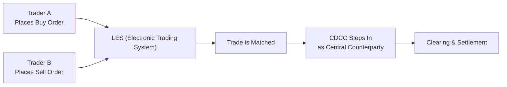

## 29.1 The Bourse de Montréal Inc.

There was a time—maybe a few years back—when I stood in downtown Montréal, gazing at the skyscrapers and feeling a tad overwhelmed by the bustle. Little did I know that right in that city, the foundation of Canada’s derivatives trading world was hard at work: The Bourse de Montréal Inc., often called the Montréal Exchange or simply MX. If you’re looking to dip your toes—or more accurately, your entire investment strategy—into Canadian-listed options and futures, the MX is basically your new best friend.

This article unpacks everything from the Exchange’s role as a marketplace for equity, index, and currency options to the nitty-gritty details of margin requirements, educational resources, and a bunch of compliance rules. Grab a coffee (or tea if that’s more your style). Let’s go on a deep dive into how the Bourse de Montréal shapes the Canadian derivatives ecosystem while staying in line with modern regulatory regimes like CIRO (Canadian Investment Regulatory Organization) and the CSA (Canadian Securities Administrators).

## Overview of the Montréal Exchange (MX)

The Montréal Exchange is Canada’s primary derivative-focused exchange. While other North American markets (like the Chicago Board Options Exchange or the NYSE) might get more headlines globally, in Canada, we trust the Bourse for all our equity, index, and currency options needs. We also look to it for futures on various underlyings—ranging from short-term interest rates to equity indices like the S&P/TSX 60.

One of the most exciting aspects is that the Bourse is exclusively dedicated to derivatives. In some ways, this single-minded focus can feel like sitting in a coffee shop that only serves espresso-based drinks—no distractions, just pure depth of expertise. From call and put options on large Canadian banks to index options on big Canadian equity benchmarks, the Bourse’s product lineup aims to reflect the pulse of the Canadian market.

### Regulatory Oversight and the Role of CIRO

Now, ensuring that markets run smoothly isn’t just about fancy technology or robust clearing; there’s a strong regulatory backbone. Here in Canada, the Bourse de Montréal functions under the watchful eye of CIRO. If you recall, CIRO is the new self-regulatory organization formed from the amalgamation of IIROC (Investment Industry Regulatory Organization of Canada) and the MFDA (Mutual Fund Dealers Association) in 2023. It sets high standards for member firms, monitors marketplace integrity, and basically makes sure no shady business tarnishes the capital markets.

Alongside CIRO, the Canadian Securities Administrators (CSA)—a collective of provincial and territorial securities regulators—plays a significant role in harmonizing market regulations. This structure helps ensure a level playing field from Vancouver all the way to St. John’s, forging consistent national standards around derivatives trading, margin, position limits, and more.

### Product Range: Equity, Index, and Currency Options

So, what exactly can you trade on the Bourse? From household Canadian equities—like those big banks or large energy companies—to major equity indices such as the S&P/TSX 60, you’re likely to find a contract that aligns with your trading or hedging goals. The Bourse also boasts an array of currency options, enabling participants to speculate or hedge foreign exchange exposures in a transparent, exchange-listed environment. That’s pretty helpful if you deal with cross-border transactions and want a more standardized product than an over-the-counter (OTC) currency option.

#### Equity Options

When we talk about equity options on the Montréal Exchange, we’re talking about calls and puts on shares of Canadian public companies, each following standardized contract sizes and expiry dates. These contracts empower both professional and retail participants to implement bullish or bearish strategies, protect existing stock holdings with puts (protective puts), or generate income through writing covered calls. If you follow Canadian companies actively, you’ll see that many of the popular TSX-listed stocks have corresponding options on MX.

#### Index Options

Index options track the performance of a basket of stocks, like the S&P/TSX 60. Instead of focusing on a single equity, an index option allows you to speculate on or hedge broad market movements. This approach is super handy if you, for example, manage a portfolio of predominantly Canadian equities and want to hedge systematic risk or bet on the direction of Canada’s top 60 large-cap stocks.

#### Currency Options

Yes, currency futures and options exist. MX’s currency options often revolve around popular currency pairs involving the Canadian dollar (CAD) and the U.S. dollar (USD). The advantage of trading currency options on an exchange is that you benefit from the Bourse’s oversight, margin efficiencies, and the standardized nature of listed products. For cross-border businesses or travelers wanting to lock in favorable exchange rates, these can be a revelation—though typically it’s more sophisticated hedgers or speculators who deploy these products.

## Core Responsibilities of the Montréal Exchange

One might assume that the Exchange’s job ends at simply “providing a place to trade.” But there’s a whole universe lying beneath that broad statement:

- • Ensuring a stable and efficient electronic trading platform (currently known as LES or the MX’s electronic trading system).  
- • Crafting rules and policies that guarantee fair trading practices.  
- • Monitoring and matching buy/sell orders in real time, abiding by a price-time priority model.  
- • Collaborating closely with the Canadian Derivatives Clearing Corporation (CDCC) for clearing, settlement, and risk management.  
- • Introducing new contracts when the market demands them and delisting those that have fallen out of favor or are no longer relevant.

In a sense, the Bourse is like a party host who sets the rules, manages the guest list, ensures there’s enough space (liquidity), and calls for last drinks at closing time. It’s all about guaranteeing the participants have a well-lubricated environment to trade in—minus the actual beverages, of course.

## The Electronic Trading Platform (LES)

As many markets have shifted from pit trading (where you’d see those frantic open-outcry traders in colored jackets) to fully electronic systems, the Bourse is no exception. The LES system stands at the heart of trade execution on MX. It’s a sophisticated engine that processes orders at lightning speed, matching buyers and sellers based on price and, if prices are equal, on which order arrived first.

Algorithmic trading also thrives here, with market-makers deploying complex quoting strategies to keep bid-ask spreads tight. This automation ensures continuous liquidity throughout the trading day. For an everyday investor, that means more transparent pricing and smoother entry or exit from a position.

## Working with the Canadian Derivatives Clearing Corporation (CDCC)

Risk management can be the difference between a thriving financial ecosystem and a meltdown. The Bourse works hand in hand with the CDCC to ensure that every trade is “cleared.” Clearing entails guaranteeing that, once a trade is matched, both buyer and seller are protected from the risk that the other side defaults on its contractual obligation. Basically, the CDCC steps in as the central counterparty, ensuring that your profits or losses (and the associated margin) are handled meticulously each day.

If you’re brand new to derivatives, let me assure you: the clearing process is less exciting than, say, analyzing an earnings report. But it is absolutely essential. Without a credible clearinghouse like the CDCC, we’d have a far more fragmented environment with increased counterparty risk.

### A Quick Mermaid Diagram of the Trading Flow

Below is a simplified flow showing how a typical trade on the Montréal Exchange is processed and cleared.

Explanation of the diagram:  
1. Both Trader A and Trader B submit orders to the LES.  
2. The system matches them based on price-time priority.  
3. Once matched, the transaction is reported to the CDCC, which becomes the buyer to every seller and the seller to every buyer.  
4. CDCC then calculates margins, collects collateral if necessary, and finalizes the trade for settlement.

## Education and Resources from the Bourse

I still remember the first time I opened the Montréal Exchange’s online educational portal. It felt like discovering a warehouse filled with free how-to guides, pre-recorded webinars, and interactive tools. Whether you’re a total novice looking up “What is a call option?” or a seasoned trader wanting to refine your spread strategies, the Bourse has something for everyone.

Here’s just a quick rundown of some of the Bourse’s educational offerings:

- • Free webinars that illustrate the basics of derivatives trading.  
- • Strategy guides (like the covered call, collar, protective put) specific to Canadian underlyings.  
- • Tools that help you simulate trading or calculate margin requirements.  

If you find that you still crave deeper insights, you might also head over to the Options Industry Council (OIC) resources at https://www.optionseducation.org/, or even browse open-source Python libraries like “quantlib” or “pyfin” to up your modeling game.

## Compliance and Operational Considerations

CIRO imposes strict guidelines around margin, position limits, and reporting obligations. For instance, each options class has maximum position limits that an investor can’t exceed, to avoid concentrated market power or manipulative practices. And yes, you do need to keep track of your net positions on both a daily and intraday basis, especially if you trade heavily or hold big exposures.

Dealers—whether they’re bank-owned brokerages or boutique firms—must ensure that they properly supervise client accounts, maintain robust operational systems, and remain up to date with the Bourse’s rulebook. Failing to do so can result in disciplinary actions, fines, or, in severe cases, suspension of membership.

### Margin Requirements

Margin is basically the collateral required to hold positions in derivative instruments. As you might suspect, margin is set in proportion to the risk. Typically, out-of-the-money option purchases may require minimal margin if you’re just paying the premium. But if you write naked calls or puts, well, your margin requirements can jump dramatically because of the higher potential risk.

#### Example: Margin on a Covered Call

Let’s say you own 1,000 shares of a Canadian tech stock, priced at CAD 50 per share. You decide to write (sell) 10 calls (each covering 100 shares) on that stock, expiring next month. Since you already hold the shares, the Bourse (through your dealer) views your short call as “covered.” The margin demand for a covered call is generally quite moderate because the underlying asset you hold acts as collateral. Compare that to selling a call without owning the underlying—often called a “naked call”—which requires a significantly higher margin deposit because the potential loss is theoretically unlimited if the underlying stock soars in price.

## Real-World Example: Trading a Bank Option

To paint a clearer picture, imagine you anticipate further growth in the Canadian banking sector. You decide to buy a call option on a large Canadian bank listed on the TSX, suspecting that rising interest rates will boost its net interest margin.

1. You log in to your broker’s platform and look up that bank’s option series on the Montréal Exchange.  
2. You select a strike price slightly out of the money, with an expiration date around three months away.  
3. The premium stands at, say, CAD 1.50 per share. Each contract covers 100 shares, so one contract requires a premium of CAD 150.  
4. You buy 5 contracts, thus paying CAD 750 in total premium plus commissions.  
5. The Bourse’s electronic system matches your buy order with a seller (possibly a market maker).  
6. The trade flows to the CDCC for clearing and settlement.  
7. If the bank’s stock price climbs above your strike price plus your premium (in this case, strike + CAD 1.50) before expiry, you’re in profit territory.

As you can see, it’s not a complicated process, but being mindful of your risk tolerance, timeframe, and capital resources is crucial. The Bourse de Montréal aims to make such trades straightforward and transparent for Canadian investors.

## Potential Pitfalls and Challenges

Despite being a well-regulated exchange, there are pitfalls:

- • Overleveraging: Options and futures can provide significant leverage, which cuts both ways: bigger profits or bigger losses.  
- • Not adhering to position limits: If you manage a sizable account, you must keep an eye on the official caps.  
- • Failing to meet margin calls: If the market moves against your position, your broker could issue a margin call. Inability to post extra margin on time may force a liquidation of your positions.  

One daily best practice? Regularly inspect your account’s margin status. No one likes the sinking feeling of discovering a margin call email after the close of trading.

## Best Practices and Lessons Learned

1. **Start Small**: If you’re a novice, consider beginning with covered calls or protective puts. These strategies limit risk more effectively than writing naked options.  
2. **Education is Key**: Explore the Montréal Exchange’s educational resources, along with external tools like quantlib, and keep reading up on market updates.  
3. **Set Alerts**: Use your trading platform’s alert system. This can be especially helpful when your margin ratio is approaching problematic territory.  
4. **Stay Compliant**: Keep up with the Bourse’s evolving rulebook and CIRO bulletins. New regulations or product changes do pop up from time to time.  
5. **Network**: Don’t underestimate the value of user groups, local investment clubs, or online forums. Sharing experiences and hearing about others’ approaches can accelerate your learning curve.

## Additional Resources

• The Montréal Exchange (MX) official website:  
  – https://www.m-x.ca/  
  – Offers product guides, rulebooks, margin requirements, web-based tutorials, and more.

• CIRO:  
  – https://www.ciro.ca/  
  – The self-regulatory organization ensuring fair and efficient capital markets in Canada.

• CSA (Canadian Securities Administrators):  
  – https://www.securities-administrators.ca/  
  – National policy harmonization and regulations regarding derivatives.

• Options Industry Council (OIC) – U.S.-based, but filled with educational content:  
  – https://www.optionseducation.org/

• Open-Source Python Libraries:  
  – “quantlib” or “pyfin” for modeling, valuation, and risk analysis.

• Interested in deeper reading?  
  – “Options as a Strategic Investment” by Lawrence G. McMillan.  
  – Specialized Canadian textbooks on derivatives markets and risk management.  

## Glossary Highlights

- **Montréal Exchange (MX):** Canada’s main derivatives exchange, listing equity, index, and currency options and futures.  
- **CIRO (Canadian Investment Regulatory Organization):** National SRO overseeing investment dealers, ensuring market integrity.  
- **CSA (Canadian Securities Administrators):** Provincial and territorial securities regulators that coordinate Canada-wide instruments.  
- **Electronic Trading Platform (LES):** MX’s matching engine that processes and routes orders.  
- **Counterparty Risk:** The possibility that a party fails to fulfill their side of the contract.  
- **Position Limits:** Regulatory or exchange-imposed caps on how many contracts a participant can hold in a given underlying.  
- **Market Maker:** A firm or trader committed to offering continuous quotes (bids and offers) to maintain market liquidity.  
- **Clearing and Settlement:** The back-office processes that finalize trades, transferring ownership and money.

## Concluding Thoughts

The Bourse de Montréal isn’t just another derivatives trading venue; it’s the beating heart of Canada’s options and futures markets. From the vantage point of a newbie, it might seem intimidating—new acronyms, margin requirements, specialized strategies. But once you get the hang of it, the Bourse can become your partner in hedging, speculating, and portfolio management. It’s a space designed to bring clarity, trust, and an educational pathway to anyone (big or small) who wishes to manage risk and capture market opportunities.

All told, the MX weaves together the best of Canadian diligence (through robust regulations, advanced clearing, and top-tier technology) and the global sophistication of derivatives driven by electronic markets. If you keep your eyes open to educational materials, abide by the rules, manage your margin diligently, and learn from each trade, you’ll find the Bourse to be a valuable ally in your financial journey.

---

## Sample Exam Questions: The Bourse de Montréal Inc.



### Which organization ensures market integrity and oversees the Montréal Exchange in today’s regulatory environment?

- [ ] The Investment Industry Regulatory Organization of Canada (IIROC)
- [ ] The Mutual Fund Dealers Association (MFDA)
- [x] The Canadian Investment Regulatory Organization (CIRO)
- [ ] The Toronto Stock Exchange (TSX)

> **Explanation:** CIRO, formed from the merger of IIROC and the MFDA, is now Canada’s principal self-regulatory organization.

### Which clearing corporation is primarily responsible for clearing and settling trades executed on the Montréal Exchange?

- [ ] The Options Clearing Corporation (OCC)
- [ ] Canadian Investor Protection Fund (CIPF)
- [x] Canadian Derivatives Clearing Corporation (CDCC)
- [ ] Canadian Clearing and Depository Services (CCDS)

> **Explanation:** The CDCC acts as the central counterparty and is the official clearinghouse for MX trades.

### What is unique about the Bourse de Montréal among Canadian exchanges?

- [ ] It lists only U.S. equities.
- [x] It focuses solely on derivatives (options and futures).
- [ ] It handles only municipal bonds.
- [ ] It trades exclusively in foreign currencies.

> **Explanation:** The Bourse is dedicated to derivatives, making it distinct from stock-focused exchanges like the TSX.

### Which product type is NOT typically listed on the Montréal Exchange?

- [ ] Equity options on Canadian companies
- [ ] Index futures on the S&P/TSX 60
- [ ] Currency options on USD/CAD
- [x] Spot Foreign Exchange pairs for immediate delivery

> **Explanation:** The Bourse focuses on listed derivatives, not spot foreign exchange transactions.

### How does the electronic trading system (LES) prioritize trades on the Montréal Exchange?

- [x] Price-time priority
- [ ] Random lot draws
- [ ] Manual matching by floor brokers
- [ ] Priority to largest order size

> **Explanation:** LES matches orders climbing from the best price to the earliest time stamp.

### Which statement best describes CIRO’s role in regulating dealers on the Montréal Exchange?

- [ ] CIRO has no authority over dealer members.
- [x] CIRO sets rules for dealer capitalization, supervises trading practices, and enforces position limits.
- [ ] CIRO only manages historical references to IIROC guidance.
- [ ] CIRO is responsible for issuer financial disclosures only.

> **Explanation:** CIRO (the combined entity of IIROC and MFDA) directly oversees market conduct, sets financial requirements, and ensures compliance.

### Why is clearing through a central counterparty like the CDCC important?

- [x] It reduces counterparty credit risk for each trade.
- [ ] It is only a formal requirement with no practical effect.
- [ ] It eliminates the need for brokers or dealers.
- [ ] It guarantees unlimited liquidity in the market.

> **Explanation:** By inserting itself between buyer and seller, the CDCC makes trades less vulnerable to default risk.

### Which of the following is a recommended practice for someone new to trading options on MX?

- [ ] Start by writing naked calls without owning the underlying shares.
- [ ] Immediately take large positions well beyond your margin capacity.
- [ ] Rely solely on guesswork without exploring educational resources.
- [x] Begin with risk-defined strategies like covered calls and consult the Bourse’s free resources.

> **Explanation:** Covered calls or risk-defined strategies are safer ways to learn the ropes, combined with educational materials offered by the Bourse.

### A large Canadian bank’s equity option on the Montréal Exchange covers how many shares per standard contract?

- [x] 100 shares
- [ ] 10 shares
- [ ] 50 shares
- [ ] 200 shares

> **Explanation:** Standard equity option contracts typically encompass 100 shares.

### True or False: The Montréal Exchange welcomes algorithmic trading strategies facilitated by its LES platform.

- [x] True
- [ ] False

> **Explanation:** LES supports algorithmic trading, allowing market makers to maintain continuous electronic quotes.


