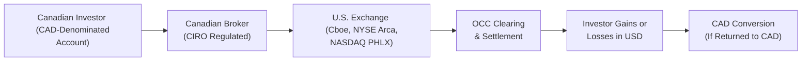

## 29.2 The U.S. Exchanges

If you’ve ever kept an eye on the volume that flows through U.S. equity and index options markets, you already know they’re massive. But maybe you’ve wondered: Should Canadian investors tap into that vast ocean of liquidity? Or is it just, well, too far away—like a big carnival you’d love to check out but find yourself hesitating at the gate? Let’s explore why so many traders and investors from Canada (and around the world, honestly) find themselves looking across the border to trade on the Chicago Board Options Exchange (Cboe), NYSE Arca, NASDAQ PHLX, and other U.S. venues.

We’ll examine the advantages of trading in these U.S. markets, highlight the differences in contract specifications and regulatory frameworks, and walk through potential currency pitfalls. By the end, you’ll have a complete picture of the opportunities and challenges lying in wait. Let’s dive right in.

  
"Cross-border trading can be thrilling. But sometimes, I confess, I’ve gotten so caught up comparing bid-ask spreads that I almost forgot about conversion fees on foreign exchange. Ouch. Lesson learned."

  
–––––––––––––––––––––––––––––––––––––––––––––––––

  
Understanding U.S. Derivatives Exchanges

Cboe (once called the Chicago Board Options Exchange) often comes first to mind when folks mention U.S. listed options. It’s something like the venerable big sibling among American options exchanges. Cboe’s suite of products includes everything from individual equity options (Apple, Microsoft, Tesla, you name it) to index options, including the famous S&P 500® index options. And yes, they also list VIX®—the volatility index options that everyone talks about when they mention “the fear gauge.”

Then there’s NYSE Arca—part of the New York Stock Exchange’s family—and NASDAQ PHLX (pronounced “flex”), which is one of the oldest stock exchanges in the U.S. (formerly the Philadelphia Stock Exchange). These two also offer a wide array of equity, ETF, and index options. They each have their own market-making structures, trading rules, and fee models. Traders shop around for tight spreads and better liquidity, so you’ll often see the same option series quoted across multiple U.S. exchanges, each vying for order flow.

What sets these U.S. exchanges apart?

• Breadth of Products: U.S. option exchanges list thousands of equity options and myriad index options, some on well-known underlying indexes (S&P 500, NASDAQ-100), some on narrower or specialized market indexes. That’s a bigger pond than you’ll find in Canada.

• Liquidity and Volume: High volumes often lead to narrower bid-ask spreads. This is especially true for the “big name” stocks, index options, and certain ETFs. 

• Technology and Speed: The U.S. options markets invest heavily in electronic platforms that handle enormous quote traffic. Market participants include everyone: high-frequency traders, broker-dealers, proprietary trading firms, and so forth.

• Regulatory Differences: The overseers here are the Securities and Exchange Commission (SEC; see https://www.sec.gov/) and the Commodity Futures Trading Commission (CFTC; see https://www.cftc.gov/) for certain derivatives. Meanwhile, the Financial Industry Regulatory Authority (FINRA) is the U.S. self-regulatory organization supervising broker-dealers. This is akin to how CIRO oversees Canadian investment dealers, but with its own flavor and rulebook.

  
"One day, I was so laser-focused on S&P 500 index options that I didn’t realize the margin requirements would differ from my usual TSX-based trades. Word to the wise: figure out those differences before you place the order. Otherwise, your broker might surprise you with a margin call bright and early the next day."

  
–––––––––––––––––––––––––––––––––––––––––––––––––

  
Comparing U.S. and Canadian Listed Options

At a quick glance, a listed option is a listed option, right? Well, yes, but not exactly. There are a few subtle (and not so subtle) points to keep in mind:

Underlying Assets and Contract Specs  
• In Canada, many of the go-to equity options revolve around domestically listed stocks or the S&P/TSX 60 index. In the U.S., the array of underlying assets is enormous, from global technology powerhouses to real estate investment trusts (REITs) and niche exchange-traded funds (ETFs).  
• Contract size for equity options is typically 100 shares in both countries. However, for index options like the S&P 500 (SPX options) or the NASDAQ-100 (NDX), the notional size can be quite large and the ticker symbols differ. Some measures, like settlement style (European or American exercise), distinctions between a.m. and p.m. settlement, or certain mini-contract offerings, also come into play in the U.S.  

Regulatory Landscape and Margin Rules  
• Canadian margin rules are set and guided by CIRO, while the U.S. rules come from the SEC and FINRA. They might look mostly similar to casual observers, but there can be differences in how option spreads are margined, definitions of what’s “covered,” and how net capital calculations get computed.  
• In some cross-border scenarios, your Canadian broker may offer you consolidated margin for both Canadian and U.S. positions, but that depends heavily on how they structure their clearing relationships.  

Taxation and Settlement  
• Typically, profits from U.S. options trading by a Canadian resident could be subject to U.S. withholding taxes in specific scenarios. The Canada-U.S. tax treaty, your classification as an active trader or an investor, and how you hold the account all factor in.  
• Almost all U.S. equity and ETF options follow the same T+1 or T+2 settlement cycle for trades, but be aware that assignment and exercise timelines remain consistent with the established U.S. rules, which might differ slightly from Canadian cycles.  
• If you maintain your brokerage account in Canadian dollars, your gains or losses from U.S. trades will fluctuate with the CAD/USD exchange rate—even if you’re “winning” on your option trade, a strong loonie can cut into your net gains.  

Currency Exchange Implications  
• By far, one of the biggest stumbling blocks I’ve seen for first-time cross-border option traders is underestimating the currency conversions. If you buy and sell an option in U.S. dollars, but your account is in CAD, you’ll face the possibility of additional conversion fees when you realize your profit or cover your losses.  
• In some cases, you can maintain a USD sub-account with your Canadian broker. That means you can keep a chunk of your funds in U.S. dollars and only convert what you need back to CAD. Possibly a better route if you plan to trade frequently in U.S. markets.

  
–––––––––––––––––––––––––––––––––––––––––––––––––

  
Cross-Border Arbitrage Opportunities

Because U.S. markets often have heavier trading volume, sometimes the price of an option on a dually listed stock (traded in Canada and the U.S.) will open the door to cross-border arbitrage strategies:  
• You notice the implied volatility for a certain stock’s options is disproportionately higher or lower on one side of the border.  
• You might simultaneously buy a call option in one market and sell the equivalent or a correlated call option in the other.  

In principle, you might capture a profit if implied vols converge (or if the underlying price moves in a way that benefits your positions). In practice, there are significant complexities: transaction costs (commissions, exchange fees), currency conversions, potential slippage, or differences in contract specifications. Arbitrage that looks profitable on paper can vanish once you factor in liquidity or spread slippage.

  
–––––––––––––––––––––––––––––––––––––––––––––––––

  
Cross-Border Compliance Considerations

Dealers and portfolio managers who serve clients in cross-border trades have to respect the rules of both countries. Here’s an overview:

1. Registration Requirements  
   • If a Canadian portfolio manager has U.S. clients or invests in U.S. markets on behalf of Canadians, they may need to engage an affiliate entity in the U.S. that is properly licensed.  
   • U.S. markets often require that brokers who directly handle customer orders in the U.S. be registered with the SEC and FINRA.  

2. Best Execution and Disclosure  
   • CIRO (https://www.ciro.ca/) expects Canadian dealers to obtain best execution for clients—a principle that can extend to U.S. markets if your official best price is found there.  
   • Full, plain-language disclosure about currency risk, liquidity concerns, and the larger breadth of underlying assets is typically required.  

3. Margin and Clearing  
   • Clients must meet margin requirements set by the U.S. exchange rules if trading is routed through a U.S. affiliate. Otherwise, if trading is done through a Canadian broker with access to U.S. liquidity, margin rules might be integrated or “harmonized” in some manner.  
   • Clearing for cross-border trades typically occurs via clearing corporations in the U.S. such as the Options Clearing Corporation (OCC), but your Canadian broker will handle your settlement and margin calls under their own arrangement.

  
–––––––––––––––––––––––––––––––––––––––––––––––––

  
Connectivity and Execution Through Canadian Brokers

If you log into your Canadian brokerage platform, you’ll often see a capability to plug directly into U.S. exchanges. Major Canadian brokers have robust connections to Cboe, NYSE Arca, and all the other major options exchanges in the States. You can search for an option on a well-known U.S. stock or ETF, and voilà—it’s right there, typically with a huge chain of strike prices and expirations.

But it’s not entirely frictionless. Here’s what you should keep in mind before you dive in:

• Options Trading Approval Levels: Canadian brokers have multi-tiered approval for options trading (covered calls vs. spreads vs. naked puts, etc.). Make sure your approval level is set to allow the type of strategy you want to do on a U.S. product.  
• Risk Disclosures: When you apply for U.S. option trading, your broker will likely provide additional disclaimers referencing the U.S. regulatory environment.  
• Margin Setups: Some brokers unify your margin across CAD and USD segments. Others require you to keep separate sub-accounts if you’re going to do a fair amount of U.S. trading.  
• Fees for Foreign Exchange: Possibly the highest friction point for many folks. Watch your conversion costs, especially for repeated or large trades.

  
–––––––––––––––––––––––––––––––––––––––––––––––––

  
Mermaid Diagram: Cross-Border Option Trading Flow

Below is a simple flowchart showing how a trade placed by a Canadian investor can make its way to a U.S. exchange. Notice how the clearing and settlement process can eventually loop back to Canadian dollars if you don’t keep a USD sub-account:

Explanations:  
• The investor logs into a Canadian brokerage.  
• The broker is connected to the U.S. exchange.  
• Upon trade execution, the U.S. clearing corporation (OCC) handles settlement.  
• Realized gains or losses are in U.S. dollars. If the investor then decides to bring funds back into their CAD account, the currency becomes subject to exchange rates and fees.  

  
–––––––––––––––––––––––––––––––––––––––––––––––––

  
Case Study: Using a U.S. Index Option to Hedge a Canadian Portfolio

Let’s say you hold a big bag of Canadian blue-chip equities. You believe the broader North American market may take a temporary dip, so you want a quick but potent hedge. You decide to buy put options on the S&P 500—why? Because it’s one of the largest and most liquid indexes in the world, and you suspect that, historically, Canadian and U.S. equity markets often move somewhat in tandem.

• You buy an S&P 500 put option traded on Cboe.  
• The cost is denominated in USD, so you either convert from CAD to USD or use your existing USD funds.  
• If the global market experiences a downward correction, the put could gain value, offsetting potential losses in your Canadian portfolio.  
• However, if the CAD/USD exchange rate shifts significantly, your result might be impacted. For instance, if the loonie strengthens drastically, any profit in USD terms might not be as large once converted back to CAD.  
• Yes, there’s a correlation difference (the S&P 500 is not a perfect mirror of your Canadian equities), so you’re not as fully hedged as you would be using a domestic product like an S&P/TSX 60 put.  

It’s a perfect illustration of that old adage: the bigger, more liquid instrument can give you a more cost-efficient hedge, but you also take on additional currency exposure and some correlation mismatch.

  
–––––––––––––––––––––––––––––––––––––––––––––––––

  
Best Practices and Potential Pitfalls

1. Stay Current on Regulation  
   • The SEC, FINRA, and CFTC can—and do—update rules periodically. For instance, rules around pattern day trading or short-selling can catch you off guard.  
   • Keep an eye on bulletins from CIRO (https://www.ciro.ca/) for any changes in how they handle cross-border trades or new disclosure requirements.

2. Understand OCC Clearing Timelines  
   • Options in the U.S. are cleared by the Options Clearing Corporation (OCC), which sets assignment and exercise rules.  
   • Deadlines for exercise instructions can sometimes differ from Canadian processes (especially for expiring options or corporate actions).

3. Mind the FX Risk  
   • I know I’m hitting this point repeatedly, but it’s so easy to forget. Gains or losses in USD might not sustain the same value in CAD.  
   • Some brokerages let you lock in a forward contract on currency if you anticipate a large trade. That can partially mitigate currency risk, though it adds an extra cost.

4. Thoroughly Vet Arbitrage  
   • If you’re itching to do cross-border arbitrage, do your backtesting and factor in real-world costs, including short borrow fees, option assignment risk, and currency conversions.  
   • Sometimes the best “arbitrage” is the trade you don’t do because the frictional costs are higher than you thought.

5. Broker Interface Familiarity  
   • Confirm that your broker’s platform offers robust charting, real-time quote data, and risk analytics for U.S. products.  
   • If you trade complex spreads (like iron condors, straddles, or ratio spreads), you want an interface that calculates margin requirements seamlessly for U.S. markets.

  
–––––––––––––––––––––––––––––––––––––––––––––––––

  
Further Resources

• SEC Official Website (https://www.sec.gov/): For official U.S. securities laws and rule updates.  
• CFTC (https://www.cftc.gov/): Oversees certain derivatives, especially futures and some options on futures, in the U.S.  
• CIRO (https://www.ciro.ca/): Guides Canadian dealers on cross-border trading obligations and best practices.  
• Options Industry Council (https://www.optionseducation.org/): Offers free, wonderful educational materials on options trading in the U.S.  
• FIA – Futures Industry Association (https://fia.org/): Good resource for reading about derivatives clearing and best practices in futures and listed options.  
• SSRN (https://www.ssrn.com/): If you’re academically curious, there’s a treasure trove of working papers exploring cross-border arbitrage, volatility spillovers, and more.

  
–––––––––––––––––––––––––––––––––––––––––––––––––

  
Glossary (Recap)

**Cboe (Chicago Board Options Exchange)**  
A major U.S. exchange known for listing options on broad market indexes (like the S&P 500), equities, and exchange-traded funds. Cboe is also recognized for pioneering the VIX options.  

**NYSE Arca / NASDAQ PHLX**  
Other U.S. options markets offering wide ranges of equity and ETF options. They compete for order flow by offering different fee structures, liquidity pools, and technology.  

**FINRA (Financial Industry Regulatory Authority)**  
A U.S. self-regulatory organization for broker-dealers and registered representatives, parallel to how CIRO serves in Canada.  

**Cross-Border Arbitrage**  
Strategies exploiting price discrepancies between U.S. and Canadian options on the same or correlated underlyings. Can be profitable, but frictional costs can erode gains significantly.  

**Currency Exchange Implications**  
Potential gains or losses arising solely from fluctuations in foreign exchange rates. Even if your position is profitable in USD, you might lose ground if the Canadian dollar strengthens.  

**Regulatory Environment**  
The set of laws, regulatory notices, and guidelines that govern securities and derivatives trading. In the U.S., this is primarily overseen by the SEC and CFTC, with SRO oversight by FINRA.

  
–––––––––––––––––––––––––––––––––––––––––––––––––

  
Reflections and Final Thoughts

So maybe now you’re thinking, “The U.S. market is a big stage, and I see the lights, but is it really for me?” And that’s exactly the question to ask. Diving into U.S. options can diversify your trading approach, open arbitrage avenues, and give you access to instruments simply not listed at home. But it comes with its share of complexities—such as foreign exchange risk and variable margin rules—that you must understand and handle.

If there’s a single key takeaway, it’s that you should never trade something you don’t completely understand. Use your broker’s resources, read the disclaimers, and, of course, keep an eye on CIRO’s guidelines for cross-border trading. With proper knowledge, U.S. exchanges can add a new dimension to your strategy arsenal.

  
"And hey, maybe a bit of personal advice: Always double-check if your trade is hedged not only from a price movement standpoint, but also from a currency standpoint. One hidden cost can overshadow all the fancy strategy. Ask me how I know."

  
Stay inquisitive, stay careful, and harness the best that cross-border trading has to offer.

  
–––––––––––––––––––––––––––––––––––––––––––––––––

  
## Sample Exam Questions: The U.S. Exchanges



### Which regulatory authority primarily oversees U.S. equity options?
- [ ] The Commodity Futures Trading Commission (CFTC)
- [x] The Securities and Exchange Commission (SEC)
- [ ] The Canadian Investment Regulatory Organization (CIRO)
- [ ] The Bank of Canada

> **Explanation:** The SEC oversees the offerings and trading of equity-based options in U.S. markets, while the CFTC focuses more on futures, and CIRO oversees Canadian broker-dealers and market integrity.

### Which U.S. exchange is well-known for listing the VIX volatility index options?
- [ ] NASDAQ PHLX
- [ ] NYSE Arca
- [x] Cboe (Chicago Board Options Exchange)
- [ ] ICE Futures U.S.

> **Explanation:** Cboe pioneered the VIX options, often called the “fear gauge,” making it a widely recognized index options market.

### What is one key difference Canadians often encounter when trading U.S. options compared to Canadian options?
- [ ] There are no bid-ask spreads in the U.S.
- [x] Different margin rules and potential additional currency conversion costs
- [ ] No requirement for clearing corporations
- [ ] All U.S. options settle in Canadian dollars

> **Explanation:** Canadian investors are subject to U.S. margin rules when trading on U.S. exchanges and face potential currency conversion costs if their accounts are CAD-denominated.

### Which entity provides clearing services for U.S. listed options?
- [ ] The European Central Counterparty
- [ ] The TSX
- [ ] The Capital Markets Authority
- [x] The Options Clearing Corporation (OCC)

> **Explanation:** The OCC clears all standardized listed options in U.S. markets, ensuring trades are fulfilled and managing counterparty risk.

### Why might a Canadian investor want to maintain a separate USD sub-account when trading U.S. options?
- [ ] It allows skipping margin requirements entirely.
- [x] It can help reduce frequent currency conversion fees when entering or exiting positions.
- [ ] It guarantees gains from currency movements.
- [ ] It is required by CIRO for all cross-border trades.

> **Explanation:** Keeping funds in USD helps traders avoid costly conversions each time they buy or sell an option on a U.S. exchange.

### When engaging in cross-border arbitrage between Canadian and U.S. markets, which factor is a primary consideration?
- [x] Transaction costs, including foreign exchange and brokerage fees
- [ ] The absolute difference in government bond yields
- [ ] Whether the underlying is an energy commodity
- [ ] The color of the broker’s logo

> **Explanation:** In cross-border arbitrage, transaction costs (like exchange fees and currency conversions) can quickly eat into any theoretical profit from quoting differences.

### A Canadian investor buying S&P 500 put options on Cboe to hedge a portfolio of Canadian stocks should be aware of:
- [ ] A perfect one-to-one correlation between the S&P 500 and Canadian stocks
- [ ] No possible currency risk
- [x] Potential correlation mismatch and currency exchange fluctuations
- [ ] Zero cost to hedge a portfolio in the U.S.

> **Explanation:** S&P 500 put options can hedge broad equity exposure, but they may not match Canadian equities perfectly, and currency conversions can impact final returns.

### Which organization is the U.S. self-regulatory body responsible for overseeing broker-dealers and enforcing securities rules?
- [ ] CIRO
- [x] FINRA
- [ ] Federal Reserve Bank
- [ ] CITT (Canadian International Trade Tribunal)

> **Explanation:** FINRA (Financial Industry Regulatory Authority) oversees broker-dealers in the United States, somewhat analogous to CIRO in Canada.

### Which of the following might occur if a Canadian broker fails to follow U.S. registration or compliance rules while placing orders on U.S. markets?
- [x] They could face penalties from U.S. regulatory authorities such as the SEC or FINRA
- [ ] They would automatically be granted membership on all U.S. exchanges
- [ ] The trades would be magically canceled with no repercussions
- [ ] The trades would always execute with zero commissions

> **Explanation:** Cross-border compliance is crucial, and failing to meet U.S. registration requirements can lead to significant regulatory penalties and possible bans.

### True or False: “Even if an option trade in the U.S. is profitable in USD terms, it could result in a net loss when converted to Canadian dollars.”
- [x] True
- [ ] False

> **Explanation:** Currency fluctuations can erode or magnify gains when your base currency is different from the currency in which trades settle.


