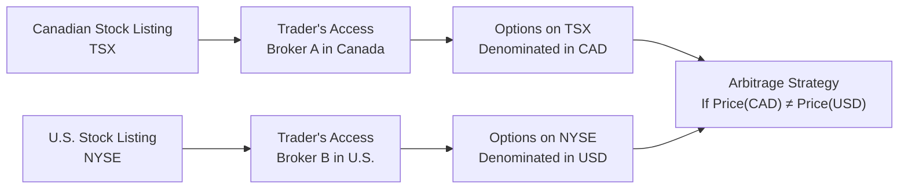

## 29.3 Interlisted Options & Arbitrage Opportunities

Imagine you have a favorite Canadian tech stock—let’s call it MapleTech. It trades on the Toronto Stock Exchange (TSX) in Canadian dollars (CAD) and on the New York Stock Exchange (NYSE) in U.S. dollars (USD). You can also buy or sell options on MapleTech in both markets. If you’ve ever found yourself wondering, “Hey, could I buy an underpriced option in Canada and simultaneously sell an overpriced option in the U.S. for a profit?”—well, that’s interlisted arbitrage in a nutshell. 

This section explores how options on the same underlying can be listed on multiple exchanges, how eager traders might profit from pricing discrepancies across borders, why such discrepancies may occur, and what roadblocks—like fees, regulations, or currency risks—can complicate or even negate what initially looks like “free money.” 

We’ll also highlight the regulatory landscape, especially from a Canadian point of view under the Canadian Investment Regulatory Organization (CIRO), and show how advanced trading technology and data analytics come into play. Even if you’re not aiming to become a cross-border arbitrage wizard, understanding how these markets interconnect can help you see the bigger picture of global capital flows and how these opportunities might arise in your day-to-day trading.

  
### Interlisted Securities: A Quick Refresher

When a security is “interlisted,” it means it is listed on more than one exchange, often across different countries. Major Canadian companies—think banks, mining companies, and large tech players—frequently have this arrangement, listing their shares on the TSX and on a U.S. exchange (like NYSE or Nasdaq). Why do they do this? 

• They can broaden their investor base.  
• Access more liquidity.  
• Potentially help their shares attract higher valuations.  
• Provide integrated coverage in different time zones and currencies.  

From an options trader’s perspective, interlisted securities are particularly interesting because you can sometimes trade the same underlying company’s calls and puts in two (or more) separate markets. That means if pricing in one market lags behind dynamic price changes in the other market—or if currency movements cause misalignment—you might find an arbitrage opening.

### The Essence of Arbitrage

Arbitrage is all about capitalizing on price discrepancies for the same (or closely related) asset in different markets. In theory, perfect markets quickly eliminate any differences, but real markets are not perfectly efficient. In practice, you may spot short-lived divergences that can be exploited. The essential steps in a simple arbitrage could be:

• Buy something where it’s cheap.  
• Simultaneously sell the same (or an economically equivalent) something where it’s expensive.  
• Lock in the difference as profit.  

When that “something” is an option contract, you have to make sure all the contract specifications match. Even if the underlying stock is the same corporation, you might see slight variations: differences in strike price increments, expiry dates, or times to settlement. Also, watch out for currency conversions if one contract is in CAD and the other in USD.

### Cross-Currency Hedging

Let’s say you buy MapleTech’s call options denominated in CAD on the TSX and sell MapleTech’s call options denominated in USD on the NYSE. That might look like a straightforward arbitrage trade if the CAD options appear underpriced relative to the USD options. However, you’re not just dealing with MapleTech’s share price movement. You’re also implicitly speculating on the USD/CAD exchange rate.

If MapleTech’s stock goes up in one currency but the exchange rate moves in an unfavorable way, your overall profit might shrink or disappear. You may have to hedge that foreign exchange exposure. For instance, you could use a USD/CAD forward or futures contract, or you could transact in a currency swap. The idea is to lock in a known exchange rate to preserve the “pure” equity/option arbitrage and not have your gains evaporate because the U.S. dollar tanked or soared. Of course, hedging has its own costs, so you have to add that to your equation when you’re analyzing potential profits.

### Contract Specifications and Liquidity Concerns

Interlisted options aren’t always identical. Here are a few ways they might differ:

• Strike Price Increments: The TSX may list strikes in increments of $1.00 or $2.00 CAD, while a U.S. exchange might list them in increments of $1.00 or $2.50 USD.  
• Expiry Cycles: The TSX or Bourse de Montréal might list monthly or weekly expiries, but the specific cycles can differ from the listing cycles in the U.S.  
• Notional Exposure: The standard contract size is typically 100 shares per options contract on both sides of the border, but always confirm if it’s 100 or some adjusted figure (especially post-corporate actions).  
• Trading Hours: Both Canada and the U.S. typically operate from 9:30 am to 4:00 pm Eastern Time. During certain periods (like Daylight Saving changes), there can be slight differences in open or close times, or market holidays can differ.  

The bottom line: the “same” option can come with slight structural differences that might matter a lot if you’re trying to do an exact hedge or an exact arbitrage. You also want to confirm that actual liquidity is decent in both markets. Sometimes the Canadian side is thinner, leading to wider bid-ask spreads. If you can’t trade big volumes without moving the market price, the cost from slippage might kill your potential profit.

### Time Zone Nuances

Now, Canada and the U.S. are mostly in similar time zones, so the classic “overnight lead or lag” scenario you might see with Asian or European markets is less common. But you still might see short intervals where one exchange has more price discovery—maybe MapleTech’s largest investor relations events happen in Toronto, or big news breaks while the U.S. is on a holiday. Price dislocations can occur around these edges, especially in fast-moving news cycles. 

If you plan to exploit those fleeting moments, you’ll want lightning-quick trade executions and robust real-time market data. A half-second delay might be enough for a competitor’s algorithm to step in front of you and annihilate your advantage.

### Regulatory Requirements and Compliance

Arbitrage might seem purely mechanical—buy here, sell there—but you still must follow market rules in each jurisdiction:

• CIRO in Canada (visit [https://www.ciro.ca](https://www.ciro.ca) for updates and bulletins) sets position limits, ensures compliance with best execution, and enforces insider trading laws.  
• The U.S. Securities and Exchange Commission (SEC) demands thorough record-keeping, especially for cross-border trades. If you push or exceed position or exercise limits, you could run afoul of regulations quite rapidly.  
• Insider Trading: If you have material non-public info about MapleTech in Canada, it’s illegal to trade on that info in the U.S. too. There’s no “jurisdiction gap” that lets you escape insider trading rules.  
• Trade Reporting: Large option positions often must be reported to relevant regulatory bodies. Failing to comply can bring hefty fines or suspension.  

Bottom line: cross-border strategies can double the red tape, not just the potential payoff. Make sure you or your compliance officers are up to speed on the differences in margin rules, position limits, and trade reporting thresholds in both Canada and the U.S.

### Transaction Costs and Fees

It’s pretty easy to get starry-eyed about the money you could make from an apparent mispricing. But you’ve got to subtract:

• Brokerage Commissions: You’ll likely pay commissions twice (once in Canada, once in the U.S.) unless you have a specialized cross-border brokerage arrangement.  
• Currency Conversion: Converting CAD to USD or vice versa has a spread cost.  
• Exchange Fees: Exchanges sometimes tack on fees for data usage, plus per-contract trading fees.  
• Clearing and Settlement Costs: Your clearing firm or prime broker might charge you for cross-border settlement.  
• Opportunity Cost of Collateral: If you’re using margin or collateral in one currency, you might face extra costs or constraints.  

When the potential arbitrage is just a few pennies per share, these frictional costs can be the difference between a decent gain and a net loss.

### Technology and Execution

High-frequency traders with co-located servers strive to identify and exploit these inefficiencies faster than the blink of an eye. If you’re seeing a price difference manually and place your order 30 seconds later, that disparity might already be gone. 

Co-location means your trading system is physically situated in close proximity to an exchange’s data center. This helps reduce latency—i.e., the time it takes for your order to travel to the exchange. Many firms also use “smart order routers” that automatically scan multiple venues to find the best fill. 

Without robust technology, you might see the profit opportunity flash by, but fail to capitalize on it. For institutional players, that can mean big budgets for infrastructure and an entire unit of “quants” fine-tuning high-speed algorithms. Retail traders face an uphill battle here, but if the spread is wide enough or if you catch a slow-moving price, you might not need to be the fastest to the punch.

### Practical Example: MapleTech Arbitrage Attempt

Let’s bring this idea to life with a (slightly simplified) anecdote:

I once watched MapleTech’s TSX option chain and simultaneously kept an eye on its NYSE option chain. On the TSX, the at-the-money MapleTech calls expiring in 30 days were trading at CAD 1.60. On the NYSE, the same calls (with effectively the same strike in USD, adjusted for currency) were trading at USD 1.25. 

At an exchange rate of 1.25 CAD per USD, the U.S.-listed option was effectively worth CAD 1.56. That’s a 4-cent discrepancy (1.60 – 1.56 = 0.04 CAD). I thought, “Aha! Free $4 profit per contract, ignoring commissions.” Then I realized:

• My brokerage commissions were CAD 5 for the Canadian side, plus USD 5 for the U.S. side. Across 10 contracts, that’s CAD 50 + USD 50. The total of around CAD 112 kills the small CAD 40 difference (10 contracts × 0.04 × 100 shares/contract = CAD 40).  
• By the time I executed both sides, the markets might have moved.  
• I’d also need to hedge or factor in that I might not exactly match the notional exposure if the strike increments were slightly different.  

Once I did the math, it was basically a break-even scenario or worse. That’s not to say bigger differences don’t appear, especially in times of market volatility. But it’s rarely as juicy as it may appear at first glance.

### Diagram: Illustrating an Interlisted Option Arbitrage Flow

Below is a simple Mermaid diagram showing how the flow of trading might occur between a Canadian listing and a U.S. listing. It highlights that a trader might look for a price divergence, then factor in currency conversion and potential fees.

### Common Pitfalls

• Overlooking Currency Fluctuations: If you forget or underestimate how currency can shift, you might be unprotected against sudden USD/CAD swings.  
• Underestimating Execution Speed: In efficient markets, mispricings might last milliseconds. Slow trades can get a worse fill and produce a loss.  
• Neglecting Fees: The biggest rookie mistake is ignoring fees and commissions before diving in.  
• Ignoring Different Volatility Surfaces: The implied volatility might be slightly different in each market, reflecting different supply/demand for options. These aren’t always “pure” mispricings.  
• Regulatory Headaches: If you accidentally exceed position limits in one country or fail to comply with cross-border trade reporting, that can lead to major compliance issues and possible sanctions.  
• Contract Specs Mismatch: You must ensure you’re comparing “apples to apples.” A difference in how strikes roll or how options settle can turn your anticipated arbitrage into a big mismatch.

### Best Practices

• Use Real-Time Data: Rely on direct market data feeds (possibly from the Bourse de Montréal, Cboe, or consolidated feeds) to keep track of changes in quotes and implied volatilities.  
• Automate Where Possible: Consider algorithmic detection. If you’re serious about capturing small spreads, you want a system that can react faster than you can click.  
• Maintain a Proper Platform: Tools like Bloomberg, Refinitiv Eikon, or even open-source Python libraries (like pandas or zipline) can help you backtest how often these inefficiencies arise and if they’re large enough to overcome transaction costs.  
• Hedge Currency Risk: If you’re going to commit capital in multiple currencies, at least consider locking in the local exchange rates via forwards, futures, or currency swaps.  
• Monitor Implied Volatility & Dividends: Interlisted options might carry different implied volatilities or assumptions about dividends. If you leave one side unhedged, your profit might vanish because of an unexpected dividend change or a difference in ex-dividend dates.  
• Stay Onside with Regulations: Read CIRO’s notices concerning cross-border trading. Check position limits for each exchange. If you have large exposure, register or report as needed.  

When in doubt, consult experienced compliance professionals—nobody wants to trip up on a cross-border regulation.

### Advanced Tools and Further Resources

• CIRO: Check out [https://www.ciro.ca](https://www.ciro.ca) for bulletins and rules. They often provide guidance on best practices for cross-border order routing and trade reporting.  
• Bourse de Montréal: The Bourse is Canada’s main derivatives exchange. Their data can help you track Canadian-listed options on heavily interlisted names.  
• U.S. Exchanges: Big names like Cboe, Nasdaq, and NYSE provide advanced analytics and daily data feeds.  
• Institutional Toolkits: Many dealers or prime brokers have advanced cross-border systems that let you see real-time synthetic quotes and net exposures. This can streamline your arbitrage.  
• Market Microstructure Research: Journals like the “Journal of Financial Markets” publish detailed studies on how interlisted securities in North America behave and where inefficiencies might pop up.  

I’ve known traders who exclusively look for these small price dislocations. Some days, they see nothing. Other days, if there’s a market shock (like surprising economic data or a big corporate announcement on the Canadian side that the U.S. crowd hasn’t fully priced in yet), they can swoop in for quick, risk-limited gains.

### Glossary Recap

• **Interlisted Security:** A stock or derivative that’s listed on more than one exchange, often in different countries.  
• **Arbitrage:** Seeking a (theoretically) risk-free profit by exploiting price discrepancies in identical or similar instruments across different markets.  
• **Contract Specifications:** The detailed terms of a listed derivative contract, such as strike price increments, expiry cycles, and settlement rules.  
• **Co-Location:** Storing your trading servers physically close to the exchange to reduce network latency and gain faster access to market data.  
• **Cross-Currency Hedging:** Neutralizing currency risk by taking an offsetting position in another currency, typically via forwards, futures, or swaps.  

In practical terms, always remember that no arbitrage is truly risk-free in the real world. You might face hidden exposure from your currency positions, operational challenges, or abrupt news events that shift the markets just as you’re about to close the position.

### Final Thoughts

Interlisted options present an exciting playground for those seeking arbitrage opportunities. The bounty can be sweet when you catch a genuine mispricing. But it’s not for the faint of heart or for novices who might forget fees, slippage, or regulatory overheads. Get to know the details of each exchange’s listing standards, ensure you’re comfortable with foreign currency exposures, and consider advanced technological solutions to keep your trades efficient.

It’s also worth emphasizing that while these small price discrepancies might look like free money, the competition is fierce. High-frequency traders armed with sophisticated systems can often react to price dislocations in microseconds. Retail or smaller institutional players might only succeed if they keep costs low, remain flexible, and pick their spots carefully—maybe during bigger market moves. 

Still, with thorough preparation, an up-to-date knowledge of cross-border rules, and a robust toolkit for data analysis, you can turn these fleeting mispricings into an occasional source of profit—or at least add an extra dimension to your overall trading skill set.  

---

## Sample Exam Questions: Interlisted Options & Arbitrage Opportunities



### Which of the following best describes “interlisted” securities?

- [x] Securities listed on multiple exchanges, often in different countries
- [ ] Securities exclusively listed on over-the-counter markets
- [ ] Securities that bypass exchange listing requirements
- [ ] Securities that bear no connection to equities

> **Explanation:** “Interlisted” means the same company’s shares trade on two or more exchanges, frequently including both a Canadian and a U.S. listing.

### A trader notices that a Canadian-listed option trades cheaper than a U.S.-listed option on the same underlying. Which factor is most likely to reduce the profit from a cross-border arbitrage attempt?

- [ ] Very high notional price of the underlying
- [x] Currency conversion fees and spreads
- [ ] Large difference in implied volatility
- [ ] No differences in the contract specifications

> **Explanation:** Currency conversion fees and exchange rate spreads can quickly erode profits from a small mispricing, especially if you must convert CAD to USD or vice versa.

### If you purchase a MapleTech call option on the TSX and sell a MapleTech call option on the NYSE as an arbitrage strategy, what is the primary extra risk you face?

- [ ] More exposure to MapleTech’s stock price
- [ ] Notional mismatch between contracts
- [x] Foreign exchange risk
- [ ] Lack of regulatory oversight

> **Explanation:** Whenever trading in multiple currencies, a major extra risk factor is currency fluctuation, which can impact net profits or losses.

### Co-location services primarily help traders by:

- [ ] Providing free market data software for cross-border trades
- [ ] Guaranteeing trades will never fail
- [x] Reducing latency in order execution 
- [ ] Eliminating the need to hedge currency exposure

> **Explanation:** Co-location is about placing your trading servers near the exchange’s data center to reduce the round-trip time for order data and market data, thus mitigating latency issues.

### Which of the following best characterizes arbitrage opportunities in interlisted options?

- [ ] They are easy to find and last several hours
- [ ] They always require minimal capital
- [x] They can be short-lived and require quick execution
- [ ] They are not subject to regulatory scrutiny

> **Explanation:** Genuine arbitrage opportunities tend to vanish quickly in efficient markets, and traders must act fast before price discrepancies disappear.

### A trader fails to consider that the U.S.-listed option on MapleTech is priced in USD while the Canadian option is priced in CAD, and incorrectly calculates a significant arbitrage profit. This scenario is most likely due to ignoring:

- [ ] Beta risk
- [ ] Time value of money
- [ ] Liquidity constraints
- [x] Currency conversion factors

> **Explanation:** The trader forgot to convert and compare values in a consistent currency, thus miscalculating the potential profit.

### If arbitrage profit margins are minimal, which of the following is most likely to eliminate the perceived profit?

- [ ] Larger implied volatility skew
- [x] Transaction costs, including bid-ask spreads
- [ ] A stable exchange rate
- [ ] Absence of arbitrage-based competition

> **Explanation:** Even a small bid-ask spread or brokerage fee can quickly wipe out modest gains in an arbitrage scenario.

### Under CIRO rules in Canada, exceeding position limits in options:

- [x] Can result in disciplinary action or fines
- [ ] Is permissible so long as the position is liquidated within 24 hours
- [ ] Has no consequences unless the trader profited
- [ ] Only applies to domestic trades on the TSX

> **Explanation:** CIRO enforces position limits to reduce market risk. Having too large a position or violating these rules can lead to significant penalties.

### Which technique helps traders protect against unexpected USD/CAD exchange rate movements when engaging in cross-border option arbitrage?

- [ ] Buying a larger position in TSX options
- [ ] Delaying trade settlement
- [x] Executing an FX hedge (e.g., a currency forward or swap)
- [ ] Ignoring the difference in currency denominations

> **Explanation:** A currency hedge (forward, futures, or swap) neutralizes the effect of adverse FX fluctuations, preserving the intended arbitrage profit.

### True or False: Interlisted arbitrage carries no regulatory risk because pricing differences occur naturally in separate countries.

- [ ] False 
- [x] True (Incorrect – see explanation below)

> **Explanation:** This statement is actually false in spirit, but because the question is framed as “True or False: … carries no regulatory risk,” the correct stance is that it does carry risk. Cross-border trades fall under multiple jurisdictions, so ignoring compliance can lead to serious consequences. Always remember that just because a pricing difference exists doesn’t mean you’re shielded from regulation.


