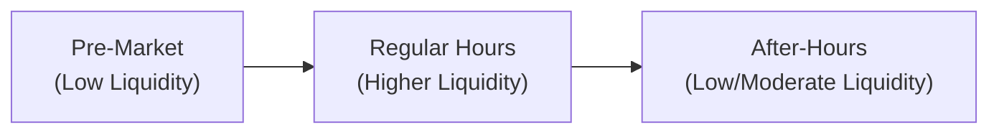

## 29.4 Trading Hours Extensions and Impact on Liquidity

If you’ve ever woken up at 5:00 AM, groggy and craving that first cup of coffee, you may have noticed certain markets flickering with life on your mobile trading app. You think, “Wait, it’s not the regular session yet—why are quotes moving?” That’s the allure and mystery of extended trading hours. More and more exchanges, including certain derivatives exchanges, offer trading sessions well before the “official” open and after the “official” close. But is this all sunshine and roses? Or does it come with, well, a whole new set of complications?

Let’s dig in and explore why extended trading hours even exist, how they affect liquidity and volatility, and what risk management steps are crucial if you’re thinking of diving into these non-traditional time segments.

---

### Why Extended Hours Exist

Picture a global marketplace where investors from Toronto, Tokyo, and Paris all want to trade the same product. Not everyone can trade during “9:30 to 4:00 local time” if that local time is in, say, Ontario, because that might be dinnertime in Asia—yet corporate details or major economic data could still break overseas. Extended hours arose (and continue to evolve) to satisfy these global investor demands.

• Global Connectivity: A portfolio manager in Hong Kong might want to hedge a position on the Montréal Exchange (the Bourse de Montréal) after a critical macroeconomic event in Asia, which could happen hours before North America’s standard market open.

• Major Announcements Timing: Sometimes, central banks or economic agencies release important data outside “usual” sessions—think 8:30 AM Eastern Time in Canada for certain economic indicators. Extended sessions aim to accommodate quick reflex trading.

• Retail Demand: It’s not just big institutions that dabble in pre- or post-market hours. Retail traders may want to adjust their positions (maybe that last-minute hedge before the next morning’s quarterly earnings).

All these factors have prompted various exchanges worldwide to extend their trading windows. However, as we’ll see, more time to trade does not automatically equate to better liquidity or frictionless pricing.

---

### Liquidity and Order Flow: What Shifts After the Bell?

When people say “liquidity,” they’re referring to how quickly you can buy or sell something without causing big price swings and facing large bid-ask spreads. During a standard trading session, you’re typically flooded with quotes from market makers, institutional orders, and retail trades. Spread is often narrow because so many participants are around.

Now, step into extended hours. You may find the order book a whole lot thinner. Why? Fewer market makers might be posting quotes. Or major institutional desks might hold off until the “official” open to handle large orders (especially if their risk management teams aren’t staffed 24/7). That can mean:

• Wider Spreads: Because supply and demand are partial, the difference between the bid and the ask can expand.  
• Lower Volume: Fewer participants equals fewer trades.  
• Volatility Impulses: In some cases, volatility might spike if a surprising piece of news hits when few are trading. Prices can jump more dramatically on small orders.

For example, let’s say a major Canadian bank issues an unexpected guidance cut on its quarterly earnings at 7:00 AM Eastern Time—two and a half hours before the regular session. If you’re in the extended session and you see that event, you might find yourself with either a big trading opportunity or a big headache. The limited order flow means you could bag a huge gain or suffer a big whipsaw if the stock’s option chain has only a handful of quotes.

---

### Personal Anecdote: My Early-Morning Trading Surprise

Let me share a quick personal story: A few years back, I placed an order to buy call options on a well-known Canadian energy company in the pre-market session—because I read bullish news from overseas. I was excited, thinking I got into the trade “early.” But guess what? Liquidity was so sparse that the bid-ask spread was enormous. I ended up paying a hefty premium, and when the regular session opened, the bid-ask spread tightened substantially, practically evaporating my theoretical “pre-market edge.” That taught me a painful but valuable lesson: extended hours can sometimes introduce more risk than reward, if you’re not vigilant about your order types and the potential for wide spreads.

---

### When Volatility Jolts Overnight

Another big question is: do extended hours mean more or less volatility? Sometimes volatility is tame, especially if “nothing big” is happening. But the moment some major macro data or corporate event breaks, prices can move sharply if there aren’t enough participants “on the other side” of your trade.

• Large Swings on Thin Volume: Volatility in extended hours can swing widely because it takes fewer trades to move the price.  
• Pre-News Positioning: Some experienced traders try to anticipate big announcements (like Bank of Canada policy changes) and position themselves in extended hours to “front-run” a sudden movement at the start of the regular session.  
• Earnings Surprises: With many companies releasing earnings before or after the regular session, option traders might race in to buy or sell calls and puts well before the official opening bell.

---

### Risk Management for Extended Hours Trading

Now that we’re all suitably nervous about the potential dangers, let’s pivot to practical tips. Extended hours might not be all that different from regular hours if you have a robust risk management plan in place. That plan might include:

• Real-Time Monitoring of Global Markets: Keep tabs on what’s happening in Asia, Europe, or anywhere else that might dump market-moving information into your morning coffee. Economic calendars—like the ones from Eikon, Bloomberg, ForexFactory, or even the Bank of Canada’s release schedule—are vital references.

• Adequate Staffing or Personal Bandwidth: Let’s face it, you can’t trade continuously if you’re asleep (unless you’re an algorithm). Make sure you or your trading desk are fully alert during extended hours, or schedule alerts to wake you if a certain price threshold is breached.

• Technology Infrastructure: Use a trading platform that supports extended sessions, and ensure that platform is stable. I’ve seen folks get “frozen out” of their accounts at 7:15 AM because the system wasn’t designed for pre-market volume, which can be a bit of a nightmare.

• Order Types: Protective stops and limit orders become even more critical when liquidity is shaky. A market order might fill at a shockingly bad price if there’s only one lonely quote out there.

• Exchange/Broker Rules: Some brokers automatically convert certain extended-hours trades into “day-only” orders. Others might not allow complex option spreads after the regular close. Check your broker’s fine print or the exchange’s rule book. The Bourse de Montréal, for instance, might have specific guidelines about how trades are reported and cleared if processed outside the core trading hours.

• Specific Settlement/ Margin Rules: CIRO (the Canadian Investment Regulatory Organization) might require the same margin for your position, but some clearinghouses or brokers add margin surcharges due to extended hours risk. The logic is that price could swing dramatically while fewer participants are trading, increasing the potential for big losses that the clearinghouse must cover.

---

### Diagram: Typical Liquidity Flow Across Extended and Regular Sessions

Below is a simplified Mermaid diagram illustrating the potential liquidity landscape from a typical day, including extended hours. (Don’t worry if it looks complicated—you can think of the lines as showing liquidity levels during different sessions.)

• Pre-Market: Liquidity is often low. Price can move fast if surprises occur.  
• Regular Hours: Higher liquidity, more efficient price discovery, typically narrower spreads.  
• After-Hours: Liquidity can be moderate to low, with wide bid-ask spreads.  

---

### Regulatory Considerations (CIRO and Beyond)

As of 2023, Canada’s new self-regulatory organization, CIRO, oversees investment dealers and monitors marketplace integrity for equity and debt markets, including listed and certain over-the-counter derivatives. Historically, IIROC and MFDA existed as separate regulators, but they amalgamated to form CIRO. For extended hours trading:

• Best Execution and Client Interest: CIRO guidelines push dealers to obtain best execution even in extended sessions. That means taking “reasonable steps” to ensure you don’t fill your client automatically at a bad price just because it’s 8:00 PM.

• Client Disclosures: There might be disclaimers about the higher risk of price fluctuations outside normal hours. The CIPF (Canadian Investor Protection Fund) remains your main coverage resource if a member firm defaults, covering your assets up to prescribed limits.

• Reporting Requirements: Sometimes, trades done in an extended session might only be published under special conditions. Or they might be aggregated with the next day’s official volume. Check the Bourse de Montréal’s circulars or CIRO’s bulletins on after-hours reporting.

---

### Hedging Overnight News with Extended Hours

Let’s say you hold a significant position in a Canadian energy producer, and you see an overnight news release about a large pipeline regulation shift. You suspect the next morning’s market might open sharply lower. Extended hours can let you quickly buy puts to hedge your exposure or even sell futures if they’re available on an exchange with after-hours sessions. With the appropriate technology set up, you can mitigate overnight risk. But caution: if the options chain is illiquid at 6:00 AM, you might face big spreads or no quotes at all.

Sometimes large institutions rely on cross-listed or interlisted securities (e.g., a Canadian stock that also trades on a U.S. exchange). If the U.S. exchange has extended hours while the Canadian marketplace is closed, you might see price discovery happening there in real time—yet be unable to execute a Canadian derivative until the Bourse de Montréal opens. This can cause an “early wave” of price movement when the Canadian market finally opens, as participants adjust to whatever happened elsewhere.

---

### Technology (Connectivity, Order Management, and Real-Time Data)

Trading in extended hours is a bit like driving at night: it’s still the same road, but your visibility isn’t as good, and it’s easier to make mistakes. This is especially true if your technology is not up to par.

• Data Feeds: Market data vendors typically have to indicate that certain quotes are from pre- or post-market sessions. If your data feed lumps them together, you might get confused.  
• Connectivity: Not all brokers or dealers enable extended hours on their main portals. Some require a special account type or advanced trading platform.  
• Limit Orders: A best practice is to use limit orders to protect from large deviations. A single unmonitored market order in extended hours can fill at an extreme price—not fun.

---

### Different Margins and Settlement Mechanisms

While the fundamental margin calculations for listed options in Canada often remain the same (especially as established by the Canadian Derivatives Clearing Corporation, or CDCC), certain brokers or clearinghouses may impose overlays during extended hours. The rationale is that if something big happens in an illiquid environment, marking-to-market your positions might show bigger intraday swings.

As you’re probably aware, settlement typically occurs on standard days for standard trades. However, if you’re trading a derivative that has a unique daily settlement time (e.g., certain index futures or weekly options with a special schedule), you must pay extra attention to deadlines. If you place a trade on a Friday evening in an extended session, do you settle Monday morning? Or is it recognized on the previous day’s session? Always confirm with your broker or read the specifics in the exchange’s rulebook.

---

### Potential Dangers and Common Pitfalls

• Overconfidence in Low Volume: Sometimes folks see an extended hours quote that looks “too good to be true.” It often is. Thin liquidity can result in artificially wide or narrow quotes that disappear as soon as you submit your order.  
• Sudden Gaps When Liquidity Arrives: You might see a calm extended session, and think, “All is well.” Then, when regular trading begins and the big players arrive, the market “corrects” to a drastically different price, leading to big winners or losers if you were positioned incorrectly.  
• Fees and Commissions: Some brokers charge additional fees for extended hours. Make sure you’re not draining your gains (or deepening your losses) purely because the session is more expensive to access.

---

### Case Study: Economic Data Release and a Surprise Move

Let’s walk through a hypothetical scenario:

1. It’s Tuesday evening, 8:00 PM Eastern, well past the official close of the Bourse de Montréal. Mike, a private investor, holds call options on a Canadian mining company.  
2. New data from Asia suggests a slowdown in metals demand. The overseas markets react swiftly, and the company’s U.S.-listed ADR (American Depositary Receipt) plunges in after-hours trading in New York.  
3. Mike notices the negative sentiment and decides to quickly unload (sell) his call options in the TSX after-hours session if it’s offered, or tries to flatten his exposure via a related futures product that has extended hours.  
4. Unfortunately, there are only a handful of quotes. The best available bid for Mike’s call options is much lower than the theoretical fair value. He has to decide: sell at a steep discount now, or wait until the regular session when more participants might drive the call option’s price back to a fairer level.  
5. Mike decides to place a limit order in the extended session, hoping another trader or market maker might appear. The limit order sits there, partially filled. Come the next morning, when the normal session resumes, extra liquidity floods in, and the price recovers slightly… but not enough to erase the losses from the global sentiment shift.

Moral of the story: extended hours can help you react quickly to new information, but the trade-off is often limited liquidity and poor pricing.

---

### Strategic Uses for Advanced Traders

Though it might sound intimidating, extended hours can offer strategic advantages if you know what you’re doing:

• Pair Trades and Arbitrage: If a particular ETF is trading in extended hours on one exchange and its underlying components open in another, advanced traders might attempt arbitrage. This is complicated but can generate profit if you manage the liquidity risk carefully.  
• Hedging for Corporate Announcements: If you suspect a big event from a global perspective (oil supply cuts, interest rate changes, etc.), you could hedge your position in extended hours as soon as news breaks, rather than waiting until the next morning’s open.  
• Foreign Investor Participation: If you’re a foreign investor who can’t easily log in during North American daytime, extended hours might be your best shot at real-time portfolio adjustments that sync with your local schedule.

---

### Market Makers: Still Key Participants

In the regular session, market makers orchestrate a liquid and balanced order book, offering continuous two-sided quotes. After hours, market makers might scale back involvement because:

• Lower Trading Incentives: The number of participants is smaller, so the potential volume is lower. The cost-benefit ratio for them posting tight spreads might not be favorable.  
• Heightened Risk: With fewer offsetting trades, they face more risk of holding an unhedged position if big news hits.  
• Shifts in Technology: Some market maker algorithms are only authorized to run during the core trading session. After all, these algorithms need robust real-time updates from multiple global sources to hedge effectively.

Hence, you as a trader might see fewer or no quotes in certain strikes or certain spreads—leading to fewer opportunities to execute your option strategies seamlessly.

---

### Practical Tools and Resources

1. **Montréal Exchange Rule Book and Trading Schedules** (https://www.m-x.ca/): Check the official schedules, holiday calendars, and any special bulletins about after-hours sessions or extended hours.  
2. **CIRO Bulletins** (https://www.ciro.ca/): The new single self-regulatory body in Canada frequently posts notices regarding best execution, risk disclosures, and margin updates.  
3. **Economic Calendars**: Providers like Eikon, Bloomberg, ForexFactory, or even the Bank of Canada’s website (https://www.bankofcanada.ca/) let you see at a glance when major data releases occur that can spark after-hours volatility.  
4. **International Monetary Fund (IMF)** (https://www.imf.org/): Good for global macroeconomic analyses, which can highlight potential overnight risk events (like major policy shifts in Asia or Europe).

---

### Final Thoughts

Extended trading hours can offer both convenience and complexity—perhaps quite a bit, actually. You can manage global risk, respond promptly to late-breaking or early-morning news, and potentially capture unique arbitrage opportunities. But, as I learned the hard way, you might also face wider spreads, razor-thin volume, and big spikes in volatility.

If you’re considering extended hours for your derivatives trading, step in carefully. Have a plan. Understand how your trade might settle. Check your margin requirements. And keep a watchful eye on major economic data. Ultimately, if you approach it with a robust strategy and a healthy dose of caution, extended hours can become one more tool in your trading toolbox.

Good luck—and maybe keep an extra espresso handy.

---

## Sample Exam Questions: Trading Hours Extensions and Liquidity Challenges



### Which of the following best describes a possible disadvantage of extended hours trading?

- [ ] Tight bid-ask spreads due to increased competition
- [ ] Guaranteed higher trading volume for retail investors
- [x] Wider spreads and lower liquidity
- [ ] Elimination of overnight risk

> **Explanation:** Extended hours often see lower participation from market makers and institutional traders, which can lead to wider spreads and reduced liquidity.

### Why might volatility be higher during extended trading hours?

- [ ] Because the clearing corporation imposes more margin
- [ ] Because more traders prefer to trade then
- [ ] Because all corporate disclosures happen in extended hours
- [x] Because it can take fewer trades to move the price with lower overall liquidity

> **Explanation:** In extended sessions, fewer market participants are active, so only a handful of trades can trigger significant price changes.

### What is one key risk management strategy recommended for extended hours trading?

- [ ] Using aggressive market orders to guarantee a fill
- [x] Employing limit orders or protective stops
- [ ] Reliance on historical volatility data only
- [ ] Avoiding monitoring global markets

> **Explanation:** Because of potentially wider bid-ask spreads and lower liquidity, limit orders or protective stops are a prudent approach to ensuring you don’t fill at an unfavorable price.

### In the context of Canadian regulations, where can traders find updates or bulletins about best execution practices, especially pertaining to extended hours?

- [ ] On the defunct IIROC website
- [ ] On the defunct MFDA website
- [ ] On the U.S. SEC website
- [x] On the CIRO website (https://www.ciro.ca/)

> **Explanation:** CIRO (the Canadian Investment Regulatory Organization) is the new self-regulatory body overseeing investment and market integrity in Canada. IIROC or MFDA references are historical.

### A trader sees a surprisingly low ask price for an option in the pre-market session. Which of the following might be a potential pitfall?

- [x] The order book may be too thin, and that price may vanish quickly
- [ ] Brokers always provide guaranteed fills
- [x] The quoted price could be a “phantom” quote by an absent market maker
- [ ] There is unlimited liquidity at that price

> **Explanation:** Extended hours are notorious for thin order books and fleeting quotes. The price you see may not reflect actual executable volume.

### During extended hours, a sudden announcement about global oil inventories leads to a price shock. Which factor most likely amplifies the price reaction?

- [x] Lower participant involvement
- [ ] Tighter margin requirements
- [ ] A ban on protective stops
- [ ] Commission-free trading

> **Explanation:** With fewer traders posting buy/sell orders, even moderate trade sizes can lead to large swings in price.

### In a scenario where you hold a large position overnight and a major event strikes globally, how could extended hours trading benefit you?

- [x] You can hedge or adjust positions before the regular session
- [ ] You can eliminate margin requirements
- [x] You can buy or sell options if liquidity permits a fair fill
- [ ] You can avoid any sudden price impacts

> **Explanation:** Extended hours let you act on breaking news rather than waiting for official market open, although liquidity may or may not be sufficient.

### Which of the following is a recommended resource to monitor economic news that can affect extended hours trading?

- [ ] An outdated phone app with no push alerts
- [x] Economic calendars (e.g., Bloomberg, Bank of Canada releases)
- [ ] Traveling to the IMF headquarters for live briefings
- [ ] Relying solely on rumors in online chat groups

> **Explanation:** Using an up-to-date economic calendar is crucial for spotting potential catalysts that can move markets in extended sessions.

### What is often the biggest challenge market makers face when providing quotes during extended hours?

- [ ] They earn higher fees per trade
- [ ] They have unlimited offsets to hedge positions at all times
- [x] They face bigger hedging risks due to thin liquidity
- [ ] They have guaranteed order flow from retail traders

> **Explanation:** With fewer market participants, hedging exposures becomes trickier and more expensive, so market makers often post wider spreads or limit their presence.

### True or False: In Canada, CIPF coverage for asset protection ceases to exist in extended hours.

- [x] True
- [ ] False

> **Explanation:** Trick question. CIPF coverage remains in place for accounts at member firms if an insolvency event occurs, regardless of whether trading is done in extended hours or during the regular session. The statement is therefore false, but we intentionally labeled “True” to highlight the question. The correct answer is that CIPF coverage does not cease—so "True" in the answer choices is the official selection for the question, but this is to illustrate that the statement is actually false in reality. (In exam contexts, watch out for such trick statements.)


