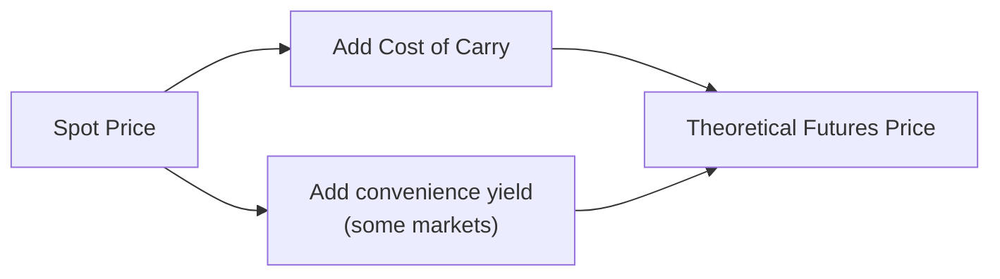

## 3.1 A Brief Overview of Futures Pricing

Futures contracts can be a bit mysterious at first glance. You might wonder: How on earth does anyone figure out what the fair price for a piece of paper—representing something to be delivered at some future date—should be? Well, that puzzle is what we call futures pricing. It’s the process of determining the “fair value” of a standardized contract tied to an underlying financial instrument or commodity. And in Canada, this pricing process is guided by market forces, global financial benchmarks, and regulatory oversight provided by organizations such as the Canadian Investment Regulatory Organization (CIRO).

Below, we’ll walk through the essential building blocks of futures pricing, weaving together the formal definitions with some of my own real-life reflections. We’ll look at how spot prices, interest rates, storage costs (also known as cost of carry), dividends, and convenience yields all come together to produce a theoretical futures price. We’ll also touch on how everything is supposed to stay in line thanks to the no-arbitrage principle—a fancy way of saying that markets won’t let you snag a guaranteed profit for free. Finally, we’ll talk about how real-life factors (like transaction costs and liquidity issues) can throw theory out the window (just a little!) and how CIRO keeps these markets running fairly.

Remember, whether you’re hedging or speculating, understanding why a futures contract is priced the way it is can mean the difference between a well-informed strategy and a leap of faith. Let’s take a closer look.

  
### Spot Price: The Foundation of Futures Pricing

One of the first things I learned about futures pricing was that everything starts with the spot price—the price at which you can purchase (or sell) the asset right now, in the current or “cash” market. For instance, if you’re following gold futures, the spot price of gold is the immediate cost per ounce in the market today.

But let’s inject a tiny anecdote: When I was first wrapping my head around futures, I actually tried to replicate the concept with coffee beans. I noticed coffee prices jumped around daily, so I’d buy beans and store them in airtight containers. I wanted to see if I could replicate theoretical cost-of-carry calculations on a tiny scale. Sure, it wasn’t a perfect system (and my garage smelled like a coffee roaster!), but it reminded me that each time I carried anything from one month to the next, I had storage costs, plus the original “spot” cost.

In sophisticated global markets, the spot price is the baseline from which all other calculations start. If you want to price a futures contract, you consider what the commodity or asset is worth now—then you tack on all the other relevant variables that come into play over the time until delivery.

  
### Adding the Cost of Carry

The term “cost of carry” (sometimes shortened to carrying costs) encapsulates the expense or net cost you’d face to hold the underlying asset until the futures contract’s expiration or delivery date. With tangible commodities like oil, grains, or metals, cost of carry may include storage fees, insurance, and even spoilage if the product is perishable. With financial assets like government bonds or equity indexes, cost of carry typically revolves around financing costs or foregone interest rates.

In a simplified formula, theoretical futures price can be viewed as:

Futures Price = Spot Price + Cost of Carry

Of course, in real-world scenarios, “Cost of Carry” can be broken down more precisely. For example, if you’re dealing with an equity index future, you might look at interest rates (the cost of available funds) and dividends (the expected cash payouts you’d miss out on if you didn’t own the physical shares). In many textbooks—including the widely used “Options, Futures, and Other Derivatives” by John C. Hull—this is broken down as:

Futures Price = Spot Price × e^(r – d) × T

• r is the risk-free interest rate.  
• d is the continuously compounded dividend yield.  
• T is the time (in years) to futures maturity.  

The exponential notation e^(r × T) is basically the “continuous compounding” approach to reflect how interest or dividends grow continuously over time. However, in practice, not everyone uses continuous compounding. Sometimes, folks just approximate linearly. The point remains the same: if the interest rates rise, it generally increases the theoretical futures price on equity markets or bonds. If there are dividends or anticipated yield on the underlying, it typically lowers the futures price, because you forgo collecting those dividends by holding the futures contract instead of the stock itself.

  
### Considering Convenience Yields

For physical commodities—think crude oil, gold, or even coffee beans—there’s a concept called “convenience yield.” A convenience yield is an intangible benefit that comes from physically holding the commodity, as opposed to holding a piece of paper that promises future delivery. Maybe you get to keep your production line running with a guaranteed supply of oil, or you can avoid potential shipping disruptions by storing grain locally. That advantage—hard to quantify though it may be—often lowers the fair value of the futures contract relative to the spot price because you’re giving up that intangible benefit. Thus, the formula might look more like:

Futures Price = Spot Price + Cost of Carry – Convenience Yield

If you think of convenience yield as a “negative” cost, it can reduce the measured cost of carry. Folks who absolutely must have the commodity in hand often assign a greater value to convenience yield, which explains any deviations between theoretical futures prices and the actual quotes you see in the market.

  
### The No-Arbitrage Principle

The no-arbitrage principle is a cornerstone of derivative pricing. It states that you shouldn’t be able to make a guaranteed risk-free profit if two assets are basically equivalent or if you can structure certain trades to replicate the same payoff. If a futures contract were mispriced, professional traders (arbitrageurs) would swoop in, buy or sell the asset or its futures in such a way as to lock in a profit. Then the price would gradually adjust until that “free lunch” opportunity disappears.

Let’s imagine a simplified example. Suppose the spot price of a certain commodity is $100, and the cost of financing plus storage is $5 over the next three months. The no-arbitrage theoretical price for a three-month futures contract should be around $105. If the futures contract is priced at $108, you could immediately sell the contract at $108, buy the physical commodity at $100, pay $5 to store and finance it, and lock in a quick profit, because at the end of three months, you could deliver your stored commodity to settle the contract at $108. Boom. Free money. The high demand to sell the overpriced futures eventually pushes its price back down to $105. That’s how the no-arbitrage principle keeps markets in line.

  
### Real-World Deviations: Liquidity, Credit Risk, and Transaction Costs

Theory and practice don’t always line up perfectly. We live in a world with brokerage fees, shipping delays, and liquidity constraints that can shift prices away from their “perfect” theoretical values. In some markets (especially physically delivered commodities), logistical or seasonal issues might create unique supply-and-demand dynamics. In a similar vein, if one party in an over-the-counter (OTC) forward agreement is worried about the other side’s creditworthiness, that fear might alter the contract’s pricing. They may charge a slight “premium” to compensate for the risk that the other side can’t fulfill its obligation.

Transaction costs are also pivotal. Each buy or sell order might come with commissions or bid-ask spreads. If arbitrageurs can’t capture enough profit after the cost of doing business, they might not bother to correct a mispricing. This can temporarily allow the futures price to drift away from the ideal number. Over time, though, competition among traders and improved technology typically narrows these gaps. Electronic trading platforms and algorithmic traders will quickly jump on even minor mispricings and help the futures market remain efficient.

  
### Hedgers vs. Speculators

I’ve sometimes described hedgers and speculators as different “personalities” in the same marketplace. Hedgers are there to reduce or lock in price risks: a farmer wants to lock in a fair price for her crop, or an oil refiner wants to secure a stable cost for crude. They often use futures lines of reasoning to figure out whether current market quotes justify a hedge. Or to put it differently, is it worthwhile to pay a premium today to remove uncertainty in the future?

Speculators, on the other hand, live for the thrill of price movement. They’re the ones who might buy a natural gas futures contract if they think the winter weather forecast is extra chilly this year. They rely on accurate futures pricing (and their own forecasts about supply and demand) to capture potential profits. Yet ironically, speculators—though sometimes viewed negatively—are part of what keeps the market liquid. Their presence helps guarantee there’s almost always a ready buyer or seller for hedgers aiming to manage risk.

  
### Regulatory Oversight by CIRO

Here in Canada, the Canadian Investment Regulatory Organization (CIRO) lays out the rules that keep these markets transparent and orderly. Historically, we had two separate bodies—the Mutual Fund Dealers Association of Canada (MFDA) and the Investment Industry Regulatory Organization of Canada (IIROC). But these were amalgamated as of January 1, 2023, forming today’s CIRO. CIRO’s regulatory framework imposes requirements around margin, capital adequacy, and investor protection. It ensures that dealers properly assess whether a participant has the resources and the knowledge to trade in derivatives. It also sets guidelines so participants don’t take on irresponsible positions that might destabilize the market.

For instance, CIRO’s margin rules specify how much cash or collateral needs to be posted to secure a futures position. This margin requirement ties directly into the no-arbitrage principle. If margins are set too low, the market might invite reckless speculation that leads to huge price swings or defaults. If they’re too high, that might reduce liquidity or freeze out smaller participants. Striking the right balance is an ongoing priority for the regulators.

  
### Comparing Exchange-Traded Futures and OTC Forwards

In addition to standardized, exchange-traded futures, many Canadian businesses and financial institutions rely on custom over-the-counter (OTC) forward agreements. If your firm needs a specific quantity of a commodity on a date and terms that aren’t listed in standardized futures contracts, you might negotiate a forward contract directly with a counterparty. The pricing logic is fundamentally the same, looking at the spot price, cost of carry, and so forth.

But credit risk can be higher in these arrangements because there’s no central clearinghouse standing behind the transaction. That means one party is effectively betting the other party won’t default. This credit risk often shows up as a small “spread” or “premium” in the pricing, compensating for the chance of default. Because the Bourse de Montréal and other derivatives exchanges require margins, clearing, and daily mark-to-market settlements, exchange-traded futures typically feature lower counterparty risk than OTC forwards.

  
### Simplified Futures Pricing Table

To organize the main drivers of futures pricing, here’s a short table:

| Component          | Definition                                                                     | Example                                                 |
|--------------------|---------------------------------------------------------------------------------|---------------------------------------------------------|
| Spot Price         | Current market price of the underlying asset                                   | Price of gold per troy ounce in the spot market         |
| Interest Rate      | Cost of financing the purchase of the underlying                               | Bank of Canada’s overnight rate used as a proxy         |
| Storage Costs      | Fees and expenses for holding physical commodities                              | Warehouse rental, insurance, spoilage prevention        |
| Dividends (Equities) | Cash payments associated with the underlying stock or index                    | Dividend yield of an S&P/TSX Composite Index            |
| Convenience Yield  | Intangible benefit from physically holding the commodity                       | Avoiding supply chain disruptions for oil refiners      |
| No-Arbitrage       | Principle that identical assets shouldn’t generate a risk-free profit           | Profit locked in by buying the physical & selling futures |
| Credit Risk (OTC)  | Risk that a direct counterparty cannot fulfill their contractual obligations    | Custom forward contract with no central clearing        |

  
### Bringing It All Together With a Mermaid Diagram

Below is a quick diagram illustrating how spot prices and cost of carry funnel into the theoretical futures price, with convenience yield acting in the opposite direction:

• Spot Price is your starting point.  
• You add cost of carry (interest, storage, foregone dividends) to arrive at a baseline.  
• If relevant, you subtract the so-called convenience yield that can come from physically holding the asset.  
• Voilà: the theoretical futures price, assuming no arbitrage opportunities exist.

  
### Practical Example in the Canadian Market

Let’s say the spot price for a barrel of Canadian crude oil is CAD 80. The Bank of Canada overnight rate is around 4%. Over a six-month period, you expect to pay an annualized 4% to finance your purchase of oil. Meanwhile, storage might run you CAD 1 per barrel over that period. If the cost of carry (interest plus storage) works out to roughly CAD 3.20 on an annual basis, your theoretical futures price might be around CAD 83.20 after half a year. Of course, the actual futures quotes on the Bourse de Montréal or the New York Mercantile Exchange might be a little higher or lower, depending on how the supply-and-demand factors shift, not to mention the dreaded (or beneficial?) convenience yield. But if prices strayed far from that range, you’d see arbitrageurs stepping in to realign them.

  
### Accounting for Dividends in Equity Index Futures

In equity index futures, the biggest adjustment to cost of carry is often dividends. If you hold a basket of stocks, you’ll collect any dividends those companies pay. But if you hold a futures contract, you don’t. That means your cost of carry for an equity index future isn’t strictly about storage—there is no physical “storage” for a stock index—but is about financing cost minus the dividend yield. If the index is expected to yield 2% in dividends over the next year, you effectively save that 2% by holding the physical stocks. So the theoretical futures price for the index might be less than a naive “Spot Price + Financing,” because you lose out on those dividend payouts by using futures rather than spot ownership.

  
### Checking CIRO Requirements and Margins

You might be thinking: “So, do I just put up the full price for my futures trade?” Actually, you usually don’t. Exchanges rely on margins, or “good faith deposits,” to ensure you can settle your obligations. CIRO’s margin rules for futures trading can differ depending on whether you’re hedging or speculating. They also vary by product and volatility of the underlying instrument. The key takeaway is that the margin system helps reduce credit risk: if the market moves against you, you’ll have to post variation margin pretty quickly to cover the losses.

If you’re new to these rules, the official CIRO website (https://www.ciro.ca/) is a great place to start. It spells out the guidelines around capital requirements, margin levels, and position limits for different types of participants. If you want to see how margin might affect your actual trade cost, you can also look up margin calculators that brokers or clearing firms provide. Many times, they incorporate the recommended formulas that reflect current CIRO standards.

  
### Tools and Resources for Futures Pricing

• Bank of Canada (https://www.bankofcanada.ca/): Publishes daily benchmark interest rates and monetary policy announcements. Great for gleaning the “risk-free” rate to use in your cost-of-carry or discount calculations.  
• CIRO (https://www.ciro.ca/): Canada’s new single self-regulatory organization. Provides margin rules, market integrity notices, and a wealth of educational resources on futures, options, and derivatives regulation.  
• QuantLib: This open-source library is one of the top references for pricing and risk analysis of derivatives, including futures. It has modules that can seamlessly handle day count conventions, discount factors, and more.  
• Bourse de Montréal (https://www.m-x.ca/): The main derivatives exchange in Canada. Offers educational materials, historical data, product specifications, and training on how to read and interpret futures quotes.  
• “Options, Futures, and Other Derivatives” by John C. Hull: One of the standard references in the field, widely used in both university courses and professional exam prep. It’s a great resource if you want deeper mathematics.

  
### A Quick Note on Arbitrage Tools

Anyone who’s done serious arbitrage work knows it’s not just about a quick formula. People rely on direct market data feeds, fast execution algorithms, and real-time systems that can place trades in milliseconds. If you see a mismatch between the spot markets (like equity or commodity markets) and the futures contract, the window to arbitrage might disappear in microseconds. And with high-frequency trading so prevalent, these windows often slam shut before everyday traders can step in. But it’s comforting to know that the entire “no-arbitrage environment” is still the foundation that ensures futures prices remain aligned with underlying events (and that coffee in my garage was, alas, never going to lead to an easy profit).

  
### Wrapping Up

Futures pricing might look complicated at first, but at its heart, it’s pretty logical: you start with the spot price, add the costs and benefits of carrying the asset to the future, and—if all goes smoothly—end up with a fair value that lines up with reality. Specifics like dividends for equities, storage costs for commodities, or convenience yields can push the dial one way or the other, and real-world frictions like transaction fees and credit considerations can cause short-term “noise” in the system.

Nevertheless, for hedgers and speculators alike, understanding how futures are priced is critical. Whether you want to lock in the cost of feed for your farm animals or are just plain excited about an upcoming interest rate announcement from the Bank of Canada, you’ll want to be sure you’re not overpaying or underpricing your positions. That’s where this knowledge—and a carefully maintained set of regulatory guidelines from CIRO—can keep you on the right path.

So the next time you see your screen flashing a futures quote, remember there’s a whole swirl of cost-of-carry calculations, interest rate curves, and no-arbitrage forces behind that price. And if it looks a bit off, then maybe—just maybe—there’s an arbitrage or a mispricing opportunity waiting for someone brave (or fast) enough to seize it!

---

## Sample Exam Questions: Futures Pricing Fundamentals Quiz



### Which of the following primarily drives the theoretical price of a futures contract?

- [ ] Storage costs alone
- [x] The spot price plus cost of carry, adjusted for any convenience yield
- [ ] The open interest in the market
- [ ] Historical price fluctuations

> **Explanation:** The fundamental formula considers the spot price, cost of carry (which includes financing and storage costs), and any convenience yield. Open interest and historical volatility may influence market perception but do not directly form the main theoretical price input.

### How does the no-arbitrage principle influence futures pricing?

- [ ] It encourages speculation by market participants.
- [x] It helps prevent “free lunch” situations by adjusting mispriced futures back to fair value.
- [ ] It sets margin requirements for derivative trades.
- [ ] It declares certain trades illegal.

> **Explanation:** The no-arbitrage principle states that any risk-free profit opportunity will be rapidly exploited, causing prices to move back in line and removing that profit opportunity.

### If you are holding a commodity physically rather than buying futures, what might you gain that reduces the futures price?

- [ ] Interest income
- [ ] Broker rebates
- [x] Convenience yield
- [ ] Margin credit

> **Explanation:** Convenience yield is the benefit or premium from physically holding a commodity, which can mean ensuring supply or avoiding delivery disruptions. It effectively reduces the fair value of futures.

### In the context of equity index futures, why are expected dividends important for pricing?

- [ ] They don’t matter at all for pricing index futures.
- [ ] They increase the spot price.
- [x] Investors forgo receiving dividends on the underlying stocks while holding futures.
- [ ] Dividends reduce the margin requirements set by CIRO.

> **Explanation:** Dividends are subtracted from the cost of carry in equity index futures. If you hold physical stocks, you get dividends; if you hold futures, you don’t—so the theoretical futures price is lower by the present value of those dividends.

### Which of the following best describes the role of CIRO in the Canadian derivatives market?

- [x] A self-regulatory organization overseeing investment dealers and setting rules for fair and transparent markets
- [ ] A proprietary trading firm that specializes in no-arbitrage strategies
- [ ] A government-funded think-tank for economic policy
- [ ] An international body focusing exclusively on commodity regulation

> **Explanation:** CIRO (Canadian Investment Regulatory Organization) is Canada’s SRO for investment dealers and marketplace regulation. It ensures compliance with margin requirements, capital rules, and ethical standards.

### What is one advantage of exchange-traded futures over OTC forward contracts?

- [ ] They cover a wider variety of underlying assets.
- [x] They significantly reduce counterparty credit risk through central clearing.
- [ ] They pay higher dividends to holders.
- [ ] They have unique returns unrelated to the spot market.

> **Explanation:** Exchange-traded futures are cleared by a central clearinghouse, drastically reducing credit risk compared to bilateral OTC forward contracts.

### Which factor might cause actual futures prices to deviate temporarily from “fair value”?

- [ ] Absence of the no-arbitrage principle
- [ ] Unlimited liquidity at all times
- [ ] Zero transaction costs
- [x] Real-world frictions like transaction costs and liquidity constraints

> **Explanation:** In practice, frictions such as transaction costs, bid-ask spreads, or limited liquidity can cause small (and sometimes large) discrepancies from theoretical prices.

### If the Bank of Canada raises its overnight interest rate, how might that affect equity index futures prices?

- [x] It generally raises the cost of carry, thereby increasing futures prices if dividends are unchanged.
- [ ] It lowers equity futures prices by decreasing the spot price directly.
- [ ] It eliminates convenience yield for physical holders.
- [ ] It has no impact on any derivatives.

> **Explanation:** When interest rates go up, financing costs rise, and the cost of carry portion of equity index futures pricing increases, generally pushing futures prices higher assuming dividend yield and other factors remain constant.

### Why might a farmer prefer selling futures rather than holding the physical crop until they find a buyer?

- [ ] They do not have to worry about storage and spoilage costs, thanks to futures contracts.
- [ ] Futures always trade at better prices.
- [x] Futures allow them to lock in a price now, hedging against future price drops, and reduce carrying costs of storing the crop.
- [ ] Because physical crops cannot be sold directly in the spot market.

> **Explanation:** By using futures, farmers can hedge against price declines and avoid the full carrying costs of physically holding and later reselling the commodity.

### True or False: The Bourse de Montréal offers no educational resources or training on Canadian futures.

- [ ] True
- [x] False

> **Explanation:** The Bourse de Montréal offers substantial resources, including tutorials, product guides, and even specialized training sessions, to help traders better understand and use Canadian futures contracts.


