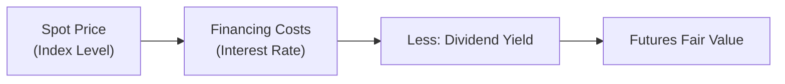
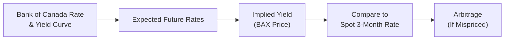

## 3.10 Practical Pricing Examples in Canadian Markets (e.g., Interest Rate & Index Futures)

So, you want to get practical? Let’s do it! In Canadian markets, interest rate futures and index futures are widely traded instruments that help everyone—hedgers, speculators, and arbitrageurs—either manage or take on risk. The most common short-term interest rate future in Canada is the Bankers’ Acceptance (BA) future (often called BAX), traded on the Bourse de Montréal. For equity index exposure, the S&P/TSX 60 Index future is a well-known contract used by institutions, hedge funds, and individuals alike.

Sometimes folks pause and say, “Well, I get the idea of futures, but how exactly do I price them? And does it really matter that much?” The quick answer is that correct pricing is crucial: mispricing can lead to arbitrage opportunities, big risk, or missed profits. Let’s delve into some real-life examples of how these contracts get priced, with a few personal reflections on the mishaps and triumphs I’ve seen along the way.

---

### Introduction to Practical Pricing

The essence of futures pricing typically draws on the cost of carry framework. In a nutshell, the cost of carry states that the theoretical fair value of a futures contract depends on:
• The spot price (current market price of the underlying).  
• Financing costs (interest rates, or an implied rate).  
• Income or yield received from holding the underlying (like dividends for an equity index).  
• Storage or convenience costs (especially relevant in commodities; less so for financial futures).  

Here in Canada, we adapt this approach to local interest rates and the specific quirks of Canadian instruments, such as the Bankers’ Acceptance yield for short-term interest rate futures and the S&P/TSX 60 Index for equity index futures.

---

### Pricing Interest Rate Futures: The BAX Contract

#### How BAX Works

A BAX (Bankers’ Acceptance) futures contract reflects the market’s expectation of 3-month (90-day) Canadian dollar interest rates at a future date. If you’ve ever looked at a BAX quote and got confused seeing something like “Price: 94.50,” that means the implied interest rate is 5.50% (because the BAX quote is 100 minus the annualized interest rate).

• BAX Price = 100 – Implied Annualized Interest Rate  

If the implied annualized interest rate is 5.50%, the BAX futures price should be:

94.50 = 100 – 5.50  

This contract trades in ticks of 0.01, which correspond to $25 per contract, so a move from 94.50 to 94.49 means a $25 change in the total contract value. And that can get real exciting in intraday trading—trust me, I’ve seen entire floors hold their breath every time a major economic release comes out, like Canada’s monthly GDP or the Bank of Canada’s interest rate announcements.

#### Converting Futures Price to an Implied Yield

To understand how the BAX price translates into actual interest rates for a 90-day period, you basically do:

• BA Implied Interest (annualized) = 100 – BAX Price 

But to find the effective 90-day interest, you’d adjust for the 90-day fraction of the year (roughly 0.25 of a 360-day year in money market convention). If BAX is 94.50, the annualized rate is 5.50%. Over 90 days, you might approximate:

90-day interest = 5.50% × (90 / 360) = 1.375%  

In a large corporate treasury environment, that difference can be huge when you’re dealing with tens (or hundreds) of millions in short-term funding. If the futures price changes or you suspect the Bank of Canada will shift policy, that interest expense or yield can change faster than you might expect.

#### A Quick Pricing Exercise

Let’s try a simple example:

• Current 3-month BA rate: 5.00% annualized.  
• You want to price the 3-month BAX futures for settlement in 2 months.  
• Suppose you believe that by the time we’re at the settlement date, the short-term interest rate will rise by 0.75%.  

So you might guess that the 3-month interest rate at settlement date will be 5.75% annualized. The BAX futures price that’s consistent with that rate would be:

100 – 5.75 = 94.25  

If the market’s trading BAX at 94.20, that’s an implied rate of 5.80%. So, do you think the market is too high or too low? If you forecast 5.75%, the market’s 5.80% might be slightly higher than your forecast. You might step in and buy the BAX future if you believe rates won’t actually get that high. Just be aware that if your forecast is wrong—e.g., if rates spike to 6.00%—the BAX price would drop to 94.00, and you’d lose money. Trading BAX can be a nail-biter, though it’s a fairly liquid contract.

---

### Pricing the S&P/TSX 60 Index Future

#### Why the Cost of Carry Shifts

You’ve probably heard the formula for a stock index futures price:  

$$F_0 = S_0 \times e^{(r - q) T}$$  

Here:  
• \\(S_0\\) is the current index level (spot).  
• \\(r\\) is the short-term risk-free rate.  
• \\(q\\) is the average (or implied) dividend yield of the index.  
• \\(T\\) is the time to maturity in years.  

In Canada, you can also see a discrete compounding version, especially for the S&P/TSX 60, which might be:


F_0 = S_0 \times (1 + (r - q))^T.


The difference is whether you assume continuous vs. discrete compounding, which is often a matter of convention or whichever model your trading desk uses. The presence of dividends can’t be ignored. Dividends reduce the fair value of equity index futures because holders of the physical index constituents receive dividends, while holders of the futures do not. So if the index has a higher dividend yield, the cost-of-carry effect is somewhat offset.

#### Practical Example

Imagine the S&P/TSX 60 is currently at 1,200. The short-term interest rate (annualized) is 4%, and the dividend yield (annualized) from the index is about 3%. Time to maturity for the futures contract is 6 months (0.5 years). Using discrete compounding:


F_0 = 1200 \times (1 + (0.04 - 0.03))^{0.5} = 1200 \times (1 + 0.01)^{0.5}.



F_0 = 1200 \times (1.01)^{0.5} \approx 1200 \times 1.0050 = 1206.


So your theoretical fair value might be around 1,206. If the actual futures price is trading at 1,215, that’s above your theoretical fair value. In that case, an arbitrageur might do something like:

• Short the futures contract at 1,215.  
• Buy the basket of the S&P/TSX 60 stocks.  

Then carry the position until delivery, collecting dividends on the basket. If everything goes as planned, by maturity, the futures contract should converge to the theoretical level, delivering a profit if the mispricing was large enough to exceed transaction costs.

---

### Diagrams: Cost-of-Carry Logic for an Index Future

Sometimes, words just aren’t enough. Let’s visualize a simple cost-of-carry model for an index future:

• Start with Spot Price  
• Add Financing Costs (i.e., the amount you pay to borrow money to hold the index constituents)  
• Subtract Dividends (since that’s income you’d get if you owned the stocks)  
• Arrive at the Theoretical Futures Price  

In a perfect market, you cannot sustain a huge gap between the actual futures price and this theoretical value, because arbitrageurs will jump in and push the market back toward fair value (or something close to it after transaction costs).

---

### Arbitrage Strategies in Canadian Index Futures

Canadian index futures, such as the S&P/TSX 60, are quite liquid. Traders use them for various reasons, but the cost-of-carry sets the foundation for the “fair” or equilibrium price. If the futures stray too far from fair value, two broad categories of arbitrage come into play:

1. **Index–Futures Overpricing**:  
   Futures price is too high → Sell (short) the futures, Buy the underlying index constituents.
2. **Index–Futures Underpricing**:  
   Futures price is too low → Buy the futures, Short the underlying index constituents.

Of course, the real world can be a bit messy: it’s not always easy to buy or sell all 60 components in the exact proportions in one go. But thanks to Exchange-Traded Funds (ETFs) and basket trading technologies, that process is far more streamlined than it was a decade ago. It’s not uncommon for big institutional desks to run program trades that quickly replicate the index and exploit mispricings of only a fraction of a percentage.

---

### Seasonal Aspects and Market Nuances

I recall a time near the end of a calendar year when major banks needed to shore up their balance sheets, which in turn affected short-term interest rates. We saw BAX futures jump around unpredictably because the typical market participants were adjusting their funding strategies. Meanwhile, on the equity side, year-end “window dressing” by portfolio managers (who might buy or sell certain high-profile stocks to show them in their year-end statements) can slightly distort index levels or dividend assumptions. These seasonal or quarter-end events may cause short-lived anomalies between actual futures prices and theoretical fair value.

For commodities, we see seasonal factors play a role, too (think of weather or holiday shopping seasons). Even though we’re focusing mostly on index and interest rate futures here, it’s worth noting that Canada’s resource-based economy can produce some interesting seasonal cycles in certain commodity-linked equities, which—through index weighting effects—may trickle into S&P/TSX 60 pricing patterns as well.

---

### Factors Affecting Interest Rate Futures Pricing in Canada

Below is a quick table that sums up some of the main factors affecting the pricing of Canadian interest rate futures (e.g., BAX):

| Factor                           | Effect on BAX Price                                           | 
|----------------------------------|---------------------------------------------------------------|
| Bank of Canada Policy Changes    | If policy rates are hiked, BAX price falls, implying higher rates. If rates are cut, BAX price rises. |
| GDP, Inflation Data              | Strong data can lead to rate hikes (price down); weak data can lead to rate cuts (price up).  |
| Seasonal Liquidity (Quarter-End) | Funding costs can rise, altering short-term yields and BAX prices. |
| Global Interest Rate Trends      | Canadian rates may follow U.S. Fed or European Central Bank trends.  |
| Supply/Demand for BAs            | If corporate demand for BAs is high, yields might shift, affecting futures. |

While these might seem obvious, the real trick is anticipating how the market will interpret and react to each piece of data. Sometimes, even a data release that meets expectations can move the market if the “whisper number” (market rumor) differs from official forecasts.

---

### Tying It All Together

1. **Identify the Underlying Dynamics**: Start with the spot rate or index level, short-term interest rate environment, and dividend yield for indices.  
2. **Use Cost-of-Carry**: For index futures, incorporate financing costs and subtract expected dividends. For interest rate futures, consider implied yield.  
3. **Check Versus Market Price**: Compare what you got to the actual quoted futures price. Are you seeing a difference?  
4. **Consider Transaction Costs**: If you see a mispricing, is it big enough to cover your commissions, slippage, and financing overhead?  
5. **Implement Arbitrage or Adjust Hedges**: If everything’s lined up, you can short or go long the futures, or trade the underlying instruments.  
6. **Monitor Seasonal Shifts**: Watch quarter-ends, year-ends, major corporate announcements, or cyclical events that skew typical relationships.

If you’re just starting out, you can also use open-source financial tools (like a spreadsheet with macros or a free Python library such as pandas or NumPy) to track these relationships daily. Then see how real market data interacts with your theoretical models—sometimes you learn the most when the market does something you don’t expect (just, ideally, in a practice environment first).

---

### Additional Diagrams: Interest Rate Futures Pricing

Here’s a simplified flowchart on how BAX pricing might compare to the yield curve:

1. Market participants examine the Bank of Canada’s current policy rate and the yield curve (published on the Bank of Canada website).  
2. They form expectations about future short-term rates.  
3. These expectations get baked into BAX prices (Implied Yield = 100 – BAX Price).  
4. Compare that implied yield to the actual 3-month rate or your forecast.  
5. If there’s a difference large enough to be arbitraged, traders either go long or short the BAX futures to profit from the discrepancy.

---

### CIRO Oversight, Regulatory Notes, and Resources

In Canada, the Bourse de Montréal is the main exchange listing these futures. Our new self-regulatory organization, CIRO, oversees investment dealers and monitors derivatives activity to ensure fair markets. CIRO ensures that margin requirements, market conduct rules, and oversight of participant firms remain consistent with best practices. Historically, IIROC and the MFDA handled much of this regulation separately, but they amalgamated into CIRO in 2023. For the official specs on these products:

• Bourse de Montréal: [https://www.m-x.ca/](https://www.m-x.ca/)  
• Look under “Products > Interest Rate Derivatives” for BAX specifications and “Products > Equity & Index > Index Futures” for S&P/TSX 60 details.  
• Bank of Canada: [https://www.bankofcanada.ca/](https://www.bankofcanada.ca/) for yield curve data, policy rate updates, and more.  

---

### A Personal Anecdote

I remember the first time I tried to apply the theoretical cost-of-carry model. I was an eager rookie, and I stayed up entirely too late building a spreadsheet that said the S&P/TSX 60 Index future was overpriced by a full 2%. The next morning, I put my big plan to short the futures and buy the index constituents in motion. But my transaction costs were higher than I anticipated, and I discovered certain large-cap names in the index had gone ex-dividend that morning, slightly resetting the playing field. My “profit” mostly vanished into slippage and fees. Yep, that was my first empty-handed arbitrage. Moral of the story: Don’t forget to incorporate all costs, ex-dividend dates, and real-time liquidity constraints. Good times.

---

### Best Practices, Common Pitfalls, and Potential Challenges

• **Stay Updated**: Market rates, especially short-term rates, can change daily. Keep your model data fresh (e.g., updated yields, dividend announcements).  
• **Watch “Ex-Dividend” Dates**: Dividends are big in equity index futures. Missing a single major dividend date can transform a winning trade into a losing trade.  
• **Factor in Liquidity**: Even though the S&P/TSX 60 and BAX are liquid, that liquidity can dry up around major news or holidays.  
• **Margin Calls**: In fast-moving markets, your margin could be exhausted swiftly if the trade moves against you.  
• **Seasonal Surprises**: Don’t forget year-end or quarter-end phenomena. Also, major banks’ fiscal year-ends can differ from the calendar year—in Canada, some end in October.  

---

### Encouraging Further Learning

Pricing futures can be a rewarding challenge. If you’re up for it, you might explore these additional resources:

• **CIRO**: [https://www.ciro.ca](https://www.ciro.ca) – for up-to-date regulatory guidelines and compliance information.  
• **“Derivatives Markets” by Robert L. McDonald** – a solid textbook on futures, options, and more.  
• **Bourse de Montréal Educational FAQs** – They have tutorials and guides for BAX, S&P/TSX 60 futures, and more.  
• **Open-Source Tools**: Try Python with libraries like “QuantLib,” “pandas,” or “NumPy” for backtesting.  
• **Bank of Canada** – The official yield curve data can be downloaded to feed your models.  

---

## Sample Exam Questions: Practical Pricing in Interest Rate & Index Futures



### Which formula best represents the discrete cost-of-carry approach for pricing an equity index futures contract?

- [ ] F₀ = S₀ / (1 + r)
- [x] F₀ = S₀ × (1 + (r - q))ᵀ
- [ ] F₀ = S₀ + (r × q)
- [ ] F₀ = S₀ - e^(r × T)

> **Explanation:** The discrete cost-of-carry approach for equity index futures is F₀ = S₀ × (1 + (r - q))ᵀ, where r is the risk-free rate, q is the dividend yield, and T is time to maturity.

---

### When pricing a BAX (Bankers’ Acceptance) futures contract, a price of 95.20 suggests:

- [ ] An annualized rate of 6.20%
- [ ] A 90-day effective rate of 6.20%
- [ ] An annualized rate of 4.80%
- [x] An annualized rate of 4.80% and a 90-day rate near 1.20%

> **Explanation:** The implied annualized interest rate on BAX is (100 – price). So 100 – 95.20 = 4.80%. Over 90 days, it’s about 4.80% × (90/360) = 1.20%.

---

### If the actual S&P/TSX 60 Index futures price is trading significantly higher than the theoretical cost-of-carry fair value, an arbitrage strategy might involve:

- [x] Shorting the futures and buying the index basket of stocks
- [ ] Buying the futures and shorting the index basket
- [ ] Doing nothing because the market is efficient
- [ ] Buying the futures and also buying the index basket

> **Explanation:** If the futures are overpriced, you can short the futures and buy the underlying stocks, expecting convergence to fair value.

---

### Quarter-end effects in Canadian short-term interest rates often occur because:

- [ ] Merchants raise retail prices for holiday sales
- [ ] Commodity producers close their hedges
- [x] Banks adjust their balance sheets, affecting funding costs
- [ ] The S&P/TSX 60 rebalances its constituents

> **Explanation:** Quarter-end can cause banks to modify their short-term funding strategies, creating temporary distortions in interest rates that affect BAX pricing.

---

### Why is the dividend yield important when valuing an equity index futures contract?

- [ ] It has no significance for derivatives pricing
- [ ] It increases the cost-of-carry
- [ ] It only affects American-style options
- [x] It reduces the fair value since holders of the actual stocks receive dividends, but futures holders do not

> **Explanation:** Dividends represent income that physical stockholders receive. Futures holders forego this dividend income, so it lowers the fair value of the futures contract.

---

### An investor forecasts that the actual 3-month interest rate will be higher than the implied rate in a BAX futures contract. Which trade aligns with this view?

- [ ] Buy the BAX futures
- [x] Sell (short) the BAX futures
- [ ] Sell the underlying bankers’ acceptances
- [ ] Buy long-term government bonds

> **Explanation:** If you think the actual interest rate will be higher, the futures price (100 – implied rate) should fall, meaning you want to short the BAX contract.

---

### If the implied annualized yield of a BAX contract is 6.00%, the quoted price of that BAX would be:

- [x] 94.00
- [ ] 94.06
- [ ] 100.60
- [ ] 106.00

> **Explanation:** The BAX formula is 100 – yield = 100 – 6.00 = 94.00.

---

### A major difference between pricing an equity index future and an interest rate future is:

- [ ] There is no difference
- [x] Dividend yields are explicitly considered in equity index futures
- [ ] Equity index futures must be settled in cash
- [ ] Interest rate futures have unlimited downside risk

> **Explanation:** Equity index futures pricing uses dividend yield in the cost-of-carry calculation, which is not relevant for short-term interest rate futures.

---

### Which factor might not cause a short-term pricing anomaly in Canadian index futures?

- [ ] Sudden changes in the Bank of Canada’s overnight rate
- [ ] Dividend announcements from major index constituents
- [x] A stable or unchanged yield curve with no major events
- [ ] Quarter-end liquidity constraints

> **Explanation:** If everything is stable, with no changes to rates or dividends, no anomaly would be expected. Sudden changes in monetary policy, dividend announcements, or quarter-end liquidity constraints can create short-term anomalies.

---

### True or False: In theory, if cost-of-carry assumptions hold, there should be minimal difference between the actual futures price and its fair value after adjusting for transaction costs.

- [x] True
- [ ] False

> **Explanation:** Arbitrage activity typically prevents significant long-lasting deviations from fair value (theoretical price), once transaction costs and slippage are factored in.


