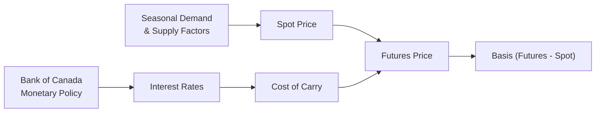

## 3.11 Seasonal Basis Factors & Monetary Policy Impact

Picture this: I once met a farmer out in Saskatchewan who had a very straightforward comment on futures pricing, saying, “Well, we grow the wheat between spring and summer—of course prices jump around, you know?” It was a bit of an “ah-ha” moment for me. We often get so absorbed in discussions about market efficiency and cost of carry that we forget about some very human, down-to-earth patterns: the seasons.  

You might already sense how big of an impact seasons can have on commodity prices. Think of cocoa harvests, or the demand for natural gas in frigid winters. These ups and downs form the rhythm we call “seasonality,” and it’s a crucial piece of the puzzle when we talk about futures pricing.  

But that’s not the entire story, right? We also have the Bank of Canada (and other central banks around the world) making decisions on interest rates, offering guidance, and sometimes implementing quantitative easing. All these have a direct bearing on the cost of carry and consequently on futures prices.  

So in this section, let’s unpack how each of these factors—seasonality and monetary policy—can shape the basis (futures price minus spot price) and impact overall pricing in the derivatives markets.

---

### The Concept of Seasonality
Seasonality refers to predictable changes in supply and demand for certain commodities (and some financial instruments, though it’s more common with physical goods) that occur during specific times each year.

• Weather Patterns  
• Growing Cycles  
• Harvest Periods  
• Consumption Trends (e.g., more natural gas needed in winter)

If you look at historical data from Statistics Canada (https://www.statcan.gc.ca/), you’ll likely see that agricultural commodities such as wheat might show price spikes during planting season or harvest. Meanwhile, energy commodities like heating oil and natural gas often see higher demand (and sometimes higher prices) in colder months.  

These fluctuations influence both spot and futures markets. Since derivatives pricing typically incorporates expectations of future prices, any predictable demand or supply shock can cause the basis between spot and futures prices to move in a fairly systematic pattern.  

#### Example: Winter Heating Demand
Let’s consider a simplified example in the Canadian natural gas market. Demand typically rises in autumn, because everyone’s preparing for winter. That preparation can drive up the spot price. Futures markets may anticipate higher spot prices as well, so the futures curve might climb, particularly in contracts that expire in the peak winter months. As a result, the basis between, say, a March futures contract and the current spot price might widen. If the actual winter is more severe than expected, the spot price might surge even more, narrowing or widening the basis further depending on existing stockpiles and demand.

#### Harvest Timing and Grains
Another instance: wheat. Harvest usually hits mid-to-late summer in parts of Canada. So you might see spot prices fall when new supply floods the market. Futures prices—especially near delivery—often follow suit, but the effect on distant-month futures might be less dramatic, reflecting the market’s longer-term expectations.  

---

### Seasonal Basis Fluctuations and Strategies
The difference between futures and spot prices, known as the basis, becomes a prime area for strategic action when seasonality is at play.  

• **Timing Hedges:** Producers, such as farmers, might wait to hedge until the market is reflecting a higher-than-average seasonal futures price (something that sometimes happens before planting when futures markets anticipate potential supply constraints).  
• **Storage Decisions:** If storing the commodity is feasible, producers might store it until the seasonal price upswing and then use futures to lock in more favorable terms.  

One popular approach is for a producer or merchant to track historical data on daily or weekly basis levels around a specific time of year. If they see that the basis typically tightens—meaning the futures price is getting closer to the spot price—during a certain month, they can plan their hedges (or forward/futures sales) accordingly.  

#### Potential Pitfall
A common mistake is to assume that *every* year will look like the last. Perhaps last year’s mild winter caused less demand for natural gas, which drastically changed the basis pattern. Relying too heavily on historical average data, without checking current fundamentals, can lead to unexpected losses.

---

### How Monetary Policy Enters the Picture
Now, let’s fold in another major piece of the puzzle: monetary policy. In Canada, the Bank of Canada (BoC) sets the benchmark interest rate, actively influencing a host of financial variables:  

1. **Borrowing Costs:** When interest rates go up, borrowing money to fund inventory, production, or speculation becomes more expensive.  
2. **Cost of Carry:** Recall from earlier sections of this text that the cost of carry includes financing costs for holding an asset. If interest rates are higher, it can push the futures price higher to reflect that increased carrying cost.  
3. **Macroeconomic Conditions:** Monetary policy also affects inflation, employment, and the overall pace of economic growth—factors that can shift demand patterns for commodities.

Think about how you might see a sudden shift if the BoC unexpectedly hikes interest rates. The cost of carry for many commodities, such as metals or energy, sees an immediate effect. That might expand or compress the basis, depending on other market conditions.  

#### Quantitative Easing (QE)
Quantitative Easing occurs when a central bank buys securities (usually government bonds) from the market to inject liquidity into the economy. This typically lowers long-term interest rates and can weaken the currency. For commodity exporters, a weaker domestic currency often leads to higher commodity prices in local currency terms, although the effect on the basis can be complex.  

Anyway, as soon as major monetary policy announcements happen, derivative traders re-evaluate the forward curve with new assumptions about interest rates and inflation. So if you’re hedging or speculating, you might find that your projected cost of carry for the next six months just changed overnight.

---

### The Relationship Between Seasonal Basis and Monetary Policy
Interestingly, these two forces—seasonality and monetary policy—can interact in ways that amplify or offset each other. Sometimes, you might see that a typical seasonal tightening in the basis gets overshadowed by a sudden interest rate announcement from the BoC.  

Below is a simplified diagram to illustrate how these factors feed into overall futures pricing:

In this diagram, you can see how seasonal demand and supply push on the spot price (B["Spot Price"]), while interest rates determined by monetary policy affect cost of carry (F["Cost of Carry"]). Ultimately, both shape the futures price (G["Futures Price"]) and therefore the basis (H["Basis (Futures - Spot)"]).

---

### Monitoring Macroeconomic Indicators
You might be wondering, “How do I keep track of all these monetary policy changes?”  

One starting point is the Bank of Canada’s Economic Research and Publications website—reports on inflation, growth, and other metrics. Traders also tune into its rate announcements, which happen around eight times per year.  

Common macroeconomic measures that drive central bank decisions:  
• **Consumer Price Index (CPI):** A gauge of inflation.  
• **Gross Domestic Product (GDP) Growth:** The pace of economic expansion.  
• **Employment Data:** Strong job markets may push up wages and inflation, prompting higher interest rates.  

By staying tuned to these measures, you can anticipate potential interest rate moves, which in turn can shift the cost of carry for various futures contracts.

---

### Practical Example: Canadian Wheat Producer
Let’s tie it all together with a short hypothetical scenario. Suppose you’re a Canadian wheat producer worried about next year’s pricing. Your harvest will come in August, so you know from historical data that the spot price might slump then.  

You decide to look at the basis for the November wheat futures contract. Historically, after the harvest glut, the basis tends to tighten in October—meaning futures prices inch closer to spot prices, which might be slightly depressed after harvest. That’s your usual game plan, to hedge in October when the basis is narrower or even more favorable.  

But wait: you read that the Bank of Canada might raise interest rates sooner than expected to combat inflation. If that happens, the cost of carry for the commodity might shift. If interest rates go up, those who hold large wheat inventories might pay more for financing, and they could offload their supply earlier, affecting near-term futures prices.  

Let’s say the BoC does raise rates in July. Futures prices for November delivery might rise (reflecting higher carry costs), but if the rate hike also dampens overall consumer demand for goods (due to higher credit costs), it might reduce inflation expectations, eventually cooling off commodity demand. It’s a bit of a dance, right?  

In short, your standard “seasonal basis” plan might not hold if the interest rate environment changes drastically. If macro data suggests an upcoming rate hike, it might be wise to tweak your timing—maybe hedge part of your production earlier or wait until after the announcement, depending on your market view.

---

### Best Practices and Common Pitfalls
• **Stay Flexible:** Seasonality is not set in stone. Always cross-check with current fundamentals.  
• **Watch the Bank of Canada Calendar:** Major announcements can shift the cost of carry quickly, and thus the futures curve.  
• **Use Historical Data Appropriately:** Historical basis patterns are informative but not infallible. A mild winter, an unexpected interest rate policy, or a big harvest from other parts of the world can derail typical seasonal patterns.  
• **Combine Fundamental and Technical Analysis:** Seasonal trends often align with technical price patterns—like typical “shoulder seasons” in energy markets. Combining both forms of analysis can help you form a more robust view.  
• **Diversify Hedging Strategies:** Don’t just rely on one single month’s typical pattern. Spread out your hedges if possible.  

---

### Regulatory Context
Since we’re working in the Canadian market, always remember that the Canadian Investment Regulatory Organization (CIRO) sets and supervises margin guidelines for derivatives. While their primary role (as the self-regulatory organization that replaced the MFDA and IIROC) may not revolve around seasonal basis movements or direct monetary policy, their margin rules might be updated or stress-tested during times of heightened volatility (e.g., sudden changes in rates, unexpected weather shocks).
  
That means you’ve got to keep an eye on how various seasonal and monetary shocks could elevate volatility, triggering margin calls or revised margin requirements at your brokerage. CIPF (Canadian Investor Protection Fund) remains the single investor protection fund in Canada. If you’re a registrant or dealing with a registrant firm, they’ll also keep track of your open positions, ensuring they’re adequately margined.  

---

### Additional Resources
For those wanting to dive deeper:  
• **Bank of Canada** (https://www.bankofcanada.ca/): For interest rate announcements, quantitative easing updates, and macroeconomic research.  
• **Statistics Canada** (https://www.statcan.gc.ca/): Fantastic resource for seasonality data—population changes, trade figures, manufacturing data, and more that can shape commodity supply/demand.  
• **Open-Source Financial Tools**:  
  - Python libraries like Pandas and NumPy can help you analyze historical seasonal price data and correlation with interest rates.  
  - R packages (like “quantmod”) allow you to pull historical data for time-series analysis.  
• **Futures Industry Association**: Good for global context on margin practices and derivatives market news.

---

### Conclusion
Seasonal basis and monetary policy together create the “heartbeat” of many futures markets—there’s a yearly cycle pushing and pulling from one side, and a central bank stepping in with rate adjustments from the other. As a derivatives trader or hedger, it pays to strike a balance between these predictable seasonal trends and the less predictable, though still somewhat forecastable, moves of central bankers.  

Whether you’re a soybean farmer, an energy speculator, or a portfolio manager with an eye on inflation-driven yields, staying nimble is the name of the game. Keep your ear to the ground for cyclical supply and demand patterns, watch for critical data indicating possible rate moves, and always approach each new season/announcement with a blend of historical insight and real-time financial analysis. That way, you’re better prepared for those times when the “typical” seasonal basis shift collides with the “atypical” interest rate hike.  

Remember, no single playbook is foolproof—markets have a way of surprising us. But if you respect both the seasonal cycles and the BoC’s evolving monetary policy stance, you’ll have the best shot at managing risk and finding opportunity in these dynamic markets.

---

## Sample Exam Questions: Seasonal Basis Factors & Monetary Policy Impact



### Which of the following factors is directly tied to predictable seasonal patterns in commodity prices?

- [ ] Monetary policy announcements
- [ ] Unexpected geopolitical events
- [x] Annual weather cycles
- [ ] Margin requirement changes

> **Explanation:** While monetary policy or geopolitical events can certainly affect prices, seasonality often stems from recurring, predictable factors such as annual weather patterns or harvest times.

### How does a higher interest rate environment typically influence the cost of carry?

- [ ] Decreases it, because interest on debt becomes more attractive for producers
- [x] Increases it, because financing and holding costs for inventory go up
- [ ] Has no effect on the cost of carry
- [ ] Eliminates counterparty credit risk

> **Explanation:** When central banks raise interest rates, borrowing to finance or store commodities becomes more expensive, thus raising the cost of carry.

### Why might the basis for a commodity tighten after a major harvest?

- [x] Spot prices may fall while futures prices do not drop as quickly
- [ ] Interest rates usually go up after a harvest
- [ ] The Bank of Canada intervenes in all major harvests
- [ ] The spot market is less liquid than the futures market

> **Explanation:** After a harvest, supply in the spot market can jump, pushing spot prices lower. Meanwhile, futures prices might remain stable if longer-term supply-demand balances don’t shift as drastically.

### What is the biggest reason a sudden Bank of Canada rate hike might derail a typical seasonal basis pattern?

- [ ] It only prevents producers from hedging in the short term
- [x] It raises financing costs quickly, leading to changes in spot and futures market behavior
- [ ] It affects only the agricultural sector, not energy or metals
- [ ] It has no impact on commodity markets

> **Explanation:** A surprise rate hike raises borrowing costs and can shift behavior in both spot and futures markets, overshadowing the usual seasonal pattern.

### Which statement about quantitative easing (QE) is most accurate?

- [x] QE generally injects liquidity into the market, often lowering long-term interest rates
- [ ] QE is solely aimed at making commodity exports cheaper
- [ ] QE has no impact on exchange rates
- [ ] QE limits the Bank of Canada’s options for setting interest rates

> **Explanation:** Quantitative easing is designed to increase the money supply and typically lowers interest rates, which can then affect currencies and commodities in various ways.

### What is a potential pitfall when relying on historical seasonal data?

- [x] Unexpected events like severe weather or policy changes can invalidate past patterns
- [ ] The data is mostly useless for fundamental analysis
- [ ] Seasonal trends are always stable year to year
- [ ] Central banks have no influence on commodity markets

> **Explanation:** Seasonality presumes similar patterns each year, but real-world shocks or policy shifts often disrupt these patterns.

### When might the basis be most volatile?

- [ ] During a perfectly normal growing season
- [x] When both seasonality and interest rate decisions create conflicting forces on prices
- [ ] When there is stable demand and supply
- [ ] When producers have halted hedging activity entirely

> **Explanation:** Basis volatility can spike when seasonal factors and dramatic monetary policy changes push and pull on the market at the same time.

### How can a Canadian wheat producer best prepare for fluctuating basis levels?

- [ ] Ignore the Bank of Canada’s rate announcements
- [x] Monitor both seasonal patterns and potential changes in the interest rate environment
- [ ] Use only last year’s data to project market moves
- [ ] Avoid all hedging tactics to keep costs down

> **Explanation:** By staying tuned to seasonal cycles and monetary policy, producers can adopt flexible hedging strategies to mitigate basis risk.

### Which organization currently supervises Canadian derivatives margin guidelines in 2025?

- [x] CIRO (Canadian Investment Regulatory Organization)
- [ ] MFDA
- [ ] IIROC
- [ ] Office of the Superintendent of Financial Institutions (OSFI)

> **Explanation:** CIRO is the new self-regulatory organization that amalgamated the MFDA and IIROC. MFDA and IIROC no longer exist as separate entities.

### True or False: Seasonal commodity price patterns are entirely predictable.

- [x] True
- [ ] False

> **Explanation:** While the word “entirely” might be a strong statement—since market surprises do happen—many commodities do exhibit broadly predictable seasonal price patterns tied to weather, harvest cycles, or other cyclical events.


