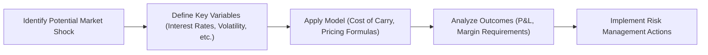

## 3.12 Scenario Analysis (Volatility & Interest Rate Shifts)

Have you ever hung out in a local coffee shop listening to traders chat about wild swings in oil prices or abrupt changes in interest rates by the Bank of Canada? If you have, you might’ve heard folks mention “scenario analysis” or “stress testing.” It can sound fancy, but—wait for it—it’s actually about using hypothetical “what-if” situations to see how your trades or portfolios might fare if the market does something unexpected. This helps avoid the shock of staring at your screen and thinking, “Oh no… Did I just lose half my capital in a day?” (which, trust me, is a feeling no one wants).

Below, we’ll walk through scenario analysis in the context of futures, focusing on volatility swings and interest rate shifts. We’ll look at how it’s used to estimate potential mark-to-market gains or losses, meet regulatory expectations under the Canadian Investment Regulatory Organization (CIRO), and incorporate advanced open-source tools like Python’s Pandas and NumPy. 

Let’s explore what scenario analysis is, how it fits into the futures world, and why it matters so much for effective risk management.

### Why Scenario Analysis Matters

Scenario analysis is like running practice drills before the big game. You try out different plays, see how your team might respond, and figure out where you need to strengthen your defense or offense. In financial parlance, scenario analysis is about deliberately shocking key variables—like interest rates, volatility levels, or even the cost of carry—in order to see how your futures positions might perform.

In the world of futures, you often deal with high leverage. That’s thrilling on good days, but terrifying on the bad ones. By systematically applying scenario analysis or stress tests, you can gauge the potential magnitude of your profits and losses under unusual market conditions. This approach is invaluable for:

• Traders: They can scope out how margin requirements might fluctuate—or how overnight interest rate changes from the Bank of Canada can shift the market dynamics.  
• Risk Managers: They want to ensure that the firm’s capital reserves are adequate in “tectonic plate shift” type events.  
• Institutional Investors: Pension funds, insurance companies, and mutual funds rely on scenario analysis to align with internal risk limits and regulatory constraints—especially relevant to CIRO guidelines in Canada.  

### The Role of Volatility

If you’ve hung around the trading block, you’ll have heard that volatility is a statistical measure of the magnitude of price movements in a particular asset. It’s measured in percentage terms and indicates how far prices deviate from their average over a given time horizon.

When volatility goes up, everything gets magnified. Futures margin requirements often increase, and the cost of futures options (if you’re also dabbling in the options market) can skyrocket. Here’s a quick refresher on how volatility affects futures pricing:

• **Risk Premiums:** Traders demand higher risk premiums in more volatile markets, affecting both the futures price and the cost of carry.  
• **Implied Volatility Spillover:** Although implied volatility is usually a term used with options, a surge in implied volatility can signal the market is anticipating big moves in the underlying futures as well.  
• **Margin Calls:** With volatility spikes, clearinghouses might require higher margin deposits to hedge against default risk.  

#### Scenario: Sudden Surge in Oil Price Volatility

Imagine you’re a trader holding long crude oil futures. Let’s say you read the news that a geopolitical event in a major oil-producing region threatens supply. “Ah, so prices might shoot up,” you think. But with that supply shock, volatility also jumps rapidly. Your prospective profits might increase if you’re already long, but your margin requirements could also escalate, and optionality around your positions could become more expensive if you need to hedge with puts or calls. 

By applying scenario analysis, you might assume volatility rises from, say, 20% to 35% (annualized). Pandas and NumPy, Python’s beloved data libraries, can easily simulate how the daily price range might expand and what that means for your daily mark-to-market. If your margin cushion was tight, you’ll know to keep extra capital ready in case of a margin call.

### The Impact of Interest Rate Shifts

Interest rates play a massive role in determining futures prices, especially for financial futures like treasury bond futures or short-term interest rate futures such as BAX (the Three-Month Canadian Bankers’ Acceptance futures) on Bourse de Montréal. Even commodity futures are somewhat influenced by interest rates, in large part due to variations in the cost of carry.

The formula for the fair value of a futures contract on a non-dividend-paying asset is commonly stated as:


F_0 = S_0 \times e^{\,rT}


Where:  
• \\(F_0\\) is the futures price today.  
• \\(S_0\\) is the current spot price.  
• \\(r\\) is the risk-free interest rate.  
• \\(T\\) is the time until the futures contract expires.  

If the Bank of Canada suddenly decides to hike rates (like maybe we get a surprise 50 basis point jump), that “\\( r \\)” part of the formula changes upward—impacting futures prices. For those dealing with interest rate futures directly, that’s obviously the bread and butter of your P&L. But any futures trader should be mindful because an abrupt shift in financing costs can trickle through many markets.

#### Scenario: Unexpected Bank of Canada Rate Hike

Picture that you’re managing a portfolio of interest rate futures—some short positions on 10-year Canadian government bond futures (CGB) and a few other shorter-term futures. Then, out of the blue, the Bank of Canada raises rates more steeply than consensus estimates. If you skip scenario analysis, you might be caught unawares. 

However, if you planned for a scenario where short-term rates jump by, say, 75 basis points within a single monetary policy announcement, you can highlight how bond prices (and your futures positions) respond. You might realize that your short positions in the 10-year future could be profitable, whereas your short positions in shorter-duration contracts might not pan out as you expected. That’s the beauty of scenario analysis: you see how the puzzle pieces move under different illusions of reality.

### Tools and Techniques for Scenario Analysis

Now that we’ve painted a couple of scenarios, let’s talk about how to actually do scenario analysis. Some folks prefer spreadsheet-based analysis (like Excel), but you can also use more advanced methods. Python-based libraries are widely accessible and open source. They can help you rapidly run Monte Carlo simulations, historical “what-if” backtests, or direct scenario-based sensitivity analyses.  

Here are a few suggestions when building your own scenario analysis framework:

• **Define Variables Clearly:** Identify which factors matter most—spot price, interest rates, volatility, commodity storage costs, dividends, or cost of carry, depending on your underlying.  
• **Establish Ranges or Shocks:** For instance, you might want to see what happens if interest rates climb by 1%, or if volatility doubles, or if the spot price experiences a 20% supply-shock jump.  
• **Ingest Market Data:** Use real-time or historical data from market data providers. Tools such as Python’s “pandas_datareader” can pull historical data for multiple assets.  
• **Outline a Pricing Model:** This can be a cost-of-carry model for futures, or a more advanced model if you’re dealing in more complex instruments.  
• **Run Simulations or Sensitivities:** See how the futures’ prices and your P&L shift. Plot results in charts for a quick visual overview.  

#### A Quick Python Sketch (High-Level)

In a typical Python environment, you might do:

• Use NumPy to simulate random price changes:  
  ```
  import numpy as np

  # Suppose we assume daily returns follow a normal distribution with mean=0, stdev=vol
  daily_returns = np.random.normal(0, vol, num_days)
  # Then transform them into price paths
  simulated_prices = initial_price * np.exp(np.cumsum(daily_returns))
  ```

• Use Pandas for data handling:  
  ```
  import pandas as pd

  df = pd.DataFrame(simulated_prices, columns=['Price'])
  df['Futures_PnL'] = (df['Price'] - initial_price) * contract_multiplier
  ```

In a real scenario, you’d blend historical data with hypothetical shocks, adjusting interest rates or volatility assumptions. The advantage is that advanced libraries let you see not just your “average case” outcome but also your “worst-case scenario,” which is critical for risk management.

### Regulatory and Risk Management Context Under CIRO

If you trade in Canada, you’ll likely be subject to oversight by the Canadian Investment Regulatory Organization (CIRO), which took over the regulatory functions of the defunct IIROC and MFDA in 2023. The use of scenario analysis (and stress testing) is pretty standard for investment dealers and clearing members, ensuring these firms hold sufficient capital to cover extreme market moves. 

Firms must often present their scenario and stress testing frameworks to regulators. CIRO wants to see that you’re not only performing these analyses but also using them to shape day-to-day risk management. In a sense, scenario analysis is more than just a check-the-box exercise—it’s a living, breathing part of how a well-structured trading desk operates.

Additionally, the Office of the Superintendent of Financial Institutions (OSFI), which supervises banks and insurers in Canada, has widely recognized guidelines on stress testing. Financial institutions under OSFI’s supervision usually align with these best practices, ensuring that their derivatives operations (including futures trading activity) are robust to sudden shocks.

### Stress Testing: An Extreme Take on Scenario Analysis

It’s tempting to say scenario analysis and stress testing are basically the same, but in truth, stress testing cranks things up a notch. Rather than testing plausible events—like a moderate interest rate rise where the market sort of expects it—stress testing examines more extreme outcomes. 

• **Historical Stress Tests:** Look at data from historical crises (2008’s financial meltdown, 2020’s pandemic shock). Then, reapply those conditions to your current portfolio.  
• **Hypothetical Stress Tests:** Fire up your imagination. Some folks call these “what-if from outer space” scenarios. For instance, “What if the Canadian dollar depreciates by 20% in a week because of a major trade dispute or an earthquake that disrupts local production?”  

By stepping into these extreme realms, you can see just how resilient—or fragile—your futures positions might be. This sometimes leads to the discovery that you need deeper liquidity buffers or more robust hedging strategies.

### Real-World Example: Hedging a Commodity Future

Let’s say you’re an agricultural producer in Saskatchewan, Canada. You use canola futures to hedge your expected harvest. Your cost of carry includes storage and insurance. A scenario analysis might look like:

1. **Base Case:** Price remains stable; interest rates remain around current levels. Storage costs remain typical.  
2. **Moderate Shock:** Commodity price jumps by 15% due to a sudden drought in a neighboring region. Volatility climbs by 30%.  
3. **Interest Rate Spike:** The Bank of Canada hikes rates by 0.75%, thereby pushing up your financing costs.  
4. **Combined Shock:** The worst of both worlds—higher rates, plus a huge surge in commodity price due to supply shocks.  

In each scenario, you’d calculate your P&L on the futures hedge, factoring in additional margin calls if the futures move against your position. You’d also determine if your hedge is robust or if you’ve inadvertently opened a basis risk you didn’t foresee.

### Diagram: A Quick Scenario Analysis Workflow



In the diagram above, you identify potential shocks (like interest rate hikes, supply disruptions, or sudden changes in volatility). You define the relevant variables you want to shift—those can be anything from the cost of carry to the prevailing yield curve. Next, you pick your model or approach for pricing the futures under these conditions. Then it’s time to analyze the results in terms of your portfolio’s P&L, margin needs, or other key risk metrics—like Value at Risk (VaR) or Expected Shortfall. Finally, you take action: maybe adjusting exposures, adding additional hedges, or reevaluating your risk appetite.

### Common Pitfalls & Best Practices

While scenario analysis might seem straightforward, there are pitfalls:

• **Relying on Too Few Scenarios:** Don’t just pick one or two. You need a range spanning moderate to extreme.  
• **Ignoring Correlations:** If interest rates spike, do you also expect volatility to jump? Maybe. Key variables can be correlated, and ignoring these relationships can lead to incomplete analysis.  
• **Lack of Data Quality:** If you feed your scenario model with poor, incomplete, or outdated data, you might get worthless results. Garbage in, garbage out.  
• **Overconfidence in Models:** Models are approximations, not absolute truths. Real markets can behave in unexpected ways.  

### Staying Compliant and Proactive

Traders and firms must document their scenario analysis processes. They should also regularly review and update them to reflect current market conditions. Under CIRO’s framework, it’s not enough to do this once and file the results away—there’s an expectation of an ongoing process.

Capital rules can shift with heightened volatility. For example, if your scenario analysis reveals that an extreme but plausible scenario might create sudden margin calls that your firm can’t meet, you’ll want to have extra capital ring-fenced or a line of credit ready. That’s how scenario analysis meets capital adequacy.

### Additional Resources & References

• **CIRO (https://www.ciro.ca):** Canada’s self-regulatory organization, which provides guidelines on risk management for derivatives dealers.  
• **OSFI Stress Testing Guidelines:** The Office of the Superintendent of Financial Institutions outlines best practices for Canadian financial institutions conducting stress tests.  
• **Python-based libraries:** NumPy, Pandas, and Matplotlib all provide robust functionality for data analysis, random simulations, and plotting.  
• **“Risk Management and Financial Institutions” by John C. Hull:** A solid resource that covers scenario analysis, stress testing, and broader risk management frameworks in a structured manner.  
• **Bourse de Montréal:** Check out their website for specific margin and clearing requirements for Canadian futures.  

### Conclusion

Scenario analysis may sound like a big-headed term, but, in practice, it’s about thinking, “What if the world changes drastically—tomorrow?” By doing that, you shield yourself from unnecessary surprises. Regardless of whether you’re a fresh-faced newcomer or a weathered pro in the trading pit, scenario analysis is part of modern risk management. It ensures you’re well informed and well capitalized to handle abrupt shifts in volatility or interest rates. With robust scenario planning and the right tools, you’ll be able to sleep a bit easier, knowing you’ve already braced for the unexpected.

So, go ahead—fire up your favorite spreadsheet or Python environment, gather some data, and run scenarios. Or do it old-school with pen and paper if that’s your style (though personally, I’d probably drop my pen during a price spike!). But any approach that helps you see how your futures positions react to shifts in interest rates, volatility, or cost of carry is worth its weight in gold—well, maybe more, because you might actually end up saving your bankroll from that next big market move.

---

## Sample Exam Questions: Scenario Analysis & Interest Rate Shifts in Futures Pricing



### Which of the following best describes scenario analysis in futures trading?

- [ ] Relying on a single forecast to determine the fair value of a futures contract.
- [x] Examining how a position might perform under various hypothetical market conditions.
- [ ] Applying only historical volatility data to price futures.
- [ ] Modeling only the most optimistic market scenario.

> **Explanation:** Scenario analysis involves testing different hypothetical market scenarios, including a wide range of price, volatility, and interest rate shifts, to understand potential outcomes.

### What is a common impact of a sudden spike in market volatility on futures positions?

- [x] Margin requirements typically increase.
- [ ] Exchange-traded funds (ETFs) become cheaper.
- [ ] All futures contracts automatically expire.
- [ ] Volatility has no effect on leverage or margin.

> **Explanation:** When volatility spikes, clearinghouses often raise margin requirements to protect against larger-than-expected losses.

### In the cost-of-carry model (for a non-dividend-paying asset), which of the following variables is most directly affected by changes in interest rates?

- [ ] The spot price (S₀).
- [ ] Time to maturity (T).
- [x] The risk-free rate (r).
- [ ] Implied volatility (IV).

> **Explanation:** The cost-of-carry model is sensitive to the risk-free rate (r), as higher rates increase the futures price by increasing financing costs over time.

### Under a practical scenario analysis for interest-rate-sensitive futures, a Bank of Canada rate hike of 0.75% might most directly:

- [ ] Eliminate basis risk in commodity futures.
- [ ] Ensure short positions always profit.
- [ ] Make volatility irrelevant.
- [x] Shift the proper fair value of the futures contract due to higher financing costs.

> **Explanation:** A Bank of Canada rate hike can directly shift the cost of financing, which in turn alters fair value calculations for interest-rate-sensitive futures.

### Which statement best describes stress testing compared to scenario analysis?

- [x] Stress testing is generally a more extreme version, analyzing highly adverse or unprecedented conditions.
- [ ] Stress testing focuses only on daily volatility changes, while scenario analysis focuses on annual changes.
- [ ] Stress testing is used only by retail traders.
- [ ] Scenario analysis always assumes a total market collapse.

> **Explanation:** Stress testing takes scenario analysis a step further by modeling more extreme or catastrophic market events.

### According to CIRO guidelines, one key reason for performing scenario analysis is to:

- [ ] Avoid paying any profit taxes.
- [x] Ensure firms hold adequate capital in extreme market conditions.
- [ ] Guarantee profits in all market scenarios.
- [ ] Bypass margin requirements entirely.

> **Explanation:** CIRO requires that investment firms maintain sufficient capital. Scenario analysis (and stress testing) helps them quantify capital needed under extreme moves.

### In the futures market, margin requirements often increase when volatility rises because:

- [x] Clearinghouses anticipate larger fluctuations in prices and seek additional collateral.
- [ ] Traders are automatically assigned profitable positions.
- [ ] The underlying spot price disappears.
- [ ] Interest rates remain unchanged.

> **Explanation:** Higher volatility means greater potential downside, prompting clearinghouses to require more collateral to protect against defaults.

### Which of the following tools is widely used for financial data manipulation and simulation in Python?

- [ ] JavaFX
- [ ] LaTeX
- [x] Pandas and NumPy
- [ ] React Native

> **Explanation:** Pandas and NumPy are two of the most commonly used libraries in Python for data manipulation, analysis, and simulation.

### One pitfall in scenario analysis is:

- [ ] Testing numerous plausible and extreme scenarios.
- [ ] Using high-quality data and robust modeling techniques.
- [x] Overlooking correlations among variables, such as interest rates and volatility going up together.
- [ ] Documenting and reviewing the scenario analysis process regularly.

> **Explanation:** Failing to consider how variables might change together is a significant shortcoming, as real market movements are often correlated.

### True or False: Scenario analysis is purely a theoretical exercise and has no impact on actual futures trading decisions.

- [x] True
- [ ] False

> **Explanation:** This statement is false. Scenario analysis plays a measurable role in shaping real-world trading strategies, margin requirements, and risk management decisions. It’s definitely not just theory.


