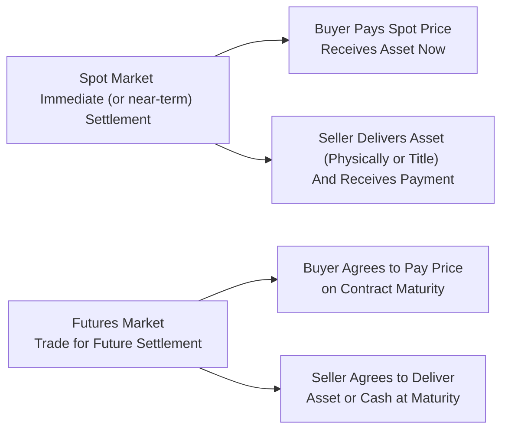

## 3.2 Futures Market vs. Cash Market

Picture this scene: you’re a coffee importer who needs to buy beans every month. Sometimes you might purchase them “on the spot”—like heading to the grocery store for immediate needs. But other times, you might want to lock in a price ahead of time, so you don’t have to worry about what might happen if coffee prices shoot up next month. That second scenario, folks, is basically the difference between the cash (or spot) market and the futures market.

In this section, we’ll explore how the futures market and the cash (spot) market function, why their prices sometimes diverge (and sometimes converge), and how individuals use each market for different goals. We’ll tie in some real-life examples—maybe even that jittery coffee anecdote—to illustrate why futures can trade at a premium or discount to the spot price, and why it all matters to hedgers, speculators, and everyday market watchers.

  
**The Cash (Spot) Market**  
The “cash market,” also called the “spot market,” is where transactions settle right away—well, “right away” in financial speak can be “same day” or “T+2” (two days later) settlement, depending on regional conventions, but it’s still pretty quick. Essentially, in a cash market, the buyer pays the market price (the spot price) and takes delivery of the asset as soon as possible. Think about walking into a store and slapping down cash (or tapping your phone) to buy groceries—yep, that’s basically your spot market.

  
**The Futures Market**  
By contrast, the futures market involves contracts where two parties agree to buy or sell an asset at a specific date in the future for a fixed price. It’s like pre-ordering tickets to a hot concert or grabbing a plane ticket long before your vacation. A futures contract is standardized: you have a set quantity (like 5,000 bushels of wheat), quality specifications, delivery date, and delivery point or cash settlement terms. These contracts trade on recognized exchanges (like Bourse de Montréal or the CME Group in the U.S.), and they have robust clearinghouses to reduce credit risk. Settlement can take place via physical delivery of the commodity or, in many cases, cash settlement (whatever is specified by the contract).

  
**Why Compare the Two?**  
Market participants often keep a close eye on the relationships between the futures market and the cash market. This relationship can uncover crucial signals about supply, demand, financing costs, and market sentiment—even if you aren’t actually delivering or taking delivery of the physical commodity. If you’re a farmer trying to protect against plunging wheat prices next year, or maybe a construction firm budgeting future steel costs, or just someone who trades equities and is curious about future interest rate trends, understanding how the futures and cash markets interact is invaluable.

  
### Price Discrepancies Between the Futures and Cash Markets

“Um, but if the futures contract is just for the same wheat, shouldn’t those prices be identical to the spot price?” you might be asking. In theory, the futures price and the spot price converge when the contract nears expiration, and in an efficient market, they are often closely linked by no-arbitrage relationships. Yet they do differ at times and for a few interesting reasons.

**Cost of Carry**  
A key factor is the cost of carry. This includes expenses such as storage costs (for commodities), financing costs (interest on money borrowed to purchase and hold an asset), insurance, and any other fees associated with holding onto the underlying product until the futures contract matures. Cost of carry can be significant with storable commodities like coffee or grains. For financial instruments, it’s mostly the interest cost, or opportunity cost, if you have money tied up.  

If you add the spot price to the cost of carry, you often get what’s sometimes called the “fair” futures price (absent other influences). If futures are trading above that theoretical level, it may signal there’s an additional premium that buyers are willing to pay—or it may hint at supply tightness or a bullish sentiment. Conversely, if futures prices are trading below that fair value, we might be looking at near-term supply constraints or other pressures that reduce the forward price.

**Expected Future Demand and Supply**  
Market participants may have forward-looking views on demand (like a forecast of a cold winter that might boost natural gas demand) or supply disruptions (like a strike in major copper mines). These expectations get priced into the futures. The spot market typically reflects right-now fundamentals—what the supply and demand look like in the current moment—while futures reflect tomorrow’s guesses.

**Interest Rates**  
In the Canadian market—and most global markets—interest rates can influence how people view the cost of carry. If interest rates are high, storing a commodity becomes more expensive (because you’re missing out on investing that money elsewhere, or it costs more to borrow). That can prop up futures prices relative to current spot prices. Conversely, if interest rates are super low, it might not cost you much to hold. That can influence how the futures curve (the term structure of futures prices) shapes up.

  
### Basis: The Gap Between Spot and Futures

Market watchers often talk about “basis,” which is simply the difference between the spot price of an underlying asset and the futures price. If the spot price for your favorite commodity is, say, CAD 100, and the futures price for three months from now is CAD 105, the basis is -5 (some folks define it as spot minus futures, so watch out for sign conventions). For a different commodity, if the spot price is higher than the futures price, the basis is positive.

**Why do we care about basis?** Well, for one, it matters for hedgers. If you’re hedging farmland produce, you might be worried that if the basis changes, even if your overall futures hedge is directionally correct, you could lose money on the basis shift. That’s something real businesses track closely—like the coffee importer in our example. Maybe you locked in your coffee import cost using futures, but if the spot market and futures market don’t move in lockstep, your hedge might not be perfect. Understanding basis helps measure that imperfection.

  
### Contango and Backwardation

Two fancy words pop up a lot in the context of futures vs. cash markets: “contango” and “backwardation.” Don’t worry—they’re not as intimidating as they sound.

**Contango**  
Contango is when the futures curve is upward sloping—futures contracts that are further out in time have higher prices than nearer-dated futures or the current spot price. You might see this in industries with significant storage costs or where people expect higher prices over time. In normal circumstances for stable or incrementally growing demand, a mild contango can be standard. Think of it as reflecting the cost of carry: if you’re paying for storage and financing to hold something, then naturally the price for a future delivery date should be higher than the current spot price—just enough to offset your costs.

**Backwardation**  
In backwardation, the futures curve is downward sloping—the further out you go, the cheaper the futures price becomes relative to near-term contracts or spot. This sometimes reflects immediate demand outweighing supply, or short-term scarcity that might ease over time. If everyone’s scrambling to buy natural gas in a cold winter, the front-month contract might spike in price, while six-month or nine-month contracts lag behind, because presumably the supply crunch will be resolved by then. This scenario often hints at short-term tension in the market.

  
### Why the Futures-Cash Relationship Matters to Different Participants

**Hedgers**  
Hedgers are folks who produce or use a commodity in their day-to-day business and want to mitigate the risk of price swings. They watch the basis between futures and the spot market carefully because an unfavorable basis shift can undermine the effectiveness of a hedge. If your local spot price goes out of whack with futures, you may not get the outcome you anticipated when you locked in a futures hedge months ago. CIRO (the Canadian Investment Regulatory Organization) offers guidance on how basis trading strategies must be structured to comply with margin requirements and reporting obligations—especially relevant to those wanting to remain within certain risk thresholds.

**Speculators**  
Speculators try to profit from price changes. They look for divergences between futures and spot to snag an arbitrage opportunity or spot a trend. A speculator might notice that a futures contract price is “too high” relative to the spot market plus carry costs and bet on that spread narrowing. Or they might see a supply shock on the horizon which the spot market hasn’t fully priced yet, so they buy longer-dated futures, expecting those futures to increase. Speculation contributes liquidity, and ironically, it can help setters of hedging transactions get in and out more efficiently.

**Arbitrageurs**  
Arbitrageurs strive to lock in risk-free profit—an approach that’s never quite as easy as it sounds. In a simplified example, if the futures contract is priced too high, an arbitrageur might buy the commodity in the spot market, store it, and sell a futures contract at that inflated price. Then at maturity, they deliver the commodity, pocketing the difference. If the futures are priced too low, they might do the reverse: sell short the commodity in the spot market, buy futures, and attempt to cover the short sale when the contract expires. These moves eventually help bring the futures price back into alignment with the spot price adjusted for carrying costs, delivering that so-called “no-arbitrage” relationship.

  
### Practical Example: The Coffee Conundrum

Let’s return to that coffee importer anecdote. Suppose the current spot price for a pound of coffee beans is CAD 1.20. You can purchase them now, taking physical possession, or you can buy a six-month futures contract for CAD 1.28 per pound. Quick math: the difference is 8 cents. But it could be rational if you consider the costs of storing coffee beans for six months (warehouse fees, insurance, plus the fact you’d otherwise tie up that money). If your total cost of carry is around 6 cents per pound, the futures contract at 1.28 might be a tad above fair value. But you might decide it’s worth paying a slight premium if you expect coffee prices to hike up more than that over the next six months.

Sometimes, if market participants think coffee beans will experience a big shortage or a surge of demand, futures might jump to CAD 1.35 or more, well above typical carrying cost calculations. That could signal a forecast of looming supply constraints or a robust coffee bean order from a major coffee chain. On the flip side, backwardation might arise if there’s an immediate shortage. The nearest coffee futures contract might trade above the next few months’ price because roasters need beans pronto to keep up with demand. As supply normalizes, the further-out contracts trade cheaper.

  
### Convergence as Futures Approach Maturity

One question that arises is: “So do these prices always stay different?” Not exactly. When a futures contract is about to expire, its price typically converges with the spot price because any difference at that final stage often can be arbitraged away (in efficient markets). If a contract matures tomorrow, you’re effectively talking about almost immediate delivery, so the difference between futures and spot should vanish in theory. But in times of extreme volatility or dislocations, you can see some wild anomalies.

  
### Regulatory Considerations in Canada

Whether you’re dealing in canola futures, coffee futures, or the S&P/TSX 60 Index futures, you’ll want to know the oversight that CIRO provides in Canada. CIRO sets margin requirements for futures trades and monitors the exposure that hedgers (and speculators) can have. They also have guidelines about how basis trades and spread trades should be reported, especially if you’re a large institutional participant or dealing in big volumes.

  
### Tools and Resources

• **CIRO** – Canada’s self-regulatory organization. You can find margined requirements and official guidelines on basis trading and futures at (https://www.ciro.ca).  
• **Bank of Canada** – Great source for interest rate information, economic data, and policy announcements that shape cost of carry analysis.  
• **Global Risk Institute** (https://globalriskinstitute.org/) – Offers research on global commodity flows, risk management, and interest rate projections that can influence the relationship between futures and cash markets.  
• **Open-Source Analytics** – Tools like Python’s Pandas or R’s data frames can help you chart historical basis, track contango/backwardation patterns, and run regressions on cost of carry.

If you’re just starting out, consider reading official publications from Bourse de Montréal, or check out free online courses on futures fundamentals. It might also be worthwhile to simulate trades using a paper trading account so you can watch the basis in action without risking real money.  

  
### Visual Comparison

Below is a simple Mermaid diagram comparing the flow of trades in the spot market vs. the futures market:

In the spot market (left side), transactions settle almost immediately. In the futures market (right side), the transaction is set for a future date, and prices reflect cost of carry, anticipated supply-demand changes, plus interest rates or storage costs.

  
### Conclusions and Looking Ahead

You might think it’s all about fancy math or big institutional players, but the interplay between the futures and cash markets can shape the cost of everything from your morning coffee to your monthly groceries. By monitoring how the futures price lines up with spot prices, you can gain insights into where the market believes prices might be heading, and how short-term vs. long-term supply-demand dynamics might evolve.

Anyway, the thrilling part is that when you’re a participant—be it a hedger, speculator, arbitrageur, or even a curious observer—understanding these markets can help you navigate risk more effectively. Also, if you’re looking to build a career in finance or manage your own investments, a strong grasp of futures vs. cash markets is foundational.

If you want to explore deeper pricing mechanics, you can check out other sections in this course. We delve into the cost of carry in detail, basis risk, and advanced hedging strategies. Also, keep an eye on the Bank of Canada announcements and read global research on commodity flows. The more you piece these puzzle parts together, the clearer it becomes why the futures-cash relationship is at the heart of modern derivative markets.

---

## Sample Exam Questions: Futures Market vs. Cash Market



### Which market is usually associated with near-immediate delivery and settlement of commodities or financial instruments?

- [ ] The futures market
- [x] The cash (spot) market
- [ ] The clearing market
- [ ] The forward market

> **Explanation:** The cash market, or spot market, settles transactions immediately or within a very short window. Futures contracts, in contrast, specify settlement at a future date.

### Which of the following best describes cost of carry?

- [x] Storage, insurance, and financing costs associated with holding an asset
- [ ] The difference between the basis and the spread
- [ ] Taxes on commodity transactions
- [ ] A regulatory fee paid to CIRO

> **Explanation:** Cost of carry includes all expenses, such as storage, insurance, and financing costs, that arise from holding the underlying asset until the futures contract matures.

### If the futures price for a commodity is higher than the current spot price plus its cost of carry, the market may be indicating:

- [x] An expectation of higher future prices or bullish demand dynamics
- [ ] That producers cannot deliver the commodity
- [ ] A lack of liquidity in the market
- [ ] CIRO margin rules are not being met

> **Explanation:** When futures are priced above spot plus carrying costs, it often signals participants expect prices to move even higher, or there’s a premium placed on future delivery.

### If near-term futures prices are higher than those for later months, that market is said to be in:

- [ ] Contango
- [ ] Normal
- [x] Backwardation
- [ ] Arbitrage

> **Explanation:** This situation describes backwardation: short-term supply tightness or immediate demand drives up near-term contract prices above longer-dated contracts.

### Which term refers to the difference between a cash (spot) price and a futures price?

- [ ] Arbitrage
- [ ] Contango
- [x] Basis
- [ ] Premium

> **Explanation:** Basis is the difference between the spot price and the futures price of the same underlying asset.

### What happens to futures prices as the delivery date or expiry approaches, under normal market conditions?

- [x] They usually converge toward the cash (spot) price
- [ ] They completely decouple from the cash price
- [ ] They skyrocket well above the cash price
- [ ] They become irrelevant to market participants

> **Explanation:** Under efficient market conditions and absent major disruptions, futures and cash prices converge by contract expiration, reducing the potential for arbitrage.

### Which factor can cause both spot and futures prices to deviate significantly from historical norms?

- [ ] Low open interest
- [x] Supply disruptions or unexpected demand
- [ ] The existence of an options market
- [ ] Market maker obligations

> **Explanation:** A supply disruption or unexpected surge in demand can create drastic changes in price, impacting both spot and futures markets.

### When the futures price is at a considerable discount to the spot price, which sentiment does it often reflect?

- [ ] Anticipation of strong future growth
- [x] A market condition suggesting near-term shortage or immediate demand is high
- [ ] Overpriced cost of carry
- [ ] Intervention by the central bank

> **Explanation:** A significant discount in futures relative to spot (after carrying costs) suggests current demand is high or near-term supply is tight, characteristic of backwardation.

### Why is basis important for hedgers?

- [x] It can impact the effectiveness of their hedges
- [ ] It determines CIRO membership requirements
- [ ] It has no significance for hedgers
- [ ] It only affects speculators

> **Explanation:** Basis determines how closely a hedge tracks the actual spot market. Changes in basis can result in gains or losses even if the underlying directional move is hedged.

### True or False: The Bank of Canada’s interest rate policy can influence the cost of carry and thus affect differences between futures and spot prices.

- [x] True
- [ ] False

> **Explanation:** Higher or lower interest rates change the financing component of cost of carry, directly influencing how futures prices compare to spot prices.


