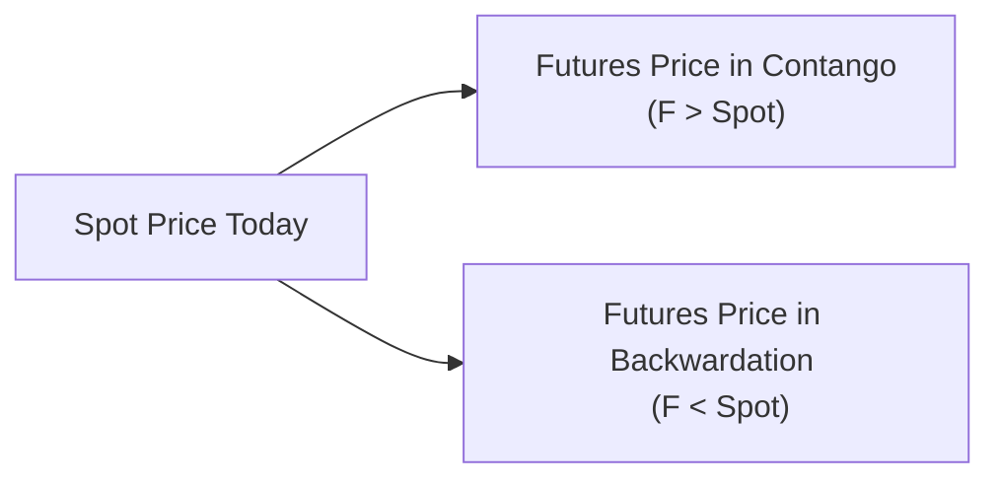
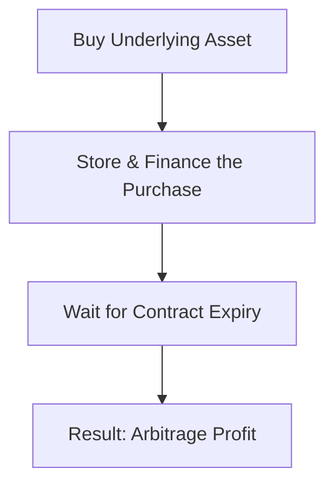

## 3.3 Cost of Carry

Sometimes, when I first dived into trading futures, I remember thinking: “Wait, why in the world would the futures price for a certain asset be so different from its current spot price?” It almost felt like I was missing something crucial—like maybe the seller had special knowledge. Over time, I realized that, well, they did have certain knowledge I hadn’t fully grasped: the cost of carry. So let’s talk about it here in a friendly, detailed way. Cost of carry is the linchpin that helps us understand why futures might be trading either above or below the current spot. It’s also vital for figuring out if there’s a hidden profit or arbitrage opportunity you can enjoy.

Rather than bulleting everything out too formally, let’s explore the cost of carry in an approachable way: from the basics of what it is, through the real-life factors that make it important in both commodity and financial futures, and then check out a bit of Canadian regulatory flavor to keep it real (and legal) in our local markets.

### Understanding the Concept

The “cost of carry” basically refers to all the expenses or costs you’d have to handle if you physically hold (or carry) an underlying asset until the date your futures contract settles. For some assets, like wheat or crude oil, the cost of carry might include tangible fees like storage and insurance. For a financial asset such as a stock index, you might not store anything in a warehouse, but you still have an opportunity cost—essentially the interest you could have earned if you deployed that capital elsewhere.

Here’s a general equation-type approach you might see in many texts:

In a super simplified sense, the fair futures price F might be:


F = S \times e^{(r - q)T}


Where  
• \\( S \\) is the current spot price of the underlying.  
• \\( r \\) is the relevant financing rate (e.g., risk-free interest rate or the cost of borrowing).  
• \\( q \\) is the yield generated by the asset (such as dividend yield for stocks or convenience yield for some commodities).  
• \\( T \\) is the time until the futures contract expires, often expressed in years or as a fraction of a year.  

That “\\(e\\)” might look fancy, but it’s just shorthand for exponential growth—like continuously compounding interest. Different textbooks or practitioners might use simpler formulas, especially if interest rates are not super high and we assume discrete compounding:


F \approx S \times (1 + r - q)^T


But no matter how the math is framed, the message is the same. The main cost factor is the interest you pay (or forgo) to hold the asset, while the main offset is any yield (like dividends) or convenience benefit that the asset pays you while you hold it. If the net cost is positive, the futures price typically gets pulled above spot. If that net cost is negative, the futures price might drop below spot. We’ll soon see how that translates into those special markets we call “contango” and “backwardation.”

### Common Components of the Cost of Carry

It’s helpful to break down the cost of carry into bite-size pieces. Here are the usual suspects:

• Financing Cost  
• Storage Cost  
• Insurance Cost  
• Yield (such as dividends) or convenience yield

Each of these elements can show up to a varying degree depending on whether we’re dealing with a financial or commodity-based future.

#### Financing Cost

Financing cost is the interest you would pay to fund the purchase of the underlying or the opportunity cost if you have to tie up your own capital. In Canada, you might use the Bank of Canada’s policy interest rate, posted at [https://www.bankofcanada.ca/](https://www.bankofcanada.ca/), or a short-term bank lending rate as a benchmark. If you can borrow at 5% per year, for example, that’ll weigh into your cost of holding that underlying. If you didn’t buy the asset (and initiated the same risk exposure differently), you could have invested those funds in a deposit or T-bill yielding 5%, so that’s effectively a 5% cost in a real-life scenario.

#### Storage Cost

When you’re dealing with something like wheat, corn, or maybe even precious metals, you might need a place to put them—think of it as renting space in a warehouse. These fees can vary a lot, especially for perishable goods. Agriculture and Agri-Food Canada (available at [https://agriculture.canada.ca/](https://agriculture.canada.ca/)) is an excellent source if you’re curious about Canadian storage cost data for certain agricultural commodities. These costs can be directly added to your total cost of carry.

#### Insurance Cost

Say you’re physically holding gold in an insured vault, or you’ve got bushels of wheat that might spoil or get damaged. The premiums you pay to insure that asset get tacked onto your cost of carry. Sometimes, these costs can be small relative to other factors, but they’re important edges to consider, especially for large positions or high-value goods.

#### Yield (Dividends, Convenience, or Negative Yields)

For equities or equity index futures, the yield typically refers to dividends. Dividends are basically an offset to your cost if you hold the actual underlying. If you choose to buy S&P/TSX Composite index shares directly, you’ll collect dividend income, so that’s a plus. If those dividends are large enough, they can reduce your net cost of carry significantly and might even push the theoretical futures price below spot. On the commodity side, yield could be something intangible (commonly called “convenience yield”), which represents the benefit of physically having the commodity ready to use or sell at a moment’s notice (for example, a refinery needing a supply of crude oil on hand).  
 
For instance, if a certain commodity is in short supply, physically holding it might help you avert production outages or price spikes, so that advantage is somewhat like a “negative cost,” offsetting financing, storage, and insurance to some extent.

### Contango vs. Backwardation

You may hear these slightly eerie-sounding terms all the time in futures markets. They come up at dinner parties sometimes—at least among finance folks. Let’s break them down, because they reflect cost of carry in an easy-to-see way.

• **Contango:** You’ve got a market in contango if futures prices are higher than the spot price. In other words, if you look at the price for next-month delivery, it’s above the current market price of the asset. People usually say the market’s in contango when the cost of carry (storage, financing, etc.) is higher than any yields or convenience benefits. This situation is common in many stable markets, especially if interest rates are moderate or high and there’s no real shortage of the commodity.

• **Backwardation:** The opposite scenario is backwardation, where futures prices are below the current spot price. Generally, backwardation occurs if the commodity’s yield or convenience yield is quite high (or if you’d rather hold the commodity in your hands than rely on a promise to receive it later). People might be scrambling to get the commodity now, making the spot price relatively high compared to futures. Sometimes you see backwardation in energy markets when demand spikes or supply tightens.

Here’s a little mermaid diagram to help visualize the difference in a super simplified way:

When the spot price is overshadowed by a significantly higher futures price, that’s a hallmark of contango (often reflecting a sizable cost of carry). When the spot price is higher than longer-dated contracts, that’s backwardation—suggesting a negative or minimal cost of carry after factoring in yields and convenience.

Of course, real markets can shift between these two states depending on supply, demand, interest rates, and a host of other economic forces. Sometimes, an underlying might be in contango for near months but slip into backwardation for longer-dated contracts.

### Cost of Carry in Commodity Futures

If you’re trading a commodity future—let’s pick on wheat for a moment—imagine you buy physical wheat in Manitoba and then store it in a grain silo. Over three months, you’ll pay:

• An interest cost on funds used to buy that wheat (let’s pretend the Bank of Canada’s rate plus a prime-lending spread).  
• A monthly storage fee to keep it in a silo.  
• A bit of insurance in case pests or a freak hailstorm damages the silo.  

Total those up, that’s your cost of carry. If the futures price for three months out is more or less than that total cost, you might have an arbitrage opportunity. For example, if the cost of holding wheat is $0.20/bushel over three months, but the futures price for the same physical wheat three months later is $0.30/bushel higher than spot, you might stand to pocket a risk-free profit.

But keep in mind that real life can be messy. Maybe you can’t find cheap enough storage. Or maybe there’s a risk that the quality of your wheat will degrade over time, meaning it won’t be considered the same “grade” at delivery. People also sometimes forget about shipping and transportation costs. That’s why actual physical arbitrage can be more complicated than theory suggests.

### Cost of Carry in Financial Futures

For financial futures, such as equity index futures, you might not have to worry about warehousing a bunch of stock certificates in a dusty basement. But you do have a financing cost (the capital you’re using to buy the underlying index if you wanted to replicate it in the cash market) and you have a “negative offset” if that index pays dividends. Typically, an index future trades at a level that’s close to the spot index price plus the net cost of carry:

• Let’s define \\( r \\) as your financing rate (risk-free or the rate you’d pay on a margin loan).  
• Let’s define \\( d \\) as your dividend yield on that index.  

If \\( r > d \\) (cost of financing is bigger than the dividend yield), the futures generally sit above the index's current level. If \\( r < d \\), the futures might be trading below the index (a sign of backwardation). In practice, the difference is often quite small thanks to competition—arbitrageurs jump in whenever the difference becomes too large.

### Cost of Carry and Arbitrage

Cost of carry offers a roadmap for spotting mispriced futures. If a futures contract is trading too high relative to your best guess of the cost of carry, you could sell that future, buy the underlying, and carry it until expiration. Then you deliver the underlying against the sold futures contract, pocketing the difference. That’s called a “cash-and-carry arbitrage.”

Conversely, if a futures price is too low, you might short the underlying, invest the proceeds, and buy futures to close out your position at expiration, thereby creating a “reverse cash-and-carry” trade. Markets are typically quite efficient, so glaring arbitrage opportunities rarely last long. But if you keep an eye on cost of carry, you can catch these fleeting windows where the market is momentarily out of sync.

In this simple diagram, the net effect is that you lock in your purchase price plus your known cost of storage/finance, then sell the asset forward at a higher price in the futures market. If everything’s done right—assuming stable costs and matching asset grades—the difference can be an almost riskless profit.

### Contango, Backwardation, and Commodity-Specific Nuances

Commodities sometimes have unique features that shape cost of carry. Oil, for instance, can have a huge monthly storage cost if inventories are near capacity. Agricultural products can spoil. Precious metals often require heavily secure vaults that may cost more than a typical warehouse. Each of these constraints nudges the cost of carry up or down, shifting the equilibrium futures price accordingly.

A commodity like gold might be in contango if interest rates are high and vault space is expensive—futures might cost more to reflect that additional storage expense. On the flip side, you might see a metal go into backwardation if it’s temporarily in short supply, meaning the convenience yield is high, or if interest rates are low and everyone is trying to secure the metal for immediate use.

In Canada, wheat, canola, and other agricultural products can swing between contango and backwardation depending on the harvest outlook, disease/pest issues, or climate factors in major producing regions. Agriculture and Agri-Food Canada publishes data on production levels and other supply-demand insights, providing a window into how shortage or abundance might impact your cost of carry calculations.  

Also, keep in mind that both CIRO (the Canadian Investment Regulatory Organization) and the clearinghouse (like the Canadian Derivatives Clearing Corporation, CDCC) have margin requirements and capital guidelines that can indirectly affect your actual funding costs. If you need to put up more margin, that ties up capital. Tied-up capital can raise your effective financing rate, so from a practical standpoint, cost of carry might feel a little heavier.

### Real-World Example: Stock Index Futures in Canada

Imagine you’re looking at the S&P/TSX 60 Index with a spot value of 1,000 points, just for round numbers. Let’s say the one-year risk-free rate is 4%, and your best guess is that the index’s dividend yield for the next year is 2%. If you do a simple cost of carry approach:


\text{Theoretical Futures Price} = 1000 \times e^{(0.04 - 0.02)\times1} \approx 1000 \times e^{0.02} \approx 1000 \times 1.0202 = 1020.2


So you'd expect the one-year future to be roughly 1,020. That’s about 2% over spot. If you see the market quoting something like 1,030, that’s a bigger gap—maybe you’d want to do a cash-and-carry to exploit that. If you see it at 1,010, you might do a reverse cash-and-carry. In practice, though, transaction costs, timing considerations, and real-world dividend variations complicate things. Still, the cost of carry concept guides you to the “fair value” zone.

### Spotlight on Canadian Regulations

You might be wondering, “How does any of this tie into regulations?” In Canada, the newly established CIRO (which replaced the historically separate IIROC and MFDA) regulates investment dealers. It oversees the market integrity aspects of derivatives trading, including the capital and reporting requirements that can influence your cost of carry calculations. For example:

• **Margin Requirements:** CIRO has margin guidelines for futures positions. The margin you post might be quite high or fairly modest, depending on the contract’s volatility. Either way, it impacts your cost structure by tying up capital that might otherwise be earning interest.  
• **Reporting Requirements:** If you’re a major player and hold large positions, you might need to comply with position reporting or large-trader reporting. It doesn’t alter cost of carry directly, but it can increase your overhead or complexity, especially if you use multiple brokers.  
• **Tax Implications:** Just as an aside, the Canada Revenue Agency (CRA) might treat different derivatives in different ways. If you earn a profit from arbitrage or hedging, you might owe taxes at the end of the year. That’s not the cost of carry itself, but it can reduce net gains.  

Links worth checking:  
• [CIRO website](https://www.ciro.ca) for the latest compliance bulletins.  
• [CDCC website](https://www.cdcc.ca) for margin and settlement guidelines relevant to futures.  

### Strategies for Traders and Investors

So how do we incorporate cost of carry into a real strategy?

• **Hedging:** If you hold a physical commodity or an equity portfolio, you might offset the risk with a short futures position. Knowing your cost of carry helps you price out how much that hedge is effectively costing you, after netting out yields or other benefits.  
• **Speculation:** Pure speculators will sometimes track the cost of carry as a guide to whether futures are “fairly priced.” If they spot an anomaly (maybe the futures are trading too high versus spot plus financing costs), they might short the futures in the hope of a reversion to the fair value.  
• **Arbitrage:** This is the direct exploitation strategy we mentioned. You lock in the spread between the (expected) fair futures price and the actual quoted price, relying on known financing or storage costs. Done repeatedly, it’s a way to collect relatively low-risk returns—provided you’re well-capitalized and able to handle the operational complexities.  

These strategies all hinge on your ability to carefully calculate or at least estimate the cost of carry. If you’re systematic about it, you can set up spreadsheets pulling real data from the Bank of Canada, store commodity data from Agriculture and Agri-Food Canada, and maybe factor in real-time dividend forecasts from various corporate announcements or a Bloomberg data feed. It might sound a little intense, but it’s part of the job if you want to be thorough.

### Potential Pitfalls

Even though cost of carry is conceptually straightforward, in reality, lots of folks trip up. Here are some stumbling blocks:

• **Ignoring Actual Storage and Insurance Costs:** It’s easy to underestimate these, especially if you’re new to physical commodities. A lot of folks just assume minor costs, but if you are storing grain in a specialized facility or vaulting precious metals, overhead can really eat your profits.  
• **Underestimating Dividend Variability:** Dividends are not always stable. If you’re counting on a 2% yield but major companies in the index cut their payouts, your cost of carry formula might overshoot.  
• **Liquidity Constraints:** If the futures contract is thinly traded, the bid-ask spreads might offset your theoretical edge. Also, real arbitrage might require big volumes, and not every market can absorb that easily.  
• **Regulatory Adjustments:** Margin rates can suddenly change if market volatility spikes, as has happened in rapid market shifts. That can modify your financing assumptions basically overnight.  

I remember once trying a small arbitrage on a metal that I was sure was overpriced in the futures. But the warehouse cost turned out to be much heftier than I’d expected, plus I had to add insurance coverage beyond what I anticipated, so my theoretical profit basically vanished. Lesson learned: always do your homework on carry costs in detail.

### Best Practices

• **Model All Costs Explicitly:** Keep a line item for each of interest, storage, insurance, and expected yield.  
• **Watch the Calendar:** If you’re dealing with calendar spreads (buying one expiration, selling another), cost-of-carry logic is your friend.  
• **Use Robust Data:** Don’t rely on guesswork for dividends or interest rates. Use official or high-quality third-party data.  
• **Plan for Contingencies:** If the market moves sharply, you might face margin calls, which will alter your financing.  
• **Check for Seasonal Swings:** In agriculture or energy, seasonality can cause large cost changes—like increased heating costs in winter or higher spoilage risk in hot summer months.  

When done properly, cost-of-carry analysis can be your guiding star for futures pricing. It keeps you from overpaying, or from dumping a future at too cheap a level. And it’s basically the foundation for so many strategies used by hedge funds, institutional desks, and savvy retail traders.

### Additional Resources

For those who want to keep learning:

• **“Futures, Options, and Swaps” by Robert Kolb** – A comprehensive academic resource that dives into cost of carry and other advanced pricing details.  
• [Bank of Canada](https://www.bankofcanada.ca/) – Official site for Canadian interest rates, a critical input for financing cost.  
• [Agriculture and Agri-Food Canada](https://agriculture.canada.ca/) – For commodity production, handling, and storage data.  
• [CIRO](https://www.ciro.ca) – The new Canadian SRO used to track compliance rules, capital requirements, margin rates, and more.  
• [CDCC](https://www.cdcc.ca) – Details on clearing, margin deposits, settlement procedures, and official contract specs.  

### Final Thoughts

Cost of carry might initially feel like a purely academic concept, but it’s super practical once you realize it’s the hidden gear turning inside the pricing mechanism for futures. It’s the reason you’ll see oil trading at one level in the spot market and a different level three months out. Same with stock indexes—whether they’re above or below spot has a lot to do with interest rates and dividends.

If you’re a beginner, just remember that the cost of carry is essentially the net expense (or net income offset) for holding the underlying. If that net expense is big, futures will run above spot (contango). If that net expense is smaller, or even negative, you lean toward backwardation. Knowing which scenario you’re in—and whether the futures price is fairly accounting for those costs—helps you see if there’s money on the table or not.

Take your time, do the math, personally confirm each cost, check your data, and be mindful of your margin obligations and actual feasibility. Before you know it, you’ll be reading prices on the Bourse de Montréal or other global exchanges and going, “Ah, yeah—I see how that’s basically the cost of carry in action.” Good luck and have fun exploring how these hidden costs shape the entire futures landscape.

## Sample Exam Questions: Cost of Carry Fundamentals



### Which of the following best describes the “cost of carry” in a futures market context?

- [ ] It is the fee brokers charge to execute orders.
- [x] It represents all expenses associated with holding the underlying asset, including financing, storage, and insurance.
- [ ] It is only relevant for commodity futures, ignoring financial futures.
- [ ] It is purely an administrative fee charged by clearinghouses.

> **Explanation:** Cost of carry includes financing, storing, and insuring the underlying asset, and may also consider offsets like dividends or convenience yield.

### If financing costs exceed dividend yields, what typically happens to the price of a stock index futures contract compared to its spot price?

- [x] The futures contract will likely trade above the spot (contango).
- [ ] The futures contract will likely trade below the spot (backwardation).
- [ ] The futures contract will equal the spot price at all times.
- [ ] The futures contract becomes worthless.

> **Explanation:** In equity index futures, when the cost of holding the index (financing) is greater than the dividend offset, the futures price usually sits above the spot level.

### How can high storage costs impact the pricing relationship between spot and futures prices in a commodity market?

- [x] They increase the futures price, often creating or widening contango.
- [ ] They reduce the futures price and generally result in backwardation.
- [ ] They have no effect on market equilibrium.
- [ ] They are offset completely by arbitrage.

> **Explanation:** Higher storage costs raise the total cost of carry, pushing futures prices upward relative to spot.

### What is a “cash-and-carry” trade?

- [ ] A trade in which you buy the futures and sell physical assets to capture negative cost of carry.
- [x] A strategy where you purchase the underlying and simultaneously sell futures, aiming to profit from a mispricing if futures are overpriced.
- [ ] A short-selling strategy with no offsetting positions.
- [ ] A trade that only applies to currency futures.

> **Explanation:** Cash-and-carry arbitrage involves buying the asset in the spot market and locking in a future sale at a higher price, banking on a positive spread above actual carry costs.

### Which of the following is NOT a primary component of cost of carry for physical commodities?

- [ ] Financing cost
- [ ] Storage cost
- [ ] Insurance cost
- [x] Dividend yield

> **Explanation:** Dividend yield is typically relevant to equities, not physical commodities. Instead, a physical commodity might have a convenience yield but not a dividend yield in the conventional sense.

### If an underlying commodity is in short supply, why might the market exhibit backwardation?

- [x] Because the convenience yield of holding the commodity now is high, driving spot prices above futures prices.
- [ ] Because financing costs are zero in a shortage.
- [ ] Because insurance costs are suddenly lower.
- [ ] Because the only effect is administrative overhead.

> **Explanation:** A shortage boosts the “convenience yield,” making the immediate possession of the asset more valuable and reducing or negating the cost of carry, resulting in backwardation.

### What role does CIRO play in Canada’s futures market with respect to cost of carry?

- [ ] CIRO sets the interest rates used for cost-of-carry calculations.
- [ ] CIRO updates daily commodity storage rates for participants.
- [ ] CIRO insures all physical commodities to reduce cost of carry.
- [x] CIRO enforces margin and capital requirements, which indirectly affect financing rates and total funding costs of carrying a position.

> **Explanation:** While CIRO doesn’t directly set storage or interest rates, it does establish margin rules and capital thresholds that can raise or lower the effective financing costs for market participants.

### In a carry trade scenario, how might tax considerations affect your net profit?

- [ ] They have no effect, because futures profits are never taxed.
- [x] Taxes can reduce the net profit from an arbitrage, so participants must factor them into overall cost calculations.
- [ ] They make all arbitrage attempts illegal in Canada.
- [ ] They only apply if you lose money.

> **Explanation:** Taxes on profits reduce the ultimate gains from any strategy, including cost-of-carry arbitrage, so factoring in tax obligations is necessary for a complete evaluation.

### According to the cost-of-carry model for stock index futures, which factor helps reduce the financing cost when holding the underlying index?

- [ ] A high insurance requirement
- [ ] Large storage fees
- [x] Dividend yield
- [ ] Government subsidies

> **Explanation:** Dividend yield is an income offset that reduces the net cost of holding an equity index, thus lowering the future’s theoretical fair value relative to spot.

### True or False: A large difference between the actual future price and the theoretical fair value suggested by the cost of carry often presents a possible arbitrage opportunity.

- [x] True
- [ ] False

> **Explanation:** When the market price of a futures contract deviates from fair value derived from cost-of-carry calculations, arbitrageurs can exploit the discrepancy through cash-and-carry or reverse cash-and-carry trades.


