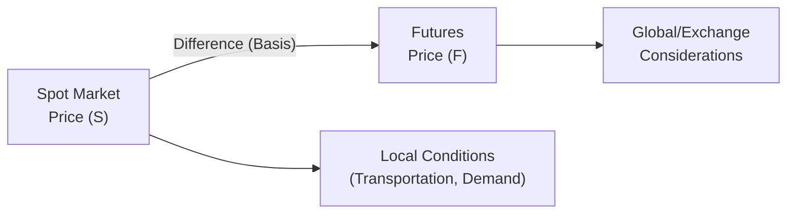

## 3.4 Basis

Imagine you’re sipping a cup of coffee at the breakfast table, reading the latest news on commodity prices. You notice that the price for a certain wheat futures contract doesn’t match the spot price you saw reported for that same wheat market. This difference between the spot (cash) market price and the futures price is called the basis. At first, it might look a little puzzling—why on earth would these two prices differ if they’re both for the same underlying product? In this section, we’ll dive into the concept of basis, why it matters so much for hedgers and speculators, and how it changes over time. We’ll also share a few personal reflections, real-world examples, and references to Canadian-specific regulations and institutions like the Canadian Investment Regulatory Organization (CIRO) and the Canadian Grain Commission.

Understanding the basis is a core part of effective risk management and pricing in futures markets, whether you’re dealing with grains, crude oil, stock indices, or interest rates. So let’s jump in and see why that morning cup of coffee might taste just a little bit different once you start tracking the spot-futures basis.

## Defining Basis

Basis is essentially the difference between the spot price of an asset and the corresponding futures price for the same (or closely related) asset. Mathematically, it’s often expressed like this:

Basis = Spot Price – Futures Price

However, in real-world conversations, you might also hear people flip the sign or use other conventions, so always confirm how the basis is being quoted. For many agricultural commodities, a “positive basis” typically means the spot price is higher than the futures price, which might indicate tight local supply or strong regional demand. Conversely, a “negative basis” often means the futures price is higher than the spot price, possibly signaling plentiful local supply or weak demand relative to the futures market.

## Why the Basis Exists

When you think about it, you might wonder why the spot and futures prices for the same commodity (or financial instrument) aren’t exactly identical. The core reason: time. The futures price reflects not only the underlying commodity or financial instrument’s current value but also additional factors like carrying costs (storage fees, financing charges, insurance), convenience yields, or expected future changes in supply and demand. In financial futures, interest rates, dividend expectations, or anticipated economic data releases can also shape the difference between spot and futures prices.

Basis is the net result of these factors—some short term, some long term, some local, and some global. The interesting part? These driving forces can shift daily, or even minute-by-minute in fast-moving markets. That’s precisely why the basis can widen or narrow in ways that keep participants on their toes.

## Positive vs. Negative Basis

If you’re new to basis, you might hear traders toss around statements like “the basis is positive today, which is good news for local farmers” or “the basis has gone negative—time to rethink our hedge.” Here’s a quick breakdown:

A positive basis: Spot Price > Futures Price. 
This often suggests that local (or nearby) demand for the physical product is high relative to the more distant delivery implied by the futures market. Maybe there’s a shortage of the crop in your local region, pushing up the spot price, while the broader futures market remains unaffected.

A negative basis: Spot Price < Futures Price. 
This can arise when local or regional supply is abundant, and the spot market is glutted with inventory. The futures market might still be pricing in potential risks or costs associated with holding the commodity over time, making the futures price higher.

## Basis Risk: When Spot and Futures Prices Don’t Move in Tandem

The relationship between spot prices and futures prices is not always perfect. Just because the spot price of oil goes up by $2 doesn’t guarantee your oil futures contract is going to rise by exactly $2. The risk that the two prices won’t perfectly track each other is called basis risk. By the way, basis risk is particularly nerve-racking for hedgers, because they rely on an assumption that the futures price will move more or less in sync with the spot price to offset their exposure in the physical market.

Imagine a wheat farmer who plants a crop in the spring, expecting to harvest in late summer. She decides to hedge her future production by selling wheat futures on the Bourse de Montréal or another exchange. If everything lines up neatly at harvest—spot and futures prices converge as expected—her hedge works well, and she’s shielded from adverse price movements. But suppose local weather events or unexpected demand changes drive her region’s spot price in a very different direction than the national or global futures markets. This mismatch means her hedge won’t be perfect. That’s the dreaded basis risk.

## How Basis Moves: Narrowing vs. Widening

Market participants often describe the basis as “narrowing” or “widening.” If the basis narrows, it means that the difference between the spot and futures price is getting smaller (e.g., if the futures price was much higher than the spot price initially, the gap between them is shrinking). If the basis widens, the spread is growing.

As a hedger, you might want a predictable, stable basis so you know exactly how well your hedge is performing. Yet, real life rarely cooperates, and basis can shift for a variety of reasons:

Local production issues: Weather changes, logistical hiccups, sudden increase in local demand.
Changes in interest rates or cost of capital: Affects financing costs in financial futures.
Seasonal factors: Harvest or storage seasons, especially in agriculture.
Global macroeconomic factors: Shifts in currency exchange rates, trade policies, or supply chain disruptions.
Dividends (in equity index futures): If a stock index is expected to pay dividends, that can shift the futures price relative to the spot level.

## A Personal Anecdote on Tracking Basis

I remember, back when I was helping a friend’s family farm in Saskatchewan, we would check the local wheat prices almost every morning and compare them to the futures quotes on the Bourse de Montréal or the Chicago Board of Trade. Some days, the difference was only a few cents, which we’d call a tight spread. Other days, especially if something unexpected happened—like a sudden rail transportation bottleneck or a big export order from overseas—the local spot price would surge and create a larger gap from the futures price. We might scramble to adjust hedges or place new orders if we thought the shift was temporary. It was an ever-evolving process, a bit stressful at times, but definitely an eye-opener for how dynamic the basis can be.

## Basis in Commodity Markets

For commodities like grains, metals, and energy, the basis can be influenced by transportation costs, storage considerations, weather conditions, local regulations, and so on. In Canada, local supply/demand imbalances are especially important. Depending on whether you’re in Alberta’s energy corridor or in Ontario’s manufacturing base, the local price for a commodity might be higher or lower than the broad futures market. These differences are what give rise to basis. For instance, in agricultural commodities, the Canadian Grain Commission (https://grainscanada.gc.ca) gathers data on local basis patterns, which farmers and agribusinesses can use to make informed marketing decisions.

Transportation can play a critical role: If it’s costly or difficult to transport the physical commodity from a production area to a consumption area, and the local region is short on supply despite a big harvest somewhere else, the spot price can soar. Meanwhile, the futures price might remain unaffected if the “big picture” supply is balanced.

## Basis in Financial Futures

Financial futures, such as stock index futures or interest rate futures, have their own version of basis. Instead of dealing with physical storage and transportation, we look at the influences of interest rates, dividends, and other cost-of-carry factors. For example, if you hold a stock index physically, you receive dividends but incur the opportunity cost of money. If you hold a futures contract instead, you skip the dividend payment but free up capital to invest in something else. The interplay of these factors sets the level of basis in equity index futures.

For interest rate futures, the basis often reflects expectations of where short-term or long-term rates will be at the contract’s settlement date. If the central bank in Canada, or globally, is hinting at interest rate hikes, that can alter the relative pricing of cash bonds (spot) versus bond futures. You might see the basis shift abruptly in response to a single news release from the Bank of Canada.

## Common Drivers Affecting Basis

Local Market Conditions. Things like weather, local infrastructure, and local demand can dramatically move the spot price relative to the broader futures market.
Carrying Costs and Cost of Capital. Storage fees, interest expenses, and insurance can widen or narrow the spread. 
Seasonality. Agriculture is the prime example, where planting and harvest seasons often lead to recognizable basis patterns.
Global Economic Policies. Tariffs, trade agreements, or currency fluctuations can impact the alignment between spot and futures markets.
Dividend Expectations. In stock index futures, any revision to expected dividends quickly alters the futures pricing relative to spot levels.

## Regulatory Context in Canada

When it comes to trading futures and understanding basis, Canadian market participants operate under the rules set forth by various entities, including the Bourse de Montréal and CIRO (the Canadian Investment Regulatory Organization). As of June 1, 2023, CIRO is the single national self-regulatory organization that oversees investment dealers and market activities in Canada. Previously, the Investment Industry Regulatory Organization of Canada (IIROC) and the Mutual Fund Dealers Association of Canada (MFDA) existed as separate organizations, but they’ve since combined into CIRO. Any references to IIROC or MFDA are now strictly historical.

CIRO provides guidelines for hedgers seeking margin exemptions or favorable margin treatment. Basis traders might be able to demonstrate that their futures position is genuinely a hedge rather than a speculative position, which can reduce margin requirements or regulatory capital charges. For updated details on margin requirements, one can check the official CIRO website at https://www.ciro.ca.

Market participants dealing in agricultural commodities often also look at Canadian Grain Commission research to understand local basis patterns, grading standards, and developments in grain pricing. These resources help in monitoring how changes in local supply/demand are influencing basis.

## Tracking and Analyzing Basis

One practical way to monitor basis is simply to track daily spot prices in your region and compare them to the nearest or most liquid futures contract price. You can use spreadsheets, specialized commodity trading software, or open-source financial tools like Python’s pandas library or R’s tidyverse. Through frequent monitoring, you can observe patterns or anomalies in your local basis, which might signal a time to lock in prices, roll hedges, or explore arbitrage opportunities.

If you’re an algorithmic trader, you might feed real-time data into a system that automatically looks for profitable basis trades: for instance, going long in the spot market and short in futures if the basis is abnormally wide with the expectation that it’ll converge. However, keep in mind that transaction costs, carrying costs, and liquidity constraints can quickly erode any theoretical profit.

## Diagram: Spot Price vs. Futures Price

Below is a simple Mermaid diagram illustrating the relationship between the spot price and the futures price, highlighting the basis.

In this diagram, the basis is represented by the arrow connecting Spot Market Price (S) to Futures Price (F). While spot market prices might be influenced heavily by local conditions such as weather and transportation costs, futures prices are more driven by exchange-based factors and broader global supply-demand considerations.

## Hedging with Basis in Mind

For many hedgers—like farmers, energy producers, corporate treasurers, or importers—the name of the game is to reduce or eliminate the uncertainty of the final net selling (or buying) price. When you lock in a hedge, you’re effectively offsetting your spot price risk with a futures position. But the actual hedge performance depends on what happens to the basis between now and the time you unwind the hedge.

If you want to hedge successfully, you need to have an opinion on whether the basis will remain stable, widen, or narrow. That means studying historical basis trends, factoring in your local or sector-specific conditions, and planning for potential basis risk. Large institutional hedgers often have entire teams devoted to basis analysis, employing sophisticated models. But if you’re a smaller market participant, you might rely on simpler historical averages, forward contracting, or advice from marketing advisors who watch the markets daily.

## Example: Canadian Wheat Farmer’s Hedge

Let’s walk through a simplified example. Suppose you’re a wheat farmer in Manitoba:

• Your local elevator is offering a spot price for wheat of CAD 6.00 per bushel.
• The nearest wheat futures contract trades on an exchange at CAD 5.85 per bushel.
• This means the basis is +CAD 0.15 (spot – futures), which we might call a positive basis.

Because you’re not harvesting for another two months, you decide to use the futures market to lock in the price. Your hope is that by the time your wheat is ready to sell, if the spot price happens to drop, you’ll gain on your short futures position. But if local supply tightens and the basis increases even further, you may end up with a hedge that’s less beneficial than you hoped. That’s basis risk: you guess the difference between the local spot market and the futures market will remain stable, but conditions can shift unpredictably.

## Impact of Seasonality

Seasonality can generate pronounced cycles in basis. For instance, in the agricultural world, harvest season often leads to an influx of supply, causing local spot prices to drop relative to futures, widening the basis in certain markets. As the harvest moves into storage, the cost of carrying inventory might push futures prices in specific ways, potentially influencing the basis the other way. Understanding typical seasonal forces can help commercial hedgers or even speculators predict basis changes.

## Basis Arbitrage Opportunities

In an ideal world with zero transaction costs, if the basis becomes too large or too small, arbitrageurs would swoop in to buy low (in the spot market) and sell high (in the futures market), or vice versa, thus bringing the basis back toward fair value. But real-world limitations—like transportation delays, warehouse space, or margin requirements—often prevent perfect arbitrage. Nonetheless, well-capitalized traders, agribusinesses, or financial institutions might still exploit smaller discrepancies. For instance, if the spot price of crude oil in Alberta is significantly below the futures price—more than storage and interest costs would justify—someone might buy physical crude and short the futures until the relationship normalizes.

## Best Practices for Managing Basis Risk

Stay Informed: Monitor local supply/demand fundamentals, track weather patterns, follow relevant news, and keep an eye on economic indicators that could affect your commodity or financial product.
Historical Analysis: Look at multi-year data on local basis moves. Historical trends can serve as a baseline for what’s “normal,” though always be prepared for surprises.
Diversify Hedges: Some businesses choose to hedge only part of their expected production or exposure, reducing the risk that a major change in basis leaves them “locked in” to unfavorable terms.
Use Tools and Alerts: Many trading platforms offer real-time basis alerts. Setting up automated triggers can help you respond quickly to unexpected basis moves.
Stay in Compliance: CIRO has established rules around hedging and margin requirements. Ensure that your futures positions are recognized as legitimate hedges to benefit from any margin exemptions or capital relief.

## When Basis Surprises You

Perhaps one of the most frustrating experiences in commodity markets is nailing the overall price direction but then watching your hedge fail because local factors drove the spot market away from the futures market. For instance, we could see a scenario where a global surplus of a certain grain pushes futures prices down, which should, in theory, help a livestock producer who’s buying that grain. But if local floods or transportation strikes in the producer’s region create a shortage, the local spot price might stay high or even go up. In that case, the producer’s futures hedge—meant to protect against rising grain costs—wouldn’t perform as hoped, and the basis soared. These local anomalies highlight the reality and gravity of basis risk.

## Real-World Case: Basis in Natural Gas

Take natural gas in Alberta (AECO pricing) vs. the benchmark Henry Hub pricing in the United States. Canadian natural gas spot prices can often trade at a deep discount to Henry Hub futures due to pipeline constraints, regulatory factors, or local production surpluses. When those constraints ease (e.g., pipeline expansions, increased export capacity), the AECO price might rapidly converge toward Henry Hub, narrowing the basis. This can create big winners or losers among hedge positions in the energy market.

## Common Pitfalls

Ignoring Local Conditions: Relying solely on futures prices without investigating regional factors can lead to inaccurate assumptions about your real exposure.
Over-Hedging: Locking in too much production or consumption in the futures market can magnify the impact of basis moves if the spot-futures relationship deviates significantly.
Not Watching Seasonality: Seasonal forces can mislead new traders who don’t realize that certain months or contract delivery periods have historically wide or narrow basis patterns.
Failing to Adjust: Basis might move in your favor or against you long before your delivery date. You have to monitor it over time and adjust or roll your futures positions if needed.

## References and Additional Resources

For official updates on margin requirements, hedging exemptions, or basis trading rules, check CIRO resources at [https://www.ciro.ca](https://www.ciro.ca).

The Canadian Grain Commission ([https://grainscanada.gc.ca](https://grainscanada.gc.ca)) provides data and insight into Canada’s grain handling and market structure, including regional basis estimates and historical patterns.

The Bourse de Montréal site ([https://www.m-x.ca](https://www.m-x.ca)) offers official contract specifications, margin details, and educational materials on Canadian futures and options markets.

For open-source analytics, explore Python’s libraries such as pandas, NumPy, and statsmodels, or R’s tidyverse for building your own basis tracking and forecasting models.

For additional reading, the classic futures trading textbooks by John Hull and Stanley K. Johnson (on commodity hedging) offer deep dives into the mathematical and conceptual frameworks behind basis and cost-of-carry.

## Concluding Thoughts

Basis is more than just a number on a spreadsheet—it’s the heartbeat of local supply-demand conditions meeting global market forces. Understanding it can give you a leg up if you’re hedging a physical position or looking for arbitrage. Sure, it may seem intimidating at first, especially when basis risk is on the table. But by monitoring local conditions, staying up-to-date with global dynamics, and carefully planning your hedge or trading strategy, you can tame much of the volatility that comes from the gap between spot and futures prices.

If you’re looking for a single takeaway, it’s this: basis can make or break your hedge. Getting comfortable with how basis behaves—and learning to manage the risk that it might veer off-course—is crucial for every serious market participant. Keep observing, keep learning, and, well, keep enjoying that morning coffee. Understanding basis might just change how you view market prices (and maybe add a dash of excitement along the way).

-----

## Sample Exam Questions: Mastering Basis in Futures Markets



### For a given commodity, which best describes a positive basis?

- [x] The spot price is higher than the futures price.
- [ ] The futures price is higher than the spot price.
- [ ] The spot and futures prices are equal.
- [ ] The basis is zero.

> **Explanation:** A positive basis means spot price – futures price > 0, i.e., the spot market is priced higher than the futures market.

### Which of the following statements is true about basis risk?

- [x] It arises when the spot and futures prices do not move in perfect sync, affecting hedge effectiveness.
- [ ] It occurs only when the futures price is higher than the spot price.
- [ ] It can be eliminated by not trading at all.
- [ ] It only applies to commodity futures, not financial futures.

> **Explanation:** Basis risk is the risk that the difference between spot and futures prices does not change as expected, undermining hedge performance. It applies across commodity and financial futures.

### What does it mean if the basis is said to be “narrowing”?

- [x] The difference between the spot and futures price is decreasing.
- [ ] The difference between the spot and futures price is increasing.
- [ ] The basis is becoming more negative.
- [ ] The cost of carry is increasing.

> **Explanation:** Narrowing basis indicates the absolute difference between spot and futures price is shrinking, regardless of whether it is positive or negative.

### In a scenario where local supply is unexpectedly tight, which of the following outcomes is most likely?

- [x] Spot prices might rise, causing a positive basis or a widening of an already positive basis.
- [ ] Futures prices will always rise faster than spot prices.
- [ ] Basis risk disappears due to stable local conditions.
- [ ] All local hedgers will be better off due to stable demand.

> **Explanation:** If local supply is tight, the spot market experiences upward pressure, often pushing spot prices above futures and increasing (widening) a positive basis.

### Which factor is most likely to affect the basis of equity index futures?

- [x] Changing dividend expectations.
- [ ] Pipeline transportation costs.
- [x] Shifts in interest rates.
- [ ] Local weather conditions.

> **Explanation:** In equity index futures, dividends and interest rates are key drivers of the cost-of-carry model. Weather or transportation is not directly relevant for financial instruments, though it might matter for commodities.

### How might hedgers use historical basis data in decision-making?

- [x] They study patterns to predict potential movements in basis and adjust hedges accordingly.
- [ ] They use historical basis data solely to predict changes in currency exchange rates.
- [ ] Basis data is irrelevant for hedging because spot and futures always converge at expiration.
- [ ] They rely on basis data exclusively to select new farmland.

> **Explanation:** Historical basis data helps hedgers anticipate how the spread evolves over time due to seasonal or market conditions, informing more effective hedging decisions.

### Which of the following organizations in Canada provides official guidelines for hedgers to qualify margin exemptions?

- [x] CIRO (Canadian Investment Regulatory Organization).
- [ ] The defunct MFDA (Mutual Fund Dealers Association).
- [x] The defunct IIROC (Investment Industry Regulatory Organization of Canada).
- [ ] The Canadian Grain Commission.

> **Explanation:** The newly formed CIRO (formerly IIROC and MFDA) oversees investment dealers and sets guidelines on margin and hedging. The Canadian Grain Commission provides market data, not margin exemptions.

### A wheat farmer in Manitoba observes that the local spot price for wheat is CAD 6.00, while the relevant futures contract is CAD 5.70. This means:

- [x] The basis is +0.30, indicating a stronger local cash market.
- [ ] The basis is –0.30, indicating a weaker local cash market.
- [ ] Basis risk is eliminated because the spot price is higher.
- [ ] This scenario is impossible as spot cannot exceed futures.

> **Explanation:** The farmer’s local spot is 6.00 and futures are 5.70, so 6.00 – 5.70 = +0.30. This is a standard scenario where the local market trades at a premium.

### If a trader observes that the basis in a financial futures market is growing more positive over time, what does this most likely mean?

- [x] The spot price is gradually increasing relative to the futures price.
- [ ] The futures price is converging more rapidly to the spot price.
- [ ] Interest rates have fallen to zero.
- [ ] Basis risk is eliminated through arbitrage.

> **Explanation:** A more positive basis indicates that the difference (spot – futures) is growing, which could be caused by a strengthening spot price or a weakening futures price.

### A “narrowing basis” can benefit a short hedger (someone who sold futures to hedge a physical position). Is this statement true or false?

- [x] True
- [ ] False

> **Explanation:** A narrowing basis typically helps a short hedger because as they sell the physical and unwind the futures, the decrease in the difference tends to reduce their net cost or increase net revenue, assuming other factors remain constant.


