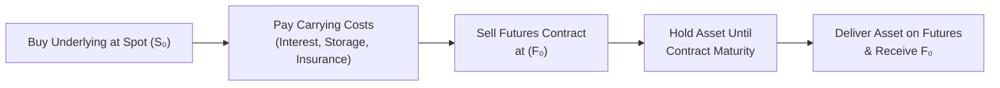

## 3.5 Cash and Carry Arbitrage

Cash and carry arbitrage is one of those classic strategies in derivatives that demonstrates just how efficient (or sometimes inefficient) markets can be. It’s the sort of thing you hear about in textbooks, where the theory goes: “Buy the spot asset, carry it, sell a corresponding futures contract, and—ta-da—walk away with basically zero risk and a guaranteed profit.” But does it really work that way? Well, sometimes it does, sometimes it doesn’t. And quite honestly, that’s half the fun of learning about it. Let’s explore this idea in detail.

### Introduction

Let me share a quick story: the first time I heard about cash and carry arbitrage, I was at a university seminar where a speaker compared it to, I don’t know, deciding whether to buy groceries now or later. If you knew for sure that your groceries would cost significantly more next week—and you had a way to store them without spoilage—why wouldn’t you just buy them now? Then you could commit to selling them at that higher price. The difference is that in finance, you can lock in these “sales” via a futures contract.

That’s effectively what cash and carry arbitrage is about. If the futures price is high enough relative to today’s spot price and any storage or financing costs, there’s a built-in profit. You buy the asset now in the spot market, pay any carrying costs (like storage and insurance for commodities or financing costs for stocks or bonds), and simultaneously sell a futures contract that promises delivery of the very thing you just bought when the contract expires. If the math works out, you lock in a risk-free profit at the outset.

### Key Components of Cash and Carry Arbitrage

Cash and carry arbitrage is typically broken down into distinct parts. Let’s try to keep it simple, step by step:

• Spot Purchase: You acquire the underlying asset right now. The cost is the spot price, S₀.  
• Finite Costs: You then “carry” or hold onto that asset until the futures contract expires. This means you might pay storage costs (if it’s a commodity) or financing costs (if you took out a loan to buy the asset). We often lump these into something we call “cost of carry,” which includes interest expenses, storage fees, insurance, and so on.  
• Futures Sale: Simultaneously, you sell a futures contract that obligates you to deliver this exact underlying asset at a specified future date. You set the futures contract price, F₀, which is supposed to reflect the forward value of the underlying.  
• Arbitrage Condition: The condition for a profitable cash and carry trade is that the futures price should be greater than the spot price plus all carrying costs. Mathematically, we might say something like:  

(1) F₀ > S₀ + C  

where C represents the present value of all carrying costs over the life of the contract. Another common expression uses continuous compounding, but let’s not drown in math just yet.  

• Delivery and Profit: On the futures expiry date, you deliver what you’re holding into the futures contract. Because you purchased the asset upfront and sold it forward at a higher locked-in price, you earn an essentially risk-free profit—assuming everything else remains the same.

It sounds straightforward, right? The neat thing is that whenever such a mispricing occurs, this trade exploits it and pushes the market back to efficiency. Because many arbitrageurs will jump on board, the futures price or the spot price adjusts and re-aligns, thereby erasing the discrepancy.

### A Simple Numeric Example

Suppose you notice that a particular commodity is trading in the spot market at CAD 100, and the one-year futures contract for that same commodity is at CAD 112. Let’s assume your carrying costs (interest, storage, and insurance) amount to CAD 10 for that year. This means the cost of buying and holding for one year is CAD 110 (spot plus carrying costs). If you can lock in a futures sale at CAD 112, you’d stand to make a risk-free profit of CAD 2 per unit.  

Here’s how you might do it in practice:

• Buy 100 units at the spot price of CAD 100 each, total outlay of CAD 10,000.  
• Finance the purchase with a one-year loan at 10% interest, plus pay CAD 0.50/unit in storage and insurance. Let’s guess it all adds up to CAD 10 per unit. So 100 units × CAD 10 = CAD 1,000 total carrying cost.  
• At the same time, sell 100 futures contracts (each covering 1 unit, for simplicity) at CAD 112.  
• At expiry, your total cost for the underlying is CAD 100 + CAD 10 = CAD 110 per unit. You deliver your 100 units against the futures sale and receive CAD 112 per unit from the buyer.  
• Your profit is CAD 2 per unit × 100 units = CAD 200, net of any transaction fees.  

If all goes well, you locked in a guaranteed CAD 200. You might say, “Wait, that’s not a fortune,” but in large institutional trades with thousands (or millions) of units, it can be quite substantial.  

### Visualizing the Steps

Sometimes words aren’t enough, so let’s try a small diagram illustrating the movement of cash and assets in a classic cash and carry arbitrage. Look at the flow from the start to the final delivery:

- At the outset, you simultaneously buy the asset in the spot market and sell a futures contract.  
- Throughout the carrying period, you pay any costs of storing or financing the asset.  
- Finally, at maturity, you deliver the asset to the futures buyer and collect the contracted price F₀.  

If F₀ > S₀ + carrying costs, there’s an inherent economic incentive to execute this trade until the market corrects itself.

### Cash and Carry in Practice

So, do people actually do this in real life? Absolutely—especially in commodity markets, but also with financial assets that can be easily stored or financed. Traders at large banks or hedge funds are on the lookout for these mispricings.  

But guess what? Perfect risk-free arbitrage in the real world is difficult. Transaction fees, bid–ask spreads, brokerage commissions, and margin requirements can eat away at that “guaranteed profit.” If your arbitrage margin is tiny, these frictional costs can obliterate the gains.  

### Regulatory and Market Considerations

In Canada, CIRO (the Canadian Investment Regulatory Organization) sets the oversight rules for investment dealers and margin guidelines. That means if you want to buy an asset on margin to do a cash and carry trade, you have to adhere to their margin requirements. For example, if you’re buying a commodity or a stock, you usually have to put up a certain percentage of the cost in cash or collateral. Likewise, if you’re selling futures, you have to post a performance bond (margin) that meets CIRO’s and the exchange’s rules.  

You might also have capital constraints—particularly relevant for large institutions. If you’re a proprietary trading firm or a hedge fund, your prime broker might impose capital charges or ask for additional collateral, which can erode the profitability of the trade.  

With all these constraints, even if you see a paper-based arbitrage opportunity, you need to think: “Is it big enough to overcome margins, fees, the cost of capital, and the execution risk of transacting in both spot and futures markets?” If yes, then the trade might be done quickly by numerous players, which will push the prices back into fair alignment.

### Role in Market Efficiency

Cash and carry arbitrage is an essential concept for understanding how markets self-regulate. When mispricing arises—say, a futures price that’s too high relative to the spot plus carrying costs—arbitrageurs jump in to buy spot and sell futures. As they do so, two changes happen:

• The spot price might go up due to increased buying.  
• The futures price might go down due to increased selling.  

Eventually, these forces bring futures prices back down closer to the fair value:  

F₀ ≈ S₀ + carrying costs  

In other words, the more people do this, the less the discrepancy. That’s why such riskless profits are generally short-lived in well-functioning, liquid markets.

### When Cash and Carry Fails

It’s not exactly that cash and carry fails, but there can be complexities that make the theoretical profit vanish:

• Storage Constraints: Maybe the commodity is tough to store (think: live cattle or perishable goods). Then you can’t just hold it for months without incurring huge costs or facing the risk of spoilage.  
• Logistics and Delivery: Even for storable commodities, shipping times or limitations on warehouse facilities can make it challenging to deliver on your futures contract.  
• Synthetic Replacements: Sometimes you can’t buy the real underlying asset (like a physical commodity) in large enough quantities, so you use proxies or related securities. That might introduce basis risk (mismatch between the proxy asset and the futures contract).  
• Unexpected Market Movements: Although the trade is set up to be “riskless,” sudden changes in interest rates, exchange rates (in the case of cross-border trades), or regulations can disrupt your plan.  

### Locking in a Profit

A big phrase in arbitrage is “locking in a profit.” It implies no directional price risk because you’re typically fully hedged: your spot position offsets your futures position. If the futures price falls, that’s offset by the appreciation in the asset you hold. If the spot price falls, that’s offset by your short futures position. However, you do face potential operational or financing risks. Still, in the classical sense, you’re protected from straightforward price risk—your biggest exposure is to the difference between the actual carrying costs you face and the carrying costs you estimated at the outset.

### Roll Over

Sometimes you can’t unwind right at the futures expiry. Or maybe you want to keep your strategy going, but the futures contract is near settlement. You might “roll over” your position. That means you close out your current short futures contract by buying it back (or letting it go to delivery) and enter a new, longer-term short futures contract. Meanwhile, you continue carrying the underlying asset. This rolling process can be repeated, but each time you do it, you incur transaction costs. So it only makes sense if, again, there’s enough mispricing to justify it.

### Illustrated Example with a Stock Index

Although cash and carry is often associated with commodities, it can apply to financial assets too. Let’s say you spot (pun intended) an index future on the S&P/TSX 60 trading higher than the cost of simply buying the underlying constituents in the market plus any dividends you expect to receive. So:

• You buy the basket of stocks in the S&P/TSX 60.  
• You pay financing costs (the borrowed cash can cost you 4% annualized, for instance).  
• You collect dividends from those stocks over the next few months (which reduce your negative carry).  
• You simultaneously short the index futures.  

If the price of the futures is above your net cost of carrying the index, the difference is a risk-free gain. By the time the futures expire, you deliver (or cash settle) that portfolio and pocket the difference. This is just another variation of the same principle.

### Real-World Constraints and Frictions

I sometimes joke that “arbitrage is easy—in Excel.” In real life, you have to factor in all kinds of frictions:

• Bid–ask spreads in both the spot market and the futures market.  
• Commissions or brokerage fees.  
• The cost of obtaining, storing, and insuring the underlying.  
• Potential slippage in execution if markets are volatile.  
• The margin requirements for both your long spot position (if you use leverage) and your short futures position.  

All of these reduce the potential profit or sometimes eliminate it altogether.  

### Canadian Regulatory Angle

In Canada, these trades are typically overseen by CIRO, which consolidated the roles of the former IIROC and MFDA. CIRO sets out margin rules and other best practices to ensure investor protection and market integrity. If you’re doing a big arbitrage trade, you can expect your dealing representative or compliance officer to verify you meet all the margin thresholds and adhere to reporting standards.  

For those wanting to know more about margin guidelines, check out the CIRO website at https://www.ciro.ca, which references how margin is calculated for futures positions and equities. If you are engaged in commodity cash and carry, you’ll also want to consult the relevant contract specifications on the TMX website (https://www.tmx.com/), because each commodity can have different storage, delivery, and margin rules.

### Practical Tools and Frameworks

If you’re exploring real arbitrage in a systematic way, open-source financial tools like Python’s “pandas” or “NumPy” libraries can help crunch large datasets and compare spot/futures prices in real time. You can build your own scripts to scan for arbitrage opportunities across multiple products. Keep in mind that you’ll also need real-time data feeds—usually not free—to do this effectively.  

You can find deeper academic or practitioner-level discussions of arbitrage in references like the following:  
• Chance, D. M. & Brooks, R. (An Introduction to Derivatives and Risk Management). This text offers in-depth coverage of all sorts of arbitrage strategies.  
• The TMX website for Canadian market-specific contract specs and trading hours.  
• Bank of Canada’s website for interest rate references to help with calculating financing costs.  

### Operational Tips

• Always account for your financing costs carefully. Overlooking even a small difference can erode your “riskless” profit.  
• Be mindful of dividend yields in equity-based cash and carry. Dividends reduce your net carry costs because they offset some financing.  
• In a rising interest rate environment, your carry cost might surprise you if you borrowed at a variable rate. It might wipe out your arbitrage margin if rates spike.  
• Commodity seasonality can cause big inventory swings. For agricultural products, you might see cheaper storage costs after harvest season, or vice versa.

### Final Takeaways

Cash and carry arbitrage is at the heart of how futures prices align with spot prices. By spotting when F₀ is clearly out of line with S₀ plus your carrying costs, you can theoretically lock in a profit. But real-world frictions, margin requirements, costs, and operational constraints make pure, riskless arbitrage less common than the textbooks might suggest. Nevertheless, it’s a vital concept for understanding pricing in futures markets. The moment an opportunity arises, professional traders often swarm in, quickly tidying up the mispricing and keeping markets efficient.

If you’re looking to become an arbitrageur (or just want to be the one at the dinner party explaining how it all works), then keep your eyes on the relationship between spot prices, futures prices, and carrying costs. It’s that simple—and that complicated—at the same time.  

### References and Additional Resources

• CIRO Rulebook & Guidance (https://www.ciro.ca) – For current margin and capital requirements.  
• TMX (https://www.tmx.com/) – For futures contract specs, listing details, and storage/delivery info.  
• Don M. Chance’s “An Introduction to Derivatives and Risk Management” – Comprehensive overview of derivative pricing and arbitrage mechanics.  
• Bank of Canada (https://www.bankofcanada.ca/) – For interest rate announcements and historical data.  

Anyway, that’s a wrap on the core idea of cash and carry arbitrage. It’s a concept that blends theory and real-world practicality, and underscores how markets stay honest through the tireless efforts of arbitrageurs.  

---

## Sample Exam Questions: Cash and Carry Arbitrage



### Which of the following best describes the core principle of a cash and carry arbitrage?

- [ ] Buy the futures contract now and carry it to expiration for delivery.  
- [ ] Buy the underlying asset now and purchase a put option to hedge.  
- [x] Buy the underlying asset in the spot market and simultaneously sell a futures contract above total carrying costs.  
- [ ] Sell the underlying asset short and roll over futures contracts every month.  

> **Explanation:** Cash and carry arbitrage involves purchasing the underlying asset (spot) and selling a futures contract if the price differential exceeds carrying costs.

### Which cost is generally included in “carrying costs” for a cash and carry strategy?

- [x] Storage expenses.  
- [ ] Dividends paid by the company.  
- [ ] The operating costs of the futures exchange itself.  
- [ ] Commission rebates from brokers.  

> **Explanation:** Carrying costs typically include storage, insurance, and financing expenses. Dividends are received (not paid) when you own the underlying equity, so they reduce net costs.

### In the context of cash and carry arbitrage, if F₀ (the futures price) is significantly less than S₀ (the spot price) plus carrying costs, how do arbitrageurs typically respond?

- [ ] They execute a cash and carry arbitrage.  
- [x] They do not execute a cash and carry arbitrage because there is no profit.  
- [ ] They hedge with options.  
- [ ] They forego any trade until the maturity date.  

> **Explanation:** A positive spread above carrying costs is necessary to lock in a profit. If the futures price is below S₀ + carrying costs, the classic cash and carry approach isn’t profitable.

### What primary role does cash and carry arbitrage play in market pricing?

- [ ] It guarantees permanent mispricing.  
- [ ] It drives the spot price and futures price further apart.  
- [x] It forces the futures price and spot price into alignment over time.  
- [ ] It has no effect on market efficiency.  

> **Explanation:** By exploiting mispricing, arbitrage traders narrow or eliminate the spread between the futures and spot markets, leading to a more efficient market.

### Which one of the following is a potential real-world challenge to executing a perfect cash and carry arbitrage?

- [x] High transaction costs.  
- [ ] Stable market prices with no volatility.  
- [ ] Knowledge of interest rates.  
- [ ] Minimal operating capital.  

> **Explanation:** While minimal capital can be an issue, transaction costs (including commissions, bid–ask spreads, and storage fees) are the most common practical obstacle to perfect arbitrage opportunities.

### To “roll over” a cash and carry position typically means:

- [ ] Buying a fresh spot asset to replace an old spot asset.  
- [ ] Closing the futures position early and taking losses.  
- [x] Closing out an existing futures position near expiry and initiating a new, longer-dated futures position.  
- [ ] Closing the entire arbitrage position and withdrawing capital.  

> **Explanation:** Rolling over involves replacing a maturing futures contract with a new one of a later expiry while continuing to hold (carry) the underlying.

### If a trader establishes a cash and carry arbitrage using stocks that pay dividends, what is the effect of those dividends on the carrying cost?

- [ ] Dividends always increase total costs.  
- [x] Dividends offset some of the carrying cost burden.  
- [ ] Dividends cause the futures price to rise sharply.  
- [ ] Dividends do not affect carrying costs in any way.  

> **Explanation:** Receiving dividends on the underlying assets helps reduce the net out-of-pocket costs, thereby enhancing the profitability of the cash and carry trade.

### Why is cash and carry arbitrage often challenging in the case of perishable commodities?

- [ ] Perishable commodities have no spot market.  
- [x] Storage and spoilage risks can increase carrying costs beyond the theoretical threshold.  
- [ ] There are no futures markets for perishable commodities.  
- [ ] Futures prices on perishable commodities cannot exceed spot prices.  

> **Explanation:** With perishable commodities, the risk of spoilage or rapid quality degradation significantly increases storage costs and complexity, making straightforward cash and carry less feasible.

### Which of the following statements about lock-in profit for a cash and carry strategy is most accurate?

- [x] It refers to removing directional price risk by holding a long spot position offset by a short futures position.  
- [ ] It refers to guaranteeing ongoing positive returns by re-entering new positions indefinitely.  
- [ ] It means using options to hedge any changes in interest rates.  
- [ ] It allows an investor to avoid margin requirements altogether.  

> **Explanation:** “Locking in a profit” refers to creating a combination of positions that neutralizes price moves in the underlying, ensuring the difference in spot and futures prices minus carrying costs is captured as profit.

### In an equity-based cash and carry arbitrage scenario, which factor might cause an unexpected loss despite the trade being theoretically risk-free?

- [ ] Changes in the stock’s dividend yield or the interest rate environment.  
- [x] Both changes in dividend yields and changes in interest rates.  
- [ ] Zero transaction costs.  
- [ ] Having a well-defined carry cost from the outset.  

> **Explanation:** If dividends turn out to be lower than expected or if interest rates rise beyond anticipation, the net cost of carry might increase, disrupting the initially projected profit.


