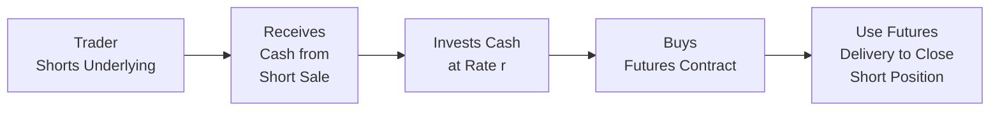

## 3.6 Reverse Cash and Carry Arbitrage

Sometimes, you look at the futures market and say, “Hey, that futures price is too low... can I somehow make an easy profit?” Well, reverse cash and carry arbitrage just might be the strategy you’re looking for. It’s the flipside of the standard cash and carry strategy and usually comes into play whenever the spot (or cash) price is higher than what you might expect from the futures price after factoring in all carrying costs. In other words, if futures look cheap relative to spot prices, there’s an opportunity to short-sell the underlying asset in the spot market, invest the cash proceeds, and then go long the futures contract. If all the sums line up just right, the payoff can be a near risk-free reward. 

But let’s not get ahead of ourselves. We’ll talk about the mechanics, the real-life constraints, and the key ways to monitor the trade. We’ll even get into a slightly informal vibe—like we’re chatting over a cup of coffee, okay? Along the way, we’ll check out references to the Canadian regulatory environment, mention how the Bourse de Montréal shares educational materials on these sorts of trades, and highlight the role of the Canadian Investment Regulatory Organization (CIRO) in overseeing margin guidelines, short-selling rules, and more. 

This discussion flows directly from earlier topics in this chapter on pricing of futures contracts. If you’d like a refresher on cost of carry, basis, and how standard cash and carry arbitrage works, circle back to Sections 3.1 through 3.5. But if you’re here to see how we do the reverse, buckle up.

### Understanding the Concept

Reverse cash and carry arbitrage is a strategy used when the futures market is in backwardation or trading at a price that is considered “too low” relative to the underlying spot price plus carrying costs. “Backwardation” typically means that near-term futures prices are higher than longer-term ones (so you see a downward sloping term structure), and yet the current futures price is sitting below the spot price once you factor in everything else (storage costs, financing, convenience yield, etc.). If that’s quite a mouthful, imagine it as: “Spot cost is expensive, but the futures contract looks like it’s on sale.”

Normally, in standard cash and carry, you’d buy the asset in the spot market, carry it (pay storage and insurance, for instance), and short the futures contract if the futures price is too high. Reverse cash and carry flips the script: you short-sell the asset at a high spot price, invest that capital, and buy the futures contract at a lower price. By the time delivery approaches, you can close out your short position using the futures contract you’ve gone long on. 

### Mechanics of Reverse Cash and Carry

It might help to lay out the steps in a bit more detail. Let’s say the underlying asset is a commodity—like gold, oil, or wheat. Though you can also do reverse cash and carry with financial assets like equity indexes or fixed-income instruments, physically delivered commodities have some interesting nuances because you’ve got to handle storage, shipping, and other logistics.

1. Short Sell the Underlying in the Spot Market  
   You begin by borrowing the underlying commodity from someone willing to lend it (think of a broker or other market participant), and then you immediately sell the borrowed commodity at the current market price. Let’s pretend you short-sell 100 ounces of gold at a spot price of CAD 2,000 per ounce. That means you get CAD 200,000 in proceeds.

2. Invest the Proceeds at an Interest Rate  
   Next, you take that CAD 200,000 and invest it. Maybe your local financial institution or short-term paper yields 3% annual interest. This is effectively a risk-free or near risk-free investment, depending on your institution and prevailing market conditions.

3. Go Long the Futures Contract  
   Meanwhile, you buy a futures contract on gold that matures around the same time you’ll need to return the borrowed commodity. Let’s say the futures contract is priced at CAD 1,980 per ounce.  

4. At Maturity, Close the Short Using the Delivered Asset from Futures  
   When the futures contract expires, you take delivery of the gold from your long futures position (or otherwise net-settle and buy the underlying as needed), then use that gold to return to the original lender. You then pocket the difference effectively locked in at the start of the trade (plus any interest earned), assuming no major frictional costs or disasters pop up in the middle.

For a tidy near-arbitrage profit, the numbers have to match up so that the cost of buying the futures plus any net interest you pay or earn on your short sale proceeds is less than the spot price you initially sold the asset for. 

### A Quick Numerical Example

Let’s put it all into a simple formula with hypothetical numbers:

• Spot price (S₀): CAD 2,000 per ounce  
• Futures price (F₀): CAD 1,980 per ounce  
• Risk-free interest rate (annualized): 3%  
• Time to maturity (T): 6 months (0.5 year)  
• Short-sell proceeds: S₀ × number of units  
• Borrow cost of the asset or any short rebate: … let’s assume zero for simplicity (in reality, you might pay a small borrowing fee, so plan for that)  

Step by step:

1. Short-sell 100 ounces of gold for 100 × CAD 2,000 = CAD 200,000.  
2. Invest CAD 200,000 at 3% annual rate for 6 months. The interest = 200,000 × 0.03 × 0.5 = CAD 3,000.  
3. Buy 1 gold futures contract that covers 100 ounces, priced at CAD 1,980 per ounce. At maturity, your cost to buy 100 ounces is 100 × CAD 1,980 = CAD 198,000.  
4. When the futures mature, you take delivery of 100 ounces of gold (paid for by your invested proceeds plus the interest). Then you return those 100 ounces to the lender.  

At the end, you’ve spent CAD 198,000 on the gold plus there might be minimal transaction costs. But after interest, you have CAD 203,000. So your net cost is CAD 198,000, and you have effectively CAD 203,000 from your original short sale proceeds plus interest. Subtract them, and you walk away with CAD 5,000. This is the essence of reverse cash and carry: if the futures price was “too low,” you locked in the difference as risk-free (or near risk-free) profit.

Of course, real markets have transaction costs, margin requirements, capital constraints, and “borrow fees” for shorting assets. So your final numbers might be trimmed down. Also, unexpected changes in the interest rate environment or supply/demand constraints for the commodity can come into play. So be cautious.

### Market Backwardation and Why It Matters

Reverse cash and carry is closely associated with backwardation, a market situation where the near-term futures price trades above longer-term prices. However, a commodity market can be in backwardation yet still not present a clear reverse cash and carry opportunity if the difference isn’t large enough once you account for the interest rates and potential storage or borrowing fees. 

Backwardation is sometimes impacted by immediate supply constraints (e.g., there’s a shortage now, so spot prices spike) and by ongoing expectations of supply easing in the future. If the spot price is significantly higher than the futures price, your short-sell now, buy futures later approach can make sense.

### Practical Constraints and Challenges

Now, let’s talk real life. Sure, on paper the strategy looks almost magical, but you often face a few speedbumps:

• Short-Selling Constraints  
If it’s a commodity with limited supply or one that is just plain tough to borrow, you might have a problem. Some precious metals, widely available in the financial markets, are easier to short. But for certain agricultural commodities, shorting physically might not be simple. In fact, you might have to pay a high borrowing fee or simply be unable to locate enough of it. 

• Storage and Insurance  
Even though in reverse cash and carry you start by shorting the commodity—and thus do not need to hold it yourself in the beginning—you eventually do have to handle or at least facilitate the transfer of the commodity at closing. This can create logistical headaches: Where do you store it if you take delivery from the futures? Who bears the cost or risk of short-term storage? In financial futures (like equity index futures), you skip a lot of these headaches, but you face margin constraints and interest rate considerations. 

• Fluctuating Interest Rates  
An interest rate can move. If you’re planning for 3% annualized but the rates drop significantly or your cost of capital changes, your overall calculations shift. This might cut into your profits or negate the arbitrage if you’re reliant on a certain interest yield. 

• Regulatory and Margin Requirements  
Especially in Canada, short-selling has margin rules under CIRO. These rules are designed to protect the market. You’ll likely face deposit requirements or extra capital charges. CIRO guidelines for futures positions also require you to maintain certain margins. This can tie up capital that might have been used for other ventures, so your effective returns can be lower. 

• Commodity-Specific Factors  
Some commodities have a “convenience yield,” which is essentially the intangible benefit of physically holding the commodity. A commodity that’s in short supply might trade with a large convenience yield—meaning the spot price could stay high relative to the futures price because people are willing to pay a premium for immediate possession. This sometimes complicates reverse cash and carry because, ironically, that convenience yield is also reflected in the cost of shorting or in the structure of the futures curve.

### Mermaid Diagram: Reverse Cash and Carry Flow

Below is a simple visual representation of how reverse cash and carry arbitrage might work over the trade’s lifecycle:

- Step A: Trader borrows and then shorts the asset, capturing the spot price in cash.  
- Step B: The trader has this cash on hand upfront.  
- Step C: That cash is invested to earn an interest rate.  
- Step D: Simultaneously, the trader establishes a long futures position at a lower price.  
- Step E: Upon expiration (or near it), the trader utilizes the newly purchased asset from the futures delivery to return the borrowed asset, closing out the short position.

If everything is done correctly and no big surprises happen, the difference in prices (plus interest earned) minus any fees is the trader’s profit.

### Canadian Regulatory Environment

While the mechanics of reverse cash and carry arbitrage apply around the globe, each jurisdiction has nuances. In Canada, the Canadian Investment Regulatory Organization (CIRO) is the self-regulatory body that replaces the defunct IIROC and MFDA. CIRO sets the rules for registered dealers and monitors short-selling activity, margin requirements, trade reporting, and more.

• Short-Selling Requirements  
  – CIRO rules require traders to identify short sales at the time of order entry and to confirm that the security (or commodity, if dealing with certain exchange-traded derivatives) can be borrowed.  
  – For example, if you’re shorting an equity or a deliverable bond in the Canadian market, you must ensure you have a “reasonable expectation” of obtaining the security to deliver. For commodities, you may need to prove your access to physical supply.  

• Margin Guidelines  
  – Both short equities and long futures positions carry margin requirements that can vary depending on the underlying asset’s volatility, liquidity, and your firm’s risk profile.  
  – The Bourse de Montréal publishes margin rates for different futures contracts. Meanwhile, CIRO has margin guidelines that your brokerage must follow.  

• Additional Engagement with Canadian Exchanges  
  – The Bourse de Montréal (often referred to simply as “the Bourse”) has an extensive array of educational resources on futures trading, including risk management best practices for trades like reverse cash and carry.  
  – If you’re looking for up-to-date info, check out the Bourse’s official site or CIRO’s website (https://www.ciro.ca) for guidance on margin rates, short-selling, or volatility considerations.

### Potential Risks: Why This Isn’t Free Money

Market participants love the idea of “risk-free” arbitrage, but dear friend, it’s rarely entirely free of risk. Real conditions can put a dent in your trade:

• Borrow Risk and Recall: For short-selling, your lender can recall the shares or commodity at inconvenient times. This can force you to buy it back at a less favorable price or scramble to find another source in the borrow market.  

• Funding Liquidity Risk: If you’re counting on a certain interest rate or specific lines of credit, changes in your liquidity or the credit environment might disrupt the trade.  

• Delivery Complications: Particularly in periods of market stress. Maybe your futures contract is physically settled, but supply chain disruptions can cause delayed deliveries.  

• Opportunity Cost: Tying up your capital for the entire duration for a small arbitrage gain might not always be the best use of funds, especially if other opportunities or strategies come along.

### Canadian Example: Reverse Cash and Carry with a GIC

Sometimes, in Canada, you might short-sell a publicly traded commodity ETF (like a gold ETF) rather than physical gold, if that suits your strategy. Suppose you short the ETF at a high price, put the proceeds into a Canada-guaranteed GIC paying a modest rate, and then go long gold futures on the Bourse de Montréal. If the gold futures are trading cheap compared to the spot price, your final locked in profit might look similarly positive. This approach can be simpler than physically shorting gold bars, but watch out for short-selling fees or the possibility that the ETF trades at a discount or premium to net asset value.

### Best Practices and Pitfalls

• Factor in All Costs: Don’t ignore borrowing fees, exchange fees, clearing costs, or any hidden costs that might pop up when your short sale is large.  

• Watch the Calendar: The timing of your futures expiry should match (or closely match) the date by which you need to return the asset. A mismatch can create basis risk or force you into partial coverage.  

• Keep an Eye on Volatility: If the market is extremely volatile, your margin requirements can spike, or the value of your short sale proceeds might be overshadowed by the capital calls on your futures position.  

• Stress Test Your Strategy: In a perfect world, everything lines up. In reality, commodity markets can be unpredictable, especially in times of economic stress.  

### Quick Personal Anecdote

A while back, I got excited about a possible reverse cash and carry in a small agricultural commodity. It was early spring, and apparently, the futures were pricing in a big harvest in the summer—so they were trading quite a bit below the current spot. I cooked up a plan to short-sell the commodity, invest the proceeds, and go long the cheaper futures. I thought, “Yes, free money here I come!” 

But guess what: trying to actually borrow enough of that commodity was tough. My broker told me: “Uh… you do realize there’s a massive shortage right now, right? It’s going to cost an arm and a leg to secure a borrow.” That soared my costs, basically eating up all the margin I might have gained. So while the plan was theoretically golden, the real-world constraints turned that trade into a no-go.

### Using Open-Source Tools to Evaluate the Strategy

With open-source financial libraries (e.g., Python’s pandas, NumPy, or R’s quantmod and TTR packages), you can run daily scans on futures vs. spot to see if a possible reverse arbitrage condition emerges. You can:

1. Pull real-time or daily data on spot prices and nearest futures quotes.  
2. Input your carrying costs, interest rates, and short-borrow fees.  
3. Automatically calculate the potential net profit or loss for reverse cash and carry.  
4. Incorporate probability assumptions for interest rate changes.  

This data-driven approach is a good idea if you trade frequently or if you’re a portfolio manager looking to integrate systematic arbitrage strategies. However, always double-check with your brokerage or clearing agent about the practicalities of shorting.

### Glossary Review

Short Selling: Borrowing an underlying asset (e.g., a stock, bond, or commodity) to sell it now, with the intention of buying it back later—ideally at a lower price—to profit from the price difference. In reverse cash and carry, short selling is how you obtain the underlying asset to sell in the spot market.

Backwardation: A market state where near-term futures prices trade above longer-term futures prices. If the backwardation is strong enough that the earliest futures contract’s price is below the spot price (minus cost of carry), a reverse cash and carry arbitrage can be profitable.

Inventory Constraints: When there’s a limited amount of a commodity or asset available to borrow or short, you face liquidity challenges and higher short fees. This can limit the feasibility of reverse cash and carry.

### Additional Resources & References

• CIRO (https://www.ciro.ca): For official guidelines on short-selling, margin requirements, and regulatory oversight in Canada.  
• Bourse de Montréal (https://www.m-x.ca): Provides in-depth tutorials and materials on how futures contracts behave, margin rules, and best practices in risk management.  
• Canadian Derivatives Clearing Corporation (CDCC) (https://www.cdcc.ca): Offers clearing and settlement infrastructure for options and futures, essential to understand margin offsets and netting.  
• Python’s PyFOL library: Examples of open-source code for analyzing futures arbitrage.  
• “Options, Futures, and Other Derivatives” by John C. Hull: Although somewhat global in scope, it’s a great resource for advanced academic coverage of arbitrage strategies.  
• “Investing in Commodity Markets” by Andrew Hecht: For a deeper look at practical commodity trading, including nuances of shorting.  

---

We’ve walked through the mechanics of reverse cash and carry arbitrage, the potential real-world obstacles, and we even tossed in a personal anecdote. At the heart of it: keep your eyes peeled for futures mispricings if you can short-sell the underlying and lock in a profitable difference. But always do your homework and abide by CIRO guidelines, or you might find your “risk-free” trade is riskier than you hoped.  

Now that you’ve had a thorough walkthrough, you’re probably ready to test your knowledge—or at least see how well you caught all the details. Check out the following practice questions to see if you’re on the right track.

## Sample Exam Questions: Reverse Cash and Carry Arbitrage



### Which market condition is most conducive to a reverse cash and carry arbitrage opportunity?
- [ ] When the spot price is below the futures price after accounting for carry costs.
- [x] When the spot price is above the futures price after accounting for carry costs.
- [ ] When the spot price and futures price are equal.
- [ ] When the spot price is perfectly correlated with interest rates.

> **Explanation:** A reverse cash and carry opportunity arises when futures are underpriced relative to the spot after carrying costs, meaning the spot price is effectively higher than it “should” be versus futures.

### In a reverse cash and carry strategy, which of the following best describes the initial steps?
- [ ] Buy the underlying commodity and buy a call option.
- [ ] Write the underlying commodity and short-sell a futures contract.
- [x] Short-sell the underlying commodity and go long a futures contract.
- [ ] Buy the underlying commodity and go short a futures contract.

> **Explanation:** Reverse cash and carry involves shorting the spot and going long the futures, which is the opposite of a standard “cash and carry.”

### What is one primary reason a trader may fail to execute a profitable reverse cash and carry arbitrage even if the market appears mispriced?
- [ ] High demand for the commodity.
- [ ] Changes in the stock market index.
- [ ] The Bourse de Montréal does not allow arbitrage trades.
- [x] Difficulty or high cost in borrowing the underlying commodity for the short sale.

> **Explanation:** Even if the mispricing looks great on paper, the costs or constraints of borrowing the underlying can often erode any potential arbitrage profit.

### Which of the following terms refers to a market situation where near-term futures prices are higher than longer-dated futures prices?
- [ ] Contango
- [x] Backwardation
- [ ] Arbitrage
- [ ] Convenience yield

> **Explanation:** Backwardation is when shorter-term futures trade at higher prices than longer-term contracts.

### What happens to your reverse cash and carry strategy if interest rates rise significantly during the holding period and you had planned on investing the short sale proceeds at a lower rate?
- [ ] Your initial plan remains unaffected because interest rates do not affect futures pricing.
- [x] Your strategy may become more profitable because you can earn higher returns on the short sale proceeds.
- [ ] Your strategy immediately becomes invalid, and CIRO cancels the trade.
- [ ] Your short sale proceeds will be taxed at a higher rate.

> **Explanation:** If you locked in a relatively low cost for the futures and you can invest at a higher interest rate, you might earn more from the proceeds of your short sale, improving your result.

### Which of these factors is most important when calculating the expected profit from a reverse cash and carry trade?
- [x] The interest earned on the short sale proceeds minus all borrowing and storage costs.
- [ ] The difference between the spot and futures in nominal terms only.
- [ ] The volatility of the underlying asset.
- [ ] The nominal GDP of the country.

> **Explanation:** You need to consider net interest and all costs to see if the trade yields a genuine arbitrage return.

### Snapshot: A trader shorts 200 shares of an ETF with a total spot value of CAD 10,000 and invests the proceeds at 2% annual rate for 6 months. The applicable futures contract is trading at a price 1% below the spot. Which best describes the essence of the transaction?
- [x] The trader earns the interest on the CAD 10,000 and buys futures at a discount to settle the short later.
- [ ] The trader invests the proceeds in a high-risk stock hoping to generate outsize returns.
- [ ] The trader immediately buys the underlying to hedge their short position.
- [ ] The trader locks in the difference between the 2% investment rate and a 3% borrowing rate.

> **Explanation:** Reverse cash and carry primarily focuses on earning interest from the short sale proceeds and then covering the short using the underpriced futures.

### Which of the following roles does CIRO play in relation to a reverse cash and carry arbitrage performed by a Canadian trader?
- [ ] Setting the price of futures contracts.
- [x] Overseeing and enforcing margin and short-selling regulations.
- [ ] Guaranteeing unlimited profits if the trade is valid.
- [ ] Providing physical storage facilities for commodities.

> **Explanation:** CIRO is Canada’s self-regulatory body overseeing investment dealers and has rules about short-selling procedures, margin, and other regulatory aspects.

### When might a commodity’s “convenience yield” disrupt the profitability of a reverse cash and carry trade?
- [x] When the convenience yield is high enough to maintain a large positive spread between spot and futures.
- [ ] When the convenience yield is zero.
- [ ] When the convenience yield is negative.
- [ ] When none of the parties are paying attention to interest rates.

> **Explanation:** A high convenience yield means spot holders gain extra benefits—keeping spot levels high relative to futures, which might undermine or complicate your reverse arbitrage.

### True or False: A reverse cash and carry arbitrage can be executed consistently without any risk involved.
- [ ] True
- [x] False

> **Explanation:** While it’s called an “arbitrage,” no real market strategy is entirely free of risk. Execution issues, borrowing constraints, fluctuations in interest rates, and more can introduce risk.


