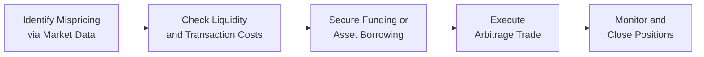

## 3.7 Conditions that Facilitate Arbitrage

Arbitrage, in simple terms, refers to the act of exploiting price discrepancies between different markets or instruments to generate risk-free (or near risk-free) profit. If you’ve ever seen a scenario where the same commodity is priced differently in two separate locations—or noticed that the price of a futures contract was slightly “off” compared to its fair value—then you’ve brushed shoulders with the concept of arbitrage. But these opportunities don’t just fall into place arbitrarily; certain market conditions must be present before one can capitalize on these fleeting mispricings. So, let’s roll up our sleeves and dig into what those conditions are, why they matter, and how they help to facilitate successful arbitrage in the futures realm.

Before we dive in, let me share a quick anecdote. Years ago, I was visiting Vancouver and found that some artisanal coffee beans sold at a premium in Toronto versus Vancouver. A friend of mine joked, “Why not buy a bunch here and sell it back home?” That was a lighthearted take on arbitrage in the real economy. In derivatives markets, we do something similar, but it’s more formal—driven by mathematical input and governed by financial regulations. Anyway, let’s jump in!

--------------------------------------------------------------------------------

### The Essence of Arbitrage in Futures Markets

Arbitrage in the context of futures involves buying a product (for example, a commodity or a financial instrument) in one market at a lower price and simultaneously selling it in another market (or a related instrument) at a higher price. The difference, after accounting for transaction costs, financing costs, and potential constraints, forms your arbitrage profit.

In Chapter 3 so far, we’ve touched on cash-and-carry and reverse cash-and-carry arbitrage. Those approaches illustrate how traders use the spot market, futures market, cost of carry, and short-selling or lending facilities to profit from small price mismatches. But you might be thinking, “When do these mismatches arise, and why don’t markets correct them right away?” It’s actually the presence (or absence) of certain market conditions that determines how quickly opportunities appear and vanish.

Let’s outline these conditions more concretely.

--------------------------------------------------------------------------------

### Sufficient Market Liquidity

#### What Is Liquidity?

In derivatives parlance, liquidity means you can quickly buy or sell large quantities of a contract without having to accept an adverse price. Or, more casually: you can get in and out of trades without too much fuss. The concept of liquidity is so central to arbitrage that we’ll place it at the top of our list.

Liquidity:
- Ensures that transactions can be executed promptly.  
- Lowers bid-ask spreads, which are a significant component of transaction costs.  
- Encourages participation from a wide range of market participants (market makers, hedgers, speculators, institutional investors).  

When liquidity is high, it’s simpler and cheaper for an arbitrageur to open simultaneous positions in the spot and futures markets. One reason is that you’re not forced to buy or sell at disadvantageous prices that might erode your profit margin. And if the profitability of the strategy depends on narrow price differences, every fraction of a basis point counts.

If liquidity evaporates, you might be stuck holding a position that you can’t unwind, or you could face higher trading costs that kill the profit in your trade. Picture an old, dusty antiques shop with only a handful of customers a week—imagine how tough it might be to flip items quickly for a profit. That’s precisely the problem in illiquid futures markets.

#### Market-Making Programs

Exchanges like the Bourse de Montréal often introduce market-making programs to maintain tight bid-ask spreads and sufficient depth in the order book. These programs can significantly boost liquidity. If you’re into reading official bulletins about how combined efforts from the exchange and market makers attempt to keep derivative products fluid, definitely check out the monthly bulletins from CIRO or the Canadian Securities Administrators (CSA).

--------------------------------------------------------------------------------

### Transparent Pricing and Low Transaction Costs

Transparent pricing is like that friend who always tells it like it is, cutting through the noise. In well-regulated futures markets, real-time quotes, order book data, and publicly available historical data enable arbitrageurs to identify mispricings quickly. Transparency thrashes the chances of clandestine or hidden markets where big players could exploit small participants.

Meanwhile, low transaction costs form the backbone of arbitrage feasibility. This includes:
- Brokerage fees.  
- Exchange fees.  
- Clearing fees.  
- The bid-ask spread.  

If fees are sky-high, any spread-based arbitrage profit shrinks or disappears. And if you think about those classic cash-and-carry trades, you realize how transaction costs in both the futures market and the underlying spot market can add up quickly. When costs are too high, the small differentials you intended to harvest can be gobbled up altogether.

> In my opinion, transaction costs can be the sneaky little gremlin lurking in the shadows of any great arbitrage plan. Manage them, or they’ll manage you.

--------------------------------------------------------------------------------

### Adequate Borrowing and Lending Facilities

Arbitrage strategies, especially the cash-and-carry or reverse cash-and-carry, require you to either borrow cash or the underlying asset (like a commodity or stock). Quick example:  
- In a standard cash-and-carry, you might borrow cash to purchase the asset, and then sell a futures contract to lock in your sale price.  
- In a reverse cash-and-carry, you borrow the asset (short-sell it) and buy a futures contract to close your position later.  

In both cases, you need robust and reliable lending or financing for the asset. If you can’t borrow the asset you plan to short, or if you can’t secure the funds at a reasonable interest rate, the entire trade might become financially untenable. The cost of borrowing might overshadow any potential profit. That’s why in major financial hubs—like Toronto, New York, or London—arbitrage is more common. Those places have advanced repo markets, securities lending markets, and robust prime brokerage services that let you borrow shares, commodities, or capital swiftly.

#### Example

Suppose you see a half-percent difference between the futures price (adjusted for cost of carry) and the expected spot price on gold. You’d like to deploy a cash-and-carry trade. However, if your broker’s interest rates are too high, the arbitrage profit quickly erodes. Alternatively, if it’s tough to borrow enough gold on the short side (or if the cost of borrowing gold is excessive), you might never realize that “risk-free” profit.

So, to keep the gears of arbitrage turning, the market should feature:
- Accessible securities lending for equities, bonds, gold, or whatever underlying is in question.  
- Low or competitively priced financing rates.  
- Efficient settlement and clearing processes that minimize the friction of borrowing.

When traders talk about the “cost of carry,” they bundle in storage costs (for commodities), financing costs (for capital), and sometimes convenience yields. If these costs are out of line with normal supply/demand dynamics—or if they fluctuate unpredictably—arbitrage may become harder to implement consistently.

--------------------------------------------------------------------------------

### Clear Regulatory Frameworks

#### The Role of CIRO

Regulatory frameworks, including those established by CIRO, can make or break arbitrage activity. Regulations encompass:
- Short-selling rules.  
- Hedging permissions.  
- Position limits.  
- Documentation and reporting.  

If you’re dealing with a futures contract on a Canadian exchange, you’ll find that CIRO sets many of the guidelines for how you can short-sell the underlying asset and what kind of margin or capital is required. They also specify rules to ensure market integrity, so that unscrupulous players can’t manipulate the market.

Since January 1, 2023, the defunct IIROC and MFDA have amalgamated into the new Canadian Investment Regulatory Organization (CIRO), which is now the main point of reference for regulatory guidance in Canada. By enforcing robust standards and providing clarity on permissible hedging, short selling, and margin requirements, CIRO fosters an environment in which arbitrage can thrive, but ethically and safely. The result is a double-edged sword: strict enough oversight to discourage manipulation but flexible enough for legitimate strategies.

#### Market Integrity and Transparency

Beyond short-selling and hedging, regulators also enforce transparency in trades, transaction reporting, and pricing data. If the rules were murky, or if there was a risk of trades not settling or clearing properly, no one would risk capital in large arbitrage trades. Essentially, trust in the regulatory environment is a cornerstone that fosters confidence in all market participants.

--------------------------------------------------------------------------------

### Availability of Market Data Feeds and Analytical Tools

Modern arbitrage is a data game. It’s like me scanning flight tickets across multiple websites to find the cheapest route—only a hundred times more complex. Real-time market data feeds, from both the exchange and third-party data providers, reveal price quotes, volumes, and time-and-sales snapshots.

#### Why This Matters

- Quickly Identifying Mispricing: If you can’t see the discrepancy quickly, someone else might get there first.  
- Algorithmic Trading: Many arbitrage strategies are now executed by automated algorithms. If the data feed is delayed or inaccurate, algorithms can’t respond to fleeting price discrepancies.  
- Verification of Fair Value: Analytical tools, often integrated into well-known trading platforms, let you compare “theoretical” futures prices to real-time quotes, factoring in cost of carry and implied interest rates.  

Whether you’re using open-source solutions (like Python with pandas, NumPy, or R-based analytics) or proprietary trading software, robust data is indispensable. Some traders subscribe to consolidated feeds that aggregate prices from multiple exchanges, ensuring that they don’t miss a single price tick that might indicate an arbitrage opening.

--------------------------------------------------------------------------------

### Practical Flow of an Arbitrage Strategy

Let’s put these conditions into a more visual perspective. Below is a simplified Mermaid diagram that outlines a generic arbitrage process. This is obviously simplified, but it helps illustrate how each stage depends on the conditions we’ve been discussing.

- A: You spot the discrepancy because the market data is transparent and easily accessible.  
- B: You verify that liquidity is sufficient and that transaction costs won’t kill your potential profit.  
- C: You confirm that you can borrow the underlying asset or secure enough cash at a reasonable rate.  
- D: You initiate the trade—buy or sell in one market and do the opposite in the corresponding market.  
- E: Once the discrepancy has resolved (or at the contract’s settlement), you close your positions and lock in your gains.

--------------------------------------------------------------------------------

### Best Practices, Pitfalls, and Common Challenges

1. **Overlooking Transaction Costs**  
   - Even a tiny oversight in commissions, financing rates, or spreads can turn a theoretical profit into a loss. Always incorporate these costs into your theoretical pricing model.

2. **Assuming Infinite Liquidity**  
   - Markets can be liquid on paper but might freeze up in times of volatility or crisis. For instance, certain commodity markets might look liquid until there’s a sudden supply shock.

3. **Regulatory Surprises**  
   - Rules can change, especially with instruments that are less commonly traded. Keep up to date with bulletins from CIRO and the CSA.

4. **Timing Risk**  
   - If your trades aren’t executed simultaneously or near-simultaneously, you could be exposed to price moves that erode your profit margin. Electronic trading platforms, direct market access, and algorithmic trading often help mitigate these lags, but you must be vigilant about execution speed and reliability.

5. **Operational and Settlement Risks**  
   - Even if everything looks good on paper, fail-to-deliver issues or administrative complexities in settlement can derail an arbitrage. Make sure your back-office operations are robust.

6. **Market Volatility**  
   - If volatility spikes, the price relationships you’re relying upon for arbitrage might see extreme fluctuations. Close monitoring is crucial to avoid incurring unexpected losses.

--------------------------------------------------------------------------------

### Canadian Context and Example

Let’s say an arbitrageur notices a mispricing involving S&P/TSX 60 Index futures listed on the Bourse de Montréal. The steps might be:
1. Purchase the basket of stocks (or a proxy like an ETF replicating the S&P/TSX 60) in the cash market.  
2. Simultaneously short-sell a corresponding S&P/TSX 60 Index futures contract.  
3. Make sure the borrowing costs, commissions, and spreads are all lower than the “profit spread” indicated by the mispricing.  
4. Consider the cost of carry until the futures contract expires.  
5. At expiry, or before if the mispricing corrects sooner, close the positions, capturing the difference (minus costs).  

In Canada, the new self-regulatory organization, CIRO, sets margin requirements for these trades. You’ll also want to cross-check relevant position limits and ensure you’re operating within Bourse de Montréal guidelines. If everything lines up, you pocket the difference.

--------------------------------------------------------------------------------

### Connecting the Dots with Other Topics

- **3.3 Cost of Carry**: Understanding cost of carry is critical in arbitrage. If you misjudge interest rates or storage costs, you could overestimate profit.  
- **3.5 Cash and Carry Arbitrage**: This section explained the mechanics. The conditions we’re discussing here are the scaffolding that make such a strategy feasible.  
- **3.6 Reverse Cash and Carry Arbitrage**: Reverse arbitrage flips the approach but relies on the same foundational conditions.  
- **7.1 Pricing of Options** (a different section entirely, but interesting to note): While we’re focused on futures here, the same general conditions hold if you attempt multi-instrument arbitrage or something involving options (e.g., put-call parity).  

--------------------------------------------------------------------------------

### Glossary

• **Liquidity**: The ease with which an asset (including a futures contract) can be bought or sold without significantly affecting its price. High liquidity is essential for low-cost, quick execution of large trades.  
• **Regulatory Frameworks**: The set of rules and guidelines—like those from CIRO or the CSA—that govern how trading is conducted. They ensure fairness, integrity, and orderly market functioning.  
• **Transaction Costs**: All costs associated with a trade, including brokerage commissions, exchange fees, bid-ask spreads, and other hidden costs (like slippage or financing).

--------------------------------------------------------------------------------

### Additional Resources

1. **CIRO Website**:  
   For ongoing regulatory updates, margin requirements, and official resources pertaining to derivatives trading in Canada, visit [https://www.ciro.ca](https://www.ciro.ca).  

2. **Bourse de Montréal**:  
   Check out [https://www.m-x.ca](https://www.m-x.ca) for information on derivatives listings, market-making programs, training modules, and more.  

3. **CSA Notices**:  
   The Canadian Securities Administrators periodically issue notices on market integrity, including transparency and transaction reporting. Recommended reading for staying on top of regulatory shifts.  

4. **Open-Source Tools and Analytics**:  
   - [Python.org](https://www.python.org) with libraries like pandas, NumPy, or SciPy.  
   - R-based libraries like “quantmod” and “TTR” for time series and technical analysis.  

5. **Academic Literature and Books**:  
   - “Options, Futures, and Other Derivatives” by John C. Hull for deeper theoretical coverage.  
   - “Futures, Options, and Swaps” by Robert Kolb and James Overdahl.  

--------------------------------------------------------------------------------

### Conclusion

Conditions that facilitate arbitrage in futures markets aren’t just random. We need high liquidity, market transparency, low transaction costs, proper access to borrowing facilities, and a robust regulatory framework—especially from CIRO—to maintain an environment where mispricings can be identified and exploited. Data availability and analytical readiness round out the list, allowing traders to react quickly when opportunities present themselves. We’ve all probably wondered, “Why doesn’t everyone just do this?” The answer is that not everyone can—these trades often require significant capital, technology, and an intimate knowledge of micro-market structure. But for those who can pull it off, the rewards can be enticing and relatively low risk.

From my vantage point, arbitrage is like finding that sweet discount coupon that not everyone else knows about. But as soon as the secret’s out, the discount goes away. That’s markets for you: once enough people figure out the loophole, the gap closes. So, arbitrage is self-correcting—it’s part of what keeps markets efficient. And ironically, by taking advantage of these opportunities, arbitrageurs do the market a favor, making prices more accurate for everyone else in the long run.

If you plan to explore arbitrage strategies, remember: check the liquidity, read the fine print from CIRO, and get your transaction costs in check. Good luck out there, and keep exploring ways to sharpen your approach to futures pricing!

--------------------------------------------------------------------------------

## Sample Exam Questions: Conditions that Facilitate Arbitrage



### Which factor is most critical to executing an arbitrage strategy successfully in a futures market?

- [ ] A lack of any regulations
- [x] High market liquidity
- [ ] Uniformly high transaction costs
- [ ] Absence of short-selling possibilities

> **Explanation:** Liquidity ensures quick entry and exit, minimal price impact, and is a cornerstone for capturing narrow price discrepancies.

### What role does transparent pricing play in arbitrage opportunities?

- [ ] It eliminates investment opportunities by increasing transaction costs.
- [x] It helps traders identify mispricings more quickly.
- [ ] It prevents short selling in most cases.
- [ ] It allows regulators to freeze markets on demand.

> **Explanation:** Transparent pricing reveals price discrepancies, making it easier for arbitrageurs to detect and exploit any misalignment in the markets.

### Which of the following best describes the impact of high transaction costs on arbitrage?

- [ ] They usually increase arbitrage profitability.
- [ ] They have no impact on arbitrage profits.
- [ ] They decrease incentive to engage in arbitrage.
- [x] They can erode narrow arbitrage spreads, negating profit.

> **Explanation:** Arbitrage often relies on small price differentials, so even moderate transaction costs can remove the profit margin, making the trade unviable.

### Why are adequate borrowing and lending facilities important for arbitrage strategies?

- [ ] They provide manual labor to execute trades.
- [x] They allow traders to borrow the underlying asset or capital at reasonable rates.
- [ ] They are exclusively used for day-trading rules enforcement.
- [ ] They only matter for large institutional players.

> **Explanation:** Many arbitrage structures (cash-and-carry or reverse cash-and-carry) hinge on being able to borrow or lend assets, ensuring all sides of the trade can be executed.

### How do regulatory frameworks like those from CIRO support arbitrage?

- [ ] By strictly banning all short selling.
- [x] By establishing clear rules for short selling, margin, and trading practices.
- [ ] By guaranteeing arbitrage profits through government subsidies.
- [ ] By removing all transaction costs for arbitrageurs.

> **Explanation:** Regulations from CIRO ensure that market conduct is orderly and legitimate, granting clear guidelines on short selling, permissible hedging, and reporting.

### Which of the following would NOT be considered a transaction cost?

- [ ] The bid-ask spread
- [ ] Brokerage commissions
- [ ] Clearing fees
- [x] The final settlement price of the futures contract

> **Explanation:** The final settlement price is part of the contract’s defined payout structure, not a fee incurred by the trader; the others are all explicit transaction costs.

### Which statement is true regarding the availability of market data feeds for arbitrage?

- [ ] Market data is generally unnecessary if you have insider information.
- [x] High-quality real-time data helps identify pricing discrepancies quickly.
- [ ] Arbitrage can only be done without data feeds.
- [ ] The best approach is to rely only on delayed data sources.

> **Explanation:** Arbitrage is time-sensitive, and real-time data is crucial to detect and exploit fleeting price disparities before they vanish.

### Which factor explains why arbitrage opportunities typically disappear quickly?

- [ ] Large institutional traders hide prices from the public.
- [ ] Regulations protect existing mispricings.
- [ ] Market makers intentionally widen bid-ask spreads.
- [x] Arbitrageurs exploit mispricings, causing prices to correct swiftly.

> **Explanation:** Arbitrage is self-correcting; once a mispricing is detected and exploited, supply and demand forces bring prices back into alignment.

### In a cash-and-carry arbitrage on a commodity, the arbitrageur typically:

- [x] Buys the commodity in the spot market and shorts a futures contract.
- [ ] Shorts the commodity in the spot market and also shorts a futures contract.
- [ ] Buys both the spot commodity and the futures contract.
- [ ] Waits for the interest rates to drop before taking any position.

> **Explanation:** Cash-and-carry arbitrage involves purchasing the underlying commodity (spot) and selling (shorting) the futures, profiting from the cost-of-carry discrepancies.

### True or False: Regulatory changes, such as a ban on short selling, would have no effect on arbitrage activity.

- [ ] True
- [x] False

> **Explanation:** Arbitrage often relies on the ability to short sell. A ban on short selling would severely hinder specific arbitrage strategies, limiting the market’s ability to correct mispricings.


