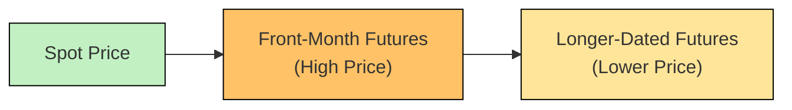

## 3.8 Inverted Markets

Imagine you’re at the grocery store, and there’s an unexpected shortage of your favorite cereal this week. If you buy it today, you might pay a premium because everyone wants it right now—yet the store might offer a “rain check” discount for delivery next month when supplies are replenished. In futures markets, a similar phenomenon exists when prices for immediate or near-term delivery of a commodity are significantly higher than prices for future delivery. We call this an inverted market (or “backwardation”).

Even though the conversation around inverted markets can get, well, a bit technical, we’ll walk through it step by step. We’ll define what inverted markets are, why they occur, and how hedgers and speculators respond. We’ll also look at potential pitfalls (like roll costs) and analyze how these markets can quickly revert to a more typical structure—nicknamed “contango”—as supply and demand dynamics evolve. By the end, you’ll hopefully feel confident discussing inverted markets without running for the cereal aisle in panic.

In the context of Canadian markets, it’s especially relevant to keep an eye on local supply disruptions (like in certain crops if a poor harvest season pops up) or abrupt shifts in demand (perhaps driven by winter energy needs in certain provinces) that can prompt short-lived but dramatic inversions. We’ll look at this through real-life examples and also connect you to official Canadian resources and references.

### Understanding the Meaning of an Inverted Market

An inverted market, or backwardation, exists when the front-month (near-term) futures contract price is higher than longer-dated futures contracts. Sometimes, you might see the near-term futures contract trading at a premium to the spot (current) market price—indicating how strong that immediate demand or shortage is. The hallmark is that the slope of the futures curve goes “downhill” as you move further out in time.

To illustrate this shape, let’s start with a simple hypothetical:

• Spot price of a commodity (say, crude oil) today: CA$80 per barrel.  
• 1-month futures contract for crude: CA$82 per barrel.  
• 3-month futures contract: CA$79 per barrel.  
• 6-month futures contract: CA$77 per barrel.

Notice the near-term contract is at CA$82, even more expensive than the current spot of CA$80. And the further you go into the future, the lower the price—CA$79 in three months, CA$77 in six months, etc. That’s an inverted forward curve.

#### Visualizing Backwardation

Below is a Mermaid diagram to help you conceptualize the slope of a backwardated curve versus a contango curve. A typical contango curve slopes upward, but an inverted curve slopes downward.

In the inverted scenario, the front-month futures block (B) is higher than the longer-dated contracts (C). In contango, we’d see the opposite: the near-month contract priced lower than the longer-dated ones.

### Why an Inverted Market Occurs

It often comes down to immediate supply shortages or an unusually robust wave of demand. Think about that grocery aisle: if the shelves are nearly empty, retailers might raise prices quickly to ration the scarce cereal. In commodity or financial futures:

• Weather events might disrupt supply (e.g., a drought leading to a poor wheat harvest).  
• Geopolitical tensions can cause a sudden drop in exports (e.g., a major oil exporter halting shipments).  
• Demand surges from an unexpected factor (e.g., a spike in home heating usage during an especially harsh Canadian winter).  

In any of these cases, users who absolutely need the commodity right now will pay a premium for immediate delivery, pushing the spot—and the near-month futures contract—above longer-dated prices.

### The Role of Roll Yield

When you hold a futures position over time, you may need to “roll” from the expiring contract into a new one dated further out. If the market is inverted, rolling a long position can be favorable because the longer-dated contract is cheaper. Conversely, if you’re short, rolling might be more expensive because you may be closing a high-priced contract and re-establishing a short at a lower price.

Traders often talk about roll yield in inverted markets. Roll yield represents the gain (or loss) that results from transitioning from one futures contract to the next. In a backwardated market, a long futures holder can lock in a “roll yield” if after selling the near-month contract at a higher price, they buy the next contract at a lower price. Of course, if the shape of the curve changes quickly (inversion softens or disappears), that advantage may vanish.

### Cost of Rolling Over Hedging Positions

If you’re using futures to hedge—say you’re a Canadian wheat producer looking to protect against falling wheat prices—an inverted market could mean that your near-term hedge is at a high price, which might be advantageous if you’re shorting the futures (you’re effectively locking in a higher sale price). But as that contract nears expiry, if you still need price protection, you’ll have to roll the hedge to a later contract. While the next contract might offer lower prices, the narrowing or reversing of the inversion could alter your hedging results. Understanding roll yield becomes important here, as the cost to roll forward can significantly impact your final profit or loss.

### Rapid Shifts to Contango

Here’s where I recall a personal anecdote: A few years ago, I was tracking an agricultural commodity that was in steep backwardation due to a rumored supply shortage. Everyone in the market was buzzing, “You can’t get this stuff anywhere, you better buy it now!” So the front-month futures soared. But almost overnight (okay, it was a few days, but it felt overnight), supply constraints eased—new shipments arrived, and the shortage fear subsided. Suddenly, the front-month contract tanked, realigning with further-dated contracts, and by the next month, the forward curve flipped to a more standard contango shape. It was a stark lesson in how quickly an inverted market can evaporate. 

So yes, inverted markets can shift on a dime to contango if:  
• The supply shortage is resolved (e.g., shipping lanes reopen).  
• Demand returns to historical levels.  
• New production data emerges, alleviating the immediate scarcity.  

Market participants who cling too long to positions without closely monitoring supply-demand fundamentals can be caught off guard, incurring substantial losses (or occasionally experiencing unexpected gains if they happen to be on the right side of the trade).

### Hedgers and Speculators in Inverted Markets

Hedgers  
• In an inverted market, producers or end-users might face a premium on near-term coverage. If you absolutely must hedge your immediate production or consumption, you might pay more in the early months but possibly benefit if you consistently roll short-dated contracts at successively lower prices.  
• You should also watch margin requirements set by the Canadian Investment Regulatory Organization (CIRO), which replaced IIROC and MFDA. CIRO typically adjusts margin guidelines based on volatility and contract specifics, so an inversion might heighten margin calls if prices become more volatile.

Speculators  
• Speculators might see inverted markets as an opportunity to capture roll yield. A trader could buy a near-month futures contract, hoping to sell it high and roll into a cheaper deferred contract—potentially booking a profit if the curve maintains backwardation.  
• Be prepared for abrupt changes in the curve structure. Rapid reversals can also cause a speculative strategy to fail if the exit timing is off.

### Practical Example of a Backwardated Market

Suppose you’re trading Western Canadian Select (WCS) crude oil futures, hypothetically:

• Spot price: CA$75 per barrel  
• 1-month futures: CA$78 per barrel (hefty premium due to pipeline shortages)  
• 3-month futures: CA$74 per barrel  
• 6-month futures: CA$73 per barrel  

A refiner that needs immediate WCS crude might scramble to secure supply for next month, accepting the higher price of CA$78. But let’s say that in two months, new pipeline capacity comes online, easing distribution constraints and quickly pulling the 1-month contract price back in line with or below CA$75. This shift could negatively impact anyone holding a long front-month contract without anticipating the supply improvement.

Meanwhile, a speculator who recognized the pipeline was set to open might have shorted that 1-month futures contract at CA$78, anticipating that once the pipeline expansions took effect, the near-month price would converge lower, yielding a speculative profit. This scenario shows how vital it is to keep an ear to the ground on market fundamentals.

### Key Considerations and Best Practices

Understand the Drivers of Inversion  
Stay up-to-date on why the market is inverted: is it a real supply shock, or simply short-term panic? Tools from the Bank of Canada (e.g., commodity price analysis and monetary policy reports) can be enlightening, especially for Canadian commodities. The Global Risk Institute also publishes risk management perspectives on energy and commodity markets.

Manage Roll Yield Proactively  
If you’re consistently rolling positions, assess the cost or benefit of that roll well in advance. The shape of the curve can change, so track the difference between the near-month and the next-month contract closely.

Watch the Regulatory Environment  
CIRO guidelines and margin requirements might become more stringent during highly volatile periods. Always check the Bourse de Montréal’s rule notices, since they can detail changes in position limits or margin rules for certain futures.

Stay Liquid and Diversified  
Insufficient liquidity or extreme volatility in an inverted market can translate into wider bid-ask spreads. If you’re not careful, you might end up paying significant transaction costs. Also, consider balancing your overall portfolio—don’t bet everything on a single short-term event!

Humility is Key  
Inverted markets often appear when it’s least expected, and they can vanish just as quickly. Even veteran traders can be caught off guard. Approach each position with an open mind, maintaining discipline about stop-loss levels and profit targets.

### Glossary

• Backwardation (Inversion): A market state in which near-month futures are priced higher than longer-dated futures. This can also mean futures trade below the spot price in severe cases.  
• Roll Yield: The gain or loss realized when an expiring futures contract is “rolled over” into the next contract, particularly notable in backwardation or contango markets.  
• Spot Premium: A premium on spot prices due to immediate scarcity or urgent demand needs.  

### Regulatory References and Additional Resources

• CIRO: Canada’s self-regulatory organization overseeing investment dealers and derivatives markets. Its official site, [https://www.ciro.ca](https://www.ciro.ca), provides guidance on margin rules, reporting requirements, and compliance bulletins.  
• Bank of Canada: The Bank of Canada’s [Commodity Price Analysis](https://www.bankofcanada.ca) provides insight into how supply and demand factors can shape price structures in agricultural, energy, and metals markets.  
• Global Risk Institute (GRI): Offers research papers on risks tied to inverted energy markets, hedging strategies, and resilience in the face of supply disruptions.  
• Open-Source Data Tools: Platforms like Alpha Vantage or Quandl (now part of Nasdaq Data Link) can help track real-time commodity and forward-curve data for free or at low cost.

### Concluding Perspectives

Inverted markets—though they sound ominous—are just another shape in the continually shifting tapestry of futures pricing curves. They arise when immediate supply constraints or bursts of demand elevates near-term prices. If you’re a hedger, you care about these short-term distortions because they might help you secure a more favorable hedge now or cause you to pay more than usual. If you’re a speculator, you might see a golden opportunity to benefit from roll yield—if you correctly anticipate how long the inversion will last.

But proceed with caution. When the panic subsides or the crisis abates, an inverted market can flip right back to contango. We’ve all seen these abrupt transitions—sometimes to our delight, sometimes to our dismay. Stay informed through resources offered by CIRO, the Bank of Canada, the Bourse de Montréal, and the Global Risk Institute. Keep your strategies flexible. And—just like waiting out a shortage at your local grocery store—sometimes a little patience and a watchful eye is the best approach in an uncertain marketplace.

---

## Sample Exam Questions: Inverted Market Fundamentals



### In an inverted market (backwardation), which comparison is typically true?

- [x] The near-month futures price is higher than the longer-dated contracts.
- [ ] The near-month futures contract is always cheaper than the spot price.
- [ ] Spot prices remain constant across the curve.
- [ ] There is no difference between spot and futures prices.

> **Explanation:** In backwardation, near-term futures trade at a premium relative to longer-dated contracts.  

### Which of the following might cause a market to become inverted?

- [ ] Excessive global supply.
- [x] Immediate shortage or disruption in supply.
- [ ] Strictly rising interest rates.
- [ ] Low open interest in the futures contract.

> **Explanation:** An immediate shortage or stronger-than-expected demand drives up near-month futures prices above longer-term contracts, creating an inverted market.  

### What is roll yield?

- [ ] The interest earned on cash collateral in a margin account.
- [x] The gain (or loss) arising from rolling over an expiring futures contract to a new one.
- [ ] A mandatory fee charged by the exchange for holding futures overnight.
- [ ] A penalty for delivering a physical commodity past the scheduled date.

> **Explanation:** Roll yield is the gain or loss realized when you sell your expiring contract and simultaneously buy a new one, influenced by the shape of the futures curve.  

### Why might a hedger be concerned about an inverted market?

- [ ] Inversion guarantees they will make a profit.
- [x] Rolling hedge positions from one contract to the next could involve material cost or benefit changes.
- [ ] They cannot close any positions during an inversion.
- [ ] Exchange fees double during backwardation.

> **Explanation:** Hedgers often need to roll positions if their exposure goes beyond the expiration of the near contract, so the cost or benefit (roll yield) is a key concern.  

### Which of these conditions most likely leads to a rapid shift from backwardation to contango?

- [x] Resolution of supply constraints.
- [ ] Continued shortage and panic buying.
- [ ] Strict government rationing policies.
- [x] Declining short-term demand.

> **Explanation:** If immediate supply constraints ease or if demand drops, a steep near-month premium can vanish, and the market can revert to a more upward-sloping curve (contango).  

### Spot premium in an inverted market typically signifies what?

- [x] Near-term scarcity driving up spot and front-month futures prices.
- [ ] A market in equilibrium with no pricing differentials.
- [ ] That more distant contracts are trading at a premium to the spot.
- [ ] Lower-than-expected interest rates impacting Spot-Futures parity.

> **Explanation:** Spot premium arises when there is intense demand or low supply, pushing near-term prices above typical market levels.  

### Which Canadian regulatory body provides guidelines and margin requirements for futures trading?

- [x] CIRO (Canadian Investment Regulatory Organization).
- [ ] IIROC (Investment Industry Regulatory Organization of Canada) for new accounts only.
- [ ] MFDA (Mutual Fund Dealers Association of Canada) for all derivative trades.
- [ ] CIPF (Canadian Investor Protection Fund) for derivatives margin rules.

> **Explanation:** CIRO now oversees investment and futures regulation in Canada following the merger of IIROC and MFDA. CIPF is an investor protection fund, not a regulatory body for futures margin.  

### How might a speculator attempt to profit from backwardation?

- [ ] By always shorting the commodity in the spot market.
- [x] By buying the near-month contract and selling it before expiry, then rolling into a cheaper longer-dated contract.
- [ ] By ignoring fundamentals and only trading technical indicators.
- [x] By going short when near-month prices are unsustainably high relative to longer months.

> **Explanation:** Speculators often attempt to capture rolling gains by capitalizing on the price discrepancy between near-month and further-dated contracts, or by shorting if they believe the unbalanced near-month price will fall.  

### What is one potential pitfall of relying heavily on backwardation to guide your trades?

- [ ] There are no pitfalls because the market cannot change shape quickly.
- [x] The market can switch to contango faster than anticipated, causing losses.
- [ ] Regulators forbid trading backwardated contracts.
- [ ] Transaction costs are always zero during backwardation.

> **Explanation:** The shape of the futures curve can shift rapidly if supply constraints resolve or demand diminishes, making previously successful strategies unprofitable.  

### True or False: A backwardated market can become contango if future demand expectations far exceed current consumption.

- [x] True
- [ ] False

> **Explanation:** If market participants expect higher demand in future periods while current demand remains moderate or met, prices for longer-dated contracts can rise, transitioning the market to contango.


