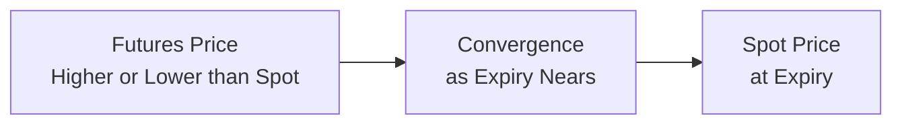
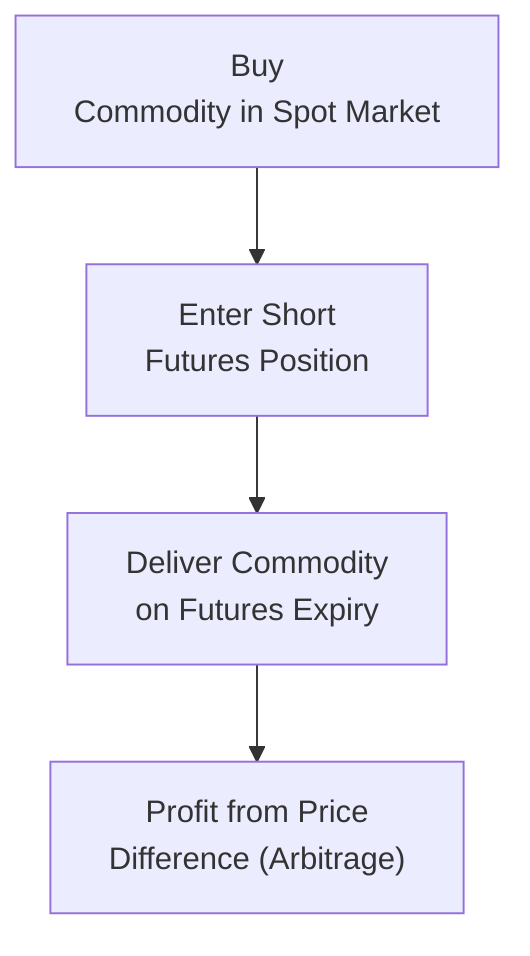

## 3.9 Convergence

If you’ve ever watched two people at an airport—maybe an old friend and a loved one—initially start out far apart but then walk toward each other until they finally embrace, you have an excellent analogy for a concept known as “convergence” in the futures market. As we approach a futures contract’s expiry date, the futures price and the spot (or cash) price of the underlying asset naturally gravitate toward each other. In other words, the difference between the futures price and the price in the cash (or spot) market tends to shrink as time runs out. This process—sometimes seamless, other times not—is critical for a well-functioning futures market. Let’s explore how convergence works, what drives it, what it looks like for both physically delivered and cash-settled contracts, and how regulators help ensure the process remains stable.

The idea might at first sound a bit abstract, so I’ll share this quick personal story. Years ago, I was learning about wheat futures by following prices daily, trying to see if speculators like me might profit from short-term moves. I noticed that as each futures contract inched closer to its delivery month, the gap between the futures and the actual wheat price from local markets started to melt away—almost like clockwork. That’s the heart of convergence: on the day a futures contract is set to expire, the contract’s price should ideally match the real-world spot price, or at least come really close to it. It’s basically the market’s final handshake, ensuring that the financial product (the futures contract) lines up with the economic reality (the spot price in the physical world).

Convergence is fundamental to the credibility of the futures markets, and, in Canada, it’s backed by robust oversight from the Canadian Investment Regulatory Organization (CIRO) and clearing services, most notably the Canadian Derivatives Clearing Corporation (CDCC). Let’s delve into the “why” and the “how” of this process.

The Concept of Convergence

Convergence simply means that as a futures contract gets closer to its expiry date, its price grows closer to the price of the underlying commodity or financial instrument in the spot market. On expiry, if the two prices don’t match, savvy traders or commercial players can exploit that gap via arbitrage. This tends to rapidly fix any persistent price discrepancy—assuming the markets function properly and there are no regulatory or logistical barriers.

One standard way to capture the idea of convergence in mathematical terms is through the cost-of-carry model, which assumes:

(1)  

F_0 = S_0 \, e^{rT}


Here:  
• F₀ = Current futures price at time 0  
• S₀ = Spot price at time 0  
• r = Risk-free rate (constant)  
• T = Time to expiry (in years)  

As T → 0 (i.e., time to expiry becoming very small), the exponential term e^(rT) → 1, and F₀ converges to S₀. Although this formula is an idealized representation (it assumes no market frictions, perfect storage, and so on), it highlights why the difference between futures and spot prices shrinks over time. In physical commodity markets with storage and other costs, we may see variations of this formula that incorporate convenience yield, storage fees, or other cost-of-carry elements. But the basic principle remains the same—futures are expected to converge to spot.

Physical Delivery and Convergence

In physically delivered futures (like certain energy products, grains, and even some metals), holders of long positions nearing expiry can opt to take delivery of the actual commodity, while holders of short positions have the obligation to make that delivery. If a future is trading far above its spot price around expiry, anyone can just buy in the cash market more cheaply and deliver it through the futures contract, pocketing arbitrage profit. On the flip side, if the future is trading far below the spot price, a trader can buy the futures contract cheaply, take delivery, and sell in the spot market for a higher price. This arbitrage opportunity forces prices to align.

When everything works well, no one has to do any complicated math to ensure the “airport arrival scene” has a happy ending—market participants do it naturally while chasing risk-free profit. The convergence becomes self-reinforcing. However, if, for instance, physical delivery is disrupted by an unexpected event (say, a pipeline shutdown for energy commodities or a strike at a major shipping port), it can slow or hinder the convergence mechanism. This type of short-term dislocation might lead to unusual price distortions. But generally, the promise of physical delivery (with the supporting clearinghouse or exchange rules) keeps the system honest, ensuring futures don’t stray too far from reality as the clock ticks down.

Cash Settlement and Convergence

But what if a contract pays out in cash rather than requiring physical delivery? You might be thinking, can that still converge? The answer is yes, absolutely—just in a slightly different manner. Cash-settled futures rely on a reference index or a final settlement price that tracks the current spot price of the underlying. For example, equity index futures in many markets, including those on the S&P/TSX 60 in Canada, converge to the level of the index on the final settlement day. On that day, your profit or loss is based on the difference between the futures price at which you entered and the official settlement value. 

Arbitrage still sits at the core of the process. If the index futures are trading at a premium to the index itself, arbitrageurs can short the futures and go long in the actual stocks that make up the index, eventually locking in that premium—and vice versa if the futures are trading at a discount. By the time the contract expires, the difference must be tiny, or else the arbitrage is a free lunch. Exchanges incorporate settlement formulas designed to match the underlying’s actual trading or index level to “completely flatten out” or “crush” any difference by expiry.

Here’s a small diagram to illustrate the concept:

In this chart, we see the futures price starting either above or below the spot price. As time flows from left to right, the two lines meet (converge) by expiry. If that didn’t happen, folks who notice the discrepancy would arbitrage it away—taking advantage of the difference—until the prices come back together.

Why Lack of Convergence Might Happen

Now, every once in a while, you’ll see market watchers get alarmed if they suspect a “lack of convergence.” Typically, a breakdown in this mechanism can imply:

• Market Dysfunction. Perhaps there are too many logistical tangles, artificially restricting the means for delivery or settlement.  
• Default Risk. If counterparties (like major producers or large trading firms) begin to signal that they can’t deliver or can’t pay, market participants shy away from arbitrage.  
• Price Reporting Issues. In the case of an index or a reference price used in settlement, if the data feed is erroneous or manipulated, the final settlement might not line up.  
• Regulatory Constraints. If regulations impede certain arbitrage transactions or create cost barriers that are too high relative to possible returns, then the price discrepancy can persist longer than usual.

As a real-life example: There was a period in some commodity markets when storage constraints (e.g., not enough storage for oil) caused bizarre price movements. In April 2020, WTI crude oil futures in the U.S. famously went negative due to a combination of extremely limited storage capacity and pandemic-induced demand collapse. Although that’s an extreme and rare scenario, it does highlight how extraordinary market conditions can affect convergence.

CIRO and Regulatory Oversight

In Canada, the Canadian Investment Regulatory Organization (CIRO) supervises investment dealers and sets out guidelines intended to support fair and efficient markets, including futures trading. On the clearing and settlement side, organizations like the Canadian Derivatives Clearing Corporation (CDCC) (https://www.cdcc.ca/) ensure that physical-delivery futures or options—and even certain cleared swaps—are carried out with minimum friction and robust risk management. By maintaining strict requirements on margin, daily marking-to-market, and default risk control, they help keep everything in line. If you’re new to futures and want to see how the clearing process practically works, the CDCC website provides documentation on settlement procedures and guidelines around margin and default management.  

Let’s say you’re worried about the difference in price between the futures and spot markets for a certain energy commodity. CIRO guidelines would require your dealer (through which you’re placing trades) to abide by standards of client disclosure, transparency, and best execution. If you’re a commercial hedger, you might also have certain regulatory reporting requirements for large positions. All these factors encourage a stable environment in which arbitrage can happen smoothly, so that the final day of trading sees little or no discrepancy between the futures price and the real-life underlying.

Case Study: Convergence in Agriculture

Take wheat futures listed on major exchanges, for instance. In Canada, domestic wheat is influenced by both local and global supply-and-demand factors. As a futures contract on wheat nears expiration, local grain elevators and commercial buyers monitor prices. If the future trades below the spot price but they hold a short position in the futures, they could close out their short by purchasing the cheaper futures while selling in the spot market at a higher price, or even deliver their physical grain if that’s part of their operational strategy. This arrangement is a textbook example of how commercial producers and end-users naturally converge the markets via real delivery. Because participants actually rely on the physical commodity in their day-to-day business, the price on expiry rarely strays far from local or globally benchmarked spot prices. 

Common Pitfalls in Convergence

1. **Storage Limitations:** If you can’t store the commodity easily, carrying it forward in a profitable arbitrage strategy might not be straightforward.  
2. **Liquidity Issues:** Some physically delivered contracts may have lower liquidity, limiting the ability of arbitrageurs to operate at scale.  
3. **Transportation Bottlenecks:** Logistics matter. If it’s expensive or complicated to move a commodity to the delivery point, the cost can reduce or even eliminate the arbitrage opportunity.  
4. **Credit and Margin Requirements:** If margin is set too high or credit lines are frozen, it’s harder for traders to engage in the transactions that keep futures and spots in line.

A Quick Practical Example

Imagine a gold futures contract is trading at $1,925/oz, but the spot price is at $1,900/oz a week from expiry. The cost of storing and insuring gold for a week is minimal compared to this $25 difference. An arbitrageur can buy physical gold at $1,900 in the spot market (assuming they can quickly source it), simultaneously sell the futures at $1,925, deliver the acquired gold into that futures contract upon expiry, and profit from the difference minus transaction and carry costs. As more market participants spot the same opportunity, the gold futures price should fall or the spot price might rise—ending with both around the same level come expiry day.

Diagrams and Visual Aids

It can be helpful to visualize how these pieces fit together in a process flow. Here’s a simple diagram (in Mermaid.js) illustrating the chain of events in a physical delivery scenario:

In this chart, you can see that the opportunity for risk-free or near risk-free profit (assuming negligible transaction costs) fosters the convergence of the futures price to the spot price. If that difference never closed, then everyone and their neighbor would try the same trick, eventually erasing the profit margin.

Glossary

Convergence: The process in which the futures and spot prices for a commodity or financial instrument come together as the futures contract approaches expiration.  
Physical Delivery: Settling a futures contract by delivering the actual underlying commodity.  
Cash Settlement: Settling a futures contract based on a reference spot price or index level rather than physical delivery.  

Canadian Regulatory Context

• CIRO has integrated oversight that aims to ensure free and fair markets, requiring investment dealers and market participants to follow strict conduct and disclosure rules.  
• The CDCC is the clearing entity that sets margin requirements and provides an infrastructure so that physical delivery or cash settlement goes smoothly. This mechanism is crucial for ensuring that convergence can take place, because it lowers counterparty risk and fosters trust.  
• Additional rules in place require certain large traders or commercial hedgers to report positions (especially if they exceed a specified threshold). This transparency keeps regulators informed about who holds large positions and can help them watch for potential manipulative activity that might disrupt convergence.

Further Resources

• CIRO (https://www.ciro.ca) – Canada’s national self-regulatory body overseeing investment dealers, mutual fund dealers, and market integrity across Canadian equity and debt marketplaces.  
• Canadian Derivatives Clearing Corporation (CDCC) (https://www.cdcc.ca/) – Resource for clearing and settlement procedures in Canada, as well as margin requirements and default management processes.  
• Bourse de Montréal (https://www.m-x.ca/) – For information on Canadian futures and options products and their specific listing details.  
• Various open-source financial libraries (like QuantLib) can help you model convergence and arbitrage. These tools can be used to run your own pricing and spread analysis on futures vs. spot markets.

Concluding Thoughts

Convergence is more than just an academic concept—it’s the beating heart of the futures market. Without it, hedgers couldn’t rely on futures contracts as a genuine risk management tool, and speculation would be overshadowed by too much chaos and uncertainty. As you learn to interpret and anticipate convergence, you’ll discover how fundamental it is to any trader, risk manager, or commercial market participant. 

Personally, the first time I realized how smoothly it usually plays out, I remember thinking something like: “Wow, these markets really do keep each other honest.” Whether you’re dealing in physically delivered commodities like wheat or oil, or trading cash-settled futures on stock indices or interest rates, keep an eye on that spot–futures gap. It’s an ongoing dance that shows how real-world supply and demand eventually ties together with financial instruments—no matter how chaotic the intermediate steps might be.

## Sample Exam Questions: Convergence in Futures Markets



### Which best describes convergence in the context of futures markets?

- [ ] The alignment of interest rates among central banks.
- [x] The tendency of futures prices to move toward the spot price as the contract nears expiry.
- [ ] The process of averaging multiple futures contracts into one final settlement.
- [ ] The alignment of multiple currency pairs against the Canadian dollar.

> **Explanation:** Convergence is the classic phenomenon where futures prices come closer to the underlying spot price at or near expiration.

### What is one primary reason physical delivery reinforces convergence?

- [x] Because market participants can deliver or receive the underlying, profiting from any discrepancy.
- [ ] Because the exchange forces arbitrage trades on all market participants.
- [ ] Because regulators set a fixed price for the underlying at expiry.
- [ ] Because physical delivery is optional only for financial institutions.

> **Explanation:** In physically delivered contracts, if futures deviate significantly from spot, traders can deliver or take delivery of the actual commodity to lock in an arbitrage profit, thereby pushing futures and spot prices together.

### Why might a cash-settled futures contract converge to the spot price at expiration?

- [ ] Physical delivery ensures the underlying commodity is always available.
- [ ] Spot prices have no effect on cash settlement.
- [x] The final settlement calculation is based on the underlying spot or index value at expiry.
- [ ] Margin requirements become zero at expiration.

> **Explanation:** Cash-settled contracts use a formula referencing the spot or index value at expiry, bringing the futures price in line with that final value.

### Which of the following could signal a market dysfunction regarding convergence?

- [x] A persistent price gap that doesn’t close as expiration nears.
- [ ] A high correlation between futures and spot prices.
- [ ] Increased open interest a month before expiry.
- [ ] A stable and continuous alignment of futures and spot prices.

> **Explanation:** If the price gap remains wide near expiry despite opportunities for arbitrage, it can indicate serious issues like credit constraints, delivery problems, or liquidity shortages.

### What is the role of the Canadian Derivatives Clearing Corporation (CDCC) in facilitating convergence?

- [x] Providing clearing and settlement services that reduce counterparty risk.
- [ ] Setting corporate dividend schedules for underlying stocks.
- [ ] Dictating international shipping standards for commodities.
- [ ] Guaranteeing that futures always trade at a discount to spot markets.

> **Explanation:** CDCC ensures that both sides of a trade fulfill their obligations, which is crucial to maintaining the confidence required for the convergence process to function.

### How does physical delivery encourage arbitrage if the futures price is lower than the spot price?

- [x] Traders can buy cheap futures, take delivery, and sell in the spot market at a higher price.
- [ ] Exchanges automatically adjust the futures price to match the spot price.
- [ ] No arbitrage is possible under such a scenario.
- [ ] Traders can use high leverage to increase their returns, bypassing the need for arbitrage.

> **Explanation:** When the futures price is lower, an arbitrageur can buy the futures contract, take physical delivery, and sell at the higher spot price, locking in risk-free (or close to risk-free) profit.

### What might be a reason convergence fails in certain markets?

- [ ] Futures traders are always on vacation.
- [ ] Low margin requirements increase volume.
- [x] Transportation or storage bottlenecks make delivery or arbitrage difficult.
- [ ] Government subsidies keep spot prices artificially high or low at all times.

> **Explanation:** When transporting or storing a commodity is extremely costly or nearly impossible, even a noticeable price difference might not induce arbitrage, leading to delayed or absent convergence.

### Which statement about the function of arbitrage in convergence is correct?

- [x] Arbitrage exploits discrepancies between futures and spot prices, bringing them closer together.
- [ ] Arbitrage increases discrepancies by driving futures prices further from spot prices.
- [ ] Arbitrage only applies to physically delivered commodities, not cash-settled contracts.
- [ ] Arbitrage is an illegal market activity prohibited by CIRO.

> **Explanation:** Arbitrage is fundamental in driving the convergence process by exploiting the profit potential from discrepancies, thereby pushing the two prices together.

### If a futures contract is cash-settled, what typically happens at expiry?

- [x] Positions are settled using a formula based on the spot or index price.
- [ ] The futures price remains fixed from the prior trading session.
- [ ] Traders must submit proof of commodity ownership.
- [ ] The contract is automatically rolled over to the next month.

> **Explanation:** Cash settlement typically involves referencing a final index or spot price at expiry. The difference between that reference price and the futures entry price determines the gains or losses.

### True or False: Lack of convergence can indicate potential issues like market manipulation or extreme illiquidity.

- [x] True
- [ ] False

> **Explanation:** When natural forces of arbitrage fail to bring futures and spot prices together, it can indeed reflect deeper market dysfunction or manipulation.


