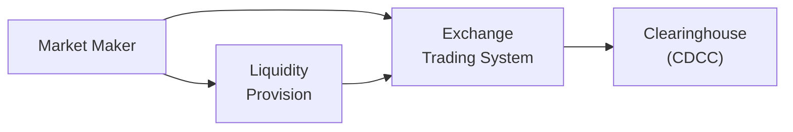

## 30.1 Obligations of Market Makers

Market makers have a unique and vital role in the options marketplace. They’re like the friendly neighbors that always have an extra cup of sugar on hand—except in this case, it’s the liquidity they always have ready for traders. Without market makers, many options could end up being thinly traded, leading to wider bid-ask spreads and higher transaction costs for everyone. In Canadian markets, the Bourse de Montréal has specific requirements that market makers must follow; and at a higher level, the Canadian Investment Regulatory Organization (CIRO) supervises prevailing rules to ensure these participants maintain a fair and orderly market.

Below, you’ll find key insights into what it means to be a market maker, along with a glimpse into the obligations, regulations, and everyday challenges these players face. We’ll talk a bit about quoting obligations, risk management, margin requirements, technology, compliance pitfalls, and so on. By the end, you’ll have an extensive understanding of how market makers fit into the bigger picture of Canadian derivatives trading.

### What Is a Market Maker?

A market maker is typically an individual or a firm that simultaneously posts bids (buy prices) and asks (sell prices) for a particular security—in our case, an option contract. The objective is to provide enough liquidity to give counterparties a fair and efficient trading experience. Market makers earn the bid-ask spread as compensation for offering the service of immediate order execution. 

I remember walking onto a trading floor on a particularly volatile day—everyone was tense, squinting at their screens, but the market makers were the calmest folks around. They had systems that adapted in real-time, adjusting quotes as prices whipped around. Trust me: being a market maker means having to remain steady and confident under pressure.

### Quoting Obligations

Exchanges like the Bourse de Montréal typically impose quoting obligations on official market makers. For instance, they have to ensure:

• Two-sided quotes (both bid and ask prices) are readily available for a large portion of the trading session.  
• They maintain a certain minimum quote size, so that there’s enough volume available at the quoted price.  
• They keep the quoted bid-ask spread within a specified maximum range, ensuring that traders receive competitive pricing.  
• They remain in the market for a defined percentage of the trading day (e.g., 85% or more), so that the liquidity is steady and reliable.  

These rules aren’t arbitrary. If market makers quoted sporadically and with huge spreads—well, that’d be like going to a store that only sells groceries once a week and charges three times the usual price. Nobody wants that. Regulators and exchanges watch these obligations closely, and persistent deviation can lead to penalties or a loss of market-making privileges.

You’ll often see different “tiers” of market maker programs. Maybe Tier 1 participants enjoy fee reductions or other perks, but in return, they hold stricter obligations (tighter spreads, larger minimum sizes, etc.). Tier 2 participants have somewhat looser obligations but fewer benefits. Each exchange organizes these tiers differently, so be sure to review each program’s guidelines in detail.

### Regulatory Framework

In Canada, market makers must comply with the regulations established by CIRO and the Bourse de Montréal’s Rulebook. These regulations are crafted to promote:

• Fair and Orderly Markets: All trading must be transparent, with minimal manipulation or unjustified price movements.  
• Investor Protection: Position limits, margin requirements, and mandatory capital coverage aim to reduce harm to individual investors.  
• Market Integrity: Reporting obligations, such as real-time quotes and daily position reporting, allow regulators to keep watch for anomalies or potential misconduct.  

Under CIRO’s umbrella, registered investment dealers who assume the role of designated market makers have an additional layer of compliance and capital adequacy standards. Essentially, if you’re recognized as a market maker, you can’t just vanish when the market grows dangerous or the phone calls get too frequent—or you’ll be out of the role quicker than you can say “tight spreads.”

If you’d like to explore more about Canada’s national regulatory framework, take a look at National Instrument 23-101 Trading Rules from the Canadian Securities Administrators (CSA). And for the official exchange perspective, the Bourse de Montréal Rulebook (https://www.m-x.ca/) is absolutely a must-read for up-to-date guidelines about market-making responsibilities.

### Market-Making Tiers and Incentives

Exchanges quite often create formalized incentives and distinct programs to reward market makers who consistently offer narrower spreads, deeper liquidity, or both. Here’s where things can get interesting:

• Rebate Structures: A market maker might receive rebates on trading fees if they exceed certain volume thresholds, or if they hold quotes at exceptionally tight spreads.  
• Revenue Sharing: Some marketplaces share a fraction of transaction fees with market makers who achieve top-tier obligations.  
• Reduced Market Data Costs: The exchange might discount fees for the real-time market feeds that market makers need to effectively do their job.  

On the flipside, failing to meet performance benchmarks—such as quoting obligations for the majority of the trading session—can result in losing these benefits.  

### Risk Management and Technology

When I first observed a market maker’s workstation, I was struck by the multitude of software windows: real-time data feeds, pricing models, automated quoting engines, and risk dashboards beeped and flashed relentlessly. Market makers rely on sophisticated technology, not only to quickly submit quotes but also to adjust those quotes in milliseconds as market conditions fluctuate. 

They typically use:

• Algorithmic Quoting Tools: These tools calculate fair value in real-time and instantly update bid-ask quotes based on changing market data.  
• Risk Engines: Tools that measure real-time exposure across multiple strikes and maturities, giving the market maker an at-a-glance picture of how much they stand to lose if the market moves ten points in the wrong direction.  
• Execution Management Systems (EMS): Specialized platforms that handle large amounts of order flow and route trades to the exchange efficiently.  

Let’s bring in a quick illustration to see how technology and risk management tie together:

In this simplified diagram, the Market Maker (A) provides real-time quotes to the Exchange Trading System (B). Completed trades flow to the Clearinghouse (C)—in Canada, that’s often the Canadian Derivatives Clearing Corporation (CDCC). Meanwhile, the Market Maker’s algorithms (D) keep adjusting quotes to ensure continuous Liquidity Provision based on risk metrics and up-to-date market info.

### Collateral and Capital Requirements

Market makers bear the responsibility of efficiently managing collateral (cash, short-term treasury bills, or other high-liquidity assets) to honor margin requirements. If you’re always on the hook to buy or sell options, you’d better be prepared, financially speaking.

Margin requirements ensure there are enough funds to cover potential losses if market movements go awry. CIRO sets minimum capital and margin rules for all type of regulated firms, including those engaged in advanced derivatives trading. And the Bourse, through its clearing corporation, can also impose margin calls when daily mark-to-market swings exceed allowable thresholds.

• Keep Liquid Assets: Market makers must keep a healthy supply of easily convertible assets (cash or treasury bills) to meet margin calls without resorting to firesales of illiquid holdings.  
• Monitor Intraday Exposure: Because large trades or sudden volatility spikes can drastically alter exposures, intraday risk monitoring is critical.  
• Stress Tests: Market makers often run stress tests to see how their positions would hold up in extreme scenarios, ensuring they maintain an adequate buffer of capital.

### Compliance Considerations

Maintaining compliance with market-making obligations can be just as demanding as the actual quoting function. The Bourse de Montréal and CIRO expect:

• Timely Position Reporting: Large positions must be reported promptly, ensuring regulators can monitor for potential market manipulation and compliance with position limits.  
• Adherence to Exchange Rules: This includes abiding by permissible cross and facilitation order regulations, and ensuring large trades are executed without creating undue market disruption.  
• Monitoring for Conflicts of Interest: Market makers often manage positions on behalf of multiple clients or affiliates, which can create potential conflicts. Strict internal policies and disclosures are typically required.  

A personal rule of thumb I’ve heard from a market maker: “When in doubt, document everything.” It might sound a bit paranoid, but robust, transparent recordkeeping can make all the difference if regulators begin asking tough questions about your trades or quoting patterns.

### Best Practices and Common Pitfalls

It’s worth discussing a few best practices for market makers—and a few pitfalls that might keep them up at night:

• Align Quoting with Market Conditions: A rigid quoting system that never recalibrates to sudden volatility can result in uncomfortably large exposures, or uncompetitive quotes.  
• Maintain Real-Time Risk Visibility: If your system lags, or you frequently discover that your exposure is far larger than expected, you’re in for a rollercoaster ride nobody wants to be on.  
• Prepare for Extreme Events: Flash crashes, halts, and major news announcements can sweep in and cause chaos. Having a plan to scale back or widen quotes in extreme conditions is essential.  
• Avoid Overtrading: Overzealous participation can eat up capital or generate losses if the market is trending violently against you.  

### Practical Example

Let’s say you’re the designated market maker for a set of at-the-money equity options on a Canadian blue-chip company. Suddenly, that company announces news about a merger—it’s big, unexpected, and the stock price whipsaws up and down. During this turmoil:

• You must maintain continuous two-sided markets for these options, within the allowable max spread, even though the underlying share prices are seesawing by the minute.  
• Your technology stack instantly recalculates the implied volatility, the fair value for the calls and puts, and updates your quotes.  
• Your risk engine decides the maximum number of contracts you can buy or sell without exceeding position limits or margin constraints.  
• You might need to expand your spreads if volatility spikes to avoid an outsized risk. However, you can’t go beyond the maximum spread threshold established by the exchange’s rules, so you have to find that workable middle ground.

### Additional Resources

To deepen your knowledge about market makers, quoting obligations, and the regulatory frameworks that shape them, consider the following resources:

• Bourse de Montréal Rulebook: https://www.m-x.ca/  
• CIRO (Canada’s SRO): https://www.ciro.ca/  
• National Instrument 23-101: Trading Rules, published by the Canadian Securities Administrators (CSA)  
• QuantLib (https://www.quantlib.org/) for open-source pricing & risk management models  
• Options as a Strategic Investment by Lawrence G. McMillan (a classic resource on managing and hedging option positions effectively)

If you want a thorough academic foundation, you might explore graduate-level finance courses specializing in market microstructure. Many universities in Canada and abroad offer advanced curricula on algorithmic trading and HFT strategies. And if you’re big on self-paced study, online education platforms often have specialized modules on market making, quoting engines, or even leadership skills for a trading floor environment.

---

### Glossary

• **Market Maker**: A firm or individual providing continuous bids and asks in a particular security or set of securities to ensure liquidity and orderly price discovery.  
• **Quoting Obligations**: The requirements for market makers to maintain two-sided (bid and ask) quotes for a specified percentage of trading time, with minimum sizes and maximum permissible spreads.  
• **CIRO (Canadian Investment Regulatory Organization)**: Canada’s national self-regulatory organization that oversees investment dealers, mutual fund dealers, and related marketplace activity, ensuring compliance with securities laws and best practices.  
• **Liquidity**: The ease with which a security can be quickly traded without significantly affecting its price.  
• **Margin Requirements**: Obligations set by regulatory bodies and exchanges dictating the minimum amount of collateral needed to cover potential losses on trading positions.  
• **Bid-Ask Spread**: The difference between the highest price a buyer is willing to pay (the bid) and the lowest price a seller is willing to accept (the ask).  
• **Fair and Orderly Market**: A market situation achieved when trading is efficient, transparent, and free from manipulation or unjustified price distortion.  
• **Position Limits**: Regulatory-imposed maximum exposures in a security or group of securities designed to prevent excessive speculation and market manipulation.

Remember, being a market maker is about more than just posting quotes; it’s about committing to the integrity of the marketplace, providing stability in tumultuous times, and operating with robust, real-time risk management. It might be stressful, but few roles in the trading world are as dynamic and rewarding.

## Sample Exam Questions: Market Maker Obligations in Options Trading



### As a market maker, what is the primary purpose of maintaining continuous two-sided quotes?

- [x] To provide liquidity and facilitate fair price discovery in options markets
- [ ] To inflate the bid-ask spread
- [ ] To limit the trading activity of retail investors
- [ ] To meet position limits more easily

> **Explanation:** Market makers post both bid and ask quotes to ensure that the market operates smoothly, allowing traders to buy or sell without delay and limiting transaction costs.

### Which of the following best describes the role of a market maker under CIRO’s regulatory framework?

- [x] Continuously providing competitive quotes in the marketplace
- [ ] Focusing solely on proprietary trading with no obligation to quote
- [ ] Only facilitating large institutional block trades
- [ ] Reporting to the clearinghouse once a year

> **Explanation:** Under CIRO rules, registered investment dealers designated as market makers must quote widely and continuously to maintain market liquidity and stability.

### What is an example of a quoting obligation that exchanges like the Bourse de Montréal often impose on official market makers?

- [ ] Charging additional fees to retail investors
- [ ] Only posting quotes in a single option series per underlying
- [ ] Providing one-sided (bid only) quotes
- [x] Maintaining maximum allowable bid-ask spreads and minimum quote size

> **Explanation:** Market makers are typically required to keep their quotes within certain spread limits and provide a certain size of contracts, ensuring the liquidity is meaningful and prices are fair.

### From a risk management perspective, why do market makers usually rely on real-time algorithmic quoting tools?

- [x] To instantly recalculate fair value and adjust bid-ask quotes as market conditions change
- [ ] To obscure their true positions from regulators
- [ ] To reduce the number of trades executed per minute
- [ ] To comply with manual exchange order entry rules

> **Explanation:** Market makers must adapt to fast-changing market data. Algorithmic quoting engines allow for speed and precision, leading to more accurate and consistent pricing.

### Which of the following represents a key capital requirement for market makers?

- [ ] Constantly maintaining short positions in all listed options
- [x] Keeping sufficient liquid collateral to meet margin calls
- [ ] Relying exclusively on unsecured credit from counterparties
- [ ] Posting no collateral unless specifically requested by the exchange

> **Explanation:** Market makers must maintain a cushion of liquid collateral—often cash or treasury bills—to handle margin calls from adverse price moves.

### If a market maker consistently fails to meet minimum quoting obligations during peak trading hours:

- [ ] They receive additional tax benefits from the government
- [x] They risk losing their official market-making status or facing exchange penalties
- [ ] Their obligations automatically reset after 60 days
- [ ] Their broker covers any potential fines

> **Explanation:** Market makers face disciplinary action, including the possibility of losing privileges, if they do not meet the obligations set by the exchange.

### How do position limits help maintain a fair and orderly market in options trading?

- [ ] They allow only high-frequency traders to trade significant volumes
- [x] They constrain the maximum exposure one entity can hold, deterring manipulation or overly speculative behavior
- [ ] They make it illegal to short sell options
- [ ] They are used solely for marketing purposes to attract retail traders

> **Explanation:** Position limits ensure no single participant can gain outsize influence, mitigating the risk of cornering or undue market influence.

### Which statement is true regarding market-maker participation during high-volatility events?

- [ ] Market makers are exempt from quoting obligations when volatility is high
- [x] Market makers often widen their bid-ask spreads but still remain active to provide liquidity
- [ ] Market makers automatically suspend quotes to reduce risk
- [ ] Market makers must quote smaller sizes than usual

> **Explanation:** Even in volatile conditions, market makers must continue providing liquidity, though they may adjust (widen) their spreads to compensate for the increased risk.

### Which of the following best characterizes the function of a clearinghouse (e.g., CDCC) in relation to market makers?

- [ ] It executes trades on behalf of market makers
- [x] It guarantees performance of trades and enforces margin requirements
- [ ] It sets tax regulations for option contracts
- [ ] It supplies proprietary trading algorithms for all market makers

> **Explanation:** The clearinghouse stands between buyers and sellers, ensuring that trades will settle properly and enforcing margin requirements to control credit risk.

### True or False: Market makers under CIRO can ignore capital adequacy rules if they have a robust risk management system.

- [x] False
- [ ] True

> **Explanation:** CIRO capital adequacy rules apply to all registrants, including market makers. No level of internal risk management replaces the mandatory regulatory capital requirements.


