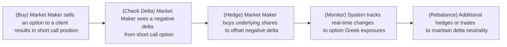

## 30.2 How Market Makers Reduce or Eliminate Their Exposure

Imagine you’re standing in the middle of a bustling fruit market (bear with me here). You’ve promised to buy apples from anyone who wants to sell them and sell apples to anyone who wants to buy them—all at a fair price. Now, you might end up with way too many apples or, sometimes, none at all. Meanwhile, the price of apples is constantly shifting throughout the day. This scenario captures the essence of a market maker’s life—except, instead of apples, they deal in options and other derivatives, with prices changing by the second. And that’s why controlling risk (or “exposure”) is so darn critical.

In this section, we’re focusing on the specific ways market makers reduce or eliminate their exposure to avoid huge, unexpected losses. This process often involves sophisticated techniques like delta-hedging, gamma adjustments, and advanced real-time monitoring. We’ll break it down step by step so you can see how real-world market makers stay afloat in choppy waters.

Before we dive in, let's highlight several important concepts (some appear in our Glossary below), like inventory risk, delta, gamma, beta, and net capital requirements. If these terms feel a bit abstract, no worries—we’ll demystify them and show how they work in everyday market-making scenarios.

---

### The Core Idea: Why Hedge?

First, a quick note on what hedging is all about—especially “delta-hedging,” which you might hear tossed around on trading desks. Hedging, in the simplest sense, is taking an opposing position to offset potential losses from another position. Market makers aren’t (generally) in the game of making big price bets; rather, they want to collect the bid-ask spread by consistently offering to buy and sell. But in doing so, they accumulate positions—a short call here, a long put there, maybe some futures on the side. If left unhedged, these positions could become a monstrous liability in the event of a sharp market move.

That’s where the concept of delta-neutrality comes in. We’ll define delta in more depth in just a moment, but for now, think of it as how much the price of an option is expected to move given a small change in the underlying asset. By hedging the overall portfolio deltas, a market maker tries to ensure that small changes in the underlying market price won’t wipe out their profits.  

---

### Inventory Risk & the Need to Hedge

When you own apples, you face the risk that apple prices might drop. That’s inventory risk—except in financial markets, the “inventory” is a stack of option positions. A market maker could be exposed to all kinds of price swings due to holding a mixture of calls and puts, on possibly dozens of underlying assets, across multiple expiration dates.

Without careful hedging, a quick market downturn could slam you with losses if you’ve sold a bunch of calls (which have negative deltas). Or a sudden upward spike might squeeze your short put positions. This inventory risk is central to what market makers do every single day: providing liquidity while preventing their inventory from going sour, so to speak.

---

### A Quick Glossary Refresher

• **Inventory Risk:** The possibility of losses due to holding an inventory of securities or derivatives that can shift in value at any time.  
• **Delta-Hedging:** Offsetting the price risk of an option by taking an opposing position in the underlying asset or a correlated instrument.  
• **Gamma:** The rate of change in an option’s delta as the price of the underlying moves.  
• **Beta:** A measure of an asset’s (or a portfolio’s) volatility relative to a broader market.  
• **Risk Limits:** Pre-set thresholds (both at the firm level and required by regulators) that limit overall exposure.  
• **Short Sales:** Selling a security or derivative not yet owned, often used to hedge or speculate on price declines.  
• **Net Capital Requirements:** Rules ensuring a firm maintains enough liquid assets to meet obligations to clients and counterparties—especially relevant when we talk about exposures.  

---

### Understanding Delta: The Helmsman of Hedging

Delta is sometimes called the “first derivative” of an option’s price with respect to the underlying asset’s price. That’s a fancy way to say delta measures how sensitive an option’s price is to small changes in the underlying. And for a market maker juggling a dozen or more option classes, each with multiple strikes and expiries—well, it’s kind of the primary compass setting.

• **Positive Delta:** You gain if the underlying price goes up.  
• **Negative Delta:** You lose if the underlying price goes up (or you profit if it goes down).  

A market maker who has sold (or “written”) a lot of call options might have a large negative delta. To hedge, they’ll typically buy the underlying stock (which has a +1 delta per share) or purchase futures contracts, aiming to bring their net delta toward zero.

#### A Small Delta Example

Let’s say a market maker is short 100 call options on XYZ stock. Each option has a delta of +0.50. So effectively, that position has a total delta of -5,000 (because the market maker is short the call, the sign is negative: short ∙ +0.50 delta/option ∙ 100 contracts ∙ 100 shares/contract = -5,000). If they do nothing and XYZ stock price rises, they’ll have losses. To offset that negative delta, the market maker could buy 5,000 shares of XYZ. Because each share has a +1 delta, the resulting position is now closer to delta-neutral overall.

---

### Dynamic & Real-Time Hedging

Of course, delta never sits still. As the day progresses and the underlying price dances around, the deltas of options change too—this is driven by gamma. So market makers must keep adjusting (“dynamic hedging”) to remain delta-neutral. Plus, they’re constantly entering or exiting new positions by posting bids and offers for clients, which further alters their exposures.

Most sophisticated market-making desks utilize real-time systems that capture every trade, reprice the entire portfolio promptly, and recalculate the total greeks (delta, gamma, vega, theta...). Then they can quickly execute offsetting trades to keep risk within pre-determined thresholds. You might see a flurry of buy and sell orders in the underlying security or index futures as they scramble to keep everything balanced.

Here’s a small snippet of how a typical flow might look, using a mermaid diagram:

In a matter of seconds, the market maker sees that the newly sold short call has added, say, -1,000 deltas. They’ll likely buy 1,000 shares of the underlying stock to neutralize that. Then if the market shifts and gamma pushes that delta to -1,200, they might grab another 200 shares to rebalance. It’s a constant loop of “Monitor → Adjust → Monitor → Adjust...”

---

### Gamma Exposure & the Challenges of Large Market Moves

Gamma is basically the second derivative. It tells you how much your delta will change when the underlying price changes. A position with high negative gamma will see large swings in delta if the market moves. Think of negative gamma as a position that forces you to buy high and sell low to stay hedged. That’s obviously not ideal, but sometimes it’s the cost of doing business if you’re collecting option premiums.

If you anticipate a very volatile market session—maybe a big economic announcement is coming out—your approach to gamma might change. Market makers might aim to reduce overall gamma exposure so they don’t get whipsawed by major price swings. They can do this by trading options of different maturities or using spreads and combinations to flatten out gamma.  

---

### Multi-Derivative Hedging Strategies

Some sophisticated desks go beyond stock or futures to hedge. They might enter a short call spread or buy put spreads if that offers a better hedge for a specific structure. They might also incorporate interest rate futures, currency forwards, or correlated assets in the case of cross-border trades. Remember the concept of beta? Sometimes, if you can’t get your hands on the exact underlying, you might buy or sell a correlated asset with a certain beta to the underlying—and then adjust the size accordingly.

Let’s say a market maker can’t easily locate shares of a small-cap stock they’re dealing with. They might choose to hedge by taking a position in an index future that has a moderate correlation (or “beta”) to that stock. It’s not a perfect hedge, but it can help partially offset the risk until the underlying shares become available.

---

### Balance Sheet & Risk Limits

Let’s step away from the fruit market analogy for a moment. In the real world, market-making firms have a finite balance sheet. They’re only willing to hold so many deltas, so many gammas, or so much margin exposure before they say, “Enough.” These are the firm’s risk limits, and they usually come with real-time triggers. If a market maker gets close to a limit (e.g., a certain net delta limit or a maximum capital allocation for margin), they might have to drastically trim positions.

Failing to respect these limits isn’t just a polite no-no—it can get you in trouble with your boss, your firm’s risk managers, and even regulators. CIRO (Canadian Investment Regulatory Organization) sets net capital requirements for dealers in Canada, ensuring they’re adequately capitalized. If you blow past your risk limits by accident (or by being reckless), you might face forced liquidation of positions or other serious consequences.

#### Historical Anecdote

Once, I was on a trading desk where a big corporate news announcement was rumored. Everyone was piling into short puts on a certain stock. Suddenly, the rumor broke out earlier than anticipated, the stock soared, and guess what? The short puts turned out to carry significant positive delta, which actually was beneficial. But in the confusion, folks missed the moment to revise gamma hedges for the next wave of price moves. Although we ended up with a net profit, the subsequent whipsaw caused all sorts of jitters, and risk limits were almost breached. My takeaway: real-time monitoring matters—a lot.

---

### The Role of Automated Systems & Algorithms

Modern risk management relies heavily on algorithms that monitor exposures in real-time. These systems track everything from underlying price movements to implied volatility changes to interest rate shifts—updating the theoretical values of each derivative in the portfolio. Whenever exposures cross a preset risk threshold, the system alerts the trader or automatically executes offsetting trades.

This kind of advanced infrastructure doesn’t come cheap, but it’s essential for large-scale market makers dealing with thousands of contracts each day. Without it, you’d be flying blind in a storm.

---

### Regulatory Overview (Canadian Context)

From a Canadian regulatory perspective, CIRO enforces strict guidelines on how members can manage and report derivatives exposures. It sets minimum net capital requirements that ensure participants have enough cushion to absorb routine losses. Meanwhile, the Canadian Derivatives Clearing Corporation (CDCC) provides the clearing infrastructure, deciding margin requirements on futures and options to reduce systemic risk.

- **CDCC Website (https://www.cdcc.ca/):** A treasure trove of info on margin guidelines and clearing details.  
- **Bourse de Montréal’s Courses:** Often in partnership with the Canadian Securities Institute (CSI), these courses dig deep into real-time hedging tactics for various derivatives.  
- **National Instrument 31-103:** Lays out registration requirements, including operational and capital standards that keep dealers in line.  

Staying compliant with these regulations is non-negotiable; failing to do so can lead to fines, trading suspensions, or worse. 

---

### Example: Hedging a Retail-driven Spike

Let’s paint a scenario. Suppose a Reddit forum is buzzing about stock ABC. Retail interest surges, and you, as the market maker, get flooded with buy orders for near-term call options. As you fill these orders, you’re short a mountain of call options. Your negative delta is through the roof. The implied volatility also starts skyrocketing.

Step-by-Step Actions:  
1. **Delta Check:** You quickly measure the net short call exposure. Let’s say it’s -25,000 delta.  
2. **Immediate Hedge:** You buy 25,000 shares of ABC to get back to near-zero net delta.  
3. **Gamma Consideration:** Because these calls are near-term and near-the-money, your negative gamma is quite high. You monitor intraday price variance. If the stock moves up another 5%, your short calls get deeper in the money, adding more negative delta.  
4. **Volatility Play:** You might also purchase some cheap out-of-the-money calls or puts (or a combination) to offset changes in implied volatility.  
5. **Risk Limit Check:** If your capital usage to buy shares starts exceeding internal budgets (or if the margin requirements spike), you might partially hedge in index futures or cut back the quotes you post to the market (i.e., widen your spreads) to reduce new incoming orders.  

---

### Example: Using a Spread to Hedge Gamma

Suppose you’re short gamma on a particular stock option. One way to moderate that gamma is to buy a call spread or a put spread, effectively limiting the range in which you suffer from negative gamma. For instance, if you’re worried about large upward moves, you might buy a call spread at a higher strike. That’s less capital-intensive than buying calls outright, and it caps your worst-case scenario if the market surges.

---

### Balance Sheet & Liquidity: Another Puzzle

Remember, every time you buy shares to hedge short calls, you tie up your cash or margin. If you’re forced to buy a ton of shares in a fast-rising market, your margin usage can spike. This can become a real constraint, especially on days of heightened activity (like big earnings announcements).

A best practice is to maintain a comfortable liquidity buffer. This ensures that if you need to put on a quick hedge, you won’t be stuck searching for more capital. Some large market-making firms also have central “delta desks” that manage hedging across multiple underlying assets, thereby netting out correlated exposures and freeing up capital.

---

### Keeping an Eye on Other Greeks

While delta is a primary hedge metric, market makers also keep track of vega (sensitivity to implied volatility), theta (time decay), and rho (interest rate sensitivity). During a major interest rate announcement, for example, you might see them scramble to hedge that dimension of risk. Also, if implied vol swings unpredictably, you might see a flurry of trades in related options just to manage vega.

---

### Common Pitfalls & Lessons

1. **Over-Hedging:** If you overreact to small fluctuations, you can end up racking up trading costs, which might kill your profit margin.  
2. **Ignoring Second-Order Effects:** Focusing solely on delta and forgetting about gamma or volatile implied vol can lead to major missteps.  
3. **Late Adjustments:** Delaying a hedge because you think you’ll “wait it out” is often a recipe for heartbreak. The market can move a lot faster than you think.  
4. **Underestimating Liquidity Risk:** In smaller or more illiquid markets, you might find it hard or expensive to get the shares or futures you need for hedging.  

---

### Real-World Tools & Resources

• **Open-Source Libraries:** Tools such as R’s “Tidyquant” and Python’s “PyQuant” can help build dynamic hedging models. They deliver real-time data ingestion, advanced analytics, and even machine learning capabilities for forecasting.  
• **Books & References:** Sheldon Natenberg’s “Option Volatility & Pricing” digs into advanced theoretical models and practical examples for adjusting positions.  
• **Continuing Education:** The Bourse de Montréal offers specialized derivative risk management courses, sometimes in partnership with CSI (Canadian Securities Institute), perfect for deepening your understanding.  
• **CDCC & CIRO:** The Canadian Derivatives Clearing Corporation (https://www.cdcc.ca/) and the Canadian Investment Regulatory Organization (https://www.ciro.ca) provide official guidelines, margin details, and regulatory frameworks.  

---

### Putting It All Together

Market makers depend on these hedging techniques to protect themselves from the wild swings inherent in the derivatives world. They maintain delta-neutral (or close to it) positions, watch gamma, juggle liquidity constraints, and adapt to real-time events. They’ve got advanced systems that practically beep at them the second a risk limit is approached.

And, day after day, they do it all over again. That continuous balancing act is how they thrive—and why we, as options traders, can almost always find someone ready to take the other side of our trades.

Sure, there are times when market makers willingly carry a bit more exposure if they believe they can profit from anticipated future volatility, or if liquidity in the underlying is so poor that a partial hedge is the best they can do. But for the most part, it’s about neutralizing risk swiftly and precisely.  

Anyway, I hope this gave a solid look into how these unsung heroes of market liquidity protect themselves while serving the broader financial ecosystem. Remember: It’s not about never wanting exposure—it’s about controlling it so you can do your job day after day.  

---

## Sample Exam Questions: Market Maker Hedging and Risk Management



### A market maker is short 100 call contracts on Stock XYZ, each with a delta of +0.45. What is the total delta of this position, and how might the market maker hedge it?

- [ ] Total delta is +4,500; hedge by shorting 4,500 shares of XYZ.
- [x] Total delta is -4,500; hedge by buying 4,500 shares of XYZ.
- [ ] Total delta is -45,000; hedge by selling 45,000 shares of XYZ.
- [ ] Total delta is +45,000; hedge by buying 45,000 shares of XYZ.

> **Explanation:** Each call has a delta of +0.45, but the market maker is short these calls, so delta is -0.45 per option. Each contract is 100 shares: 100 × 0.45 = 45 delta per contract. For 100 contracts, total = 100 × 45 = 4,500. Because it is a short position, total delta is -4,500. To hedge negative delta, the market maker buys 4,500 shares.

---

### Gamma exposure primarily affects which aspect of an option’s risk profile?

- [ ] The risk related to interest rate changes.
- [x] The rate at which delta changes with underlying price movements.
- [ ] The time decay of the option’s value.
- [ ] The implied volatility of the option.

> **Explanation:** Gamma measures how an option’s delta changes as the underlying price fluctuates. A position with high gamma exposure will see large swings in delta.

---

### Which of the following best describes why market makers strive to maintain a delta-neutral portfolio?

- [x] It helps them avoid large losses due to small moves in the underlying.
- [ ] It guarantees profits in all market conditions.
- [ ] It allows them to ignore gamma and vega.
- [ ] It maximizes gains when the underlying trades sideways.

> **Explanation:** Delta-neutral strategies help market makers reduce immediate price risk. It doesn’t guarantee profit, but it minimizes the impact of small fluctuations in the underlying price.

---

### If a market maker has a large short put position on a stock that surges higher, how does the delta of the short puts change?

- [x] The delta of the short puts becomes less negative.
- [ ] The delta of the short puts becomes more negative.
- [ ] The delta of the short puts becomes more positive.
- [ ] The delta does not change.

> **Explanation:** For a short put, as the stock price rises, the put’s delta moves closer to zero (less negative). That means the short put becomes less sensitive to price increases.

---

### Which regulatory entity in Canada oversees net capital requirements and risk management guidelines for market makers?

- [x] CIRO (Canadian Investment Regulatory Organization)
- [ ] The U.S. Securities and Exchange Commission (SEC)
- [ ] The Bank of Canada
- [ ] The Ontario Ministry of Finance

> **Explanation:** CIRO sets net capital requirements and related guidelines for Canadian investment dealers, including market makers. MFDA and IIROC are historical predecessor SROs now amalgamated under CIRO.

---

### When a market maker’s real-time monitoring system alerts them of a negative gamma position before a major earnings announcement, which action might they take to mitigate risk?

- [ ] Increase the short position to collect more premium.
- [x] Purchase an offsetting option strategy, such as a call or put spread, to flatten gamma exposure.
- [ ] Immediately close their short options and remain fully uninvested.
- [ ] Place a limit order to buy shares well below the current market price.

> **Explanation:** A prudent approach is to buy a call or put spread (or other offsetting strategy) to reduce negative gamma exposure when large market moves are expected.

---

### A market maker is short 2,000 calls on ABC Inc. with significant negative gamma. The stock price starts to rise quickly. How does the market maker typically respond?

- [ ] They do nothing until option expiration.
- [x] They buy the underlying stock in increments to maintain a neutral delta profile.
- [ ] They continue selling calls to recover losses.
- [ ] They rely on time decay alone to offset any losses.

> **Explanation:** In response to a rising stock price that increases negative delta, the market maker buys underlying shares to rebalance back to a delta-neutral position.

---

### If underlying shares become scarce or expensive to borrow, what is a possible alternate hedging solution?

- [ ] The market maker must stop making markets altogether.
- [x] Hedge with a correlated asset or index future that has a known beta to the underlying.
- [ ] Double down and go unhedged.
- [ ] Switch to only trading put options.

> **Explanation:** When the actual underlying is not available or costly, a market maker might seek a correlated instrument (e.g., an index future) to partially hedge their exposure.

---

### Which of the following is a common pitfall when attempting to hedge option positions intraday?

- [x] Over-hedging frequent minor moves, resulting in excessive transaction costs.
- [ ] Monitoring real-time deltas and adjusting exposures accordingly.
- [ ] Keeping track of gamma, vega, and other greeks.
- [ ] Adhering to internal and external risk limits.

> **Explanation:** Over-hedging can lead to too many trades and high transaction fees, eating into profitability.

---

### True or False: Market makers typically aim to profit primarily from directional price moves in the underlying.

- [ ] True
- [x] False

> **Explanation:** Market makers generally profit from the bid-ask spread, not by taking directionally bullish or bearish positions. Their main focus is on hedging or eliminating directional exposure.


