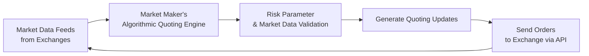

## 30.3 Algorithmic Quoting & Risk Parameters

Market makers often rely on sophisticated computer algorithms to rapidly post bids and offers—a process commonly referred to as “algorithmic quoting.” If you’ve ever sat by your trading screen, marveling at how prices zip around in fractions of a second, you’re basically witnessing these algorithmic quoting engines at work. This entire process is crucial to providing liquidity in the derivatives market, especially when trades need to be completed quickly and at a fair price.

Anyway, let’s walk through how these algorithms operate and the key risk parameters that help them stay on track. I’ll share a few personal anecdotes, too—some from my own experiences and some borrowed from colleagues in the industry—to illustrate how real-time quoting can be, well, quite a ride.

## Understanding Algorithmic Quoting

When we talk about algorithmic quoting, we’re referring to automated systems that continuously generate buy and sell quotes. These quotes reflect the “best guess” of fair value based on incoming data such as stock prices, volatility changes, or other signals from global markets. You’ll often hear folks mention “latency” as though it’s the boogeyman. Latency is basically the delay between an event (like a change in underlying stock price) and the system’s response (like adjusting your option quotes). In high-frequency trading (HFT), a few microseconds can matter big time.

### The Flow of Data and Quotes

If you visualize the flow of information, it might look something like this:

• The process starts with raw market data flowing in from various exchanges.  
• The algorithmic quoting engine processes everything, runs risk checks, then pushes updated bid/ask prices back to the exchange.  
• This cycle repeats continuously—hundreds or thousands of times per second in highly automated setups.

## Key Risk Parameters

Now, you can’t just have your algorithm blindly spit out quotes without some guardrails, right? That’s where risk parameters come in. Market makers program these “guardrails” into their systems to ensure fast but responsible trading decisions. 

### Acceptable Bid-Ask Spreads

As a market maker, you want to post tight spreads (narrow difference between bid and ask) in normal conditions to attract trades. But if volatility spikes or if you sense unusual order flow, you might widen your quotes. This is a bit like adjusting how close you stand to the fire. Too close, you get burned. Too far away, and you don’t get any heat (or in this case, volume). 

• Spreads can be dynamic, shrinking when the market’s calm and expanding when it’s not.  
• Internal logic can factor in external signals or events—like a scheduled earnings announcement.

### Desired Delta Levels

Remember: a market maker with a large inventory of calls or puts in their book can become heavily skewed in one direction. Let’s say you want to maintain a “flat book” so that you’re not too bullish or bearish by accident. That means you might set a parameter for maximum net delta exposure. If your positions breach that threshold, your algorithm automatically shifts quotes to encourage offsetting trades or triggers certain hedges—like shorting or going long the underlying futures. 

### Volatility Assumptions

Options revolve around implied volatility, which is basically the market’s guess about how much the underlying asset can move. If you assume too low a volatility, you might price your options too cheaply. If you assume too high a volatility, you might scare off traders. Most quoting systems have a “vol curve” of sorts that they calibrate daily—sometimes even updating it intraday if the market’s especially jumpy.

### Correlation Factors

You might think: “Um, correlation? Why does that matter?” Actually, correlation between assets can be a big deal. For example, one option might be correlated to an index or to another product in your portfolio. If the correlation shifts unexpectedly, your risk model could start to degrade if it’s not updated. Some advanced systems incorporate real-time correlation adjustments so that the quoting engine adapts to broader market moves—like oil prices unexpectedly influencing a shipping stock, for instance.

### Kill Switches and Circuit Breakers

I remember hearing from a friend who said the scariest moment of his career was when a glitch caused his system to start quoting nonsense prices. He was, you know, pinned to his seat, watching these trades fill at bizarre levels. Kill switches are designed exactly for these kinds of fiascos. They’re like the emergency brake on your trading system. If certain thresholds are exceeded—like your quote deviates 3% from your theoretical model or your exposure surpasses a specified Intraday Risk Limit—Boom! The system automatically stops quoting.

## Tools and Technology

### Exchange APIs and Order Entry

Exchanges like the Bourse de Montréal (for Canadian derivatives) provide application programming interfaces (APIs) that let your system talk directly to their order book. If your algorithmic engine says, “Alright, time to post a 1.25 bid, 1.35 ask on that call,” an API call routes that quote to the exchange in real-time. In high-frequency setups, every microsecond counts. If your ping times are too long, you risk stale quotes. So it’s no surprise that some shops invest big bucks in co-location facilities or specialized network hardware to shave off latency.

### Real-Time Data Scrubbing

Garbage in, garbage out, right? If your incoming feed is mispriced or if there’s a spike that looks suspicious, your quoting engine should have filters that detect anomalies. Let’s say your system sees the underlying trading at $10, but suddenly there’s a ticker print at $100. A naive quoting engine might adjust quotes violently, but a robust system flags it as a data error and ignores it. Some dev teams even build machine-learning models to detect “broken” data prints in real time.

### Open-Source Tools and Implementation Examples

If you’re curious, there are GitHub repositories that show how you can architect a low-latency system using Python’s asyncio or C++ libraries. Just keep in mind that these are often skeleton frameworks, so you’ll need to add your own risk checks and connectivity modules for actual production. Tools like QuickFIX can help handle the financial protocols used by major exchanges.

## Compliance Requirements and Regulatory Oversight

### CIRO Rules on Electronic Trading

Historically, algorithmic trading rules were overseen by IIROC (Investment Industry Regulatory Organization of Canada) for the equity and derivatives markets and the MFDA for mutual funds. However, as of 2023, these bodies have merged into the Canadian Investment Regulatory Organization (CIRO). CIRO continues to provide guidelines on electronic trading and direct electronic access, which includes rules intended to prevent manipulative practices, sudden “spoofing” (placing orders with no intention to fill them), or layering tactics that can distort the market.

You might check out the official site (https://www.ciro.ca/) for the latest Member Notices and bulletins on electronic trading. For instance, if your algorithm posts quotes that repeatedly violate certain standards on “fair and orderly markets,” you could face enforcement action.

### Bourse de Montréal Regulations

The Bourse de Montréal has its own Regulatory Division that publishes bulletins on algorithmic trading (https://www.m-x.ca/regulation_notices_en). These notices usually detail best practices for designing kill switches, daily calibrations, or ensuring your positions don’t exceed exchange-imposed or self-imposed limits. The Bourse can require that you prove your system is tested rigorously under stressed conditions, especially if you’re a designated market maker for certain options classes.

### Cross-Border Considerations

If you’re quoting on U.S. exchanges too, well, the SEC has its own guidelines on market structure, Regulation NMS, etc. Suppose your quoting engine is cross-listed or you’re hedging Canadian positions in the U.S. market. You might want to keep track of how different regulatory frameworks handle “erroneous trades” or market-wide circuit breakers. It’s definitely not a scenario for the faint of heart—there’s lots of detail to keep an eye on.

## Real-World Example of Algorithmic Quoting in Action

Let’s consider a hypothetical scenario: Maple Leaf Volatility Partners is a market-making firm providing liquidity for Canadian energy stocks and their associated options. They set up an algorithmic quoting engine with the following features:

• Volatility feed from multiple data sources  
• Tracking correlation to WTI crude oil and the Canadian dollar  
• A delta threshold that kills the quoting engine if net exposure hits ±$2 million in notional  
• A “twilight zone” spread parameter that widens quotes if volatility jumps by more than 20% within 5 minutes  

During a day with a major interest rate announcement, the algorithm sees a surge in implied volatility. The quotes for a particular call option on an energy stock jump from a typical $0.40–$0.50 range to $0.70–$0.80. Because the new data feed indicates correlation with crude oil just jumped from 0.5 to 0.8, the quoting engine also widens the spread to reflect higher uncertainty. Maple Leaf Volatility Partners manages to avoid huge losses from stale or overly tight quotes—a prime example of real-time risk management in action.

## Best Practices for Algorithmic Quoting

• Validate Your Parametric Updates: Keep an eye out for changes in correlation or implied volatility, especially around earnings releases.  
• Test in a Simulated Environment: Before you flip the switch in the live market, test your kill switches, feed filters, and risk thresholds in a “sandbox” environment.  
• Maintain Strong Compliance: Document how your algorithmic logic complies with CIRO guidelines, especially regarding fair and orderly market rules.  
• Monitor Multiple Data Feeds: Put simply, the more vantage points you have, the less likely you are to be blindsided by a single erroneous data print.  
• Review and Update Your Playbook Regularly: Markets evolve, so your quoting strategies should, too.

## Additional Resources

• The Bourse de Montréal’s Regulatory Division Notices:  
  https://www.m-x.ca/regulation_notices_en  

• CIRO’s website for rules and Member Notices (formerly IIROC bulletins):  
  https://www.ciro.ca/  

• Algorithmic Trading by Ernest P. Chan:  
  Provides insight into building automated strategies, including market-making algorithms.  

• SEC Market Structure Guidance:  
  Though U.S.-focused, these can be helpful for cross-border compliance.  

• GitHub for open-source references:  
  Look for repositories implementing real-time data processing with Python’s asyncio or C++ libraries designed for low-latency trading.

## Conclusion

Algorithmic quoting, combined with well-tuned risk parameters, is the backbone of modern market-making in the derivatives space. These powerful systems let you handle large volumes of orders quickly while still enforcing guardrails that keep your portfolio safe (well, safer) from catastrophic moves. Just be sure that you, your compliance team, and your IT folks are all on the same page—nobody wants to discover that your kill switch never triggered because of a code bug. And yes, it happens.

If you’re someone who loves the blend of math, coding, and finance, exploring algorithmic quoting can be an exciting journey. I still remember the first time I saw a well-oiled algorithmic quoting machine in action—it was mesmerizing. One minute, you’re fiddling with implied vol. The next, your system’s humming out quotes to the tune of hundreds per second, all while adjusting for real-time risk. Like I always say, “Markets can be wild, so better pack a robust algorithm and good risk parameters before diving in.”

---

## Sample Exam Questions: Algorithmic Quoting & Risk Parameters



### Which of the following best describes algorithmic quoting?

- [ ] Posting large “block” orders without price limits.
- [x] Using automated systems to continuously generate bids/offers based on real-time market conditions.
- [ ] Making quotes by hand on the trading floor, updated once a day.
- [ ] Outsourcing all trading decisions to a third-party broker.

> **Explanation:** Algorithmic quoting involves automated systems that adjust quotes in real time, reflecting ongoing changes in markets. This is distinct from manual quotes or large block orders.

### What is the primary purpose of a kill switch in an algorithmic trading system?

- [ ] To increase trading speed beyond what humans can achieve.
- [ ] To switch algorithms when the market is not volatile.
- [x] To shut down trading activity if certain thresholds (like extreme volatility) are reached.
- [ ] To translate quotes into different languages.

> **Explanation:** The kill switch (or circuit breaker) is designed to stop the system from quoting if risk parameters or thresholds are exceeded, preventing runaway losses or unintended exposures.

### In the context of market making, why might a firm widen its bid-ask spreads?

- [x] High volatility or uncertainty in the underlying asset.
- [ ] To attract more aggressive counterparties at any cost.
- [ ] Because regulatory guidelines require wide spreads at all times.
- [ ] In order to provide better price improvement to clients.

> **Explanation:** Firms widen spreads during heightened volatility to compensate for the increased risk of rapid price moves or to reflect uncertainty in fair value.

### Suppose you are running an algorithmic quoting engine with a maximum net delta limit of ±$5 million in notional exposure. What action might the system take if your net delta hits +$5.5 million?

- [x] Automatically reduce quotes or shift quoting to attract more short trades.
- [ ] Immediately buy more calls and puts.
- [ ] Ignore the position since delta is just a meaningless number.
- [ ] Send a regulatory notification and do nothing else.

> **Explanation:** If the net delta limit is exceeded, the system will typically adjust its quoting strategy to bring the exposure back within allowable thresholds, possibly by attracting offsetting trades or hedging in the underlying market.

### What is latency in a high-frequency trading context?

- [ ] A short-term strategy to avoid taxes.
- [ ] A measure of how quickly the Federal Reserve changes interest rates.
- [ ] An algorithmic technique for generating random quotes.
- [x] The time delay between a market event and the system’s response.

> **Explanation:** Latency refers to how quickly a system can detect, process, and respond to market changes—crucial in HFT environments.

### Which of the following tools might a market maker use to integrate exchange order entry with their system?

- [ ] A telegraph machine.
- [x] An API (Application Programming Interface) provided by the exchange.
- [ ] A manual phone call to multiple brokers.
- [ ] Paper and pen transmissions.

> **Explanation:** An API is the standard way for automated systems to send orders and receive confirmations from an exchange.

### Which regulator currently oversees membership and market integrity for investment dealers in Canada (including algorithms for derivatives)?

- [ ] IIROC (Investment Industry Regulatory Organization of Canada), which is still fully active.
- [ ] MFDA (Mutual Fund Dealers Association of Canada), which is still fully active.
- [x] CIRO (Canadian Investment Regulatory Organization).
- [ ] No regulator exists for derivatives in Canada.

> **Explanation:** As of 2023, the MFDA and IIROC merged into the Canadian Investment Regulatory Organization (CIRO), which now oversees investment dealers and market integrity.

### A market maker’s system calculates that implied volatility has jumped 30% in 15 minutes. What might be the immediate response?

- [ ] Do nothing and continue quoting at the old volatility levels.
- [x] Widen the bid-ask spread or increase option premiums to reflect higher uncertainty.
- [ ] Stop quoting entirely for the rest of the day.
- [ ] Sell a large volume of options to force implied volatility down.

> **Explanation:** A large jump in implied volatility typically causes the market maker to adjust quotes, usually by widening the spread or pricing options higher.

### Why is it important to monitor multiple data feeds at once?

- [ ] For purely aesthetic reasons—it looks flashy on the screens.
- [ ] To comply with minimum data usage rules from the Bourse de Montréal.
- [x] To cross-verify market information and avoid reacting to erroneous data prints.
- [ ] Because using fewer data feeds would lower latency.

> **Explanation:** Relying on a single data feed risks basing quotes on faulty or delayed information. Monitoring multiple sources helps confirm accuracy.

### True or False: A kill switch automatically flags suspicious data but generally does not cancel active orders or shut down trading.

- [ ] True
- [x] False

> **Explanation:** A kill switch is specifically designed to cancel all active orders or pause trading when triggered. It’s more than just a flagging mechanism.


