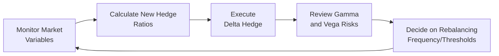

## 30.4 Dynamic Hedging of Option Portfolios

Picture this: You're a market maker sitting at your trading desk before the opening bell, your morning coffee still steaming. You’re looking at a ton of option positions on various equities, indexes, and maybe a few commodities sprinkled in. Your main concern is whether these positions create too much risk in one direction. Will a surprise rate hike or a major earnings miss send your portfolio’s delta through the roof? If so, you’ll either celebrate wildly (if you guessed the direction right) or fret about losing your shirt (if you missed the mark). My guess is you’d rather keep things level and, well, hedge your bets. 

That’s where dynamic hedging comes in. Instead of waiting for large price swings to whipsaw your positions, dynamic hedging means you’re constantly adjusting your hedge ratios—in response to changing market conditions—so that your total portfolio risk stays within your comfort zone. Below, we delve into how dynamic hedging works in practice, focusing on fundamentals like delta-gamma, vega, and scenario analysis, plus sneaking in some personal tips I’ve learned along the way.

  
### The Essence of Dynamic Hedging

At the core, dynamic hedging is about frequently rebalancing your portfolio to maintain a desired risk profile. It’s similar to how an airplane pilot must constantly adjust the plane’s controls to stay on course, especially if turbulence kicks in. Except here, the “turbulence” can be unexpected volatility spikes or sudden price moves in the underlying assets. And the “controls” you’re adjusting might be your position in the underlying, shorting or going long other options, or even dabbling in correlated products like futures or swap agreements to offset risk.

Dynamic hedging isn’t just for big institutions. Individual investors or smaller funds can also employ aspects of it—though at a scaled-down level—to protect their portfolios or create customized payoff profiles. However, the big difference is that market makers and institutional traders often do it intraday, in near real time, thanks to technology-driven algorithms that can scan thousands of positions and calculate hedge ratios at lightning speed.

  
### Understanding the Key Greeks in Dynamic Hedging

Options have “Greeks” that measure sensitivities to various market factors. Here are the main Greeks that matter:

• Delta: Measures how much the option’s price is expected to move relative to a small change in the underlying asset’s price. A delta of +0.50 means if the underlying goes up $1, you’d expect the option’s price to increase by about $0.50, all else being equal. Market makers generally use delta hedging to reduce directional exposure.

• Gamma: Tells you how much the option’s delta changes with a one-point move in the underlying. Gamma is basically your second derivative of price. High gamma can mean big changes in delta if the underlying moves more than a bit, which can amplify or reduce your directional risk quickly.

• Vega: Reflects sensitivity to changes in implied volatility. If your portfolio is vega positive, it benefits from an increase in implied volatility; if it’s vega negative, your P&L might sag if implied volatility rises unexpectedly. 

• Theta: Measures the time decay of an option. Options lose time value every day, which can work in your favor if you’re net short options, but it also can whittle away your profits if you’re a net option buyer.

• Rho: Tied to interest rate changes. In practice, many equity option traders don’t pay as much attention to rho day to day, but it can matter significantly for interest-rate-based derivatives like bond futures and interest rate options.

For dynamic hedging, delta, gamma, and vega usually take center stage. Delta tells you how many units of the underlying you’re effectively holding. Gamma suggests how quickly your delta changes if the market moves, meaning you might need to rebalance more often in higher-gamma scenarios. And vega helps you handle the volatility risk.  

  
### Why Gamma Makes Hedging More “Dynamic”

Imagine you’ve sold a bunch of calls on a stock that you don’t currently own. If the stock rises quickly, your net short delta becomes quite painful. But wait—your short call positions also carry negative gamma. As the stock price goes up, your short delta becomes even larger because the option deltas approach 1. That means if you were originally short 500 calls, you might be forced to buy shares to hedge your newly expanded delta exposure. But if the stock keeps rallying, guess what—you might have to buy even more shares to stay delta neutral. This forced buying can become frenzied if volatility spikes. Basically, gamma intensifies your need to hedge in real time.

  
### Practical Example: Delta-Gamma Hedging

Let’s say you run a relatively small options book with a net negative delta of –1,000 (meaning you effectively need to buy 1,000 shares of the underlying to become delta neutral). That negative delta could come from short calls, or maybe a combination of bull puts and short calls with some offsetting long positions. Additionally, your net gamma might be –200 (for a one-point move in the underlying), which means that if the underlying price goes up by 1, your delta will shift by –200, making you more short as the market rises. That –1,000 delta might balloon to –1,200 after a one-point upward move. 

So if the market moves up half a point in the morning, you might decide, “I want to reduce my negative delta. Let’s buy 500 shares.” Then if the market continues rallying, you buy another 500 shares to neutralize that extra portion of negative delta. This is the dynamic aspect—constantly adjusting as the day unfolds. By doing so, you limit your downside from big moves in the underlying. However, the cost is more transactions, more commissions, and potentially slippage on your trades.

  
### Vega Hedging: Neutralizing Volatility Exposure

Vega tends to get less fanfare in the everyday conversation compared to delta, but it’s crucial for institutional market makers who carry large books. They might have a mound of short straddles or short strangles or maybe a long position in calls and puts. 

If your net vega is highly positive and you suspect implied volatility might drop—perhaps because an earnings event is over or a big economic report turned out to be a nonevent—you could hedge by shorting options in the same underlying but different strikes or expiries. Or you might use a volatility swap (an over-the-counter product that pays out based on the realized volatility of an underlying asset) to offset that exposure. 

An easy mental image is to think of vega as a lever on the entire implied volatility curve of your positions. When you’re short volatility, you might be collecting option premiums hoping the implied vol doesn’t spike. But sometimes you want to flatten your vega, especially if you sense risk events on the horizon—like big central bank announcements or major geopolitical happenings.

  
### Continuous Rebalancing and Electronic Platforms

In the old days, you might manually re-hedge your delta or gamma once or twice a day. With electronic trading and advanced algorithms, market makers can re-hedge in near real time. This near-continuous rebalancing certainly sounds like a dream come true if you’re hoping to keep your risk at an exact line—in theory, it’s possible to be “perfectly” delta-hedged at any second.  

But in real life, continuous rebalancing has pitfalls:

• Transaction Costs: Every time you buy or sell to neutralize your risk, you pay commissions and face bid-ask spreads. Too many trades can erode profits from your market-making edge.  
• Market Impact: Large continuous trades might push the market against you, especially in less liquid underlyings.  
• System Complexity: Automated systems require robust coding, rigorous testing, and constant monitoring for logic errors or connectivity problems.

So while re-hedging every moment might appear theoretically great, in practice, it sometimes feels like you’re overfishing your own pond. Many desks thus adopt “discrete rebalancing,” meaning they re-hedge at certain thresholds (like every 50 deltas or with every 1% move in the underlying) instead of every tick.

  
### Scenario Analysis and Stress Testing

Dynamic hedging isn’t only about normal day-to-day moves. It’s also about preparing for the “what if” scenarios: tail events, major news bombs, or an overnight meltdown in some distant global market that bleeds into your product’s opening. Stress testing is how you gauge the potential hits.

For example:
• You test your portfolio’s P&L if your main underlying drops 10% in one day. 
• You look at what happens if implied volatility shoots higher by 15 points. 
• You consider interest rate changes if you have a big position in bond futures options.

These scenario analyses can highlight how quickly your gamma or vega positions might become untenable—and whether you need to have circuit breakers in place to exit or scale back. I have a friend who used to place wide “catastrophe” limit orders in the underlying overnight, just in case a meltdown happened before he could manually respond in the morning. It’s a small anecdote, but it highlights how serious these market shocks can be when gamma goes wild.

  
### Regulatory Requirements and Risk Controls

Market makers usually have to meet certain obligations to maintain orderly markets. In Canada, the Bourse de Montréal sets out guidelines on how market makers should quote options and how they manage their risk. They also must comply with CIRO’s risk management oversight—CIRO being the national self-regulatory body born from the consolidation of the former IIROC and MFDA. 

From a regulatory standpoint, the focus is on ensuring you don’t become a systemic risk or cause disruptions if your dynamic hedging goes haywire. Firms must demonstrate they have robust policies, procedures, and technological safeguards (e.g., kill switches that automatically cut off trading if an account hits a certain loss threshold). 

There’s also an expectation that risk managers use scenario testing and maintain capital buffers for tail events. Some of these guidelines can be found in Bourse de Montréal’s educational resources (https://www.m-x.ca/) and CIRO’s compliance guides (https://www.ciro.ca).

  
### Cost-Benefit Analysis of Dynamic Hedging Frequency

Now, let’s talk about your wallet. The more you hedge, the more your transaction costs add up. Every time you adjust your underlying or option positions, you’re paying spreads or commissions, plus slippage. So there is a trade-off:

• Frequent Rebalancing: You keep your risk profile stable, but you rack up higher costs and possibly push the market.  
• Less Frequent Rebalancing: You save on costs but may face bigger P&L swings if you get caught on the wrong side of a sudden market move.

In reality, traders use sophisticated quantitative models, sometimes in Python with libraries like NumPy, Pandas, or QuantLib, to run simulations. They might say: “If the underlying moves more than X standard deviations, re-hedge. If the cost of the trade is more than Y, maybe skip it.” It’s basically a cost-benefit puzzle that requires analyzing both historical and implied volatility data, plus real-time order book conditions.  

  
### Tail Events and Circuit Breakers

One topic that can’t be ignored in dynamic hedging is what happens when volatility is so high that hedging becomes extremely expensive or next to impossible. Think of extreme circumstances like the 1987 Black Monday crash, the 2008 financial crisis, or more recently, the pandemic market meltdown in early 2020. 

During these times, implied volatilities can skyrocket. If you’re carrying a huge negative vega position, the cost to buy back that volatility can be eye-popping. Sometimes, limit-up or limit-down halts in futures or exchange circuit breakers give you a brief respite. But a short halt might not be enough if you can’t source liquidity at a reasonable price.

That’s why many sophisticated desks keep “disaster hedges” in the form of out-of-the-money options or other instruments that pay off in extreme tail scenarios. It’s not about making money in normal times. It’s about capping your negative gamma or vega blowout if the unthinkable happens.

  
### Real-World Anecdotes

I recall a time when I was half asleep at my desk (it happens!) and saw a sudden price spike in a biotech stock that was a big chunk of my options inventory. I was net short calls and short gamma, so I looked at my risk monitor, and my negative delta blew up in my face within minutes. The solution was to buy back some calls in the nearest monthly expiry. The price was high, but it was cheaper than letting the position run wild. That single episode taught me that waiting too long to rebalance can cost a lot more than a few humdrum round-trip commissions. 

Conversely, I’ve also had days where the market churned sideways all session, and my repeated micro-hedges felt like someone was constantly nicking away at my profits. By the closing bell, I realized I’d done 20 round turns and paid a decent chunk in commissions, with little to show for it. So, you know, there’s this constant balancing act.

  
### Tools and Frameworks for Dynamic Hedging

If you’re serious about dynamic hedging, here are a few categories of resources:

• Electronic Execution and Market Data: Tools that allow you to connect to the exchange (e.g., the Bourse de Montréal for Canadian derivatives) to get real-time quotes and execute trades quickly.  
• Option Analytics Software: Commercial solutions like Bloomberg or specialized platforms that manage your Greeks in real time, or open-source libraries like QuantLib in Python.  
• Regulatory Guides: Keep an eye on CIRO’s directives about derivatives risk management and reporting obligations, as well as Bourse de Montréal’s guidelines for market makers. For cross-border trading, you might also want to glance at the Commodity Futures Trading Commission (CFTC) guidelines in the U.S.  

  
### Balancing Risk Management and Profit Potential

All said, dynamic hedging isn’t a magic bullet. It reduces your directional or volatility risk, but it comes at a cost. You’ll never be perfectly hedged all the time (unless you turn your entire trading day into one continuous hedge spree—but that’s neither feasible nor cost-effective). The best approach is to figure out your risk tolerance, set triggers for rebalancing, maintain enough capital to handle a drawdown, and use scenario and stress tests to plan for extreme events.

Despite the complexities, dynamic hedging is a cornerstone of professional option trading. It helps ensure that even if you’re short calls and the next Tesla or Shopify rockets 30% after some big announcement, you’ve got a plan—and a system!—to protect your capital. Or at least, to avoid complete catastrophe.  

  
### Additional Resources for Exploration

Below is a short list of resources if you want to take a deeper dive:

• Review guidance on dynamic hedging within Bourse de Montréal best practices seminars:  
  – https://www.m-x.ca/

• CIRO compliance resources for derivatives risk management, including frameworks for dynamic hedging oversight:  
  – https://www.ciro.ca

• “Dynamic Hedging: Managing Vanilla and Exotic Options” by Nassim Nicholas Taleb – an advanced text delving into options hedging. (Heads up, it’s dense and might challenge your math skills!)  

• The Commodity Futures Trading Commission (CFTC, U.S.) guidelines for algorithmic and dynamic hedging at scale, which can offer a cross-border perspective:  
  – https://www.cftc.gov

• Python libraries like NumPy, Pandas, Matplotlib, and QuantLib for building your own dynamic hedging algorithms and scenario simulations. There are plenty of open-source examples on GitHub for risk analytics.  

  
### Visualizing the Dynamic Hedging Cycle

A simple flowchart can show the iterative nature of dynamic hedging. This is obviously an oversimplification, but it demonstrates how hedging is a cycle that repeats throughout the trading day:

In practice, these steps can happen almost simultaneously if you have an automated system. If you’re a more “old-school” trader, you might be doing them manually each hour or whenever you see a significant market move.

  
### Final Thoughts

Dynamic hedging is a dance—an ongoing push and pull between mitigating risk and leaping at opportunities. It feels a bit like juggling. You’ve got your delta in one hand, gamma in another, and vega bouncing around behind your back, and if you drop any one piece, you risk a painful P&L slip. Market makers sharpen these skills daily, making sure they can provide liquidity without setting themselves up for catastrophic losses. With the right tools, a solid plan, proper rebalancing thresholds, plus a keen awareness of upcoming market events, you can dynamically hedge your positions in a way that helps you stay in the game for the long haul.

  
## Sample Exam Questions: Dynamic Hedging of Option Portfolios



### Dynamic Hedging Frequency

- [ ] Re-hedging once a month is always optimal.
- [x] More frequent hedging reduces directional risk but can increase costs.
- [ ] Dynamic hedging completely eliminates market risk.
- [ ] Over-hedging guarantees higher profits.

> **Explanation:** Frequent hedging helps control directional risk but can result in significantly higher transaction costs. Dynamic hedging reduces, but does not eliminate, market risk.

### Gamma Considerations

- [x] Negative gamma can force traders to adjust their hedges more frequently in a rising market.
- [ ] Positive gamma correlates to less frequent rebalancing needs.
- [ ] Gamma sensitivity is disconnected from changes in the underlying price.
- [ ] Gamma is ignored in dynamic hedging.

> **Explanation:** Negative gamma means your short delta exposure tends to increase as the underlying price rises (or falls). This “negative convexity” generally prompts frequent rebalancing to maintain neutrality.

### Vega Hedging

- [ ] Vega hedging is unnecessary for most traders.
- [x] Vega hedging involves offsetting volatility exposure to manage P&L swings due to changes in implied volatility.
- [ ] Vega only matters for equity index options.
- [ ] A negative vega position gains if implied volatility rises.

> **Explanation:** Vega hedging is vital if implied volatility changes can significantly affect your portfolio’s value. Managing vega can involve selling options in different strikes or maturities, or using products like volatility swaps.

### Continuous Rebalancing

- [ ] Is always preferable to discrete rebalancing because transaction costs are negligible.
- [ ] Does not require technology or advanced analytics.
- [x] Can increase transaction costs and complexity, urging many traders to rebalance at selected thresholds.
- [ ] Eliminates gamma risk entirely.

> **Explanation:** Continuous rebalancing keeps your delta (and gamma) exposures tightly in check, but the resulting trade expenses and execution challenges can outweigh the benefits. Traders often choose discrete rebalancing intervals.

### Impact of Tail Events

- [ ] Tail events rarely affect option portfolios.
- [ ] Stress testing is optional if you have gamma hedged.
- [ ] Tail events have no impact on the cost-benefit analysis of hedging.
- [x] Stress testing helps anticipate potential large drawdowns if extreme moves occur.

> **Explanation:** Dynamic hedging might work well in normal conditions, but large market shocks can suddenly change implied vol and liquidity. Stress testing prepares traders to handle these extreme scenarios.

### Regulatory Oversight

- [ ] In Canada, there are no special guidelines for dynamic hedging.
- [ ] CIRO only oversees currency derivatives, not equity options.
- [x] CIRO demands robust risk controls and capital guidelines for market makers, including scenario analysis.
- [ ] The Bourse de Montréal does not require market makers to manage hedging effectively.

> **Explanation:** Under CIRO regulations and Bourse de Montréal guidelines, market makers must prove they are not posing excessive systemic risk. They need processes for dynamic hedging, stress testing, and scenario analysis.

### Balancing Transaction Costs

- [x] A major consideration is ensuring that hedge adjustments do not overly erode profits.
- [ ] Transaction costs are minimal and rarely factor into hedging decisions.
- [ ] Regulatory bodies subsidize all transaction costs.
- [ ] Hedging more often is always better financially.

> **Explanation:** Dynamic hedgers must weigh transaction costs (commissions, bid-ask spreads, and slippage) against the risk-reduction benefits. Hedging continuously without cost considerations can destroy profitability.

### Disaster Hedges

- [ ] Are unnecessary if you only trade small option positions.
- [x] Can protect against extreme market moves and liquidity halts.
- [ ] Guarantee zero losses in any market event.
- [ ] Always reduce transaction costs significantly.

> **Explanation:** Disaster hedges, sometimes using out-of-the-money options, help cap potential losses in extreme moves. They don’t guarantee zero losses, but they can prevent catastrophic blowouts when volatility skyrockets.

### Automated Systems

- [ ] Eliminate all human error and risk from hedging.
- [ ] Are too slow to use in fast-moving markets.
- [x] Enable near-continuous monitoring of Greeks, but demand robust coding and oversight.
- [ ] Make stress testing unnecessary.

> **Explanation:** Algorithmic or auto-hedging can quickly analyze changing deltas and gammas, though it introduces complexity and the need for technical failsafes. Human judgment and stress tests remain vital.

### True or False: Dynamic Hedging Eliminates All Risk

- [ ] True
- [x] False

> **Explanation:** Dynamic hedging seeks to manage and reduce risk exposures. It does not completely eliminate them. Tail events, transaction costs, and suddenly shifting markets can still generate significant losses if not carefully managed.


